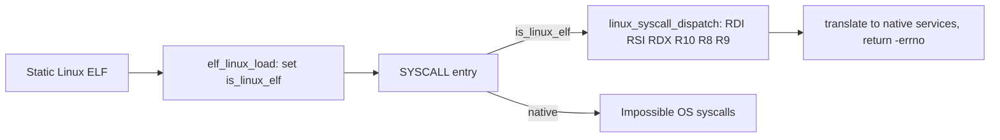

<!-- docs: covers=todo/10-platform-services/TODO-10-linux-compat.md sources=src/kernel/exec.c,src/kernel/sched/syscall_fast.c,include/kernel/elf.h,src/kernel/elf.c,src/kernel/sched/task.c,src/kernel/sched/syscall.c,include/kernel/sched/syscall.h,include/kernel/vectors.h,include/kernel/ipc/signal.h,src/kernel/ipc/signal.c,include/kernel/task_limits.h reviewed=2026-09-29 order=10 -->
# Linux ELF Compatibility

## What is it?

The Linux compatibility layer will let statically linked Linux x86-64 programs such as busybox and musl builds run unmodified on Impossible OS, in the kernel and without a virtual machine: "WSL in reverse". It needs a Linux system call table, path translation from `/home` and `/tmp` to Windows paths, a per-process integer file descriptor table, and signals. None of its eleven sections has shipped. The kernel already loads ELF programs and builds a Linux-style start-up stack for them, but those programs use Impossible OS's own system calls, not Linux's.

## How does it work?

**Today.**

- **ELF loading.** `elf_load()` validates an ELF64 x86-64 image and maps its `PT_LOAD` segments ([`elf.h`](../../include/kernel/elf.h), [`elf.c`](../../src/kernel/elf.c)). It is one of three formats `exec_init()` registers, beside EIF and PE, and the loader is picked by magic bytes; the registry is sealed at the end of `exec_init()`, so a new loader cannot be added at run time ([`exec.c`](../../src/kernel/exec.c)).
- **SYSV start-up stack.** Every exec already gets a Linux x86-64 style initial stack: `argc`, `argv`, an empty `envp` and an auxiliary vector with `AT_PHDR`, `AT_PHENT`, `AT_PHNUM`, `AT_PAGESZ`, `AT_ENTRY`, user and group IDs of 0, 16 random bytes for `AT_RANDOM` and CPU feature bits in `AT_HWCAP` ([`task.c`](../../src/kernel/sched/task.c)). The roadmap's section 2 is therefore partly done, in the generic exec path rather than a compat module.
- **System calls.** `INT 0x80` is wired (`VECTOR_LINUX_SYSCALL` in [`vectors.h`](../../include/kernel/vectors.h)), but it dispatches Impossible OS's own numbering: `SYS_WRITE` is 1, `SYS_READ` is 2 and `SYS_EXIT` is 3 ([`syscall.h`](../../include/kernel/sched/syscall.h)), where Linux has `read` 0 and `write` 1. So "Linux-style" today means only the vector. The `SYSCALL` instruction goes somewhere else again: it dispatches into the NT service table (SSDT) and stores a Win32 error in the thread's TEB on failure ([`syscall_fast.c`](../../src/kernel/sched/syscall_fast.c)).
- **Signals.** `signal_send()`, `signal_send_group()` and `signal_ctrl_c()` queue a signal, and `SYS_SIGNAL` (34) registers a handler ([`signal.h`](../../include/kernel/ipc/signal.h)). Nothing calls `signal_check()` yet, so a pending signal is never delivered, and there are no Linux `rt_sigaction`, `sigreturn` or user-mode signal frames.

**Planned design.**

1. **Per-task state.** An `is_linux_elf` flag, a 256-entry fd table, a `brk` region and 32 signal handler slots in the task.
2. **Loader.** `elf_linux_load()` for static binaries only; a `PT_INTERP` (dynamic linker) request returns `ENOEXEC`.
3. **Dispatch.** The syscall entry branches on the flag before touching arguments, because Linux passes them in `RDI`, `RSI`, `RDX`, `R10`, `R8`, `R9`.
4. **About 30 translated calls.** File I/O (`read`, `write`, `open`, `close`, `lseek`, `stat`, `fstat`, `getdents64`), process (`exit`, `getpid`, `getuid`, `arch_prctl`, `uname`), memory (`brk`, `mmap`, `munmap`, `mprotect`) and a few more (`ioctl`, `writev`, `clock_gettime`, `nanosleep`, `getrandom`).
5. **Paths.** `/home` to `C:\Users\Default`, `/tmp` to `C:\Temp`, `/bin` to `C:\Impossible\Bin`, plus synthesised `/proc/self/maps`, `/dev/null` and `/dev/urandom`.
6. **Files, directories and signals.** fd `dup` and `dup2` with standard streams pre-opened, `opendir` and `getcwd`, and `rt_sigaction` with `SIGINT`, `SIGCHLD`, `SIGKILL` and `SIGTERM`.
7. **Shell and tests.** A `[Linux]` tag in the process list, then a static hello world and busybox (`ls`, `cat`, `echo`, `grep`, `sh`).

## What are its interfaces?

| Interface | Status |
| --- | --- |
| `elf_load()`, `exec_load_fmt()`, SYSV initial stack and auxv | Shipped |
| `INT 0x80` (native `SYS_*` numbers) and `SYSCALL` (NT services) entry | Shipped |
| `signal_send()`, `signal_ctrl_c()`, `SYS_SIGNAL` | Shipped; delivery not wired |
| `elf_linux_load()`, `linux_syscall_dispatch()`, `linux_syscall_table[]` | Planned |
| `linux_path_to_win32()`, Linux fd table, `rt_sigaction` | Planned |

## How do I use it?

Nothing Linux-specific can run yet: a real Linux binary would issue Linux system call numbers that the kernel reads as its own. The ELF path itself is used by every program on the system disk, and `make test-exec` covers magic routing and ELF segment validation.

## What is not implemented yet?

- [Linux Flags and FD Table](../../todo/10-platform-services/TODO-10-linux-compat.md#1-task_t-linux-flags--fd-table-sonnet) and the [ELF Linux Loader](../../todo/10-platform-services/TODO-10-linux-compat.md#2-elf-linux-loader-sysv-stack--auxv-opus) (the stack and auxv part already runs for every exec)
- [Syscall Entry Dispatch](../../todo/10-platform-services/TODO-10-linux-compat.md#3-syscall-entry-dispatch-is_linux_elf-branch-opus) and the [Linux Syscall Translation Table](../../todo/10-platform-services/TODO-10-linux-compat.md#4-linux-syscall-translation-table-sonnet)
- [Path Translation](../../todo/10-platform-services/TODO-10-linux-compat.md#5-path-translation-sonnet), the [Linux File Descriptor Table](../../todo/10-platform-services/TODO-10-linux-compat.md#6-linux-file-descriptor-table-sonnet) and [POSIX Filesystem Stubs](../../todo/10-platform-services/TODO-10-linux-compat.md#7-posix-filesystem-stubs-sonnet)
- [Signal Stubs](../../todo/10-platform-services/TODO-10-linux-compat.md#8-signal-stubs-opus), which also need the native signal delivery owned by the [process model roadmap](../../todo/02-kernel-core/TODO-21-process-model-extensions.md)
- [Shell ELF Integration](../../todo/10-platform-services/TODO-10-linux-compat.md#9-shell-elf-integration--linux-process-tag-sonnet) and the [busybox test](../../todo/10-platform-services/TODO-10-linux-compat.md#10-test-static-hello--busybox-sonnet)
- [Dynamic ELF](../../todo/10-platform-services/TODO-10-linux-compat.md#11-future-dynamic-elf-stretch-opus), a stretch goal

## How does it compare with Windows 11 and Linux?

Windows 11 runs Linux programs through WSL 2, a real Linux kernel in a lightweight virtual machine with its own disk image; the original WSL 1 translated system calls in the kernel much as this plan does. Linux runs its own binaries natively. The Impossible OS plan is WSL 1 in shape: static ELF binaries share the scheduler, memory manager and file system with Win32 programs, with no hypervisor and no separate disk. Dynamic linking is left to a later stretch.

## See also

- [Linux ELF Compatibility Layer roadmap](../../todo/10-platform-services/TODO-10-linux-compat.md)
- [Binary Format System](../kernel/binary-format-system.md)
- [Process Model Extensions](../kernel/process-model-extensions.md)
- [Exception Dispatch and SEH](../kernel/exception-dispatch-seh.md), whose fault-to-signal step waits on this roadmap
- [Win32 PE Loader](win32-pe-loader.md)
