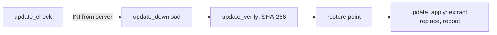

<!-- docs: covers=todo/10-platform-services/TODO-03-updates-packages.md sources=src/libs/miniz/miniz.h,src/libs/PROVENANCE.md,include/kernel/crypto/sha256.h,src/libs/monocypher/monocypher.h,include/registry.h,include/boot/ab_boot_metadata.h,src/kernel/net reviewed=2026-09-29 order=3 -->
# System Updates and IPKG Packages

## What is it?

This roadmap makes Impossible OS maintain itself: an update client that checks a server, downloads an update, verifies its SHA-256 hash and applies it after taking a restore point, and a package format, `.ipkg`, with an installer, an uninstaller and the Programs and Features applet (`appwiz.cpl`). None of its nine sections has shipped. Several libraries it will use are already in the tree, but the network stack has no TCP yet, so nothing can be downloaded.

## How does it work?

**Today.** No update or package code exists. The pieces the plan will build on:

- **ZIP.** The miniz library is vendored in [`src/libs/miniz/`](../../src/libs/miniz/miniz.h) (MIT licence, recorded in [`PROVENANCE.md`](../../src/libs/PROVENANCE.md)), but it is not built into the kernel yet and there is no kernel ZIP API around it. The wrapper is owned by the [Recycle Bin, ZIP and Task Scheduler](../desktop/recycle-bin-zip-scheduler.md) roadmap.
- **Hashing and signatures.** `sha256()` and its init, update and final calls ([`sha256.h`](../../include/kernel/crypto/sha256.h)), and the vendored Monocypher for Ed25519 verification and constant-time compare ([`monocypher.h`](../../src/libs/monocypher/monocypher.h)).
- **Registry.** The Win32-named API in [`registry.h`](../../include/registry.h): `RegCreateKeyEx()`, `RegSetValueEx()`, `RegGetString()`, `RegDeleteTree()` and friends.
- **A/B boot slots.** The slot metadata and selection in [`ab_boot_metadata.h`](../../include/boot/ab_boot_metadata.h), which a whole-image update would switch; see [A/B Boot and Rollback](../boot/ab-boot-rollback.md).
- **Network.** [`src/kernel/net/`](../../src/kernel/net) has Ethernet, ARP, IPv4, ICMP, UDP and DHCP only. HTTP and TLS are owned by the [networking roadmaps](../networking/index.md).

**Planned design.**

1. **Update check.** `update_check()` fetches a small INI file and compares its version with the installed one.
2. **Download and verify.** `update_download()` streams the package to disk with progress, and `update_verify()` refuses it unless its SHA-256 matches.
3. **Apply.** `update_apply()` takes a restore point first, extracts the package and replaces files, then reboots.
4. **`wuapp.cpl`.** Check now, an automatic check at boot with a notification, and an update history list.
5. **IPKG format.** A plain ZIP holding `manifest.ini` (name, version, publisher, size), `install.ini` (what to copy, which shortcuts and file associations to create) and a `files/` tree.
6. **Installer wizard.** Four pages (welcome, path, progress, finish) behind an elevation prompt, with a restore point before any change.
7. **Uninstaller.** Replays `install.ini` in reverse and removes directories only when they are empty.
8. **`appwiz.cpl`.** The installed-app list with search and an Uninstall button.
9. **`ipkg_create`.** A host tool that packs a directory into an `.ipkg` and generates its manifest.

## What are its interfaces?

| Interface | Status |
| --- | --- |
| `update_check()`, `update_download()`, `update_verify()`, `update_apply()` | Planned |
| `.ipkg` layout, `installer_open()`, uninstaller | Planned |
| `tools/ipkg_create.c` | Planned |
| `sha256()`, Monocypher, `Reg*()` Registry calls | Shipped |
| miniz | Vendored, not built |
| New syscalls | None planned; everything goes through the VFS, network, ZIP and crypto layers |

## How do I use it?

There is nothing to run yet. The server side of updates (feeds, channels and signing) is planned separately in the [update server roadmap](../../todo/15-installer-release/TODO-03-update-server.md).

## What is not implemented yet?

- [Update Check API](../../todo/10-platform-services/TODO-03-updates-packages.md#1-update-check-api-sonnet), which needs the HTTP client from the [HTTP and TLS roadmap](../../todo/07-networking/TODO-03-http-tls.md)
- [Update Download and Verification](../../todo/10-platform-services/TODO-03-updates-packages.md#2-update-download--verification-sonnet) and [Update Application](../../todo/10-platform-services/TODO-03-updates-packages.md#3-update-application-sonnet), which needs restore points from [System Restore and Recovery](restore-recovery.md)
- [`wuapp.cpl`](../../todo/10-platform-services/TODO-03-updates-packages.md#4-wuappcpl----windows-update-applet-sonnet)
- [IPKG Package Format](../../todo/10-platform-services/TODO-03-updates-packages.md#5-ipkg-package-format-sonnet), [App Installer Wizard](../../todo/10-platform-services/TODO-03-updates-packages.md#6-app-installer-wizard-sonnet) and [App Uninstaller](../../todo/10-platform-services/TODO-03-updates-packages.md#7-app-uninstaller-sonnet)
- [`appwiz.cpl`](../../todo/10-platform-services/TODO-03-updates-packages.md#8-appwizcpl----programs--features-applet-sonnet)
- [IPKG Build Tool](../../todo/10-platform-services/TODO-03-updates-packages.md#9-ipkg-build-tool-host-sonnet)

The Registry layout for installed apps is not settled: this roadmap writes `HKLM\SOFTWARE\{name}`, the [Control Panel roadmap](../../todo/09-desktop-shell/TODO-11-control-panel.md) reads the Windows `Uninstall` key, and the update server roadmap assumes a third layout.

## How does it compare with Windows 11 and Linux?

Windows Update downloads signed cabinet and WIM packages and services them with component-store rollback, and apps install through MSI databases or third-party installers. Linux distributions use apt or dnf with GPG-signed repositories and `.deb` or `.rpm` packages, usually with no atomic rollback. The Impossible OS plan uses a readable INI manifest inside an ordinary ZIP, a SHA-256 gate, and an explicit restore point before every update or install. None of it exists yet.

## See also

- [System Updates and IPKG Package Manager roadmap](../../todo/10-platform-services/TODO-03-updates-packages.md)
- [System Restore, Recovery and Observability](restore-recovery.md)
- [Recycle Bin, ZIP and Task Scheduler](../desktop/recycle-bin-zip-scheduler.md)
- [CNG Crypto and Certificate Store](../desktop/cng-crypto.md)
- [A/B Boot and Rollback](../boot/ab-boot-rollback.md)
