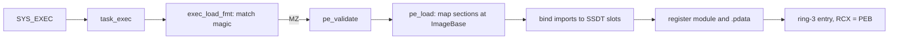

<!-- docs: covers=todo/10-platform-services/TODO-07-win32-pe-loader.md sources=src/kernel/pe.c,include/kernel/pe.h,src/kernel/exec.c,include/kernel/exec.h,src/kernel/sched/syscall_fast.c,src/kernel/sched/syscall_entry.asm,include/kernel/gdt.h,src/kernel/test/test_exec.c,user/test/test_loader_pe.c reviewed=2026-09-29 order=7 -->
# Win32 PE Loader

## What is it?

The PE loader is what lets Impossible OS run Windows programs natively: it reads a 64-bit PE32+ executable, maps its sections into a new process, binds its imports and starts it in user mode. The kernel half already works for simple images: validation, fixed-base section mapping and import binding ship today. What is missing is the user-mode half that makes a compiled Windows program actually run: relocations, imports that can be called, and a Windows C runtime. This roadmap's nine sections are all still open; the kernel pieces shipped under the [Binary Format System](../kernel/binary-format-system.md) roadmap instead.

## How does it work?

**Today.** A file reaches the loader through the ordinary exec path: `SYS_EXEC` runs `task_exec()`, which reads the file and hands it to `exec_load_fmt()`. That picks the loader by the file's magic bytes: `7F ELF` for ELF, `EIF!` for [EIF](../kernel/eif-executable-format.md) and `MZ` for PE ([`exec.c`](../../src/kernel/exec.c)). There is no "PE first, ELF second" probing; each format is recognised by its own header.

- **Validation.** `pe_validate()` accepts only AMD64 (`0x8664`) images with a PE32+ optional header (`0x20B`); 32-bit images are rejected ([`pe.c`](../../src/kernel/pe.c), structures in [`pe.h`](../../include/kernel/pe.h)).
- **Mapping.** `pe_load()` maps the headers and each section page by page at the image's own `ImageBase`, zero-fills uninitialised data, marks non-code sections no-execute, and rolls everything back on failure. Limits: `ImageBase` at least 16 MiB, up to 96 sections and a 256 MiB mapped image. The file itself is capped lower: `SYS_EXEC` stages it in kernel heap and refuses anything over 512 KiB (`EXEC_KMALLOC_STAGE_MAX`); the 16 MiB `EXEC_MAX_IMAGE_SIZE` bounds only what the format dispatcher accepts ([`exec.h`](../../include/kernel/exec.h)).
- **Imports.** The import directory is walked for up to 64 DLLs and 4,096 names each. A by-name import found in a built-in table is written into the IAT as that function's **SSDT service number**, not as an address; anything else, including every import by ordinal, is written as 0.
- **Exception data.** The `.pdata` table is recorded with the module so [kernel exception dispatch](../kernel/exception-dispatch-seh.md) can unwind through it, and the module is added to the PEB loader lists.
- **Launch.** The new thread enters ring 3 with RCX pointing at the [PEB](../kernel/peb-teb-user-abi.md).

**System calls.** The `SYSCALL` fast path is already set up: `STAR`, `LSTAR` and `FMASK` are programmed in [`syscall_fast.c`](../../src/kernel/sched/syscall_fast.c) with the entry stub in [`syscall_entry.asm`](../../src/kernel/sched/syscall_entry.asm), and the GDT already puts user data (`0x18`) just below user code (`0x20`), the order `SYSRET` needs ([`gdt.h`](../../include/kernel/gdt.h)). `INT 0x80` and `INT 0x2E` still work too.

## What are its interfaces?

| Interface | Status |
| --- | --- |
| `pe_validate()`, `pe_load()`, PE32+ structures in `pe.h` | Shipped |
| Built-in import tables for `kernel32.dll` (14 names) and `ntdll.dll` (96 `Nt*` names) | Shipped; see [Win32 API Surface](win32-api-surface.md) |
| `SYSCALL`/`SYSRET` entry, `STAR`/`LSTAR`/`FMASK` | Shipped |
| Base relocations, ASLR | Planned |
| TLS directory, delay-load and bound imports, ordinal imports | Not handled |
| `crt0_pe.asm`, `kernel32_stub.c`, `libcrt.a` | Planned |

## How do I use it?

The loader is exercised by the kernel suite (`make test-exec`, which checks PE structure sizes, validation of good and bad images, section mapping, module registration and the `ImageBase` floor in [`test_exec.c`](../../src/kernel/test/test_exec.c)) and by a hand-assembled PE that exits with status 0 ([`test_loader_pe.c`](../../user/test/test_loader_pe.c)). A normal compiled Windows program cannot run yet: its calls through the IAT would jump to a service number or to 0.

## What is not implemented yet?

- [Fix Ring-3 User-Mode Execution](../../todo/10-platform-services/TODO-07-win32-pe-loader.md#1-fix-ring-3-user-mode-execution-opus): the MSR setup and GDT order are done; PE programs using `SYSCALL` directly is not yet proven
- [Windows x64 Syscall ABI](../../todo/10-platform-services/TODO-07-win32-pe-loader.md#2-windows-x64-syscall-abi-sonnet)
- [PE Header Structures](../../todo/10-platform-services/TODO-07-win32-pe-loader.md#3-pe-header-structures-sonnet) and [PE Loader Core](../../todo/10-platform-services/TODO-07-win32-pe-loader.md#4-pe-loader-core-sonnet): shipped in `pe.h` and `pe.c`, except loading at a fallback base
- [Base Relocations](../../todo/10-platform-services/TODO-07-win32-pe-loader.md#5-base-relocations-sonnet)
- [Import Resolution](../../todo/10-platform-services/TODO-07-win32-pe-loader.md#6-import-resolution-sonnet): callable stubs instead of service numbers, and a clean failure for a missing import
- [PE Execution](../../todo/10-platform-services/TODO-07-win32-pe-loader.md#7-pe-execution-opus), [EXE Format Precedence](../../todo/10-platform-services/TODO-07-win32-pe-loader.md#8-exe-format-precedence-sonnet) and the [Minimal User-Mode Runtime](../../todo/10-platform-services/TODO-07-win32-pe-loader.md#9-minimal-user-mode-runtime-sonnet)

## How does it compare with Windows 11 and Linux?

Windows 11 loads images in user mode with `ntdll`'s `Ldr*` routines, rebases them for ASLR, resolves imports against real DLLs and enters the kernel through `KiSystemCall64`. Linux runs PE programs only through Wine, which loads them in user space on top of the ELF system. Impossible OS loads PE32+ in the kernel as a first-class format beside ELF and EIF; today it maps and binds images but cannot yet run a compiled Windows program.

## See also

- [Native Win32 Execution and PE Loader roadmap](../../todo/10-platform-services/TODO-07-win32-pe-loader.md)
- [Binary Format System](../kernel/binary-format-system.md)
- [Win32 API Surface](win32-api-surface.md)
- [PEB, TEB and the User-Mode ABI](../kernel/peb-teb-user-abi.md)
- [Native API and the SSDT](../kernel/native-api-ssdt.md)
