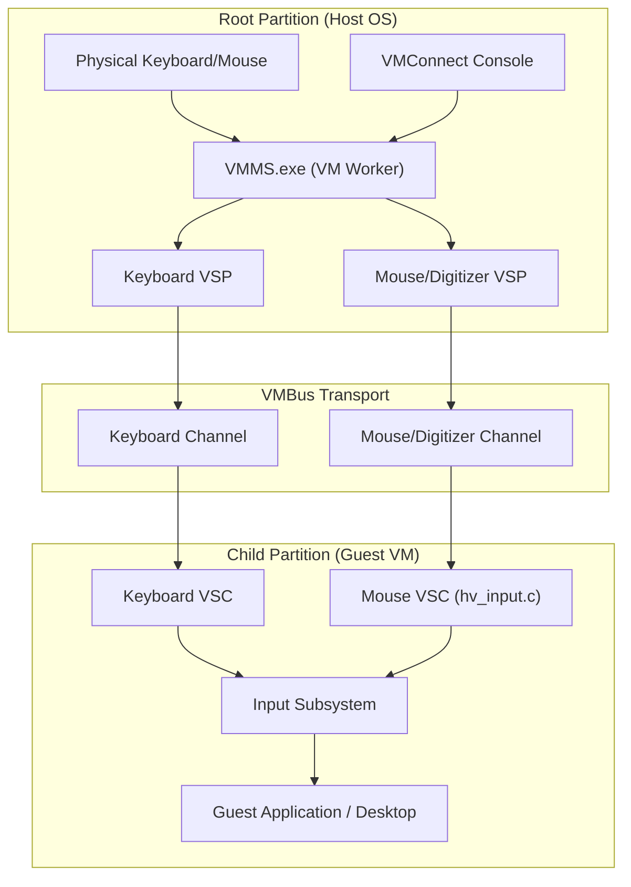
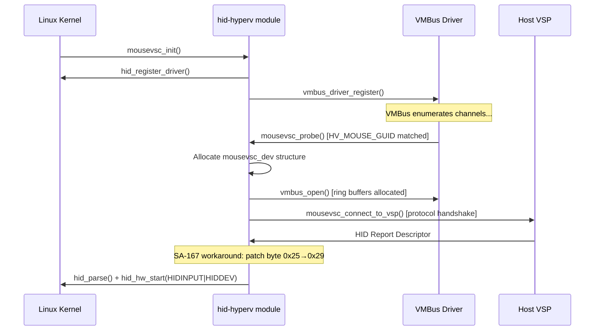
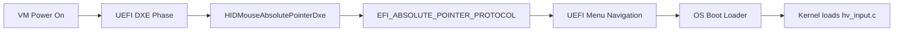
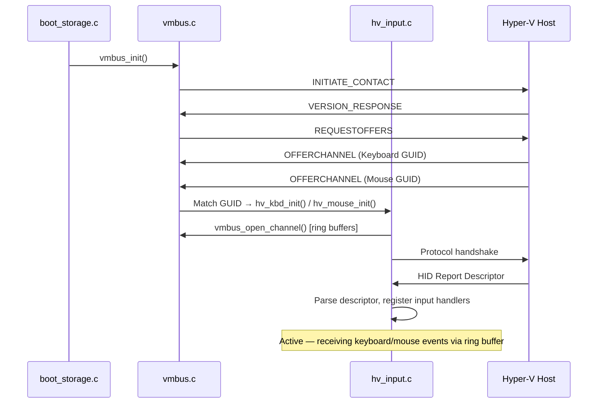

# Specification and Architectural Analysis: Hyper-V Synthetic HID Input Driver

> **Scope:** Exhaustive specification of the Hyper-V Synthetic HID Input Driver architecture,
> covering the VSP/VSC model for human interface devices, VMBus transport, absolute pointer
> paradigm, multi-touch digitizer protocols, platform implementations (Windows/Linux/Impossible OS),
> UEFI pre-boot input, and security considerations.

---

## 1. Introduction and the Paravirtualization Paradigm

In the domain of hardware virtualization, the management and routing of human interface device
(HID) input — specifically from mice, keyboards, and modern multi-touch digitizers — presents
a complex latency and state synchronization challenge.

### Legacy Emulation: The Problem

In legacy virtualization frameworks, the hypervisor simulates physical hardware components
such as the Intel 8042 PS/2 keyboard controller or a standard USB host controller:

```
┌─────────────────────────────────────────────────────────────────────┐
│ Legacy Emulated HID Path                                            │
│                                                                     │
│  Host keyboard/mouse event → Hypervisor emulation layer             │
│      → Emulated 8042 PS/2 port (I/O 0x60/0x64)                     │
│      → Guest port read → VMEXIT trap → Hypervisor decodes           │
│      → VMRESUME → Guest receives keystroke/movement                 │
│                                                                     │
│  ❌ Every keystroke = context switch (VMEXIT/VMRESUME)              │
│  ❌ Substantial processor overhead                                   │
│  ❌ Degraded input responsiveness at scale                           │
└─────────────────────────────────────────────────────────────────────┘
```

### Enlightened I/O: The Solution

The Hyper-V Synthetic HID Input Driver completely bypasses the hypervisor's emulation layer,
establishing a direct, software-defined, memory-mapped channel to the root partition:

```
┌─────────────────────────────────────────────────────────────────────┐
│ Synthetic HID Path (Enlightened I/O)                                │
│                                                                     │
│  Host keyboard/mouse event → VSP (root partition)                   │
│      → VMBus ring buffer (shared memory)                            │
│      → SynIC interrupt → VSC (guest partition)                      │
│      → Guest input subsystem → Application                         │
│                                                                     │
│  ✅ No VMEXIT per input event — shared memory data path            │
│  ✅ Near bare-metal latency                                         │
│  ✅ Absolute coordinates eliminate mouse drift                       │
└─────────────────────────────────────────────────────────────────────┘
```

The Synthetic HID Input Driver is a foundational element of the **Hyper-V Integration
Services** (Linux Integration Services / LIS in open-source environments). By installing
this synthetic driver, the guest OS establishes an optimized memory channel that delivers
input with near bare-metal latency.

> **Impossible OS context:** Our synthetic HID input driver is implemented in
> [`hv_input.c`](file:///src/kernel/drivers/hyperv/hv_input.c). It handles both
> keyboard and mouse input over VMBus channels. Platform detection occurs in
> [`cpuid_platform.c`](file:///src/kernel/cpuid_platform.c).

---

## 2. Architectural Foundation: VSP, VSC, and the Hypervisor

The structural hierarchy relies entirely on the **VSP/VSC model**, cleanly delineating
hardware management and software consumption across partition security boundaries.



### 2.1 The Virtualization Service Provider (VSP)

The HID VSPs are kernel-level components running within the root partition as part of the
**Virtual Machine Management Service (VMMS.exe)**. They:

- Abstract physical input devices (or VMConnect console input streams)
- Translate events into standardized synthetic payloads
- Are multithreaded — **4 VSPs can manage hundreds of child partitions** without thread
  starvation

### 2.2 The Virtualization Service Consumer (VSC)

The HID VSC is a specialized driver in the guest OS that:

- Receives synthetic payloads from the VMBus ring buffer
- Parses the proprietary hypervisor formatting
- Presents extracted data to the guest OS input stack (HID Class driver, Linux input
  subsystem, or Impossible OS `input_event` system)

### 2.3 The Hypervisor Interface Library

**WinHv (winhv.sys)** provides the fundamental hypercall interface, bridging the gap between
guest drivers and the hypervisor. It permits partitioned operating systems to issue
execution requests and hardware state queries across the partition boundary.

---

## 3. The Virtual Machine Bus (VMBus) Transport Protocol

The VMBus is the critical conduit connecting VSP and VSC. For HID input, it provides
dedicated channels for keyboard and mouse/digitizer devices.

> **Full VMBus protocol details:** See the
> [VMBus Core Protocol spec](file:///specs/hyper-v/vmbus-core-protocol.md).

### 3.1 Shared Memory Ring Buffers and Channel Architecture

HID channels use explicitly bifurcated ring buffers:

| Buffer                            | Purpose                                         |
| --------------------------------- | ----------------------------------------------- |
| `INPUTVSC_SEND_RING_BUFFER_SIZE`  | Guest → Host (key state queries, ack messages)  |
| `INPUTVSC_RECV_RING_BUFFER_SIZE`  | Host → Guest (keyboard events, mouse coords)    |

When a user moves the mouse or types on the keyboard in VMConnect:

1. Root partition VSP writes input event data into the "in" ring buffer
2. SynIC fires a synthetic interrupt to the guest partition
3. Guest VSC reads the ring buffer and dispatches to the input subsystem

> **Impossible OS context:** Ring buffer sizes for HID channels are set in
> `hv_kbd_init()` / `hv_mouse_init()` during `vmbus_open_channel()`.

### 3.2 Security: TOCTOU Mitigation

Because ring buffers exist in shared memory, they are vulnerable to **Time-of-Check to
Time-of-Use (TOCTOU)** attacks. A compromised root partition could:

1. Write a benign HID message to the ring buffer
2. Wait for the guest VSC to validate it
3. Rapidly overwrite the payload with malicious data before processing

**Mitigation:** The guest **copies the entire payload from shared memory into a private
buffer** before any validation or parsing. All HID descriptor parsing and event routing
occurs exclusively in this private copy. The host cannot modify the data post-receipt.

> **Impossible OS context:** Our `vmbus_recvpacket()` reads into a stack-local `pkt_buf[512]`
> which is private guest memory — inherently TOCTOU-safe.

---

## 4. Hardware Identification and Device GUIDs

Synthetic devices use **128-bit GUIDs** (not VID/PID) for enumeration. During VMBus
initialization, the hypervisor broadcasts these GUIDs over the control channel.

| Device Classification    | Description                                     | GUID                                         |
| ------------------------ | ----------------------------------------------- | -------------------------------------------- |
| **Synthetic Mouse/HID**  | Absolute pointing, multi-touch, digitizer       | `{CFA8B69E-5B4A-4CC0-B98B-8BA1A1F3F95A}`    |
| **Synthetic Keyboard**   | Dedicated keystroke delivery, keymap sync        | `{F912AD6D-2B17-48EA-BD65-F927A61C7684}`    |
| **Synthetic Video**      | Framebuffer, output sync for input layers        | `{DA0A7802-E377-4AAC-8E77-0558EB1073F8}`    |

In low-level C headers, these GUIDs are defined in **little-endian byte arrays** for rapid
memory matching. For example, `HV_MOUSE_GUID`:

```c
{ 0x9e, 0xb6, 0xa8, 0xcf, 0x4a, 0x5b, 0xc0, 0x4c,
  0xb9, 0x8b, 0x8b, 0xa1, 0xa1, 0xf3, 0xf9, 0x5a }
```

When the guest PnP manager encounters these GUIDs, it translates them into hardware IDs:
- Windows: `vmbus\{44C4F61D-...}` or `HID\VID_045E&PID_0621` (Microsoft Corporation)
- Linux: sysfs entries under `/sys/bus/vmbus/devices/<GUID>`

> **Impossible OS context:** GUIDs are defined in
> [`vmbus.h`](file:///include/kernel/drivers/hyperv/vmbus.h) as `VMBUS_GUID_*` constants.
> Channel-to-driver matching occurs during `vmbus_enumerate()`.

---

## 5. The Pointer Paradigm: Absolute Coordinate Tracking vs. Relative Motion

A defining architectural characteristic of the Synthetic HID Driver is its stringent adherence
to the **absolute pointer paradigm**, fundamentally diverging from traditional physical mice.

### 5.1 The Problem of Relative Motion and Mouse Drift

Standard physical mice use **relative input** — optical sensors generate delta values
(Δx, Δy) from the last polling location. The OS applies acceleration curves to compute the
new cursor position.

In virtualized environments with consoles (VMConnect, VNC), this causes **mouse drift**:

```
┌─────────────────────────────────────────────────┐
│ Two acceleration curves applied simultaneously   │
│                                                  │
│  Physical mouse Δx=100                           │
│      → Host OS acceleration → Host cursor +150px │
│      → Raw Δx=100 passed to guest                │
│      → Guest OS acceleration → Guest cursor +120px│
│                                                  │
│  Result: Host and guest cursors desynchronize!   │
│  ❌ Mouse appears trapped, erratic, misaligned  │
└─────────────────────────────────────────────────┘
```

### 5.2 Synthetic Digitizers and Absolute Synchronization

The Synthetic HID Driver **does not emulate a mouse** — it emulates a **digitizer / graphics
tablet** using absolute positioning:

```
┌─────────────────────────────────────────────────┐
│ Absolute Pointer Paradigm                        │
│                                                  │
│  Host tracks pixel coordinate in VM window       │
│      → Transmits absolute (X=1024, Y=768)        │
│      → VMBus ring buffer → Guest VSC             │
│      → Guest bypasses acceleration curves        │
│      → Cursor rendered at exact coordinate       │
│                                                  │
│  ✅ Perfect 1:1 synchronization                  │
│  ✅ Independent of acceleration settings         │
│  ✅ Works regardless of window size              │
└─────────────────────────────────────────────────┘
```

The host-side WMI class `Msvm_SyntheticMouse` exposes `SetAbsolutePosition(horizontalPosition,
verticalPosition)` for programmatic coordinate injection.

> **Impossible OS context:** Our `hv_input.c` receives absolute coordinates from the VMBus
> and feeds them directly to the cursor subsystem via `mouse_update_absolute()`, bypassing
> any relative acceleration logic.

### 5.3 Limitations: Enhanced Session Mode for Relative Input

Absolute positioning breaks applications requiring **infinite desktop** semantics (3D
rendering, CAD, FPS games) — where the cursor is locked to screen center and only raw
deltas drive camera rotation.

**Solution:** Hyper-V **Enhanced Session Mode** establishes an RDP session over VMBus,
allowing direct USB passthrough to the guest. The physical mouse is virtually disconnected
from the host and fully delegated to the guest, restoring raw relative input.

---

## 6. Advanced Multi-Touch and Stylus Digitizer Specifications

### 6.1 HID Report Descriptor Architecture for Touch Devices

The VSP dynamically generates a HID Report Descriptor based on host hardware capabilities
and passes it to the guest during channel initialization.

For multi-touch recognition, the descriptor must declare:

| HID Usage              | Usage ID | Page  | Purpose                                    |
| ---------------------- | :------: | :---: | ------------------------------------------ |
| **Touch Screen**       |   0x04   | 0x0D  | Top-level application usage (Digitizer)    |
| **Contact Identifier** |   0x51   | 0x0D  | Unique persistent ID per finger            |
| **Contact Count**      |   0x54   | 0x0D  | Active touch points in current packet      |
| **Contact Count Max**  |   0x55   | 0x0D  | Maximum simultaneous touch capacity        |
| **Tip Switch**         |   0x42   | 0x0D  | Physical contact detected (finger/stylus)  |
| **In Range**           |   0x32   | 0x0D  | Hovering detected (stylus only)            |

**Contact Identifier persistence rules:**
- Each distinct physical pressure point gets a unique, arbitrary ID
- ID must remain constant for the entire duration of the contact
- IDs are recycled only after the contact breaks from the surface

### 6.2 Serial versus Hybrid Reporting Protocols

| Protocol    | Mechanism                                           | Bandwidth         |
| ----------- | --------------------------------------------------- | ------------------ |
| **Serial**  | One HID packet per contact (5 fingers = 5 packets)  | Higher (more IRQs) |
| **Hybrid**  | Multiple contacts packed into single payload         | Lower (coalesced)  |

Hybrid packet parsing is critical — empty contact slots must be padded with NULL values or
the Contact Count adjusted precisely. Failure causes **ghost inputs**: basic drawing works
but pinch-to-zoom fails entirely.

### 6.3 Stylus and Pen State Management

Active stylus support requires additional usages beyond basic pointing:

| State        | HID Usage     | Behavior                                             |
| ------------ | ------------- | ---------------------------------------------------- |
| **Hovering** | In Range      | Pen detected above surface, cursor preview shown     |
| **Contact**  | Tip Switch    | Physical pressure applied (drawing)                  |
| **Barrel**   | BTN_STYLUS    | Side button pressed (right-click equivalent)         |
| **Palm**     | Rejected      | Palm rejection via input topology classification     |

The synthetic driver appends `"Pen"` to the stylus input topology and forces targeted
synchronization events (`BTN_STYLUS`) to distinguish pen input from palm touches.

---

## 7. The Windows Guest Operating System Implementation Stack

The Windows synthetic input stack is constructed dynamically by the Windows Driver Foundation
(WDF) using KMDF modules and WDM class drivers.

### 7.1 Driver Stack Topology and Load Sequence

| Layer | Driver Component                    | System File         | Role                                                          |
| :---: | ----------------------------------- | ------------------- | ------------------------------------------------------------- |
|   7   | Mouse/Keyboard Class Drivers        | `mouclass.sys` / `kbdclass.sys` | Delivers finalized input to user-mode (`csrss.exe`)  |
|   6   | HID Client Mapper Drivers           | `mouhid.sys` / `kbdhid.sys` | Converts HID usages to coordinates/scan codes          |
|   5   | HID Class Library & Parser          | `hidclass.sys` / `hidparse.sys` | Parses HID descriptors, generates PDOs per collection |
|   4   | Pass-through HID to KMDF Filter     | `mshidkmdf.sys`     | Lower filter for vendor-specific KMDF modifications     |
|   3   | VMBus HID Miniport (VSC)            | `VMBusHID.sys`      | Reads VMBus ring buffer, translates to HID reports      |
|   2   | Virtual Machine Bus Child Driver    | `vmbus.sys`         | VMBus PnP enumerator, ring buffers, GUID matching       |
|   1   | Virtualization Infrastructure       | `vid.sys` / `vmgid.sys` | Root hypervisor communication and partition management |

The `mshidkmdf.sys` pass-through driver allows proprietary host-side filter drivers
(smoothing algorithms, custom pen pressure curves) to operate within the guest without
direct physical hardware access.

---

## 8. The Linux Guest Operating System Native Integration

The Linux integration services are maintained natively in the mainline kernel under
`drivers/hv/`, `drivers/hid/`, and `drivers/input/`.

### 8.1 Synthetic Pointer and Digitizer: hid-hyperv

The core module for absolute pointing, mouse clicks, and touch input is
`hid-hyperv` (`drivers/hid/hid-hyperv.c`).

**Initialization sequence (`mousevsc_probe`):**



> [!NOTE]
> **SA-167 Workaround:** Before passing the host-provided report descriptor to `hid_parse()`,
> the Linux driver forcibly alters a byte from `0x25` to `0x29` to work around a known
> architectural anomaly. This highlights that the VSC must act as a **rigorous validation
> layer**, not a blind pass-through.

### 8.2 Synthetic Keyboard: hyperv-keyboard (Serio Subsystem)

The synthetic keyboard uses a **fundamentally distinct** VMBus channel and driver,
located at `drivers/input/serio/hyperv-keyboard.c`.

Unlike pointer input, the keyboard:
- Bypasses the standard HID stack entirely
- Integrates directly with the **serio subsystem** (AT/PS/2 keyboard multiplexer)
- Uses `serio_register_port()` to treat VMBus keyboard data as physical PS/2 interrupts

This ensures:

| Feature                    | Supported via Serio |
| -------------------------- | :-----------------: |
| Complex localized keymaps  |         ✅          |
| Low-level console input    |         ✅          |
| Magic SysRq keys           |         ✅          |
| Kernel-level debugging     |         ✅          |
| Zero latency penalty       |         ✅          |

---

## 9. Pre-Boot Environments and UEFI Absolute Pointer Protocols

Input routing must function **before the OS kernel loads**, during UEFI firmware interaction:



The **HIDMouseAbsolutePointerDxe** UEFI module:

- Produces an `EFI_ABSOLUTE_POINTER_PROTOCOL` instance
- Parses basic absolute X/Y coordinates over a preliminary VMBus connection
- Enables graphical mouse support in pre-boot console
- Provides seamless transition from firmware to OS input stack

> **Impossible OS context:** Our UEFI bootloader
> ([`bootx64.c`](file:///src/boot/uefi/bootx64.c)) does not currently implement
> `EFI_ABSOLUTE_POINTER_PROTOCOL`. Pre-boot input relies on UEFI's built-in simple pointer
> protocol. Synthetic HID activates once the kernel loads `hv_input.c`.

---

## 10. Operational Diagnostics, Security, and Troubleshooting

### 10.1 Version Mismatches and Initialization Failures

| Event ID | Log Source                    | Description                                                   |
| :------: | ----------------------------- | ------------------------------------------------------------- |
|  23014   | Hyper-V-Worker                | VSP/VSC protocol version mismatch (e.g., 3.0 vs 3.2)         |
| Code 10  | Device Manager                | "This device cannot start" — HAL misconfiguration             |
| Code 12  | Device Manager                | "Cannot find free resources" — I/O memory allocation failure  |

**Resolution:** Update Integration Services or upgrade guest kernel for architectural parity.

### 10.2 Service Principal Name (SPN) and Heartbeat Monitoring

| Event ID | Source     | Impact                                                            |
| :------: | ---------- | ----------------------------------------------------------------- |
|  14050   | VMMS Admin | SCP/SPN registration failure → VMMS.exe hang → VSP channel loss  |
|    41    | Host       | Heartbeat timeout → forced VM restart (guest OS assumed crashed)  |

### 10.3 Vulnerability Mitigation and Endpoint Validation

The VMBus HID architecture processes complex, variable-length HID Report Descriptors from
the host, making it a potential attack surface:

| Attack Vector                         | Mitigation                                                  |
| ------------------------------------- | ----------------------------------------------------------- |
| Malformed HID descriptors             | Private buffer copy + validation before parsing             |
| Inflated Contact Count                | Strict bounds checking against Contact Count Maximum        |
| Buffer overflow via oversized packets | Ring buffer size limits + packet length validation           |
| Post-validation memory manipulation   | TOCTOU: copy to private memory before any validation        |
| Synthetic interrupt injection         | All interrupts routed through SynIC (monitored, controlled) |

> [!WARNING]
> Security researchers actively fuzz VMBus HID endpoints. The VSC must **never**
> trust host-supplied data — all parsing must occur on private copies with strict
> bounds checking.

---

## 11. Impossible OS Implementation Details

### Current Implementation

| Component          | File                                                        | Status   |
| ------------------ | ----------------------------------------------------------- | -------- |
| HID Input Driver   | [`hv_input.c`](file:///src/kernel/drivers/hyperv/hv_input.c) | ✅ Done |
| VMBus Core         | [`vmbus.c`](file:///src/kernel/drivers/hyperv/vmbus.c)       | ✅ Done |
| Mouse Integration  | Absolute coords → `mouse_update_absolute()`                  | ✅ Done |
| Keyboard Integration | Scan codes → `keyboard_handle_scancode()`                  | ✅ Done |
| Multi-touch        | —                                                            | 🔲 Future |
| Stylus/Pen         | —                                                            | 🔲 Future |
| UEFI Pre-boot HID  | —                                                            | 🔲 Future |

### Initialization Sequence



### Key Design Principles

| Principle                           | Implementation                                            |
| ----------------------------------- | --------------------------------------------------------- |
| **Absolute pointer only**           | No relative deltas — direct coordinate injection          |
| **Private buffer parsing**          | `vmbus_recvpacket()` → stack-local buffer (TOCTOU-safe)   |
| **No PAUSE in polling**             | Compiler barrier only (avoids Hyper-V PLE)                |
| **Separate channels**               | Keyboard and mouse on distinct VMBus channels             |
| **Scan code passthrough**           | Keyboard events delivered as raw scan codes                |

---

## 12. Conclusion

The Hyper-V Synthetic HID Input Driver represents a paradigm shift from legacy hardware
emulation to optimized, software-defined interaction. By utilizing VMBus shared-memory
channels:

- **Context-switching latency** from VMEXIT/VMRESUME is mathematically eliminated
- **Mouse drift** from dual acceleration curves is resolved via absolute digitizer coordinates
- **Multi-touch, stylus, and hover** states are natively supported through HID Report
  Descriptors
- **Pre-boot input** functions seamlessly via UEFI `EFI_ABSOLUTE_POINTER_PROTOCOL`
- **Security** is maintained through private-buffer TOCTOU mitigation and strict descriptor
  validation

The continuous refinement of these synthetic endpoints, supported by rigorous TOCTOU
mitigation strategies and native integration into both the Windows Driver Foundation and
the mainline Linux kernel, underscores the critical necessity of highly specialized input
pipelines in enterprise virtualization architectures.
