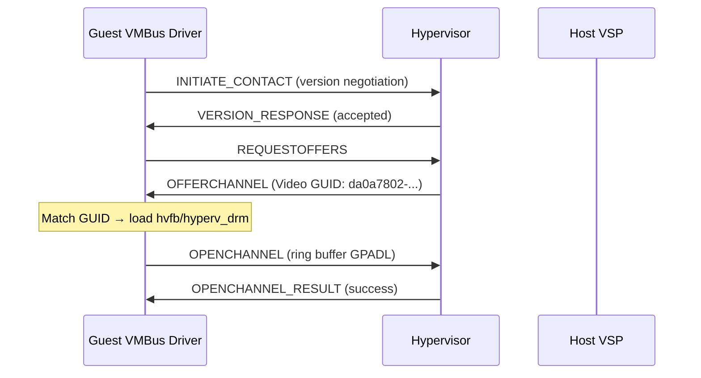
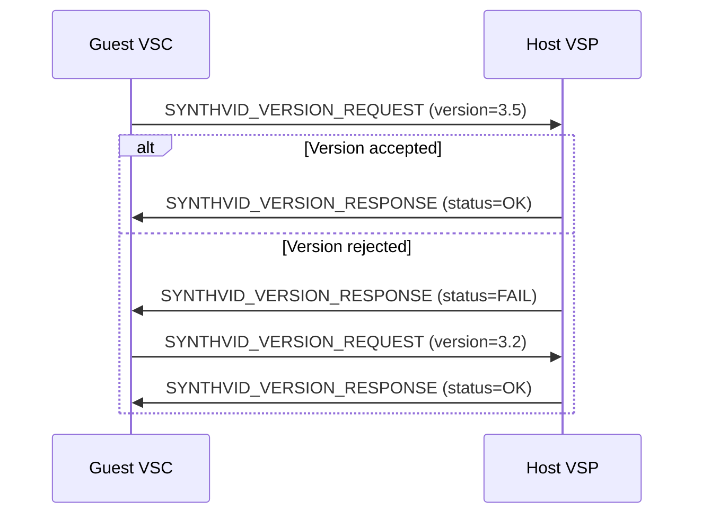
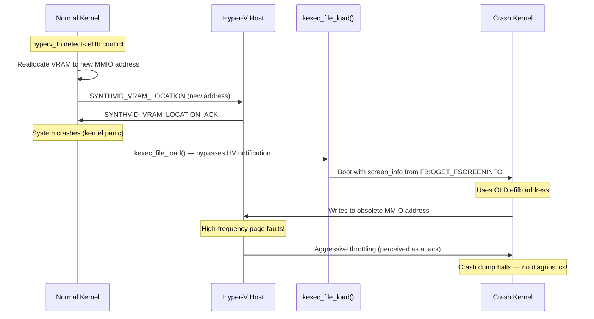

# Comprehensive Architecture and Technical Specification of the Hyper-V Synthetic Video Driver

> **Scope:** Exhaustive specification of the Hyper-V Synthetic Video Driver architecture,
> covering the synthvid protocol, VRAM management, framebuffer constraints, hyperv_fb vs
> hyperv_drm evolution, cross-platform implementations, advanced GPU architectures (DDA/GPU-P),
> memory management, and security considerations including CVE-2025-21977.

---

## 1. Introduction to Hyper-V Paravirtualization and Graphics Subsystems

In the Hyper-V architecture, physical hardware is abstracted through a highly optimized,
paravirtualized environment. Unlike traditional hypervisors that rely on full hardware
emulation — which incurs substantial computational overhead — Hyper-V leverages a
**partitioned architecture**:

| Partition        | Role                                                              |
| ---------------- | ----------------------------------------------------------------- |
| **Root (Host)**  | Direct hardware control, memory allocation, physical interrupts   |
| **Child (Guest)** | Isolated environment, relies on VMBus for resource access        |

For graphics and display output, Hyper-V provisions a specific VSP-VSC pairing known as
the **Hyper-V Synthetic Video Driver**. While older emulation techniques provided basic
SVGA adapters via processor-intensive instruction interception, the synthetic video driver
bypasses legacy VGA emulation entirely, routing framebuffer data and display state directly
over the VMBus.

```
┌─────────────────────────────────────────────────────────────────────┐
│ Legacy Emulated VGA Path                                            │
│                                                                     │
│  Guest writes to VGA MMIO (0xA0000) or VGA port I/O                │
│      → VMEXIT trap → Hypervisor emulates VGA hardware              │
│      → VMRESUME → Guest continues                                  │
│                                                                     │
│  ❌ Every pixel write = context switch                              │
│  ❌ Double cursor effect (host + guest cursors desync)              │
│  ❌ CPU-intensive, poor 2D performance                               │
└─────────────────────────────────────────────────────────────────────┘

┌─────────────────────────────────────────────────────────────────────┐
│ Synthetic Video Path (Enlightened I/O)                               │
│                                                                     │
│  Guest writes directly to VRAM (GPA-mapped shared memory)           │
│      → Host VSP reads framebuffer via mapped GPA                    │
│      → Hardware cursor composited by host                          │
│      → No VMEXIT per pixel                                          │
│                                                                     │
│  ✅ Superior 2D graphics performance                                │
│  ✅ Hardware cursor eliminates double-cursor effect                  │
│  ✅ Near bare-metal framebuffer throughput                           │
└─────────────────────────────────────────────────────────────────────┘
```

### Platform Implementations

| Platform  | Driver Name     | Subsystem                | Source                          |
| --------- | --------------- | ------------------------ | ------------------------------- |
| Linux     | `hyperv_fb`     | fbdev (legacy)           | `drivers/video/fbdev/hyperv_fb.c` |
| Linux     | `hyperv_drm`    | DRM (modern, ≥5.14)      | `drivers/gpu/drm/hyperv/`       |
| FreeBSD   | `hv_video`      | FreeBSD video subsystem  | FreeBSD Integration Services    |
| Windows   | `hypervideo.sys` | Native WDM/WDDM         | Hyper-V Integration Services    |
| **Impossible OS** | `hvfb.c` *(planned)* | GOP framebuffer    | [`TODO-008`](file:///todo/000-Infrastructure/TODO-008-Hyper-V-Runner.md) |

---

## 2. The Virtual Machine Bus (VMBus) Integration and Discovery

### 2.1 The Offer and Discovery Mechanism

Device instantiation does not rely on PCI enumeration. The root partition explicitly
**"offers"** synthetic devices to the guest upon boot:



The **Class GUID** for the Hyper-V Synthetic Video device:

```
{DA0A7802-E377-4AAC-8E77-0558EB1073F8}
```

### 2.2 Ring Buffer Allocation and Memory Sharing

After probe, the guest driver:
1. Opens the primary VMBus channel to the VSP
2. Allocates guest memory for send/receive ring buffers
3. Shares memory with host via `vmbus_establish_gpadl()` (GPA list)

> **Security:** Ring buffer memory is directly accessible to the host. Modern VMBus
> drivers copy messages from shared memory into **private, unshared buffers** before
> validation — the standard TOCTOU mitigation. See §2 of the
> [VMBus Core Protocol spec](file:///specs/hyper-v/vmbus-core-protocol.md).

---

## 3. Protocol Specification: The Synthetic Video Messaging Interface

### 3.1 Packet Constraints

| Constant                      | Value    | Description                              |
| ----------------------------- | -------- | ---------------------------------------- |
| `VMBUS_PACKET_MAX_HEADER_LEN` | 64 bytes | Maximum VMBus packet header              |
| `MAX_VMBUS_PKT_SIZE`          | 0x4000   | Maximum synthetic video packet (16 KiB)  |

### 3.2 The Synthetic Video Header (synthvid_msg_hdr)

Every synthetic video message is prepended by this `__packed` structure:

```c
struct synthvid_msg_hdr {
    uint32_t type;   /* SYNTHVID_* command enumeration */
    uint32_t size;   /* Total message size             */
} __attribute__((packed));
```

### 3.3 Protocol Version Negotiation

The driver always negotiates the highest mutually supported protocol version:

| Macro                    | Version | Host OS                     | Capabilities                              |
| ------------------------ | :-----: | --------------------------- | ----------------------------------------- |
| `SYNTHVID_VERSION_WIN7`  |   3.0   | Server 2008 R2 / Windows 7  | Legacy baseline protocol                  |
| `SYNTHVID_VERSION_WIN8`  |   3.2   | Server 2012 / Windows 8     | Full HD (1920×1080) support               |
| `SYNTHVID_VERSION_WIN10` |   3.5   | Server 2016 / Windows 10    | Hardware cursor, dynamic resolution       |

Version encoding: `SYNTHVID_VERSION(major, minor) = ((minor) << 16 | (major))`



---

## 4. Core Control Messages: VRAM and Pointer Management

### 4.1 VRAM Location (SYNTHVID_VRAM_LOCATION)

The guest must inform the host precisely where its framebuffer resides in GPA space:

```c
struct synthvid_vram_location {
    uint64_t user_ctx;                /* Transaction tracking context     */
    uint8_t  is_vram_gpa_specified;   /* 1 = GPA provided below          */
    uint64_t vram_gpa;                /* Guest Physical Address of VRAM  */
} __attribute__((packed));
```

**Sequence:**

1. Guest allocates contiguous framebuffer memory
2. Guest sends `SYNTHVID_VRAM_LOCATION` with `vram_gpa` set
3. Host maps this GPA region, continually reads pixel data
4. Host acknowledges with `SYNTHVID_VRAM_LOCATION_ACK`
5. Guest cleared to begin writing pixel data

### 4.2 Pointer Position (SYNTHVID_POINTER_POSITION)

The synthetic video driver's **hardware cursor** eliminates the infamous "double cursor"
effect of emulated VGA:

| Field          | Type   | Description                                  |
| -------------- | ------ | -------------------------------------------- |
| `is_visible`   | u8     | Cursor visibility flag (1 = shown)           |
| `video_output` | u8     | Target display index                         |
| `image_x`      | i32    | Horizontal pixel coordinate                  |
| `image_y`      | i32    | Vertical pixel coordinate                    |

Instead of rendering the cursor into the framebuffer (causing latency and desync), the
guest transmits coordinates to the host, which composites the cursor over the VM window.

> **Impossible OS context:** When running on Hyper-V, our compositor would send cursor
> coordinates via this message type rather than drawing the cursor into the back buffer.
> This is a future optimization for the planned `hvfb.c` driver.

### 4.3 Complete Message Type Enumeration

| Message Type                      | Direction     | Purpose                                      |
| --------------------------------- | ------------- | -------------------------------------------- |
| `SYNTHVID_ERROR`                  | Bidirectional | Error indication                             |
| `SYNTHVID_VERSION_REQUEST`        | Guest → Host  | Request protocol version negotiation         |
| `SYNTHVID_VERSION_RESPONSE`       | Host → Guest  | Accept or reject version                     |
| `SYNTHVID_VRAM_LOCATION`          | Guest → Host  | Register framebuffer GPA with host           |
| `SYNTHVID_VRAM_LOCATION_ACK`      | Host → Guest  | Confirm VRAM mapping established             |
| `SYNTHVID_SITUATION_UPDATE`       | Guest → Host  | Report resolution/format change              |
| `SYNTHVID_SITUATION_UPDATE_ACK`   | Host → Guest  | Confirm display state                        |
| `SYNTHVID_POINTER_POSITION`       | Guest → Host  | Hardware cursor coordinates                  |
| `SYNTHVID_POINTER_SHAPE`          | Guest → Host  | Custom cursor image data                     |
| `SYNTHVID_FEATURE_CHANGE`         | Host → Guest  | Dynamic capability update                    |
| `SYNTHVID_DIRT`                   | Guest → Host  | Dirty rectangle notification                 |
| `SYNTHVID_RESOLUTION_REQUEST`     | Host → Guest  | Host requests resolution change (v3.5+)      |
| `SYNTHVID_RESOLUTION_RESPONSE`    | Guest → Host  | Guest acknowledges resolution change         |

---

## 5. Framebuffer Constraints and the 8 MB VRAM Allocation Limit

### 5.1 The Mathematical Boundaries

The synthetic video driver hardcodes a maximum VRAM allocation of **exactly 8 MiB
(8,388,608 bytes)**. Framebuffer size is:

$$\text{VRAM}_{\text{bytes}} = \text{Width} \times \text{Height} \times \frac{\text{BPP}}{8}$$

| Resolution       | BPP | VRAM Required   | Fits in 8 MiB? |
| ---------------- | :-: | --------------- | :-------------: |
| 1152 × 864       | 32  | 3,981,312 B     |       ✅        |
| 1600 × 1200      | 16  | 3,840,000 B     |       ✅        |
| 1920 × 1080      | 32  | 8,294,400 B     |    ✅ (tight)   |
| **2560 × 1440**  | 32  | 14,745,600 B    |       ❌        |
| **3840 × 2160**  | 32  | 33,177,600 B    |       ❌        |

> 1920×1080×4 = 8,294,400 bytes — fits within the 8,388,608-byte ceiling with only
> 94,208 bytes to spare.

### 5.2 Default and Configurable Resolutions

| Scenario                                | Resolution      | Color Depth |
| --------------------------------------- | --------------- | :---------: |
| Default (no parameter)                  | 1152 × 864      | 32-bit      |
| Maximum (basic session)                 | 1920 × 1080     | 32-bit      |
| Legacy (Server 2008 R2)                 | 1600 × 1200     | 16-bit      |
| Portrait orientation                    | 864 × 1152      | 32-bit      |

Linux guests can customize via kernel boot parameter:
```
video=hyperv_fb:1920x1080
```

### 5.3 MMIO Constraints and VM Generations

| Generation | Architecture | MMIO Space                    | VRAM Allocation                             |
| :--------: | ------------ | ----------------------------- | ------------------------------------------- |
| Gen 1      | Legacy BIOS  | Below 4 GB only               | Risk of MMIO fragmentation and conflicts    |
| Gen 2      | UEFI         | 64-bit address space           | Ample MMIO; 8 MiB logical limit retained   |

Gen 2 PowerShell parameters for MMIO tuning:
- `HighMemoryMappedIoSpace` — Above 4 GB MMIO allocation
- `LowMemoryMappedIoSpace` — Below 4 GB MMIO allocation

> [!IMPORTANT]
> Despite the vastly expanded address space in Gen 2, the synthetic video driver **retains
> the 8 MiB logical VRAM limit**. This is an intentional design choice — framebuffer memory
> is pinned and cannot be ballooned, so predictable host memory scaling requires a fixed cap.

---

## 6. The Legacy Framebuffer Driver (hyperv_fb)

For over a decade, Linux guest graphics on Hyper-V were managed exclusively by `hyperv_fb.c`.

### Architecture

- Registers as a standard **fbdev** framebuffer device
- Interfaces with `vmbus_driver_register()` for VMBus communication
- Creates a secondary PCI stub (`hvfb_pci_stub_driver`) for kernel device model compliance
- Maps the single 8 MiB VRAM block and writes raw pixel data directly

### Limitations

| Limitation                       | Impact                                                |
| -------------------------------- | ----------------------------------------------------- |
| fbdev API only                   | No page flipping, no multi-plane, no buffer management |
| No dynamic resolution            | `xrandr` cannot resize after boot                     |
| Poor Wayland performance         | Frame drops, high CPU during compositing              |
| No dirty region tracking          | Full framebuffer scanned every refresh                |
| CVE-2025-21977 vulnerability     | MMIO trap storms during kdump (see §7)                |

---

## 7. Security and Stability: CVE-2025-21977 Deep Dive

### The Vulnerability

A critical architectural flaw in `hyperv_fb` memory management exposed as **CVE-2025-21977**
— a breakdown in state synchronization between the normal kernel, the crash-dump kernel
(kdump), and the Hyper-V host regarding MMIO framebuffer addresses.

### Attack Sequence



### Root Cause

1. `hyperv_fb` detects conflicting `efifb` occupying desired MMIO space
2. Relocates framebuffer to a different MMIO address after initial allocation
3. Successfully notifies Hyper-V host during normal operation
4. On crash, `kexec` **bypasses host communication** for rapid transition
5. Crash kernel inherits the **old** address via `screen_info`
6. Writes to unmapped physical address → page fault storm → host throttle

### Resolution in hyperv_drm

`hyperv_drm` **proactively removes** conflicting framebuffers (efifb) **before** allocating
its MMIO address. Because the framebuffer never moves, the state mismatch during kexec
cannot occur.

---

## 8. The Modern DRM Driver (hyperv_drm)

Introduced in **Linux kernel 5.14**, `hyperv_drm` exposes the synthetic video device as a
**virtual GPU** within the Linux DRM architecture.

### Key Advantages over hyperv_fb

| Feature                          | hyperv_fb          | hyperv_drm              |
| -------------------------------- | ------------------ | ----------------------- |
| Subsystem                       | fbdev (legacy)      | DRM (modern)            |
| Wayland support                  | Poor (frame drops)  | Native, fluid           |
| Dynamic resolution               | ❌ Boot-time only  | ✅ Runtime via xrandr  |
| CVE-2025-21977                   | ❌ Vulnerable      | ✅ Resolved             |
| Dirty region tracking             | ❌ Full scan       | ✅ Per-region updates  |
| Page flipping                    | ❌                 | ✅ (future)             |
| EDID parsing                     | ❌                 | ✅ (future)             |
| Kernel config                    | `CONFIG_FB_HYPERV`  | `CONFIG_DRM_HYPERV`     |

> [!NOTE]
> Major distributions have deprecated `hyperv_fb`: Ubuntu replaced it starting in
> Jammy (22.04), SUSE integrated `hyperv_drm` into security updates.

---

## 9. Cross-Platform Guest Implementations

### 9.1 FreeBSD (hv_video)

| Aspect                | Detail                                                       |
| --------------------- | ------------------------------------------------------------ |
| Driver                | `hv_video`                                                   |
| Integration           | FreeBSD 11–14 (built-in)                                     |
| Known issues          | Display artifacts (line tearing), X.org init difficulties    |
| Resolution config     | Via UEFI `efi_max_resolution`                                |
| Sound support         | ❌ No sound device emulation alongside video                 |
| Best use case         | Headless server operations                                   |

### 9.2 Windows Guest

| Aspect                  | Detail                                                     |
| ----------------------- | ---------------------------------------------------------- |
| Driver                  | `hypervideo.sys` + Integration Services VSCs               |
| Supported guests        | Windows 8.1+ / Server 2012 R2+ through Server 2025        |
| WMI classes             | `Msvm_Synthetic3DDisplayController`, `Msvm_Synth3dVideoPool` |
| Resolution limit        | 1920×1080 (basic session), 4K+ (Enhanced Session)          |
| Legacy (XP)             | Must revert to unaccelerated "Standard VGA" for 32-bit color |

### 9.3 Impossible OS (Planned)

| Aspect                 | Detail                                                      |
| ---------------------- | ----------------------------------------------------------- |
| Planned driver         | `hvfb.c`                                                    |
| Framebuffer model      | Direct GOP framebuffer + synthvid VRAM mapping              |
| Current status         | Uses UEFI GOP; synthetic video is a future enhancement      |
| Hardware cursor        | Will use `SYNTHVID_POINTER_POSITION` to eliminate compositing overhead |
| Double buffering       | Via PMM-allocated back buffer (existing pattern)            |

> **Impossible OS context:** Our current UEFI GOP framebuffer at 1280×720×32bpp already
> works on Hyper-V Gen 2. The synthetic video driver would add dynamic resolution,
> hardware cursor, and dirty rectangle notifications.

---

## 10. Surmounting Synthetic Limitations: Advanced Graphics Architectures

### 10.1 Enhanced Session Mode (RDP Integration)

| Feature                    | Basic Session (Synthetic Video) | Enhanced Session (RDP)          |
| -------------------------- | :-----------------------------: | :-----------------------------: |
| Max resolution             | 1920 × 1080                     | 4K+                            |
| Multi-monitor              | ❌                              | ✅                             |
| Dynamic resize             | Limited                         | ✅                             |
| GPU acceleration           | ❌                              | ❌ (software rendering)        |
| Clipboard sharing          | ❌                              | ✅                             |
| USB redirection            | ❌                              | ✅                             |
| Audio passthrough          | ❌                              | ✅                             |

Enhanced Session Mode establishes an **RDP connection over VMBus** (not network), completely
bypassing the synthetic video driver and its 8 MiB VRAM limit.

### 10.2 Discrete Device Assignment (DDA)

For true hardware GPU acceleration (AI/ML, rendering, VDI):

| Requirement              | Detail                                                       |
| ------------------------ | ------------------------------------------------------------ |
| VM generation            | Generation 2 only                                            |
| CPU features             | Intel EPT or AMD NPT                                         |
| IOMMU                    | Intel VT-d (Queued Invalidations) or AMD I/O MMU             |
| PCIe ACS                 | Access Control Services on root ports                        |
| GPU driver               | Native vendor drivers (NVIDIA/AMD) in guest                  |
| Synthetic video           | Falls back to secondary/disabled                            |

DDA unbinds a physical GPU from the root partition and maps it directly into the child
partition's memory space via PCIe pass-through.

### 10.3 GPU Partitioning (GPU-P / SR-IOV)

Unlike DDA (one GPU per VM), GPU-P **slices a physical GPU** into multiple hardware-backed
partitions:

| Feature                    | DDA                          | GPU-P (SR-IOV)                 |
| -------------------------- | :--------------------------: | :----------------------------: |
| GPU sharing                | ❌ Exclusive to one VM       | ✅ Multiple VMs share GPU     |
| Hardware isolation         | ✅ Full PCIe passthrough     | ✅ Virtual Functions (VFs)    |
| VRAM allocation            | Full physical VRAM           | Partitioned (configurable)    |
| Performance                | Near-native                  | Near-native (virtualized)     |
| Live Migration             | ❌ Not supported             | ✅ Supported                  |
| PowerShell config          | `Dismount-VMHostAssignableDevice` | `Set-VMGpuPartitionAdapter` |

GPU-P replaces the software-based shared-memory ring buffers of synthetic video with
**hardware-backed security boundaries**, offering near-native performance.

---

## 11. Memory Management Complexities and Dynamic Allocation

### Framebuffer Memory vs Dynamic Memory

| Memory Type            | Management                | Flexibility | Ballooning |
| ---------------------- | ------------------------- | :---------: | :--------: |
| Standard VM RAM        | Dynamic Memory (hv_balloon) | High       | ✅ Yes    |
| **Synthetic VRAM**     | Pinned / Static Mapping    | None       | ❌ Never  |

> [!CAUTION]
> Framebuffer memory mapped via `SYNTHVID_VRAM_LOCATION` **cannot be ballooned, swapped,
> or dynamically resized**. The 8 MiB is permanently sequestered from the host's memory
> pool. Hyper-V does **not** support memory over-commit, so every framebuffer allocation
> represents a **1:1 footprint** on physical RAM. This is the architectural rationale
> for capping synthetic VRAM strictly.

### Impossible OS Memory Model

| Component          | Allocation Method             | Size                             |
| ------------------ | ----------------------------- | -------------------------------- |
| GOP framebuffer    | UEFI GOP (pre-allocated)      | 1280×720×4 = 3.6 MiB            |
| Back buffer        | `pmm_alloc_contiguous()`      | 3.6 MiB (identity-mapped)       |
| Future VRAM (hvfb) | `pmm_alloc_contiguous()`      | Up to 8 MiB (synthvid limit)    |

> **Known gotcha:** Back buffer **must** use PMM, not `kmalloc()`. The kernel heap is only
> 2 MiB — framebuffer allocations via `kmalloc()` cause silent heap exhaustion.
> *(Fixed in commit `9722a74`, documented in rules.md)*

---

## 12. Conclusion

The Hyper-V Synthetic Video Driver is a purpose-built mechanism for reliable graphical
output in paravirtualized environments. By exploiting low-latency VMBus shared memory and
shifting from processor-intensive hardware emulation to a streamlined VSP/VSC architecture:

### Design Principles Summary

| Principle                              | Implementation                                        |
| -------------------------------------- | ----------------------------------------------------- |
| **VRAM via GPA mapping**               | `SYNTHVID_VRAM_LOCATION` message with contiguous GPA  |
| **Hardware cursor**                    | `SYNTHVID_POINTER_POSITION` — host-side compositing   |
| **Protocol version fallback**          | WIN10 (3.5) → WIN8 (3.2) → WIN7 (3.0)               |
| **8 MiB VRAM cap**                     | 1920×1080 max at 32bpp in basic session               |
| **Pinned framebuffer memory**          | Cannot be ballooned — use PMM, never kmalloc          |
| **TOCTOU-safe message parsing**        | Copy-then-validate from shared ring buffer            |
| **DRM over fbdev**                     | `hyperv_drm` resolves CVE-2025-21977, supports Wayland |
| **Beyond synthetic: DDA/GPU-P**        | Hardware GPU for 4K, multi-monitor, ML workloads      |

The transition from legacy `hyperv_fb` to modern `hyperv_drm` highlights an ongoing
commitment to security and modernization. For workloads exceeding synthetic boundaries,
Hyper-V seamlessly pivots to Enhanced Session Mode, DDA, or GPU-P — scaling from basic
headless servers to GPU-accelerated computing powerhouses.
