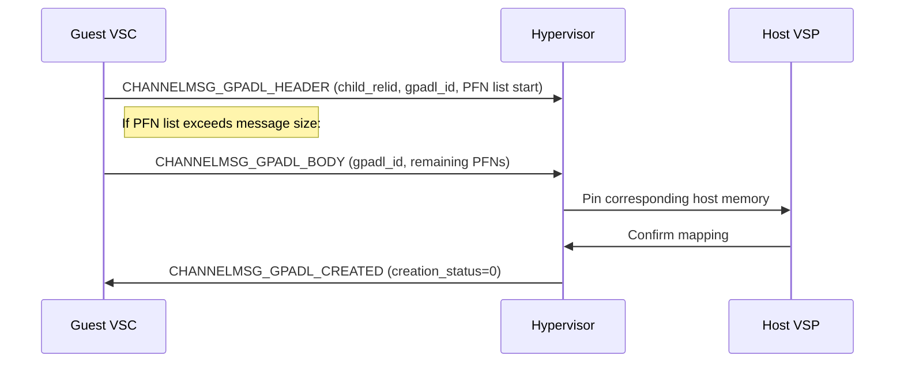
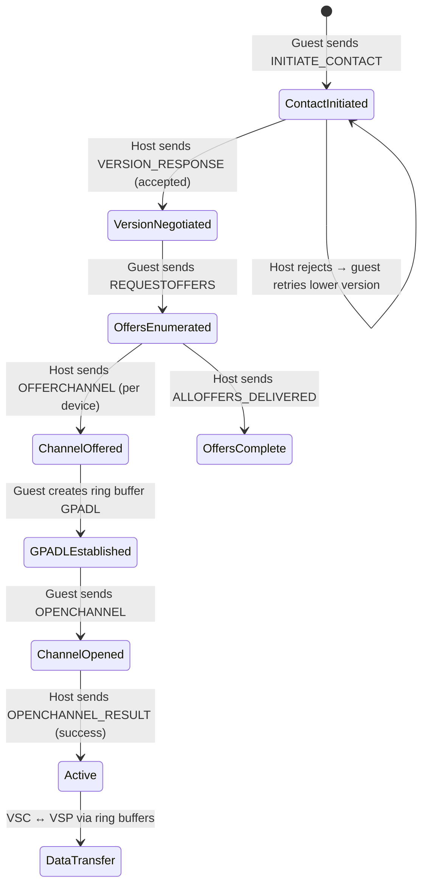

# Hyper-V VMBus Core Protocol: Exhaustive Architectural Specification and Channel Mechanics

> **Scope:** This document provides an exhaustive, TLFS-referenced specification of the
> Hyper-V VMBus protocol as it pertains to the Impossible OS kernel implementation.
> Cross-references to source files use project-relative paths.

---

## 1. Introduction and Architectural Foundations of the Hyper-V Environment

Microsoft Hyper-V operates as a native, Type-1 hypervisor designed specifically to provide
hardware-assisted virtualization on x64 and compatible ARM architectures. At the absolute
core of its operational paradigm is the concept of **partition isolation**, representing a
strict logical boundary enforced entirely by the hypervisor silicon extensions, within which
an operating system context executes. The architecture rigidly mandates at least one highly
privileged partition, formally designated as the **root or parent partition** (frequently
hosting Windows Server, Windows client editions, or specialized Hyper-V Server environments).
This root partition is tasked with executing the virtualization management stack and uniquely
maintains direct, unmediated access to the underlying physical hardware components, including
peripheral buses, storage controllers, and physical network interfaces.

The primary responsibility of the root partition is to facilitate the creation, suspension, and
management of unprivileged **child partitions**, commonly referred to as guest virtual machines
(VMs). Child partitions are explicitly stripped of direct access to physical memory, underlying
processing resources, and hardware interrupts. Instead, they are provided with a highly
abstracted, virtualized view of the hardware. Because child partitions lack access to actual
physical addresses, all memory translation operations must be mediated by the hypervisor
utilizing **Second Level Address Translation (SLAT)** or **Input Output Memory Management
Units (IOMMU)**, which safely remap guest physical memory addresses to physical host memory
addresses independently of the CPU's primary memory management hardware.

### 1.1 The Virtualization Management Stack

The root partition hosts several critical components that orchestrate this environment:

- **Virtual Machine Management Service (VMMS)** — Responsible for managing the state of all
  virtual machines residing in child partitions. Exposes a comprehensive set of WMI-based APIs
  for administrative control.

- **Virtual Machine Worker Process (VMWP)** — A dedicated user-mode component spawned per guest
  that provides specific virtualization management services from the parent partition.

- **Windows Hypervisor Interface Library (WinHv)** — Serves as an essential bridge allowing
  partitioned operating system drivers to execute calls into the hypervisor using standard
  Windows calling conventions.

These calls, known as **hypercalls**, serve as a standard, trap-based software interface
enabling guests to execute privileged virtualization commands. Key hypercalls include:

| Hypercall                       | Purpose                                                       |
| ------------------------------- | ------------------------------------------------------------- |
| `HvExtCallGetBootZeroedMemory`  | Query which GPA pages were pre-zeroed — eliminates redundancy |
| `HvPostMessage`                 | Asynchronously send a message to a specified connection ID     |
| `HvCallSignalEvent`             | Set an event flag bit for the target SINT (channel signaling)  |

While hypercalls are effective for basic state management and partition control, they are
computationally expensive for high-throughput data transfer due to the heavy processor
context-switching overhead required to trap into the hypervisor privilege ring. To circumvent
this latency, Hyper-V introduces the **Virtual Machine Bus (VMBus)**.

---

## 2. The Virtual Machine Bus (VMBus) Paradigm

The VMBus is a sophisticated, highly optimized, logical inter-partition communication channel
that forms the central nervous system of Hyper-V's para-virtualized architecture. The VMBus
entirely bypasses legacy device emulation layers, powering what Microsoft terms
**"Enlightened I/O"** — a virtualization-aware implementation of high-level communication
protocols that allows guest operating systems to route data natively over the VMBus, rendering
communication exponentially more efficient.

The VMBus operates strictly on a **distributed client-server architecture model** that bridges
the isolation boundary between partitions. This architecture relies on two corresponding entities:

| Entity                                | Location          | Role                                                                |
| ------------------------------------- | ----------------- | ------------------------------------------------------------------- |
| **Virtualization Service Provider (VSP)** | Root partition | Backend handlers interfacing with host physical drivers             |
| **Virtualization Service Consumer (VSC)** | Child partition | Enlightened frontend drivers redirecting I/O across VMBus to VSP    |

To function correctly, the guest operating system must be **"enlightened"** — meaning it must
possess the appropriate Hyper-V Integration Services containing the VMBus core driver and the
associated VSC modules.

> **Impossible OS context:** Our VMBus core is implemented in
> [`vmbus.c`](file:///src/kernel/drivers/hyperv/vmbus.c) and
> [`vmbus.h`](file:///include/kernel/drivers/hyperv/vmbus.h).
> Platform detection occurs in [`cpuid_platform.c`](file:///src/kernel/cpuid_platform.c).

### 2.1 Synthetic Device Enumeration

The VMBus control path acts as the discovery mechanism for synthetic devices. Once the guest
OS boots and the VMBus control channel is established, the host utilizes the control path to
**"offer"** synthetic devices to the guest VM. Each synthetic device type is universally
identified by a fixed **Globally Unique Identifier (GUID)** known as the "class ID," while
each specific instance of a device is assigned a unique **instance GUID**.

#### Key Synthetic Device GUIDs (Impossible OS)

| Device                    | Class GUID                               | VSC Source                          |
| ------------------------- | ---------------------------------------- | ----------------------------------- |
| Synthetic SCSI (storvsc)  | `BA6163D9-04A1-4D29-B605-72E2FFB1DC7F`  | `storvsc.c`                         |
| Synthetic Keyboard (HID)  | `F912AD6D-2B17-48EA-BD65-F927A61C7684`  | `hv_input.c`                        |
| Synthetic Video (hvfb)    | `DA0A7802-E377-4AAC-8E77-0558EB1073F8`  | `hvfb.c` *(planned)*               |
| Synthetic NIC (netvsc)    | `F8615163-DF3E-46C5-913F-F2D2F965ED0E`  | `netvsc.c` *(planned)*             |
| Shutdown VSP              | `0E0B6031-5213-4934-818B-38D90CED39DB`  | *(planned §10)*                     |

---

## 3. VMBus Channel Topography and Ring Buffer Architecture

The physical routing of data over the VMBus is accomplished through logical constructs known
as **VMBus channels**. A VMBus channel acts as a dedicated, bi-directional communication
conduit directly linking a specific VSC instance in the guest to its corresponding VSP
instance in the host. While the majority of simplistic synthetic devices operate over a single
primary channel, performance-critical devices like the synthetic SCSI controller and the
synthetic NIC frequently utilize multiple channels — often termed **"sub-channels"** — to
achieve massively parallelized data processing across multiple virtual CPUs (vCPUs).

### 3.1 Ring Buffer Fundamentals

The data transfer mechanism within every VMBus channel relies entirely on **asynchronous,
shared-memory ring buffers**. Each bi-directional VMBus channel mathematically provisions
exactly two distinct ring buffers:

| Ring       | Direction                          | Purpose                               |
| ---------- | ---------------------------------- | ------------------------------------- |
| **"in"**   | Host → Guest (downstream/receive)  | Receiving messages from Hyper-V host  |
| **"out"**  | Guest → Host (upstream/send)       | Transmitting messages to Hyper-V host |

The VMBus ring buffer implementation follows classical circular data structure principles:

- **Empty condition:** `read_index == write_index`
- **Full condition:** Must always retain at least **one byte unused** to prevent the
  mathematical ambiguity between "completely full" and "completely empty"

The contiguous physical memory backing each ring buffer is always structured as:

```
┌─────────────────┐  ← 4 KiB header page
│  Ring Header     │     (read/write indices, flow control flags)
├─────────────────┤  ← Data payload area (N pages)
│  Ring Data       │     Size set by VSC driver during channel init
│  (circular)      │
└─────────────────┘
```

> **Impossible OS context:** Ring buffers are allocated via `pmm_alloc_contiguous()` in
> `vmbus_open_channel()`. Our `vmbus_ring_buffer_header` struct contains `write_index`,
> `read_index`, `interrupt_mask`, and `pending_send_size` (L245–L251 of `vmbus.h`).

### 3.2 The Triple-Mapping Virtual Address Optimization

If a guest kernel were forced to manually calculate the exact boundary of the circular ring
buffer for every read or write operation, the resulting conditional branching would introduce
severe CPU latency during high-speed network or storage transfers. To optimize, advanced
implementations map the ring buffer data pages **three times** in contiguous virtual space:

1. The initial 4 KiB header page
2. The actual ring data payload
3. A **duplicate, secondary mapping** of the same physical ring data immediately adjacent

Because segments 2 and 3 are virtually contiguous, `memcpy()` operations that cross the
physical ring boundary simply continue seamlessly into the secondary mapping — no split
copy needed.

> **Impossible OS note:** We currently do **not** implement triple-mapping. Our
> `vmbus_ring_write()`/`vmbus_ring_read()` in `vmbus.c` handle wrap-around via explicit
> two-chunk `vmbus_memcpy()` calls. Triple-mapping is a future optimization (§12 Enlightenments).

### 3.3 Ring Buffer Header Anatomy and Flow Control

The 4 KiB header page is governed by the `hv_ring_buffer` structure, shared directly between
root and child partitions:

| Field              | Size    | Description                                                   |
| ------------------ | ------- | ------------------------------------------------------------- |
| `write_index`      | 32-bit  | Byte offset from start of ring data — next write position     |
| `read_index`       | 32-bit  | Byte offset from start of ring data — next read position      |
| `interrupt_mask`   | 32-bit  | Flag to suppress signaling during bulk processing             |
| `pending_send_sz`  | 32-bit  | Interrupt-driven flow control: required bytes for pending send |
| `feature_bits`     | 32-bit  | Capability flags (e.g., `feat_pending_send_sz`)               |
| `reserved/buffer`  | Variable | Padding to ensure data begins on next 4K page boundary       |

**Interrupt-driven flow management** (introduced in Windows Server 2012 / Windows 8):

When the guest sets `feat_pending_send_sz` in the guest-to-host ring header, it establishes
a contract: when space is insufficient for a pending send, the guest populates
`pending_send_sz` with the required bytes. Conversely, when the guest consumes data and frees
enough space to satisfy the host's `pending_send_sz`, the guest fires a targeted interrupt
to wake the host — **completely eliminating polling**.

---

## 4. VMBus Message Types and Packet Anatomy

Data flowing across the VMBus is rigorously categorized into two distinct classifications:

1. **Control Messages** — orchestrate the core bus state (via HvPostMessage hypercall)
2. **Data Packets** — transfer functional payloads through the ring buffers

### 4.1 Data Packet Structure and Transfer Modalities

Once a channel is open, synthetic devices communicate by writing encapsulated packets directly
into the data payload area of the shared ring buffer. Every data payload is strictly prepended
with a `vmpacket_descriptor` header:

```c
struct vmpacket_descriptor {
    uint16_t type;       /* VMBUS_PACKET_TYPE_*                              */
    uint16_t offset8;    /* Offset to payload in 8-byte units                */
    uint16_t len8;       /* Total packet length in 8-byte units              */
    uint16_t flags;      /* VMBUS_DATA_PACKET_FLAG_COMPLETION_REQUESTED etc. */
    uint64_t trans_id;   /* 64-bit transaction ID for request/response match */
} __attribute__((packed));
```

> [!IMPORTANT]
> Because `offset8` and `len8` are in **8-byte granularity**, kernel code must bit-shift
> left by 3: `desc->len8 << 3` and `desc->offset8 << 3` to get true byte values.

#### Packet Types

| Enum Value | Constant                              | Description                                          |
| :--------: | ------------------------------------- | ---------------------------------------------------- |
|    0x06    | `VM_PKT_DATA_INBAND`                  | Payload immediately follows descriptor in ring       |
|    0x07    | `VM_PKT_DATA_USING_XFER_PAGES`        | Payload in GPADL transfer buffer, not in ring        |
|    0x08    | `VM_PKT_DATA_USING_GPADL`             | Payload in separate GPADL memory window              |
|    0x0b    | `VM_PKT_COMP`                         | Completion acknowledgment for a previous trans_id    |

#### Wire Format in Ring Buffer

```
┌──────────────────────────┐
│  vmpacket_descriptor     │  16 bytes
│  (type, offset8, len8,   │
│   flags, trans_id)       │
├──────────────────────────┤
│  Payload data            │  Variable (offset8 << 3 bytes from start)
│  (e.g., VSTOR_PACKET)   │
├──────────────────────────┤
│  Padding to 8-byte align │  0-7 bytes
├──────────────────────────┤
│  prev_pkt_start_offset   │  8 bytes (used by host for ring walk)
└──────────────────────────┘
```

> **Impossible OS context:** Our `vmbus_sendpacket()` in `vmbus.c` constructs this exact
> wire format. `vmbus_recvpacket()` strips the descriptor and returns the payload only.

#### Transfer Page Packets (Type 0x07)

For SCSI data I/O, the ring buffer packet contains a `vmbus_transfer_page_header` after
the descriptor, referencing a GPADL-shared data buffer:

```
┌──────────────────────────┐
│  vmpacket_descriptor     │  16 bytes (type = 0x07)
├──────────────────────────┤
│  vmbus_transfer_page_hdr │  8 bytes (pageset_id, sender_owns, range_count)
├──────────────────────────┤
│  transfer_page_range[]   │  8 bytes × range_count (byte_count, byte_offset)
├──────────────────────────┤
│  Control message         │  e.g., VSTOR_PACKET
│  (header_data)           │
├──────────────────────────┤
│  Padding + trailing ofs  │
└──────────────────────────┘
```

> **Impossible OS context:** `vmbus_sendpacket_pagebuffer()` in `vmbus.c` constructs
> transfer page packets. `storvsc.c` uses this for SCSI READ/WRITE with the transfer
> buffer GPADL handle as `transfer_pageset_id`.

---

## 5. Memory Management and GPADL Mechanics

VMBus relies inherently on the rapid exchange of memory access permissions between partitions.
Because child partitions possess completely isolated physical address spaces, sharing vast
quantities of memory for ring buffers or zero-copy storage payloads requires a mechanism to
translate **Guest Physical Addresses (GPAs)** into host virtual mappings.

This translation is governed by the **Guest Physical Address Descriptor List (GPADL)** protocol.

### 5.1 GPADL Establishment Sequence



| Step                     | Message                       | Content                                                |
| ------------------------ | ----------------------------- | ------------------------------------------------------ |
| 1. Header transmission   | `CHANNELMSG_GPADL_HEADER`     | `child_relid`, `gpadl` ID, `rangecount`, PFN array     |
| 2. Body (if fragmented)  | `CHANNELMSG_GPADL_BODY`       | `MessageNumber`, matching `gpadl` ID, continuation PFNs |
| 3. Confirmation          | `CHANNELMSG_GPADL_CREATED`    | `creation_status` (0 = success)                         |

> **Impossible OS context:** `vmbus_create_gpadl()` in `vmbus.c` handles steps 1 and 3.
> For StorVSC, a separate GPADL is created for the 64 KiB transfer buffer via
> `vmbus_create_gpadl_external()`. The ring buffer GPADL is created internally during
> `vmbus_open_channel()`.

### 5.2 Page Size Calculations and Teardown

A complexity arises from the disparity between guest OS page sizes and hypervisor page sizes.
While standard x64 OSes operate on 4 KiB `PAGE_SIZE`, the hypervisor defines its own
`HV_HYP_PAGE_SIZE`. GPADL PFN calculations must account for alignment via
`virt_to_hvpfn` translations.

**GPADL teardown** is a strict two-phase operation:

1. Guest sends `CHANNELMSG_GPADL_TEARDOWN` (specifying GPADL ID)
2. Guest **must wait** for `CHANNELMSG_GPADL_TORNDOWN` before freeing physical pages

> [!CAUTION]
> Freeing memory before receiving `GPADL_TORNDOWN` risks use-after-free in the hypervisor.
> The guest **must** synchronously block until confirmation arrives.

---

## 6. Control Message Protocol and Channel Lifecycle Management

The VMBus implements exactly **17 distinct control message types**:

| Value | Message                           | Direction     | Purpose                                           |
| :---: | --------------------------------- | ------------- | ------------------------------------------------- |
|   1   | `CHANNELMSG_OFFERCHANNEL`         | Host → Guest  | Offer a new synthetic device                      |
|   2   | `CHANNELMSG_RESCIND_CHANNELOFFER` | Host → Guest  | Hot-remove a device                               |
|   3   | `CHANNELMSG_REQUESTOFFERS`        | Guest → Host  | Request all available device offers                |
|   4   | `CHANNELMSG_ALLOFFERS_DELIVERED`  | Host → Guest  | Signal end of initial enumeration batch            |
|   5   | `CHANNELMSG_OPENCHANNEL`          | Guest → Host  | Mount a channel (ring buffer + GPADL IDs)          |
|   6   | `CHANNELMSG_OPENCHANNEL_RESULT`   | Host → Guest  | Open success/failure status code                   |
|   7   | `CHANNELMSG_CLOSECHANNEL`         | Guest → Host  | Orderly channel teardown                           |
|  8/9  | `CHANNELMSG_GPADL_HEADER/BODY`    | Guest → Host  | Establish guest-to-host memory bridges             |
|  10   | `CHANNELMSG_GPADL_CREATED`        | Host → Guest  | Confirm memory bridge is established               |
| 11/12 | `CHANNELMSG_GPADL_TEARDOWN/TORNDOWN` | Bidirectional | Destroy memory bridge                          |
|  14   | `CHANNELMSG_INITIATE_CONTACT`     | Guest → Host  | Protocol version negotiation handshake             |
|  15   | `CHANNELMSG_VERSION_RESPONSE`     | Host → Guest  | Version acceptance or rejection                    |
| 16/17 | `CHANNELMSG_UNLOAD/RESPONSE`      | Bidirectional | Total VMBus stack teardown                         |

### 6.1 The Channel Initialization State Machine



**Phase-by-phase breakdown:**

1. **Offer:** Host injects `CHANNELMSG_OFFERCHANNEL` via SynIC interrupt. Contains
   `if_type` (class GUID), `if_instance` (unique ID), `child_relid` (channel ID), `monitorid`.

2. **Ring Buffer Allocation:** VSC driver allocates contiguous guest memory via PMM,
   packages physical PFNs into a GPADL handle.

3. **Channel Opening:** Guest sends `CHANNELMSG_OPENCHANNEL` bundling `child_relid`,
   `openid`, GPADL handle, and byte offset splitting the GPADL into send/recv rings.

4. **Activation:** Host maps memory, replies with `CHANNELMSG_OPENCHANNEL_RESULT`.
   If `status == 0`, channel enters active bidirectional state.

> **Impossible OS context:** `vmbus_init()` → `vmbus_connect()` → `vmbus_enumerate()`
> handles phases 1–4. Individual VSC drivers (`storvsc_init()`, `hv_kbd_init()`, etc.)
> handle per-device channel opening.

---

## 7. Interrupt Signaling and the Monitor Page Paradigm

While VMBus facilitates efficient memory sharing, a mechanism is required to notify the
opposing partition that a packet has been enqueued. Hyper-V provides two signaling paths:

### 7.1 HvCallSignalEvent Hypercall (Active Path)

The guest executes `HvCallSignalEvent` (call code `0x005D`) through the hypercall page.
The input is the `connection_id` (channel's `child_relid`). This atomically sets the
corresponding event flag bit in the host's SIEF page, triggering a SynIC interrupt.

```
Guest → Hypercall page → HvCallSignalEvent(child_relid) → Host SINT fires
```

> **Impossible OS context:** `vmbus_signal_channel()` in `vmbus.c` executes this hypercall
> via inline assembly through the hypercall page allocated in `hv_setup_hypercall()`.

### 7.2 Monitor Page (Passive Path)

The `hv_monitor_page` is a 4 KiB shared memory structure enabling passive, hardware-assisted
interrupt aggregation. Rather than executing an active hypercall every time, the guest
modifies specific state bits within the monitor page:

| Offset    | Field                | Size     | Purpose                                      |
| --------- | -------------------- | -------- | -------------------------------------------- |
| `0x00`    | `TriggerState`       | 4 bytes  | Aggregated trigger status                    |
| `0x08`    | `TriggerGroup[0-3]`  | Array    | Per-group pending bits for channel signaling  |
| `0x28`    | `NextCheckTime[]`    | Array    | Timing for coalesced interrupt delivery       |
| `0xF0`    | `Latency[][]`        | 2D Array | Multi-dimensional latency tracking            |
| `0x1B8`   | `Parameter[]`        | Array    | Connection ID mapping                         |

The guest uses `sync_set_bit()` (atomic bitwise OR) to set the pending bit for a channel's
`monitorid` in the `trigger_group`. The hypervisor hardware passively monitors this page and
fires a **single, coalesced synthetic interrupt** — massively reducing overhead.

> **Impossible OS note:** We currently use the active hypercall path only.
> Monitor page signaling is a future optimization (§12 Enlightenments).

### 7.3 SynIC Architecture

The **Synthetic Interrupt Controller (SynIC)** extends the LAPIC with:

| MSR                    | Address      | Purpose                                            |
| ---------------------- | ------------ | -------------------------------------------------- |
| `HV_X64_MSR_SCONTROL` | `0x40000080` | SynIC global enable                                |
| `HV_X64_MSR_SIMP`     | `0x40000083` | SIM Page GPA (Synthetic Interrupt Message Page)     |
| `HV_X64_MSR_SIEFP`    | `0x40000082` | SIEF Page GPA (Synthetic Interrupt Event Flags)     |
| `HV_X64_MSR_SINT0-15` | `0x40000090+` | Per-SINT vector, mask, auto-EOI configuration      |
| `HV_X64_MSR_EOM`      | `0x40000084` | End of Message — drain pending message queue        |

VMBus conventionally uses **SINT2** (vector `0xF0` in our implementation).

---

## 8. Protocol Versioning and Negotiation Mechanics

The VMBus protocol requires explicit, synchronous version negotiation during initialization.
The guest sends `CHANNELMSG_INITIATE_CONTACT` with the requested version; the host replies
with `CHANNELMSG_VERSION_RESPONSE`. On rejection, the guest downgrades and retries.

### Version History

| Macro                    | Bitwise         | Windows Release                     |
| ------------------------ | --------------- | ----------------------------------- |
| `VERSION_WS2008`         | `(0 << 16) | 13` | Windows Server 2008               |
| `VERSION_WIN7`           | `(1 << 16) | 1`  | Windows 7                         |
| `VERSION_WIN8`           | `(2 << 16) | 4`  | Windows 8 / Server 2012           |
| `VERSION_WIN8_1`         | `(3 << 16) | 0`  | Windows 8.1 / Server 2012 R2      |
| `VERSION_WIN10`          | `(4 << 16) | 0`  | Windows 10 RTM                    |
| `VERSION_WIN10_V4_1`     | `(4 << 16) | 1`  | Windows 10 RS3                    |
| `VERSION_WIN10_V5`       | `(5 << 16) | 0`  | Newer Windows 10                  |
| `VERSION_WIN10_V5_1`     | `(5 << 16) | 1`  | Windows 10 RS4                    |
| `VERSION_WIN10_V5_2`     | `(5 << 16) | 2`  | Windows Server 2019 (RS5)         |
| `VERSION_WIN10_V5_3`     | `(5 << 16) | 3`  | Windows Server 2022                |

> **Impossible OS context:** `vmbus_connect()` tries `VERSION_WIN10_V5_2` first, falls back
> to `VERSION_WIN10`, then `VERSION_WIN8_1`. Each synthetic device (StorVSC, NetVSC)
> performs an independent device-level version negotiation over its channel.

---

## 9. Security Paradigms, TOC-TOU Mitigation, and Confidential Computing

Because VMBus relies on unmediated shared physical memory, it represents a sensitive attack
surface.

### 9.1 Time-of-Check to Time-of-Use (TOC-TOU) Mitigations

A compromised host could exploit a guest VSC driver through malicious ring buffer manipulation.
The ring buffer resides in shared memory, so the host retains write access to a packet payload
even after the guest has begun reading it.

**Attack vector:** If the guest reads and validates `len8` directly from the shared ring
buffer, and the host alters it before the guest's `memcpy`, a buffer overflow results.

**Mitigation:** All messages read from the "in" ring buffer are first **copied to private,
unshared kernel memory**. All validation occurs against this private copy. Use `READ_ONCE()`
to fetch indices atomically.

> [!WARNING]
> **Impossible OS action item:** Our current `vmbus_recvpacket()` reads directly into a
> stack-local `pkt_buf[512]` — this is correct (stack is private memory). However, we should
> audit that no code path validates fields while they're still in the ring buffer.

### 9.2 The VMBus Confidential Computing Evolution

VMBus protocol versions 5.0+ support hardware-backed **Confidential Computing (CoCo)**
via AMD SEV-SNP and Intel TDX. In CoCo environments:

- Guest memory is cryptographically encrypted by hardware silicon
- The hypervisor **cannot** read or manipulate guest memory
- VMBus shared memory (ring buffers, monitor pages, SynIC pages) must be **selectively
  decrypted** by the guest
- **Bounce buffers** handle secure transit into decrypted ring buffers

> **Impossible OS note:** CoCo support is not currently planned. This section is included
> for architectural completeness and future reference.

---

## 10. Synthetic Devices and Integration Services Integration

### 10.1 High-Performance Storage and Networking Profiles

| Driver      | Device Type          | VMBus Feature                                                |
| ----------- | -------------------- | ------------------------------------------------------------ |
| `storvsc`   | Synthetic SCSI       | Transfer-page packets, up to 64 devices per controller       |
| `netvsc`    | Synthetic NIC        | RSS, NDIS protocols, sub-channels for multi-vCPU             |
| `hvfb`      | Synthetic Video      | Framebuffer updates, resolution negotiation                  |
| `hv_input`  | Synthetic HID        | Keyboard + mouse events over VMBus                           |

StorVSC uses `VM_PKT_DATA_USING_XFER_PAGES` for SCSI READ/WRITE to achieve near-zero-copy
data routing. The transfer buffer is shared via a dedicated GPADL, and the ring buffer
carries only the `VSTOR_PACKET` metadata.

### 10.2 Hyper-V Utility Services

| Service                | GUID Prefix | VMBus Operation                                         |
| ---------------------- | ----------- | ------------------------------------------------------- |
| Heartbeat              | `vmicheartbeat` | Periodic life-sign transmission                     |
| Time Synchronization   | `vmictimesync`  | Clock alignment with host hardware                  |
| VSS (Volume Shadow)    | `hv_vss_daemon` | `VSS_OP_FREEZE`/`VSS_OP_THAW` for live backups     |
| KVP Exchange           | `hv_kvp_msg`    | Key-value metadata injection/retrieval              |
| Shutdown               | Shutdown VSP    | Graceful shutdown requests from hypervisor           |

---

## 11. Synthesized Implications and Protocol Maturation

The Hyper-V VMBus Core Protocol represents a masterclass in hypervisor interface design,
balancing extreme low-latency data throughput with the rigid isolation boundaries necessitated
by modern cloud infrastructure. By relegating computationally expensive hypercalls exclusively
to initial state setup and teardown sequences, the protocol effectively liberates the critical
execution path, allowing data to flow unimpeded via shared-memory ring buffers.

### Key Design Principles for Impossible OS

1. **vmpacket_descriptor framing is mandatory** — the host VSP silently drops raw data
2. **GPADL must be established for ALL shared memory** — ring buffers AND data buffers
3. **Avoid PAUSE in polling loops** — Hyper-V PLE causes 1000× slowdown
4. **Transaction IDs must be unique** — host uses them for completion matching
5. **8-byte alignment is enforced** — `offset8` and `len8` are in qword granularity
6. **Trailing 64-bit previous-packet offset** follows every packet in the ring
7. **SynIC SINT2 must be configured** before any VMBus communication

> [!NOTE]
> **Lessons learned from Impossible OS implementation:**
> - Initial ring buffer implementation used custom `uint64_t length + raw data` framing
>   which worked in QEMU (no VMBus) but failed silently on real Hyper-V Gen 2
>   *(fixed in commit `cd6f749`)*
> - StorVSC transfer buffer was PMM-allocated but not host-visible (no GPADL),
>   causing silent SCSI I/O failures *(fixed in commit `cd6f749`)*
> - PAUSE instructions in polling loops triggered Pause Loop Exit (PLE) causing
>   1000× slowdown on Hyper-V *(fixed in commits `cd6f749` and earlier AHCI fix)*
