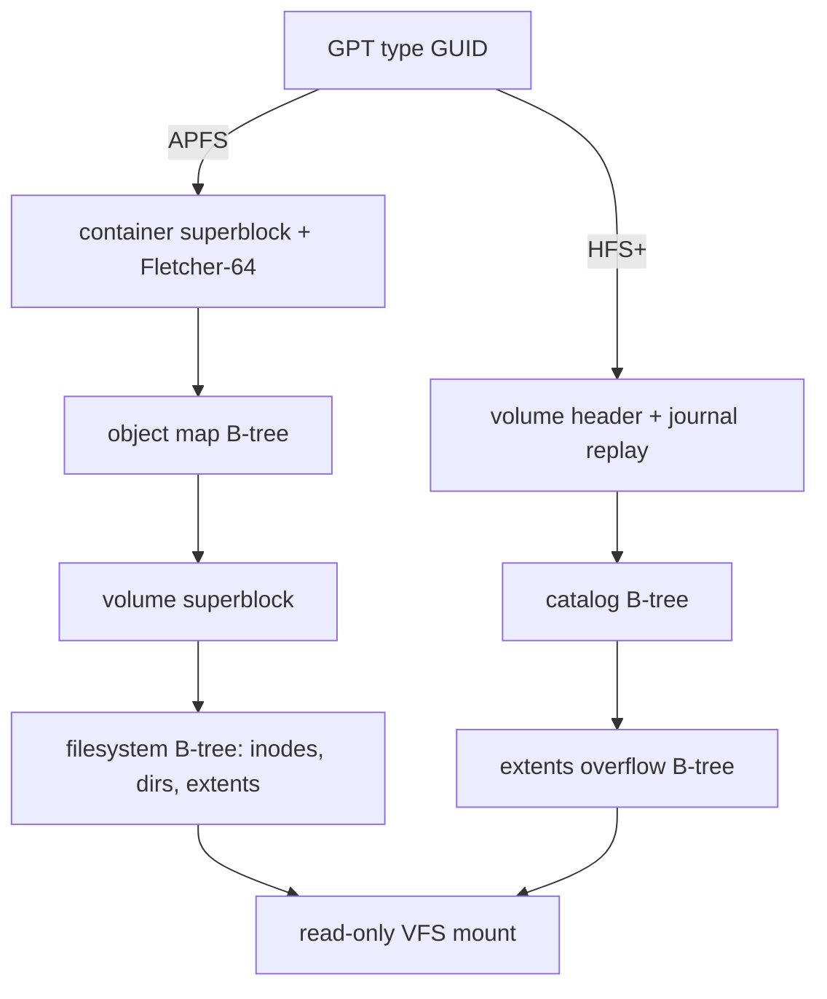

<!-- docs: covers=todo/05-storage-filesystems/TODO-12-apple-filesystems-readonly.md sources=src/kernel/fs/gpt.c,include/kernel/fs/gpt.h,src/kernel/fs/mbr.c,include/kernel/fs/mbr.h,src/kernel/fs/partition.c reviewed=2026-09-28 order=12 -->
# Apple Filesystems (APFS and HFS+)

## What is it?

APFS is the filesystem of every Mac since macOS 10.13, and HFS+ (Mac OS Extended) is its predecessor, still common on older external drives and Time Machine disks. Impossible OS recognises both partition types by name but cannot read either. This roadmap adds read-only drivers for both in twelve sections, none of them started. Writing is out of scope on purpose: APFS's object-map updates are only partly reverse-engineered, and the use case is copying files off a Mac-formatted drive.

## How does it work?

**Today: partition names only.** [`gpt.c`](../../src/kernel/fs/gpt.c) defines the GPT partition type GUIDs `GPT_GUID_APPLE_HFS` (`48465300-0000-11AA-AA11-00306543ECAC`) and `GPT_GUID_APPLE_APFS` (`7C3457EF-0000-11AA-AA11-00306543ECAC`), declared in [`gpt.h`](../../include/kernel/fs/gpt.h), and `gpt_type_name()` turns them into "Apple HFS+" and "Apple APFS". On MBR disks, type `0xAF` is named "HFS+" ([`mbr.h`](../../include/kernel/fs/mbr.h), [`mbr.c`](../../src/kernel/fs/mbr.c)). The partition scan in [`partition.c`](../../src/kernel/fs/partition.c) logs each partition with that name at debug level, but its filesystem probe has no Apple check, so the partition is classed unknown and gets no drive letter.

**Planned design, APFS.** An APFS partition is a container holding one or more volumes, and almost every lookup goes through an object map:

1. Read the container superblock, verify its Fletcher-64 checksum, and find the latest valid checkpoint.
2. Walk the container's object map, a B-tree from object ID and transaction ID to physical block, taking the newest version not later than the checkpoint.
3. Mount each volume, detecting sealed system volumes.
4. Search and walk the filesystem B-tree for inodes, directory records, file extents, symbolic links and extended attributes.
5. Return `STATUS_ACCESS_DENIED` for files on a FileVault-encrypted volume rather than returning ciphertext.
6. Convert names from the decomposed Unicode form macOS stores to the composed form Windows displays.

**Planned design, HFS+.** Read the volume header (`H+` or the case-sensitive `HX` variant), replay the journal if the volume was not cleanly unmounted, then read directories from the catalog B-tree and file data from inline extents plus the extents overflow B-tree.

Both drivers will only probe partitions whose GPT type GUID is Apple's, so a non-Apple partition is never misread.

## What are its interfaces?

| Interface | Purpose |
| --- | --- |
| `GPT_GUID_APPLE_APFS`, `GPT_GUID_APPLE_HFS`, `gpt_guid_equal()`, `gpt_type_name()` | Recognise Apple partitions ([`gpt.h`](../../include/kernel/fs/gpt.h)) |
| `MBR_TYPE_HFS_PLUS` (`0xAF`) | HFS+ on MBR disks ([`mbr.h`](../../include/kernel/fs/mbr.h)) |

No filesystem interface exists yet; the drivers will add `apfs_probe()` and `hfsplus_probe()` and register read-only `vfs_ops` tables.

## How do I use it?

It cannot be used yet. With debug logging on, an attached Mac disk shows up in the partition scan as `Disk <d>, Partition 
: Unknown, <n> MiB (Apple APFS)` (or `Apple HFS+`), and nothing mounts.

## What is not implemented yet?

Everything in the roadmap:

- **APFS**: [Container Superblock + Fletcher-64](../../todo/05-storage-filesystems/TODO-12-apple-filesystems-readonly.md#1-apfs-container-superblock--fletcher-64-sonnet), [Object Map B-Tree](../../todo/05-storage-filesystems/TODO-12-apple-filesystems-readonly.md#2-apfs-object-map-b-tree-opus), [Volume Mount](../../todo/05-storage-filesystems/TODO-12-apple-filesystems-readonly.md#3-apfs-volume-mount-sonnet), [Filesystem B-Tree Search + Walk](../../todo/05-storage-filesystems/TODO-12-apple-filesystems-readonly.md#4-apfs-filesystem-b-tree-search--walk-opus), [Inode Reader](../../todo/05-storage-filesystems/TODO-12-apple-filesystems-readonly.md#5-apfs-inode-reader-sonnet), [File Extent Reader](../../todo/05-storage-filesystems/TODO-12-apple-filesystems-readonly.md#6-apfs-file-extent-reader-sonnet), [Directory Reader](../../todo/05-storage-filesystems/TODO-12-apple-filesystems-readonly.md#7-apfs-directory-reader-sonnet) and [Symlinks + XAttrs](../../todo/05-storage-filesystems/TODO-12-apple-filesystems-readonly.md#8-apfs-symlinks--xattrs-sonnet).
- **HFS+**: [Volume Header + Journal Replay](../../todo/05-storage-filesystems/TODO-12-apple-filesystems-readonly.md#9-hfs-volume-header--journal-replay-sonnet), [Catalog B-Tree + Directory Reader](../../todo/05-storage-filesystems/TODO-12-apple-filesystems-readonly.md#10-hfs-catalog-b-tree--directory-reader-opus) and [File Read + Extents Overflow B-Tree](../../todo/05-storage-filesystems/TODO-12-apple-filesystems-readonly.md#11-hfs-file-read--extents-overflow-b-tree-sonnet).
- **Mounting both** ([VFS Registration](../../todo/05-storage-filesystems/TODO-12-apple-filesystems-readonly.md#12-vfs-registration----apfs_probe-hfsplus_probe-read-only-mount-sonnet)).

## How does it compare with Windows 11 and Linux?

Windows 11 reads neither APFS nor HFS+ without third-party software such as Paragon's drivers. Linux has an in-kernel `hfsplus` driver (read-only for journaled volumes by default) but no upstream APFS driver; `apfs-fuse` reads APFS in user space. Impossible OS plans native in-kernel read-only drivers for both.

## See also

- [Apple filesystems roadmap](../../todo/05-storage-filesystems/TODO-12-apple-filesystems-readonly.md)
- [Btrfs](btrfs.md)
- [Volume Management and Auto-mount](volume-management.md)
- [APFS specification notes](../../specs/storage/filesystems/apfs.md)
- [HFS+ specification notes](../../specs/storage/filesystems/hfsplus.md)
- [Storage](index.md)
