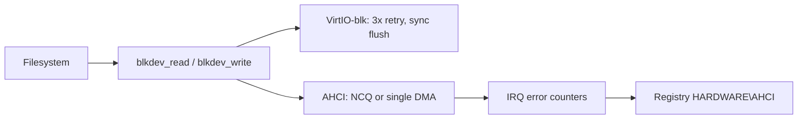

<!-- docs: covers=todo/05-storage-filesystems/TODO-01-block-storage-hardening.md sources=include/kernel/drivers/blkdev.h,src/kernel/drivers/blkdev.c,src/kernel/drivers/virtio/blk_api.c,src/kernel/drivers/virtio/blk_init.c,src/kernel/drivers/ahci/ahci_ncq.c,src/kernel/drivers/ahci/ahci_rw.c,src/kernel/drivers/ahci/ahci_core.c,src/kernel/drivers/ahci/ahci_error.c,src/kernel/test/test_storage.c reviewed=2026-09-28 order=1 -->
# Block Storage Hardening

## What is it?

Block storage hardening makes the disk layer survive errors and report on itself. The block-device table, the VirtIO-blk driver and the AHCI driver already work, and several pieces of this roadmap exist in the drivers without being marked done: VirtIO-blk flush and retry, and AHCI native command queuing (NCQ). What is missing is a write-back queue with `fsync()`, SMART health data, per-device I/O counters, a block cache and I/O rate limits. None of the roadmap's eight sections is marked complete.

## How does it work?

**The block-device table is a thin pass-through.** Every disk is a `struct blkdev` in [`blkdev.h`](../../include/kernel/drivers/blkdev.h), registered in a table of 16 entries. `blkdev_read()` and `blkdev_write()` in [`blkdev.c`](../../src/kernel/drivers/blkdev.c) call the driver's callback directly: there is no cache, no counter and no queue between a filesystem and the driver. `blkdev_sync()` calls the driver's flush and returns success when a driver has none. At shutdown `blkdev_shutdown_all()` flushes every device, then shuts the controllers down. [Storage Controllers and Removable Media](../hardware/storage-controllers.md) describes the table and each driver in full.

**VirtIO-blk already flushes and retries.** `virtio_blk_flush()` in [`blk_init.c`](../../src/kernel/drivers/virtio/blk_init.c) sends `VIRTIO_BLK_T_FLUSH` and waits for it, up to three attempts; it reports "not supported" when the device did not offer the flush feature. `virtio_blk_read()` and `virtio_blk_write()` in [`blk_api.c`](../../src/kernel/drivers/virtio/blk_api.c) retry an I/O error three times, fail an unsupported request at once, and reset the device on a timeout. Error counts stay inside the driver. Flushes are synchronous, so nothing is held in a write-back queue and there is no `fsync()` path to it.

**AHCI already uses NCQ.** When the controller reports `CAP.SNCQ` and the drive's IDENTIFY data says it supports queuing, [`ahci_rw.c`](../../src/kernel/drivers/ahci/ahci_rw.c) logs the depth and sends reads and writes through [`ahci_ncq.c`](../../src/kernel/drivers/ahci/ahci_ncq.c), which allocates a tag from a bitmap and issues READ/WRITE FPDMA QUEUED. After three command failures the port drops back to single-command DMA. The roadmap still lists NCQ as open work because its race and test items have not been done.

**AHCI error handling is partial.** The interrupt handler in [`ahci_core.c`](../../src/kernel/drivers/ahci/ahci_core.c) counts fatal, non-fatal and CRC errors and fails any queued NCQ commands. Recovery (command list override, then a COMRESET link reset) runs only when a command finds the drive stuck busy, not on every task-file error. [`ahci_error.c`](../../src/kernel/drivers/ahci/ahci_error.c) copies the per-port counters to the Registry.



## What are its interfaces?

| Interface | Purpose |
| --- | --- |
| `blkdev_register()`, `blkdev_read()`, `blkdev_write()`, `blkdev_sync()`, `blkdev_discard()`, `blkdev_shutdown_all()` | The block-device table ([`blkdev.h`](../../include/kernel/drivers/blkdev.h)) |
| `virtio_blk_flush()`, `virtio_blk_read()`, `virtio_blk_write()` | VirtIO-blk flush and retrying I/O ([`blk_init.c`](../../src/kernel/drivers/virtio/blk_init.c), [`blk_api.c`](../../src/kernel/drivers/virtio/blk_api.c)) |
| `ahci_submit()`, `ncq_issue_rw()` | Queued AHCI commands ([`ahci_ncq.c`](../../src/kernel/drivers/ahci/ahci_ncq.c)) |
| `HKLM\HARDWARE\AHCI\Port<N>\Errors` | `FatalErrors`, `NonfatalErrors`, `CrcErrors`, `LinkResets` and `CmdFailures` per port |

## How do I use it?

Nothing needs configuring. On an AHCI machine the serial log shows whether a drive queues commands:

```text
Port <n>: NCQ supported (depth <d>)
```

A port that keeps failing queued commands logs `Port <n>: NCQ disabled (cmd_failures=<k>) -- falling back to legacy ATA DMA`, and a recovered stuck drive logs `Port <n>: CLO recovery complete`. The VirtIO retry messages are at debug level. `bash scripts/test.sh SUITE=storage` (or `make test-storage`) runs the two storage suites in [`test_storage.c`](../../src/kernel/test/test_storage.c), which read sector 0 from an AHCI and a VirtIO disk and skip when the disk is absent. No suite covers flush, retry, NCQ or recovery.

## What is not implemented yet?

- **A write-back queue and `fsync()`** for VirtIO-blk ([VirtIO-blk Flush & Write-back](../../todo/05-storage-filesystems/TODO-01-block-storage-hardening.md#1-virtio-blk-flush--write-back-sonnet)); the retry tests in [VirtIO-blk Error Recovery](../../todo/05-storage-filesystems/TODO-01-block-storage-hardening.md#2-virtio-blk-error-recovery-sonnet).
- **The NCQ race guard and tests** ([AHCI Native Command Queuing](../../todo/05-storage-filesystems/TODO-01-block-storage-hardening.md#3-ahci-native-command-queuing-ncq-opus)) and **recovery on every task-file error** with an offline state ([AHCI Error Recovery](../../todo/05-storage-filesystems/TODO-01-block-storage-hardening.md#4-ahci-error-recovery-opus)).
- **SMART data**: nothing sends ATA SMART READ DATA ([AHCI SMART Read](../../todo/05-storage-filesystems/TODO-01-block-storage-hardening.md#5-ahci-smart-read-sonnet)).
- **Per-device I/O counters** and an `iostat` command ([Block Device I/O Metrics](../../todo/05-storage-filesystems/TODO-01-block-storage-hardening.md#6-block-device-io-metrics-sonnet)).
- **A block cache** ([Block-Level Disk Cache](../../todo/05-storage-filesystems/TODO-01-block-storage-hardening.md#7-block-level-disk-cache-opus)) and **I/O rate limits** per owner ([Block-I/O QoS](../../todo/05-storage-filesystems/TODO-01-block-storage-hardening.md#8-block-io-qos-iops--bandwidth-caps-opus)).

## How does it compare with Windows 11 and Linux?

Windows 11 flushes through `storport.sys` and `StorAHCI.sys` retries and resets ports automatically; Linux has `REQ_OP_FLUSH` in `virtio_blk` and the libata error-handling framework in `ahci`. Both expose SMART to user tools and keep a page cache above the disk. Impossible OS has flush, retry and NCQ in its drivers but no SMART, counters, cache or rate limits yet.

## See also

- [Block storage hardening roadmap](../../todo/05-storage-filesystems/TODO-01-block-storage-hardening.md)
- [Storage Controllers and Removable Media](../hardware/storage-controllers.md)
- [Disk Benchmark and I/O Diagnostics](disk-diagnostics.md)
- [Storage](index.md)
