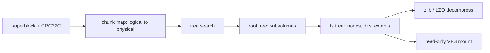

<!-- docs: covers=todo/05-storage-filesystems/TODO-10-btrfs-readonly.md sources=src/kernel/fs/partition.c,include/kernel/fs/partition.h,include/kernel/kchecksum.h,include/kernel/fs/vfs.h reviewed=2026-09-28 order=10 -->
# Btrfs

## What is it?

Btrfs is the default filesystem on Fedora Workstation and openSUSE and the recommended one on Synology network storage, so it is what a user often finds when they pull a disk out of a Synology NAS or a Linux desktop. A Synology volume sits on Linux software RAID (and usually LVM) underneath Btrfs, which the roadmap does not cover, so such a disk is not directly readable even once the driver exists. Impossible OS has no Btrfs code and does not recognise a Btrfs partition. This roadmap adds a read-only driver in ten sections, none of them started. Writing is deliberately out of scope: the copy-on-write B-tree write path is one of the largest and most delicate parts of the Linux implementation, and reading covers the recovery and data-access case.

## How does it work?

**Today.** `probe_filesystem()` in [`partition.c`](../../src/kernel/fs/partition.c) checks each partition for IXFS, NTFS, FAT32 and ext2. There is no Btrfs check, so a Btrfs partition is classed `PART_FS_UNKNOWN` ([`partition.h`](../../include/kernel/fs/partition.h)) and skipped. The one piece the driver can reuse already exists: `kcrc32c()` in [`kchecksum.h`](../../include/kernel/kchecksum.h), the CRC32C that Btrfs uses for its superblock and every tree node.

**Planned design.** Btrfs stores everything in B-trees that address data by logical address, so the order of work is fixed:

1. Read the superblock at 64 KiB and verify its CRC32C, falling back to the backup copies.
2. Parse B-tree nodes and leaves, checking each node's checksum.
3. Build the chunk map that turns logical addresses into physical ones. It bootstraps from the small chunk array inside the superblock, then reads the full chunk tree; single-device and RAID1 layouts are in scope, and a RAID5 or RAID6 volume is refused.
4. A generic tree search and walk.
5. The root tree, to list subvolumes, which appear under a virtual `.btrfs` directory.
6. Inodes, file extents (plain, inline, preallocated and compressed with zlib, LZO or Zstd), directories, symbolic links and extended attributes.
7. VFS registration with every write operation refused.

## What are its interfaces?

None yet. The driver will register a read-only `struct vfs_fs_driver` with `vfs_mount()` ([`vfs.h`](../../include/kernel/fs/vfs.h)) and add a `btrfs_probe()` to the planned probe chain ([Volume Management](volume-management.md)). Programs will read Btrfs files through the ordinary file calls; writes will fail.

## How do I use it?

It cannot be used yet. A Btrfs disk attached to the machine is detected as a disk, but its partition gets no drive letter.

## What is not implemented yet?

Everything in the roadmap:

- **The foundation**: [Superblock Parse + CRC32C Verify](../../todo/05-storage-filesystems/TODO-10-btrfs-readonly.md#1-superblock-parse--crc32c-verify-sonnet), [B-Tree Node Format](../../todo/05-storage-filesystems/TODO-10-btrfs-readonly.md#2-b-tree-node-format-sonnet), [Chunk Tree](../../todo/05-storage-filesystems/TODO-10-btrfs-readonly.md#3-chunk-tree----logicalphysical-map-opus) and [Tree Search + Walk](../../todo/05-storage-filesystems/TODO-10-btrfs-readonly.md#4-tree-search--walk-sonnet).
- **Reading files**: [Root Tree + Subvolume Enumeration](../../todo/05-storage-filesystems/TODO-10-btrfs-readonly.md#5-root-tree--subvolume-enumeration-sonnet), [Inode Reader](../../todo/05-storage-filesystems/TODO-10-btrfs-readonly.md#6-inode-reader-sonnet), [Extent Data Decoder](../../todo/05-storage-filesystems/TODO-10-btrfs-readonly.md#7-extent-data-decoder-opus), [Directory Reader](../../todo/05-storage-filesystems/TODO-10-btrfs-readonly.md#8-directory-reader-sonnet) and [Symlinks + XAttrs](../../todo/05-storage-filesystems/TODO-10-btrfs-readonly.md#9-symlinks--xattrs-sonnet).
- **Mounting**: [VFS Registration + Probe + Read-Only Mount](../../todo/05-storage-filesystems/TODO-10-btrfs-readonly.md#10-vfs-registration--probe--read-only-mount-sonnet). The VFS has no read-only mount flag yet, so this section also has to add one.
- **Writing and RAID5/6 volumes** are not planned.

## How does it compare with Windows 11 and Linux?

Windows 11 has no Btrfs support; the third-party WinBtrfs driver fills the gap. Linux has read-write Btrfs in the kernel with every compression codec and RAID level, and `btrfs-progs` for maintenance. Impossible OS plans a native read-only driver, which is enough to copy data off a Linux disk formatted directly with Btrfs.

## See also

- [Btrfs roadmap](../../todo/05-storage-filesystems/TODO-10-btrfs-readonly.md)
- [ext4](ext4.md)
- [Apple Filesystems](apple-filesystems.md)
- [Volume Management and Auto-mount](volume-management.md)
- [Btrfs specification notes](../../specs/storage/filesystems/btrfs.md)
- [Storage](index.md)
