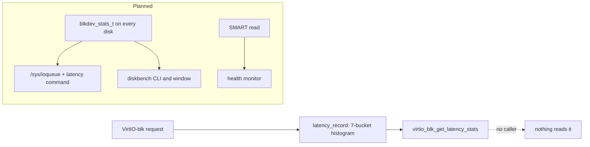

<!-- docs: covers=todo/05-storage-filesystems/TODO-14-disk-benchmark-diagnostics.md sources=include/kernel/drivers/virtio/blk_internal.h,src/kernel/drivers/virtio/blk_telemetry.c,include/kernel/drivers/blkdev.h,src/kernel/boot_timing.c reviewed=2026-09-28 order=14 -->
# Disk Benchmark and I/O Diagnostics

## What is it?

Disk diagnostics answer "how fast is this disk, how healthy is it, and where does my I/O time go?" This roadmap adds a `diskbench` command and window, SMART health reports with a score, per-device I/O statistics and latency histograms, a profiler for the filesystem layer and a background health monitor. None of its seven sections is started. The only measurement in the tree today is a latency histogram inside the VirtIO-blk driver that nothing reads.

## How does it work?

**VirtIO-blk latency, kept but unused.** The VirtIO-blk driver timestamps each request with the CPU timestamp counter when it is submitted and again when it completes, and `latency_record()` adds the difference to one of four histograms (read, write, flush, discard) declared in [`blk_internal.h`](../../include/kernel/drivers/virtio/blk_internal.h). Each histogram has seven buckets, split at 1 µs, 10 µs, 100 µs, 1 ms, 10 ms and 100 ms, and keeps a total, minimum and maximum. `virtio_blk_get_latency_stats()` in [`blk_telemetry.c`](../../src/kernel/drivers/virtio/blk_telemetry.c) turns a histogram into an average and estimated 50th, 99th and 99.9th percentiles in microseconds, but no code calls it.

**Nothing generic yet.** The block-device structure in [`blkdev.h`](../../include/kernel/drivers/blkdev.h) has no statistics field, so AHCI, NVMe and USB disks record nothing, and there is no `/proc/diskstats`-style view. The timestamp-counter frequency measured at boot is available from `boot_timing_tsc_freq()` in [`boot_timing.c`](../../src/kernel/boot_timing.c), which the benchmark will need to turn counter ticks into time. No code sends ATA SMART commands or reads the NVMe health log.

**Planned design.** The order is data first, tools second:

1. A generic `blkdev_stats_t` with counters and a latency histogram on every block device, updated by the block layer rather than each driver.
2. Per-device histograms exposed at `/sys/ioqueue` and through `NtQuerySystemInformation`, with a `latency` command.
3. SMART attribute reads for SATA drives with a computed health score.
4. `diskbench`: sequential and random reads and writes at queue depths 1, 4, 16 and 32, reporting throughput and latency percentiles, then a window that draws the results.
5. A filesystem profiler that costs nothing when switched off, and a low-priority health monitor thread that warns when SMART attributes worsen.

## What are its interfaces?

| Interface | Purpose |
| --- | --- |
| `virtio_blk_get_latency_stats()` | Average, percentiles, minimum and maximum per VirtIO-blk request type ([`blk_telemetry.c`](../../src/kernel/drivers/virtio/blk_telemetry.c)) |
| `boot_timing_tsc_freq()` | Timestamp-counter frequency measured at boot ([`boot_timing.c`](../../src/kernel/boot_timing.c)) |

Everything else in the roadmap is new interface.

## How do I use it?

There is nothing to run yet. For block-device error counts on AHCI disks, see the Registry counters described in [Block Storage Hardening](block-storage-hardening.md).

## What is not implemented yet?

- **Statistics on every disk** ([Generic `blkdev_stats_t` + Histogram API](../../todo/05-storage-filesystems/TODO-14-disk-benchmark-diagnostics.md#4-generic-blkdev_stats_t--histogram-api-opus)) and their **view** ([Per-Device Latency Histogram + `/sys/ioqueue`](../../todo/05-storage-filesystems/TODO-14-disk-benchmark-diagnostics.md#5-per-device-latency-histogram--sysioqueue-sonnet)). The roadmap describes a 64-bucket histogram; the VirtIO one has 7.
- **Benchmarking** ([`diskbench` CLI](../../todo/05-storage-filesystems/TODO-14-disk-benchmark-diagnostics.md#1-diskbench-cli-opus), [Disk Benchmark GUI](../../todo/05-storage-filesystems/TODO-14-disk-benchmark-diagnostics.md#2-disk-benchmark-gui-sonnet)).
- **Health** ([SMART Extended Diagnostics](../../todo/05-storage-filesystems/TODO-14-disk-benchmark-diagnostics.md#3-smart-extended-diagnostics-sonnet), [Storage Health Monitor Daemon](../../todo/05-storage-filesystems/TODO-14-disk-benchmark-diagnostics.md#7-storage-health-monitor-daemon-sonnet)), which builds on the SMART read in [AHCI SMART Read](../../todo/05-storage-filesystems/TODO-01-block-storage-hardening.md#5-ahci-smart-read-sonnet).
- **Filesystem profiling** ([VFS Hot-Path Profiler](../../todo/05-storage-filesystems/TODO-14-disk-benchmark-diagnostics.md#6-vfs-hot-path-profiler-sonnet)).

## How does it compare with Windows 11 and Linux?

Windows 11 exposes per-disk performance counters and a drive health view in Settings, but has no built-in benchmark; people use CrystalDiskMark and CrystalDiskInfo. Linux has `/proc/diskstats`, `iostat` and `blktrace`, with `smartmontools` and `fio` as separate packages, and GNOME Disks includes a graphical read and write benchmark with transfer-rate and access-time graphs. Neither system ships a queue-depth sweep with latency percentiles, which is what this roadmap adds.

## See also

- [Disk diagnostics roadmap](../../todo/05-storage-filesystems/TODO-14-disk-benchmark-diagnostics.md)
- [Block Storage Hardening](block-storage-hardening.md)
- [Storage Controllers and Removable Media](../hardware/storage-controllers.md)
- [Partition Management and Storage Tools](partition-tools.md)
- [Storage](index.md)
