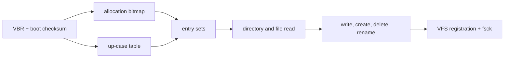

<!-- docs: covers=todo/05-storage-filesystems/TODO-08-exfat-readwrite.md sources=src/kernel/fs/partition.c,include/kernel/fs/partition.h,include/kernel/fs/mbr.h,include/kernel/fs/vfs.h reviewed=2026-09-28 order=8 -->
# exFAT

## What is it?

exFAT is the filesystem on most USB drives larger than 32 GB and on every SDXC card, because the SD Association requires it there and Windows formats large removable drives with it by default. Impossible OS has no exFAT driver yet: an exFAT partition is not recognised and does not get a drive letter. This roadmap writes a clean-room read-write driver from Microsoft's published specification, in twelve sections, none of them started.

## How does it work?

**Today.** At boot, `probe_filesystem()` in [`partition.c`](../../src/kernel/fs/partition.c) checks each partition for IXFS, NTFS, FAT32 and ext2, in that order. None of those checks matches an exFAT boot sector: the NTFS check looks for the `NTFS` OEM name, and the FAT32 check needs the classic BIOS parameter block, which exFAT leaves zeroed. The partition is classed `PART_FS_UNKNOWN` ([`partition.h`](../../include/kernel/fs/partition.h)) and skipped without a message. On an MBR disk, exFAT shares partition type `0x07` with NTFS ([`mbr.h`](../../include/kernel/fs/mbr.h)), so the type byte alone cannot tell them apart; the driver will have to read the boot sector's `EXFAT` OEM name.

**Planned design.** The roadmap builds the driver in the order the format needs:

1. The volume boot record and its 11-sector boot checksum.
2. The allocation bitmap (one bit per cluster, unlike FAT32's chain-walking free count).
3. The up-case table, which defines case-insensitive name comparison for the volume.
4. Directory entry sets: a File entry, a Stream Extension entry and one or more File Name entries, each set checksummed.
5. Directory and file reads, including the NoFatChain fast path for contiguous files, which skips the FAT entirely.
6. Writes, create, delete and rename, timestamps with 10 ms precision and UTC offsets, then VFS registration and a repair pass.
7. Unicode edge cases and files larger than 4 GiB.

The driver will register a `struct vfs_fs_driver` with `vfs_mount()` ([`vfs.h`](../../include/kernel/fs/vfs.h)) the same way the FAT32, NTFS and IXFS drivers do.

## What are its interfaces?

None yet. The planned surface is an `exfat_probe()` for the probe chain in [Volume Management](volume-management.md) and a `vfs_ops` table for the VFS, with no new user-facing API: programs will open exFAT files through the same file calls as any other drive.

## How do I use it?

It cannot be used yet. A USB drive or SD card formatted exFAT is detected as a disk, and its partition is scanned, but nothing mounts. Reformatting it as FAT32 (with a 4 GiB per-file limit) is the workaround today.

## What is not implemented yet?

Everything in the roadmap:

- **The on-disk foundation**: [VBR Parser + Boot Checksum](../../todo/05-storage-filesystems/TODO-08-exfat-readwrite.md#1-vbr-parser--boot-checksum-sonnet), [Allocation Bitmap](../../todo/05-storage-filesystems/TODO-08-exfat-readwrite.md#2-allocation-bitmap-sonnet), [Up-Case Table](../../todo/05-storage-filesystems/TODO-08-exfat-readwrite.md#3-up-case-table-sonnet) and [Directory Entry Sets](../../todo/05-storage-filesystems/TODO-08-exfat-readwrite.md#4-directory-entry-sets-opus).
- **The read path**: [Directory Read](../../todo/05-storage-filesystems/TODO-08-exfat-readwrite.md#5-directory-read-sonnet) and [File Read](../../todo/05-storage-filesystems/TODO-08-exfat-readwrite.md#6-file-read-sonnet).
- **The write path**: [File Write](../../todo/05-storage-filesystems/TODO-08-exfat-readwrite.md#7-file-write-opus), [Create / Delete / Rename](../../todo/05-storage-filesystems/TODO-08-exfat-readwrite.md#8-file-create--delete--rename-sonnet) and [Timestamp Encoding](../../todo/05-storage-filesystems/TODO-08-exfat-readwrite.md#9-timestamp-encoding-sonnet).
- **Integration and edges**: [VFS Registration + Probe + fsck](../../todo/05-storage-filesystems/TODO-08-exfat-readwrite.md#10-vfs-registration--probe--fsck-sonnet), [Unicode Edge Cases](../../todo/05-storage-filesystems/TODO-08-exfat-readwrite.md#11-unicode-edge-cases-sonnet) and [Large File Support](../../todo/05-storage-filesystems/TODO-08-exfat-readwrite.md#12-large-file-support--4-gib-sonnet).

The probe chain the driver plugs into is itself unbuilt ([Filesystem Probe Chain](../../todo/05-storage-filesystems/TODO-03-volume-management-automount.md#1-filesystem-probe-chain--drive-letter-assignment-opus)).

## How does it compare with Windows 11 and Linux?

Windows 11 has read-write exFAT in `exfat.sys` and formats with `format /fs:exfat`; Linux has had an in-kernel read-write `exfat` driver since 5.7, with `exfatprogs` for format and repair. Both mount exFAT media automatically. Impossible OS cannot read exFAT at all yet; the roadmap's aim is spec conformance, not new features.

## See also

- [exFAT roadmap](../../todo/05-storage-filesystems/TODO-08-exfat-readwrite.md)
- [FAT32 and VFS Semantics](fat32-vfs.md)
- [Volume Management and Auto-mount](volume-management.md)
- [exFAT specification notes](../../specs/storage/filesystems/exfat-1.0.md)
- [Storage](index.md)
