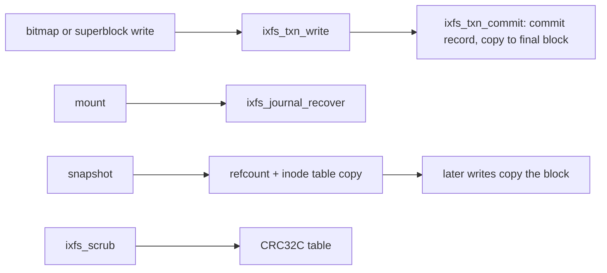

<!-- docs: covers=todo/05-storage-filesystems/TODO-07-ixfs-advanced-enterprise.md sources=include/kernel/fs/ixfs.h,src/kernel/fs/ixfs/ixfs_journal.c,src/kernel/fs/ixfs/ixfs_cow.c,src/kernel/fs/ixfs/ixfs_extent.c,src/kernel/fs/ixfs/ixfs_format.c,src/kernel/fs/ixfs/ixfs_fsck.c,src/kernel/fs/ixfs/ixfs_ops.c,src/kernel/test/test_ixfs_fsck.c reviewed=2026-09-28 order=7 -->
# IXFS Advanced Storage

## What is it?

This roadmap adds the features meant to put IXFS ahead of NTFS: sparse files, TRIM, transparent compression, deduplication, reflink copies, online defragmentation and resize, self-healing metadata, scheduled snapshots, per-file encryption, a change journal, quotas, storage tiering and a health dashboard. None of its sixteen sections is complete. What IXFS has today for reliability is a small write-ahead journal, copy-on-write snapshots, a checksum scrub and a repair pass, all built into the version 2 format described in [IXFS Core](ixfs-core.md).

## How does it work?

**Journal.** [`ixfs_journal.c`](../../src/kernel/fs/ixfs/ixfs_journal.c) keeps a 16-block (64 KiB) circular journal. A transaction holds at most eight blocks; `ixfs_txn_commit()` writes a commit record, copies each block to its final place and marks the journal empty, and `ixfs_journal_recover()` replays what is left at mount. Only block-bitmap and superblock updates go through it. Each entry stores 4080 bytes of its 4096-byte block and checks them with an additive byte sum, and recovery does not check for a commit record before replaying; the defect is filed under [Subsystem Verification](../../todo/05-storage-filesystems/TODO-06-ixfs-core-win32-compat.md#1-subsystem-verification-sonnet).

**Snapshots.** [`ixfs_cow.c`](../../src/kernel/fs/ixfs/ixfs_cow.c) keeps a per-block reference count and up to eight named snapshots (`IXFS_MAX_SNAPSHOTS` in [`ixfs.h`](../../include/kernel/fs/ixfs.h)). A snapshot copies the inode table and raises the reference count of every block in use, so later writes copy the block instead of overwriting it. `ixfs_snapshot_restore()` ignores read and write failures and still logs success.

**Checksums and scrub.** The checksum table holds a CRC32C per block, but only data blocks are covered: `ixfs_checksum_verify()` in [`ixfs_core.c`](../../src/kernel/fs/ixfs/ixfs_core.c) skips every block before the data region (superblock, bitmap, checksum table, inode table, journal, refcount and snapshot tables) and any block whose entry is zero. A mismatch on read logs a warning and the data is returned anyway. `ixfs_scrub()` in [`ixfs_format.c`](../../src/kernel/fs/ixfs/ixfs_format.c) walks the allocated data blocks with the same exclusions and reports mismatches; it does not repair them.

**Repair pass.** `ixfs_fsck()` in [`ixfs_fsck.c`](../../src/kernel/fs/ixfs/ixfs_fsck.c) checks the superblock, directory entries, orphaned and cross-linked blocks, the bitmap against the inode table, and journal entries, in check-only or repair mode, and downgrades to check-only on a read-only volume.

**Sparse files, in part.** An extent starting at block 0 reads as a hole ([`ixfs_extent.c`](../../src/kernel/fs/ixfs/ixfs_extent.c)), and a write past the end of a file leaves a gap rather than zero-filling it. There is no hole punching and no sparse-file attribute.

Nothing in the shell or the desktop calls the scrub, the repair pass or the snapshot functions yet; they run from kernel tests.



## What are its interfaces?

| Interface | Purpose |
| --- | --- |
| `ixfs_txn_begin()`, `ixfs_txn_write()`, `ixfs_txn_commit()`, `ixfs_journal_recover()` | Journal ([`ixfs_journal.c`](../../src/kernel/fs/ixfs/ixfs_journal.c)) |
| `ixfs_snapshot_create()`, `_list()`, `_restore()`, `_delete()` | Snapshots ([`ixfs.h`](../../include/kernel/fs/ixfs.h)) |
| `ixfs_scrub()`, `ixfs_fsck()`, `struct ixfs_fsck_report` | Integrity scan and repair |
| `ixfs_stat()` | Logical size and blocks actually used, for sparse files |

## How do I use it?

There is no user command yet. `make test-fs` runs the repair-pass suites in [`test_ixfs_fsck.c`](../../src/kernel/test/test_ixfs_fsck.c), which build damaged volumes in memory and check what the pass finds and fixes. When the repair pass runs, the serial log brackets it:

```text
IXFS fsck starting (read-only mode)
IXFS fsck done: <n> errors (orphans=<a> bad-dirents=<b> cross=<c> bitmap=<d> journal=<e>) -- clean
```

## What is not implemented yet?

- **Storage efficiency**: [sparse files](../../todo/05-storage-filesystems/TODO-07-ixfs-advanced-enterprise.md#1-sparse-file-support-opus), [TRIM](../../todo/05-storage-filesystems/TODO-07-ixfs-advanced-enterprise.md#2-real-time-trim-sonnet), [compression](../../todo/05-storage-filesystems/TODO-07-ixfs-advanced-enterprise.md#3-transparent-lz4zstd-compression-opus), [deduplication](../../todo/05-storage-filesystems/TODO-07-ixfs-advanced-enterprise.md#4-inline-block-deduplication-opus) and [reflink copies](../../todo/05-storage-filesystems/TODO-07-ixfs-advanced-enterprise.md#5-reflink-instant-copy-opus).
- **Maintenance while mounted**: [defragmentation](../../todo/05-storage-filesystems/TODO-07-ixfs-advanced-enterprise.md#6-online-defragmentation-opus), [resize](../../todo/05-storage-filesystems/TODO-07-ixfs-advanced-enterprise.md#7-online-volume-resize-opus) and [self-healing metadata](../../todo/05-storage-filesystems/TODO-07-ixfs-advanced-enterprise.md#8-self-healing-metadata-sonnet).
- **Protection and accounting**: [scheduled snapshots](../../todo/05-storage-filesystems/TODO-07-ixfs-advanced-enterprise.md#9-automatic-scheduled-snapshots-sonnet), [per-file encryption](../../todo/05-storage-filesystems/TODO-07-ixfs-advanced-enterprise.md#10-per-file-aes-256-xts-encryption-opus), [a change journal](../../todo/05-storage-filesystems/TODO-07-ixfs-advanced-enterprise.md#11-usn-change-journal-sonnet), [quotas](../../todo/05-storage-filesystems/TODO-07-ixfs-advanced-enterprise.md#12-volume-quotas-sonnet) and [tiering](../../todo/05-storage-filesystems/TODO-07-ixfs-advanced-enterprise.md#13-filesystem-native-storage-tiering-opus).
- **Visibility and tests**: [a health dashboard](../../todo/05-storage-filesystems/TODO-07-ixfs-advanced-enterprise.md#14-volume-health-dashboard-sonnet) and [a test suite](../../todo/05-storage-filesystems/TODO-07-ixfs-advanced-enterprise.md#15-comprehensive-test-suite-sonnet).
- **Mount-time validation of the inode table and layout**, plus the ignored write results in unlink and snapshot restore ([Inode-Table + On-Disk-Layout Hardening](../../todo/05-storage-filesystems/TODO-07-ixfs-advanced-enterprise.md#16-inode-table--on-disk-layout-hardening)).

## How does it compare with Windows 11 and Linux?

NTFS on Windows 11 has sparse files, compression, EFS encryption, the USN change journal, quotas and Volume Shadow Copy snapshots; ReFS adds block cloning and integrity streams. Btrfs on Linux has compression, reflinks, snapshots, scrub and online resize, and ZFS adds deduplication. IXFS has data-block checksums, snapshots and a repair pass today, and none of the efficiency, encryption or accounting features yet.

## See also

- [IXFS advanced storage roadmap](../../todo/05-storage-filesystems/TODO-07-ixfs-advanced-enterprise.md)
- [IXFS Core](ixfs-core.md)
- [Partition Management and Storage Tools](partition-tools.md)
- [Storage](index.md)
