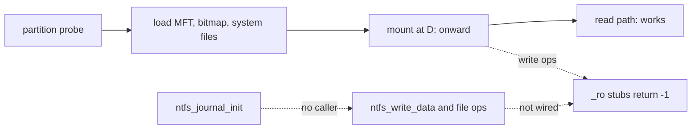

<!-- docs: covers=todo/05-storage-filesystems/TODO-02-ntfs-readwrite.md sources=include/kernel/fs/ntfs.h,src/kernel/fs/ntfs/ntfs_vfs.c,src/kernel/fs/ntfs/ntfs_io.c,src/kernel/fs/ntfs/ntfs_efs.c,src/kernel/fs/ntfs/ntfs_compress.c,src/kernel/fs/ntfs/ntfs_metadata.c,src/kernel/fs/ntfs/ntfs_data_write.c,src/kernel/fs/ntfs/ntfs_file_ops.c,src/kernel/fs/ntfs/ntfs_journal.c,src/kernel/fs/ntfs/ntfs_recovery.c,src/kernel/fs/ntfs/ntfs_sysfiles.c,src/kernel/fs/ntfs/ntfs_test.c,src/kernel/fs/partition.c reviewed=2026-09-28 order=2 -->
# NTFS

## What is it?

The NTFS driver lets Impossible OS read disks formatted by Windows. A mounted NTFS volume is read-only today: the driver reads ordinary, compressed and sparse files, and a journaled write engine exists in the kernel, but the drive letter a user sees refuses every write, and EFS-encrypted files cannot be decrypted yet. This roadmap wires writes through, arms the journal, adds a formatter and `$Secure`, and replays a dirty volume at mount. None of its six sections is complete. The system drive `C:` stays IXFS; NTFS is for external and dual-boot disks.

## How does it work?

**Mounting.** At boot, `partition_mount_filesystems()` in [`partition.c`](../../src/kernel/fs/partition.c) probes each partition, checking NTFS before FAT32 because the FAT32 heuristic also matches an NTFS boot sector. An NTFS partition is loaded (boot sector, MFT cache, cluster bitmap, MFT allocator and system files) and mounted at the next free letter from `D:`, skipping `X:`, which is reserved for BlackBox. At most four NTFS volumes mount at once.

**Reading.** [`ntfs_vfs.c`](../../src/kernel/fs/ntfs/ntfs_vfs.c) connects open, read, directory listing, lookup and stat to the driver. Reads handle attribute lists, run lists, sparse runs and LZNT1-compressed files ([`ntfs_compress.c`](../../src/kernel/fs/ntfs/ntfs_compress.c)). The mounted volume reads only a file's unnamed data stream: alternate data streams are skipped, and a reparse point (a junction or symbolic link) is not followed, although the driver has parsers for both that only the self-test calls. For an EFS-encrypted file the driver parses the encryption metadata in [`ntfs_efs.c`](../../src/kernel/fs/ntfs/ntfs_efs.c), but unwrapping the file key and decrypting both return `NTFS_ERR_NOT_READY` until the kernel's CNG key store exists, so the file's contents cannot be read.

**Why writes fail.** The same file routes write, truncate, create, delete, rename, mkdir, rmdir and the attribute and time setters to stubs that return `-1`. The engine behind them exists: `ntfs_write_data()` and `ntfs_truncate()` in [`ntfs_data_write.c`](../../src/kernel/fs/ntfs/ntfs_data_write.c), `ntfs_create_file()`, `ntfs_delete_file()` and `ntfs_rename_file()` in [`ntfs_file_ops.c`](../../src/kernel/fs/ntfs/ntfs_file_ops.c), and B+ tree insert and delete with node split and merge. Nothing on the mount path calls them.

**Why the journal is not armed.** Writers open a `$LogFile` transaction with `ntfs_txn_begin()` in [`ntfs_journal.c`](../../src/kernel/fs/ntfs/ntfs_journal.c), which returns `NULL` unless the journal was initialised, and each writer then proceeds without journaling. `ntfs_journal_init()` has no caller at all, so wiring writes without first arming the journal would produce unjournaled writes.

**Dirty volumes.** [`ntfs_sysfiles.c`](../../src/kernel/fs/ntfs/ntfs_sysfiles.c) reads the volume flags and warns when Windows did not unmount cleanly. The three-pass replay (analysis, redo, undo) in [`ntfs_recovery.c`](../../src/kernel/fs/ntfs/ntfs_recovery.c) is written, but nothing calls `ntfs_recovery_replay()`, so a dirty volume is reported and mounted as it is.



## What are its interfaces?

| Interface | Purpose |
| --- | --- |
| `ntfs_get_driver()` and the `vfs_ops` tables | What a mounted volume exposes ([`ntfs_vfs.c`](../../src/kernel/fs/ntfs/ntfs_vfs.c)) |
| `ntfs_write_data()`, `ntfs_truncate()`, `ntfs_create_file()`, `ntfs_delete_file()`, `ntfs_rename_file()` | Write engine, not reachable from a drive letter ([`ntfs.h`](../../include/kernel/fs/ntfs.h)) |
| `ntfs_journal_init()`, `ntfs_txn_begin()`, `ntfs_txn_commit()` | `$LogFile` transactions |
| `ntfs_recovery_replay()` | Dirty-volume replay, not yet called at mount |

## How do I use it?

Attach a disk with an NTFS partition and boot. The serial log shows where it landed:

```text
Mounted NTFS volume on drive D: (<sectors> sectors)
```

Files can be listed and read from that letter. A volume Windows left dirty adds `WARNING: Volume was not cleanly unmounted (dirty flag set)`. In a build with kernel tests, a volume labelled `NTFS_TEST` also runs the driver's self-test in [`ntfs_test.c`](../../src/kernel/fs/ntfs/ntfs_test.c), which exercises reads, the write engine and the B+ tree directly and ends with `NTFS TEST SUITE PASSED: <n>/<n> tests OK`. Its journal cases count as passed without running when the journal is not initialised, which it never is, so a passing run says nothing about journaling. It is not part of `scripts/test.sh`.

## What is not implemented yet?

- **An audited, journaled B+ tree** and an armed journal ([B+ Tree Mutation Audit + Journaling](../../todo/05-storage-filesystems/TODO-02-ntfs-readwrite.md#1-b-tree-mutation-audit--journaling-opus)).
- **Writes through the drive letter** ([Write Data Path Wiring](../../todo/05-storage-filesystems/TODO-02-ntfs-readwrite.md#2-write-data-path-wiring-sonnet)).
- **Formatting a volume**: no `ntfs_format()` exists ([NTFS Volume Initialiser](../../todo/05-storage-filesystems/TODO-02-ntfs-readwrite.md#3-ntfs-volume-initialiser-opus)).
- **`$Secure`**: security IDs are found but not looked up ([`$Secure` Security Stream](../../todo/05-storage-filesystems/TODO-02-ntfs-readwrite.md#4-secure-security-stream-sonnet)).
- **Replay at mount** ([Dirty Volume Recovery Wiring](../../todo/05-storage-filesystems/TODO-02-ntfs-readwrite.md#5-dirty-volume-recovery-wiring-sonnet)) and a **format, crash and replay test** ([NTFS Format + Crash + Replay Test](../../todo/05-storage-filesystems/TODO-02-ntfs-readwrite.md#6-ntfs-format--crash--replay-test-sonnet)).

## How does it compare with Windows 11 and Linux?

Windows 11's `NTFS.sys` reads, writes, formats and replays `$LogFile` at mount; Linux's `ntfs3` driver reads and writes with journal replay, and `mkntfs` formats. Impossible OS reads NTFS, including compressed files but not yet EFS-encrypted ones, and has the write, journal and replay code in the kernel, but a mounted volume is read-only until that code is wired.

## See also

- [NTFS read/write roadmap](../../todo/05-storage-filesystems/TODO-02-ntfs-readwrite.md)
- [Volume Management and Auto-mount](volume-management.md)
- [FAT32 and VFS Semantics](fat32-vfs.md)
- [Partition Management and Storage Tools](partition-tools.md)
- [Storage](index.md)
