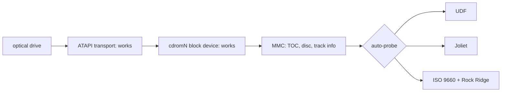

<!-- docs: covers=todo/05-storage-filesystems/TODO-11-optical-media.md sources=src/kernel/drivers/ahci/ahci_atapi.c,src/kernel/main/blkdev_adapters.c,src/kernel/fs/partition.c,include/kernel/drivers/ahci.h reviewed=2026-09-28 order=11 -->
# Optical Media

## What is it?

Optical media support reads CDs, DVDs and Blu-ray discs: the drive commands underneath, and the ISO 9660, Joliet and UDF filesystems on the disc. Impossible OS already drives SATA optical drives at the command level and can read raw sectors from a disc, but there is no disc filesystem, so a disc never gets a drive letter. This roadmap adds the missing drive commands and three read-only filesystem drivers in eight sections, none of them started.

## How does it work?

**The drive layer works.** [`ahci_atapi.c`](../../src/kernel/drivers/ahci/ahci_atapi.c) sends SCSI packet commands to an optical drive on an AHCI port: INQUIRY, TEST UNIT READY, REQUEST SENSE, GET CONFIGURATION, READ CAPACITY, READ(10) and READ(12). At boot each drive logs its identity and, with a disc present, its size (but see the warning under [How do I use it?](#how-do-i-use-it)):

```text
ATAPI port <n>: INQUIRY: <vendor> <model> rev <rev>
ATAPI port <n>: <size> MB (<blocks> blocks x <bytes> bytes)
```

**It is registered as a read-only disk.** `blkdev_register_all()` in [`blkdev_adapters.c`](../../src/kernel/main/blkdev_adapters.c) adds each drive to the block-device table as `cdrom0`, `cdrom1` and so on, with no write callback. The adapter passes the logical block address to `ahci_atapi_read()` as 32 bits, which covers every disc size. [Storage Controllers and Removable Media](../hardware/storage-controllers.md) covers this layer in full.

**Nothing reads the disc's filesystem.** The partition scan in [`partition.c`](../../src/kernel/fs/partition.c) checks each disk for IXFS, NTFS, FAT32 and ext2, none of which a disc carries, so the disc is skipped. There are also no table-of-contents, disc-information or track-information commands, which a driver needs to find the data track on a multi-session or mixed-mode disc. The scan currently reads one sector into a 512-byte buffer, which a 2048-byte disc sector overruns; that is filed against the boot mount rewrite in [Volume Management](volume-management.md).

**Planned design.** The roadmap first adds the MMC commands (READ TOC, READ DISC INFORMATION, READ TRACK INFORMATION). It then builds ISO 9660 with Rock Ridge extensions for Unix names and permissions, Joliet for Unicode names, and UDF (versions 1.5 to 2.01) for DVD and Blu-ray. An auto-probe picks the richest format on the disc, UDF first, then Joliet, then plain ISO 9660, and the disc label is published for `GetVolumeInformationW`. Raw audio-sector reads for audio CDs come last.



## What are its interfaces?

| Interface | Purpose |
| --- | --- |
| `ahci_atapi_count()`, `ahci_atapi_read()`, `ahci_atapi_capacity()`, `ahci_atapi_sector_size()` | Optical drive access ([`ahci.h`](../../include/kernel/drivers/ahci.h)) |
| `cdrom0`, `cdrom1`, ... | Read-only entries in the block-device table |

No filesystem interface exists yet.

## How do I use it?

Do not boot with a data disc in an optical drive yet. The boot partition scan reads the disc's first 2048-byte sector into a 512-byte stack buffer and overwrites 1536 bytes of kernel stack; the fix is filed under [Boot Mount Sequence Rewrite](../../todo/05-storage-filesystems/TODO-03-volume-management-automount.md#2-boot-mount-sequence-rewrite-sonnet). An empty drive is safe: it logs the INQUIRY line above and registers as `cdromN`. Even with the fix, no drive letter appears and no program can open files on a disc. No unit suite covers the optical path.

## What is not implemented yet?

- **The MMC command layer** ([SCSI MMC Layer](../../todo/05-storage-filesystems/TODO-11-optical-media.md#1-scsi-mmc-layer----read-toc-disc-info-track-info-sonnet)).
- **Disc filesystems**: [ISO 9660 Base](../../todo/05-storage-filesystems/TODO-11-optical-media.md#2-iso-9660-base-sonnet), [Rock Ridge Extensions](../../todo/05-storage-filesystems/TODO-11-optical-media.md#3-rock-ridge-extensions-sonnet), [Joliet](../../todo/05-storage-filesystems/TODO-11-optical-media.md#4-joliet-sonnet) and [UDF](../../todo/05-storage-filesystems/TODO-11-optical-media.md#5-udf-opus).
- **Choosing and naming the volume**: [Auto-Probe Priority](../../todo/05-storage-filesystems/TODO-11-optical-media.md#6-auto-probe-priority-sonnet) and [Disc Label + Metadata](../../todo/05-storage-filesystems/TODO-11-optical-media.md#7-disc-label--metadata-sonnet).
- **Audio CDs** ([Audio CD Raw Reads](../../todo/05-storage-filesystems/TODO-11-optical-media.md#8-audio-cd-raw-reads-sonnet)).
- **Eject, disc-change events and the drive letter itself** belong to [Optical Drive Handling](../../todo/05-storage-filesystems/TODO-03-volume-management-automount.md#7-optical-drive-handling-sonnet).

## How does it compare with Windows 11 and Linux?

Windows 11 reads ISO 9660 and Joliet through `cdfs.sys` and UDF through `udfs.sys`, and reads the table of contents through `cdrom.sys`. Linux has `isofs` with Rock Ridge and Joliet, `udf`, and the `cdrom` layer. Both mount a disc automatically on insertion. Impossible OS has the drive layer only; the roadmap plans one in-kernel probe that picks the best format, and Rock Ridge support, which Windows lacks.

## See also

- [Optical media roadmap](../../todo/05-storage-filesystems/TODO-11-optical-media.md)
- [Storage Controllers and Removable Media](../hardware/storage-controllers.md)
- [Volume Management and Auto-mount](volume-management.md)
- [ISO 9660 specification notes](../../specs/storage/filesystems/iso9660.md)
- [Joliet and UDF specification notes](../../specs/storage/filesystems/joliet-udf.md)
- [Storage](index.md)
