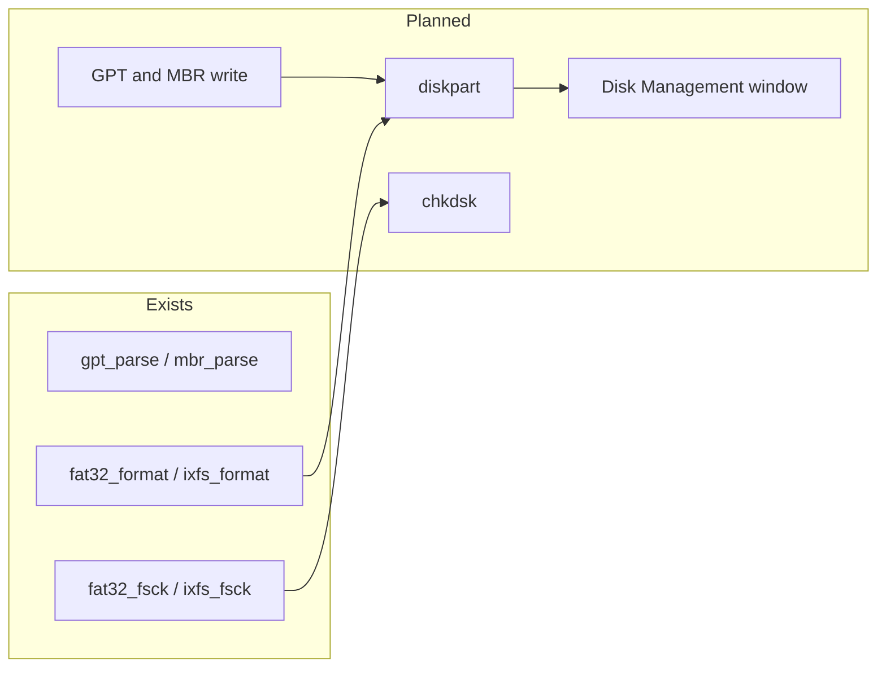

<!-- docs: covers=todo/05-storage-filesystems/TODO-13-partition-tools-storage-suite.md sources=src/kernel/fs/gpt.c,include/kernel/fs/gpt.h,src/kernel/fs/mbr.c,src/kernel/fs/partition.c,src/kernel/fs/fat32/fat32_format.c,src/kernel/fs/fat32/fat32_fsck.c,src/kernel/fs/ixfs/ixfs_format.c,src/kernel/fs/ixfs/ixfs_fsck.c,tools/mkfs-ixfs.c,user/cmd.c reviewed=2026-09-28 order=13 -->
# Partition Management and Storage Tools

## What is it?

Storage tools are the commands and windows a user runs to look after disks: create and delete partitions, format, check and repair, defragment, verify system files, recover deleted files, see what fills a drive and manage snapshots. Impossible OS has the kernel engines for several of these (GPT and MBR parsing, FAT32 and IXFS formatters, FAT32 and IXFS repair passes) but no command or window that runs them, and it cannot yet write a partition table. This roadmap adds the partition writers and ten tools in ten sections, none of them started.

## How does it work?

**Reading partition tables.** `gpt_parse()` in [`gpt.c`](../../src/kernel/fs/gpt.c) reads the GPT header and entries and checks their CRC32s, and `mbr_parse()` with `mbr_walk_ebr()` in [`mbr.c`](../../src/kernel/fs/mbr.c) reads MBR disks including logical partitions. `partition_scan_all()` in [`partition.c`](../../src/kernel/fs/partition.c) registers each partition as a block device and names its type. `gpt_sync_backup()` can rewrite the backup GPT (entries first, then header), but nothing calls it yet, and there is no function to create, delete or resize a partition.

**Formatters.** `fat32_format()` in [`fat32_format.c`](../../src/kernel/fs/fat32/fat32_format.c) and `ixfs_format()` in [`ixfs_format.c`](../../src/kernel/fs/ixfs/ixfs_format.c) lay down an empty FAT32 or IXFS volume on a block device. Nothing in the running system calls them; system disks are built on the host by [`mkfs-ixfs`](../../tools/mkfs-ixfs.c) during the image build.

**Repair passes.** `fat32_fsck()` in [`fat32_fsck.c`](../../src/kernel/fs/fat32/fat32_fsck.c) runs automatically when a dirty FAT32 volume mounts ([FAT32 and VFS Semantics](fat32-vfs.md)). `ixfs_fsck()` in [`ixfs_fsck.c`](../../src/kernel/fs/ixfs/ixfs_fsck.c) checks and repairs IXFS but runs only from tests ([IXFS Advanced Storage](ixfs-advanced.md)). When a FAT32 volume cannot be repaired, the mount log tells the operator to run `chkdsk` from recovery, a command that does not exist yet.

**The shell has no disk commands.** The user-mode shell in [`user/cmd.c`](../../user/cmd.c) knows `help`, `echo`, `cls`, `ver`, `dir`, `type`, `ps`, `kill`, `sysinfo`, `uptime`, `ping`, `ipconfig`, `reboot`, `shutdown` and `exit`, with their aliases. None of them touches disks.

## What are its interfaces?

| Interface | Purpose |
| --- | --- |
| `gpt_parse()`, `gpt_type_name()`, `gpt_sync_backup()` | GPT reading and backup rewrite ([`gpt.h`](../../include/kernel/fs/gpt.h)) |
| `mbr_parse()`, `mbr_walk_ebr()`, `mbr_type_name()` | MBR and logical partitions ([`mbr.c`](../../src/kernel/fs/mbr.c)) |
| `fat32_format()`, `ixfs_format()` | In-kernel formatters, not yet reachable |
| `fat32_fsck()`, `ixfs_fsck()` | Repair passes, automatic for FAT32 only |
| `mkfs-ixfs -o  -s <size> [-l <label>] [--populate <dir>]` | Host-side IXFS image builder |

## How do I use it?

There is nothing to run inside Impossible OS yet. On the build host, `bash scripts/build.sh` compiles `mkfs-ixfs` and uses it to build the IXFS images for the system disk. With debug logging on, the partition scan shows each partition, for example `Disk 0, Partition 1: FAT32, 16 MiB (EFI System)`.

## What is not implemented yet?

- **Writing partition tables** ([GPT Partition Write](../../todo/05-storage-filesystems/TODO-13-partition-tools-storage-suite.md#1-gpt-partition-write-sonnet), [MBR Partition Write](../../todo/05-storage-filesystems/TODO-13-partition-tools-storage-suite.md#2-mbr-partition-write-sonnet)).
- **Command-line tools**: [`diskpart`](../../todo/05-storage-filesystems/TODO-13-partition-tools-storage-suite.md#3-diskpart-cli-sonnet), [`chkdsk`](../../todo/05-storage-filesystems/TODO-13-partition-tools-storage-suite.md#4-chkdsk-cli--gui-sonnet), [`defrag`](../../todo/05-storage-filesystems/TODO-13-partition-tools-storage-suite.md#5-defrag-cli--gui-opus), [`sfc`](../../todo/05-storage-filesystems/TODO-13-partition-tools-storage-suite.md#6-sfc-cli--gui-sonnet), [`recover`](../../todo/05-storage-filesystems/TODO-13-partition-tools-storage-suite.md#7-recover-cli--gui-opus) and [`diskuse`](../../todo/05-storage-filesystems/TODO-13-partition-tools-storage-suite.md#9-diskuse-cli--gui-sonnet), each with a window.
- **Windows**: [Disk Management](../../todo/05-storage-filesystems/TODO-13-partition-tools-storage-suite.md#8-disk-management-gui-sonnet) and a [Snapshot Manager](../../todo/05-storage-filesystems/TODO-13-partition-tools-storage-suite.md#10-snapshot-manager-cli--gui-sonnet).
- **Repair for NTFS, exFAT and ext4**, which waits on those drivers ([NTFS](ntfs.md), [exFAT](exfat.md), [ext4](ext4.md)).

## How does it compare with Windows 11 and Linux?

Windows 11 ships `diskpart`, `format`, `chkdsk`, `defrag`, `sfc` and the Disk Management console. Linux spreads the same work over `fdisk`, `gdisk`, `parted`, the `mkfs.*` and `fsck.*` families and GParted or GNOME Disks. Neither has built-in deleted-file recovery or a disk-usage treemap. Impossible OS has the kernel engines for formatting and repair and plans a Windows-style command set on top, plus the recovery and treemap tools the other two lack.

## See also

- [Partition tools roadmap](../../todo/05-storage-filesystems/TODO-13-partition-tools-storage-suite.md)
- [Volume Management and Auto-mount](volume-management.md)
- [FAT32 and VFS Semantics](fat32-vfs.md)
- [IXFS Advanced Storage](ixfs-advanced.md)
- [Disk Benchmark and I/O Diagnostics](disk-diagnostics.md)
- [GPT specification notes](../../specs/storage/partitioning/gpt.md)
- [Storage](index.md)
