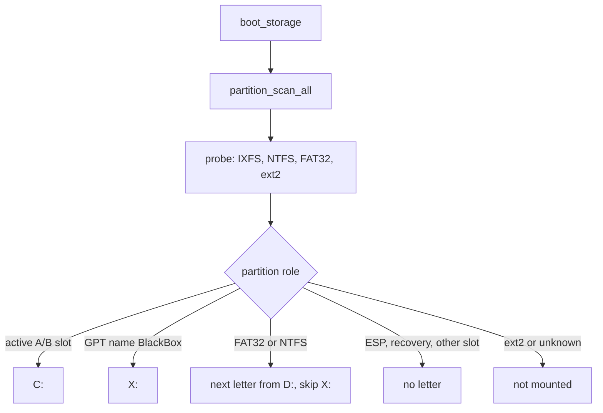

<!-- docs: covers=todo/05-storage-filesystems/TODO-03-volume-management-automount.md sources=src/kernel/fs/partition.c,include/kernel/fs/partition.h,src/kernel/fs/vfs.c,include/kernel/fs/vfs.h,src/kernel/main/boot_storage.c,src/kernel/nt/nt_file.c,src/kernel/drivers/ahci/ahci_hotplug.c,src/kernel/test/test_vfs.c reviewed=2026-09-28 order=3 -->
# Volume Management and Auto-mount

## What is it?

Volume management decides which filesystem sits on each partition and which drive letter it gets. Today one boot-time function does all of it with fixed rules: `C:` is the active system slot, BlackBox is `X:`, and other FAT32 and NTFS partitions take `D:` onward. This roadmap replaces that function with a probe chain and letter allocator, then adds USB hot-plug mounting, safe removal, `mount` and `umount` commands, the Win32 volume queries and volume control codes. None of its eight sections is complete.

## How does it work?

**Boot order.** [`boot_storage.c`](../../src/kernel/main/boot_storage.c) registers the block devices, then calls `vfs_init()`, `partition_scan_all()` and `partition_mount_filesystems()` with the active A/B slot. `vfs_init()` in [`vfs.c`](../../src/kernel/fs/vfs.c) creates a table of 26 drive letters (`VFS_MAX_DRIVES` in [`vfs.h`](../../include/kernel/fs/vfs.h)).

**Probing.** `probe_filesystem()` in [`partition.c`](../../src/kernel/fs/partition.c) reads the first sector of a partition and tries IXFS, then NTFS, then FAT32, then reads sector 2 for the ext2 magic. The result is one of the `PART_FS_*` codes in [`partition.h`](../../include/kernel/fs/partition.h). A partition that matches nothing is skipped without a message, and an ext2 or ext4 partition is recognised but never mounted.

**Letter rules.** `partition_mount_filesystems()` applies them in order:

- `C:` is the IXFS root of the active A/B slot. If the slot's root cannot be mounted, or the boot disk is ambiguous (duplicate GUIDs or several A/B disks), `C:` is left unmounted on purpose and the bootloader rolls back next boot ([A/B Boot and Rollback](../boot/ab-boot-rollback.md)).
- The EFI System Partition, the recovery partition and the other A/B slot get no letter.
- A FAT32 partition whose GPT name is `BlackBox` becomes `X:` ([BlackBox Service Partition](../boot/blackbox-service-partition.md)).
- Every other FAT32 or NTFS partition takes the next letter from `D:`, skipping `X:`, in scan order.

Letters are not stored anywhere, so the same disk can land on a different letter if the scan order changes.

**Removal and hot-plug.** `vfs_unmount()` only clears the drive slot; it does not flush or close open files. AHCI port hot-plug is detected in [`ahci_hotplug.c`](../../src/kernel/drivers/ahci/ahci_hotplug.c), but a new disk is not probed or mounted, and a removed one is flushed at the port but never unmounted. A USB stick is only mounted if it was present at boot ([Storage Controllers and Removable Media](../hardware/storage-controllers.md)).

**Volume queries.** `NtQueryVolumeInformationFile` in [`nt_file.c`](../../src/kernel/nt/nt_file.c) returns fixed values for every drive: the label `Impossible`, serial `0x494D5053`, filesystem `IXFS` and a fixed size. `NtFsControlFile` returns `STATUS_INVALID_DEVICE_REQUEST` for every control code.



## What are its interfaces?

| Interface | Purpose |
| --- | --- |
| `vfs_mount()`, `vfs_unmount()`, `vfs_is_mounted()`, `vfs_get_drive_root()` | Drive-letter table ([`vfs.h`](../../include/kernel/fs/vfs.h)) |
| `partition_scan_all()`, `partition_mount_filesystems()`, `partition_fs_name()` | Boot-time scan and mount ([`partition.h`](../../include/kernel/fs/partition.h)) |
| `vfs_query_volume_flags()` | Per-drive filesystem flags (Unicode on disk, case preserved, ACLs on NTFS and IXFS) |
| `NtQueryVolumeInformationFile`, `NtFsControlFile` | Win32 volume surface, fixed values and a refusal today |

## How do I use it?

Boot with extra disks attached and read the serial log. The lines to look for:

```text
VFS initialized (26 drive letters A:\ - Z:\)
A/B: mounted slot <n> as C:
BlackBox partition mounted as X:\
Mounted NTFS volume on drive D: (<sectors> sectors)
```

There is no command to list, mount or unmount volumes yet. The VFS suites in [`test_vfs.c`](../../src/kernel/test/test_vfs.c) (`make test-fs`) check the drive-letter range and file round trips, but not the letter assignment rules.

## What is not implemented yet?

- **A probe chain and letter allocator** recorded in the Registry ([Filesystem Probe Chain + Drive-Letter Assignment](../../todo/05-storage-filesystems/TODO-03-volume-management-automount.md#1-filesystem-probe-chain--drive-letter-assignment-opus)), and the **boot mount rewrite** onto it ([Boot Mount Sequence Rewrite](../../todo/05-storage-filesystems/TODO-03-volume-management-automount.md#2-boot-mount-sequence-rewrite-sonnet)).
- **USB hot-plug mounting** ([USB Hot-Plug Volume Arrival](../../todo/05-storage-filesystems/TODO-03-volume-management-automount.md#3-usb-hot-plug-volume-arrival-opus)) and **safe removal** ([USB Safe Removal](../../todo/05-storage-filesystems/TODO-03-volume-management-automount.md#4-usb-safe-removal-sonnet)).
- **`mount` and `umount` commands** ([Manual `mount` / `umount` Shell Commands](../../todo/05-storage-filesystems/TODO-03-volume-management-automount.md#5-manual-mount--umount-shell-commands-sonnet)).
- **Real Win32 volume answers** such as `GetLogicalDrives` and `GetVolumeInformationW` ([Win32 Volume Query APIs](../../todo/05-storage-filesystems/TODO-03-volume-management-automount.md#6-win32-volume-query-apis-sonnet)).
- **Optical discs** ([Optical Drive Handling](../../todo/05-storage-filesystems/TODO-03-volume-management-automount.md#7-optical-drive-handling-sonnet)) and **volume control codes** such as dismount and lock ([Volume Control Ioctls](../../todo/05-storage-filesystems/TODO-03-volume-management-automount.md#8-volume-control-ioctls-sonnet)).

## How does it compare with Windows 11 and Linux?

Windows 11's mount manager (`mountmgr.sys`) assigns and remembers letters, mounts hot-plugged disks and offers Safely Remove Hardware; Linux mounts through `udev`, `udisks2` and `/etc/fstab`, with `mount` and `umount` commands. Impossible OS mounts what is present at boot by fixed rules and has no hot-plug mount, removal or remembered letters yet.

## See also

- [Volume management roadmap](../../todo/05-storage-filesystems/TODO-03-volume-management-automount.md)
- [A/B Boot and Rollback](../boot/ab-boot-rollback.md)
- [BlackBox Service Partition](../boot/blackbox-service-partition.md)
- [Storage Controllers and Removable Media](../hardware/storage-controllers.md)
- [Optical Media](optical-media.md)
- [Storage](index.md)
