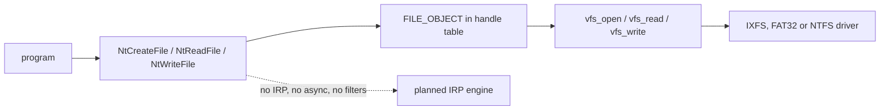

<!-- docs: covers=todo/05-storage-filesystems/TODO-05-win32-file-io-api.md sources=src/kernel/fs/fat32/fat32_ops.c,src/kernel/nt/nt_syscall.c,src/kernel/nt/nt_file.c,include/kernel/nt/nt_file.h,src/kernel/ob/ob_file.c,include/kernel/ob/ob_file.h,user/lib/win32.c,src/kernel/pe.c reviewed=2026-09-28 order=5 -->
# Win32 File I/O

## What is it?

Win32 file I/O is how a program opens, reads, writes and lists files through handles. Today a program reaches files through the NT native calls (`NtCreateFile`, `NtReadFile`, `NtWriteFile`, `NtQueryDirectoryFile` and about twenty more), which the kernel implements directly on top of the VFS. This roadmap adds what those calls stand in for on Windows: an I/O request packet (IRP) engine, memory descriptor lists, asynchronous I/O, a filter manager, change notifications, device control and the full `kernel32` file API. None of its fourteen sections is complete, and none of that machinery exists yet.

## How does it work?

**Opening a file.** `NtCreateFile_handler()` in [`nt_syscall.c`](../../src/kernel/nt/nt_syscall.c) maps the Windows create dispositions (supersede, open, create, open-if, overwrite, overwrite-if) onto VFS flags and returns the right status: `STATUS_OBJECT_NAME_COLLISION` when a create-new name exists, `STATUS_OBJECT_NAME_NOT_FOUND` when an open-existing name does not. `FILE_DELETE_ON_CLOSE` is honoured. Paths are narrowed to ASCII, and a non-ASCII path is refused as `STATUS_OBJECT_NAME_INVALID`. The requested share mode is ignored, so every handle opens share-all ([FAT32 and VFS Semantics](fat32-vfs.md)).

**Handles.** Each open file is a `FILE_OBJECT` ([`ob_file.h`](../../include/kernel/ob/ob_file.h)) created by `ob_create_file_handle()` in [`ob_file.c`](../../src/kernel/ob/ob_file.c) and stored in the process's object-manager handle table, which grows on demand ([Object Manager](../kernel/object-manager.md)).

**Reading and writing.** `NtReadFile` and `NtWriteFile` call `vfs_read()` and `vfs_write()` at the handle's position or an explicit offset, and return `STATUS_END_OF_FILE` at the end. The VFS offset is 32 bits, so a file position past 4 GiB cannot be reached. All I/O is synchronous: `NtCancelIoFile` succeeds without doing anything, and completion ports exist (16 ports of 64 entries, [`nt_file.h`](../../include/kernel/nt/nt_file.h)) but no file I/O posts to them asynchronously.

**Metadata and directories.** [`nt_file.c`](../../src/kernel/nt/nt_file.c) answers basic, standard, name, position and network-open information, and sets basic, disposition, position, end-of-file, rename and allocation information. Rename works within one directory and cannot replace. Attributes are reported only as normal or directory. File times are a fixed base plus the filesystem's seconds. The code comment calls the base 2026-01-01, but the constant in `vfs_seconds_to_filetime()` is 2024-12-30 10:40 UTC, so a FAT32 file, whose `stat` returns zero, shows that date. `NtQueryDirectoryFile` supports the legacy, directory, both-directory and ID-both-directory classes.

**What refuses.** `NtDeviceIoControlFile`, `NtFsControlFile` and `NtNotifyChangeDirectoryFile` return `STATUS_INVALID_DEVICE_REQUEST`. `NtQueryVolumeInformationFile` returns the same fixed label, serial, filesystem name and size for every drive ([Volume Management](volume-management.md)).

**User mode.** The small shim in [`user/lib/win32.c`](../../user/lib/win32.c) offers `CreateFileA` for opening existing files only, `ReadFile` and `CloseHandle`, over an older interrupt-based call. The `kernel32` export table in [`pe.c`](../../src/kernel/pe.c) names the file functions, but the user-mode trampolines behind them are not shipped.

## What are its interfaces?

| Interface | Purpose |
| --- | --- |
| `NtCreateFile`, `NtOpenFile`, `NtReadFile`, `NtWriteFile`, `NtClose` | Handle-based file access ([`nt_syscall.c`](../../src/kernel/nt/nt_syscall.c)) |
| `NtQueryInformationFile`, `NtSetInformationFile`, `NtQueryDirectoryFile` | Metadata, rename, delete and listing |
| `NtDeleteFile`, `NtFlushBuffersFile`, `NtLockFile`, `NtUnlockFile` | Delete, flush and byte-range locks ([`nt_file.c`](../../src/kernel/nt/nt_file.c)) |
| `NtDeviceIoControlFile`, `NtFsControlFile`, `NtNotifyChangeDirectoryFile` | Registered, refuse every request |

The service numbers are listed in the [Native API and the SSDT](../kernel/native-api-ssdt.md).

## How do I use it?

Call the NT functions from a native program; the `NTSTATUS` result is the only diagnostic, since these handlers write nothing to the serial log. The NT file tests run inside the kernel suites (`bash scripts/test.sh`); none of the roadmap's own tests exist yet.

## What is not implemented yet?

- **The IRP engine, MDLs and a dedicated file handle table** ([IRP Engine](../../todo/05-storage-filesystems/TODO-05-win32-file-io-api.md#1-irp-engine-opus), [MDL](../../todo/05-storage-filesystems/TODO-05-win32-file-io-api.md#2-mdl----memory-descriptor-list-opus), [File Handle Table](../../todo/05-storage-filesystems/TODO-05-win32-file-io-api.md#3-file-handle-table-opus)).
- **The `kernel32` calls**: [`CreateFile` / `CloseHandle`](../../todo/05-storage-filesystems/TODO-05-win32-file-io-api.md#4-createfile--closehandle-sonnet), [`ReadFile` / `WriteFile` / `SetFilePointerEx`](../../todo/05-storage-filesystems/TODO-05-win32-file-io-api.md#5-readfile--writefile--setfilepointerex-opus), [directory APIs](../../todo/05-storage-filesystems/TODO-05-win32-file-io-api.md#6-directory-apis--per-process-cwd-sonnet), [delete, move and copy](../../todo/05-storage-filesystems/TODO-05-win32-file-io-api.md#7-file-management----delete-move-copy-sonnet) and [metadata](../../todo/05-storage-filesystems/TODO-05-win32-file-io-api.md#8-file-metadata-apis-sonnet).
- **Asynchronous I/O** ([Async I/O + APC](../../todo/05-storage-filesystems/TODO-05-win32-file-io-api.md#9-async-io--apc-opus)) and **a filter manager** ([Filter Manager Stub](../../todo/05-storage-filesystems/TODO-05-win32-file-io-api.md#10-filter-manager-stub-sonnet)).
- **Moving kernel callers onto the file API** ([Internal Migration](../../todo/05-storage-filesystems/TODO-05-win32-file-io-api.md#11-internal-migration----vfs_open--createfile-sonnet)).
- **Change notifications** ([File Change Notifications](../../todo/05-storage-filesystems/TODO-05-win32-file-io-api.md#12-file-change-notifications-sonnet)), **real free-space and volume answers** ([`GetDiskFreeSpaceEx` / `GetVolumeInformation`](../../todo/05-storage-filesystems/TODO-05-win32-file-io-api.md#13-getdiskfreespaceex--getvolumeinformation-sonnet)) and **device control** ([`DeviceIoControl` + FSCTL Dispatch](../../todo/05-storage-filesystems/TODO-05-win32-file-io-api.md#14-deviceiocontrol--fsctl-dispatch--oplock-ioctls)).

## How does it compare with Windows 11 and Linux?

Windows 11 sends file requests to filesystems as IRPs, with a Fast I/O path that skips the IRP for cached reads, writes, queries and locks, and adds MDLs, overlapped I/O, completion ports, `fltmgr.sys` filters and `ReadDirectoryChangesW`. Linux has no IRPs: its VFS calls each filesystem's `file_operations`, with `io_uring` for asynchronous I/O and `inotify` for notifications. Impossible OS is closer to Linux inside (NT calls straight onto the VFS, all synchronous) while presenting NT-shaped calls to programs.

## See also

- [Win32 file I/O roadmap](../../todo/05-storage-filesystems/TODO-05-win32-file-io-api.md)
- [Native API and the SSDT](../kernel/native-api-ssdt.md)
- [Object Manager](../kernel/object-manager.md)
- [FAT32 and VFS Semantics](fat32-vfs.md)
- [Volume Management and Auto-mount](volume-management.md)
- [Storage](index.md)
