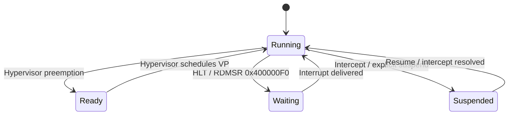
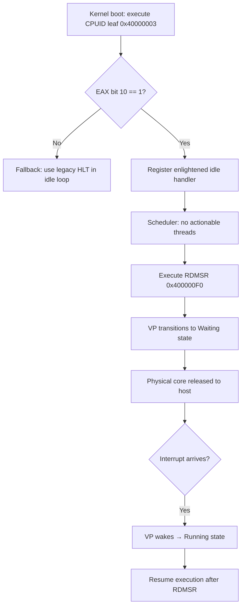
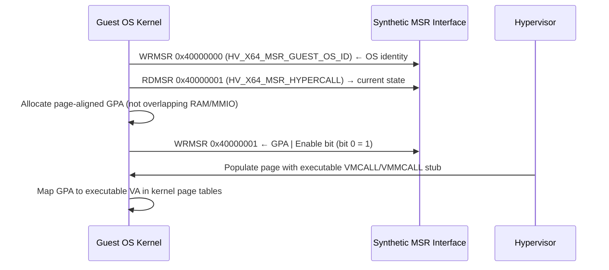
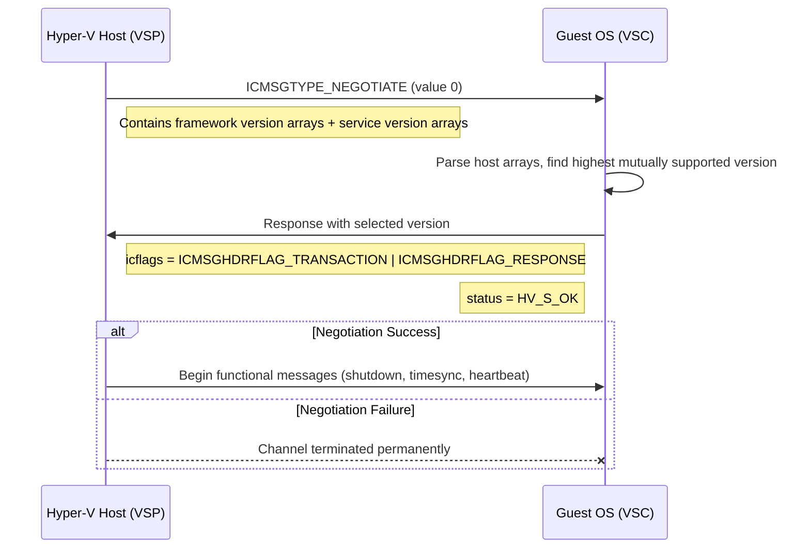
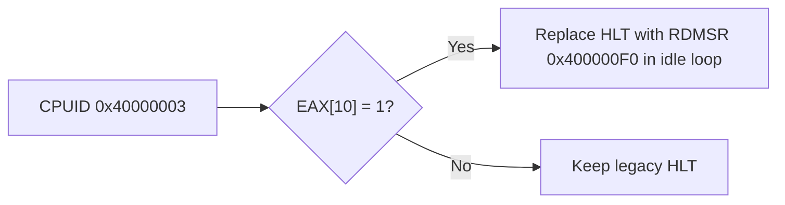

# Hyper-V Power Management: Architecture and Implementation Specification for Custom Operating Systems

> **Scope:** This document provides an exhaustive, TLFS-referenced specification of
> Hyper-V power management, virtual processor idling, ACPI sleep state transitions,
> and VMBus Integration Services (Shutdown, TimeSync, Heartbeat) as they pertain to
> the Impossible OS kernel implementation.
> Cross-references to source files use project-relative paths.

---

## 1. Introduction and Architectural Foundations of Hyper-V Virtualization

The development of a custom operating system targeting the Microsoft Hyper-V environment
necessitates a rigorous understanding of the hypervisor's architectural paradigms,
particularly concerning power management, system state transitions, and virtual processor
idling. Hyper-V operates as a **Type-1 bare-metal hypervisor**, abstracting the physical
hardware into isolated execution environments known as **partitions**. The hypervisor itself
acts as the ultimate arbiter of physical processor execution, memory translation, and
interrupt routing, while delegating higher-level machine management to a privileged
management partition, designated as the **root or parent partition**.

Within this topology, the root partition executes the virtualization stack, which includes
the **Virtual Machine Management Service (VMMS)** and the **Virtualization Infrastructure
Driver (VID)**. This stack facilitates the creation, configuration, and lifecycle management
of child partitions, which contain the guest operating systems. Because child partitions
lack direct access to physical hardware, traditional hardware-centric power management
paradigms — such as manipulating physical CPU P-states (performance states) and C-states
(idle states), or accessing physical Advanced Configuration and Power Interface (ACPI)
power planes — are inherently restricted or entirely abstracted. Instead, Hyper-V projects
a sophisticated synthetic hardware environment that guest operating systems must interact
with cooperatively.

### 1.1 The Cooperative Power Management Triad

Power management within a Hyper-V child partition is consequently an exercise in
**cooperative virtualization**. The guest operating system must interact with the hypervisor
through a triad of specialized interfaces:

| Interface             | Mechanism                          | Power Management Role                                       |
| --------------------- | ---------------------------------- | ----------------------------------------------------------- |
| **Hypercalls**        | Synchronous trap-based API         | Explicit state changes, VP register manipulation             |
| **Synthetic MSRs**    | Low-latency register read/write    | Enlightened idle state transitions                            |
| **VMBus**             | Asynchronous memory-sharing conduit | Graceful shutdown, hibernation, time sync, heartbeat         |

- **Hypercalls** provide a mechanism for the guest to request synchronous state changes from
  the hypervisor, passing parameters directly through processor registers or memory.
- **Synthetic MSRs** allow for highly optimized, low-latency interactions, such as
  transitioning a virtual processor into an enlightened idle state.
- **VMBus** serves as an asynchronous, high-speed memory-sharing conduit for complex
  paravirtualized devices and integration services, including graceful system shutdown,
  hibernation orchestration, and post-resume time synchronization.

> **Impossible OS context:** VMBus core is implemented in
> [`vmbus.c`](file:///src/kernel/drivers/hyperv/vmbus.c) and
> [`vmbus.h`](file:///include/kernel/drivers/hyperv/vmbus.h).
> Platform detection occurs in [`cpuid_platform.c`](file:///src/kernel/cpuid_platform.c).

### 1.2 Why Enlightened Power Management Matters

For the architect of a custom operating system, fully implementing this cooperative power
management specification is not merely a matter of feature completeness; it is fundamentally
tied to the **performance, density, and thermal efficiency** of the underlying physical host:

- A guest OS that fails to utilize enlightened idle states will perpetually consume logical
  processor cycles, preventing the physical core from entering deep C-states.
- This failure degrades the performance of co-resident virtual machines and inflates the
  host's power consumption and cooling requirements.
- Implementing the **Hypervisor Top-Level Functional Specification (TLFS)** guidelines for
  power management is a critical requirement for any production-grade guest operating system.

---

## 2. Hypervisor Feature Identification and CPUID Enumeration

Before a custom operating system can invoke any Hyper-V specific power management
functionality, it must first detect the presence of the hypervisor and systematically
enumerate the privileges and features granted to its specific partition. This enumeration
is achieved through the architectural **CPUID** instruction. Hyper-V intercepts the CPUID
instruction and injects synthetic responses when queried with specific index values.

The Intel 64 and AMD64 architectures reserve the CPUID leaf range `0x40000000` through
`0x400000FF` for use by system software and hypervisors. A compliant Microsoft Hypervisor
guarantees that leaves `0x40000000` and `0x40000001` are always available for basic
identification. However, advanced power management features require interrogating subsequent
leaves.

### 2.1 Hypervisor CPUID Leaf Map

| CPUID Leaf   | Register        | Field Designation               | Description                                                                                      |
| ------------ | --------------- | ------------------------------- | ------------------------------------------------------------------------------------------------ |
| `0x40000000` | EAX             | Maximum Leaf                    | Returns the maximum CPUID leaf supported by the hypervisor in the `0x40000000` range.             |
| `0x40000000` | EBX, ECX, EDX   | Vendor ID                       | Returns the hypervisor signature: ASCII `"Microsoft Hv"`.                                        |
| `0x40000001` | EAX             | Interface Signature             | Returns the interface identifier. For a compliant implementation: `"Hv#1"`.                      |
| `0x40000002` | EAX–EDX         | Hypervisor Version              | Provides the build number, major version, minor version, and service pack of the hypervisor.     |
| `0x40000003` | EAX–EDX         | Feature Identification          | Defines the core privileges and synthetic capabilities granted to the querying partition.         |
| `0x40000004` | EAX–EDX         | Implementation Recommendations  | Indicates which hypercalls and behaviors are recommended for optimal performance.                 |

### 2.2 The AccessGuestIdleMsr Privilege (Critical)

To utilize enlightened power states, the operating system kernel must execute the CPUID
instruction with `EAX = 0x40000003`. This leaf returns the **Hypervisor Feature
Identification** mask. The returned values dictate whether the operating system is legally
permitted by the hypervisor to access specific synthetic MSRs or invoke certain hypercalls.

Within the EAX register returned by leaf `0x40000003`:

> [!IMPORTANT]
> **Bit 10** is the critical indicator for power management. This bit represents the
> **AccessGuestIdleMsr** privilege. If this bit is set (`CPUID.40000003:EAX[10] = 1`),
> the hypervisor explicitly permits the guest partition to utilize the synthetic guest
> idle MSR. Failure to verify this privilege before attempting to access the idle MSR
> will result in the hypervisor injecting a **#GP (General Protection Fault)** exception
> directly into the guest operating system's execution context, likely triggering a fatal
> kernel panic if unhandled.

Furthermore, the implementation recommendations leaf (`0x40000004`) provides guidance on
hypercall parameter passing. If the hypervisor indicates support for passing hypercall input
via XMM registers (often indicated by bit 4 in the corresponding mask), the guest operating
system can significantly accelerate its power state transitions by utilizing the fast
register-based calling convention rather than standard memory-based parameter blocks.

> **Impossible OS context:** CPUID enumeration is performed in
> [`cpuid_platform.c`](file:///src/kernel/cpuid_platform.c). The `AccessGuestIdleMsr`
> privilege check must be added to the Hyper-V platform initialization path.

---

## 3. Virtual Processor State Machine and Enlightened Idle

In a physical operating system, the kernel's idle loop typically executes
architecture-specific instructions, such as `HLT` or `MWAIT` on the x86/x64 architecture,
to halt instruction execution and signal the physical processor to enter a low-power
C-state. In a virtualized environment, executing such instructions blindly can cause
**costly VM-Exits**:

- When a guest executes a `HLT` instruction, the hypervisor must intercept the halt,
  update internal scheduling structures, and context-switch the physical core to another
  virtual processor, generating substantial latency and overhead.

To mitigate this overhead and enable superior power efficiency, Hyper-V defines a **state
machine** for virtual processors and provides a paravirtualized idle sleep state accessible
via a specific synthetic MSR.

### 3.1 Virtual Processor State Machine

Conceptually, a virtual processor tracked by the Hyper-V scheduler exists in one of four
distinct states:



| State         | Description                                                                                       |
| ------------- | ------------------------------------------------------------------------------------------------- |
| **Running**   | The VP is actively consuming cycles on a physical logical processor.                               |
| **Ready**     | The VP has actionable threads but is currently preempted by the hypervisor's scheduler.             |
| **Suspended** | The VP is stopped on a guest instruction boundary due to an intercept or explicit suspension.       |
| **Waiting**   | The VP executed a halt instruction or entered the enlightened idle state.                           |

### 3.2 Execution Sequence for Virtual Processor Suspension

Understanding the precise sequence of capability verification and execution is critical for
kernel developers to safely enter the virtual idle state without triggering General
Protection Faults:



1. During the OS's processor initialization phase, the kernel executes `CPUID` with leaf
   `0x40000003` to query the hypervisor's feature set.
2. The kernel evaluates **EAX Bit 10**:
   - If `0` → denied the `AccessGuestIdleMsr` privilege; fall back to legacy `HLT`.
   - If `1` → proceed to utilize the enlightened mechanism.
3. When the kernel's scheduler determines that a virtual processor has no actionable
   threads, it executes a `RDMSR` instruction targeting synthetic register `0x400000F0`.
4. Upon this read operation, the virtual processor immediately transitions from **Running**
   to **Waiting**. The physical core is relinquished to the host.
5. The VP remains suspended indefinitely until a hardware or synthetic interrupt arrives.
6. Once the interrupt is delivered, the VP wakes, transitions back to **Running**, and
   resumes instruction execution precisely after the `RDMSR` instruction.

### 3.3 Utilizing HV_X64_MSR_GUEST_IDLE

The core mechanism for entering the virtual idle state is the **HV_X64_MSR_GUEST_IDLE**
register, mapped to address `0x400000F0` on the x64 architecture.

| Property                | Detail                                                                    |
| ----------------------- | ------------------------------------------------------------------------- |
| **MSR Address**         | `0x400000F0`                                                              |
| **Activation**          | `RDMSR` (read operation triggers state transition)                        |
| **Return Value**        | Arbitrary (often zero); value is irrelevant                               |
| **VP State Transition** | Running → Waiting                                                         |
| **Wake Condition**      | Any targeted hardware or synthetic VMBus interrupt                        |
| **Interrupt Masking**   | Wakes regardless of `RFLAGS.IF` state                                     |
| **Platform Restriction**| x64 only; ARM64 must use `WFI` (Wait For Interrupt)                       |

> [!TIP]
> Unlike typical architectural MSRs where configuration data is written via `WRMSR`, the
> guest idle MSR acts as a **programmatic trigger based entirely on a read operation**.
> The read value is irrelevant — the purpose is purely to invoke the hypervisor trap.

**Critical architectural distinction — interrupt masking behavior:**

When a virtual processor is placed into this low-power idle state via
`HV_X64_MSR_GUEST_IDLE`, the hypervisor **guarantees** that the virtual processor will be
forcefully awakened upon the arrival of any targeted hardware interrupt or synthetic VMBus
interrupt. Crucially, this awakening occurs **regardless of whether the interrupt flag
(`RFLAGS.IF`) is currently cleared or enabled** on that specific virtual processor.

This semantic allows the guest operating system's idle loop to safely:

1. Disable interrupts (`CLI`)
2. Perform final scheduling bookkeeping
3. Read the MSR (via `RDMSR 0x400000F0`)
4. ... without creating a race condition where an interrupt arrives just prior to the
   transition and is indefinitely missed.

> [!WARNING]
> The TLFS specifies this feature is **strictly limited to x64 platforms**. Custom operating
> systems compiled for ARM64 architectures cannot utilize `HV_X64_MSR_GUEST_IDLE` and must
> rely on standard ARM `WFI` (Wait For Interrupt) architecture.

---

## 4. The Hypercall Interface for Power State Manipulation

While synthetic MSRs handle rapid, synchronous transitions like idling, broader state
modifications and capability enumerations require the use of Hyper-V **hypercalls**.
Hypercalls form the fundamental Application Programming Interface (API) through which
child partitions communicate complex requests to the hypervisor, allowing the guest to
bypass the traditional hardware abstraction layer for specific management tasks.

### 4.1 Hypercall Page Initialization and Registration

A custom operating system cannot simply execute a hypercall instruction immediately upon
boot. It must formally establish a communication conduit known as the **hypercall page**.
The hypervisor utilizes this page to inject the optimal trapping instruction sequence
(such as `VMCALL` on Intel processors or `VMMCALL` on AMD processors) directly into the
guest's memory space, abstracting the underlying hardware differences from the guest kernel.

**Initialization sequence:**



1. **Write OS identity:** The guest writes its operating system identity into
   `HV_X64_MSR_GUEST_OS_ID` (address `0x40000000`). This is a 64-bit value where the upper
   16 bits define the vendor ID, and the lower 48 bits define the build number and service
   version.

2. **Read hypercall MSR:** The guest reads `HV_X64_MSR_HYPERCALL` (address `0x40000001`)
   to ascertain the current enablement state.

3. **Allocate GPA:** The OS allocates a single, page-aligned block of memory within its
   Guest Physical Address (GPA) space that is not occupied by RAM or MMIO.

4. **Enable hypercall page:** The OS writes a new 64-bit value to `HV_X64_MSR_HYPERCALL`
   that includes the chosen GPA and sets the "Enable Hypercall Page" bit (bit 0) to `1`.
   The hypervisor immediately populates the page with the executable trap sequence.

5. **Map to executable VA:** The guest OS maps this GPA to an executable Virtual Address (VA)
   within its kernel page tables to invoke the code safely.

> **Impossible OS context:** Hypercall page setup is implemented in
> [`hv_setup_hypercall()`](file:///src/kernel/drivers/hyperv/vmbus.c). The allocated page
> is used by `vmbus_signal_channel()` for `HvCallSignalEvent` invocations.

### 4.2 Hypercall Calling Conventions

Hyper-V defines two primary classes of hypercalls:

- **Simple hypercalls** — execute a single operation with a fixed set of parameters.
- **Rep (Repeat) hypercalls** — execute operations over an array of variable-length elements.

For parameter passing, Hyper-V supports standard memory-based parameter blocks and
register-based **"Fast"** hypercalls.

#### Fast Register-Based Calling Convention (x64)

| Register       | Usage in Fast Hypercall Convention                                                    |
| -------------- | ------------------------------------------------------------------------------------- |
| `RCX`          | Call Code (lower 16 bits) + fast flag (bit 16) + variable header size data            |
| `RDX`          | Input parameters, or GPA of the input memory block                                    |
| `R8`           | Output parameters, or GPA of the output memory block                                  |
| `XMM0`–`XMM5` | Extended fast hypercall parameters (up to 112 bytes passed entirely in registers)      |
| `RAX`          | **Return value.** Always overwritten by the hypervisor with the `HV_STATUS` result.   |

The **Call Code** placed in RCX defines the exact operation:
- Lower 16 bits → hypercall number
- Bit 16 → `1` for fast register-based convention, `0` for standard memory-based convention

### 4.3 HvCallSetVpRegisters for Advanced Processor Management

Certain power configurations, synthetic timer initializations, and advanced processor state
manipulations must be orchestrated using the **HvCallSetVpRegisters** hypercall
(**Call Code `0x0051`**). This is a Rep hypercall that allows a guest partition to write to
an array of synthetic registers governing the state of one or more virtual processors.

**Input parameter block layout:**

```
┌─────────────────────────────┐
│  Header                     │
│    PartitionId    (8 bytes)  │  Often HV_VP_INDEX_SELF
│    VpIndex        (4 bytes)  │  Target virtual processor
│    TargetVtl      (1 byte)   │  Virtual Trust Level
│    Reserved       (3 bytes)  │
├─────────────────────────────┤
│  Input List Element [0]      │
│    RegisterName   (4 bytes)  │
│    Reserved       (12 bytes) │  Zero-padded
│    RegisterValue  (16 bytes) │
├─────────────────────────────┤
│  Input List Element [1]      │
│    ...                       │
└─────────────────────────────┘
```

When the hypercall is executed, the hypervisor processes the array sequentially. The
hypervisor validates that:
- Reserved bits within the specified registers are cleared to zero
- The partition possesses the `AccessVpRegisters` privilege

If the operation involves configuring the **Virtual Processor Assist Page** (a critical
structure for accessing synthetic timers and enlightened performance states), the register
value will contain the GPA of the target page.

### 4.4 Parsing Hypercall Status Codes

When implementing power management hypercalls, custom operating systems must rigorously
parse the returned `HV_STATUS` output. The status code is a 16-bit unsigned integer
returned within the hypercall result value (invariably populated in `RAX` upon return).

| Status Code Definition                | Hex Value | Condition                                                                                       |
| ------------------------------------- | --------- | ----------------------------------------------------------------------------------------------- |
| `HV_STATUS_SUCCESS`                   | `0x0000`  | Operation completed successfully. All output parameters are valid.                               |
| `HV_STATUS_INVALID_HYPERCALL_CODE`    | `0x0002`  | The Call Code in RCX does not correspond to an implemented hypercall.                            |
| `HV_STATUS_INVALID_PARAMETER`         | `0x0005`  | An input value is invalid (e.g., writing to a read-only register, reserved bits not cleared).    |
| `HV_STATUS_ACCESS_DENIED`             | `0x0006`  | The partition lacks the necessary privileges (enumerated via CPUID).                             |
| `HV_STATUS_INVALID_PARTITION_STATE`   | `0x0007`  | The target partition or VP is not in the correct execution state.                                |

> [!CAUTION]
> The TLFS mandates that if any value other than `HV_STATUS_SUCCESS` is returned, the
> content of **all output parameters must be considered strictly indeterminate and
> potentially corrupt**. The operating system must not attempt to parse output registers
> or memory blocks following a failed hypercall, as doing so may lead to unpredictable
> kernel behavior or security vulnerabilities.

---

## 5. Advanced Configuration and Power Interface (ACPI) in Virtual Environments

While the hypercall interface provides mechanisms for micro-level processor state
manipulation, macro-level power management — encompassing system-wide sleep, hibernation,
shutdown, and device enumeration — is traditionally governed by the **Advanced Configuration
and Power Interface (ACPI)**. Hyper-V dynamically generates an ACPI **Differentiated System
Description Table (DSDT)** tailored specifically for the child partition, presenting a
virtualized hardware topology that the guest OS must enumerate and interact with during the
boot sequence.

### 5.1 Hardware Abstraction: Generation 1 vs. Generation 2

Hyper-V supports two distinct generations of virtual machine architecture, which drastically
alters the ACPI presentation and the subsequent power management strategies the guest OS
must employ.

| Aspect                    | Generation 1                                             | Generation 2                                            |
| ------------------------- | -------------------------------------------------------- | ------------------------------------------------------- |
| **Chipset Emulation**     | Intel 440BX + PIIX4 PCI-to-ISA bridge                   | Purely synthetic, UEFI-based                            |
| **Boot Firmware**         | SeaBIOS (Legacy BIOS)                                    | UEFI                                                    |
| **Interrupt Controllers** | Dual cascaded 8259 PICs + APIC                           | APIC only (no legacy PIC)                               |
| **Timer Hardware**        | Emulated PIT + HPET                                      | Synthetic timers only                                   |
| **Storage Controllers**   | Emulated IDE + synthetic SCSI                            | Synthetic SCSI only (VMBus)                              |
| **Power Management**      | Legacy ACPI PM registers on emulated chipset             | VMBus-routed power management exclusively                |
| **ACPI Compliance**       | Standard PCI bus enumeration + ACPI parsing              | All functions routed through VMBus                       |

**Generation 1** machines rely on legacy port I/O, standard PCI bus enumeration, and
conventional ACPI parsing. The hypervisor intercepts hardware calls and translates them.

**Generation 2** machines eliminate legacy emulated hardware entirely. All storage,
networking, and deeply integrated power management functions are routed exclusively through
the VMBus, forcing the custom operating system to rely on paravirtualized drivers rather
than ACPI hardware abstractions.

> **Impossible OS context:** Impossible OS targets **Generation 2** Hyper-V VMs with UEFI
> boot. All power management is VMBus-routed. Legacy PIC is masked at boot per project
> hardware constraints.

### 5.2 ACPI Device Enumeration and the VMBus

To bootstrap the VMBus in a custom operating system, the kernel's initialization routines
must parse the **ACPI namespace** to locate the VMBus host controller. Hyper-V defines the
VMBus hardware within the DSDT under different Device IDs depending on the guest OS
compatibility exposed to the hypervisor during initial enumeration.

| Guest OS Compatibility         | Device ID | ACPI Path (Gen 1)   | ACPI Path (Gen 2)      | Notes                             |
| ------------------------------ | --------- | ------------------- | ---------------------- | --------------------------------- |
| Modern (Win 8+ / modern Linux) | `VMB8`    | `_SB.PCI0.SBRG`    | `_SB.VMOD.VMBS`        | Has `_UID` for multi-bus support  |
| Legacy                         | `VMBS`    | `_SB.PCI0.SBRG`    | `_SB.VMOD.VMBS`        | No `_UID` object                  |

The ACPI definition for the VMBus device provides the necessary hardware resources to
initialize communication. Specifically, the `_CRS` (Current Resource Settings) method
reveals the hardware interrupts assigned to the VMBus controller:

| Configuration        | Assigned IRQs     |
| -------------------- | ----------------- |
| `VMB8` (Gen 1)       | IRQ 5, IRQ 7      |
| `VMBS` (Gen 2)       | IRQ 5              |

The custom OS must configure its **Interrupt Descriptor Table (IDT)** and the **Advanced
Programmable Interrupt Controller (APIC)** to route these specific IRQs directly to the
kernel's VMBus interrupt service routine (ISR) to begin processing synthetic power events.

### 5.3 System Sleep States (Sx) and Transition Methods

The ACPI specification defines a spectrum of global system power states:

| State | Name          | Memory Preserved | Description                                                          |
| ----- | ------------- | ---------------- | -------------------------------------------------------------------- |
| `S0`  | Working       | Yes              | Fully powered, normal operation                                       |
| `S1`  | Power On Suspend | Yes           | Low-latency sleep, processors stopped                                 |
| `S3`  | Suspend-to-RAM | Yes             | Deep sleep, memory retained, peripherals powered down                 |
| `S4`  | Hibernate     | To disk          | Memory state saved to disk, VM RAM fully deallocated                  |
| `S5`  | Soft Off      | No               | Complete shutdown, no execution context saved                         |

> [!IMPORTANT]
> **Hyper-V heavily deprecates the use of traditional ACPI S3 within guest partitions.**
> Modern Hyper-V implementations generally do not support Connected Standby (AOAC) or
> Modern Standby within the virtualized container. Attempting to invoke S3 may result in
> the hypervisor refusing the state transition.

**Hyper-V S4 prioritization:** When a Hyper-V administrator or host policy dictates a deep
sleep state for a virtual machine, the hypervisor relies entirely on the **ACPI S4 state
(Hibernation)**. S4 is the lowest-power sleeping state where memory context is entirely
saved to a persistent disk file by the guest, allowing the hypervisor to completely
deallocate the VM's RAM and assign it to other workloads. Custom operating systems must
implement robust S4 support to be considered compliant.

**ACPI transition control methods:**

| Method   | Purpose                                                                             |
| -------- | ----------------------------------------------------------------------------------- |
| `_PTS`   | **Prepare To Sleep** — signals the host that the guest is beginning a coordinated power state transition. Takes the target sleep state integer as argument (e.g., 4 for S4). |
| `_WAK`   | **System Wake** — finalizes the transition, notifying the hypervisor that the guest has successfully restored its context from disk and returned to S0. |

The OS must first execute `_PTS(state)`, place device drivers into the corresponding
D-states (Device Power States) to halt I/O, then save memory context (for S4). Upon
resuming, the OS immediately executes `_WAK(state)` to finalize the transition.

---

## 6. The Virtual Machine Bus (VMBus) Architecture and Memory Management

While ACPI provides the foundational framework for hardware-level sleep states, the modern,
granular management of a Hyper-V child partition is orchestrated through the **Virtual
Machine Bus (VMBus)**. The VMBus is a high-speed, point-to-point, in-memory message-passing
interface established between the Hyper-V host (acting as the **Virtualization Service
Provider, or VSP**) and the guest operating system (acting as the **Virtualization Service
Client, or VSC**).

### 6.1 VMBus Channel Messaging Protocol

All communication over the VMBus channels utilizes a standardized, packet-based protocol.
The hypervisor allocates ring buffers in shared memory for each channel, segregating
transmit and receive paths. The custom OS must parse incoming data from the receive ring
buffer, interpreting the raw bytes into defined structures.

Every VMBus packet encapsulates a **base pipe header**, which is immediately followed by a
specific **payload header**. For integration services related to power and management, this
payload header is the **Integration Component (IC) message header**.

#### Base Pipe Header (`struct vmbuspipe_hdr`)

```c
struct vmbuspipe_hdr {
    uint32_t flags;      /* Pipe control flags                    */
    uint32_t msgsize;    /* Total length of the packet in bytes   */
};  /* 8 bytes */
```

#### IC Message Header (`struct icmsg_hdr`)

The `icmsg_hdr` is the critical routing mechanism for dispatching the message to the
correct kernel subsystem. It immediately follows the pipe header (16 bytes total):

```c
struct icmsg_hdr {
    struct ic_version icverframe;   /* 32-bit: framework version (major.minor)  */
    uint16_t          icmsgtype;    /* Message type (NEGOTIATE/SHUTDOWN/etc.)   */
    struct ic_version icvermsg;     /* 32-bit: service-specific version         */
    uint16_t          icmsgsize;    /* Payload size after this header           */
    uint32_t          status;       /* Return status (for guest responses)      */
    uint8_t           ictransaction_id;  /* Host-generated request/response ID  */
    uint8_t           icflags;      /* Transaction routing flags                */
    uint8_t           reserved[2];  /* Zero-padded alignment                    */
};  /* 16 bytes */
```

| Field              | Size    | Description                                                              |
| ------------------ | ------- | ------------------------------------------------------------------------ |
| `icverframe`       | 32-bit  | Framework version: 16-bit major + 16-bit minor                           |
| `icmsgtype`        | 16-bit  | Functional purpose of the message (e.g., shutdown, time sync)            |
| `icvermsg`         | 32-bit  | Version of the specific service being invoked                            |
| `icmsgsize`        | 16-bit  | Size of the payload appended immediately after the header                |
| `status`           | 32-bit  | Utilized for return statuses when the guest responds to the host         |
| `ictransaction_id` | 8-bit   | Host-generated ID to track request/response pairs; **guest must echo**   |
| `icflags`          | 8-bit   | Transaction routing flags (see below)                                    |
| `reserved`         | 16-bit  | Zero-padded alignment spacing                                            |

**IC Flags constants:**

| Constant                    | Value | Meaning                          |
| --------------------------- | ----- | -------------------------------- |
| `ICMSGHDRFLAG_TRANSACTION`  | `1`   | This is part of a transaction    |
| `ICMSGHDRFLAG_REQUEST`      | `2`   | This is a request from the host  |
| `ICMSGHDRFLAG_RESPONSE`     | `4`   | This is a response from the guest|

By carefully calculating offsets, the custom operating system can cast the raw bytes
received from the VMBus ring buffer into these C-style structures, allowing the kernel to
intelligently route power management commands to the appropriate handler.

---

## 7. Integration Services Protocol and Version Negotiation

Hyper-V Integration Services (often referred to as **Integration Components or ICs**) are
specialized software channels that allow the virtual machine to communicate seamlessly with
the host OS to perform critical management functions. These services are categorized by
Globally Unique Identifiers (GUIDs).

### 7.1 Primary Integration Services for Power Management

| Integration Service         | Internal Daemon Designation  | Primary Purpose                                                      | Disablement Impact                                                    |
| --------------------------- | ---------------------------- | -------------------------------------------------------------------- | --------------------------------------------------------------------- |
| **Guest Shutdown Service**  | `vmicshutdown` / `hv_utils`  | Allows the host to trigger a graceful OS shutdown or hibernation.     | **High.** Host commands result in hard power-offs, risking data loss.  |
| **Time Synchronization**    | `vmictimesync` / `hv_utils`  | Synchronizes the guest clock with the host, correcting drift.        | **High.** Cryptographic and transaction failures due to time drift.    |
| **Heartbeat Service**       | `vmicheartbeat` / `hv_utils` | Reports kernel vitality to the host.                                 | **Medium.** Host cannot distinguish hung OS from busy OS.             |

### 7.2 Service Version Negotiation

Upon establishing a VMBus channel for any of these Integration Services, the host (VSP) and
the guest OS (VSC) must agree on a supported protocol version before any functional commands
are issued. This ensures backward and forward compatibility across varying versions of
Windows Server hosts and diverse guest operating systems.

**Negotiation sequence:**



The very first message the Hyper-V host transmits on a newly opened IC channel will
predictably have an `icmsgtype` of **`ICMSGTYPE_NEGOTIATE` (value `0`)**. The payload is
structured as an `icmsg_negotiate` object containing two distinct arrays:
- **Framework versions** supported by the host
- **Service-specific versions** supported by the host

The custom OS must:

1. Parse the host's arrays
2. Identify the highest version that its internal codebase supports
3. Write the selected version back into the payload
4. Set `icflags = ICMSGHDRFLAG_TRANSACTION | ICMSGHDRFLAG_RESPONSE`
5. Set `status` to success
6. Transmit the response back via the VMBus

> [!WARNING]
> If the OS fails to correctly negotiate versions — either by returning an unsupported
> version, formatting the response incorrectly, or failing to respond entirely — the
> Hyper-V host will **abruptly terminate the VMBus channel**, permanently disabling that
> integration service for the duration of the VM session.

---

## 8. The Guest Shutdown Service Specification

The **Guest Shutdown Service** (`vmicshutdown`) is paramount for preserving data integrity
and filesystem consistency. When a hypervisor administrator commands a virtual machine to
shut down, restart, or hibernate via management interfaces (such as Hyper-V Manager or
System Center), issuing an abrupt physical power-off can corrupt the guest's active
databases and journaling filesystems. Instead, Hyper-V utilizes the VMBus to send a polite
request to the guest OS, allowing it to execute a **graceful halt**.

### 8.1 Shutdown Message Structure

When a packet arrives with an `icmsgtype` of **`ICMSGTYPE_SHUTDOWN` (value `3`)**, the
payload immediately following the `icmsg_hdr` maps to the `shutdown_msg_data` structure.

```c
struct shutdown_msg_data {
    uint32_t reason_code;            /* Diagnostic context for the shutdown       */
    uint32_t timeout_seconds;        /* Max wait before host enforces hard power-off */
    uint32_t flags;                  /* Requested action bitmask                  */
    char     display_message[2048];  /* Administrative warning to broadcast       */
};  /* Total: 2060 bytes */
```

| Field              | Size      | Description                                                             |
| ------------------ | --------- | ----------------------------------------------------------------------- |
| `reason_code`      | 32-bit    | Diagnostic context for why the shutdown was initiated                    |
| `timeout_seconds`  | 32-bit    | Maximum duration the host will wait before enforcing a hard power-off    |
| `flags`            | 32-bit    | Bitmask specifying the requested action (see below)                     |
| `display_message`  | 2048 bytes| String for broadcasting administrative warnings to logged-in users       |

### 8.2 Shutdown Flags Dispatch Table

The behavior of the custom OS's power management dispatcher is entirely dictated by the
`flags` parameter:

| Flags Value | Action              | Forceful? | OS Behavior                                                                         |
| :---------: | ------------------- | --------- | ----------------------------------------------------------------------------------- |
| `0`         | Shutdown (graceful) | No        | Flush caches, terminate user processes, unmount FS, transition to ACPI S5            |
| `1`         | Shutdown (forced)   | Yes       | Bypass user-level prompts ("Save your work"), execute immediate power-off            |
| `2`         | Reboot (graceful)   | No        | Safely flush data, trigger kernel restart                                            |
| `3`         | Reboot (forced)     | Yes       | Bypass user prompts, execute immediate kernel restart                                |
| `4`         | Hibernate (graceful)| No        | Suspend processes, write memory state to disk, execute ACPI S4 via `_PTS`            |
| `5`         | Hibernate (forced)  | Yes       | Bypass user prompts, execute immediate S4 transition                                 |

> [!IMPORTANT]
> **Even/Odd flag differentiation:** The inclusion of bitwise-OR `1` (which transforms
> `0→1`, `2→3`, `4→5`) indicates to the OS that the action should be performed
> **forcefully**. A forceful request dictates that the OS must bypass user-level
> application prompts and execute the power transition immediately.

### 8.3 Shutdown Response Protocol

> [!CAUTION]
> Upon receiving and parsing the message, the OS **must not immediately power down**. It
> must first format an `HV_S_OK` response packet and send it back to the host over the
> VMBus, confirming receipt of the command. Only after this acknowledgment is dispatched
> should the OS begin destroying its execution context.

**Response sequence:**

1. Receive `ICMSGTYPE_SHUTDOWN` packet from VMBus ring buffer
2. Copy to private kernel memory, parse `shutdown_msg_data`
3. Format response: set `icflags = ICMSGHDRFLAG_TRANSACTION | ICMSGHDRFLAG_RESPONSE`
4. Set `status = HV_S_OK`
5. Echo `ictransaction_id` from the original request
6. Transmit response via VMBus
7. **Then** begin the actual power state transition based on `flags`

---

## 9. The Time Synchronization Service Specification

In virtualized environments, physical hardware clocks and high-resolution timers belong
exclusively to the host operating system. When a guest OS is suspended — either via a
hypervisor-initiated paused state or an ACPI S4 hibernation — the virtual machine's internal
software timers **freeze entirely**. Upon resuming execution, the guest OS is highly
susceptible to catastrophic clock drift, potentially finding its internal clock seconds,
hours, or even months behind the actual wall-clock time.

This discontinuity breaks:
- Security protocols and authentication tokens
- Cryptographic certificate validation
- Distributed transaction logs
- Database replication and journaling

### 9.1 Time Synchronization Message Structure

The custom OS must implement the **Time Synchronization Service** (`vmictimesync`). The
service listens on the VMBus for messages with an `icmsgtype` of **`ICMSGTYPE_TIMESYNC`
(value `4`)**.

```c
struct ictimesync_data {
    uint64_t parenttime;     /* Host time in 100-nanosecond intervals  */
    uint64_t childtime;      /* Guest time snapshot at sample          */
    uint64_t roundtriptime;  /* Round-trip latency measurement         */
    uint8_t  flags;          /* Severity / type of correction          */
};  /* Total: 25 bytes */
```

### 9.2 Time Sync Flags and Correction Semantics

| Flag Constant            | Value | Correction Type | OS Obligation                                                              |
| ------------------------ | ----- | --------------- | -------------------------------------------------------------------------- |
| `ICTIMESYNCFLAG_SAMPLE`  | `2`   | Periodic sample | May slowly slew internal clock via NTP-like algorithms (sub-ms accuracy). No hard jump required. |
| `ICTIMESYNCFLAG_SYNC`    | `1`   | Hard sync       | **MUST immediately overwrite** the system clock with `parenttime` to correct massive drift. |

- **`ICTIMESYNCFLAG_SAMPLE` (value `2`):** Standard periodic time sample broadcast from
  the host. The guest OS may use this data point as a hint to slowly slew its internal
  clock, ensuring sub-millisecond accuracy without causing jarring time jumps.

- **`ICTIMESYNCFLAG_SYNC` (value `1`):** Critical state flag. Indicates the VM has just
  experienced a major lifecycle event (fresh boot, reboot, or restore from saved/hibernated
  state). The custom OS is **strictly obligated** to treat this as a hard request and must
  immediately overwrite its internal system clock with the `parenttime` provided.

### 9.3 Implicit Synchronization Safeguards

> [!TIP]
> Upon restoring a VM, the VMBus connection may be re-established, but the initial packet
> bearing the `ICTIMESYNCFLAG_SYNC` flag may be delayed or entirely missed by the guest's
> initialization routines.

To combat this, the custom OS should independently read the host's **partition reference
time counter**, accessible via the synthetic MSR `HV_X64_MSR_TIME_REF_COUNT` (address
`0x40000020`), which ticks at a constant rate and is unaffected by VM suspension.

**Autonomous correction rule:** If the OS detects a divergence of **greater than five
seconds** between its internal clock and the partition reference time, it must
autonomously force a hard clock update without waiting for a VMBus sync pulse.

Modern implementations may also expose the Hyper-V clock source directly to user space as
a **PTP (Precision Time Protocol)** hardware clock (`/dev/ptp0` in Linux environments) to
allow dedicated time daemons to manage the synchronization seamlessly.

---

## 10. The Heartbeat Service Specification

The Hyper-V host operates under the assumption that a guest is actively running as long as
the virtualization worker process is allocated cycles on the physical CPU. However, a guest
OS kernel could suffer a severe panic, encounter a deadlock, or crash entirely while the
host process remains blissfully active. To distinguish between a healthy, functioning
operating system and a catastrophically hung kernel, Hyper-V utilizes the **Heartbeat
Service** (`vmicheartbeat`).

### 10.1 Heartbeat Protocol

The Heartbeat service acts as a vitality monitor. The host sends periodic polling messages
across the VMBus with the `icmsgtype` set to **`ICMSGTYPE_HEARTBEAT` (value `6`)**.

```c
struct heartbeat_msg_data {
    uint64_t seq_num;         /* Sequence number from host     */
    uint32_t reserved[8];     /* Reserved (zero-padded)        */
};
```

### 10.2 Response Requirements

The custom OS's sole responsibility for this service is:

1. Receive the heartbeat packet
2. Increment or mirror the provided `seq_num`
3. Format it as a standard IC response packet:
   - Set `icflags = ICMSGHDRFLAG_TRANSACTION | ICMSGHDRFLAG_RESPONSE`
   - Echo `ictransaction_id`
   - Set `status = HV_S_OK`
4. Dispatch it back to the host over the VMBus

Because this response must be generated by the kernel's active event loop, a successful
transmission proves that the guest OS scheduler and VMBus drivers are currently operational.

### 10.3 Failure Behavior

| Guest Heartbeat Status          | Host Perception                                                           |
| ------------------------------- | ------------------------------------------------------------------------- |
| Timely responses received       | VM reported as **"Operating normally"** in management consoles            |
| Consecutive failures            | VM identified as **unresponsive**                                         |
| Unresponsive trigger            | Automated failover, HA migration, or recovery restart may be initiated    |

> [!NOTE]
> The heartbeat identification trigger is critical for datacenter orchestration software,
> enabling automated failover routines, high-availability migrations, and automated
> recovery restarts for mission-critical infrastructure.

---

## 11. Complete Implementation Specsheet for OS Developers

For the systems engineer tasked with integrating Hyper-V power management into a custom
operating system, the following sequential implementation specsheet synthesizes the
architectural requirements into a **critical path for compliance**.

### Phase 1: Privilege Verification and Enlightened Idle Transition



| Step | Action                                                                                              |
| :--: | --------------------------------------------------------------------------------------------------- |
| 1    | During early kernel init, execute `CPUID` targeting leaf `0x40000003` to enumerate capabilities.    |
| 2    | Assert that **EAX bit 10** (`AccessGuestIdleMsr`) evaluates to `1`.                                |
| 3    | Modify the OS's native processor idle loop: replace `HLT`/`MWAIT` with `RDMSR 0x400000F0`.        |
| 4    | Ensure interrupts are safely handled prior to the MSR read (hypervisor guarantees wake on any IRQ). |

### Phase 2: ACPI Namespace Parsing and Legacy State Control

| Step | Action                                                                                                    |
| :--: | --------------------------------------------------------------------------------------------------------- |
| 1    | Parse ACPI namespace tables during boot to locate `VMB8` or `VMBS` devices for VMBus IRQ configuration.   |
| 2    | Implement ACPI AML evaluators for `_PTS` (Prepare To Sleep) and `_WAK` (System Wake) control methods.     |
| 3    | Map all deep sleep and suspend-to-RAM requests to **S4 suspend-to-disk** (S3 not supported by Hyper-V).   |
| 4    | Implement `_PTS(4)` for hibernation and `_PTS(5)` for soft-off ACPI transitions.                          |

### Phase 3: Hypercall Page Initialization and Advanced Registers

| Step | Action                                                                                                       |
| :--: | ------------------------------------------------------------------------------------------------------------ |
| 1    | Read `HV_X64_MSR_HYPERCALL` (`0x40000001`) to ascertain the enablement state.                                |
| 2    | Allocate a page of zeroed, executable memory within the GPA space (no MMIO overlap).                          |
| 3    | Write the GPA back to `HV_X64_MSR_HYPERCALL`, setting the enable bit to initialize the trap sequence.        |
| 4    | Implement C-callable wrappers for `HvCallSetVpRegisters` (`0x0051`) using Fast register convention.           |
| 5    | Implement rigorous error checking for `HV_STATUS` codes; **never parse output data from a failed hypercall**. |

### Phase 4: VMBus Integration Services Orchestration

| Step | Action                                                                                                           |
| :--: | ---------------------------------------------------------------------------------------------------------------- |
| 1    | Implement VMBus channel offer mechanism to connect to GUIDs for `vmicshutdown`, `vmictimesync`, `vmicheartbeat`. |
| 2    | Construct a universal packet parser mapping raw ring buffer bytes to `vmbuspipe_hdr` + `icmsg_hdr` structures.   |
| 3    | Implement version negotiation: respond to all `ICMSGTYPE_NEGOTIATE` packets with the `ICMSGHDRFLAG_RESPONSE` bit set. |
| 4    | **Shutdown Dispatcher:** Route `ICMSGTYPE_SHUTDOWN` → evaluate `flags` → execute ACPI S4/S5/reboot after sending `HV_S_OK`. |
| 5    | **TimeSync Dispatcher:** Route `ICMSGTYPE_TIMESYNC` → hard-reset clock on `ICTIMESYNCFLAG_SYNC`; slew on `SAMPLE`. |
| 6    | **Heartbeat Dispatcher:** Route `ICMSGTYPE_HEARTBEAT` → echo `seq_num` → send response immediately.              |

### Implementation Checklist

- [ ] CPUID `0x40000003` EAX bit 10 enumeration in platform init
- [ ] Enlightened idle loop (`RDMSR 0x400000F0`) replacing `HLT`
- [ ] Hypercall page allocation and initialization
- [ ] `HvCallSetVpRegisters` wrapper with Fast calling convention
- [ ] ACPI `_PTS` / `_WAK` evaluators for S4 and S5 transitions
- [ ] VMBus IC version negotiation handler
- [ ] Shutdown service dispatcher (flags 0–5 → power-off / reboot / hibernate)
- [ ] Time synchronization service with hard sync and gradual slew
- [ ] Autonomous time drift detection via `HV_X64_MSR_TIME_REF_COUNT`
- [ ] Heartbeat service responder

---

## 12. Summary

Integrating robust power management within a custom operating system targeting Microsoft
Hyper-V is an intricate process that demands deep cooperation with the hypervisor's
synthetic hardware abstractions. Because a guest partition fundamentally lacks sovereign
control over physical hardware, legacy methods of achieving low-power states or
orchestrating sleep transitions are inherently insufficient.

The developer must shift their paradigm toward the hypervisor's explicit interfaces:

1. **Enlightened VP idle state** — `RDMSR 0x400000F0` for zero-overhead CPU yielding
2. **Hypercall API** — `HvCallSetVpRegisters` for synthetic state manipulation
3. **VMBus Integration Services** — asynchronous orchestration of shutdown, time sync,
   and heartbeat protocols

Adherence to this specification guarantees the custom operating system will function as a
highly efficient, cooperative tenant within the host's broader power and thermal management
strategy.

> **Impossible OS context:** Implementation of these services builds upon the existing
> VMBus core protocol ([`vmbus-core-protocol.md`](file:///specs/hyper-v/vmbus-core-protocol.md))
> and will be integrated into the Hyper-V driver layer at
> [`src/kernel/drivers/hyperv/`](file:///src/kernel/drivers/hyperv/).
