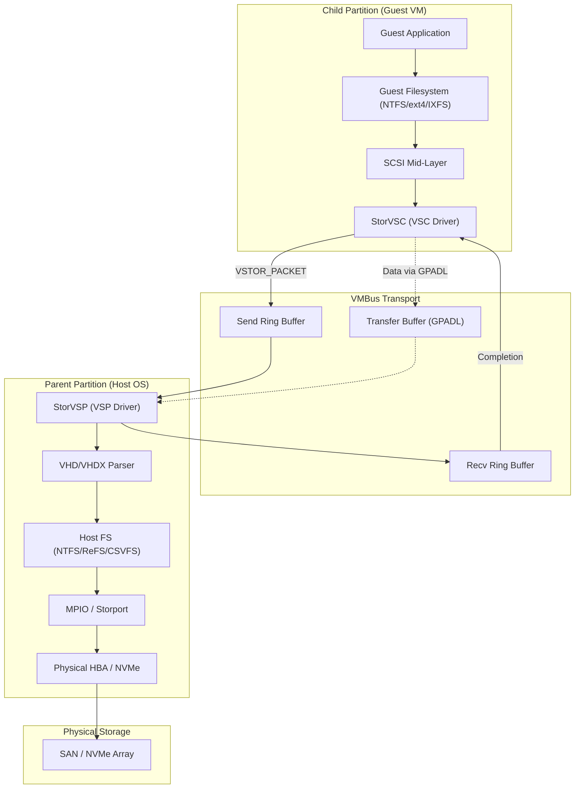
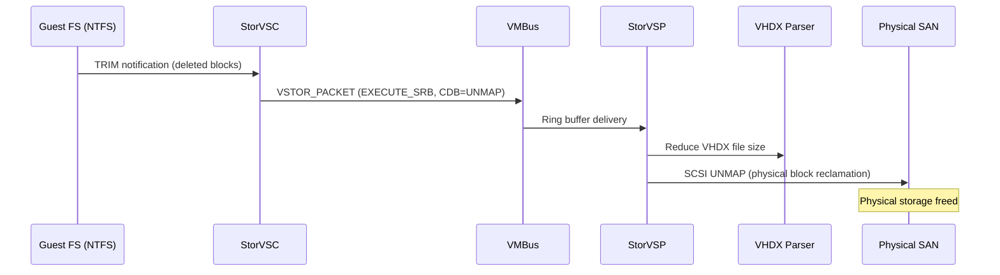
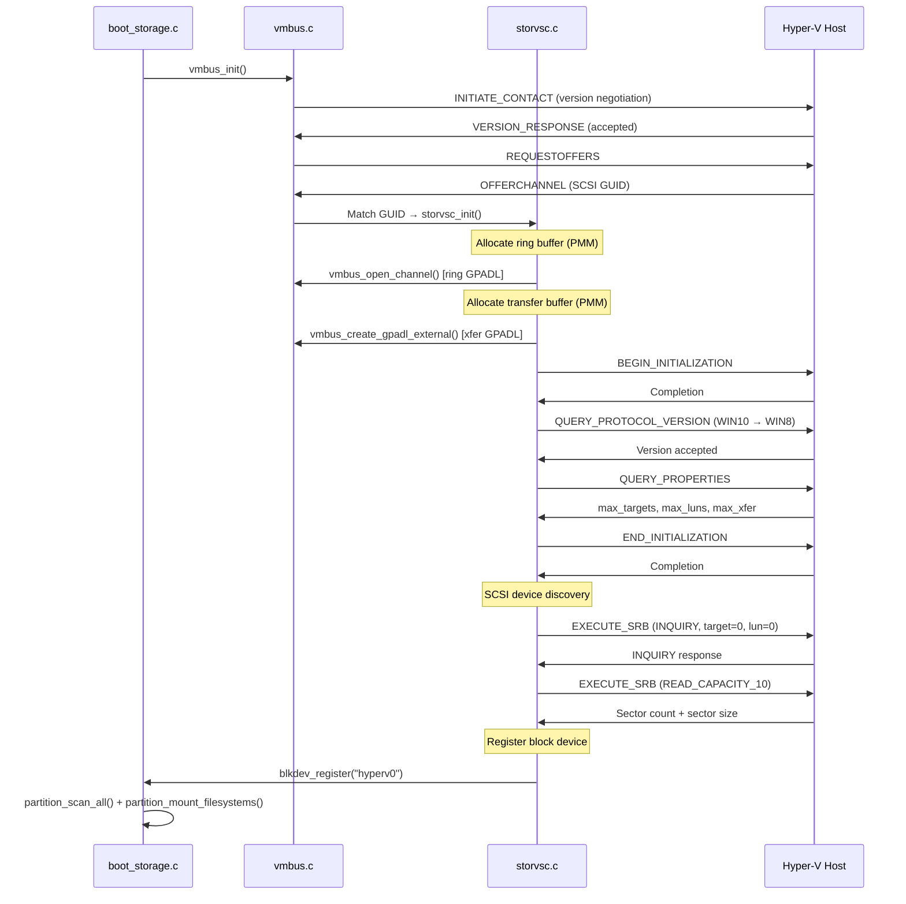

# Comprehensive Specification and Architecture Analysis of the Hyper-V Synthetic SCSI Storage Driver (storvsc)

> **Scope:** Exhaustive specification of the StorVSC paravirtualized SCSI architecture,
> covering the VSCSI protocol, GPADL data transfer, platform implementations, scalability
> limits, enterprise features, and performance diagnostics. Cross-references to Impossible OS
> source files use project-relative paths.

---

## 1. Introduction to Paravirtualization Architectures and Enlightened I/O

The evolution of hypervisor-based virtualization has fundamentally relied on the transition
from full hardware emulation to **paravirtualization**. In legacy virtual environments,
storage access was facilitated through emulated controllers, such as the Integrated Drive
Electronics (IDE) controller. While functionally compatible with unmodified legacy guest
operating systems, emulation introduces severe performance penalties:

```
┌─────────────────────────────────────────────────────────────────────┐
│ Legacy Emulated I/O Path (IDE)                                      │
│                                                                     │
│  Guest App → Guest FS → IDE Port I/O (0x1F0) → VMEXIT trap         │
│      → Hypervisor decodes instruction → Host physical I/O           │
│      → VMRESUME → Guest receives result                             │
│                                                                     │
│  ❌ Every I/O = context switch (VMEXIT/VMRESUME)                    │
│  ❌ Restricts throughput, inflates latency                           │
│  ❌ Consumes disproportionate host CPU cycles                        │
└─────────────────────────────────────────────────────────────────────┘
```

To bypass these systemic limitations, Hyper-V implements **"Enlightened I/O"** — a
cooperative relationship between the host hypervisor and a virtualization-aware guest OS.
Rather than trapping and emulating legacy hardware interfaces, Enlightened I/O deploys
high-level communication protocols directly over the **Virtual Machine Bus (VMBus)**,
entirely bypassing the device emulation layer:

```
┌─────────────────────────────────────────────────────────────────────┐
│ Enlightened I/O Path (StorVSC)                                      │
│                                                                     │
│  Guest App → Guest FS → SCSI mid-layer → StorVSC (VSC)             │
│      → vmpacket_descriptor into ring buffer (shared memory)         │
│      → Signal host via HvCallSignalEvent                            │
│      → StorVSP reads ring → physical storage stack                  │
│                                                                     │
│  ✅ No VMEXIT per I/O — shared memory data path                    │
│  ✅ Near bare-metal throughput                                       │
│  ✅ Deep parallelism across multiple CPU cores                       │
└─────────────────────────────────────────────────────────────────────┘
```

The **Hyper-V Synthetic SCSI Storage Driver (storvsc)** — Storage Virtual Service Consumer —
is the cornerstone of this enlightened storage architecture. By passing structured SCSI
command descriptors across shared memory ring buffers, storvsc achieves near bare-metal
storage throughput, enables vast parallelism, and integrates with enterprise storage features
including Multipath I/O (MPIO), TRIM/UNMAP block reclamation, and Storage Quality of
Service (QoS).

---

## 2. Core Architectural Primitives: VMBus, VSP, and VSC

The hypervisor-level storage topology is governed by a strict client-server model partitioned
across absolute security and execution boundaries.



### 2.1 The Virtual Machine Bus (VMBus)

The VMBus is a channel-based, logical inter-partition communication mechanism serving as the
primary data and control plane for all synthetic devices. It completely bypasses device
emulation by using shared memory pages for high-speed data transfer.

Key VMBus properties for storage:

| Property                | Detail                                                           |
| ----------------------- | ---------------------------------------------------------------- |
| Ring buffer allocation  | Pages pinned in physical memory (cannot be paged out)            |
| Signaling optimization  | Guest interrupts host only on empty→non-empty transition         |
| Throttling protection   | Excessive guest interrupts trigger host-side execution throttle  |
| Data transfer           | Ring carries control; GPADL carries bulk data (zero-copy)        |

> **Impossible OS context:** VMBus core is in
> [`vmbus.c`](file:///src/kernel/drivers/hyperv/vmbus.c). Ring buffers are allocated
> via `pmm_alloc_contiguous()` — identity-mapped, never paged. See the
> [VMBus Core Protocol spec](file:///specs/hyper-v/vmbus-core-protocol.md) for full details.

### 2.2 The Virtualization Service Provider (VSP)

The **StorVSP** (`storvsp.sys` on Windows Server) resides exclusively in the parent
partition. It is a highly multithreaded component that:

1. Listens for incoming I/O requests on VMBus channels
2. Decodes VSCSI protocol messages
3. Injects I/O into the host's native storage stack:

```
StorVSP → VHD/VHDX Parser → Host FS (NTFS/ReFS/CSVFS)
       → MPIO DSM → Storport → Physical HBA → SAN
```

A single Hyper-V host can accommodate thousands of concurrent VMs, so the StorVSP
aggressively multiplexes requests from numerous VSCs.

### 2.3 The Virtualization Service Consumer (VSC)

The **StorVSC** is the synthetic driver deployed within the guest OS. Functionally, it acts
as a **virtual Host Bus Adapter (HBA)**:

- Presents itself as a standard SCSI controller to the guest OS kernel
- Intercepts SCSI Command Descriptor Blocks (CDBs) from the guest filesystem
- Encapsulates them into VSCSI protocol messages (VSTOR_PACKETs)
- Transmits them over the VMBus to the parent partition's StorVSP

The entire process is transparent — the guest believes it is interacting with a
high-performance, physically attached SCSI device.

> **Impossible OS context:** Our StorVSC is in
> [`storvsc.c`](file:///src/kernel/drivers/hyperv/storvsc.c). It registers a `hyperv0`
> block device via the `blkdev` subsystem after SCSI device enumeration.

### 2.4 Data Transfer Optimization: GPADL and Duplicate Mapping

Copying large payloads through ring buffers would create a CPU bottleneck. StorVSC uses
two key optimizations:

#### GPADL (Guest Physical Address Descriptor List)

For large data transfers, StorVSC constructs a control message containing **GPA pointers**
to the guest memory where the read/write payload resides. The StorVSP accesses these
physical locations directly across the partition boundary — true zero-copy DMA.

```
┌─────────────────────────────────┐
│ Ring Buffer (small, control)    │   Contains: vmpacket_descriptor +
│                                 │             vmbus_transfer_page_header +
│                                 │             VSTOR_PACKET (metadata only)
└───────────┬─────────────────────┘
            │ References via pageset_id
            ▼
┌─────────────────────────────────┐
│ Transfer Buffer (GPADL-shared)  │   Contains: actual disk data (4K–64K)
│ PMM-allocated, host-visible     │   Host VSP reads/writes directly
└─────────────────────────────────┘
```

> **Impossible OS context:** Transfer buffer is 64 KiB (16 pages), allocated via
> `pmm_alloc_contiguous()` and shared with the host via `vmbus_create_gpadl_external()`.
> SCSI data I/O uses `vmbus_sendpacket_pagebuffer()` with `VMBUS_PACKET_TYPE_DATA_XFER_PAGES`.
> *(Fixed in commit `cd6f749` — previously the GPADL was missing, causing silent I/O failures.)*

#### Duplicate Ring Mapping

Ring buffer pages are mapped twice contiguously in virtual address space, allowing
`memcpy()` operations that wrap around the physical boundary to proceed seamlessly without
split copies.

> **Impossible OS note:** We handle wrap-around via two-chunk `vmbus_memcpy()` calls
> rather than triple-mapping. See §3.2 of the VMBus spec for details.

---

## 3. The VSCSI Protocol and Packet Structures

Communication between StorVSC and StorVSP is governed by the **VSCSI protocol**, an
encapsulation framework optimized for virtualized SCSI execution.

### 3.1 VMSTOR Protocol Versions

The protocol is strictly versioned via the `VMSTOR_PROTO_VERSION` macro, combining major
and minor version indices using bitwise shifting.

| Protocol Version               | Major.Minor | Host OS                      | Key Additions                           |
| ------------------------------ | :---------: | ---------------------------- | --------------------------------------- |
| `VMSTOR_PROTO_VERSION_WIN6`    |     2.0     | Windows Server 2008          | Baseline enlightened SCSI               |
| `VMSTOR_PROTO_VERSION_WIN7`    |     4.2     | Server 2008 R2 / Win 7       | Larger transfer lengths, early hot-add  |
| `VMSTOR_PROTO_VERSION_WIN8`    |     5.1     | Server 2012 / Win 8          | VHDX support, 4K alignment, TRIM/UNMAP  |
| `VMSTOR_PROTO_VERSION_WIN8_1`  |     6.0     | Server 2012 R2 / Win 8.1     | Storage QoS, Shared VHDX                |
| `VMSTOR_PROTO_VERSION_WIN10`   |     6.2     | Server 2016 / Win 10         | Multi-queue (VMMQ), massive scalability |

> **Impossible OS context:** Our StorVSC negotiates protocol version in
> `storvsc_negotiate()`, trying `VMSTOR_PROTO_VERSION_WIN10` first, falling back to
> `WIN8_1` and `WIN8`.

### 3.2 The vstor_packet Structure

At the core of the wire protocol is the `vstor_packet` structure. When the guest block layer
requests a disk operation, StorVSC constructs a `vstor_packet` containing:

```c
struct vstor_packet {
    uint32_t operation;    /* VSTOR_OPERATION_* */
    uint32_t flags;        /* VSTOR_FLAG_REQUEST_COMPLETION etc. */
    uint32_t status;       /* Completion status from host */
    union {
        struct vmscsi_request vm_srb;   /* For EXECUTE_SRB */
        /* protocol negotiation fields, etc. */
    };
} __attribute__((packed));
```

#### Operation Types

| Enum Value | Operation                                  | Purpose                                       |
| :--------: | ------------------------------------------ | --------------------------------------------- |
|     1      | `VSTOR_OPERATION_COMPLETE_IO`              | I/O completion returned from host             |
|     2      | `VSTOR_OPERATION_REMOVE_DEVICE`            | Hot-remove sequence for virtual disk          |
|     3      | `VSTOR_OPERATION_EXECUTE_SRB`              | Execute SCSI Request Block (primary data I/O) |
|     4      | `VSTOR_OPERATION_RESET_LUN`                | LUN reset during error handling               |
|     5      | `VSTOR_OPERATION_RESET_ADAPTER`            | Total synthetic SCSI adapter reset            |
|     6      | `VSTOR_OPERATION_RESET_BUS`                | Bus-level reset                               |
|     7      | `VSTOR_OPERATION_BEGIN_INITIALIZATION`     | Start device enumeration                      |
|     8      | `VSTOR_OPERATION_END_INITIALIZATION`       | Complete initialization                       |
|     9      | `VSTOR_OPERATION_QUERY_PROTOCOL_VERSION`   | Negotiate VMSTOR protocol version             |
|    10      | `VSTOR_OPERATION_QUERY_PROPERTIES`         | Query channel properties (max targets, etc.)  |
|    11      | `VSTOR_OPERATION_ENUMERATE_BUS`            | Enumerate virtual bus devices                 |
|    12      | `VSTOR_OPERATION_FCHBA_DATA`               | Fibre Channel HBA WWN data                    |
|    13      | `VSTOR_OPERATION_CREATE_SUB_CHANNELS`      | Create multi-queue sub-channels               |

For standard disk read/write, `operation = EXECUTE_SRB`. The packet traverses VMBus, is
processed by the host, and the host responds with `status = STATUS_SUCCESS` or populates
SCSI sense data on error.

#### The vmscsi_request (SCSI Request Block)

```c
struct vmscsi_request {
    uint16_t length;                    /* sizeof(vmscsi_request) */
    uint8_t  srb_status;               /* SRB_STATUS_SUCCESS = 0x01 */
    uint8_t  scsi_status;              /* SCSI status byte */
    uint8_t  port_number;             /* Port number */
    uint8_t  path_id;                  /* SCSI path (always 0) */
    uint8_t  target_id;               /* SCSI target */
    uint8_t  lun;                     /* Logical Unit Number */
    uint8_t  cdb_length;              /* Length of CDB (6, 10, 12, or 16) */
    uint8_t  sense_info_length;       /* Length of returned sense data */
    uint8_t  data_in;                 /* WRITE_TYPE=0, READ_TYPE=1, UNKNOWN_TYPE=2 */
    uint8_t  reserved;
    uint32_t data_transfer_length;    /* Bytes to transfer */
    union {
        uint8_t cdb[16];              /* SCSI Command Descriptor Block */
        uint8_t sense_data[20];       /* Auto-sense on error (overlay) */
        uint8_t reserved_array[20];   /* Padded to 20 bytes */
    };
    /* Win8+ extended fields: */
    uint16_t reserve;
    uint8_t  queue_tag;
    uint8_t  queue_action;
    uint32_t srb_flags;               /* SRB_FLAGS_DATA_IN = 0x40, etc. */
    uint32_t time_out_value;
    uint32_t queue_sort_key;
} __attribute__((packed));
```

> [!NOTE]
> The `cdb` and `sense_data` fields occupy the same memory as a union. The host writes
> sense data into this union on error, overwriting the CDB. The `data_in` field uses
> `WRITE_TYPE=0` (guest → disk), `READ_TYPE=1` (disk → guest), `UNKNOWN_TYPE=2`
> (no data transfer). Extended fields after the union were added in the Win8 protocol.

> **Impossible OS context:** `struct vmscsi_request` is defined in
> [`storvsc.c`](file:///src/kernel/drivers/hyperv/storvsc.c). Our implementation supports
> CDB-6, CDB-10, and CDB-16 commands for READ/WRITE, INQUIRY, READ CAPACITY, and
> TEST UNIT READY.

---

## 4. Platform-Specific Implementations

The StorVSC driver has been natively implemented across Windows, Linux, and FreeBSD kernels.
While the VSCSI protocol is identical, each hooks into its respective storage subsystem
differently.

### 4.1 Windows Guest Stack — Storport Integration

| Aspect                | Detail                                                          |
| --------------------- | --------------------------------------------------------------- |
| Driver binary         | `storvsc.sys`                                                   |
| Interface             | Storport miniport driver                                        |
| Key routines          | `HwStorBuildIo` (lockless prep), `HwStorStartIo` (VMBus send)  |
| Queue depth per LUN   | 255 (254 usable) without extended SRB                           |
| Max aggregate per ctrl | 16,320 (64 LUNs × 255)                                        |
| MPIO support          | Native via Storport integration                                 |
| CSV support           | Native via Storport + Shared VHDX                               |

> [!NOTE]
> The 255 queue depth per LUN is a Storport architectural limit, not a VMBus limit.
> Scale horizontally by splitting workloads across multiple LUNs or controllers.

### 4.2 Linux Guest Stack — blk-mq Integration

| Aspect                  | Detail                                                        |
| ----------------------- | ------------------------------------------------------------- |
| Source file             | `drivers/scsi/storvsc_drv.c`                                  |
| Interface               | SCSI host adapter + blk-mq                                    |
| Ring buffer size param  | `storvsc_ringbuffer_size` (default 128 KiB)                   |
| Max HW queues param     | `storvsc_max_hw_queues`                                       |
| vCPU:subchannel ratio   | `storvsc_vcpus_per_sub_channel` (default 4)                   |
| Recommended scheduler   | `none` (or `noop` on legacy kernels)                          |
| CPU affinity sysfs      | `/sys/bus/vmbus/devices/<GUID>/channels/<relid>/cpu`          |

> [!IMPORTANT]
> **Never use `cfq` or `deadline` schedulers in Hyper-V guests.** The guest has zero
> awareness of the physical disk layout. In-guest scheduling wastes CPU cycles and
> actively interferes with host-level scheduling and SAN-level optimization.

### 4.3 FreeBSD Guest Stack — CAM Integration

| Aspect                | Detail                                                          |
| --------------------- | --------------------------------------------------------------- |
| Driver name           | `hv_storvsc`                                                    |
| Interface             | Common Access Method (CAM) layer                                |
| Dispatch mechanism    | CAM Control Blocks (CCBs) → VSCSI → hv_vmbus                   |
| Kernel config         | Requires `device hyperv` directive                              |
| First appearance      | FreeBSD 10.0 (Microsoft + Citrix + NetApp collaboration)        |

### 4.4 Impossible OS Implementation

| Aspect                 | Detail                                                         |
| ---------------------- | -------------------------------------------------------------- |
| Source file            | [`storvsc.c`](file:///src/kernel/drivers/hyperv/storvsc.c)     |
| Header                | Inline structs in storvsc.c (self-contained)                    |
| Interface             | `blkdev` subsystem registration as `hyperv0`                    |
| Transfer buffer       | 64 KiB (16 pages), PMM-allocated, GPADL-shared                 |
| Ring buffer           | 64 KiB per direction (16 pages send + 16 pages recv)           |
| Protocol version      | Negotiates WIN10 → WIN8_1 → WIN8 fallback                      |
| Packet framing        | `vmbus_sendpacket()` (inband) + `vmbus_sendpacket_pagebuffer()` (data) |
| Polling               | Compiler barrier only (no PAUSE — avoids Hyper-V PLE)           |

---

## 5. Scalability Limits and Device Topology

### 5.1 Virtual Machine Generations and Controller Limits

| Limit                           | Generation 1          | Generation 2                        |
| ------------------------------- | --------------------- | ----------------------------------- |
| Boot controller                 | Emulated IDE          | Synthetic SCSI (UEFI)               |
| Boot drive max size             | 2 TB (IDE limit)      | 64 TB (VHDX)                        |
| SCSI controllers per VM         | 4                     | 4                                   |
| Virtual disks per controller    | 64                    | 64                                  |
| **Max devices per VM**          | **256**               | **256**                             |
| Max VHDX capacity               | 64 TB                 | 64 TB                               |
| Max vCPUs (Server 2025)         | —                     | 2,048                               |
| Max RAM (Server 2025)           | —                     | 240 TB                              |

> **Impossible OS context:** We target **Generation 2 only** — UEFI boot via synthetic
> SCSI, no emulated IDE support. Our `boot_storage.c` initializes StorVSC during the
> Hyper-V boot path after VMBus enumeration.

### 5.2 4K Alignment and Sector Optimization

The VHDX format provides intrinsic **4 KiB logical and physical sector alignment**.
Misalignment causes catastrophic read-modify-write penalties on the physical array:

| Alignment       | I/O Overhead      | Performance Impact               |
| --------------- | ----------------- | -------------------------------- |
| 4K-aligned      | Direct passthrough | ✅ Zero translation penalty      |
| 512-byte legacy | Read-modify-write  | ❌ 2–4× IOPS inflation          |

---

## 6. High Availability: MPIO, vFC, and Guest Clustering

### 6.1 Guest-Side Multipath I/O (MPIO)

VMs using in-guest iSCSI initiators can install MPIO + vendor DSMs (Dell PowerStore, IBM
Storage, etc.) for path redundancy. Traffic flows through netvsc (synthetic NIC), but the
guest MPIO stack manages failover identically to bare-metal.

### 6.2 Shared VHDX and SCSI-3 Persistent Reservations

For guest clustering (Windows Failover Cluster, Linux Pacemaker) without in-guest iSCSI:

- **Shared VHDX / VHD Set (.vhds)** mapped to multiple VMs simultaneously
- StorVSC transparently carries **SCSI-3 Persistent Reservation (PR)** commands
- PR commands establish quorum and prevent split-brain corruption
- Carried securely over VMBus and applied by the host

### 6.3 Virtual Fibre Channel (vFC)

| Feature                | vFC                                   | Synthetic SCSI              |
| ---------------------- | ------------------------------------- | --------------------------- |
| SAN access             | Direct (bypasses host FS)             | Via VHD/VHDX on host FS    |
| Latency                | Raw, unmediated                       | Near-native                 |
| Max transfer size      | ~0.5 MB (limited to ~2,250 LUNs)     | Up to 64 KiB per transfer  |
| Live Migration         | Complex (NPIV, WWN mapping)           | Seamless                    |
| Backup complexity      | High                                  | Standard                    |
| **Recommendation**     | Edge cases only                       | **Preferred for 95% of use cases** |

---

## 7. Advanced Storage Capabilities: TRIM/UNMAP and QoS

### 7.1 Space Reclamation: TRIM and UNMAP Support

End-to-end SCSI UNMAP/TRIM requires a strict prerequisite chain:

| Prerequisite               | Required Value                           |
| -------------------------- | ---------------------------------------- |
| VM Generation              | Generation 2                             |
| Virtual disk format        | VHDX (not VHD)                           |
| Guest OS                   | Windows Server 2012+ or capable Linux    |
| Guest filesystem           | NTFS (ReFS does not support TRIM to basic) |
| Host OS                    | Windows Server 2012+                     |



### 7.2 Storage Quality of Service (QoS)

Prevents the **"noisy neighbor"** phenomenon in multi-tenant clusters:

| QoS Parameter    | Unit                | Enforcement Location          |
| ---------------- | ------------------- | ----------------------------- |
| Minimum IOPS     | Normalized 8 KB I/O | Alerting only (WMI events)    |
| Maximum IOPS     | Normalized 8 KB I/O | StorVSP ring buffer throttle  |

When a VM exceeds Maximum IOPS, the StorVSP artificially delays ring buffer processing,
throttling throughput transparently without causing guest-level driver crashes or timeouts.

---

## 8. Performance Diagnostics, Queue Depth, and Timeout Handling

### 8.1 Event 129 and Event 153: Storage Timeout Diagnostics

When the physical storage fabric becomes congested (QFULL, target port saturation), latency
cascades up through VHD parser → StorVSP → VMBus → guest. If a request remains
unacknowledged beyond the Storport timeout (typically 20–30 seconds):

| Event ID | Source      | Description                                                           |
| :------: | ---------- | --------------------------------------------------------------------- |
|   129    | `storvsc`  | **Reset to device** — port-level reset to clear stalled queues        |
|   153    | `disk`     | **I/O retried** — specific LBA operation retried after reset          |

> [!WARNING]
> **Persistent Event 129 is almost never a StorVSC software bug.** It is the ultimate
> symptom of physical layer exhaustion, SAN misconfiguration, or host-level MPIO failures.
> Aggressive resets can cause NTFS corruption (Event 55) if the array doesn't recover fast.

### 8.2 Host-Level I/O Balancing Throttling

Hyper-V's built-in storage load balancer can inadvertently throttle critical VMs:

| Registry Key                                                          | Value  | Effect                          |
| --------------------------------------------------------------------- | ------ | ------------------------------- |
| `HKLM\System\CurrentControlSet\Control\StorVsp\IOBalance\Enabled`     | `0`    | Disable I/O balancer            |
| Default threshold                                                     | 83 ms  | Latency trigger for throttling  |

> [!TIP]
> If host benchmarks show massive IOPS but guest benchmarks show sluggish performance,
> check the I/O balancer first. Disabling it allows StorVSC requests to consume the full
> available physical array throughput.

### 8.3 Virtual NUMA and StorChannel Configurations

For multi-socket hosts, storage I/O interrupts must be NUMA-aligned:

| Registry Path                                                                    | Purpose                              |
| -------------------------------------------------------------------------------- | ------------------------------------ |
| `HKLM\...\Enum\VMBUS\<device id>\<instance id>\StorChannel`                     | Active VMBus channel count           |

Align channels with VM vCPU and Virtual NUMA topology to avoid QPI/UPI cross-bus latency.

---

## 9. StorVSC Initialization Sequence

The complete lifecycle from boot to active I/O:



> **Impossible OS context:** This sequence is implemented across `boot_storage.c`,
> `vmbus.c`, and `storvsc.c`. The transfer buffer GPADL creation was added in commit
> `cd6f749` to fix the C:\ not mounted issue on Hyper-V Gen 2.

---

## 10. Wire Format Summary

### Control Messages (In-Band)

Used for protocol initialization (`BEGIN_INIT`, `QUERY_VERSION`, `END_INIT`):

```
┌──────────────────────────────┐
│  vmpacket_descriptor         │  16 bytes (type=0x06 DATA_INBAND)
│  type=6, offset8=2, len8=N  │
│  flags=COMPLETION_REQUESTED  │
│  trans_id=unique             │
├──────────────────────────────┤
│  VSTOR_PACKET                │  ~64 bytes
│  operation, flags, status    │
│  + union (srb/negotiate)     │
├──────────────────────────────┤
│  Padding to 8-byte align     │
├──────────────────────────────┤
│  prev_pkt_start_offset (64)  │  8 bytes
└──────────────────────────────┘
```

### Data Messages (Transfer Pages)

Used for SCSI READ/WRITE with actual data:

```
┌──────────────────────────────┐
│  vmpacket_descriptor         │  16 bytes (type=0x07 DATA_XFER_PAGES)
│  type=7, offset8=N          │
│  flags=COMPLETION_REQUESTED  │
│  trans_id=unique             │
├──────────────────────────────┤
│  vmbus_transfer_page_header  │  8 bytes
│  pageset_id = GPADL handle  │
│  sender_owns_set = 1        │
│  range_count = 1             │
├──────────────────────────────┤
│  vmbus_transfer_page_range   │  8 bytes
│  byte_count, byte_offset    │
├──────────────────────────────┤
│  VSTOR_PACKET                │  ~64 bytes (EXECUTE_SRB)
│  srb.cdb = READ_10/WRITE_10 │
│  srb.data_transfer_length   │
├──────────────────────────────┤
│  Padding + trailing offset   │
└──────────────────────────────┘
```

---

## 11. Conclusion

The Hyper-V Synthetic SCSI Storage Driver (storvsc) represents a masterclass in
paravirtualized system engineering. By completely deprecating hardware emulation in favor
of a cooperative, VMBus-driven protocol, the architecture achieves near-native bare-metal
I/O speeds while simultaneously benefiting from hypervisor-level abstractions like Storage
QoS, Shared VHDX, and TRIM passthrough.

### Key Design Principles for Impossible OS

| Principle                              | Implementation                                              |
| -------------------------------------- | ----------------------------------------------------------- |
| **GPADL for all shared memory**        | Ring buffer + transfer buffer both need GPADL handles       |
| **Transfer pages for SCSI data**       | Use `vmbus_sendpacket_pagebuffer()`, not in-band for data   |
| **In-band for control only**           | Protocol init uses `vmbus_sendpacket()` with type=0x06      |
| **No PAUSE in polling**               | Compiler barrier only — avoids Hyper-V PLE (1000× slowdown) |
| **PMM for all large allocations**      | Transfer buffer, ring buffers — never kmalloc               |
| **Protocol version fallback**          | Try WIN10 → WIN8_1 → WIN8 for broad host compatibility     |

> [!NOTE]
> **Lessons learned from Impossible OS:**
> - Missing transfer buffer GPADL caused silent SCSI I/O failures on real Hyper-V
>   *(fixed in `cd6f749`)*
> - Custom ring buffer framing (length prefix instead of vmpacket_descriptor) caused
>   host VSP to silently drop all packets *(fixed in `cd6f749`)*
> - PAUSE instructions triggered Pause Loop Exit at 1000× slowdown
>   *(fixed in `cd6f749` and earlier AHCI commit)*
