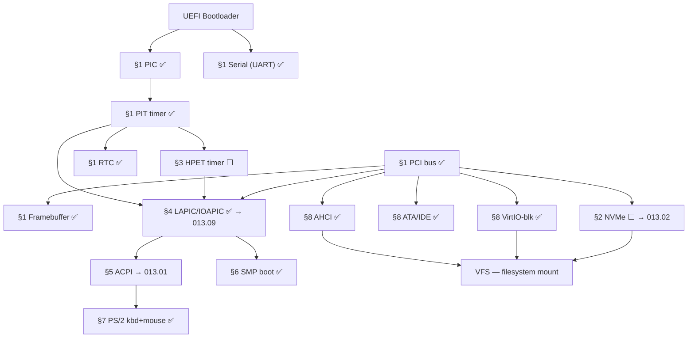

# TODO-013-Core — Core Built-in Kernel Drivers

> **Goal:** Track all drivers that are **statically linked into the kernel** (not loadable
> modules). These drivers must be available before the filesystem is mounted, because
> they provide the hardware access needed for the boot sequence: interrupt controllers,
> timers, storage, and power management. Fourteen built-in drivers are already ✅ Done.
> Remaining work: NVMe (P1 — boot disk may be NVMe), HPET (P1 — needed for precise
> LAPIC calibration), and deep enhancement work for APIC and ACPI.

> [!NOTE]
> **Scope:** This file covers only **built-in** drivers. Loadable modules (NICs, GPU,
> audio, USB) live in [TODO-063-Drivers.md](../../060-Hardware-Drivers/TODO-063-Drivers.md).
>
> **Sub-files** — topics with dedicated implementation detail files:
> - [TODO-013.01-ACPI.md](TODO-013-Core-Drivers/TODO-013.01-ACPI.md) — Full ACPI subsystem roadmap
> - [TODO-013.02-NVMe.md](TODO-013-Core-Drivers/TODO-013.02-NVMe.md) — NVMe storage driver
> - [TODO-013.03-PCI.md](TODO-013-Core-Drivers/TODO-013.03-PCI.md) — PCI Local Bus 3.0 enhancements
> - [TODO-013.04-PCIe.md](TODO-013-Core-Drivers/TODO-013.04-PCIe.md) — PCIe ECAM, AER, hot-plug, SR-IOV
> - [TODO-013.09-APIC-Architecture.md](TODO-013-Core-Drivers/TODO-013.09-APIC-Architecture.md) — APIC deep-dive (x2APIC, MSI/MSI-X, NMI watchdog)

---

## Driver Status Overview

| ⭐ | Driver                  | File               | Status       | Sub-file                                                                          |
| -- | ----------------------- | ------------------ | :----------: | --------------------------------------------------------------------------------- |
| 💎 | PIC (8259A)             | `pic.c`            | ✅ Done       | —                                                                                 |
| 💎 | PIT timer               | `pit.c`            | ✅ Done       | —                                                                                 |
| 💎 | HPET timer              | `hpet.c`           | ⬜ §3 P1     | —                                                                                 |
| 💎 | RTC                     | `rtc.c`            | ✅ Done       | —                                                                                 |
| 💎 | Serial (UART)           | `serial.c`         | ✅ Done       | —                                                                                 |
| 💎 | PCI bus                 | `pci.c`            | ✅ Done       | —                                                                                 |
| 💎 | Framebuffer (VBE)       | `framebuffer.c`    | ✅ Done       | —                                                                                 |
| 💎 | LAPIC / IOAPIC          | `lapic.c` `ioapic.c` | ✅ Done (base) | [013.09](TODO-013.09-APIC-Architecture.md) — x2APIC, MSI, etc. |
| 💎 | SMP boot (SIPI)         | `smp.c`            | ✅ Done       | —                                                                                 |
| 💎 | ACPI tables + power     | `acpi.c`           | ✅ Done (basic) | [013.01](TODO-013.01-ACPI.md) — AML, OSPM, thermal, P/C-states |
| 💎 | PS/2 keyboard           | `keyboard.c`       | ✅ Done       | —                                                                                 |
| 💎 | PS/2 mouse              | `mouse.c`          | ✅ Done       | —                                                                                 |
| 💎 | AHCI (SATA)             | `ahci.c`           | ✅ Done       | —                                                                                 |
| 💎 | ATA/IDE                 | `ata.c`            | ✅ Done       | —                                                                                 |
| 💎 | VirtIO-blk              | `virtio_blk.c`     | ✅ Done       | —                                                                                 |
| 💎 | NVMe                    | `nvme.c`           | ⬜ §2 P1     | [013.02](TODO-013.02-NVMe.md)                                      |
| 💎 | PCI enhancements        | `pci.c`            | ⬜ P2        | [013.03](TODO-013.03-PCI.md)                                       |
| 💎 | PCIe (ECAM, AER, HP)   | `pcie.c`           | ⬜ P2        | [013.04](TODO-013.04-PCIe.md)                                      |

---

## Dependency Graph

### Phase-by-Phase Implementation Order

| Phase | Sections                                        | Depends On            | Status |
| :---: | ----------------------------------------------- | --------------------- | :----: |
| **0** | §1 Boot-critical hardware (PIC, PIT, Serial, PCI, FB, RTC, PS/2) | UEFI | ✅ |
| **1** | §2 NVMe storage driver                          | §1 PCI                |   ⬜   |
| **2** | §3 HPET timer                                   | §1 PIT + ACPI table   |   ⬜   |
| **3** | §4 LAPIC/IOAPIC enhancements (→ 013.09)         | §2 HPET (calibration) |   ⬜   |
| **4** | §5 Full ACPI subsystem (→ 013.01)               | §4 APIC               |   ⬜   |
| **5** | §6 SMP boot (✅) + NUMA topology (→ 011)        | §4 APIC               |   ✅   |
| **6** | §7 Storage: AHCI/ATA/VirtIO/NVMe               | §1                    |   ✅   |

> [!NOTE]
> **Phase 0** is complete — all basic boot drivers are operational.
>
> **Phase 1 (NVMe)** is 🟠 P1 because NVMe is the standard boot disk for modern hardware.
> Without it, systems with NVMe-only storage cannot boot.
>
> **Phase 2 (HPET)** is 🟠 P1 — HPET provides nanosecond-resolution timestamps used
> for LAPIC calibration (replacing the imprecise PIT-only approach). Place it early
> so the APIC calibration in 013.09 §2 can use HPET as the reference.
>
> **Phase 3 (APIC enhancements)** includes x2APIC, LAPIC timer calibration, MSI/MSI-X,
> TLB shootdown, and the NMI watchdog. Full detail in [013.09](TODO-013-Core-Drivers/TODO-013.09-APIC-Architecture.md).
>
> **Phase 4 (ACPI)** adds AML interpreter (ACPICA), thermal management, sleep states,
> P/C-states. Full detail in [013.01](TODO-013-Core-Drivers/TODO-013.01-ACPI.md).

> [!TIP]
> **HPET → APIC calibration chain:** The LAPIC timer calibration in 013.09 §2 currently
> uses PIT as the reference clock. Once HPET is available (§3 below), pass the HPET
> nanosecond counter to the calibration loop for better accuracy.

---

## 1. Boot-Critical Drivers ✅

All fourteen boot-critical built-in drivers are implemented and operational.

### 1.1 Interrupt Controllers (PIC + LAPIC/IOAPIC)

**Verification:** PIC (`pic.c`) initializes the 8259A and masks all IRQs before the
LAPIC takes over. LAPIC and IOAPIC route all hardware interrupts in SMP mode.
`acpi_pcat_compat()` skips PIC when Hyper-V MADT `PCAT_COMPAT=0`.

- [x] PIC (8259A): init, mask all IRQs, EOI — `pic.c`
- [x] LAPIC: init, EOI, IPI send, periodic timer (xAPIC MMIO mode) — `lapic.c`
- [x] IOAPIC: routes 16 ISA IRQs with ISO flags to BSP — `ioapic.c`
- [x] PCAT\_COMPAT check: PIC skipped when flag=0 (Hyper-V)
- [x] SMP: INIT-SIPI-SIPI sequence boots all Application Processors — `smp.c`

> **Enhancement roadmap →** [TODO-013.09-APIC-Architecture.md](TODO-013-Core-Drivers/TODO-013.09-APIC-Architecture.md)
> covers x2APIC, calibration, MSI/MSI-X, TLB shootdown, NMI watchdog, IRQ affinity.

### 1.2 Timers (PIT + RTC)

**Verification:** PIT (`pit.c`) provides the system tick at 100 Hz and `pit_sleep_ms()`
for busy-wait delays. RTC (`rtc.c`) provides wall-clock time.

- [x] PIT: 100 Hz tick, `pit_sleep_ms()`, `pit_get_ticks()` — `pit.c`
- [x] RTC: read wall-clock time — `rtc.c`

### 1.3 Serial, PCI Bus, Framebuffer

**Verification:** Serial output is the primary debug channel. PCI bus driver enumerates
all devices via port I/O (`0xCF8`/`0xCFC`). Framebuffer is memory-mapped from the
UEFI GOP handle.

- [x] Serial (UART): 115200 baud, `serial_write()` — `serial.c`
- [x] PCI bus: enumerate all devices, config read/write — `pci.c`
- [x] Framebuffer (VBE): linear framebuffer from UEFI GOP — `framebuffer.c`

### 1.4 Input Devices

- [x] PS/2 keyboard: scan codes, key events — `keyboard.c`
- [x] PS/2 mouse: movement + button packets — `mouse.c`

### 1.5 Storage Drivers

**Verification:** AHCI, ATA/IDE, and VirtIO-blk are all built-in. Disk access is
available at boot before any module loading.

- [x] AHCI (SATA): DMA reads/writes, IDENTIFY — `ahci.c`
- [x] ATA/IDE: PIO fallback for legacy systems — `ata.c`
- [x] VirtIO-blk: paravirtual block for QEMU — `virtio_blk.c`

### 1.6 ACPI Base Tables

**Verification:** RSDP found via UEFI Config Table, XSDT parsed, MADT yields LAPIC
IDs and IOAPIC base, power-off uses PM1a CNT SLP\_TYP S5 value.

- [x] RSDP / XSDT discovery — `acpi.c`
- [x] MADT parsing: LAPIC IDs, IOAPIC base, ISOs, LAPIC NMI — `acpi.c`
- [x] ACPI shutdown / reboot — `acpi.c`

> **Enhancement roadmap →** [TODO-013.01-ACPI.md](TODO-013-Core-Drivers/TODO-013.01-ACPI.md)
> covers full ACPICA integration, AML interpreter, thermal zones, P/C-states.

---

## 2. NVMe Storage Driver (Built-in) 🟠 P1

> Full implementation detail: **[TODO-013.02-NVMe.md](TODO-013-Core-Drivers/TODO-013.02-NVMe.md)**

NVMe is the primary storage interface for modern solid-state drives. The driver must be
**built-in** (not a loadable module) because the system boot partition may reside on an
NVMe SSD — it must be accessible before the filesystem is mounted.

**Summary of work:**

- [ ] §1 PCI detection (class `0x01/0x08/0x02`) + BAR0 MMIO mapping
- [ ] §2 Controller reset + Admin Queue (ASQ/ACQ) initialization
- [ ] §3 Identify Controller + Namespace → disk capacity and sector size
- [ ] §4 I/O Queue pair creation (via Admin commands)
- [ ] §5 Read + Write paths (SQE, PRP, doorbell)
- [ ] §6 IRQ-driven completion (MSI preferred, polling fallback)
- [ ] §7 `blkdev_register()` integration → VFS mounts boot partition
- [ ] *(Stretch)* §8 Queue depth telemetry GUI + multi-namespace support 🚀
- [ ] Commit: `"drivers: NVMe storage (built-in)"`

---

## 3. HPET Timer (Built-in) 🟠 P1

The HPET (High Precision Event Timer) provides nanosecond-resolution timestamps,
replacing the PIT as the precision timing reference. HPET is discovered via the ACPI
HPET table (signature `"HPET"`) — available earlier than full ACPICA, just requires
raw table lookup. Place HPET **before** LAPIC calibration so it can serve as the
reference clock in [TODO-013.09 §2](TODO-013-Core-Drivers/TODO-013.09-APIC-Architecture.md).

> [!TIP]
> **Why HPET before LAPIC calibration?** The PIT's 1.193 MHz clock gives ≈840 ns
> resolution. HPET runs at 10–100 MHz (10–100 ns resolution). LAPIC timer calibration
> accuracy improves significantly when using HPET as the reference instead of PIT.
> Linux uses HPET as the preferred LAPIC calibration source when available.

**Prompt:** Parse the ACPI HPET table to get the HPET MMIO base address. Map the MMIO
region. Read the period from the General Capabilities register (`GCAP_ID`, bits 63:32 =
period in femtoseconds). Enable the main counter by setting `GEN_CONF` bit 0. Implement
`hpet_read_ns()` which returns the current counter value converted to nanoseconds.
Optionally configure comparator 0 in periodic mode to replace the PIT scheduler tick.
After completing all items, mark every item as `[x]`, update this prompt to a
verification prompt, run `bash scripts/build.sh clean`, and commit as
`"kernel: HPET high-precision timer"`. Add notes directly in this TODO section.

- [ ] Create `src/kernel/hpet.c` and `include/kernel/hpet.h`
- [ ] Parse ACPI HPET table (`acpi_find_table("HPET")`):
  - [ ] Read base address from HPET table structure (offset 0x2C, 12-byte generic address)
  - [ ] Validate base address is non-zero
- [ ] Map HPET MMIO region (UC — uncacheable, typically 1 KB)
- [ ] Read General Capabilities register (`offset 0x000`, 64-bit):
  - [ ] Bits 63:32 — `COUNTER_CLK_PERIOD` (main counter period in femtoseconds)
  - [ ] Bits 12:8 — number of timers
  - [ ] Bit 13 — COUNT_SIZE_CAP (1 = 64-bit counter)
  - [ ] Compute `hpet_freq_hz = 1_000_000_000_000_000 / COUNTER_CLK_PERIOD`
- [ ] Enable main counter: set bit 0 of General Configuration (`offset 0x010`)
- [ ] Implement `hpet_read_ns()`:
  - [ ] Read Main Counter Value (`offset 0x0F0`)
  - [ ] Convert: `ns = (counter × COUNTER_CLK_PERIOD) / 1_000_000`
- [ ] Implement `hpet_sleep_ns(uint64_t ns)` — poll main counter for precise delay
- [ ] Wire HPET to LAPIC calibration: replace PIT 10ms wait in 013.09 §2 with HPET
- [ ] *(Stretch)* Configure Timer 0 comparator in periodic mode:
  - [ ] Route via IOAPIC to replace PIT scheduler tick
  - [ ] Timer 0 Config (`offset 0x100`): set Tn\_INTx\_EN, Tn\_TYPE\_CNF (periodic)
- [ ] Log: `[HPET] %llu Hz, %u timers, %u-bit counter`
- [ ] Commit: `"kernel: HPET high-precision timer"`

---

## 4. LAPIC / IOAPIC Enhancements → [TODO-013.09](TODO-013-Core-Drivers/TODO-013.09-APIC-Architecture.md)

The base LAPIC/IOAPIC is ✅ Done. The following enhancements are tracked in the sub-file:

| Section | Description | Priority |
| ------- | ----------- | :------: |
| §1 x2APIC MSR mode | 32-bit APIC IDs, MSR-based access | 🟡 P2 |
| §2 PIT-based calibration | Fix hardcoded ICR=10000000 | 🟠 P1 |
| §3 Multi-IOAPIC routing | GSI-based routing across IOAPICs | 🟠 P1 |
| §4 LAPIC Error ISR | Vector 0xFE has no handler | 🔴 P0 |
| §5 LVT complete config | NMI, thermal, PMC — all masked now | 🟡 P2 |
| §6 IPI + TLB shootdown | Silent SMP corruption without this | 🟠 P1 |
| §7 Directed EOI | Reduce interrupt bus traffic | 🟢 P3 |
| §8 MSI/MSI-X | Required by NVMe, xHCI, modern NICs | 🟡 P2 |
| §9 NMI watchdog 🚀 | Per-core lockup detection in Task Manager | 🟡 P2 |
| §10 IRQ affinity 🚀 | Per-device CPU steering GUI | 🟢 P3 |
| §11 IRQ latency profiler 🚀 | Live latency heatmap in Task Manager | 🟢 P3 |

---

## 5. Full ACPI Subsystem → [TODO-013.01](TODO-013-Core-Drivers/TODO-013.01-ACPI.md)

Basic ACPI (table parsing, power-off) is ✅ Done. The full subsystem adds:

| Section | Description | Priority |
| ------- | ----------- | :------: |
| §1.1 Complete table discovery | Validate checksums, table registry | 🔴 P0 |
| §1.2 FADT parsing | PM registers, sleep states, reboot | 🔴 P0 |
| §1.3 MCFG / PCIe ECAM | Extended config space | 🟡 P2 |
| §2.1 ACPI mode enable | SCI_EN → OSPM ownership | 🔴 P0 |
| §3.1 ACPICA integration | AML interpreter (BSD-3) | 🟠 P1 |
| §4.1 Sleep state discovery | S3/S5 SLP_TYP values | 🟠 P1 |
| §5.2 Fixed event handlers | Power button, sleep button | 🟠 P1 |
| §6.1 Thermal zone monitoring | Emergency shutdown, fan control | 🟡 P2 |
| §7.1 Processor C-States | Idle power efficiency | 🟢 P3 |
| §7.2 Processor P-States | DVFS / HWP / CPPC | 🟢 P3 |
| §8.1 PCI interrupt routing | `_PRT` for real hardware | 🟠 P1 |

---

## Priority Order

| Priority | Section / Reference                            | Description                                           |
| -------- | ---------------------------------------------- | ----------------------------------------------------- |
| 🔴 P0   | §4 → 013.09 §4 LAPIC Error ISR                 | No ISR for Error LVT vector — triple fault risk       |
| 🔴 P0   | §5 → 013.01 §1 Table discovery + FADT         | Foundation for all ACPI features                      |
| 🟠 P1   | §2 NVMe driver                                 | Boot disk may be NVMe — blocking for modern hardware  |
| 🟠 P1   | §3 HPET timer                                  | Nanosecond precision; needed for LAPIC calibration    |
| 🟠 P1   | §4 → 013.09 §2 LAPIC calibration              | Hardcoded ICR fails on real hardware                  |
| 🟠 P1   | §4 → 013.09 §6 TLB shootdown                  | SMP correctness — silent corruption without           |
| 🟠 P1   | §5 → 013.01 §3.1 ACPICA + §4.1 Sleep states   | AML interpreter + correct S5 shutdown                 |
| 🟡 P2   | §4 → 013.09 §8 MSI/MSI-X                      | Required by NVMe, xHCI, modern NICs                   |
| 🟡 P2   | §5 → 013.01 §6.1 Thermal                       | Prevent hardware damage                               |
| 🟢 P3   | §2 → 013.02 §8 NVMe telemetry 🚀              | Live IOPS + latency GUI                               |
| 🟢 P3   | §4 → 013.09 §9 NMI watchdog 🚀               | Per-core health panel in Task Manager                 |
| 🟢 P3   | §4 → 013.09 §10 IRQ affinity 🚀              | First native GUI for IRQ CPU steering                 |
| 🔵 P4   | §5 → 013.01 §7 C/P-States                     | Power efficiency (HWP/CPPC)                           |

---

## OS Comparison

| ⭐ | Feature                              | 🪟 Windows 11                        | 🐧 Linux                              | 🚀 Impossible OS                                        |
| -- | ------------------------------------ | ------------------------------------ | ------------------------------------- | ------------------------------------------------------- |
| 💎 | PIC (8259A)                          | ✅ HAL                                | ✅ `i8259.c`                           | ✅ Done                                                  |
| 💎 | PIT timer                            | ✅ HAL                                | ✅ `i8253.c`                           | ✅ Done                                                  |
| 💎 | HPET timer                           | ✅ HAL (preferred over PIT)           | ✅ `hpet.c` (preferred clocksource)    | ⬜ §3 P1                                                 |
| 💎 | RTC                                  | ✅ HAL                                | ✅ `rtc-cmos.c`                        | ✅ Done                                                  |
| 💎 | Serial (UART)                        | ✅ (debug builds)                     | ✅ `8250_core.c`                       | ✅ Done                                                  |
| 💎 | PCI bus                              | ✅ PCI.SYS                            | ✅ `pci/pci.c`                         | ✅ Done (I/O port mode)                                  |
| 💎 | PCIe ECAM (MMIO config)              | ✅ ACPI MCFG                          | ✅ `pci/pcie/portdrv.c`               | ⬜ 013.01 §1.3 P2                                        |
| 💎 | Framebuffer (UEFI GOP)               | ✅ BOOTVID                            | ✅ `efifb.c`                           | ✅ Done                                                  |
| 💎 | LAPIC / IOAPIC (base)                | ✅ HAL APIC                           | ✅ `apic.c`                            | ✅ Done (xAPIC, calibration pending)                     |
| 💎 | x2APIC                               | ✅ Enabled by default                 | ✅ Enabled by default                  | ⬜ 013.09 §1 P2                                          |
| 💎 | LAPIC timer calibration              | ✅ PIT + HPET + TSC                   | ✅ PIT + HPET + CPUID.15H              | ⚠️ Hardcoded ICR — 013.09 §2 P1                         |
| 💎 | MSI/MSI-X                            | ✅ Full WDM                           | ✅ `pci_enable_msi*()`                 | ⬜ 013.09 §8 P2                                          |
| 💎 | TLB shootdown                        | ✅ `KeFlushTb()`                      | ✅ `flush_tlb_multi()`                 | ⬜ 013.09 §6 P1                                          |
| 💎 | SMP boot                             | ✅ HAL                                | ✅ `do_boot_cpu()`                     | ✅ Done                                                  |
| 💎 | ACPI tables                          | ✅ ACPI.sys                           | ✅ ACPICA                              | ✅ Basic (full in 013.01)                                |
| 💎 | ACPICA / AML interpreter             | ✅ Custom MS engine                   | ✅ ACPICA (BSD-3)                      | ⬜ 013.01 §3.1 P1                                        |
| 💎 | PS/2 keyboard + mouse                | ✅ i8042prt.sys                       | ✅ `i8042prt.c`                        | ✅ Done                                                  |
| 💎 | AHCI (SATA)                          | ✅ storahci.sys                       | ✅ `libahci.c`                         | ✅ Done                                                  |
| 💎 | ATA/IDE                              | ✅ pciide.sys                         | ✅ `ata_piix.c`                        | ✅ Done                                                  |
| 💎 | VirtIO-blk                           | ✅ vioblk.sys (Virtio guest drivers)  | ✅ `virtio_blk.c`                      | ✅ Done                                                  |
| 💎 | NVMe                                 | ✅ stornvme.sys                       | ✅ `nvme/host/pci.c`                   | ⬜ §2 + 013.02 P1                                        |
| 💎 | Thermal zone monitoring              | ✅ Windows Thermal Manager            | ✅ `thermal_zone_device`               | ⬜ 013.01 §6.1 P2                                        |
| ⭐ | **NMI watchdog GUI** 🚀             | ❌ WHEA (kernel only)                 | ❌ `nmi_watchdog=1` (boot param)       | ⬜ 013.09 §9 — per-core ❤️ in Task Manager               |
| ⭐ | **IRQ affinity GUI** 🚀             | ❌ Registry hack / third-party        | ❌ `/proc/irq/N/smp_affinity` (CLI)    | ⬜ 013.09 §10 — first native visual IRQ steering         |
| ⭐ | **IRQ latency heatmap** 🚀          | ❌ Requires xperf/WPA                 | ❌ `perf sched latency` (CLI)          | ⬜ 013.09 §11 — live latency heatmap in Task Manager     |
| ⭐ | **NVMe IOPS + latency GUI** 🚀      | ❌ ETW tracing only                   | ❌ `nvme-cli` (CLI)                    | ⬜ 013.02 §8.1 — first native per-queue latency GUI      |
| ⭐ | **HPET-calibrated LAPIC** 🚀        | ✅ uses HPET                          | ✅ prefers HPET                        | ⬜ §3+013.09 §2 — more accurate than PIT-only             |

> **After P0+P1 items:** Impossible OS matches Windows and Linux boot-driver coverage.
> **After P2 items:** APIC, PCIe, and ACPICA bring full hardware compatibility.
> **After P3 exclusives:** First OS with live IRQ latency, NMI watchdog, and NVMe IOPS
> dashboards in the GUI.
