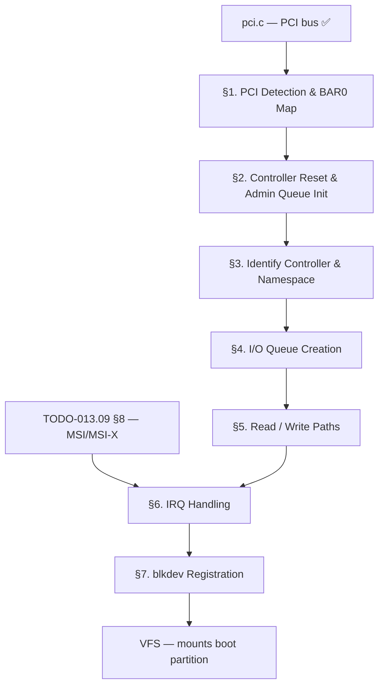

# TODO-013.02-NVMe — NVMe Storage Driver (Built-in)

> **Goal:** Implement a built-in (statically linked) NVMe 1.4 driver so the kernel can
> boot from modern NVMe SSDs. The driver detects NVMe controllers via PCI class `0x01/0x08/0x02`,
> initialises Admin and I/O Queue pairs, issues Identify commands to discover disk geometry,
> and exposes the disk through `blkdev_register()` so the VFS can mount the boot partition.
> This must be **built-in** (not a loadable module) because the boot disk itself may be NVMe
> and must be accessible before any filesystem is mounted.

> [!CAUTION]
> **Memory Rule:** All DMA buffers (submission queues, completion queues, PRPs, data buffers)
> MUST use `pmm_alloc_contiguous()`. They MUST be physically contiguous and ≤ 4 KB only qualifies
> for `kmalloc` if the SQ/CQ is a single 4 KB page. For multi-page rings use `pmm_alloc_contiguous()`.
> See `rules.md` Known Gotchas.

> [!IMPORTANT]
> **Spec Reference:** NVMe 1.4 specification.
> **Port base:** SerenityOS `Kernel/Devices/Storage/NVMe/` (BSD-2-Clause)
> **XREF:**
> - [TODO-013-Core-Drivers.md](../TODO-013-Core-Drivers.md) — master built-in driver overview
> - [TODO-063.09-APIC-Architecture.md §8](TODO-013.09-APIC-Architecture.md) — MSI/MSI-X (NVMe uses MSI)

---

## Dependency Graph



### Phase-by-Phase Implementation Order

| Phase | Sections                                  | Depends On             | Status |
| :---: | ----------------------------------------- | ---------------------- | :----: |
| **0** | PCI bus, APIC/MSI infrastructure          | —                      |   ✅   |
| **1** | §1 PCI Detection + BAR0 mapping           | Phase 0                |   ⬜   |
| **2** | §2 Controller reset + Admin Queue init    | Phase 1                |   ⬜   |
| **3** | §3 Identify Controller + Namespace        | Phase 2                |   ⬜   |
| **4** | §4 I/O Queue creation                     | Phase 3                |   ⬜   |
| **5** | §5 Read/Write paths                       | Phase 4                |   ⬜   |
| **6** | §6 IRQ / Completion Queue processing      | Phase 5                |   ⬜   |
| **7** | §7 blkdev registration                    | Phase 6                |   ⬜   |
| **8** | §8 Queue depth, multi-namespace (🚀)      | Phase 7                |   ⬜   |

> [!NOTE]
> **Phase 0** is complete — PCI bus driver (`pci.c`) is built-in and operational.
>
> **Phase 1–3** are the critical path. The Identify commands tell us disk size and
> the LBA format (4 K vs 512-byte sectors) — essential before any I/O.
>
> **Phase 4–6** deliver the first working read/write path. Once blkdev is registered
> (Phase 7) the VFS can mount the boot partition.

> [!TIP]
> **QEMU testing flags:**
> ```
> -drive file=build/nvme-test.img,if=none,id=nvme0
> -device nvme,serial=deadbeef,drive=nvme0
> ```
>
> **Memory alignment:** NVMe SQE/CQE are 64 bytes each. Submission queues must be
> physically contiguous and 4 KB aligned. Completion queues: same rule.
>
> **Port tip:** SerenityOS `NVMeController.cpp` `NVMeQueue.cpp` closely follows
> the spec — safe to port with BSD-2 attribution.

---

## 1. PCI Detection & BAR0 Mapping

**Prompt:** Detect NVMe controllers on the PCI bus by matching class `0x01`, subclass `0x08`,
prog_if `0x02`. For each detected controller, read BAR0 to get the MMIO base address and size.
Map the BAR0 region into virtual address space using identity mapping. Verify the Controller
Capabilities register (`CAP`) is accessible. Extract key fields: maximum queue entries supported
(`CAP.MQES`), minimum page size (`CAP.MPSMIN`), command set support (`CAP.CSS`).
After completing all items, mark every item as `[x]`, update this prompt to a verification
prompt, run `bash scripts/build.sh clean`, and commit as
`"nvme: PCI detection and BAR0 mapping"`. Add notes directly in this TODO section.

- [ ] Scan PCI bus for class `0x01`, subclass `0x08`, prog_if `0x02`
- [ ] Enable Bus Mastering: `pci_enable_bus_mastering(dev)`
- [ ] Read BAR0 (64-bit MMIO bar — read both BAR0 and BAR1 for 64-bit address)
- [ ] Map MMIO region via identity mapping (UC — uncacheable)
- [ ] Read `CAP` register (offset `0x00`, 64-bit):
  - [ ] `CAP.MQES` (bits 15:0) — max queue entries supported
  - [ ] `CAP.MPSMIN` (bits 51:48) — minimum memory page size (2^(12+MPSMIN))
  - [ ] `CAP.CSS` (bits 44:37) — command set support (NVM command set = bit 0)
  - [ ] `CAP.TO` (bits 31:24) — ready timeout in 500ms units
- [ ] Log: `[NVMe] Controller at %04x:%02x:%02x.%x, CAP=0x%016llx`
- [ ] Commit: `"nvme: PCI detection and BAR0 mapping"`

---

## 2. Controller Reset & Admin Queue Init

**Prompt:** Reset the NVMe controller and configure the Admin Queue before any commands
can be sent. The sequence: (1) disable the controller by clearing `CC.EN`, (2) wait for
`CSTS.RDY` to clear, (3) configure the Admin Queue — allocate physically contiguous
submission and completion queue memory, set `AQA` (queue depths), `ASQ` (SQ phys base),
`ACQ` (CQ phys base), (4) configure `CC` with NVM command set and 4 KB page size,
(5) enable controller by setting `CC.EN`, (6) poll `CSTS.RDY` until set (timeout from
`CAP.TO`). After completing all items, mark every item as `[x]`, update this prompt to a
verification prompt, run `bash scripts/build.sh clean`, and commit as
`"nvme: controller reset and admin queue init"`. Add notes directly in this TODO section.

> [!CAUTION]
> `CSTS.CFS` (Controller Fatal Status) must be checked. If set, the controller is dead
> and init must abort. Poll timeout: `CAP.TO × 500ms` (max 127.5 s, typical 5–10 s).

- [ ] Write `CC` register: clear `CC.EN` (bit 0) to disable controller
- [ ] Poll `CSTS.RDY` (bit 0) until 0 — controller disabled (timeout = `CAP.TO × 500ms`)
- [ ] Check `CSTS.CFS` (bit 1) — if set, controller fatal error, abort init
- [ ] Allocate Admin Submission Queue (ASQ): 64 × 64-byte entries = 4096 bytes
  - [ ] Use `pmm_alloc_contiguous()` — must be physically contiguous, 4 KB aligned
- [ ] Allocate Admin Completion Queue (ACQ): 64 × 16-byte entries = 1024 bytes
  - [ ] Use `pmm_alloc_contiguous()`
- [ ] Zero-initialise both queues
- [ ] Write `AQA` register (offset `0x24`):
  - [ ] `AQA.ASQS` (bits 11:0) = 63 (queue depth − 1)
  - [ ] `AQA.ACQS` (bits 27:16) = 63
- [ ] Write `ASQ` (offset `0x28`): physical base of Admin SQ
- [ ] Write `ACQ` (offset `0x30`): physical base of Admin CQ
- [ ] Write `CC` register (offset `0x14`):
  - [ ] `CC.CSS` = 0x00 (NVM command set)
  - [ ] `CC.MPS` = 0 (4 KB host memory page size: 2^(12+0))
  - [ ] `CC.AMS` = 0 (round-robin arbitration)
  - [ ] `CC.IOSQES` = 6 (SQE size = 2^6 = 64 bytes)
  - [ ] `CC.IOCQES` = 4 (CQE size = 2^4 = 16 bytes)
  - [ ] `CC.EN` = 1 (enable)
- [ ] Poll `CSTS.RDY` until 1 — controller ready
- [ ] Log: `[NVMe] Controller ready, Admin Q depth=64`
- [ ] Commit: `"nvme: controller reset and admin queue init"`

---

## 3. Identify Controller & Namespace

**Prompt:** Use the Admin Queue to send Identify commands. First, send Identify Controller
(CNS=0x01) to read the controller's capabilities: serial number, model number, firmware
revision, and maximum data transfer size (`MDTS`). Then send Identify Namespace
(CNS=0x00, NSID=1) to get disk geometry: total LBA count (`NSZE`), formatted LBA size
(`FLBAS` → `LBADS` → sector size). The Identify data is 4096 bytes — use a temporary
`pmm_alloc_contiguous()` buffer. After completing all items, mark every item as `[x]`,
update this prompt to a verification prompt, run `bash scripts/build.sh clean`, and commit
as `"nvme: identify controller and namespace"`. Add notes directly in this TODO section.

- [ ] Implement `nvme_submit_admin_cmd(sqe)` — write SQE to ASQ, ring doorbell
  - [ ] Admin SQ tail doorbell at offset `0x1000`
- [ ] Implement `nvme_wait_admin_completion()` — poll ACQ phase tag, return CQE
  - [ ] ACQ head doorbell at offset `0x1004`
  - [ ] Phase Tag: CQE bit 16 (alternates each full pass through CQ)
- [ ] Allocate 4096-byte Identify data buffer (`pmm_alloc_contiguous()`)
- [ ] Send Identify Controller (opcode `0x06`, CNS=`0x01`):
  - [ ] Read `SN` (serial number, bytes 4–23)
  - [ ] Read `MN` (model number, bytes 24–63)
  - [ ] Read `MDTS` (byte 77) — max data transfer size (in minimum memory page size units)
- [ ] Send Identify Namespace (opcode `0x06`, CNS=`0x00`, NSID=1):
  - [ ] Read `NSZE` (bytes 0–7) — number of LBAs (total capacity)
  - [ ] Read `FLBAS` (byte 26) — formatted LBA size index
  - [ ] Read `LBAF[FLBAS & 0x0F].LBADS` — LBA data size (power of 2: typically 9=512B or 12=4KB)
  - [ ] Calculate sector size: `1 << LBADS`
  - [ ] Calculate disk capacity: `NSZE × sector_size`
- [ ] Log: `[NVMe] %s, %llu MiB, %u-byte sectors`
- [ ] Commit: `"nvme: identify controller and namespace"`

---

## 4. I/O Queue Creation

**Prompt:** Create one I/O Completion Queue and one I/O Submission Queue using Admin
commands. The I/O queues are separate from the Admin Queue and handle all block I/O.
Queue depth: 64 entries (or `CAP.MQES` if smaller). The Completion Queue is created first
(Create I/O CQ, opcode `0x05`), then the Submission Queue (Create I/O SQ, opcode `0x04`)
which references the CQ by its ID. For MSI/MSI-X interrupt mode, set the interrupt vector
field. For polling mode, set no interrupt (`IV=0`, `IEN=0`). After completing all items,
mark every item as `[x]`, update this prompt to a verification prompt, run
`bash scripts/build.sh clean`, and commit as `"nvme: I/O queue creation"`. Add notes
directly in this TODO section.

- [ ] Allocate I/O SQ memory: 64 × 64 bytes = 4096 bytes (`pmm_alloc_contiguous()`)
- [ ] Allocate I/O CQ memory: 64 × 16 bytes = 1024 bytes (`pmm_alloc_contiguous()`)
- [ ] Send Create I/O Completion Queue (Admin opcode `0x05`):
  - [ ] QSIZE = 63 (queue depth − 1)
  - [ ] QID = 1
  - [ ] PRP1 = physical address of I/O CQ memory
  - [ ] IEN bit: 1 if using interrupts, 0 for polling
  - [ ] IV (interrupt vector) = MSI/MSI-X vector if IEN=1
- [ ] Send Create I/O Submission Queue (Admin opcode `0x04`):
  - [ ] QSIZE = 63
  - [ ] QID = 1
  - [ ] CQID = 1 (links to the CQ created above)
  - [ ] PRP1 = physical address of I/O SQ memory
- [ ] Store I/O SQ/CQ pointers and doorbell offsets:
  - [ ] I/O SQ tail doorbell: `0x1000 + (1 × 2 × stride)` where stride = `4 << CAP.DSTRD`
  - [ ] I/O CQ head doorbell: `0x1000 + (1 × 2 × stride + stride)`
- [ ] Initialise SQ head/tail and CQ head/tail/phase tracking variables
- [ ] Log: `[NVMe] I/O Queue pair created (depth=64)`
- [ ] Commit: `"nvme: I/O queue creation"`

---

## 5. Read / Write Paths

**Prompt:** Implement synchronous block-level read and write using the I/O Submission
Queue. Each I/O command uses a 64-byte Submission Queue Entry (SQE). For transfers
up to 4 KB (one page), a single Physical Region Page (PRP1) pointer suffices. For
larger transfers, PRP2 is a list of PRP entries. Start with single-page I/O (simplest)
then extend to `MDTS`-limited multi-PRP. After completing all items, mark every item as `[x]`,
update this prompt to a verification prompt, run `bash scripts/build.sh clean`, and commit
as `"nvme: read and write I/O paths"`. Add notes directly in this TODO section.

> [!CAUTION]
> All DMA data buffers MUST be physically contiguous and 4 KB aligned.
> Use `pmm_alloc_contiguous()` for transfer buffers. Stack buffers and `kmalloc`
> buffers are NOT safe for DMA.

- [ ] Implement `nvme_read_sectors(uint64_t lba, uint32_t count, void *buf)`:
  - [ ] Build SQE: opcode `0x02` (Read), NSID=1
  - [ ] SLBA (Starting LBA): low/high in CDW 10 + 11
  - [ ] NLB (Number of Logical Blocks − 1): CDW 12 bits 15:0
  - [ ] PRP1 = physical address of destination buffer
  - [ ] PRP2 = 0 for single-page transfers (≤ 4 KB)
  - [ ] Write SQE to I/O SQ at tail position, advance tail, ring doorbell
- [ ] Implement `nvme_write_sectors(uint64_t lba, uint32_t count, const void *buf)`:
  - [ ] Same as read, opcode `0x01` (Write)
- [ ] Implement `nvme_wait_io_completion()` — poll I/O CQ for completion
  - [ ] Check phase tag bit, read status field (SC + SCT)
  - [ ] Ring I/O CQ head doorbell after consuming completion
- [ ] Error handling: if status != 0, log `[NVMe] I/O error: SC=0x%02x SCT=%u`
- [ ] Multi-page transfers (count × sector_size > 4 KB):
  - [ ] Build PRP list: array of physical page addresses (each 4 KB)
  - [ ] PRP1 = first buffer page, PRP2 = physical address of PRP list array
- [ ] Test: read sector 0 (MBR/GPT header), verify first 8 bytes are sane
- [ ] Commit: `"nvme: read and write I/O paths"`

---

## 6. IRQ Handling & Completion Processing

**Prompt:** Replace the polling completion loop with interrupt-driven completion. NVMe
supports MSI and MSI-X — use MSI if available (single vector), MSI-X for multi-queue
(one vector per I/O queue). The IRQ handler checks the I/O CQ for new completions,
processes all pending entries, and rings the CQ head doorbell. For simplicity, start
with polling mode (no interrupt) during bring-up, then switch to MSI. After completing
all items, mark every item as `[x]`, update this prompt to a verification prompt, run
`bash scripts/build.sh clean`, and commit as `"nvme: IRQ-driven completion"`. Add notes
directly in this TODO section.

- [ ] Check for MSI capability via `pci_find_capability(dev, 0x05)`
- [ ] Enable MSI: `pci_enable_msi(dev, vector)` — allocate IDT vector
- [ ] Register IRQ handler for the allocated vector
- [ ] IRQ handler:
  - [ ] Loop: check I/O CQ at `head` position, verify phase tag matches
  - [ ] For each valid completion: wake blocked thread or set completion flag
  - [ ] Advance CQ head, ring CQ head doorbell
  - [ ] Send LAPIC EOI
- [ ] Implement `nvme_submit_and_wait(sqe)`:
  - [ ] Submit to I/O SQ
  - [ ] Block current thread (or spin-poll) until CQE arrives
  - [ ] Return status
- [ ] Fallback: polling mode if MSI unavailable (completion queue head polling)
- [ ] Commit: `"nvme: IRQ-driven completion"`

---

## 7. Block Device Registration

**Prompt:** Register the NVMe namespace as a block device via `blkdev_register()` so the
VFS can mount it. The block device adapter translates `blk_ops.read()` / `blk_ops.write()`
calls into NVMe sector I/O. Use the disk capacity from Identify Namespace (§3). After
completing all items, mark every item as `[x]`, update this prompt to a verification
prompt, run `bash scripts/build.sh clean`, and commit as
`"nvme: block device registration"`. Add notes directly in this TODO section.

- [ ] Implement `blk_ops` adapter for NVMe:
  - [ ] `.read_sectors` = `nvme_read_sectors`
  - [ ] `.write_sectors` = `nvme_write_sectors`
  - [ ] `.capacity` = namespace size from Identify (§3)
  - [ ] `.sector_size` = calculated from `LBADS`
- [ ] Call `blkdev_register(&nvme_blk_ops)` — registers as next available block device
- [ ] VFS picks up NVMe via standard `blkdev_enumerate()` during boot
- [ ] Test: VFS mounts IXFS partition from NVMe; verify `C:\` contains expected files
- [ ] Commit: `"nvme: block device registration"`

---

## 8. Competitive Features (🚀 Impossible OS Exclusives)

### 8.1 NVMe Queue Depth Telemetry

**Prompt:** Expose real-time NVMe queue depth, IOPS, and latency histograms in the
Disk Manager GUI — something no consumer OS does natively. Track: submission queue
depth (outstanding commands), completions per second (IOPS), and P50/P99 latency.
After completing all items, mark every item as `[x]`, update this prompt to a
verification prompt, run `bash scripts/build.sh clean`, and commit as
`"nvme: queue depth telemetry"`. Add notes directly in this TODO section.

> [!TIP]
> **Competitive Edge:** Windows Event Tracing (ETW) and Linux `nvme-cli` provide CLI
> stats. Neither show queue depth or latency histograms in a live GUI. Impossible OS
> is the first to do this natively.

- [ ] *(Stretch)* Per-command TSC timestamp on submission, latency computed on completion
- [ ] *(Stretch)* Rolling 1024-sample latency histogram per I/O queue
- [ ] *(Stretch)* Syscall `QueryDiskStats(handle, &stats)` → exposes to Disk Manager
- [ ] *(Stretch)* Disk Manager panel: live IOPS graph + P50/P99 latency bars
- [ ] Commit: `"nvme: queue depth telemetry"`

### 8.2 Multi-Namespace Support

**Prompt:** NVMe controllers may expose multiple namespaces (logical SSDs on a single
controller). Enumerate all active namespaces via Identify Namespace List (CNS=`0x02`).
Register each as a separate block device. After completing all items, mark every item as
`[x]`, run `bash scripts/build.sh clean`, and commit as `"nvme: multi-namespace support"`.

- [ ] *(Stretch)* Send Identify Namespace List (CNS=`0x02`) to get all active NSID list
- [ ] *(Stretch)* For each NSID: send Identify Namespace (CNS=`0x00`, NSID=N), register blkdev
- [ ] *(Stretch)* Each namespace appears as a separate drive letter in VFS
- [ ] Commit: `"nvme: multi-namespace support"`

---

## Priority Order

| Priority | Section                              | Description                                          |
| -------- | ------------------------------------ | ---------------------------------------------------- |
| 🔴 P0    | §1 PCI Detection + BAR0              | Foundation — nothing else works without this         |
| 🔴 P0    | §2 Controller Reset + Admin Queue    | Must init before any commands                        |
| 🔴 P0    | §3 Identify Controller + Namespace   | Need disk geometry before I/O                        |
| 🟠 P1    | §4 I/O Queue Creation                | Required for any block I/O                           |
| 🟠 P1    | §5 Read/Write Paths                  | First working I/O — boot partition mount             |
| 🟠 P1    | §6 IRQ Handling                      | Production: interrupt-driven vs polling              |
| 🟠 P1    | §7 blkdev Registration               | VFS integration — makes disk accessible              |
| 🟢 P3    | §8.1 Queue Telemetry 🚀              | Exclusive: live IOPS + latency GUI                   |
| 🔵 P4    | §8.2 Multi-Namespace                 | Enterprise NVMe setups                               |

---

## OS Comparison

| ⭐ | Feature                              | 🪟 Windows 11                        | 🐧 Linux                              | 🚀 Impossible OS                                   |
| -- | ------------------------------------ | ------------------------------------ | ------------------------------------- | --------------------------------------------------- |
| 💎 | NVMe PCI detection                   | ✅ storport.sys + nvme.sys            | ✅ `drivers/nvme/host/pci.c`           | ⬜ §1 P0                                            |
| 💎 | Admin Queue + Identify               | ✅ Full                               | ✅ Full                                | ⬜ §2–3 P0                                          |
| 💎 | I/O Queue + read/write               | ✅ Full                               | ✅ Full                                | ⬜ §4–5 P1                                          |
| 💎 | MSI/MSI-X interrupts                 | ✅ WDF MSI support                    | ✅ `pci_alloc_irq_vectors()`           | ⬜ §6 P1                                            |
| 💎 | Multi-namespace                      | ✅ Each NS = drive letter             | ✅ Each NS = `/dev/nvmeXnY`            | ⬜ §8.2 P4                                          |
| ⭐ | **Live IOPS + latency GUI**          | ❌ Needs WPA/ETW                      | ❌ `nvme-cli stats` (CLI)              | ⬜ §8.1 🚀 — **first native GUI for this**          |
| ⭐ | **Queue depth telemetry**            | ❌ ETW tracing only                   | ❌ `nvme-cli` (CLI)                    | ⬜ §8.1 🚀 — live Disk Manager widget               |

> **After P0+P1 items:** Impossible OS matches Windows and Linux NVMe feature-for-feature
> as a boot disk. **After P3 exclusives:** First OS with native per-queue latency histograms
> in a user-facing GUI.
