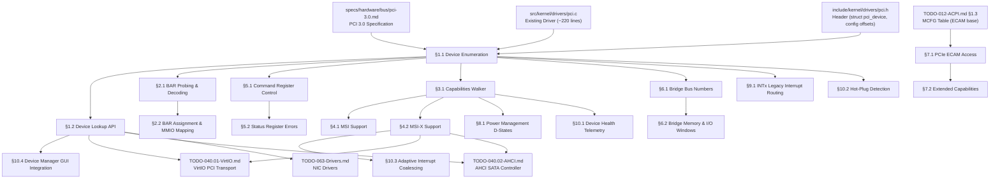

# TODO-013.03-PCI 2014 PCI Local Bus 3.0 Driver Implementation

> **Goal:** Implement a complete PCI Local Bus 3.0 subsystem for Impossible OS, evolving from
> the current minimal stub (`pci.c` ~220 lines: flat bus scan, I/O port config access,
> `pci_find_device`, `pci_enable_bus_mastering`) into a production-grade bus infrastructure
> with proper recursive enumeration, device tree construction, BAR probing/allocation,
> capabilities linked-list parsing, MSI/MSI-X interrupt support, PCI-to-PCI bridge handling,
> PCIe ECAM extended config, comprehensive error reporting, power management D-states,
> and Impossible OS-exclusive features (device health telemetry, hot-plug detection,
> adaptive interrupt coalescing, Device Manager GUI integration) — all per the
> PCI Local Bus Specification Revision 3.0 (PCI-SIG, February 2004).

> [!CAUTION]
> **Memory Rule:** Use `pmm_alloc_contiguous()` for ALL buffers > 4 KB (MSI-X tables,
> ECAM mappings, device arrays). `kmalloc` is ONLY for small kernel structs (≤ 4 KB).
> See `rules.md` Known Gotchas.

> [!WARNING]
> **BAR Probing Hazard:** Writing `0xFFFFFFFF` to a BAR temporarily disables the device's
> address decode. Always save and restore the original BAR value. Disable Memory/IO Space
> in the Command register before probing to prevent spurious accesses during the probe window.

> [!IMPORTANT]
> **Spec Reference:** All register offsets, command encodings, capability IDs, and signal
> definitions reference the [PCI Local Bus Spec 3.0](file:///home/derickpayne/impossible-os/specs/hardware/bus/pci-3.0.md)
> (PCI-SIG, 2004). PCIe ECAM references
> [TODO-012-ACPI §1.3](../../010-Kernel-Foundations/TODO-012-ACPI.md).

> [!NOTE]
> **Cross-references:**
> - [TODO-060-PCI.md](../TODO-060-PCI.md) — Parent PCI/PCIe roadmap
> - [TODO-012-ACPI.md §1.3](../../010-Kernel-Foundations/TODO-012-ACPI.md) — MCFG table for PCIe ECAM base
> - [TODO-012-ACPI.md §8.1](../../010-Kernel-Foundations/TODO-012-ACPI.md) — ACPI `_PRT` for interrupt routing
> - [TODO-040.01-VirtIO.md](../../010-Kernel-Foundations/TODO-040-Filesystem/TODO-040.01-VirtIO.md) — VirtIO PCI transport (consumer)
> - [TODO-063-Drivers.md](../TODO-063-Drivers.md) — All hardware drivers depend on PCI enumeration

---

## TODO Completion Roadmap

### Dependency Graph

### Phase-by-Phase Implementation Order

| Phase  | Sections                                | Depends On                     | Status |
| :----: | --------------------------------------- | ------------------------------ | :----: |
| **0**  | PCI 3.0 spec + existing `pci.c`/`pci.h` | —                              |   ✅   |
| **1**  | §1.1 Device Enumeration                 | Phase 0                        |   ⚠️   |
| **1**  | §1.2 Device Lookup API                  | Phase 1 (§1.1)                 |   ⚠️   |
| **1**  | §2.1 BAR Probing & Decoding             | Phase 1 (§1.1)                 |   ⬜   |
| **1**  | §5.1 Command Register Control           | Phase 1 (§1.1)                 |   ⚠️   |
| **2**  | §3.1 Capabilities Walker                | Phase 1 (§1.1)                 |   ⬜   |
| **2**  | §4.1 MSI Support                        | Phase 2 (§3.1)                 |   ⬜   |
| **2**  | §4.2 MSI-X Support                      | Phase 2 (§3.1)                 |   ⬜   |
| **2**  | §2.2 BAR Assignment & MMIO Mapping      | Phase 1 (§2.1)                 |   ⬜   |
| **3**  | §5.2 Status Register Errors             | Phase 1 (§5.1)                 |   ⬜   |
| **3**  | §6.1 Bridge Bus Numbers                 | Phase 1 (§1.1)                 |   ⬜   |
| **3**  | §6.2 Bridge Memory & I/O Windows        | Phase 3 (§6.1)                 |   ⬜   |
| **3**  | §7.1 PCIe ECAM Access                   | ACPI MCFG                      |   ⬜   |
| **3**  | §7.2 Extended Capabilities              | Phase 3 (§7.1)                 |   ⬜   |
| **4**  | §8.1 Power Management D-States          | Phase 2 (§3.1)                 |   ⬜   |
| **4**  | §9.1 INTx Legacy Interrupt Routing      | Phase 1 (§1.1)                 |   ⬜   |
| **5**  | §10.1 Device Health Telemetry           | Phase 2 (§3.1)                 |   ⬜   |
| **5**  | §10.2 Hot-Plug Detection                | Phase 1 (§1.1)                 |   ⬜   |
| **5**  | §10.3 Adaptive Interrupt Coalescing     | Phase 2 (§4.2)                 |   ⬜   |
| **5**  | §10.4 Device Manager GUI Integration    | Phase 1 (§1.2)                 |   ⬜   |

> [!NOTE]
> **Phase 0** is already complete — the existing driver handles I/O port config access
> (`0xCF8`/`0xCFC`), scans buses 0–255, detects multi-function devices, provides
> `pci_find_device()` by vendor/device ID, and `pci_enable_bus_mastering()`.
>
> **Phase 1** restructures the foundation: proper device tree with `struct pci_device`,
> BAR probing with size detection, enhanced lookup API (by class, BDF, iteration),
> and full Command register control. **Everything else depends on Phase 1.**
>
> **Phase 2** adds the capability infrastructure: linked-list walker, MSI, MSI-X,
> and BAR assignment. MSI/MSI-X are critical for AHCI, VirtIO, and NIC drivers.
>
> **Phase 3** handles bridge topology, PCIe ECAM (4K extended config space), extended
> capabilities (AER, SR-IOV), and error reporting.
>
> **Phase 4** adds power management D-states and legacy INTx routing for devices
> that don't support MSI/MSI-X.
>
> **Phase 5** delivers exclusive features (⭐): device health telemetry, hot-plug
> detection, adaptive interrupt coalescing, and Device Manager GUI integration.

> [!TIP]
> **Quick wins after Phase 1:**
> - §5.1 Command Register is ~30 lines: add `pci_set_command(dev, set, clear)` helper.
>   Bus master enable already exists — extend to Memory/IO Space enable.
> - §1.2 Device Lookup API mostly reorganizes existing code — `pci_find_device()` exists,
>   just needs to search the global device list instead of re-scanning hardware.
>
> **Critical gotcha — BAR probing:**
> Writing `0xFFFFFFFF` to a BAR temporarily unmaps the device. Disable Memory Space
> and I/O Space in the Command register first (save/restore the original Command value).
> For 64-bit BARs, two consecutive BAR slots are consumed — skip the upper half when
> iterating. BAR bit 0 = Memory (0) vs I/O (1). Memory BAR bits 2:1 = locatable
> (00 = 32-bit, 10 = 64-bit). Bit 3 = prefetchable.
>
> **Critical gotcha — multi-function detection:**
> Always check Header Type bit 7 of function 0. If clear, the device is single-function
> and functions 1–7 must NOT be probed (some hardware returns garbage for non-existent
> functions). Current code handles this correctly.
>
> **Memory rule reminder:**
> The global device array, MSI-X table mappings, and ECAM region mappings may exceed
> 4 KB. Use `pmm_alloc_contiguous()` for these. `kmalloc` only for per-device structs.

---

## 1. Device Model & Enumeration

### 1.1 Proper Device Enumeration

**Prompt:** The current `pci_scan()` iterates buses 0–255, devices 0–31, functions 0–7,
logging each device found. It does NOT build a device list or tree — it just prints.
Replace with a proper recursive enumeration per PCI 3.0 §3.2 that: (1) builds a global
`pci_devices[]` array storing all discovered devices, (2) follows PCI-to-PCI bridges
(Header Type 1) to discover secondary buses, (3) correctly handles multi-function
devices (Header Type bit 7), (4) stores BDF, vendor/device IDs, class/subclass/progif,
header type, revision ID, interrupt pin/line, and capabilities pointer per device.
After completing all items, mark every item as `[x]`, update this prompt to a
verification prompt, run `bash scripts/build.sh clean`, and commit as
`"pci: proper device enumeration"`. After implementation, save gotchas to MCP memory.

- [ ] Define enhanced `struct pci_device`:
  - [ ] `bus`, `dev`, `func` (BDF address)
  - [ ] `vendor_id`, `device_id`, `revision_id`
  - [ ] `class_code`, `subclass`, `prog_if`
  - [ ] `header_type` (0 = endpoint, 1 = bridge, 2 = CardBus)
  - [ ] `irq_pin` (offset `0x3D`), `irq_line` (offset `0x3C`)
  - [ ] `bar[6]` — raw BAR values (decoded in §2.1)
  - [ ] `caps_ptr` (offset `0x34`) — capabilities pointer
  - [ ] `parent_bridge` — pointer to upstream bridge device
  - [ ] `is_multifunction` — Header Type bit 7
- [ ] Allocate global `pci_devices[256]` array and `pci_device_count`
- [ ] Implement `pci_scan_bus(uint8_t bus)`:
  - [ ] Iterate devices 0–31, functions 0–7
  - [ ] Check `vendor_id != 0xFFFF` for device presence
  - [ ] Check Header Type bit 7 at function 0 for multi-function
  - [ ] Read all config header fields into `struct pci_device`
  - [ ] If Header Type == 1 (bridge): read Secondary Bus (offset `0x19`), recurse
- [ ] Replace `pci_scan()` with `pci_enumerate()` calling `pci_scan_bus(0)`
- [ ] Log: `[PCI] Found %u devices on %u buses`
- [ ] Log per device: `[PCI] %02x:%02x.%x %04x:%04x %s [%02x:%02x:%02x]`
- [ ] Commit: `"pci: proper device enumeration"`

### 1.2 PCI Device Lookup API

**Prompt:** Provide multiple device lookup functions operating on the global device list
built in §1.1. The current `pci_find_device()` re-scans hardware on every call — replace
with a list search. Add lookup by class/subclass (critical for finding "all storage
controllers" or "all network adapters"), by exact BDF, and an iterator for bulk operations.
After completing all items, mark every item as `[x]`, update this prompt to a
verification prompt, run `bash scripts/build.sh clean`, and commit as
`"pci: device lookup API"`. After implementation, save gotchas to MCP memory.

- [ ] `pci_find_device(vendor_id, device_id)` → return `struct pci_device*` (update existing)
- [ ] `pci_find_class(class, subclass)` → return first match
- [ ] `pci_find_all_class(class, subclass, out[], max)` → return count of matches
- [ ] `pci_get_device(bus, dev, func)` → direct BDF lookup
- [ ] `pci_for_each_device(callback, ctx)` → iterate all devices with user callback
- [ ] `pci_device_count()` → return total enumerated device count
- [ ] All functions search the in-memory device list (no hardware re-scan)
- [ ] Commit: `"pci: device lookup API"`

---

## 2. Base Address Registers (BARs)

### 2.1 BAR Probing & Decoding

**Prompt:** Per PCI 3.0 §6.2.5, each Type 0 device has six 32-bit BARs at offsets
`0x10`–`0x24`. The OS probes BAR size by writing `0xFFFFFFFF` and reading back — the
hardware returns zeros in don't-care bits, indicating the required size. BAR bit 0
distinguishes Memory (0) vs I/O (1). For Memory BARs: bits 2:1 indicate 32-bit (00)
or 64-bit (10) locatable; bit 3 is the Prefetchable flag. 64-bit BARs consume two
consecutive BAR slots. Size = `~(readback & mask) + 1`. Each BAR can describe 16 bytes
to 2 GB. Save/restore Command register during probing to prevent spurious accesses.
After completing all items, mark every item as `[x]`, update this prompt to a
verification prompt, run `bash scripts/build.sh clean`, and commit as
`"pci: BAR probing and decoding"`. After implementation, save gotchas to MCP memory.

- [ ] Define `struct pci_bar_info`:
  - [ ] `base` (uint64_t) — physical base address
  - [ ] `size` (uint64_t) — region size in bytes
  - [ ] `type` — `PCI_BAR_MEM32`, `PCI_BAR_MEM64`, `PCI_BAR_IO`
  - [ ] `prefetchable` — boolean (Memory BAR bit 3)
  - [ ] `present` — boolean (BAR is valid/non-zero)
- [ ] Add `struct pci_bar_info bars[6]` to `struct pci_device`
- [ ] Implement `pci_probe_bar(dev, bar_index)`:
  - [ ] Save Command register, disable Memory + I/O Space
  - [ ] Save original BAR value
  - [ ] Write `0xFFFFFFFF` to BAR, read back
  - [ ] Decode bit 0: Memory (0) vs I/O (1)
  - [ ] For Memory: decode bits 2:1 for 32/64-bit, bit 3 for prefetchable
  - [ ] For 64-bit: write `0xFFFFFFFF` to BAR+1, read back upper 32 bits
  - [ ] Calculate size: `~(readback & mask) + 1`
  - [ ] Restore original BAR value
  - [ ] Restore Command register
- [ ] Probe all BARs during enumeration (§1.1), skip upper half of 64-bit BARs
- [ ] Log per BAR: `[PCI] %02x:%02x.%x BAR%d: %s 0x%lx (%u KB)%s`
- [ ] Commit: `"pci: BAR probing and decoding"`

### 2.2 BAR Assignment & MMIO Mapping

**Prompt:** After probing, some BARs may be unassigned (base == 0) if firmware skipped
them. Implement a simple physical address allocator for PCI MMIO above `0x80000000`.
For QEMU/UEFI, firmware typically pre-assigns BARs — just read and use them. But on
real hardware, provide `pci_assign_bar()` for unassigned BARs and `pci_map_bar()` to
get a kernel-accessible virtual address (identity-mapped for now).
After completing all items, mark every item as `[x]`, update this prompt to a
verification prompt, run `bash scripts/build.sh clean`, and commit as
`"pci: BAR assignment and MMIO mapping"`. After implementation, save gotchas to MCP memory.

- [ ] If BAR base == 0 after probe: allocate from MMIO range above `0x80000000`
- [ ] MMIO range allocator: track allocated regions, prevent overlap
- [ ] Align BAR base to BAR size (natural alignment per PCI 3.0 §6.2.5)
- [ ] Write allocated address back to BAR register
- [ ] For 64-bit BARs: write upper 32 bits to BAR+1
- [ ] `pci_map_bar(dev, bar_index)` → return kernel virtual address
  - [ ] Identity-mapped for now (phys == virt)
  - [ ] Map with `VMM_FLAG_NOCACHE | VMM_FLAG_WRITETHROUGH` for MMIO
- [ ] Enable Memory Space in Command register after mapping
- [ ] Commit: `"pci: BAR assignment and MMIO mapping"`

---

## 3. Capabilities List

### 3.1 Capabilities Walker

**Prompt:** Per PCI 3.0 §6.7, devices advertise extended features via a linked list
starting at the Capabilities Pointer (offset `0x34`). The Status register bit 4
indicates list presence. Each entry: Cap ID (1 byte, PCI-SIG assigned), Next Pointer
(1 byte), then capability-specific registers. Chain terminates at Next == `0x00`.
Cache discovered capabilities in the device struct for O(1) lookup.
After completing all items, mark every item as `[x]`, update this prompt to a
verification prompt, run `bash scripts/build.sh clean`, and commit as
`"pci: capabilities list parser"`. After implementation, save gotchas to MCP memory.

- [ ] Check Status register (offset `0x06`) bit 4: Capabilities List present
- [ ] Read Capabilities Pointer at offset `0x34` (mask bottom 2 bits — reserved)
- [ ] Walk linked list: read Cap ID (byte 0), Next Pointer (byte 1)
- [ ] Terminate when Next Pointer == `0x00`
- [ ] Store in device struct: `struct { uint8_t id; uint8_t offset; } caps[16]`
- [ ] Implement `pci_find_capability(dev, cap_id)` → return config offset or 0
- [ ] Recognize standard Capability IDs:
  - [ ] `0x01` — Power Management Interface (PMI)
  - [ ] `0x05` — MSI (Message Signaled Interrupts)
  - [ ] `0x10` — PCI Express Capability
  - [ ] `0x11` — MSI-X (Extended Message Signaled Interrupts)
  - [ ] `0x12` — SATA Data/Index Configuration
  - [ ] `0x13` — Advanced Features (AF)
- [ ] Log: `[PCI] %02x:%02x.%x caps: PMI MSI-X PCIe`
- [ ] Commit: `"pci: capabilities list parser"`

---

## 4. MSI / MSI-X Interrupt Support

### 4.1 MSI Support

**Prompt:** Per PCI 3.0 §6.8, MSI (Capability ID `0x05`) replaces legacy INTx# with
in-band memory write transactions to the LAPIC. The device writes a message (vector)
to a message address (`0xFEE00000 | (dest << 12)`). MSI supports up to 32 vectors.
Program Message Address, Message Data (vector), and enable via MSI Enable bit.
Enabling MSI automatically disables legacy INTx#.
After completing all items, mark every item as `[x]`, update this prompt to a
verification prompt, run `bash scripts/build.sh clean`, and commit as
`"pci: MSI interrupt support"`. After implementation, save gotchas to MCP memory.

- [ ] Find MSI capability via `pci_find_capability(dev, 0x05)`
- [ ] Parse Message Control register:
  - [ ] Bit 7: 64-bit address capable
  - [ ] Bits 6:4: Multiple Message Capable (log2 of max vectors)
  - [ ] Bits 3:1: Multiple Message Enable (log2 of allocated vectors)
  - [ ] Bit 8: Per-Vector Masking capable
- [ ] Program Message Address: `0xFEE00000 | (dest_apic_id << 12)`
- [ ] If 64-bit capable: write upper 32 bits of address (0 for x86)
- [ ] Program Message Data: `vector & 0xFF` (fixed delivery, edge-triggered)
- [ ] Set MSI Enable bit (Message Control bit 0)
- [ ] Implement `pci_enable_msi(dev, vector)` — configure and enable
- [ ] Implement `pci_disable_msi(dev)` — disable MSI, re-enable INTx#
- [ ] Set Command register bit 10 (Interrupt Disable) for legacy INTx#
- [ ] Commit: `"pci: MSI interrupt support"`

### 4.2 MSI-X Support

**Prompt:** Per PCI 3.0 §6.8.2, MSI-X (Capability ID `0x11`) scales to 2,048
independent vectors using a memory-mapped table in BAR space. Each 16-byte entry:
Message Address Low (4B), Message Address High (4B), Message Data (4B), Vector
Control (4B, bit 0 = per-vector mask). The Table Offset and PBA Offset each include
a 3-bit BIR (BAR Indicator Register) pointing to one of the six BARs. MSI-X is
critical for multi-queue devices (NVMe, AHCI, NICs).
After completing all items, mark every item as `[x]`, update this prompt to a
verification prompt, run `bash scripts/build.sh clean`, and commit as
`"pci: MSI-X interrupt support"`. After implementation, save gotchas to MCP memory.

- [ ] Find MSI-X capability via `pci_find_capability(dev, 0x11)`
- [ ] Parse Message Control: Table Size (bits 10:0, actual = value + 1), Function Mask, Enable
- [ ] Parse Table Offset + BIR: lower 3 bits = BAR index, upper 29 bits = offset
- [ ] Parse PBA Offset + BIR: same format for Pending Bit Array
- [ ] Map MSI-X table: `bar_base[BIR] + table_offset` → MMIO map (uncacheable)
- [ ] Map PBA: `bar_base[PBA_BIR] + pba_offset`
- [ ] Each table entry (16 bytes):
  - [ ] `msg_addr_lo` (4B) — `0xFEE00000 | (dest << 12)`
  - [ ] `msg_addr_hi` (4B) — 0 for x86
  - [ ] `msg_data` (4B) — interrupt vector
  - [ ] `vector_ctrl` (4B) — bit 0 = Mask (1 = masked)
- [ ] `pci_enable_msix(dev)` — set Enable bit, clear Function Mask
- [ ] `pci_msix_set_entry(dev, idx, vector, cpu)` — program one table entry
- [ ] `pci_msix_mask(dev, idx)` / `pci_msix_unmask(dev, idx)` — per-vector mask
- [ ] `pci_msix_table_size(dev)` — return table size from Message Control
- [ ] Commit: `"pci: MSI-X interrupt support"`

---

## 5. Command & Status Registers

### 5.1 Command Register Control

**Prompt:** The PCI Command register (offset `0x04`) controls device behavior per
PCI 3.0 §6.2.2. Current code only sets Bus Master Enable (bit 2). Add a proper API
for all command bits: I/O Space Enable (bit 0), Memory Space Enable (bit 1),
Interrupt Disable (bit 10), SERR# Enable (bit 8), Parity Error Response (bit 6).
Drivers must enable Memory/I/O Space before accessing BARs.
After completing all items, mark every item as `[x]`, update this prompt to a
verification prompt, run `bash scripts/build.sh clean`, and commit as
`"pci: command register management"`. After implementation, save gotchas to MCP memory.

- [x] Bus Master Enable (bit 2) — `pci_enable_bus_mastering()` *(done)*
- [ ] Memory Space Enable (bit 1) — required before MMIO BAR access
- [ ] I/O Space Enable (bit 0) — required before I/O BAR access
- [ ] Interrupt Disable (bit 10) — set when using MSI/MSI-X
- [ ] SERR# Enable (bit 8) — enable system error reporting
- [ ] Parity Error Response (bit 6) — enable parity checking
- [ ] Implement `pci_set_command(dev, bits_to_set, bits_to_clear)`
- [ ] Auto-enable Memory/IO Space when BAR is mapped by driver
- [ ] Commit: `"pci: command register management"`

### 5.2 Status Register & Error Checking

**Prompt:** The PCI Status register (offset `0x06`) reports error conditions per
PCI 3.0 §6.2.3. Status bits are write-1-to-clear (W1C). Check: Detected Parity
Error (bit 15), Signaled System Error (bit 14), Received Master Abort (bit 13),
Received Target Abort (bit 12), Signaled Target Abort (bit 11), Data Parity Error
(bit 8). The kernel should check status after failed transactions.
After completing all items, mark every item as `[x]`, update this prompt to a
verification prompt, run `bash scripts/build.sh clean`, and commit as
`"pci: status register error checking"`. After implementation, save gotchas to MCP memory.

- [ ] Read Status register (offset `0x06`)
- [ ] Check and decode error bits:
  - [ ] Bit 15: Detected Parity Error
  - [ ] Bit 14: Signaled System Error (SERR#)
  - [ ] Bit 13: Received Master Abort
  - [ ] Bit 12: Received Target Abort
  - [ ] Bit 11: Signaled Target Abort
  - [ ] Bit 8: Data Parity Error Detected
- [ ] Implement `pci_check_errors(dev)` — read status, log errors, return error mask
- [ ] Implement `pci_clear_errors(dev)` — write-1 to all error bits (W1C)
- [ ] Log: `[PCI] %02x:%02x.%x ERROR: Received Master Abort`
- [ ] Commit: `"pci: status register error checking"`

---

## 6. PCI-to-PCI Bridge Configuration

### 6.1 Bridge Bus Number Programming

**Prompt:** PCI-to-PCI bridges (Header Type 1) connect bus segments per PCI 3.0 §3.2.
Each bridge has Primary Bus (offset `0x18`), Secondary Bus (`0x19`), and Subordinate
Bus (`0x1A`). UEFI typically programs these — the OS reads them during enumeration
to discover the full bus hierarchy. If rescanning or hot-plugging, the OS must know
how to configure them.
After completing all items, mark every item as `[x]`, update this prompt to a
verification prompt, run `bash scripts/build.sh clean`, and commit as
`"pci: bridge bus number configuration"`. After implementation, save gotchas to MCP memory.

- [ ] For Header Type 1 devices, parse bridge registers:
  - [ ] Primary Bus Number (offset `0x18`)
  - [ ] Secondary Bus Number (offset `0x19`)
  - [ ] Subordinate Bus Number (offset `0x1A`)
- [ ] Define `struct pci_bridge` extending `struct pci_device`:
  - [ ] `primary_bus`, `secondary_bus`, `subordinate_bus`
  - [ ] `secondary_status` (offset `0x1E`)
  - [ ] Bridge Control register (offset `0x3E`)
- [ ] Build bus topology tree: each bridge → secondary bus devices
- [ ] Log: `[PCI] Bridge %02x:%02x.%x → bus %u (subordinate %u)`
- [ ] Commit: `"pci: bridge bus number configuration"`

### 6.2 Bridge Memory & I/O Windows

**Prompt:** Bridges define address windows that are forwarded downstream per PCI 3.0
§3.2.5. I/O Base/Limit (`0x1C`/`0x1D`), Memory Base/Limit (`0x20`/`0x22`), and
Prefetchable Memory Base/Limit (`0x24`/`0x26`, with upper 32-bit extensions at
`0x28`/`0x2C`). The Bridge Control register (`0x3E`) controls SERR# forwarding,
ISA mode, and VGA routing.
After completing all items, mark every item as `[x]`, update this prompt to a
verification prompt, run `bash scripts/build.sh clean`, and commit as
`"pci: bridge memory and I/O windows"`. After implementation, save gotchas to MCP memory.

- [ ] Parse bridge window registers:
  - [ ] I/O Base (`0x1C`) / I/O Limit (`0x1D`) — 4 KB granularity
  - [ ] Memory Base (`0x20`) / Memory Limit (`0x22`) — 1 MB granularity
  - [ ] Prefetchable Memory Base (`0x24`) / Limit (`0x26`) — 1 MB granularity
  - [ ] Prefetchable upper 32-bit Base (`0x28`) / Limit (`0x2C`) — 64-bit windows
- [ ] Parse Bridge Control register (`0x3E`):
  - [ ] Bit 0: Parity Error Response
  - [ ] Bit 1: SERR# forwarding
  - [ ] Bit 2: ISA Enable (restrict I/O to first 256 bytes per 1K)
  - [ ] Bit 3: VGA Enable (forward VGA compatible I/O and memory)
- [ ] Store window ranges in `struct pci_bridge`
- [ ] Log bridge windows: `[PCI] Bridge %02x:%02x.%x mem: 0x%x–0x%x`
- [ ] Commit: `"pci: bridge memory and I/O windows"`

---

## 7. PCIe Extended Configuration

### 7.1 PCIe ECAM Access

**Prompt:** Legacy I/O ports (`0xCF8`/`0xCFC`) only access 256 bytes per function.
PCIe extends this to 4096 bytes via Memory-Mapped ECAM. The ECAM base comes from
ACPI MCFG table (see TODO-012-ACPI §1.3). Each function gets a 4K page at offset
`(bus << 20) | (dev << 15) | (func << 12)`. ECAM enables PCIe extended capabilities
at offsets `0x100`–`0xFFF`.
After completing all items, mark every item as `[x]`, update this prompt to a
verification prompt, run `bash scripts/build.sh clean`, and commit as
`"pci: PCIe ECAM config access"`. After implementation, save gotchas to MCP memory.

- [ ] Get ECAM base from ACPI MCFG table (TODO-012-ACPI §1.3)
- [ ] Calculate per-function address: `ecam_base + (bus << 20) | (dev << 15) | (func << 12)`
- [ ] Map ECAM region: identity-map with uncacheable attributes
- [ ] Implement `pcie_read32(bus, dev, func, offset)` — MMIO read
- [ ] Implement `pcie_write32(bus, dev, func, offset, value)` — MMIO write
- [ ] Support full offset range `0x000`–`0xFFF` (4096 bytes)
- [ ] Fallback: if MCFG not present, use legacy I/O port mechanism
- [ ] Auto-detect: use ECAM when available, legacy otherwise
- [ ] Commit: `"pci: PCIe ECAM config access"`

### 7.2 PCIe Extended Capabilities

**Prompt:** At offset `0x100` begins the PCIe extended capability list. Each entry:
16-bit Cap ID, 4-bit version, 12-bit next offset. Walk this list to discover AER,
SR-IOV, LTR, and other extended capabilities.
After completing all items, mark every item as `[x]`, update this prompt to a
verification prompt, run `bash scripts/build.sh clean`, and commit as
`"pci: PCIe extended capabilities"`. After implementation, save gotchas to MCP memory.

- [ ] Walk extended capability list starting at offset `0x100`
- [ ] Parse each entry: Cap ID (bits 15:0), Version (bits 19:16), Next (bits 31:20)
- [ ] Terminate when Next == `0x000`
- [ ] Implement `pci_find_ext_capability(dev, ext_cap_id)` → return offset or 0
- [ ] Recognize standard Extended Capability IDs:
  - [ ] `0x0001` — AER (Advanced Error Reporting)
  - [ ] `0x0010` — SR-IOV (Single Root I/O Virtualization)
  - [ ] `0x0018` — LTR (Latency Tolerance Reporting)
  - [ ] `0x001E` — L1 PM Substates
- [ ] Store extended caps in device struct alongside standard caps
- [ ] Commit: `"pci: PCIe extended capabilities"`

---

## 8. Power Management

### 8.1 PCI PM Capability (D-States)

**Prompt:** Per PCI 3.0 §6.7 and the PCI PM spec, devices support power states D0
(fully on) through D3hot via the PM Capability (ID `0x01`). The PMCSR register controls
transitions. D3cold requires platform ACPI support. The `PME#` signal and `+3.3Vaux`
rail enable wake-from-sleep (Wake-on-LAN, etc.). D3→D0 recovery requires a 10ms wait.
After completing all items, mark every item as `[x]`, update this prompt to a
verification prompt, run `bash scripts/build.sh clean`, and commit as
`"pci: power management D-states"`. After implementation, save gotchas to MCP memory.

- [ ] Find PM capability via `pci_find_capability(dev, 0x01)`
- [ ] Parse PM Capabilities register:
  - [ ] D1/D2 support bits (some devices skip to D3)
  - [ ] PME# support from each D-state
  - [ ] Aux current required in D3cold
  - [ ] DSI (Device Specific Initialization) bit
- [ ] Parse/write PMCSR (Control/Status Register):
  - [ ] PowerState bits 1:0: `00`=D0, `01`=D1, `10`=D2, `11`=D3hot
  - [ ] PME_En bit: enable `PME#` generation
  - [ ] PME_Status bit: `PME#` asserted (W1C)
- [ ] Implement `pci_set_power_state(dev, state)`:
  - [ ] D0→D3: save config space, write PowerState bits
  - [ ] D3→D0: write PowerState, wait 10ms recovery, restore config
- [ ] Implement `pci_get_power_state(dev)` — read PMCSR
- [ ] Support `+3.3Vaux` wake: devices with PME from D3cold
- [ ] Integration: call during system suspend/resume
- [ ] Commit: `"pci: power management D-states"`

---

## 9. Legacy Interrupt Routing

### 9.1 INTx Pin-Based Interrupts

**Prompt:** Per PCI 3.0 §2.2.6, conventional PCI has four shared interrupt lines
`INTA#`–`INTD#`. Single-function devices must use `INTA#`. The Interrupt Pin register
(offset `0x3D`, read-only) indicates which pin (1=A, 2=B, 3=C, 4=D). The Interrupt
Line register (offset `0x3C`, read/write) stores the system IRQ assigned by firmware.
Motherboard routing rotates pins across slots: `MB_IRQ = (device + pin) mod 4`.
Shared interrupts require polling all devices on the same IRQ line.
After completing all items, mark every item as `[x]`, update this prompt to a
verification prompt, run `bash scripts/build.sh clean`, and commit as
`"pci: legacy INTx interrupt routing"`. After implementation, save gotchas to MCP memory.

- [ ] Read Interrupt Pin register (offset `0x3D`) during enumeration
- [ ] Read Interrupt Line register (offset `0x3C`) — firmware-assigned IRQ
- [ ] Build shared IRQ map: group devices by Interrupt Line
- [ ] Implement `pci_route_intx(dev)` → return system IRQ number
- [ ] Shared IRQ handler: poll Status registers of all devices on same line
- [ ] Use INTx only as fallback when MSI/MSI-X unavailable
- [ ] Log: `[PCI] %02x:%02x.%x INT%c# → IRQ %u`
- [ ] Commit: `"pci: legacy INTx interrupt routing"`

---

## 10. Impossible OS Exclusive Features

### 10.1 Device Health Telemetry (🚀 Exclusive)

**Prompt:** Neither Windows PCI.sys nor Linux pci-driver expose per-device transaction
statistics at the bus level. Implement PCI bus-layer telemetry: track config space
access counts, BAR read/write counts, MSI/MSI-X interrupt counts, error rates
(Master Abort, Target Abort, parity), and per-device latency histograms. Expose
via Registry for Device Manager GUI. This gives Impossible OS the first PCI bus
health dashboard — no other OS surfaces this data in a GUI.
After completing all items, mark every item as `[x]`, update this prompt to a
verification prompt, run `bash scripts/build.sh clean`, and commit as
`"pci: device health telemetry"`. After implementation, save gotchas to MCP memory.

- [ ] Per-device telemetry struct:
  - [ ] `config_reads`, `config_writes` — config space access counters
  - [ ] `msi_count`, `msix_count` — interrupt counters
  - [ ] `master_aborts`, `target_aborts`, `parity_errors` — error counters
  - [ ] `last_error_timestamp` — ns-resolution timestamp of last error
- [ ] Instrument config read/write functions with counters
- [ ] Instrument MSI/MSI-X handlers with interrupt counters
- [ ] Expose via Registry: `HKLM\HARDWARE\PCI\{BDF}\Stats\*`
- [ ] Wire to Device Manager: per-device health panel
- [ ] Log summary on demand: `[PCI] %02x:%02x.%x stats: %u reads, %u ints, %u errors`
- [ ] Commit: `"pci: device health telemetry"`

### 10.2 Hot-Plug Detection (🚀 Exclusive)

**Prompt:** Detect PCI device arrival/removal by periodic re-scanning or via PCIe
hot-plug interrupt. When a new device appears (vendor ID transitions from `0xFFFF`
to valid), automatically enumerate and register it. When a device disappears
(vendor ID reads `0xFFFF`), gracefully tear down the driver. Windows requires full
PnP manager; Linux uses `pciehp` kernel module. Impossible OS can provide lightweight
hot-plug with minimal overhead.
After completing all items, mark every item as `[x]`, update this prompt to a
verification prompt, run `bash scripts/build.sh clean`, and commit as
`"pci: hot-plug detection"`. After implementation, save gotchas to MCP memory.

- [ ] Periodic re-scan: timer-based check every 5 seconds (configurable)
- [ ] Detect new device: `vendor_id != 0xFFFF` at previously empty BDF
- [ ] Auto-enumerate: run BAR probe, capabilities walk, driver match
- [ ] Detect removal: `vendor_id == 0xFFFF` at previously occupied BDF
- [ ] Graceful teardown: notify driver, unmap BARs, free MSI-X vectors
- [ ] PCIe hot-plug interrupt: if PCIe capability present, use slot status events
- [ ] Registry: `HKLM\SYSTEM\Drivers\PCI\HotPlug\ScanIntervalMs` (default 5000)
- [ ] Log: `[PCI] Hot-plug: device %04x:%04x appeared at %02x:%02x.%x`
- [ ] Commit: `"pci: hot-plug detection"`

### 10.3 Adaptive Interrupt Coalescing (🚀 Exclusive)

**Prompt:** Neither Windows nor Linux PCI subsystems provide bus-level interrupt
coalescing policies. Implement an adaptive strategy: under low interrupt load, deliver
immediately; under high load, batch MSI-X completions and deliver at configurable
intervals. Track per-device interrupt rate and dynamically adjust coalescing depth.
After completing all items, mark every item as `[x]`, update this prompt to a
verification prompt, run `bash scripts/build.sh clean`, and commit as
`"pci: adaptive interrupt coalescing"`. After implementation, save gotchas to MCP memory.

- [ ] Track per-device interrupt rate (rolling 100ms window)
- [ ] Low rate (< 1K/s): immediate delivery (no coalescing)
- [ ] High rate (> 10K/s): batch and deliver every N completions or T microseconds
- [ ] Implement coalescing via MSI-X per-vector masking:
  - [ ] Mask vector during batch window
  - [ ] Timer fires → unmask → device delivers pending interrupt
- [ ] Configurable thresholds via Registry:
  - [ ] `HKLM\SYSTEM\Drivers\PCI\Coalescing\LowThreshold` (default 1000)
  - [ ] `HKLM\SYSTEM\Drivers\PCI\Coalescing\HighThreshold` (default 10000)
  - [ ] `HKLM\SYSTEM\Drivers\PCI\Coalescing\BatchSize` (default 8)
- [ ] Commit: `"pci: adaptive interrupt coalescing"`

### 10.4 Device Manager GUI Integration (🚀 Exclusive)

**Prompt:** Expose the full PCI device tree to the desktop Device Manager application.
Provide a kernel API that returns the enumerated device list with all properties
(BDF, vendor/device names, class, BARs, capabilities, power state, interrupt mode,
telemetry). This enables a Windows-style Device Manager that shows every PCI device
with drill-down into properties, resources, and health status.
After completing all items, mark every item as `[x]`, update this prompt to a
verification prompt, run `bash scripts/build.sh clean`, and commit as
`"pci: Device Manager GUI integration"`. After implementation, save gotchas to MCP memory.

- [ ] Implement `pci_get_device_list()` → return array of device descriptors
- [ ] Each descriptor includes: BDF, vendor/device name strings, class name,
      BAR ranges, interrupt mode (INTx/MSI/MSI-X), power state, error counts
- [ ] Vendor/device name lookup: embed PCI IDs database subset (common vendors)
- [ ] Expose via syscall: `NtQuerySystemInformation(SystemPciInformation, ...)`
- [ ] Wire to Device Manager desktop app: tree view, properties dialog
- [ ] Real-time updates: telemetry counters refresh on timer
- [ ] Commit: `"pci: Device Manager GUI integration"`

---

## Priority Order

| Priority | Section                              | Description                                                    |
| -------- | ------------------------------------ | -------------------------------------------------------------- |
| 🔴 P0    | §1.1 Device Enumeration             | Foundation — all drivers need device discovery                 |
| 🔴 P0    | §1.2 Device Lookup API              | Every driver uses `pci_find_device` / `pci_find_class`         |
| 🔴 P0    | §2.1 BAR Probing & Decoding         | Drivers need BAR sizes for MMIO mapping                        |
| 🔴 P0    | §3.1 Capabilities Walker            | Required for MSI, MSI-X, PM, PCIe detection                    |
| 🟠 P1    | §5.1 Command Register Control       | Proper device enable/disable, BAR access control               |
| 🟠 P1    | §4.1 MSI Support                    | Replace legacy INTx# — eliminates IRQ sharing                  |
| 🟠 P1    | §4.2 MSI-X Support                  | Multi-queue interrupts for AHCI, NVMe, NICs                    |
| 🟡 P2    | §5.2 Status Register Errors         | Error detection and recovery (Master/Target Abort)             |
| 🟡 P2    | §6.1 Bridge Bus Numbers             | Multi-bus topologies, secondary bus discovery                   |
| 🟡 P2    | §6.2 Bridge Memory & I/O Windows    | Bridge address window forwarding                               |
| 🟡 P2    | §7.1 PCIe ECAM Access               | 4096-byte extended config space                                |
| 🟡 P2    | §7.2 Extended Capabilities          | AER, SR-IOV, LTR                                               |
| 🟡 P2    | §2.2 BAR Assignment & MMIO Mapping  | Resource allocation for unassigned BARs                        |
| 🟢 P3    | §8.1 Power Management D-States      | D-state transitions, suspend/resume                            |
| 🟢 P3    | §9.1 INTx Legacy Interrupts         | Fallback for non-MSI devices                                   |
| 🟢 P3    | §10.1 Device Health Telemetry       | 🚀 **Exclusive** — bus-level health dashboard                  |
| 🟢 P3    | §10.2 Hot-Plug Detection            | 🚀 **Exclusive** — lightweight device arrival/removal          |
| 🟢 P3    | §10.3 Adaptive Interrupt Coalescing | 🚀 **Exclusive** — bus-level dynamic coalescing               |
| 🔵 P4    | §10.4 Device Manager GUI            | 🚀 **Exclusive** — full device tree in desktop GUI             |

---

## OS Comparison

| Feature                              | 🪟 Windows 11 (PCI.sys)             | 🐧 Linux (drivers/pci/)             | 🚀 Impossible OS                                |
| ------------------------------------ | ------------------------------------ | ------------------------------------ | ----------------------------------------------- |
| Config space I/O (`0xCF8`/`0xCFC`)   | ✅ Full                              | ✅ Full                              | ✅ Done — `pci_read8/16/32`, `pci_write16/32`   |
| Recursive bus enumeration            | ✅ Full PnP                          | ✅ `pci_scan_bus()`                  | ⚠️ §1.1 P0 — scans all buses, no tree          |
| Multi-function detection             | ✅                                   | ✅                                   | ✅ Done — Header Type bit 7                      |
| BAR probing & size detection         | ✅                                   | ✅ `pci_read_bases()`               | ⬜ §2.1 P0                                      |
| Device lookup (class/vendor)         | ✅ PnP Manager                      | ✅ `pci_get_device()`               | ⚠️ §1.2 P0 — vendor/ID only                    |
| Capabilities list parser             | ✅                                   | ✅ `pci_find_capability()`          | ⬜ §3.1 P0                                      |
| MSI support (32 vectors)             | ✅ Full                              | ✅ `pci_enable_msi()`               | ⬜ §4.1 P1                                      |
| MSI-X (2048 vectors)                 | ✅ Full                              | ✅ `pci_enable_msix_range()`        | ⬜ §4.2 P1                                      |
| Command register control             | ✅                                   | ✅ `pci_set_master()`               | ⚠️ §5.1 P1 — bus master only                   |
| Error reporting (PERR/SERR)          | ✅ WER integration                   | ✅ AER driver                       | ⬜ §5.2 P2                                      |
| PCI-to-PCI bridge support            | ✅ Full hierarchy                    | ✅ `pci_scan_bridge()`              | ⬜ §6.1 P2                                      |
| PCIe ECAM (4K config)                | ✅ via MCFG                          | ✅ `pci_mmcfg_init()`              | ⬜ §7.1 P2                                      |
| PCIe extended capabilities           | ✅ AER, LTR, SR-IOV                 | ✅ `pci_find_ext_capability()`     | ⬜ §7.2 P2                                      |
| BAR assignment / MMIO mapping        | ✅ PnP Manager + arbiter             | ✅ `pci_assign_resource()`          | ⬜ §2.2 P2                                      |
| PCI power management (D-states)      | ✅ ACPI + PCI PM                     | ✅ `pci_set_power_state()`          | ⬜ §8.1 P3                                      |
| INTx legacy pin interrupts           | ✅ (fallback)                        | ✅ (fallback)                       | ✅ Done — Interrupt Line register                |
| Hot-plug support                     | ✅ Full PnP                          | ✅ `pciehp` driver                  | ⬜ §10.2 P3 🚀                                  |
| **Bus-level health telemetry**       | ⬜ Not exposed in GUI                | ⬜ sysfs counters only              | ⬜ §10.1 P3 — **first bus-level GUI** 🚀        |
| **Adaptive interrupt coalescing**    | ⬜ Per-driver only                   | ⬜ Per-driver only                  | ⬜ §10.3 P3 — **bus-level coalescing** 🚀       |
| **Full Device Manager tree**         | ✅ Device Manager GUI                | ⬜ lspci CLI only                   | ⬜ §10.4 P4 — **GUI with live telemetry** 🚀    |

> **After P0+P1 items:** Impossible OS matches Windows and Linux for core PCI —
> enumeration, BARs, capabilities, MSI/MSI-X, command register.
>
> **After P2 items:** Full bridge support, PCIe ECAM, extended capabilities, error
> reporting — feature parity with both OSes.
>
> **After P3 exclusive features:** Exceeds both — bus-level health telemetry with
> GUI dashboard, adaptive interrupt coalescing, and lightweight hot-plug.
>
> **After P4:** Device Manager GUI surpasses Windows (live telemetry) and Linux (CLI-only).
