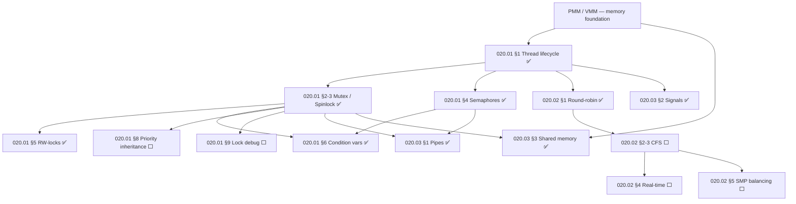

# TODO-020-Threading — Threading, Scheduling & IPC

> **Goal:** Track all kernel concurrency infrastructure: thread lifecycle, synchronization
> primitives, CPU scheduling, and inter-process communication. The scheduler cannot
> exist without threads; IPC reuses the same primitives. These three subsystems
> form the execution model of Impossible OS.

> [!NOTE]
> **Sub-files:**
> - [TODO-020.01-Synchronization.md](TODO-020-Threading/TODO-020.01-Synchronization.md) — Thread structs, mutexes, spinlocks, semaphores, RW-locks, condvars, Hyper-V timer
> - [TODO-020.02-Scheduler.md](TODO-020-Threading/TODO-020.02-Scheduler.md) — CFS, RT priorities, SMP load balancing, preemption
> - [TODO-020.03-IPC.md](TODO-020-Threading/TODO-020.03-IPC.md) — Pipes ✅, signals ✅, shared memory ✅ — **all complete**

---

## Subsystem Status

| ⭐ | Subsystem                     | Sub-file      | Status            |
| -- | ----------------------------- | ------------- | ----------------- |
| 💎 | Thread lifecycle              | 020.01 §1     | ✅ Done            |
| 💎 | Mutex / Spinlock              | 020.01 §2–3   | ✅ Done            |
| 💎 | Semaphores                    | 020.01 §4     | ✅ Done            |
| 💎 | RW-locks                      | 020.01 §5     | ✅ Done            |
| 💎 | Condition variables           | 020.01 §6     | ✅ Done            |
| 💎 | Thread-local storage          | 020.01 §7     | 🔄 In progress    |
| 💎 | Priority inheritance          | 020.01 §8     | ⬜ Not started     |
| 💎 | Lock debugging / deadlock det.| 020.01 §9     | ⬜ Not started     |
| 💎 | Memory barriers (SFENCE etc.) | 020.01 §10    | ⬜ Not started     |
| 💎 | Hyper-V synthetic timer       | 020.01 §14    | ⬜ Not started     |
| 💎 | Round-robin scheduler         | 020.02 §1     | ✅ Done            |
| 💎 | Priority-aware scheduling     | 020.02 §2     | ⬜ Not started     |
| 💎 | CFS (Completely Fair)         | 020.02 §3     | ⬜ Not started     |
| 💎 | Real-time scheduling          | 020.02 §4     | ⬜ Not started     |
| 💎 | SMP load balancing            | 020.02 §5     | ⬜ Not started     |
| 💎 | Pipes                         | 020.03 §1     | ✅ Done            |
| 💎 | Signals                       | 020.03 §2     | ✅ Done            |
| 💎 | Shared memory                 | 020.03 §3     | ✅ Done            |

---

## Dependency Graph

### Phase-by-Phase Implementation Order

| Phase | Sections                                                | Depends On              | Status |
| :---: | ------------------------------------------------------- | ----------------------- | :----: |
| **0** | PMM / VMM memory foundation                             | —                       |   ✅   |
| **1** | 020.01 §1–6 Thread lifecycle + basic sync primitives    | Phase 0                 |   ✅   |
| **2** | 020.02 §1 Round-robin scheduler                         | Phase 1                 |   ✅   |
| **3** | 020.03 §1–3 Pipes, Signals, Shared Memory               | Phase 1–2               |   ✅   |
| **4** | 020.01 §7 TLS, §8 Priority inheritance, §10 Barriers    | Phase 1                 |   ⬜   |
| **5** | 020.02 §2–3 Priority + CFS scheduler                    | Phase 4                 |   ⬜   |
| **6** | 020.02 §4 Real-time scheduling                          | Phase 5                 |   ⬜   |
| **7** | 020.02 §5 SMP load balancing                            | Phase 5–6               |   ⬜   |
| **8** | 020.01 §9 Lock debugging + §14 Hyper-V timer            | Phase 4                 |   ⬜   |

> [!NOTE]
> **Phases 0–3 are complete** — thread lifecycle, all basic sync primitives, round-robin
> scheduler, and the full IPC layer (pipes, signals, shared memory) are operational.
>
> **Phase 4** adds correctness: TLS (per-thread data), priority inheritance (prevents
> priority inversion in the mutex), and memory barriers (correct multi-core visibility).
>
> **Phase 5–7** deliver the scheduler improvements: CFS fairness, real-time scheduling
> for latency-sensitive threads, and SMP load balancing across cores.
>
> **Phase 8** adds developer tooling: lock debugging catches deadlocks at runtime, and
> the Hyper-V synthetic timer provides accurate `vruntime` on Hyper-V Gen 2.

---

## Threading & Synchronization → [TODO-020.01](TODO-020-Threading/TODO-020.01-Synchronization.md)

Complete detail in sub-file. Summary of remaining work:

| Section | Description | Priority |
| ------- | ----------- | :------: |
| §7 Thread-local storage | Per-thread data segment | 🟠 P1 |
| §8 Priority inheritance | Prevents priority inversion in mutex | 🟠 P1 |
| §9 Lock debugging | Runtime deadlock detection | 🟡 P2 |
| §10 Memory barriers | `SFENCE` / `LFENCE` / `MFENCE` in lock paths | 🟠 P1 |
| §14 Hyper-V timer | Accurate `vruntime` on Hyper-V Gen 2 | 🟢 P3 |

---

## Scheduler → [TODO-020.02](TODO-020-Threading/TODO-020.02-Scheduler.md)

Complete detail in sub-file. Summary of remaining work:

| Section | Description | Priority |
| ------- | ----------- | :------: |
| §2 Priority scheduling | 256-level priority queues | 🟠 P1 |
| §3 CFS | O(log n) red-black tree, `vruntime` | 🟠 P1 |
| §4 Real-time | SCHED_FIFO / SCHED_RR, deadline scheduling | 🟡 P2 |
| §5 SMP load balancing | Cross-core thread migration, steal | 🟢 P3 |

---

## IPC — ✅ Complete → [TODO-020.03](TODO-020-Threading/TODO-020.03-IPC.md)

All IPC subsystems are implemented and verified:

- [x] **Pipes** — `pipe_t` ring buffer, `pipe_create/read/write/close`, `SYS_PIPE` (33), SIGPIPE
- [x] **Signals** — `sigaction`, `kill`, per-thread masks, POSIX-compliant delivery, `SYS_KILL` (37)
- [x] **Shared Memory** — `shmem_create/map/unmap/destroy`, `SYS_SHMEM_*` syscalls

---

## Priority Order

| Priority | Section / Reference                           | Description                                              |
| -------- | --------------------------------------------- | -------------------------------------------------------- |
| 🟠 P1   | 020.01 §7 Thread-local storage                | Required for user-mode thread libraries and TLS segments |
| 🟠 P1   | 020.01 §8 Priority inheritance               | Prevents priority inversion — mutex correctness          |
| 🟠 P1   | 020.01 §10 Memory barriers                   | Correct multi-core visibility in lock paths              |
| 🟠 P1   | 020.02 §2–3 Priority + CFS scheduler         | Fairness — prevents starvation                           |
| 🟡 P2   | 020.01 §9 Lock debugging                     | Deadlock detection at kernel dev time                    |
| 🟡 P2   | 020.02 §4 Real-time scheduling               | Low-latency threads (audio, compositor)                  |
| 🟢 P3   | 020.02 §5 SMP load balancing                 | Core utilisation on multi-socket systems                 |
| 🟢 P3   | 020.01 §14 Hyper-V synthetic timer           | Accurate scheduler quanta on Hyper-V Gen 2              |

---

## OS Comparison

| ⭐ | Feature                          | 🪟 Windows 11                     | 🐧 Linux                            | 🚀 Impossible OS                                |
| -- | -------------------------------- | --------------------------------- | ------------------------------------ | ----------------------------------------------- |
| 💎 | Kernel threads                   | ✅ Kernel threads (ETHREAD)        | ✅ `task_struct`                      | ✅ Done — `thread_t`, `thread_create/join`        |
| 💎 | Mutex / critical section         | ✅ KMUTEX / ERESOURCE              | ✅ `mutex` / `semaphore`              | ✅ Done                                           |
| 💎 | Spinlocks                        | ✅ KSPIN_LOCK                      | ✅ `spinlock_t`                       | ✅ Done                                           |
| 💎 | Semaphores                       | ✅ KSEMAPHORE                      | ✅ `struct semaphore`                 | ✅ Done                                           |
| 💎 | RW-locks                         | ✅ EX_PUSH_LOCK                    | ✅ `rwlock_t`                         | ✅ Done                                           |
| 💎 | Condition variables              | ✅ RTL_CONDITION_VARIABLE          | ✅ `wait_queue_head_t`                | ✅ Done                                           |
| 💎 | Thread-local storage             | ✅ TEB/TLS slots                   | ✅ `thread_info`, `__thread`          | ⬜ 020.01 §7 P1                                   |
| 💎 | Priority inheritance             | ✅ Always-on in KMUTEX             | ✅ `PI_FUTEX`                         | ⬜ 020.01 §8 P1                                   |
| 💎 | Memory barriers                  | ✅ `KeMemoryBarrier()`             | ✅ `smp_mb()`                         | ⬜ 020.01 §10 P1                                  |
| 💎 | CFS scheduler                    | ✅ Windows scheduler               | ✅ CFS red-black tree                 | ⬜ 020.02 §3 P1                                   |
| 💎 | Real-time scheduling             | ✅ SCHED_FIFO (RT threads)         | ✅ SCHED_FIFO / SCHED_RR              | ⬜ 020.02 §4 P2                                   |
| 💎 | SMP load balancing               | ✅ DPC + ideal processor           | ✅ CFS load balancer                  | ⬜ 020.02 §5 P3                                   |
| 💎 | Pipes                            | ✅ CreatePipe()                    | ✅ `pipe(2)`                          | ✅ Done                                           |
| 💎 | Signals                          | ✅ APC-based (POSIX via WSL)       | ✅ Full POSIX signals                  | ✅ Done                                           |
| 💎 | Shared memory                    | ✅ CreateFileMapping()             | ✅ `shmget()` / `mmap()`              | ✅ Done                                           |

> **After Phase 0–3 (done):** Impossible OS has thread lifecycle, all sync primitives,
> round-robin scheduling, and complete IPC on par with production OSes.
> **After Phase 4–7:** Full priority-aware CFS + real-time + SMP — competitive with
> Windows and Linux kernel schedulers.
