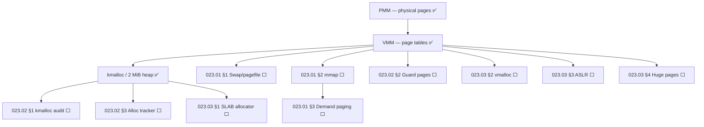

# TODO-023-Memory — Memory Management

> **Goal:** Track all kernel memory management: virtual memory (swap, mmap),
> allocation correctness auditing (guardrails), and advanced allocator features
> (SLAB, vmalloc, ASLR, huge pages, zero-copy). These three subsystems form
> the complete memory stack above PMM.

> [!NOTE]
> **Sub-files:**
> - [TODO-023.01-Virtual-Memory.md](TODO-023-Memory/TODO-023.01-Virtual-Memory.md) — Swap/pagefile, mmap, demand paging
> - [TODO-023.02-Guardrails.md](TODO-023-Memory/TODO-023.02-Guardrails.md) — Audit kmalloc usage, guard pages, heap canaries, leak detection
> - [TODO-023.03-Advanced.md](TODO-023-Memory/TODO-023.03-Advanced.md) — SLAB allocator, vmalloc, ASLR, huge pages, zero-copy, compressed memory

---

## Subsystem Status

| ⭐ | Subsystem                      | Sub-file   | Status            |
| -- | ------------------------------ | ---------- | ----------------- |
| 💎 | PMM (physical page allocator)  | kernel     | ✅ Done            |
| 💎 | VMM (page tables, mapping)     | kernel     | ✅ Done            |
| 💎 | kmalloc / 2 MiB heap           | kernel     | ✅ Done            |
| 💎 | Swap / pagefile                | 023.01 §1  | 🔄 In progress    |
| 💎 | Memory-mapped files (mmap)     | 023.01 §2  | ⬜ Not started     |
| 💎 | Demand paging                  | 023.01 §3  | ⬜ Not started     |
| 💎 | kmalloc audit & migration      | 023.02 §1  | ⬜ Not started     |
| 💎 | Guard pages & heap canaries    | 023.02 §2  | ⬜ Not started     |
| 💎 | Allocation tracker (debug)     | 023.02 §3  | ⬜ Not started     |
| 💎 | SLAB allocator                 | 023.03 §1  | ⬜ Not started     |
| 💎 | vmalloc (large kernel buffers) | 023.03 §2  | ⬜ Not started     |
| 💎 | ASLR                           | 023.03 §3  | ⬜ Not started     |
| 💎 | Huge pages (2 MB / 1 GB)       | 023.03 §4  | ⬜ Not started     |
| 💎 | Zero-copy buffers              | 023.03 §5  | ⬜ Not started     |
| 💎 | Compressed memory              | 023.03 §6  | ⬜ Not started     |

---

## Dependency Graph

### Phase-by-Phase Implementation Order

| Phase | Sections                                      | Depends On     | Status |
| :---: | --------------------------------------------- | -------------- | :----: |
| **0** | PMM, VMM, kmalloc (2 MiB heap)                | Bootloader     |   ✅   |
| **1** | 023.01 §1 Swap/pagefile                       | Phase 0        |  🔄    |
| **2** | 023.02 §1–3 Guardrails (audit, guard, tracker)| Phase 0        |   ⬜   |
| **3** | 023.01 §2–3 mmap + demand paging              | Phase 1        |   ⬜   |
| **4** | 023.03 §1 SLAB allocator                      | Phase 2        |   ⬜   |
| **5** | 023.03 §2 vmalloc                             | Phase 4        |   ⬜   |
| **6** | 023.03 §3–6 ASLR, huge pages, zero-copy, ...  | Phase 4–5      |   ⬜   |

> [!NOTE]
> **Phase 0** is complete — physical and virtual memory are operational.
>
> **Phase 1 (Swap)** is in progress — extends the kernel beyond physical RAM.
>
> **Phase 2 (Guardrails)** should run in parallel with Phase 3 — it validates
> that existing `kmalloc` usage is correct before SLAB replaces it.
>
> **Phase 4 (SLAB)** eliminates the 2 MiB heap ceiling — the single biggest
> allocator limitation today.

---

## Virtual Memory → [TODO-023.01](TODO-023-Memory/TODO-023.01-Virtual-Memory.md)

| Section | Description | Priority |
| ------- | ----------- | :------: |
| §1 Swap / pagefile     | Page eviction, swap file on IXFS, page fault handler | 🟠 P1 |
| §2 mmap                | `CreateFileMapping` / `MapViewOfFile` Win32 API       | 🟠 P1 |
| §3 Demand paging       | Lazy allocation — pages committed on first access     | 🟡 P2 |

---

## Memory Guardrails → [TODO-023.02](TODO-023-Memory/TODO-023.02-Guardrails.md)

| Section | Description | Priority |
| ------- | ----------- | :------: |
| §1 kmalloc audit       | Grep all callsites, migrate > 4 KB to `pmm_alloc_contiguous` | 🔴 P0 |
| §2 Guard pages         | Red-zone pages at stack/heap boundaries                       | 🟠 P1 |
| §3 Alloc tracker       | Debug-mode table: caller, size, free flag                     | 🟡 P2 |

---

## Advanced Memory → [TODO-023.03](TODO-023-Memory/TODO-023.03-Advanced.md)

| Section | Description | Priority |
| ------- | ----------- | :------: |
| §1 SLAB allocator       | Object caches, eliminates 2 MiB ceiling  | 🟠 P1 |
| §2 vmalloc              | Non-contiguous large kernel buffers      | 🟠 P1 |
| §3 ASLR                 | Randomize load addresses (security)      | 🟡 P2 |
| §4 Huge pages (2MB/1GB) | Reduce TLB pressure for large mappings  | 🟡 P2 |
| §5 Zero-copy            | DMA scatter-gather, no kernel copy       | 🟢 P3 |
| §6 Compressed memory    | zRAM-style swap compression              | 🟢 P3 |

---

## Priority Order

| Priority | Section / Reference               | Description                                              |
| -------- | --------------------------------- | -------------------------------------------------------- |
| 🔴 P0   | 023.02 §1 kmalloc audit           | Correctness — silent heap corruption today               |
| 🟠 P1   | 023.01 §1 Swap / pagefile         | Enables more processes than physical RAM                 |
| 🟠 P1   | 023.01 §2 mmap                    | Required by Win32 `CreateFileMapping`                    |
| 🟠 P1   | 023.03 §1 SLAB allocator          | Eliminates 2 MiB heap ceiling                            |
| 🟠 P1   | 023.03 §2 vmalloc                 | Large kernel buffers without physical contiguity         |
| 🟡 P2   | 023.01 §3 Demand paging           | Lazy allocation — standard for modern OS                 |
| 🟡 P2   | 023.02 §2 Guard pages             | Stack overflow and heap overflow detection               |
| 🟡 P2   | 023.03 §3 ASLR                    | Security — randomize kernel/user load addresses          |
| 🟡 P2   | 023.03 §4 Huge pages              | TLB reduction (see also 011-x86-64 §12.1)                |
| 🟢 P3   | 023.02 §3 Alloc tracker           | Debug tooling — memory leak detection                    |
| 🟢 P3   | 023.03 §5 Zero-copy               | DMA throughput — NVMe, NIC, GPU                          |
| 🟢 P3   | 023.03 §6 Compressed memory       | zRAM-style swap — low-RAM devices                        |
