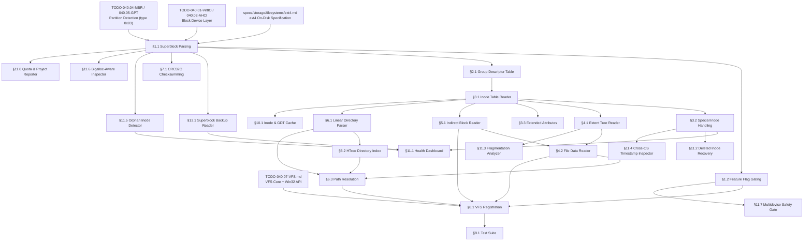

# 040.09-ext4 — Fourth Extended Filesystem (Read-Only Driver)

> **Goal:** Implement a read-only ext4 driver for Impossible OS. The driver must
> parse the Superblock, navigate Block Group Descriptors, read inodes from the
> Inode Table, traverse extent trees for data block mapping, enumerate directories
> (linear entries and HTree indexed), and handle the feature flag matrices for
> safe backward compatibility with ext2/ext3 volumes. This enables reading files
> from Linux partitions — essential for dual-boot interoperability and data recovery.

> [!CAUTION]
> **Memory Rule:** Use `pmm_alloc_contiguous()` for inode table reads, block group
> descriptor tables, extent tree blocks, and directory data blocks. `kmalloc` is
> ONLY for small kernel structs (≤ 4 KB). See `.agents/rules/coding.md` Known Gotchas.

> [!WARNING]
> **Read-Only First.** ext4 write support requires a fully functional JBD2
> journaling layer — writing without it causes irrecoverable corruption on crash.
> This TODO covers **read-only** access only. Write support is a future P3 extension.

> [!IMPORTANT]
> **Byte Order:** All ext4 on-disk structures are **little-endian**, EXCEPT the
> JBD2 journal which is **big-endian**. The driver must handle this dichotomy.
>
> **Spec Reference:** All offsets, field layouts, and algorithms reference the
> [ext4 Specification](file:///home/derickpayne/impossible-os/specs/storage/filesystems/ext4.md)
> in the repo at `specs/storage/filesystems/ext4.md`.

---

## TODO Completion Roadmap (Cross-File)

> [!IMPORTANT]
> **Four TODO files and one spec** feed into the ext4 driver. They have
> cross-dependencies that dictate implementation order. This roadmap shows
> the correct sequence — completing items out of order will cause rework.

### Dependency Graph

### Phase-by-Phase Implementation Order

| Phase  | TODO File / Spec              | Sections                    | What It Delivers                                                           | Depends On                          | Status |
| :----: | ----------------------------- | --------------------------- | -------------------------------------------------------------------------- | ----------------------------------- | :----: |
| **0**  | `specs/storage/filesystems/ext4.md`     | Full spec                   | On-disk format, offset tables, algorithms — **read before coding**         | —                                   |   ✅   |
| **0**  | `TODO-040.01` / `TODO-040.02` | Block device layer          | `blkdev_read()` via VirtIO or AHCI                                         | —                                   |   ✅   |
| **0**  | `TODO-040.04` / `TODO-040.05` | Partition detection         | MBR type `0x83` / GPT `0FC63DAF-...` → Linux partition found               | Phase 0 (block)                     |   ✅   |
| **1**  | `TODO-040.09-ext4.md`         | §1.1 Superblock Parsing     | Parse superblock at byte 1024, locate block groups and inodes              | Phase 0 (partitions)                |   ⬜   |
| **1**  | `TODO-040.09-ext4.md`         | §1.2 Feature Flag Gating    | Three-tier safety: incompat → reject, ro_compat → read-only, compat → ok  | Phase 1 (§1.1)                      |   ⬜   |
| **1**  | `TODO-040.09-ext4.md`         | §2.1 Group Descriptor Table | Read GDT — locate bitmaps and inode tables per block group                 | Phase 1 (§1.1)                      |   ⬜   |
| **2**  | `TODO-040.09-ext4.md`         | §3.1 Inode Table Reader     | Read any inode by number — metadata for every file on the volume           | Phase 1 (§2.1)                      |   ⬜   |
| **2**  | `TODO-040.09-ext4.md`         | §3.2 Special Inode Handling | Root directory (inode 2), journal detection, first user inode              | Phase 2 (§3.1)                      |   ⬜   |
| **2**  | `TODO-040.09-ext4.md`         | §4.1 Extent Tree Reader     | Logical → physical block mapping via extent header/entries                 | Phase 2 (§3.1)                      |   ⬜   |
| **3**  | `TODO-040.09-ext4.md`         | §4.2 File Data Reader       | Actually read file contents — extent + inline data + hole handling         | Phase 2 (§4.1)                      |   ⬜   |
| **3**  | `TODO-040.09-ext4.md`         | §6.1 Linear Dir Parser      | Walk `ext4_dir_entry_2` records in directory data blocks                   | Phase 2 (§3.1)                      |   ⬜   |
| **3**  | `TODO-040.09-ext4.md`         | §6.3 Path Resolution        | Full path traversal from root inode 2 — symlinks, case-fold               | Phase 3 (§4.2, §6.1)               |   ⬜   |
| **4**  | `TODO-040.09-ext4.md`         | §8.1 VFS Registration       | Mount ext4/ext3/ext2 volumes, wire `vfs_ops` callbacks                     | Phase 3 (§4.2, §6.3) + VFS (040.07) |   ⬜   |
| **5**  | `TODO-040.09-ext4.md`         | §5.1 Indirect Block Reader  | ext2/ext3 backward compat — triple indirect block chains                   | Phase 2 (§3.1)                      |   ⬜   |
| **5**  | `TODO-040.09-ext4.md`         | §6.2 HTree Directory Index  | Fast lookup in large directories via Half MD4/TEA hashing                  | Phase 3 (§6.1)                      |   ⬜   |
| **5**  | `TODO-040.09-ext4.md`         | §7.1 CRC32C Checksumming    | Validate metadata integrity — superblock, GDT, inodes, extents            | Phase 1 (§1.1)                      |   ⬜   |
| **5**  | `TODO-040.09-ext4.md`         | §3.3 Extended Attributes    | Read xattrs, POSIX ACLs, SELinux labels — inline + external block         | Phase 2 (§3.1)                      |   ⬜   |
| **5**  | `TODO-040.09-ext4.md`         | §10.1 Inode & GDT Cache     | LRU inode cache + pinned GDT — avoid redundant disk reads                 | Phase 2 (§3.1)                      |   ⬜   |
| **5**  | `TODO-040.09-ext4.md`         | §12.1 Superblock Backup     | Read sparse backups — survive primary corruption                           | Phase 1 (§1.1)                      |   ⬜   |
| **6**  | `TODO-040.09-ext4.md`         | §9.1 Test Suite             | Automated validation: ext4/ext3/ext2 images, HTree, symlinks, checksums   | Phase 4 (§8.1)                      |   ⬜   |
| **6**  | `TODO-040.09-ext4.md`         | §11.1 Health Dashboard      | **At-a-glance ext4 health** — surfaces Linux error telemetry nobody shows  | Phase 2 (§3.2) + §12.1             |   ⬜   |
| **6**  | `TODO-040.09-ext4.md`         | §11.2 Deleted Inode Recovery | **Built-in forensic recovery** — replaces unmaintained `extundelete`      | Phase 2 (§3.2)                      |   ⬜   |
| **6**  | `TODO-040.09-ext4.md`         | §11.3 Fragmentation Analyzer | **Visual block map** — shows extent fragmentation no OS displays          | Phase 2 (§4.1)                      |   ⬜   |
| **6**  | `TODO-040.09-ext4.md`         | §11.4 Timestamp Inspector   | **Cross-OS timestamp viewer** — nanosecond + creation time display         | Phase 2 (§3.2)                      |   ⬜   |
| **7**  | `TODO-040.09-ext4.md`         | §11.5 Orphan Inode Detector  | **Orphan inode forensics** — flag unresolved deletions in Health panel     | Phase 1 (§1.1)                      |   ⬜   |
| **7**  | `TODO-040.09-ext4.md`         | §11.6 Bigalloc Inspector     | **Cluster-aware space reporting** — bigalloc transparency in Disk Manager | Phase 1 (§1.1)                      |   ⬜   |
| **7**  | `TODO-040.09-ext4.md`         | §11.7 Multidevice Safety     | **MMP & journal device detection** — prevent dual-mount corruption        | Phase 1 (§1.2)                      |   ⬜   |
| **7**  | `TODO-040.09-ext4.md`         | §11.8 Quota Reporter         | **Visual quota dashboard** — per-user/group/project usage charts          | Phase 1 (§1.1)                      |   ⬜   |

> [!NOTE]
> **Phases 0–1** are prerequisites — block I/O, partition tables, superblock, and GDT reading.
> **Phase 2** is the cornerstone — the inode reader, special inodes, and extent tree decoder
> unlock everything else. Get these right and the rest flows naturally.
> **Phases 3–4** build up file reading, directory parsing, path resolution, and VFS integration —
> this gives you a mountable, browsable ext4 volume.
> **Phase 5** adds robustness and performance (ext2/ext3 compat, HTree, CRC32C, xattrs, caching,
> superblock backup reading).
> **Phase 6** delivers the core competitive features (⭐): Health Dashboard, Deleted Inode Recovery,
> Fragmentation Analyzer, and Cross-OS Timestamp Inspector.
> **Phase 7** delivers enterprise-grade exclusive features (⭐): Orphan Inode Detector, Bigalloc
> Inspector, Multidevice Safety Gate, and Quota & Project Reporter.

> [!TIP]
> **Quick wins after Phase 2:**
> - §3.2 Special Inode Handling is trivial — just define constants and validate inode 2 is a
>   directory. Fast to implement once the inode reader works.
> - §10.1 Inode & GDT Cache can be added at any time after §3.1 for an immediate performance
>   boost during development (fewer disk reads while debugging directory traversal).
>
> **Critical gotcha:** §1.2 Feature Flag Gating is **non-negotiable**. Without it, the driver
> will attempt to mount volumes with unsupported incompat features (encryption, journal replay
> required) and silently produce garbage data. **Always check incompat flags before proceeding.**
>
> **ext2/ext3 backward compat:** The same `0xEF53` magic covers ext2, ext3, and ext4. The only
> difference is feature flags — no `INCOMPAT_EXTENTS` means indirect blocks (§5.1), no
> `COMPAT_HAS_JOURNAL` means ext2. The inode reader and GDT reader are identical across all three.
> Phase 5 adds indirect block support so you can mount older volumes, but it's not needed for
> modern ext4 (which always has extents).
>
> **Memory rule reminder:** The GDT for a 256 GB ext4 volume is only ~64 KB — cache it entirely
> at mount time via `pmm_alloc_contiguous()`. Inode table reads are per-block-group and can be
> much larger — always use PMM, never `kmalloc()`.
>
> **CRC32C reuse:** The IXFS driver already has a working `ixfs_crc32c()` in
> `src/kernel/fs/ixfs/ixfs_core.c` using the Castagnoli polynomial `0x82F63B78`. Factor it out
> to a shared `kernel/crc32c.c` so ext4 can reuse it — same polynomial, same algorithm.

---

## 1. Superblock Parsing & Validation

### 1.1 Superblock Reader

**Prompt:** Read the Superblock from absolute byte offset 1024 of the partition (NOT block 0 — the first 1024 bytes are reserved boot padding). Validate the magic number `0xEF53` at offset `0x38`. Extract all critical fields: inode count, block count, block size (`1024 << s_log_block_size`), blocks per group, inodes per group, inode size, feature flags, UUID, and volume name. Handle 64-bit block counts by combining `s_blocks_count_lo` + `s_blocks_count_hi`. After completing all items, mark every item as `[x]`, update this prompt to a verification prompt, run `bash scripts/build.sh clean`, and commit as `"ext4: superblock parsing and validation"`. Add notes directly in this TODO section. After implementation, save any gotchas, solutions, and important information to MCP memory (`mcp_memory_create_entities` / `mcp_memory_add_observations`).

- [ ] Read 1024 bytes from partition byte offset 1024 (skip boot padding)
- [ ] Validate magic number at `0x38`: must be `0xEF53` (LE stored as `0x53 0xEF`)
- [ ] Extract fundamental fields:
  - [ ] `s_inodes_count` at `0x00` (4B) — total inodes on volume
  - [ ] `s_blocks_count_lo` at `0x04` (4B) — total blocks (lower 32 bits)
  - [ ] `s_free_blocks_count_lo` at `0x0C` (4B) — free blocks (lower)
  - [ ] `s_free_inodes_count` at `0x10` (4B) — free inodes
  - [ ] `s_first_data_block` at `0x14` (4B) — 0 for 4K blocks, 1 for 1K blocks
  - [ ] `s_log_block_size` at `0x18` (4B) — block_size = `1024 << value`
  - [ ] `s_blocks_per_group` at `0x20` (4B) — blocks per block group
  - [ ] `s_inodes_per_group` at `0x28` (4B) — inodes per block group
  - [ ] `s_magic` at `0x38` (2B) — must be `0xEF53`
  - [ ] `s_state` at `0x3A` (2B) — 1=clean, 2=errors, 4=orphan recovery
  - [ ] `s_rev_level` at `0x4C` (4B) — 0=original, 1=dynamic inodes
- [ ] Extract extended fields (revision 1+):
  - [ ] `s_first_ino` at `0x54` (4B) — first non-reserved inode (usually 11)
  - [ ] `s_inode_size` at `0x58` (2B) — 128 (ext2/ext3) or 256 (ext4)
  - [ ] `s_feature_compat` at `0x5C` (4B) — compatible feature flags
  - [ ] `s_feature_incompat` at `0x60` (4B) — **incompatible** feature flags
  - [ ] `s_feature_ro_compat` at `0x64` (4B) — read-only compatible flags
  - [ ] `s_uuid` at `0x68` (16B) — filesystem UUID
  - [ ] `s_volume_name` at `0x78` (16B) — volume label (null-terminated)
  - [ ] `s_desc_size` at `0xFE` (2B) — group descriptor size (32 or 64)
- [ ] 64-bit block counts: combine `s_blocks_count_lo` + `s_blocks_count_hi` (at `0x150`)
- [ ] Calculate: `block_size = 1024 << s_log_block_size`
- [ ] Calculate: `num_block_groups = (total_blocks + blocks_per_group - 1) / blocks_per_group`
- [ ] Log: `[ext4] Volume: %llu blocks, block_size=%u, %u groups, inode_size=%u`
- [ ] Log: `[ext4] UUID=%s, label='%s', state=%s`
- [ ] Commit: `"ext4: superblock parsing and validation"`

### 1.2 Feature Flag Gating

**Prompt:** Implement the three-tier feature flag system. If ANY bit in `s_feature_incompat` is set that the driver does not support, the mount MUST be rejected — proceeding causes data corruption. If unrecognized `s_feature_ro_compat` bits are set, mount as read-only (which is our default anyway). Compatible features can be safely ignored. Log all detected features. After completing all items, mark every item as `[x]`, update this prompt to a verification prompt, run `bash scripts/build.sh clean`, and commit as `"ext4: feature flag gating"`. Add notes directly in this TODO section. After implementation, save any gotchas, solutions, and important information to MCP memory (`mcp_memory_create_entities` / `mcp_memory_add_observations`).

- [ ] Parse `s_feature_incompat` — must support these to mount:
  - [ ] `INCOMPAT_FILETYPE` (`0x0002`) — dir entries have file type byte
  - [ ] `INCOMPAT_EXTENTS` (`0x0040`) — extent-based allocation (mandatory for ext4)
  - [ ] `INCOMPAT_64BIT` (`0x0080`) — 64-bit block numbers
  - [ ] `INCOMPAT_FLEX_BG` (`0x0200`) — flexible block groups
  - [ ] `INCOMPAT_INLINE_DATA` (`0x8000`) — small files store data in `i_block` (optional support)
- [ ] Reject mount if any UNSUPPORTED incompat bits are set:
  - [ ] `INCOMPAT_RECOVER` (`0x0004`) — needs journal replay (we don't support)
  - [ ] `INCOMPAT_JOURNAL_DEV` (`0x0008`) — external journal device (not a data volume)
  - [ ] `INCOMPAT_META_BG` (`0x0010`) — meta block group layout (rare, advanced)
  - [ ] `INCOMPAT_MMP` (`0x0100`) — multi-mount protection lock
  - [ ] `INCOMPAT_EA_INODE` (`0x0400`) — xattrs in dedicated inodes
  - [ ] `INCOMPAT_DIRDATA` (`0x1000`) — directory entries with extra data
  - [ ] `INCOMPAT_CSUM_SEED` (`0x2000`) — checksum seed in superblock (support if `METADATA_CSUM`)
  - [ ] `INCOMPAT_LARGEDIR` (`0x4000`) — 3-level HTree directories
  - [ ] `INCOMPAT_ENCRYPT` (`0x10000`) — encrypted inodes
  - [ ] `INCOMPAT_CASEFOLD` (`0x20000`) — case-insensitive lookups
  - [ ] Any other unknown bits → reject
  - [ ] Log: `[ext4] FATAL: Unsupported incompat features: 0x%08X — refusing mount`
- [ ] Parse `s_feature_ro_compat` — mount read-only if unrecognized bits present:
  - [ ] `RO_COMPAT_SPARSE_SUPER` (`0x0001`) — sparse superblock backups
  - [ ] `RO_COMPAT_LARGE_FILE` (`0x0002`) — files > 2 GiB
  - [ ] `RO_COMPAT_HUGE_FILE` (`0x0008`) — block counts in FS units
  - [ ] `RO_COMPAT_GDT_CSUM` (`0x0010`) — group descriptor checksums (ext3-style CRC16)
  - [ ] `RO_COMPAT_DIR_NLINK` (`0x0020`) — directories with > 65000 subdirectories
  - [ ] `RO_COMPAT_EXTRA_ISIZE` (`0x0040`) — extended inode fields
  - [ ] `RO_COMPAT_QUOTA` (`0x0100`) — quota support
  - [ ] `RO_COMPAT_BIGALLOC` (`0x0200`) — bitmap tracks clusters, not blocks
  - [ ] `RO_COMPAT_METADATA_CSUM` (`0x0400`) — CRC32C checksumming
  - [ ] `RO_COMPAT_PROJECT` (`0x2000`) — project quota support
  - [ ] `RO_COMPAT_VERITY` (`0x8000`) — fs-verity protected files
- [ ] Parse `s_feature_compat` — log for informational purposes:
  - [ ] `COMPAT_HAS_JOURNAL` (`0x0004`) — has JBD2 journal
  - [ ] `COMPAT_EXT_ATTR` (`0x0008`) — extended attributes supported
  - [ ] `COMPAT_RESIZE_INODE` (`0x0010`) — online resize reserved GDT blocks
  - [ ] `COMPAT_DIR_INDEX` (`0x0020`) — HTree directory indexing
  - [ ] `COMPAT_ORPHAN_FILE` (`0x1000`) — orphan file for tracking orphaned inodes
- [ ] Log all detected features: `[ext4] Features: incompat=0x%X, ro_compat=0x%X, compat=0x%X`
- [ ] Commit: `"ext4: feature flag gating"`

---

## 2. Block Group Descriptors

### 2.1 Group Descriptor Table Reader

**Prompt:** Read the Group Descriptor Table (GDT) from the block(s) immediately following the Superblock. Each descriptor is 32 bytes (ext2/ext3) or 64 bytes (ext4 with `INCOMPAT_64BIT`, size in `s_desc_size`). The GDT contains one entry per block group, providing the locations of the block bitmap, inode bitmap, and inode table for each group. Handle 64-bit mode by combining `_lo` and `_hi` fields. After completing all items, mark every item as `[x]`, update this prompt to a verification prompt, run `bash scripts/build.sh clean`, and commit as `"ext4: block group descriptor table"`. Add notes directly in this TODO section. After implementation, save any gotchas, solutions, and important information to MCP memory (`mcp_memory_create_entities` / `mcp_memory_add_observations`).

- [ ] Calculate GDT location: block after Superblock
  - [ ] 1K block size: GDT starts at block 2
  - [ ] 4K block size: GDT starts at block 1 (Superblock is at byte 1024 within block 0)
- [ ] Calculate GDT size: `num_block_groups × s_desc_size` bytes
- [ ] Allocate buffer via `pmm_alloc_contiguous()` for entire GDT
- [ ] Read all GDT blocks from disk
- [ ] Parse each group descriptor:
  - [ ] `bg_block_bitmap_lo` at `0x00` (4B) + `bg_block_bitmap_hi` at `0x20` (4B)
  - [ ] `bg_inode_bitmap_lo` at `0x04` (4B) + `bg_inode_bitmap_hi` at `0x24` (4B)
  - [ ] `bg_inode_table_lo` at `0x08` (4B) + `bg_inode_table_hi` at `0x28` (4B)
  - [ ] `bg_free_blocks_count_lo` at `0x0C` (2B) + `bg_free_blocks_count_hi` at `0x2C` (2B)
  - [ ] `bg_free_inodes_count_lo` at `0x0E` (2B) + `bg_free_inodes_count_hi` at `0x2E` (2B)
  - [ ] `bg_checksum` at `0x1E` (2B) — validate if `METADATA_CSUM` enabled
- [ ] Combine `_lo` + `_hi` into 64-bit values when `INCOMPAT_64BIT` is set
- [ ] Handle `flex_bg`: metadata relocated to first group in flex sequence
- [ ] Cache parsed descriptors in `struct ext4_volume`
- [ ] Log: `[ext4] Group %u: bitmap=%llu, inode_table=%llu, free=%u blocks, %u inodes`
- [ ] Commit: `"ext4: block group descriptor table"`

---

## 3. Inode Reading & Metadata

### 3.1 Inode Table Reader

**Prompt:** Implement reading a single inode by its inode number. ext4 inodes are numbered starting at 1 (not 0). Calculate the block group: `(inode - 1) / s_inodes_per_group`. Calculate the local index: `(inode - 1) % s_inodes_per_group`. Read the inode from the inode table at byte offset `local_index × s_inode_size` from the `bg_inode_table` block. Parse the core 128-byte inode fields and the extended 256-byte fields if the inode size supports them. After completing all items, mark every item as `[x]`, update this prompt to a verification prompt, run `bash scripts/build.sh clean`, and commit as `"ext4: inode table reader"`. Add notes directly in this TODO section. After implementation, save any gotchas, solutions, and important information to MCP memory (`mcp_memory_create_entities` / `mcp_memory_add_observations`).

- [ ] Implement `ext4_read_inode(vol, inode_number, inode_out)`:
  - [ ] Calculate `block_group = (inode_number - 1) / vol->inodes_per_group`
  - [ ] Calculate `local_index = (inode_number - 1) % vol->inodes_per_group`
  - [ ] Look up `inode_table_block` from group descriptor `block_group`
  - [ ] Calculate byte offset within table: `local_index × vol->inode_size`
  - [ ] Read the inode from disk (may need to read surrounding block)
- [ ] Parse core inode fields (128 bytes):
  - [ ] `i_mode` at `0x00` (2B) — file type (upper 4 bits) + permissions (lower 12)
  - [ ] `i_uid` at `0x02` (2B) — owner UID (lower 16)
  - [ ] `i_size_lo` at `0x04` (4B) — file size (lower 32)
  - [ ] `i_atime` at `0x08` (4B) — last access time (POSIX seconds)
  - [ ] `i_ctime` at `0x0C` (4B) — inode change time
  - [ ] `i_mtime` at `0x10` (4B) — last modification time
  - [ ] `i_gid` at `0x18` (2B) — group ID (lower 16)
  - [ ] `i_links_count` at `0x1A` (2B) — hard link count
  - [ ] `i_blocks_lo` at `0x1C` (4B) — block count (in 512B units, or FS units if `HUGE_FILE`)
  - [ ] `i_flags` at `0x20` (4B) — inode flags (extents, inline, etc.)
  - [ ] `i_block[15]` at `0x28` (60B) — extent tree root OR indirect blocks
  - [ ] `i_size_high` at `0x6C` (4B) — file size (upper 32, for 64-bit size)
- [ ] Parse extended fields (256-byte inode, offset `0x80`+):
  - [ ] `i_extra_isize` at `0x80` (2B)
  - [ ] `i_crtime` at `0x90` (4B) — file creation time
  - [ ] Nanosecond extensions at `0x84`–`0x94`
- [ ] File type extraction from `i_mode` upper 4 bits:
  - [ ] `0x4` = directory, `0x8` = regular file, `0xA` = symlink, `0x6` = block dev, etc.
- [ ] Combine `i_size_lo` + `i_size_high` for 64-bit file size
- [ ] Log: `[ext4] Inode %u: mode=0x%04X, size=%llu, links=%u, flags=0x%08X`
- [ ] Commit: `"ext4: inode table reader"`

### 3.2 Special Inode Handling

**Prompt:** Define and handle the reserved inodes. Inode 2 is the root directory — all path resolution starts here. Inode 8 is the JBD2 journal file (read its inode but don't replay — we're read-only). Inodes 1–10 are reserved system inodes. The first user inode is `s_first_ino` (typically 11, traditionally `lost+found`). After completing all items, mark every item as `[x]`, update this prompt to a verification prompt, run `bash scripts/build.sh clean`, and commit as `"ext4: special inode handling"`. Add notes directly in this TODO section. After implementation, save any gotchas, solutions, and important information to MCP memory (`mcp_memory_create_entities` / `mcp_memory_add_observations`).

- [ ] Define reserved inode constants:
  - [ ] `EXT4_ROOT_INO = 2` — root directory
  - [ ] `EXT4_JOURNAL_INO = 8` — JBD2 journal
  - [ ] `EXT4_FIRST_INO = s_first_ino` — first non-reserved (typically 11)
- [ ] On mount: read inode 2 (root directory) to verify it's a directory (`i_mode & 0xF000 == 0x4000`)
- [ ] Detect journal: if `COMPAT_HAS_JOURNAL` flag set, note inode 8 exists
  - [ ] Log: `[ext4] Journal at inode 8 (read-only driver — not replaying)`
  - [ ] If `INCOMPAT_RECOVER` set → refuse mount (journal replay required)
- [ ] Commit: `"ext4: special inode handling"`

### 3.3 Extended Attributes (xattr) Reader

**Prompt:** ext4 stores extended attributes in two places: inline within the inode's extra space (after the core 128 bytes, before `i_extra_isize` ends), and in an external xattr block pointed to by `i_file_acl_lo`. Linux uses xattrs extensively: `security.selinux` for SELinux labels, `system.posix_acl_access` for POSIX ACLs, `user.*` for arbitrary metadata. Parse the xattr header (magic `0xEA020000`), walk entries (name_index + name + value offset), and return values for queried names. This is needed for reading POSIX ACLs and for the VFS compat layer's `GetFileSecurity()`. After completing all items, mark every item as `[x]`, update this prompt to a verification prompt, run `bash scripts/build.sh clean`, and commit as `"ext4: extended attributes reader"`. Add notes directly in this TODO section. After implementation, save any gotchas, solutions, and important information to MCP memory (`mcp_memory_create_entities` / `mcp_memory_add_observations`).

- [ ] Parse inline xattrs (within inode body):
  - [ ] Start at `inode_base + EXT4_GOOD_OLD_INODE_SIZE + i_extra_isize`
  - [ ] Walk entries until end of inode (offset `s_inode_size`)
  - [ ] Each entry: `name_index` (1B), `name_len` (1B), `value_offset` (2B), `value_inum` (4B), `value_size` (4B), `hash` (4B), name (`name_len` bytes)
- [ ] Parse external xattr block:
  - [ ] Read block at `i_file_acl_lo` (combine with `i_file_acl_high` for 64-bit)
  - [ ] Validate magic `0xEA020000` at block start
  - [ ] Walk entries (same format as inline)
  - [ ] Values stored at end of block, growing downward
- [ ] Name index → namespace mapping:
  - [ ] 1 = `user.`, 2 = `system.posix_acl_access`, 3 = `system.posix_acl_default`
  - [ ] 4 = `trusted.`, 6 = `security.`, 7 = `system.`
- [ ] Implement `ext4_get_xattr(vol, inode, name_index, name, value_buf, buf_size)`
- [ ] Implement `ext4_list_xattrs(vol, inode, callback)` — enumerate all xattrs
- [ ] Parse POSIX ACL from `system.posix_acl_access` xattr:
  - [ ] Version (4B, must be 2), entries: tag (2B), perm (2B), id (4B)
  - [ ] Expose via `vfs_ops.get_security()` for VFS compat layer
- [ ] Commit: `"ext4: extended attributes reader"`

---

## 4. Extent Tree Traversal

### 4.1 Extent Tree Reader

**Prompt:** Implement the extent tree decoder for data block mapping. The extent tree root lives in the inode's `i_block[0..14]` (60 bytes). It starts with a 12-byte header: magic `0xF30A`, entry count, max entries, depth. At depth 0 (leaf): entries are `ext4_extent` structs mapping logical blocks to physical blocks. At depth > 0 (internal): entries are `ext4_extent_idx` structs pointing to child tree blocks. Handle uninitialized extents (bit 15 of `ee_len` set — preallocated, reads return zeros). After completing all items, mark every item as `[x]`, update this prompt to a verification prompt, run `bash scripts/build.sh clean`, and commit as `"ext4: extent tree reader"`. Add notes directly in this TODO section. After implementation, save any gotchas, solutions, and important information to MCP memory (`mcp_memory_create_entities` / `mcp_memory_add_observations`).

- [ ] Parse extent header from inode's `i_block[0..11]`:
  - [ ] `eh_magic` (2B) — must be `0xF30A`
  - [ ] `eh_entries` (2B) — number of valid entries
  - [ ] `eh_max` (2B) — maximum capacity
  - [ ] `eh_depth` (2B) — 0=leaf, >0=internal node
  - [ ] `eh_generation` (4B) — for checksumming
- [ ] If `eh_depth == 0` (leaf node) — parse `ext4_extent` entries (12 bytes each):
  - [ ] `ee_block` (4B) — first logical block this extent covers
  - [ ] `ee_len` (2B) — length in blocks (max 32768)
    - [ ] If bit 15 set → uninitialized extent, length = `ee_len - 32768`, reads return zeros
  - [ ] `ee_start_hi` (2B) + `ee_start_lo` (4B) → 48-bit physical block number
- [ ] If `eh_depth > 0` (internal node) — parse `ext4_extent_idx` entries (12 bytes each):
  - [ ] `ei_block` (4B) — first logical block this index covers
  - [ ] `ei_leaf_lo` (4B) + `ei_leaf_hi` (2B) → 48-bit physical block of child node
  - [ ] Read child block from disk, parse its extent header, recurse
- [ ] Implement `ext4_extent_lookup(vol, inode, logical_block)`:
  - [ ] Binary search entries for the extent/index covering `logical_block`
  - [ ] If leaf → return `physical = ee_start + (logical_block - ee_block)`
  - [ ] If index → read child block, recurse
- [ ] Cache all leaf extents on file open for O(1) lookups
- [ ] Handle extent tail checksum (`ext4_extent_tail`) if `METADATA_CSUM` enabled
- [ ] Log: `[ext4] Extent: logical=%u → physical=%llu, len=%u`
- [ ] Commit: `"ext4: extent tree reader"`

### 4.2 File Data Reader

**Prompt:** Using the extent tree, implement reading file data by logical block range. Given a file offset and read length, convert to logical blocks, look up extents, translate to physical blocks, read from disk. Handle reads spanning multiple extents. Handle uninitialized extents by returning zero-filled buffers. Cap reads at `i_size` (actual file length). After completing all items, mark every item as `[x]`, update this prompt to a verification prompt, run `bash scripts/build.sh clean`, and commit as `"ext4: file data reader"`. Add notes directly in this TODO section. After implementation, save any gotchas, solutions, and important information to MCP memory (`mcp_memory_create_entities` / `mcp_memory_add_observations`).

- [ ] Implement `ext4_read_data(vol, inode, offset, length, buffer)`:
  - [ ] Calculate starting logical block: `offset / block_size`
  - [ ] Calculate offset within block: `offset % block_size`
  - [ ] For each logical block in the read range:
    - [ ] Look up extent via `ext4_extent_lookup()`
    - [ ] If uninitialized → fill buffer with zeros
    - [ ] If hole (no extent covering this block) → fill with zeros
    - [ ] Else → read physical block from disk
  - [ ] Handle partial block reads at start/end
  - [ ] Cap total read at `i_size` (don't read beyond file end)
- [ ] Handle inline data: if `EXT4_INLINE_DATA_FL` set, data is in `i_block` (60 bytes)
  - [ ] Copy directly from `i_block` array, cap at 60 bytes
- [ ] Commit: `"ext4: file data reader"`

---

## 5. Legacy Indirect Block Map (ext2/ext3 Compatibility)

### 5.1 Indirect Block Reader

**Prompt:** For ext2/ext3 volumes (or ext4 inodes without `EXT4_EXTENTS_FL`), the `i_block[15]` array uses the classic indirect block scheme: indices 0–11 are direct block pointers, index 12 is a single indirect, index 13 is double indirect, index 14 is triple indirect. Each indirect block is a full filesystem block containing `block_size / 4` 32-bit block pointers. Implement this for backward compatibility so the driver can mount ext2 and ext3 volumes. After completing all items, mark every item as `[x]`, update this prompt to a verification prompt, run `bash scripts/build.sh clean`, and commit as `"ext4: legacy indirect block reader"`. Add notes directly in this TODO section. After implementation, save any gotchas, solutions, and important information to MCP memory (`mcp_memory_create_entities` / `mcp_memory_add_observations`).

- [ ] Detect: if `EXT4_EXTENTS_FL` NOT set in `i_flags` → use indirect blocks
- [ ] Direct blocks: `i_block[0]` through `i_block[11]` → physical block numbers
- [ ] Single indirect: `i_block[12]` → read block, it contains `block_size/4` direct pointers
- [ ] Double indirect: `i_block[13]` → read block of single-indirect pointers
- [ ] Triple indirect: `i_block[14]` → read block of double-indirect pointers
- [ ] Block number 0 means "hole" — return zero-filled buffer
- [ ] Implement `ext4_indirect_lookup(vol, inode, logical_block)`:
  - [ ] If `logical_block < 12` → return `i_block[logical_block]`
  - [ ] Else calculate indirect depth and navigate pointer chain
- [ ] Cache indirect blocks to avoid redundant reads
- [ ] Commit: `"ext4: legacy indirect block reader"`

---

## 6. Directory Reading

### 6.1 Linear Directory Entry Parser

**Prompt:** ext4 directories store entries as `ext4_dir_entry_2` records in their data blocks. Each entry: inode number (4B), record length (2B), name length (1B), file type (1B), name (variable, NOT null-terminated). Entries are 4-byte aligned. The final entry's `rec_len` extends to the end of the block. Deleted entries have `inode == 0`. Walk entries by advancing `rec_len` bytes. After completing all items, mark every item as `[x]`, update this prompt to a verification prompt, run `bash scripts/build.sh clean`, and commit as `"ext4: linear directory entry parser"`. Add notes directly in this TODO section. After implementation, save any gotchas, solutions, and important information to MCP memory (`mcp_memory_create_entities` / `mcp_memory_add_observations`).

- [ ] Implement `ext4_readdir_block(vol, block_data, block_size, callback)`:
  - [ ] Start at offset 0
  - [ ] While offset < block_size:
    - [ ] Read `inode` (4B), `rec_len` (2B), `name_len` (1B), `file_type` (1B)
    - [ ] If `inode != 0` → valid entry, invoke callback with name + inode + type
    - [ ] If `inode == 0` → deleted entry, skip
    - [ ] Advance by `rec_len`
    - [ ] Safety: if `rec_len == 0` or `rec_len < 8` → break (corrupt)
- [ ] File type codes (from `INCOMPAT_FILETYPE`):
  - [ ] 1 = regular, 2 = directory, 3 = chardev, 4 = blockdev, 5 = FIFO, 6 = socket, 7 = symlink
- [ ] Name is NOT null-terminated — use `name_len` to determine length
- [ ] Handle: `"."` (self) and `".."` (parent) entries (always first two entries)
- [ ] Commit: `"ext4: linear directory entry parser"`

### 6.2 HTree Directory Index

**Prompt:** For large directories with `EXT4_INDEX_FL` set, ext4 uses HTree (Hash Tree) indexing. The first data block contains a fake `dx_root` header (for ext2 backward compat), followed by the hash version, tree depth, and an array of `dx_entry` pairs (hash, block). To look up a filename: hash the name using the specified algorithm (typically Half MD4), binary search the `dx_entry` array, read the referenced leaf block, then linear-scan `ext4_dir_entry_2` entries. After completing all items, mark every item as `[x]`, update this prompt to a verification prompt, run `bash scripts/build.sh clean`, and commit as `"ext4: HTree directory index"`. Add notes directly in this TODO section. After implementation, save any gotchas, solutions, and important information to MCP memory (`mcp_memory_create_entities` / `mcp_memory_add_observations`).

- [ ] Detect HTree: check `EXT4_INDEX_FL` (`0x1000`) in directory inode's `i_flags`
- [ ] Parse `dx_root` from first data block:
  - [ ] Skip fake `.` and `..` entries at `0x00`–`0x17`
  - [ ] Hash version at `0x18` (1B): 0=legacy, 1=half_md4, 2=tea, 3=half_md4_unsigned, 4=tea_unsigned
  - [ ] Tree depth at `0x1A` (1B): number of indirect levels
  - [ ] Limit at `0x1C` (2B): max `dx_entry` count
  - [ ] Count at `0x1E` (2B): active `dx_entry` count
  - [ ] `dx_entry` array starting at `0x20`: each is 8 bytes (hash 4B + block 4B)
- [ ] Implement Half MD4 hash function (unsigned variant for ext4):
  - [ ] Hash the target filename to a 32-bit value
- [ ] Directory lookup:
  - [ ] Hash the filename
  - [ ] Binary search `dx_entry` array for the bounding hash range
  - [ ] Read the referenced leaf data block
  - [ ] Linear scan `ext4_dir_entry_2` entries for exact filename match
- [ ] Fallback: if directory does NOT have `EXT4_INDEX_FL` → use linear scan only
- [ ] Commit: `"ext4: HTree directory index"`

### 6.3 Path Resolution

**Prompt:** Implement full path resolution by splitting the path on `/`, starting at inode 2 (root directory), and recursively looking up each component. For each component, search the directory's data blocks (HTree or linear). Handle symlinks: read `i_block` directly for short symlinks (target fits in 60 bytes), or read data blocks for long symlinks. After completing all items, mark every item as `[x]`, update this prompt to a verification prompt, run `bash scripts/build.sh clean`, and commit as `"ext4: path resolution"`. Add notes directly in this TODO section. After implementation, save any gotchas, solutions, and important information to MCP memory (`mcp_memory_create_entities` / `mcp_memory_add_observations`).

- [ ] Implement `ext4_resolve_path(vol, path)`:
  - [ ] Start at inode 2 (root directory)
  - [ ] Split path by `/`
  - [ ] For each component:
    - [ ] Read directory data for current inode
    - [ ] Search for component name (HTree if indexed, linear otherwise)
    - [ ] If found → current inode = entry's inode number, continue
    - [ ] If not found → return `EXT4_ERR_NOT_FOUND`
  - [ ] Return final inode
- [ ] Handle symlinks (`i_mode & 0xF000 == 0xA000`):
  - [ ] Short symlink: target stored directly in `i_block` (if `i_size < 60`)
  - [ ] Long symlink: read data blocks for target path
  - [ ] Recursion limit: max 8 symlink follows (prevent loops)
- [ ] Case sensitivity: ext4 is case-sensitive by default (unlike NTFS/FAT32)
  - [ ] If `INCOMPAT_CASEFOLD` set on directory → case-insensitive comparison
- [ ] Commit: `"ext4: path resolution"`

---

## 7. Metadata Checksumming (CRC32C)

### 7.1 CRC32C Validation

**Prompt:** When `RO_COMPAT_METADATA_CSUM` is enabled, all metadata structures carry CRC32C checksums. The seed is derived from the filesystem UUID (or `s_checksum_seed` if `INCOMPAT_CSUM_SEED` is set). Validate checksums on: Superblock, group descriptors, inodes, directory blocks (dx_tail), extent blocks (extent_tail). On checksum failure, log error and flag the structure as corrupt — do not silently proceed. After completing all items, mark every item as `[x]`, update this prompt to a verification prompt, run `bash scripts/build.sh clean`, and commit as `"ext4: CRC32C metadata checksumming"`. Add notes directly in this TODO section. After implementation, save any gotchas, solutions, and important information to MCP memory (`mcp_memory_create_entities` / `mcp_memory_add_observations`).

- [ ] Implement `ext4_crc32c(seed, data, length)` — CRC32C (Castagnoli polynomial `0x1EDC6F41`)
  - [ ] Use reflected table approach (similar to `gpt_crc32` but different polynomial)
  - [ ] Or use hardware `CRC32C` instruction if available (`__builtin_ia32_crc32`)
- [ ] Calculate checksum seed:
  - [ ] If `INCOMPAT_CSUM_SEED` → seed = `s_checksum_seed` at offset `0x190`
  - [ ] Else → seed = `crc32c(~0, s_uuid, 16)`
- [ ] Validate checksummed structures:
  - [ ] Superblock: `s_checksum` at offset `0xFC` — zero field, compute, compare
  - [ ] Group descriptor: `bg_checksum` — uses UUID + group number + descriptor data
  - [ ] Inode: `i_checksum_lo` (at core offset) + `i_checksum_hi` (extended)
  - [ ] Extent block: `ext4_extent_tail` — last 4 bytes of block
  - [ ] Directory block: `dx_tail` — if HTree indexed
- [ ] On checksum failure: log `[ext4] CHECKSUM FAILED: %s at block %llu`
- [ ] Optional: make checksum verification configurable (skip for performance during bulk reads)
- [ ] Commit: `"ext4: CRC32C metadata checksumming"`

---

## 8. VFS Integration

### 8.1 ext4 VFS Driver Registration

**Prompt:** Register ext4 as a VFS filesystem driver. Implement the `vfs_ops` callbacks: `open`, `close`, `read`, `readdir`, `finddir`, `stat`. Write callbacks return `-EROFS`. Detect ext4/ext3/ext2 volumes during partition scanning by checking the magic `0xEF53` in the boot sector at byte offset 1080 from partition start. Support mounting ext2 and ext3 volumes (they use the same magic) — handle based on feature flags. After completing all items, mark every item as `[x]`, update this prompt to a verification prompt, run `bash scripts/build.sh clean`, and commit as `"ext4: VFS driver registration"`. Add notes directly in this TODO section. After implementation, save any gotchas, solutions, and important information to MCP memory (`mcp_memory_create_entities` / `mcp_memory_add_observations`).

- [ ] Create `src/kernel/fs/ext4.c` and `include/kernel/fs/ext4.h`
- [ ] Define `struct ext4_volume` — superblock data, GDT, config
- [ ] Implement `ext4_detect(blkdev)`:
  - [ ] Read 2 sectors from partition start
  - [ ] Check magic `0xEF53` at byte offset 1080 (partition offset 1024 + superblock offset 0x38)
- [ ] Register with partition scanner:
  - [ ] MBR type `0x83` (Linux native)
  - [ ] GPT GUID `0FC63DAF-8483-4772-8E79-3D69D8477DE4` (Linux filesystem)
- [ ] Implement `vfs_ops` callbacks (must match `struct vfs_ops` in `include/kernel/fs/vfs.h`):
  - [ ] `ext4_open(node, flags)` — read inode, cache extent tree
  - [ ] `ext4_close(node)` — free cached extents
  - [ ] `ext4_read(node, offset, size, buf)` — extent/indirect read
  - [ ] `ext4_readdir(node, index)` — directory enumeration
  - [ ] `ext4_finddir(node, name)` — directory lookup (HTree or linear)
  - [ ] `ext4_stat(node, stat)` — populate `vfs_stat` from inode metadata
  - [ ] Write ops (`write`, `create`, `unlink`, `rename`, `truncate`, `mkdir`, `rmdir`, `set_attr`, `set_times`, `flush`) → return `-EROFS`
- [ ] Handle ext2/ext3 detection:
  - [ ] No `INCOMPAT_EXTENTS` → assume ext2/ext3, use indirect blocks
  - [ ] No `COMPAT_HAS_JOURNAL` → ext2 (no journaling concern)
  - [ ] Has journal but no extents → ext3

> [!WARNING]
> **Codebase gap:** `partition.c` already has `probe_ext2_sector2()` and `PART_FS_EXT2 = 3`
> but the ext4 driver doesn't exist yet. When implementing, **rename** the detection to
> `probe_ext4()` and change `PART_FS_EXT2` to `PART_FS_EXT4` (since ext4 is the superset).
> The existing probe reads sector 2 (byte 1024) and checks `0xEF53` at offset 56 — this is
> correct for ext2/ext3/ext4 (all share the same magic). The line `partition.c:366` that
> skips non-FAT32/non-IXFS partitions must be updated to include `PART_FS_EXT4`.

- [ ] Log: `[ext4] Mounted %s volume on drive %c: (%llu bytes, %s)`
- [ ] Commit: `"ext4: VFS driver registration"`

---

## 9. Testing & Validation

### 9.1 ext4 Test Suite

**Prompt:** Create ext4 test disk images using host tools (`mkfs.ext4`, `mkfs.ext3`, `mkfs.ext2`). Test: basic file read, large file spanning multiple extents, deep directories, inline data (small file), HTree-indexed directory (>500 files), symlinks, and ext2 backward compatibility. After completing all items, mark every item as `[x]`, update this prompt to a verification prompt, run `bash scripts/build.sh clean`, and commit as `"test: ext4 filesystem test suite"`. Add notes directly in this TODO section. After implementation, save any gotchas, solutions, and important information to MCP memory (`mcp_memory_create_entities` / `mcp_memory_add_observations`).

- [ ] Test image: ext4 volume with files in root directory
  - [ ] Verify: superblock parsing, root inode read, directory listing
- [ ] Test image: file with known content → read and compare byte-exact
- [ ] Test image: large file (>4 MB, multiple extents)
  - [ ] Verify: extent tree traversal, multi-extent stitching
- [ ] Test image: deep directory path (`a/b/c/d/e/file.txt`)
  - [ ] Verify: recursive path resolution
- [ ] Test image: directory with 500+ files (forces HTree indexing)
  - [ ] Verify: HTree hash lookup, `dx_entry` binary search
- [ ] Test image: inline data file (< 60 bytes, `INLINE_DATA_FL`)
  - [ ] Verify: data read from `i_block` directly
- [ ] Test image: symbolic link (short + long targets)
  - [ ] Verify: symlink resolution
- [ ] Test image: **ext3** volume (journal + indirect blocks, no extents)
  - [ ] Verify: indirect block reader, journal detection (no replay)
- [ ] Test image: **ext2** volume (no journal, no extents)
  - [ ] Verify: pure indirect block reading, no feature flag rejection
- [ ] Test: checksum validation with corrupt metadata block
  - [ ] Verify: CRC32C mismatch produces error, doesn't corrupt
- [ ] QEMU: `-drive file=ext4_test.img,format=raw,if=none,id=t0 -device virtio-blk-pci,drive=t0`
- [ ] Commit: `"test: ext4 filesystem test suite"`

---

## 10. Performance Optimization

### 10.1 Inode & Block Group Cache

**Prompt:** Every file access reads the inode from the inode table on disk. Every inode lookup requires knowing the block group descriptor to find the inode table block. Implement an LRU cache for recently-accessed inodes (key: inode number, value: parsed inode struct). Cache the entire block group descriptor table in memory at mount time (typically < 64 KB for a 256 GB volume). Pin the root directory inode (inode 2). After completing all items, mark every item as `[x]`, update this prompt to a verification prompt, run `bash scripts/build.sh clean`, and commit as `"ext4: inode and block group cache"`. Add notes directly in this TODO section. After implementation, save any gotchas, solutions, and important information to MCP memory (`mcp_memory_create_entities` / `mcp_memory_add_observations`).

- [ ] Cache entire GDT at mount time:
  - [ ] Allocate `num_block_groups × desc_size` via `pmm_alloc_contiguous()`
  - [ ] Read all descriptors once, store in `vol->gdt_cache`
  - [ ] All group descriptor lookups are now O(1) memory reads
- [ ] Implement inode LRU cache:
  - [ ] Default 128 entries (configurable via Registry: `HKLM\SYSTEM\Storage\ext4\InodeCacheSize`)
  - [ ] Key: inode number, Value: parsed `struct ext4_inode`
  - [ ] On `ext4_read_inode()`: check cache first, read disk on miss
  - [ ] Pin inode 2 (root) — never evict
- [ ] Cache extent trees for open files:
  - [ ] On `ext4_open()`: decode full extent tree, store as flat array of `{ logical, physical, length }`
  - [ ] All subsequent reads use O(log n) binary search on cached extents
- [ ] Telemetry: log on unmount: `[ext4] Inode cache: %u hits / %u lookups (%.1f%%)`
- [ ] Commit: `"ext4: inode and block group cache"`

---

## 11. ext4 Volume Health & Recovery (🚀 Impossible OS Feature)

### 11.1 Volume Health Dashboard

**Prompt:** Aggregate ext4 volume health metrics into a single dashboard view in Disk Manager. Read: `s_state` (clean/errors/orphan), `s_errors_count` (error counter), `s_last_error_*` fields (time, inode, block, function, line of last error), journal status (clean or needs replay), free space from superblock, and checksum validation results. Display a health score with per-metric status (✅/⚠️/❌). ext4 records incredibly detailed error telemetry in the superblock — more than NTFS does — but no OS surfaces it in a GUI. After completing all items, mark every item as `[x]`, update this prompt to a verification prompt, run `bash scripts/build.sh clean`, and commit as `"ext4: volume health dashboard"`. Add notes directly in this TODO section. After implementation, save any gotchas, solutions, and important information to MCP memory (`mcp_memory_create_entities` / `mcp_memory_add_observations`).

> [!TIP]
> **Competitive Edge:** Linux stores extensive error info in the ext4 superblock (`s_first_error_*`,
> `s_last_error_*`, `s_error_count`) including the **exact kernel function and line number** that
> triggered each error. But `tune2fs -l` dumps this as raw text. No OS shows it in a GUI.
> Windows can't read ext4 at all. Impossible OS can be the first to surface this telemetry
> in a user-friendly health panel.

- [ ] Read `s_state` at `0x3A`: 1 = clean ✅, 2 = has errors ❌, 4 = orphans ⚠️
- [ ] Read error telemetry from superblock:
  - [ ] `s_errors_count` at `0x174` (4B) — total error count
  - [ ] `s_first_error_time` / `s_last_error_time` — when first/last error occurred
  - [ ] `s_first_error_ino` / `s_last_error_ino` — which inode triggered the error
  - [ ] `s_first_error_func` / `s_last_error_func` — kernel function name (32B string)
  - [ ] `s_first_error_line` / `s_last_error_line` — source code line number
- [ ] Read journal status: check `COMPAT_HAS_JOURNAL` + `INCOMPAT_RECOVER`
  - [ ] Clean journal ✅, needs replay ⚠️ (and we refuse mount)
- [ ] Read free space: `s_free_blocks_count` / `s_blocks_count` × 100%
- [ ] If `METADATA_CSUM` enabled: validate superblock CRC32C
- [ ] Aggregate health score:
  - [ ] All green + 0 errors = "Healthy"
  - [ ] Orphans or journal dirty = "Needs Attention"
  - [ ] Error count > 0 = "Errors Detected" with details
- [ ] Wire to Disk Manager: ext4 volume properties panel
- [ ] Commit: `"ext4: volume health dashboard"`

### 11.2 Deleted Inode Recovery (Forensics Mode)

**Prompt:** ext4 marks deleted files by clearing the inode's `i_links_count` to 0 and returning the inode to the free list, but the inode's data (extent tree, timestamps, size) often remains intact until the inode is reused. Additionally, ext4 records the deletion timestamp in `i_dtime`. Implement a recovery scanner that walks the inode table for inodes with `i_links_count == 0` and `i_dtime != 0` that still have valid extent trees. Cross-reference extent blocks against the block bitmap to determine recovery confidence. After completing all items, mark every item as `[x]`, update this prompt to a verification prompt, run `bash scripts/build.sh clean`, and commit as `"ext4: deleted inode recovery"`. Add notes directly in this TODO section. After implementation, save any gotchas, solutions, and important information to MCP memory (`mcp_memory_create_entities` / `mcp_memory_add_observations`).

> [!TIP]
> **Competitive Edge:** Linux has `extundelete` but it's an unmaintained third-party CLI tool.
> Windows has zero ext4 support. Impossible OS having built-in, GUI-based ext4 file recovery
> is a unique differentiator — especially valuable for dual-boot data rescue.

> [!WARNING]
> **Read-only operation.** Recovery copies data to a DIFFERENT volume — never write to the
> ext4 volume being scanned. This preserves forensic integrity.

- [ ] Implement `ext4_scan_deleted(vol, callback)`:
  - [ ] Walk all inodes in all block groups (read inode tables sequentially)
  - [ ] For each inode: check `i_links_count == 0` AND `i_dtime != 0`
  - [ ] Parse `i_mode` to determine file type (skip directories for simplicity)
  - [ ] Parse extent tree (or indirect blocks) — check if valid
  - [ ] Extract `i_size`, `i_dtime`, filename from parent directory (if still in dir entries)
  - [ ] Cross-reference data blocks against block bitmap:
    - [ ] All blocks free → **High** confidence 🟢
    - [ ] Some blocks reallocated → **Medium** confidence 🟡
    - [ ] Most blocks reallocated → **Low** confidence 🔴
- [ ] Implement `ext4_recover_file(vol, inode_number, output_path)`:
  - [ ] Read data blocks via extent tree / indirect blocks
  - [ ] Write to output file on a different volume (IXFS, FAT32)
- [ ] Wire to Disk Manager: "Recover Deleted Files" button on ext4 volumes
  - [ ] Show: inode number, size, deletion time, file type, confidence icon
- [ ] Commit: `"ext4: deleted inode recovery"`

### 11.3 Fragmentation Analyzer (🚀 Impossible OS Feature)

**Prompt:** ext4 with extents should be less fragmented than ext2/ext3, but files can still become fragmented over time (especially if the volume was nearly full during writes). Implement a fragmentation analyzer that reads the extent tree for any file and computes: total extent count, ideal extent count (1 for contiguous), fragmentation ratio, and a visual block map. For directories, show extent fragmentation of the `$INDEX_ROOT`. Aggregate per-volume: scan all inodes, bucket files by fragmentation level, display a heat map in Disk Manager. After completing all items, mark every item as `[x]`, update this prompt to a verification prompt, run `bash scripts/build.sh clean`, and commit as `"ext4: fragmentation analyzer"`. Add notes directly in this TODO section. After implementation, save any gotchas, solutions, and important information to MCP memory (`mcp_memory_create_entities` / `mcp_memory_add_observations`).

> [!TIP]
> **Competitive Edge:** Linux has `filefrag` and `e4defrag` — both CLI-only, per-file, no
> GUI visualization. Windows has zero ext4 support. Impossible OS can show a visual block
> map of any ext4 file's extents, plus a whole-volume fragmentation heat map — a feature
> no operating system currently provides.

- [ ] Implement `ext4_file_fragmentation(vol, inode_number)`:
  - [ ] Read extent tree for the inode
  - [ ] Count extents: 1 = perfect (contiguous), 2+ = fragmented
  - [ ] Compute fragmentation ratio: `(extent_count - 1) / ideal_extent_count`
  - [ ] Detect gaps between extents (holes vs fragmentation)
  - [ ] Return: `{ extent_count, total_blocks, contiguous_runs, frag_ratio }`
- [ ] Implement `ext4_volume_fragmentation(vol)`:
  - [ ] Walk all inodes sequentially (similar to deleted inode scanner)
  - [ ] Skip free inodes, directories < 3 extents
  - [ ] Bucket files: 1 extent = 🟢, 2–5 = 🟡, 6–20 = 🟠, 21+ = 🔴
  - [ ] Report: total files scanned, per-bucket counts, worst offenders (top 10)
- [ ] Visual block map for Disk Manager:
  - [ ] For a selected file: show extent layout as colored blocks
  - [ ] For volume: show aggregate heat map (block groups colored by fragmentation level)
- [ ] Commit: `"ext4: fragmentation analyzer"`

### 11.4 Cross-OS Timestamp Inspector (🚀 Impossible OS Feature)

**Prompt:** ext4 records up to 4 timestamps per inode, each with nanosecond precision (if `EXTRA_ISIZE` ≥ 32): `i_atime` (access), `i_ctime` (inode change), `i_mtime` (modification), and `i_crtime` (creation — stored in the extended inode area at offset 144). The creation time is unique to ext4 — NTFS has it, but ext2/ext3 do not. Linux `stat` shows atime/mtime/ctime but omits crtime in most distributions. Windows can't read ext4 at all. Display all 4 timestamps with nanosecond precision in file properties. After completing all items, mark every item as `[x]`, update this prompt to a verification prompt, run `bash scripts/build.sh clean`, and commit as `"ext4: cross-OS timestamp inspector"`. Add notes directly in this TODO section. After implementation, save any gotchas, solutions, and important information to MCP memory (`mcp_memory_create_entities` / `mcp_memory_add_observations`).

> [!TIP]
> **Competitive Edge:** Linux `stat` shows 3 timestamps but hides creation time (`crtime`).
> The `debugfs` tool can show it, but only via CLI. Windows shows timestamps for NTFS files
> but has no ext4 support at all. Impossible OS showing all 4 ext4 timestamps with nanosecond
> precision in a GUI file properties panel is a unique, forensics-grade feature.

- [ ] Read extended inode timestamps (requires `EXTRA_ISIZE` ≥ 32):
  - [ ] `i_crtime` at inode offset `0x90` (4 bytes epoch) + `i_crtime_extra` at `0x94` (4 bytes)
  - [ ] Decode extra field: bits 0–1 = epoch high bits, bits 2–31 = nanoseconds
  - [ ] Reconstruct full timestamp: `seconds = (extra_bits_0_1 << 32) | i_*time`, `ns = extra >> 2`
- [ ] Display all 4 timestamps in file properties:
  - [ ] Created: `i_crtime` — ext4-exclusive, not in ext2/ext3
  - [ ] Modified: `i_mtime` — content last changed
  - [ ] Changed: `i_ctime` — metadata last changed (permissions, links)
  - [ ] Accessed: `i_atime` — last read (may be disabled via `noatime` mount)
- [ ] Format: `YYYY-MM-DD HH:MM:SS.nnnnnnnnn` (9 decimal places for ns)
- [ ] Handle missing crtime: if `EXTRA_ISIZE < 32`, show "N/A (ext2/ext3 inode)"
- [ ] Wire to File Properties panel in Disk Manager for ext4 volumes
- [ ] Commit: `"ext4: cross-OS timestamp inspector"`

### 11.5 Orphan Inode Detector (🚀 Impossible OS Feature)

**Prompt:** ext4 maintains an orphan inode list — inodes whose link count reached zero while still open. On clean unmount, Linux's VFS cleans these up by truncating and freeing the inodes. If the system crashes before cleanup, `INCOMPAT_RECOVER` is set and journal replay handles it. But on read-only mounts from another OS, orphan inodes can indicate data loss risk. Implement a scanner that reads the orphan list head from `s_last_orphan` in the superblock, follows the `i_dtime` chain through each orphan inode, and reports: inode number, original size, deletion time, and whether the inode's blocks are still allocated. Display in the Health Dashboard as a warning if orphan inodes exist. After completing all items, mark every item as `[x]`, update this prompt to a verification prompt, run `bash scripts/build.sh clean`, and commit as `"ext4: orphan inode detector"`. Add notes directly in this TODO section. After implementation, save any gotchas, solutions, and important information to MCP memory (`mcp_memory_create_entities` / `mcp_memory_add_observations`).

> [!TIP]
> **Competitive Edge:** Linux handles orphan inodes silently during journal replay — users
> never see them. Windows can't read ext4 at all. Impossible OS can surface orphan inode
> state in the Health Dashboard — a forensics-grade insight that flags volumes with
> unresolved data loss, valuable for dual-boot data recovery scenarios.

- [ ] Read `s_last_orphan` from superblock at `0xA0` (4B) — head of orphan inode list
- [ ] Walk orphan chain: each orphan inode's `i_dtime` field links to the next orphan inode number
  - [ ] Read inode for `s_last_orphan`, then follow `i_dtime` as next inode number
  - [ ] Terminate when `i_dtime == 0` or inode number is invalid
- [ ] For each orphan inode, report:
  - [ ] Inode number, `i_size`, `i_mode` (file type), `i_dtime` (timestamp)
  - [ ] Check extent tree validity — are data blocks still allocated?
  - [ ] Confidence: blocks allocated → high recovery chance, blocks freed → data lost
- [ ] Health Dashboard integration:
  - [ ] 0 orphans → `✅ No orphan inodes`
  - [ ] 1+ orphans → `⚠️ %u orphan inodes — volume may have unresolved deletions`
- [ ] Wire to ext4 volume properties panel with orphan inode table
- [ ] Commit: `"ext4: orphan inode detector"`

### 11.6 Bigalloc-Aware Space Inspector (🚀 Impossible OS Feature)

**Prompt:** When `RO_COMPAT_BIGALLOC` is set, the block bitmap tracks clusters (groups of contiguous blocks) rather than individual blocks. The cluster size is `2^s_log_cluster_size` blocks. This dramatically changes free space calculations — the superblock's `s_free_blocks_count` reports in blocks, but the bitmap reports in clusters. Implement a space inspector that detects bigalloc mode, correctly reports free space in both clusters and blocks, shows the cluster size, and computes actual vs. reported free space (to detect accounting drift). Display in Disk Manager properties. After completing all items, mark every item as `[x]`, update this prompt to a verification prompt, run `bash scripts/build.sh clean`, and commit as `"ext4: bigalloc-aware space inspector"`. Add notes directly in this TODO section. After implementation, save any gotchas, solutions, and important information to MCP memory (`mcp_memory_create_entities` / `mcp_memory_add_observations`).

> [!TIP]
> **Competitive Edge:** Bigalloc is an ext4 feature that improves allocation performance on
> large volumes, but `df` and `stat` on Linux silently report space in blocks — they don't
> indicate that bigalloc is active or show the cluster size. Windows has no ext4 support.
> Impossible OS can display bigalloc metadata transparently in Disk Manager.

- [ ] Detect `RO_COMPAT_BIGALLOC` (`0x0200`) in `s_feature_ro_compat`
- [ ] Read `s_log_cluster_size` at superblock offset `0x168` (4B) — cluster = `2^value` blocks
- [ ] Calculate: `cluster_size_bytes = block_size × 2^s_log_cluster_size`
- [ ] Walk block group bitmaps: count free clusters (not blocks) per group
- [ ] Compare bitmap free count vs superblock `s_free_blocks_count`:
  - [ ] Match → `✅ Free space accounting consistent`
  - [ ] Mismatch → `⚠️ Accounting drift: bitmap=%llu clusters, superblock=%llu blocks`
- [ ] Display in Disk Manager:
  - [ ] Label: "Bigalloc: Yes (cluster = %u blocks = %u KiB)" or "Bigalloc: No"
  - [ ] Free space: show both cluster count and equivalent byte count
- [ ] Commit: `"ext4: bigalloc-aware space inspector"`

### 11.7 Multidevice Safety Gate (🚀 Impossible OS Feature)

**Prompt:** ext4 supports external journal devices via `INCOMPAT_JOURNAL_DEV` and the superblock field `s_journal_dev` at offset `0x98`. Additionally, the Multi-Mount Protection (MMP) feature (`INCOMPAT_MMP`) uses a dedicated MMP block to prevent concurrent mounts from multiple hosts. When scanning partitions, detect these configurations and display clear warnings: external journal volumes should not be mounted as data, and MMP-locked volumes should not be force-mounted. This prevents data corruption from dual-mount accidents (common in SAN/NFS environments). After completing all items, mark every item as `[x]`, update this prompt to a verification prompt, run `bash scripts/build.sh clean`, and commit as `"ext4: multidevice safety gate"`. Add notes directly in this TODO section. After implementation, save any gotchas, solutions, and important information to MCP memory (`mcp_memory_create_entities` / `mcp_memory_add_observations`).

> [!TIP]
> **Competitive Edge:** Linux silently refuses to mount MMP-locked volumes with a terse
> kernel log message. Windows has no ext4 support. Impossible OS can show MMP status,
> external journal dependency, and `s_journal_dev` device identification in the GUI —
> preventing data corruption before it happens, with actionable user guidance.

- [ ] Detect `INCOMPAT_JOURNAL_DEV` (`0x0008`) — this partition IS the external journal
  - [ ] Log: `[ext4] Partition is an external journal device — not a data volume`
  - [ ] In Disk Manager: label volume as "ext4 Journal Device" instead of mountable volume
- [ ] Detect `INCOMPAT_MMP` (`0x0100`) — Multi-Mount Protection active
  - [ ] Read MMP block at `s_mmp_block` (superblock offset `0x17C`, 8B)
  - [ ] Parse MMP sequence: if `EXT4_MMP_SEQ_CLEAN` (`0x236F6D70`) → safe to mount
  - [ ] If sequence is not clean → `⚠️ MMP lock held — another host may be using this volume`
  - [ ] Display last MMP update time and hostname (stored in MMP block)
- [ ] Detect `s_journal_dev` at offset `0x98` (4B) — external journal device number
  - [ ] If non-zero: `[ext4] Volume uses external journal on device %u — journal replay unavailable`
- [ ] Wire to Disk Manager: show MMP status badge on ext4 volumes
- [ ] Commit: `"ext4: multidevice safety gate"`

### 11.8 Quota & Project Usage Reporter (🚀 Impossible OS Feature)

**Prompt:** When `RO_COMPAT_QUOTA` (`0x0100`) is set, ext4 stores user and group quota information in dedicated inodes: `s_usr_quota_inum` at superblock offset `0x108` (4B) and `s_grp_quota_inum` at `0x10C` (4B). When `RO_COMPAT_PROJECT` (`0x2000`) is set, project quotas are tracked via `s_prj_quota_inum` at `0x110` (4B). Implement a reporter that reads the quota inode data (V2 quota file format), extracts per-user/group/project usage and limits, and displays them in Disk Manager. After completing all items, mark every item as `[x]`, update this prompt to a verification prompt, run `bash scripts/build.sh clean`, and commit as `"ext4: quota and project usage reporter"`. Add notes directly in this TODO section. After implementation, save any gotchas, solutions, and important information to MCP memory (`mcp_memory_create_entities` / `mcp_memory_add_observations`).

> [!TIP]
> **Competitive Edge:** Linux has `repquota` and `quota` CLI tools — functional but
> CLI-only with no graphical overview. Windows has NTFS disk quotas but they're buried
> in Computer Management. Impossible OS can show per-user ext4 disk usage as a visual
> bar chart in Disk Manager — making quota management intuitive and accessible.

- [ ] Detect `RO_COMPAT_QUOTA` in `s_feature_ro_compat`
- [ ] Read quota inodes:
  - [ ] `s_usr_quota_inum` at `0x108` → user quotas
  - [ ] `s_grp_quota_inum` at `0x10C` → group quotas
  - [ ] `s_prj_quota_inum` at `0x110` → project quotas (if `RO_COMPAT_PROJECT`)
- [ ] Parse V2 quota file format:
  - [ ] Header: magic `0xD9C01F11`, version 1, block size
  - [ ] Tree structure: index blocks pointing to data blocks
  - [ ] Data blocks: per-ID entries with `dqb_bhardlimit`, `dqb_bsoftlimit`, `dqb_curspace`
- [ ] For each quota entry, extract:
  - [ ] User/group/project ID
  - [ ] Current usage (blocks + inodes)
  - [ ] Soft limit, hard limit, grace period
  - [ ] Over-limit status: within limits ✅, soft exceeded ⚠️, hard exceeded ❌
- [ ] Display in Disk Manager:
  - [ ] Per-user usage bar chart (used / soft limit / hard limit)
  - [ ] Top consumers sorted by usage
  - [ ] Over-quota warnings highlighted in red
- [ ] Commit: `"ext4: quota and project usage reporter"`

---

## 12. Superblock Resilience

### 12.1 Superblock Backup Reader

**Prompt:** ext4 stores superblock backups at predefined block group boundaries. With `SPARSE_SUPER` (the common case), backups exist only in block groups 0, 1, and powers of 3, 5, and 7 (i.e., groups 0, 1, 3, 5, 7, 9, 25, 27, 49, 125, ...). Implement reading backup superblocks for two purposes: (1) resilience — if the primary superblock at byte 1024 is corrupt or unreadable, try backups; (2) health — compare primary vs backup to detect silent corruption. After completing all items, mark every item as `[x]`, update this prompt to a verification prompt, run `bash scripts/build.sh clean`, and commit as `"ext4: superblock backup reader"`. Add notes directly in this TODO section. After implementation, save any gotchas, solutions, and important information to MCP memory (`mcp_memory_create_entities` / `mcp_memory_add_observations`).

> [!TIP]
> **Competitive Edge:** Linux `e2fsck -b` can use backup superblocks for repair, but it's a
> CLI tool and requires knowing the backup location. Windows has no ext4 support. Impossible OS
> can automatically fall back to backup superblocks on primary corruption AND display backup
> consistency status in the Health Dashboard — silent corruption detection no OS shows in a GUI.

- [ ] Implement `ext4_has_super_backup(group)`:
  - [ ] Group 0 and 1 always have backups
  - [ ] For `SPARSE_SUPER`: check if group is a power of 3, 5, or 7
  - [ ] Algorithm: for each base (3, 5, 7), divide group by base repeatedly — if result is 1, it's a power
- [ ] Implement `ext4_read_backup_superblock(vol, group_number)`:
  - [ ] Calculate backup block: `group_number × blocks_per_group + (group_number == 0 ? 0 : s_first_data_block)`
  - [ ] Read 1024 bytes starting at `backup_block × block_size + 1024`
  - [ ] Validate: check magic `0xEF53`, compare `s_uuid` against primary
  - [ ] Return parsed superblock or error
- [ ] Primary superblock fallback:
  - [ ] If primary read fails or CRC mismatch, try group 1 backup
  - [ ] If group 1 fails, try groups 3, 5, 7 in order
  - [ ] Log: `[ext4] Primary superblock corrupt — using backup from group %u`
- [ ] Health Dashboard integration:
  - [ ] Compare primary `s_wtime` (last write time) against backup
  - [ ] Mismatch count > threshold → `⚠️ Superblock backups stale`
  - [ ] All match → `✅ Superblock backups consistent`
- [ ] Commit: `"ext4: superblock backup reader"`

---

## Priority Order

| ⭐ | Priority | Section                       | Description                                                         |
| -- | -------- | ----------------------------- | ------------------------------------------------------------------- |
| 💎 | 🔴 P0   | 1.1 Superblock Parsing        | Foundation — locate block groups and inodes                         |
| 💎 | 🔴 P0   | 1.2 Feature Flag Gating       | Safety — reject unsafe mounts, handle ext2/ext3                    |
| 💎 | 🔴 P0   | 2.1 Group Descriptor Table    | Foundation — locate bitmaps and inode tables                        |
| 💎 | 🔴 P0   | 3.1 Inode Reader              | Foundation — read any file's metadata                               |
| 💎 | 🔴 P0   | 4.1 Extent Tree Reader        | Foundation — map logical to physical blocks                         |
| 💎 | 🟠 P1   | 3.2 Special Inode Handling     | Metadata — root dir, journal detection                              |
| 💎 | 🟠 P1   | 4.2 File Data Reader          | Core feature — actually read file contents                          |
| 💎 | 🟠 P1   | 6.1 Linear Directory Parser   | Directory — read dir entries                                        |
| 💎 | 🟠 P1   | 6.3 Path Resolution           | Directory — resolve full paths                                      |
| 💎 | 🟠 P1   | 8.1 VFS Registration          | Integration — make ext4 mountable                                   |
| 💎 | 🟡 P2   | 3.3 Extended Attributes       | Interop — read xattrs, POSIX ACLs, SELinux labels                  |
| 💎 | 🟡 P2   | 5.1 Indirect Block Reader     | Compat — mount ext2/ext3 volumes                                    |
| 💎 | 🟡 P2   | 6.2 HTree Directory Index     | Performance — fast lookup in large dirs                             |
| 💎 | 🟡 P2   | 7.1 CRC32C Checksumming       | Integrity — detect metadata corruption                              |
| 💎 | 🟡 P2   | 10.1 Inode & Block Group Cache | Performance — avoid redundant disk reads                           |
| 💎 | 🟡 P2   | 12.1 Superblock Backup Reader | Resilience — read sparse backups, survive primary corruption        |
| 💎 | 🟢 P3   | 9.1 Test Suite                | Quality — automated validation                                      |
| ⭐ | 🟢 P3   | 11.1 Health Dashboard         | **At-a-glance ext4 health** — surfaces Linux error telemetry        |
| ⭐ | 🟢 P3   | 11.2 Deleted Inode Recovery   | **Built-in forensic recovery** — replaces `extundelete`             |
| ⭐ | 🟢 P3   | 11.3 Fragmentation Analyzer   | **Visual block map** — extent fragmentation nobody shows            |
| ⭐ | 🟢 P3   | 11.4 Timestamp Inspector      | **Cross-OS timestamp viewer** — nanosecond + creation time display  |
| ⭐ | 🔵 P4   | 11.5 Orphan Inode Detector    | **Orphan inode forensics** — flag unresolved deletions in GUI       |
| ⭐ | 🔵 P4   | 11.6 Bigalloc Inspector       | **Cluster-aware space reporting** — bigalloc transparency           |
| ⭐ | 🔵 P4   | 11.7 Multidevice Safety       | **MMP & journal device detection** — prevent dual-mount corruption  |
| ⭐ | 🔵 P4   | 11.8 Quota Reporter           | **Visual quota dashboard** — per-user/group/project usage charts    |

> [!NOTE]
> ⭐ = Feature where Impossible OS can be **superior** to both Windows and Linux.

---

## OS Comparison

| Feature                             | 🪟 Windows 11                      | 🐧 Linux (native ext4)             | 🚀 Impossible OS                          |
| ----------------------------------- | ---------------------------------- | ----------------------------------- | ----------------------------------------- |
| Superblock parsing                  | ❌ No ext4 support                  | ✅ Full                             | ⬜ §1.1 P0                               |
| Feature flag gating                 | ❌                                  | ✅ Full 3-tier (compat/incompat/ro) | ⬜ §1.2 P0                               |
| Block group descriptors             | ❌                                  | ✅ Full (32/64-byte)                | ⬜ §2.1 P0                               |
| Inode reading                       | ❌                                  | ✅ Full (128/256-byte)              | ⬜ §3.1 P0                               |
| Extended attributes (xattr)         | ❌                                  | ✅ Full (inline + external block)   | ⬜ §3.3 P2                               |
| Extent tree traversal               | ❌                                  | ✅ Full (extent cache + preread)    | ⬜ §4.1 P0                               |
| Indirect block map (ext2/ext3)      | ❌                                  | ✅ Full (triple indirect)           | ⬜ §5.1 P2                               |
| Linear directory entries            | ❌                                  | ✅ Full                             | ⬜ §6.1 P1                               |
| HTree directory index               | ❌                                  | ✅ Full (Half MD4/TEA)              | ⬜ §6.2 P2                               |
| Path resolution                     | ❌                                  | ✅ Full (symlinks, case-fold)       | ⬜ §6.3 P1                               |
| CRC32C metadata checksums           | ❌                                  | ✅ Full                             | ⬜ §7.1 P2                               |
| JBD2 journal replay                 | ❌                                  | ✅ Full recovery                    | ⬜ Future P3 (reject `RECOVER`)           |
| VFS integration                     | ❌                                  | ✅ Native                           | ⬜ §8.1 P1                               |
| Inline data (`i_block` payload)     | ❌                                  | ✅ Full                             | ⬜ §4.2 P1                               |
| flex_bg support                     | ❌                                  | ✅ Full                             | ⬜ §2.1 (handled in GDT read)            |
| ext2/ext3 backward compat           | ❌                                  | ✅ Full                             | ⬜ §5.1 + §8.1 P2                        |
| Uninitialized extents               | ❌                                  | ✅ Full (return zeros)              | ⬜ §4.1 (bit 15 handling)                |
| Inode / GDT caching                 | ❌                                  | ✅ Page cache + slab allocator      | ⬜ §10.1 P2                              |
| Superblock backup reading           | ❌                                  | ✅ `e2fsck` automatic               | ⬜ §12.1 P2                              |
| Write support                       | ❌                                  | ✅ Full R/W                         | ⬜ Future P3                              |
| **Volume health dashboard**         | ❌ No ext4 support                  | ❌ `tune2fs -l` raw text only       | ⬜ §11.1 P3 — **GUI health panel**       |
| **Deleted inode recovery**          | ❌ No ext4 support                  | ⚠️ `extundelete` CLI (unmaintained) | ⬜ §11.2 P3 — **built-in GUI recovery**  |
| **Fragmentation analyzer**          | ❌ No ext4 support                  | ❌ `filefrag` per-file CLI only     | ⬜ §11.3 P3 — **visual block heat map**  |
| **Cross-OS timestamp inspector**    | ❌ No ext4 support                  | ⚠️ `stat` CLI (no GUI, no crtime)   | ⬜ §11.4 P3 — **GUI ns + crtime viewer** |
| **Orphan inode detector**           | ❌ No ext4 support                  | ❌ Silent during journal replay     | ⬜ §11.5 P4 — **GUI orphan inspector** 🚀 |
| **Bigalloc-aware inspector**        | ❌ No ext4 support                  | ❌ `df` hides cluster mode          | ⬜ §11.6 P4 — **cluster-aware GUI** 🚀   |
| **Multidevice safety gate**         | ❌ No ext4 support                  | ⚠️ Terse kernel log only            | ⬜ §11.7 P4 — **GUI MMP + journal** 🚀   |
| **Quota & project reporter**        | ⚠️ NTFS quotas (buried in MMC)      | ⚠️ `repquota` CLI only              | ⬜ §11.8 P4 — **visual quota charts** 🚀  |
| **Read-only driver (minimum)**      | ❌ None                             | ✅                                  | ⬜ Requires §1–§4, §6, §8               |

> **After P0+P1 items:** Impossible OS can read any ext4/ext3/ext2 volume — matches what third-party
> Windows tools (Ext2Fsd, DiskInternals) attempt, but built-in and more reliable.
> **After P2–P3 exclusive features:** Exceeds both Windows and Linux — GUI health, recovery,
> fragmentation, and timestamp analysis are unique to Impossible OS.
> **After P4 items:** Full competitive advantage with orphan detection, bigalloc transparency,
> MMP safety, and visual quota management — enterprise-grade ext4 insights no OS provides.

---

## Key Files

| File                                   | Purpose                                                                  |
| -------------------------------------- | ------------------------------------------------------------------------ |
| `src/kernel/fs/ext4.c`                 | [NEW] ext4/ext3/ext2 driver implementation                               |
| `include/kernel/fs/ext4.h`             | [NEW] ext4 structures, constants, feature flags                          |
| `src/kernel/fs/partition.c`            | **Has `probe_ext2_sector2()` + `PART_FS_EXT2`** — rename to ext4         |
| `include/kernel/fs/partition.h`        | **Has `PART_FS_EXT2 = 3`** — rename to `PART_FS_EXT4`                   |
| `src/kernel/fs/ixfs/ixfs_core.c`       | `ixfs_crc32c()` — **factor out** to shared `kernel/crc32c.c` for reuse   |
| `src/kernel/fs/gpt.c`                  | Has `GPT_GUID_LINUX_FS` (`0FC63DAF-...`) — ext4 partitions use this GUID |
| `include/kernel/fs/gpt.h`              | `gpt_crc32()` — CRC32 (IEEE), different polynomial from CRC32C          |
| `specs/storage/filesystems/ext4.md`         | Full on-disk specification reference                                     |

> [!WARNING]
> **Codebase gaps to close before ext4 driver:**
> 1. `partition.c` already detects `0xEF53` but labels it `ext2` — rename to ext4 (superset)
> 2. `partition.c:366` skips non-FAT32/non-IXFS partitions — add `PART_FS_EXT4`
> 3. `ixfs_crc32c()` is private to IXFS — extract to `src/kernel/crc32c.c` for ext4 reuse
> 4. `vfs_ops.open()` takes `(node, flags)` — ext4 must match this signature

