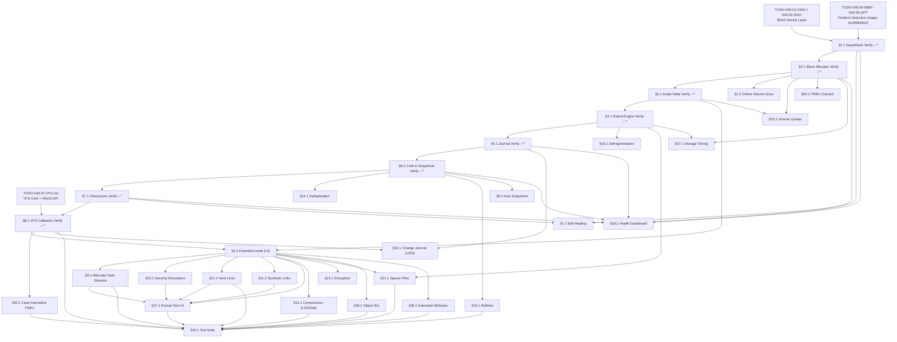

# 040.11-IXFS — Impossible X FileSystem (Native Filesystem)

> **Goal:** Complete the production-grade IXFS native filesystem for Impossible OS.
> IXFS is the **only filesystem in existence** that unifies: Win32-native semantics
> (Alternate Data Streams, ACLs, case-insensitive by default), modern reliability features
> (Copy-on-Write, journaling, per-block checksums, instant snapshots), and advanced
> capabilities (transparent compression, per-file encryption, block deduplication,
> reflinks). IXFS is what makes this OS **impossible** — no other filesystem combines
> all of these features in a single, coherent design.

> [!CAUTION]
> **Memory Rule:** Use `pmm_alloc_contiguous()` for bitmap buffers, refcount tables,
> checksum tables, snapshot inode backups, and any buffer > 4 KB. `kmalloc` is ONLY
> for small kernel structs (≤ 4 KB). See `rules.md` Known Gotchas.

> [!IMPORTANT]
> **Existing Implementation:** IXFS already has a working foundation:
> `ixfs_core.c` (disk I/O, buffer cache, CRC32C), `ixfs_alloc.c` (bitmap, block groups),
> `ixfs_inode.c` (inode R/W, vnodes, dir hash), `ixfs_extent.c` (extent-based mapping),
> `ixfs_journal.c` (WAL transactions), `ixfs_cow.c` (CoW, snapshots, refcounts),
> `ixfs_format.c` (mkfs), `ixfs_ops.c` (VFS callbacks), `ixfs_test.c` (test suite).
> This TODO covers **verification of existing features** and **implementation of new ones**.

> [!NOTE]
> **On-disk layout** (4 KiB blocks): Block 0 = Superblock, Blocks 1..N = Block Bitmap,
> N+1..M = Inode Table, M+1..end = Data blocks. Journal, refcount table, snapshot table,
> and checksum table are allocated in reserved regions defined by the superblock.

---

## TODO Completion Roadmap (Cross-File)

> [!IMPORTANT]
> **Four TODO files and the existing codebase** feed into the IXFS driver. IXFS is unique
> among the filesystem TODOs because it already has a **working implementation** — most of
> Phase 1 is verification, not green-field coding. This roadmap shows the correct sequence
> — completing items out of order will cause rework (especially: extending inodes to v3
> before verifying v2 correctness will lose the ability to validate the current disk format).

### Dependency Graph



### Phase-by-Phase Implementation Order

| Phase  | TODO File / Dependency                | Sections                          | What It Delivers                                                          | Depends On                           | Status |
| :----: | ------------------------------------- | --------------------------------- | ------------------------------------------------------------------------- | ------------------------------------ | :----: |
| **0**  | `TODO-040.01` / `TODO-040.02`         | Block device layer                | `blkdev_read()` / `blkdev_write()` via VirtIO or AHCI                    | —                                    |   ✅   |
| **0**  | `TODO-040.04` / `TODO-040.05`         | Partition detection               | IXFS magic `0x49584653` → partition found                                 | Phase 0 (block)                      |   ✅   |
| **0**  | `TODO-040.07-VFS.md`                  | VFS core layer                    | `vfs_ops` struct, mount framework, basic file operations                  | —                                    |   ✅   |
| **1**  | `TODO-040.11-IXFS.md`                 | §1.1 Superblock Verify            | Confirm: magic, version, block size, layout fields, CRC32C               | Phase 0 (partitions)                 |   ⬜   |
| **1**  | `TODO-040.11-IXFS.md`                 | §2.1 Block Allocator Verify       | Confirm: bitmap ops, block groups, locality-aware alloc                   | Phase 1 (§1.1)                       |   ⬜   |
| **1**  | `TODO-040.11-IXFS.md`                 | §3.1 Inode Table Verify           | Confirm: 128-byte inodes, mode flags, extents, hash index                | Phase 1 (§2.1)                       |   ⬜   |
| **1**  | `TODO-040.11-IXFS.md`                 | §4.1 Extent Engine Verify         | Confirm: block mapping, overflow extents, inline data                     | Phase 1 (§3.1)                       |   ⬜   |
| **1**  | `TODO-040.11-IXFS.md`                 | §5.1 Journal Verify               | Confirm: WAL header, txn API, recovery replay, checksum                   | Phase 1 (§4.1)                       |   ⬜   |
| **1**  | `TODO-040.11-IXFS.md`                 | §6.1 CoW & Snapshot Verify        | Confirm: refcount table, CoW on write, snapshot create/restore/delete     | Phase 1 (§5.1)                       |   ⬜   |
| **1**  | `TODO-040.11-IXFS.md`                 | §7.1 Checksum Verify              | Confirm: CRC32C per-block, scrub, checksum table persistence              | Phase 1 (§6.1)                       |   ⬜   |
| **1**  | `TODO-040.11-IXFS.md`                 | §8.1 VFS Callbacks Verify         | Confirm: all VFS ops (14+), dir entries, mount sequence                   | Phase 1 (§7.1) + VFS (040.07)       |   ⬜   |
| **2**  | `TODO-040.11-IXFS.md`                 | §3.2 Extended Inode (v3)          | 256-byte inodes: Win32 attrs, crtime, ADS chain, security, compression    | Phase 1 (§3.1, §8.1)                |   ⬜   |
| **3**  | `TODO-040.11-IXFS.md`                 | §9.1 Alternate Data Streams       | `filename:stream` syntax, stream inodes, Zone.Identifier                  | Phase 2 (§3.2)                       |   ⬜   |
| **3**  | `TODO-040.11-IXFS.md`                 | §10.1 Security Descriptors        | Win32 DACL/SACL, hash-deduped security table, inheritance                 | Phase 2 (§3.2)                       |   ⬜   |
| **3**  | `TODO-040.11-IXFS.md`                 | §11.1 Hard Links                  | `CreateHardLink`, `i_links` management, cascade-delete                    | Phase 2 (§3.2)                       |   ⬜   |
| **3**  | `TODO-040.11-IXFS.md`                 | §11.2 Symbolic Links              | Reparse points, `CreateSymbolicLink`, loop detection (8 max)              | Phase 2 (§3.2)                       |   ⬜   |
| **3**  | `TODO-040.11-IXFS.md`                 | §20.1 Case-Insensitive Paths      | `ixfs_name_cmp()` replaces `ixfs_strcmp()` — Win32 mandatory              | Phase 1 (§8.1)                       |   ⬜   |
| **4**  | `TODO-040.11-IXFS.md`                 | §17.1 Format Tool v3              | `ixfs_format()` upgrade: v3 superblock, 256B inodes, all reserved tables  | Phase 3 (§9–§11, §20)               |   ⬜   |
| **5**  | `TODO-040.11-IXFS.md`                 | §12.1 Compression (LZ4/Zstd)     | Transparent per-file compression — LZ4 for speed, Zstd for ratio          | Phase 2 (§3.2)                       |   ⬜   |
| **5**  | `TODO-040.11-IXFS.md`                 | §14.1 Inline Deduplication       | xxHash64 block dedup reusing CoW refcounts — lightweight storage savings  | Phase 1 (§6.1)                       |   ⬜   |
| **5**  | `TODO-040.11-IXFS.md`                 | §15.1 Reflink Copy               | Instant zero-copy file cloning via `CopyFile` — uses CoW refcounts       | Phase 1 (§6.1)                       |   ⬜   |
| **5**  | `TODO-040.11-IXFS.md`                 | §16.1 Online Defragmentation     | Extent consolidation with CoW safety — background + on-demand             | Phase 1 (§4.1)                       |   ⬜   |
| **5**  | `TODO-040.11-IXFS.md`                 | §21.1 Sparse Files               | Hole extents, `FSCTL_SET_ZERO_DATA` — sparse + CoW integration           | Phase 2 (§3.2) + Phase 1 (§4.1)     |   ⬜   |
| **5**  | `TODO-040.11-IXFS.md`                 | §24.1 TRIM / Discard             | Journal-batched TRIM on block free — SSD performance + longevity          | Phase 1 (§2.1)                       |   ⬜   |
| **6**  | `TODO-040.11-IXFS.md`                 | §1.2 Online Volume Grow          | Extend volume while mounted — bitmap + superblock + block group update    | Phase 1 (§2.1)                       |   ⬜   |
| **6**  | `TODO-040.11-IXFS.md`                 | §7.2 Self-Healing Metadata       | Backup superblock + bitmap — auto-fallback on corruption                  | Phase 1 (§1.1, §7.1)                |   ⬜   |
| **7**  | `TODO-040.11-IXFS.md`                 | §6.2 Automatic Snapshots         | Scheduled hourly/daily snapshots with retention policy                    | Phase 1 (§6.1)                       |   ⬜   |
| **7**  | `TODO-040.11-IXFS.md`                 | §13.1 Per-File Encryption        | AES-256-XTS, per-file keys, master key derivation (PBKDF2)               | Phase 2 (§3.2)                       |   ⬜   |
| **7**  | `TODO-040.11-IXFS.md`                 | §22.1 Change Journal (USN)       | Persistent circular buffer — Search, antivirus, backup integration       | Phase 1 (§8.1, §5.1)                |   ⬜   |
| **7**  | `TODO-040.11-IXFS.md`                 | §23.1 Volume Quotas              | Per-user disk limits — enterprise environments                            | Phase 1 (§2.1, §3.1)                |   ⬜   |
| **8**  | `TODO-040.11-IXFS.md`                 | §18.1 Volume Health Dashboard    | Unified health panel: superblock, journal, checksums, dedup, snapshots    | Phase 1 (§1.1, §5.1, §6.1, §7.1)   |   ⬜   |
| **8**  | `TODO-040.11-IXFS.md`                 | §19.1 Comprehensive Test Suite   | Full CRUD, large files, hard/symlinks, ADS, snapshots, CoW, compression   | Phase 4 (§17.1) + Phase 3 + Phase 5 |   ⬜   |
| **9**  | `TODO-040.11-IXFS.md`                 | §25.1 Object IDs                 | Win32 `FSCTL_CREATE_OR_GET_OBJECT_ID` — persistent file identity          | Phase 2 (§3.2)                       |   ⬜   |
| **9**  | `TODO-040.11-IXFS.md`                 | §26.1 Extended Attributes        | Win32 EA support — installer metadata, WSL interop                        | Phase 2 (§3.2)                       |   ⬜   |
| **9**  | `TODO-040.11-IXFS.md`                 | §27.1 Storage Tiering            | Automatic hot/cold data placement across SSD + HDD tiers                  | Phase 1 (§2.1, §4.1)                |   ⬜   |

> [!NOTE]
> **Phase 0** is already done — block devices, partition detection, and VFS core are in place.
> **Phase 1** is verification only — no new code, just confirming the existing v2 implementation
> is correct. This is the **critical path**: every subsequent phase builds on Phase 1 correctness.
> **Phase 2** is the format upgrade gate — v3 inodes (256 bytes) unlock all Win32 features.
> **Phase 3** delivers Win32 compatibility: ADS, ACLs, hard/symlinks, case-insensitive, and the v3 format tool.
> **Phase 4** updates the format tool for all v3 features.
> **Phase 5** delivers advanced storage features (⭐): compression, dedup, reflinks, defrag, sparse, TRIM.
> **Phases 6–7** add management and automation: online grow, self-healing, auto-snapshots, encryption, USN, quotas.
> **Phase 8** caps everything with the health dashboard and comprehensive test suite.
> **Phase 9** delivers enterprise & stretch features: object IDs, extended attributes, and storage tiering.

> [!TIP]
> **Quick wins after Phase 1:**
> - §14.1 Deduplication, §15.1 Reflinks, and §16.1 Defragmentation all depend only on
>   Phase 1 (CoW refcounts and extents). They can be started as soon as verification is done.
> - §6.2 Auto Snapshots, §1.2 Online Volume Grow, and §24.1 TRIM also only need Phase 1.
> - §20.1 Case-Insensitive Paths needs only §8.1 — it can start as soon as verification is done.
>
> **Critical gate: Phase 2 (Extended Inodes).** ADS needs `i_ads_first`, security
> descriptors need `i_security_id`, compression needs `i_compress_type`, and encryption
> needs `i_encrypt_key_id` — all fields that live in the v3 inode. **Do NOT start Phase 3
> Win32 features without completing Phase 2.** Also note that Phase 2 is a **format-breaking
> change** (`IXFS_VERSION → 3`) — existing v2 test volumes become read-only after this.
>
> **Memory rule reminder:** IXFS allocates large in-memory tables (bitmap, refcount table,
> checksum table, dedup hash table). **Every one of these must use `pmm_alloc_contiguous()`**.
> The kernel heap is only 2 MiB. A 32 GiB volume has a ~128 KB bitmap, ~256 KB refcount
> table, and ~256 KB checksum table — these will silently exhaust `kmalloc`.
>
> **VFS thread safety.** The VFS layer currently has no locking (noted in `TODO-010-Bootloader.md
> §5.4`). Before IXFS serves as root (`C:\`), `vfs_lock()`/`vfs_unlock()` reader-writer
> mutexes must be added. Until then, concurrent file access from multiple tasks will corrupt
> in-memory state. This is tracked in `TODO-040.07-VFS.md`.
>
> **IXFS is the only filesystem you control.** Unlike NTFS, ext4, FAT32, and exFAT where
> the on-disk format is defined by external specs, IXFS format decisions are yours. This
> means you can redesign layouts freely — but it also means there are no external validators.
> §19.1 Test Suite is critical for catching regressions.

---

## 1. Superblock & Volume Management (Existing — Verify)

### 1.1 Superblock Verification *(verify)*

**Prompt:** Verify the existing superblock implementation in `ixfs_format.c` and `ixfs_core.c`. Confirm: magic `0x49584653` at offset 0, version 2, 4 KiB block size, 64-bit `s_total_blocks`/`s_free_blocks`, correct bitmap/inode/data region offsets, volume name, journal region, refcount table, snapshot table, checksum table. Verify CRC32C integrity check of the superblock. Verify the superblock fits in 512 bytes. Run `bash scripts/build.sh clean`, and commit as `"ixfs: verify superblock"`. Add notes directly in this TODO section. After implementation, save any gotchas, solutions, and important information to MCP memory (`mcp_memory_create_entities` / `mcp_memory_add_observations`).

> [!WARNING]
> **Code bug: stale header comment.** `ixfs.h` line 14 says `"Inodes hold 12 direct + 1
> single-indirect + 1 double-indirect ptr"` — this is leftover from an older design. The
> actual implementation uses **extent-based allocation** (4 inline extents + overflow tree).
> Fix the comment during this verification step.

- [x] Superblock struct defined: `struct ixfs_superblock` (512 bytes, packed)
- [x] Magic: `IXFS_MAGIC = 0x49584653`
- [x] Version: `IXFS_VERSION = 2`
- [x] Block size: `IXFS_BLOCK_SIZE = 4096`
- [x] 64-bit block counts: `s_total_blocks`, `s_free_blocks`
- [x] Layout fields: `s_bitmap_start`, `s_inode_start`, `s_data_start`
- [x] Volume name: `s_volume_name[32]`
- [x] Journal fields: `s_journal_start`, `s_journal_blocks`, `s_journal_seq`
- [x] CoW fields: `s_refcount_start`, `s_refcount_blocks`, `s_snapshot_start`, `s_snapshot_count`
- [x] Checksum fields: `s_checksum_start`, `s_checksum_blocks`, `s_checksum`
- [ ] Verify: `s_checksum` is CRC32C over bytes [0..**127**] — `s_checksum` lives at offset 128, so all fields before it (snapshot and checksum-table fields at bytes 112–127) **must** be covered. The current code comment says `[0..111]` which leaves 16 bytes unprotected — fix if wrong.
- [ ] Fix: `ixfs.h` header comment — replace indirect pointer description with extent-based description
- [ ] Commit: `"ixfs: verify superblock"`

### 1.2 Volume Resize (Online) *(agent)*

**Prompt:** Implement online volume resizing — grow an IXFS volume while it is mounted. This is important for dynamic disk management (e.g., expanding a VM's disk). To grow: extend the block bitmap to cover new blocks, update `s_total_blocks` and `s_free_blocks` in the superblock, update block group descriptors. Shrinking is harder (requires relocating data from the tail) — defer to future. After completing all items, mark every item as `[x]`, run `bash scripts/build.sh clean`, and commit as `"ixfs: online volume grow"`. Add notes directly in this TODO section. After implementation, save any gotchas, solutions, and important information to MCP memory (`mcp_memory_create_entities` / `mcp_memory_add_observations`).

> [!TIP]
> **Competitive Edge:** NTFS can grow online (but only via Windows Disk Management).
> ext4 can grow online via `resize2fs`. FAT32 and exFAT cannot resize at all.
> IXFS supports grow from Disk Manager GUI — simpler than both Windows and Linux.

- [ ] Implement `ixfs_grow(vol, new_total_blocks)`:
  - [ ] Extend block bitmap: allocate additional bitmap blocks, zero-fill
  - [ ] Update `s_total_blocks` and `s_free_blocks`
  - [ ] Update `s_bitmap_blocks` if more bitmap blocks needed
  - [ ] Recalculate and update block group descriptors (`ixfs_init_groups`)
  - [ ] Flush superblock, bitmap, and checksum table to disk
  - [ ] Journal the metadata changes (atomic via WAL)
- [ ] Wire to Disk Manager: "Extend Volume" in right-click menu
- [ ] Test: grow a 100 MB volume to 200 MB, verify new space is usable
- [ ] Commit: `"ixfs: online volume grow"`

---

## 2. Block Allocation & Bitmap (Existing — Verify)

### 2.1 Block Group Allocator Verification *(verify)*

**Prompt:** Verify the existing block group allocator in `ixfs_alloc.c`. Confirm: bitmap set/clear/test operations, block group initialization (`ixfs_init_groups`), locality-aware allocation (`ixfs_alloc_block_near`), bitmap flush to disk. Verify block groups cover `IXFS_BLOCKS_PER_GROUP = 32768` blocks (128 MiB each) up to `IXFS_MAX_BLOCK_GROUPS = 256` (32 GiB max). Run `bash scripts/build.sh clean`, and commit as `"ixfs: verify block allocator"`. Add notes directly in this TODO section. After implementation, save any gotchas, solutions, and important information to MCP memory (`mcp_memory_create_entities` / `mcp_memory_add_observations`).

- [x] `bitmap_set`, `bitmap_clear`, `bitmap_test` — bit manipulation
- [x] `ixfs_init_groups` — calculate block group boundaries
- [x] `ixfs_alloc_block_near` — try preferred group first, fallback
- [x] `ixfs_alloc_block` — allocate from any group
- [x] `ixfs_free_block` — clear bitmap bit, update group counters
- [x] `ixfs_flush_bitmap` — write bitmap to disk
- [ ] Verify: block group `bg_next_free` hint is updated on alloc/free
- [ ] Commit: `"ixfs: verify block allocator"`

---

## 3. Inode System (Existing — Verify + Extend)

### 3.1 Inode Table Verification *(verify)*

**Prompt:** Verify the existing inode system in `ixfs_inode.c`. Confirm: 128-byte inodes (32 per block), mode/type flags, uid/gid, 64-bit size, ctime/mtime/atime, 4 inline extents, overflow extent block pointer, hard link count. Verify vnode allocation/lookup, directory hash index (`ixfs_fnv1a` hash). Run `bash scripts/build.sh clean`, and commit as `"ixfs: verify inode table"`. Add notes directly in this TODO section. After implementation, save any gotchas, solutions, and important information to MCP memory (`mcp_memory_create_entities` / `mcp_memory_add_observations`).

> [!WARNING]
> **Timestamp naming ambiguity.** `ixfs.h:151` comments `i_ctime` as `"creation time"` but
> in POSIX semantics `ctime` = **inode change time** (metadata modification), NOT creation
> time. The v3 inode (§3.2) adds `i_crtime` for true creation time (Win32 `ftCreationTime`).
> During verification, clarify which semantic `i_ctime` currently uses and document the
> decision. If it's behaving as creation time, rename to `i_crtime` in v3.

- [x] `struct ixfs_inode` — 128 bytes, packed
- [x] Mode flags: `IXFS_S_FILE`, `IXFS_S_DIR`, `IXFS_S_TYPEMASK`
- [x] Permission bits: Unix-style (9 bits)
- [x] Extents: 4 inline (`i_extents[4]`), overflow via `i_extent_block`
- [x] Timestamps: `i_ctime`, `i_mtime`, `i_atime` (POSIX seconds)
- [x] `ixfs_read_inode`, `ixfs_write_inode` — disk I/O
- [x] `ixfs_get_vnode` — vnode cache lookup/allocate
- [x] `ixfs_fnv1a` — FNV-1a hash for directory index
- [x] `ixfs_hash_build`, `ixfs_hash_lookup` — O(1) dir lookups
- [ ] Verify: `i_links` hard link count incremented/decremented correctly
- [ ] Verify: `i_ctime` semantic — is it creation time or inode change time? Document decision
- [ ] Commit: `"ixfs: verify inode table"`

### 3.2 Extended Inode Attributes *(agent)*

**Prompt:** Extend the 128-byte inode to support additional metadata needed for Win32 compatibility and advanced features. Add: Win32 file attributes (`FILE_ATTRIBUTE_HIDDEN`, `SYSTEM`, `ARCHIVE`, etc.), nanosecond timestamp extensions, file creation time (`i_crtime` — distinct from `i_ctime` which is inode change time), a security descriptor reference (inode of the ACL), an ADS chain pointer (first ADS inode), a compression type field, and an encryption key ID. Use the existing `i_extent_pad` and reserved bytes, or increase inode size to 256 bytes (64 per block → 16 per block). After completing all items, mark every item as `[x]`, run `bash scripts/build.sh clean`, and commit as `"ixfs: extended inode attributes"`. Add notes directly in this TODO section. After implementation, save any gotchas, solutions, and important information to MCP memory (`mcp_memory_create_entities` / `mcp_memory_add_observations`).

> [!WARNING]
> Increasing inode size from 128 → 256 bytes is a **format change** (`IXFS_VERSION → 3`).
> Existing v2 volumes must be mountable in read-only mode by v3 drivers.

- [ ] Design extended inode fields (new or repurposed):
  - [ ] `i_win32_attrs` (4B) — Win32 attribute flags (hidden, system, archive, etc.)
  - [ ] `i_crtime` (4B) — file creation time (Win32 `ftCreationTime`)
  - [ ] `i_mtime_ns` (4B) — nanosecond extension for `i_mtime`
  - [ ] `i_crtime_ns` (4B) — nanosecond extension for `i_crtime`
  - [ ] `i_security_id` (4B) — reference to security descriptor (0 = default)
  - [ ] `i_ads_first` (4B) — inode number of first ADS (0 = none)
  - [ ] `i_compress_type` (1B) — 0=none, 1=LZ4, 2=Zstd
  - [ ] `i_encrypt_key_id` (4B) — encryption key slot (0 = unencrypted)
  - [ ] `i_flags` (4B) — IXFS-specific flags (sparse, immutable, append-only)
  - [ ] `i_file_id` (8B) — unique persistent file identifier (for `GetFileInformationByHandle`)
- [ ] Upgrade `IXFS_VERSION` to 3 for 256-byte inodes
- [ ] Detect v2 volumes on mount → force read-only mode
- [ ] Update `IXFS_INODES_PER_BLOCK` for 256-byte inodes
- [ ] Commit: `"ixfs: extended inode attributes"`

---

## 4. Extent-Based Allocation (Existing — Verify)

### 4.1 Extent Engine Verification *(verify)*

**Prompt:** Verify the existing extent engine in `ixfs_extent.c`. Confirm: `ixfs_get_block` maps file block index → disk block, `ixfs_add_block_to_extent` extends/creates extents, `ixfs_free_all_extents` deallocates. Verify inline data support (`IXFS_INLINE` flag, ≤48 bytes stored in `i_extents` array). Verify overflow extent blocks for files with >4 extents. Run `bash scripts/build.sh clean`, and commit as `"ixfs: verify extent engine"`. Add notes directly in this TODO section. After implementation, save any gotchas, solutions, and important information to MCP memory (`mcp_memory_create_entities` / `mcp_memory_add_observations`).

- [x] `ixfs_get_block` — binary search inline extents, then overflow
- [x] `ixfs_add_block_to_extent` — extend last extent or allocate new
- [x] `ixfs_free_all_extents` — release all blocks
- [x] Inline data: `IXFS_INLINE` flag for ≤48-byte files
- [ ] Verify: overflow extent block tree works for highly fragmented files
- [ ] Verify: extent merging when adjacent blocks are allocated
- [ ] Commit: `"ixfs: verify extent engine"`

---

## 5. Write-Ahead Log / Journal (Existing — Verify)

### 5.1 Journal Verification *(verify)*

**Prompt:** Verify the existing WAL journal in `ixfs_journal.c`. Confirm: journal header at journal block 0, data entries store full block snapshots, commit entries mark transaction completion, recovery replays uncommitted transactions. Verify transaction API: `ixfs_txn_begin`, `ixfs_txn_write` (up to 8 blocks), `ixfs_txn_commit`. Verify checksum on journal entries. Run `bash scripts/build.sh clean`, and commit as `"ixfs: verify WAL journal"`. Add notes directly in this TODO section. After implementation, save any gotchas, solutions, and important information to MCP memory (`mcp_memory_create_entities` / `mcp_memory_add_observations`).

- [x] `struct ixfs_journal_header` — magic, head, tail, seq
- [x] `struct ixfs_journal_entry` — txn_id, type, target block, checksum, data
- [x] `ixfs_journal_init` — initialize journal on mount
- [x] `ixfs_journal_recover` — replay on dirty mount
- [x] `ixfs_txn_begin`, `ixfs_txn_write`, `ixfs_txn_commit`
- [x] Max 8 blocks per transaction (`IXFS_TXN_MAX_ENTRIES`)
- [ ] Verify: journal wraparound works when head > tail
- [ ] Verify: recovery after simulated crash mid-transaction
- [ ] Commit: `"ixfs: verify WAL journal"`

---

## 6. Copy-on-Write & Snapshots (Existing — Verify + Extend)

### 6.1 CoW & Snapshot Verification *(verify)*

**Prompt:** Verify the existing CoW and snapshot system in `ixfs_cow.c`. Confirm: per-block refcount table, CoW on write (`ixfs_cow_block` allocates new block when refcount > 1), snapshot creation (copies inode table, increments refcounts), snapshot restore, snapshot deletion (decrements refcounts, frees blocks at refcount 0). Run `bash scripts/build.sh clean`, and commit as `"ixfs: verify CoW and snapshots"`. Add notes directly in this TODO section. After implementation, save any gotchas, solutions, and important information to MCP memory (`mcp_memory_create_entities` / `mcp_memory_add_observations`).

- [x] `ixfs_refcount_init/load/flush` — per-block reference counting
- [x] `ixfs_cow_block` — allocate new block if refcount > 1
- [x] `ixfs_snapshot_create` — copy inode table, increment refs
- [x] `ixfs_snapshot_list` — enumerate snapshots
- [x] `ixfs_snapshot_restore` — restore inode table from snapshot
- [x] `ixfs_snapshot_delete` — decrement refs, free unreferenced blocks
- [x] Max 8 simultaneous snapshots (`IXFS_MAX_SNAPSHOTS`)
- [ ] Verify: writing to a file after snapshot correctly CoWs the block
- [ ] Verify: deleting a snapshot frees only blocks with refcount → 0
- [ ] Commit: `"ixfs: verify CoW and snapshots"`

### 6.2 Scheduled Automatic Snapshots *(agent)*

**Prompt:** Implement automatic scheduled snapshots — the filesystem takes snapshots at configurable intervals (hourly, daily). Old snapshots are automatically pruned based on a retention policy: keep the last N hourly, daily, weekly snapshots. This enables Windows "Previous Versions" (Shadow Copy) functionality. After completing all items, mark every item as `[x]`, run `bash scripts/build.sh clean`, and commit as `"ixfs: automatic scheduled snapshots"`. Add notes directly in this TODO section. After implementation, save any gotchas, solutions, and important information to MCP memory (`mcp_memory_create_entities` / `mcp_memory_add_observations`).

> [!TIP]
> **Competitive Edge:** Windows Volume Shadow Copy (VSS) is a separate service, not part of
> NTFS itself — and it's unreliable. ext4/Btrfs snapshots require manual `btrfs subvolume snapshot`.
> IXFS having filesystem-level auto-snapshots with configurable retention is unique.

- [ ] Implement snapshot scheduler:
  - [ ] Configurable interval via Registry: `HKLM\SYSTEM\Storage\IXFS\SnapshotInterval` (seconds)
  - [ ] Default: hourly snapshots
  - [ ] Naming: `auto_YYYYMMDD_HHMMSS`
- [ ] Implement retention policy:
  - [ ] Keep last 24 hourly, 7 daily, 4 weekly snapshots
  - [ ] Auto-delete oldest snapshots that exceed policy
- [ ] Wire to Explorer: "Previous Versions" tab in file Properties
  - [ ] List snapshots containing the file
  - [ ] "Restore" button restores from snapshot
- [ ] Commit: `"ixfs: automatic scheduled snapshots"`

---

## 7. Per-Block Checksums & Self-Healing (Existing — Verify + Extend)

### 7.1 Checksum Verification *(verify)*

**Prompt:** Verify the existing per-block checksum system in `ixfs_core.c`. Confirm: `ixfs_crc32c` computes CRC32C, `ixfs_checksum_update` stores checksum on write, `ixfs_checksum_verify` validates on read, `ixfs_checksum_load/flush` persists the checksum table. Verify `ixfs_scrub` walks all blocks and reports corrupted ones. Run `bash scripts/build.sh clean`, and commit as `"ixfs: verify checksums"`. Add notes directly in this TODO section. After implementation, save any gotchas, solutions, and important information to MCP memory (`mcp_memory_create_entities` / `mcp_memory_add_observations`).

- [x] `ixfs_crc32c` — CRC32C computation
- [x] `ixfs_checksum_update` — store checksum on block write
- [x] `ixfs_checksum_verify` — validate checksum on block read
- [x] `ixfs_checksum_load/flush` — persist checksum table
- [x] `ixfs_scrub` — full-volume integrity scan
- [ ] Verify: checksum mismatch logs error and returns failure
- [ ] Verify: scrub reports count of corrupt vs clean blocks
- [ ] Commit: `"ixfs: verify checksums"`

### 7.2 Self-Healing with Redundant Metadata *(agent)*

**Prompt:** Implement self-healing for critical metadata: superblock, bitmap, and inode table. Store a backup copy of the superblock at the last block of the volume. Store a backup of the first bitmap block at a reserved location. On checksum failure of these critical structures, automatically fall back to the backup copy and log a warning. This is similar to ZFS self-healing but targeted at critical metadata only. After completing all items, mark every item as `[x]`, run `bash scripts/build.sh clean`, and commit as `"ixfs: self-healing metadata"`. Add notes directly in this TODO section. After implementation, save any gotchas, solutions, and important information to MCP memory (`mcp_memory_create_entities` / `mcp_memory_add_observations`).

> [!TIP]
> **Competitive Edge:** NTFS has no self-healing (relies on chkdsk). ext4 has journal
> replay but no data self-healing. ZFS has full self-healing but is complex and resource-heavy.
> IXFS provides targeted self-healing for the structures that matter most, with zero overhead.

- [ ] Write backup superblock at volume last block on every superblock flush
- [ ] On superblock checksum failure → read backup → restore if valid → log warning
- [ ] Write backup of bitmap block 0 at a reserved location (after snapshot table)
- [ ] On bitmap corruption → attempt recovery from backup
- [ ] Log: `[IXFS] SELF-HEAL: Primary superblock corrupt, restored from backup`
- [ ] Wire to Disk Manager: show self-healing events in volume health panel
- [ ] Commit: `"ixfs: self-healing metadata"`

---

## 8. VFS Integration (Existing — Verify)

### 8.1 VFS Callbacks Verification *(verify)*

**Prompt:** Verify the existing VFS integration in `ixfs_ops.c`. Confirm all `vfs_ops` callbacks work: `open`, `close`, `read`, `write`, `readdir`, `finddir`, `create`, `unlink`, `rename`, `mkdir`, `rmdir`, `stat`, `truncate`, `flush`. Verify directory entries (`struct ixfs_dir_entry` — 256 bytes, 16 per block). Verify the mount sequence in `ixfs_init`. Run `bash scripts/build.sh clean`, and commit as `"ixfs: verify VFS callbacks"`. Add notes directly in this TODO section. After implementation, save any gotchas, solutions, and important information to MCP memory (`mcp_memory_create_entities` / `mcp_memory_add_observations`).

> [!WARNING]
> **Code bug: directory entry comment.** `ixfs.h:163` says `"64 bytes each (64 entries per
> block)"` but the actual struct is `d_inode` (4B) + `d_name[252]` = **256 bytes** →
> `IXFS_DIRENTS_PER_BLOCK = 4096/256 = 16`. The comment is wrong. Fix during verification.

- [x] `ixfs_file_ops` — file VFS callbacks (open, close, read, write)
- [x] `ixfs_dir_ops` — directory VFS callbacks (readdir, finddir, create, unlink, mkdir, rmdir)
- [x] `ixfs_vfs_stat` — stat callback for file metadata
- [x] `ixfs_vfs_truncate` — truncate callback for file size changes
- [x] `ixfs_vfs_flush` — flush callback for dirty data writeback
- [x] `ixfs_init` — mount: read superblock, bitmap, journal, refcounts, checksums
- [x] `ixfs_format` — mkfs: create superblock, bitmap, root dir
- [x] Directory entries: **256 bytes** each (4B inode + 252B name), **16 per block**
- [ ] Fix: `ixfs.h` comment on line 163 — change `"64 bytes each"` → `"256 bytes each"`
- [ ] Verify: all VFS callbacks return correct error codes (`-ENOENT`, `-EEXIST`, etc.)
- [ ] Verify: creating + deleting files updates bitmap and inode table atomically
- [ ] Verify: `ixfs_rename` works for cross-directory rename (currently same-dir only)
- [ ] Commit: `"ixfs: verify VFS callbacks"`

---

## 9. Alternate Data Streams (Win32 Feature)

### 9.1 Named Data Streams *(agent)*

**Prompt:** Implement Alternate Data Streams (ADS) — the ability to store multiple named data streams on a single file, accessible via the `filename:streamname` syntax. NTFS ADS is used by: web browsers (`:Zone.Identifier`), Outlook (`:OLE...` streams), and the Windows Attachment Manager. IXFS implements ADS by creating hidden "stream inodes" chained from the parent file's `i_ads_first` field. Each stream inode is a regular file-type inode with a special stream-name directory entry in a per-file ADS directory. After completing all items, mark every item as `[x]`, run `bash scripts/build.sh clean`, and commit as `"ixfs: alternate data streams"`. Add notes directly in this TODO section. After implementation, save any gotchas, solutions, and important information to MCP memory (`mcp_memory_create_entities` / `mcp_memory_add_observations`).

> [!TIP]
> **Competitive Edge:** Only NTFS supports ADS natively. ext4, FAT32, exFAT do not.
> IXFS having native ADS means all Win32 applications that use streams work correctly
> — including the critical `:Zone.Identifier` for download security.

- [ ] Define ADS chain: `inode->i_ads_first` → first stream inode
  - [ ] Stream inodes have `i_mode = IXFS_S_FILE | IXFS_S_STREAM` (new type flag)
  - [ ] Each stream inode stores: stream name (in a parent directory), data (via extents)
  - [ ] Chain: stream inode's `i_ads_first` → next stream inode (linked list)
- [ ] Parse `filename:streamname` syntax in path resolution:
  - [ ] Split on `:` — left part = base file, right part = stream name
  - [ ] Locate base file's stream directory, search for stream name
- [ ] Implement `CreateFile("file:stream", ...)`:
  - [ ] If stream exists → open it
  - [ ] If stream doesn't exist and writing → create new stream inode, link to chain
- [ ] Implement `DeleteFile("file:stream")` — unlink stream inode, free data
- [ ] Well-known streams:
  - [ ] `Zone.Identifier` — browser download security tag
  - [ ] `$OBJECT_ID` — Windows object identity
- [ ] `FindFirstStreamW` / `FindNextStreamW` — enumerate all streams on a file
- [ ] On file deletion: cascade-delete all attached streams
- [ ] Test: create file with ADS, verify stream data survives file copy on IXFS
- [ ] Commit: `"ixfs: alternate data streams"`

---

## 10. Security Descriptors & ACLs (Win32 Feature)

### 10.1 DACL/SACL Security Descriptors *(agent)*

**Prompt:** Implement Win32-compatible security descriptors on IXFS files. Each file can have an associated security descriptor containing: Owner SID, Group SID, DACL (who can access), and SACL (audit trail). Store them as separate "security inodes" — deduplicated, since many files share the same descriptor. The `i_security_id` field in the inode references a security descriptor object by its hash. After completing all items, mark every item as `[x]`, run `bash scripts/build.sh clean`, and commit as `"ixfs: security descriptors"`. Add notes directly in this TODO section. After implementation, save any gotchas, solutions, and important information to MCP memory (`mcp_memory_create_entities` / `mcp_memory_add_observations`).

> [!TIP]
> **Competitive Edge:** NTFS stores security descriptors in `$Secure` with dedup.
> ext4 uses POSIX ACLs (different model). FAT32/exFAT have no security at all.
> IXFS natively supports Win32 DACLs/SACL — installers and enterprise apps "just work".

- [ ] Define security descriptor storage:
  - [ ] Hash-indexed security descriptor table (stored in reserved inodes)
  - [ ] On `SetFileSecurity()`: compute hash of descriptor, reuse if exists, else create
  - [ ] `i_security_id` in inode → index into security table
- [ ] Implement `GetFileSecurity(hFile, lpSecurityDescriptor)`:
  - [ ] Read security descriptor from table by `i_security_id`
  - [ ] Return self-relative `SECURITY_DESCRIPTOR`
- [ ] Implement `SetFileSecurity(hFile, lpSecurityDescriptor)`:
  - [ ] Parse descriptor, compute hash, store in table
  - [ ] Update `i_security_id` in inode
- [ ] Default security: new files inherit parent directory's DACL
- [ ] Well-known SIDs: `S-1-5-18` (SYSTEM), `S-1-5-32-544` (Administrators), etc.
- [ ] Commit: `"ixfs: security descriptors"`

---

## 11. Hard Links & Symbolic Links (Win32 Feature)

### 11.1 Hard Links *(agent)*

**Prompt:** Implement Win32 `CreateHardLink` — multiple directory entries pointing to the same inode. The `i_links` field already tracks hard link count. When a hard link is created, add a new directory entry in the target directory pointing to the same inode and increment `i_links`. When any link is deleted, decrement `i_links`. When `i_links` reaches 0, delete the inode and free its data blocks. After completing all items, mark every item as `[x]`, run `bash scripts/build.sh clean`, and commit as `"ixfs: hard links"`. Add notes directly in this TODO section. After implementation, save any gotchas, solutions, and important information to MCP memory (`mcp_memory_create_entities` / `mcp_memory_add_observations`).

- [ ] Implement `CreateHardLink(lpFileName, lpExistingFileName)`:
  - [ ] Resolve existing file to inode
  - [ ] Create new directory entry in target directory pointing to same inode
  - [ ] Increment `i_links`
  - [ ] Flush inode and target directory (journal transaction)
- [ ] On unlink: decrement `i_links`. If > 0 → file survives
- [ ] On `i_links == 0` → free inode, extents, ADS, security ref
- [ ] `GetFileInformationByHandle.nNumberOfLinks` → return `i_links`
- [ ] Restriction: hard links must be on same volume (same IXFS partition)
- [ ] Commit: `"ixfs: hard links"`

### 11.2 Symbolic Links & Reparse Points *(agent)*

**Prompt:** Implement symbolic links via reparse points. A symlink inode has type `IXFS_S_SYMLINK` (new type) and stores the target path in its data (inline for short paths ≤48 bytes, extent-based for long paths). Support both relative and absolute symlinks. Implement `CreateSymbolicLink` API. Follow symlinks during path resolution (with loop detection — max 8 follows). After completing all items, mark every item as `[x]`, run `bash scripts/build.sh clean`, and commit as `"ixfs: symbolic links"`. Add notes directly in this TODO section. After implementation, save any gotchas, solutions, and important information to MCP memory (`mcp_memory_create_entities` / `mcp_memory_add_observations`).

- [ ] Define `IXFS_S_SYMLINK = 0xA000` — new inode type
- [ ] Symlink data = target path (UTF-16LE or UTF-8)
  - [ ] Short: inline in `i_extents` (≤48 bytes)
  - [ ] Long: stored in data blocks via extents
- [ ] Implement `CreateSymbolicLink(lpSymlinkFileName, lpTargetFileName, dwFlags)`:
  - [ ] `dwFlags & SYMBOLIC_LINK_FLAG_DIRECTORY` — for directory symlinks
  - [ ] Create inode with `IXFS_S_SYMLINK` type, write target path
- [ ] Path resolution: on encountering symlink → read target → resolve recursively
  - [ ] Loop detection: max 8 symlink follows per path resolution
- [ ] `ReadFile` / `GetFileAttributes` on symlink → follows by default
- [ ] Commit: `"ixfs: symbolic links"`

---

## 12. Transparent Compression *(🚀 Impossible OS Feature)*

### 12.1 Per-File LZ4/Zstd Compression *(agent)*

**Prompt:** Implement transparent, per-file compression. When a file is marked for compression (via `DeviceIoControl` with `FSCTL_SET_COMPRESSION`), IXFS compresses data blocks before writing and decompresses on read. Use LZ4 for fast compression (real-time, low CPU) and Zstd for high-ratio compression. Compression unit = 1 block (4 KiB). The inode's `i_compress_type` field selects the algorithm. Compressed blocks smaller than the original are stored in-place with a header indicating compressed size. After completing all items, mark every item as `[x]`, run `bash scripts/build.sh clean`, and commit as `"ixfs: transparent compression"`. Add notes directly in this TODO section. After implementation, save any gotchas, solutions, and important information to MCP memory (`mcp_memory_create_entities` / `mcp_memory_add_observations`).

> [!TIP]
> **Competitive Edge:** NTFS uses LZ77 compression (slow, old algorithm from 1993).
> Btrfs uses Zstd (good ratio but high CPU). IXFS offers BOTH LZ4 (fastest) and Zstd
> (best ratio) as selectable options, defaulting to LZ4 for transparent speed.

- [ ] Implement LZ4 compressor/decompressor (or port minimal LZ4 implementation)
- [ ] Implement Zstd decompressor (for optional high-ratio mode)
- [ ] Compression unit: 1 block (4096 bytes)
- [ ] Compressed block format: `{ uint16_t compressed_size, uint8_t algo, uint8_t pad, data[] }`
- [ ] On write with compression enabled:
  - [ ] Compress block → if `compressed_size < block_size * 0.9` → store compressed
  - [ ] If compression doesn't save ≥10% → store uncompressed
- [ ] On read: check block header → decompress if needed → return to caller
- [ ] `i_compress_type`: `0` = none, `1` = LZ4, `2` = Zstd
- [ ] `FSCTL_SET_COMPRESSION` / `FSCTL_GET_COMPRESSION` DeviceIoControl
- [ ] `FILE_ATTRIBUTE_COMPRESSED` set in `i_win32_attrs` when compressed
- [ ] Commit: `"ixfs: transparent compression"`

---

## 13. Per-File Encryption *(🚀 Impossible OS Feature)*

### 13.1 AES-256 Transparent Encryption *(agent)*

**Prompt:** Implement transparent, per-file AES-256-XTS encryption. When a file or directory is marked for encryption, all data blocks are encrypted with a per-file key. The per-file key is stored encrypted by a master key (derived from user password via PBKDF2). The `i_encrypt_key_id` field references a key slot in the volume's key table. Encrypted files are readable only after the volume is unlocked with the correct master key. After completing all items, mark every item as `[x]`, run `bash scripts/build.sh clean`, and commit as `"ixfs: per-file encryption"`. Add notes directly in this TODO section. After implementation, save any gotchas, solutions, and important information to MCP memory (`mcp_memory_create_entities` / `mcp_memory_add_observations`).

> [!TIP]
> **Competitive Edge:** NTFS EFS (Encrypting File System) requires certificates and is
> notoriously unreliable on reinstall. ext4 fscrypt requires `fscryptctl` CLI setup.
> IXFS per-file encryption is simpler: set encrypted attribute → enter master password → done.

- [ ] Define key table: stored in reserved blocks after snapshot table
  - [ ] Key slot: `{ key_id, wrapped_key[32], salt[16], flags }`
  - [ ] Master key: derived from user password via PBKDF2 (100K iterations)
  - [ ] Per-file key: random AES-256 key, wrapped by master key
- [ ] On write (encrypted file):
  - [ ] Unwrap per-file key using master key
  - [ ] Encrypt data block with AES-256-XTS (tweak = block number)
  - [ ] Write encrypted block to disk
- [ ] On read (encrypted file):
  - [ ] Read encrypted block → decrypt with per-file key → return to caller
- [ ] On mount: prompt for master password to unlock volume
- [ ] `FILE_ATTRIBUTE_ENCRYPTED` set in `i_win32_attrs`
- [ ] Directories: encrypting a directory encrypts all new files within it
- [ ] Commit: `"ixfs: per-file encryption"`

---

## 14. Block-Level Deduplication *(🚀 Impossible OS Feature)*

### 14.1 Inline Deduplication *(agent)*

**Prompt:** Implement block-level inline deduplication. When writing a block, compute its hash (xxHash64). Check a dedup hash table — if a block with the same hash already exists, reuse the existing block via CoW refcounting instead of allocating a new one. This is especially effective for VM images, build artifacts, and copied files. Uses the existing refcount infrastructure from CoW snapshots. After completing all items, mark every item as `[x]`, run `bash scripts/build.sh clean`, and commit as `"ixfs: inline block deduplication"`. Add notes directly in this TODO section. After implementation, save any gotchas, solutions, and important information to MCP memory (`mcp_memory_create_entities` / `mcp_memory_add_observations`).

> [!TIP]
> **Competitive Edge:** NTFS and ext4 have no deduplication at all. ZFS has dedup but it
> requires enormous RAM (each entry uses ~320 bytes). Btrfs has offline dedup only.
> IXFS inline dedup is lightweight because it reuses the CoW refcount table.

- [ ] Build dedup hash table: `{ xxhash64 → block_number }` (in-memory, rebuild on mount)
- [ ] On block write:
  - [ ] Compute xxHash64 of block data
  - [ ] Check hash table for existing block
  - [ ] If found: compare data byte-for-byte (hash collision check)
    - [ ] If match: increment refcount of existing block, use it
    - [ ] If collision: allocate new block normally
  - [ ] If not found: allocate new block, insert into hash table
- [ ] Configurable: `HKLM\SYSTEM\Storage\IXFS\EnableDedup` (default: off for < 1 GB volumes)
- [ ] Telemetry: log dedup ratio: `[IXFS] Dedup: %u blocks deduplicated, saved %llu bytes`
- [ ] Commit: `"ixfs: inline block deduplication"`

---

## 15. Reflinks (Instant File Copy) *(🚀 Impossible OS Feature)*

### 15.1 Reflink Copy *(agent)*

**Prompt:** Implement reflinks — instant, zero-copy file cloning via `CopyFileEx` with `COPY_FILE_COPY_SYMLINK`. When reflink-copying a file, create a new inode pointing to the SAME data blocks, incrementing their refcounts. Writes to either file trigger CoW. This makes `Copy-Paste` of large files instant. Uses existing CoW refcount infrastructure. After completing all items, mark every item as `[x]`, run `bash scripts/build.sh clean`, and commit as `"ixfs: reflink copy"`. Add notes directly in this TODO section. After implementation, save any gotchas, solutions, and important information to MCP memory (`mcp_memory_create_entities` / `mcp_memory_add_observations`).

> [!TIP]
> **Competitive Edge:** NTFS has "block cloning" since Server 2016 (limited). ext4 has no
> reflinks. Btrfs/XFS have reflinks but require specific API. IXFS exposes reflinks
> transparently through `CopyFile` — the user just copies a file and it's instant.

- [ ] Implement `ixfs_reflink(vol, src_inode, dst_dir, dst_name)`:
  - [ ] Create new inode with same metadata (size, type, timestamps)
  - [ ] Copy extent list from source (NOT the data blocks)
  - [ ] Increment refcount for every data block
  - [ ] Create directory entry in destination
- [ ] Hook into `CopyFile` VFS implementation:
  - [ ] If both source and destination are on same IXFS volume → reflink
  - [ ] If cross-volume → traditional byte copy
- [ ] First write to either file after reflink → CoW triggers automatically
- [ ] Test: reflink a 1 GB file → verify instant, verify independent after write
- [ ] Commit: `"ixfs: reflink copy"`

---

## 16. Online Defragmentation *(🚀 Impossible OS Feature)*

### 16.1 Extent Consolidation *(agent)*

**Prompt:** Implement online defragmentation — consolidate fragmented extents while the volume is mounted. Walk files with high extent counts, allocate a new contiguous block range, copy data, update the inode's extent list. Use CoW so the old blocks remain valid until the new extent is committed. After completing all items, mark every item as `[x]`, run `bash scripts/build.sh clean`, and commit as `"ixfs: online defragmentation"`. Add notes directly in this TODO section. After implementation, save any gotchas, solutions, and important information to MCP memory (`mcp_memory_create_entities` / `mcp_memory_add_observations`).

- [ ] Implement `ixfs_defrag_file(vol, ino)`:
  - [ ] Count extents — if ≤ 2 → already well-allocated, skip
  - [ ] Calculate total blocks needed
  - [ ] Allocate contiguous range via `ixfs_alloc_block_near` (same group)
  - [ ] Copy data from old extents to new contiguous range
  - [ ] Update inode with single new extent
  - [ ] Free old blocks (respecting refcounts for CoW)
  - [ ] All within a journal transaction
- [ ] Background defragmenter:
  - [ ] Walk inode table, find files with > 4 extents
  - [ ] Defragment during idle time
  - [ ] Configurable: `HKLM\SYSTEM\Storage\IXFS\AutoDefrag` (default: on)
- [ ] Wire to Disk Manager: "Defragment" button on IXFS volumes
- [ ] Commit: `"ixfs: online defragmentation"`

---

## 17. Format Tool & Disk Manager Integration

### 17.1 IXFS Format Wizard *(agent)*

**Prompt:** Verify and extend `ixfs_format()` to support all new features. The format tool must create: superblock (v3), block bitmap, inode table (256-byte inodes), root directory, journal region, refcount table, snapshot table, checksum table, security descriptor table, key table (encryption), and backup superblock. Wire to Disk Manager as "Format → IXFS" option. After completing all items, mark every item as `[x]`, run `bash scripts/build.sh clean`, and commit as `"ixfs: format tool v3"`. Add notes directly in this TODO section. After implementation, save any gotchas, solutions, and important information to MCP memory (`mcp_memory_create_entities` / `mcp_memory_add_observations`).

- [ ] Extend `ixfs_format()` for v3:
  - [ ] Calculate sizes for all reserved regions
  - [ ] Write v3 superblock with all new fields
  - [ ] Initialize security descriptor table (default DACL)
  - [ ] Initialize encryption key table (empty)
  - [ ] Write backup superblock at last block
  - [ ] Initialize CRC32C checksums for all written blocks
- [ ] Configurable options:
  - [ ] Inode count (auto-calculated or manual)
  - [ ] Journal size (default 64 KiB, configurable)
  - [ ] Volume label
  - [ ] Enable/disable encryption, compression, dedup at format time
- [ ] Wire to Disk Manager: "Format" dialog with IXFS option
- [ ] Commit: `"ixfs: format tool v3"`

---

## 18. Volume Health Dashboard *(🚀 Impossible OS Feature)*

### 18.1 Unified Health Panel *(agent)*

**Prompt:** Aggregate IXFS volume health into a Disk Manager panel. Show: superblock consistency (primary vs backup), journal state (clean/dirty), snapshot count and age, block checksum failures from last scrub, dedup ratio, free space, fragmentation level. Provide one-click "Scrub" button and "Repair" for fixable issues. After completing all items, mark every item as `[x]`, run `bash scripts/build.sh clean`, and commit as `"ixfs: volume health dashboard"`. Add notes directly in this TODO section. After implementation, save any gotchas, solutions, and important information to MCP memory (`mcp_memory_create_entities` / `mcp_memory_add_observations`).

- [ ] Health metrics:
  - [ ] Superblock: primary vs backup consistency ✅/❌
  - [ ] Journal: clean (all committed) ✅ / dirty (needs replay) ⚠️
  - [ ] Checksums: blocks failing CRC32C from last scrub
  - [ ] Free space: percentage + absolute
  - [ ] Fragmentation: average extents per file
  - [ ] Snapshots: count, oldest, newest
  - [ ] Dedup ratio: deduplicated blocks / total blocks
  - [ ] Encryption: encrypted files count
- [ ] Health score: "Healthy" / "Needs Attention" / "Critical"
- [ ] One-click actions: "Scrub", "Defragment", "Create Snapshot"
- [ ] Commit: `"ixfs: volume health dashboard"`

---

## 19. Testing & Validation

### 19.1 IXFS Comprehensive Test Suite *(agent)*

**Prompt:** Create a comprehensive test suite for all IXFS features. Test via `ixfs_test_performance()` and QEMU boot tests. Cover: basic file CRUD, large files (>4 GiB), deep directory trees, hard links, symlinks, ADS, security descriptors, snapshots (create/restore/delete), CoW behavior, compression, dedup, reflinks, journal recovery, checksum scrubbing, and online defragmentation. After completing all items, mark every item as `[x]`, run `bash scripts/build.sh clean`, and commit as `"test: IXFS comprehensive test suite"`. Add notes directly in this TODO section. After implementation, save any gotchas, solutions, and important information to MCP memory (`mcp_memory_create_entities` / `mcp_memory_add_observations`).

- [ ] Basic CRUD: create, read, write, delete, rename files and directories
- [ ] Large file: write > 4 GiB, verify 64-bit size handling
- [ ] Hard links: create link, verify shared inode, delete one, verify other survives
- [ ] Symlinks: create, follow, detect loop (8 max)
- [ ] ADS: create `file:stream`, write/read stream, delete stream
- [ ] Security: set DACL, verify `GetFileSecurity` returns correct descriptor
- [ ] Snapshots: create snapshot, modify file, restore, verify original content
- [ ] CoW: snapshot → write → verify old snapshot has original data
- [ ] Compression: enable on file, write, read back, verify content matches
- [ ] Dedup: write same data to two files, verify block reuse
- [ ] Reflinks: clone file, write to clone, verify original unchanged
- [ ] Journal recovery: kill mid-write, remount, verify no corruption
- [ ] Scrub: corrupt a block, run scrub, verify detection
- [ ] Defrag: fragment file with 10+ extents, defrag, verify ≤ 2 extents
- [ ] Unicode: create file with mixed-case name, verify case-insensitive lookup
- [ ] Sparse: create sparse file, verify `actual_blocks < logical_blocks`
- [ ] Change journal: write file, verify USN record created with correct reason code
- [ ] Quotas: set 1 MiB quota, write 2 MiB, verify `STATUS_DISK_FULL`
- [ ] TRIM: free blocks, verify `blkdev_discard()` called for freed range
- [ ] Commit: `"test: IXFS comprehensive test suite"`

---

## 20. Unicode & Case-Insensitive Paths *(🚀 Impossible OS Feature)*

### 20.1 Case-Insensitive Path Resolution *(agent)*

**Prompt:** Implement case-insensitive filename comparison as the default for IXFS — Win32 applications expect `"README.TXT"` and `"readme.txt"` to resolve to the same file. Use a simple ASCII case-fold table for Phase 1 (code points 0x41–0x5A → 0x61–0x7A). Store filenames in their original case (case-preserving). The comparison function `ixfs_name_cmp()` replaces `ixfs_strcmp()` for all directory lookups. A mount flag `IXFS_MOUNT_CASE_SENSITIVE` overrides for Linux compat layer. After completing all items, mark every item as `[x]`, run `bash scripts/build.sh clean`, and commit as `"ixfs: case-insensitive path resolution"`. Add notes directly in this TODO section. After implementation, save any gotchas, solutions, and important information to MCP memory (`mcp_memory_create_entities` / `mcp_memory_add_observations`).

> [!TIP]
> **Competitive Edge:** NTFS is case-insensitive by default (Win32 requirement). ext4 added
> casefolding in 5.2 (2019) but it's opt-in and requires UTF-8 normalization at format time.
> Btrfs has no native case-insensitivity. IXFS is case-insensitive by default with a per-mount
> override — the best of both worlds.

- [ ] Implement `ixfs_name_cmp(a, b)` — case-insensitive ASCII comparison
  - [ ] Fold A-Z → a-z using lookup table (no Unicode NFC/NFD yet — Phase 2)
  - [ ] Zero-cost: single table lookup per character vs `ixfs_strcmp`
- [ ] Replace `ixfs_strcmp` with `ixfs_name_cmp` in:
  - [ ] `ixfs_hash_lookup` (directory hash index)
  - [ ] `ixfs_ops.c` finddir, unlink, rename
- [ ] `ixfs_fnv1a` hash: fold to lowercase before hashing (case-insensitive index)
- [ ] Mount flag: `IXFS_MOUNT_CASE_SENSITIVE` for Linux compat layer
- [ ] Phase 2 (future): Unicode NFC normalization via `ixfs_unicode.c`
- [ ] Commit: `"ixfs: case-insensitive path resolution"`

---

## 21. Sparse File Support

### 21.1 Sparse Regions *(agent)*

**Prompt:** Implement sparse file support — files with large zero regions that don't consume disk blocks. A sparse file has `FILE_ATTRIBUTE_SPARSE_FILE` set. When `FSCTL_SET_ZERO_DATA` is called, free the data blocks in the specified range and mark the extents as holes. On read, return zeroes for hole regions without disk I/O. `ixfs_stat()` already returns `logical_size` and `actual_blocks` — sparse files will have `actual_blocks < logical_size / block_size`. After completing all items, mark every item as `[x]`, run `bash scripts/build.sh clean`, and commit as `"ixfs: sparse file support"`. Add notes directly in this TODO section. After implementation, save any gotchas, solutions, and important information to MCP memory (`mcp_memory_create_entities` / `mcp_memory_add_observations`).

> [!TIP]
> **Competitive Edge:** NTFS supports sparse files natively. ext4 supports sparse via
> `fallocate(FALLOC_FL_PUNCH_HOLE)`. Btrfs supports sparse via CoW. IXFS sparse files
> integrate with CoW — punching a hole in a shared (CoW) block only affects the punching
> file, not the snapshot. No other filesystem combines sparse + CoW this cleanly.

- [ ] Define hole extent: `e_start = 0, e_count > 0` → zero-filled region
- [ ] `FSCTL_SET_ZERO_DATA` — free blocks in range, replace with hole extents
- [ ] `FSCTL_SET_SPARSE` — set `FILE_ATTRIBUTE_SPARSE_FILE` in `i_win32_attrs`
- [ ] Read path: detect hole extents → `memset(buf, 0, ...)` without disk I/O
- [ ] Write path: writing into a hole → allocate blocks normally
- [ ] `ixfs_stat`: `actual_blocks` excludes hole extents
- [ ] Commit: `"ixfs: sparse file support"`

---

## 22. Change Journal (USN) *(🚀 Impossible OS Feature)*

### 22.1 USN Change Journal *(agent)*

**Prompt:** Implement a change journal that records all file modifications — Windows Search, antivirus, and backup software depend on this to efficiently detect what changed since the last scan. NTFS calls this the USN (Update Sequence Number) journal. IXFS stores change records in a circular buffer on disk. Each record contains: USN, timestamp, inode number, filename, reason code (create/delete/modify/rename). After completing all items, mark every item as `[x]`, run `bash scripts/build.sh clean`, and commit as `"ixfs: USN change journal"`. Add notes directly in this TODO section. After implementation, save any gotchas, solutions, and important information to MCP memory (`mcp_memory_create_entities` / `mcp_memory_add_observations`).

> [!TIP]
> **Competitive Edge:** NTFS has the USN journal ($UsnJrnl). ext4 has no change journal — Linux
> relies on inotify/fanotify (in-memory only, lost on reboot). Btrfs has send/receive
> (different model). IXFS change journal is persistent across reboots and simpler than NTFS's
> $UsnJrnl which uses the complex MFT $DATA stream format.

- [ ] Define change journal region in superblock:
  - [ ] `s_usn_start`, `s_usn_blocks` — reserved blocks for circular buffer
  - [ ] `s_usn_current` — current USN (monotonically increasing 64-bit counter)
- [ ] USN record format (32 bytes):
  - [ ] `usn` (8B), `timestamp` (4B), `inode` (4B), `name_hash` (4B), `reason` (4B), `parent_inode` (4B), `reserved` (4B)
- [ ] Reason codes: `USN_REASON_FILE_CREATE`, `_DELETE`, `_DATA_OVERWRITE`, `_RENAME`, `_SECURITY_CHANGE`
- [ ] Record on: create, delete, write, rename, truncate, security change
- [ ] `FSCTL_QUERY_USN_JOURNAL` — return journal metadata
- [ ] `FSCTL_READ_USN_JOURNAL` — read records from specified USN onwards
- [ ] Circular buffer: oldest records overwritten when full
- [ ] Commit: `"ixfs: USN change journal"`

---

## 23. Volume Quotas

### 23.1 Per-User Disk Quotas *(agent)*

**Prompt:** Implement volume quotas — limit disk space usage per user or group. Enterprise environments need this to prevent a single user from filling an entire volume. Store quota information in a reserved quota table on disk. Each entry maps a UID to a usage limit and current usage. On block allocation, check if the owner's quota would be exceeded. After completing all items, mark every item as `[x]`, run `bash scripts/build.sh clean`, and commit as `"ixfs: volume quotas"`. Add notes directly in this TODO section. After implementation, save any gotchas, solutions, and important information to MCP memory (`mcp_memory_create_entities` / `mcp_memory_add_observations`).

- [ ] Define quota table: reserved blocks after encryption key table
  - [ ] Quota entry (16B): `uid` (2B), `gid` (2B), `limit_blocks` (4B), `used_blocks` (4B), `flags` (4B)
- [ ] On `ixfs_alloc_block`: check writing user's `used_blocks < limit_blocks`
  - [ ] If exceeded: return `-ENOSPC` (maps to Win32 `STATUS_DISK_FULL`)
- [ ] On `ixfs_free_block`: decrement owner's `used_blocks`
- [ ] `FSCTL_GET_VOLUME_QUOTA` / `FSCTL_SET_VOLUME_QUOTA` — manage quotas
- [ ] Default: no quota (unlimited) until explicitly configured
- [ ] Wire to Disk Manager: quota configuration panel per volume
- [ ] Commit: `"ixfs: volume quotas"`

---

## 24. TRIM / Discard Support *(🚀 Impossible OS Feature)*

### 24.1 SSD TRIM on Block Free *(agent)*

**Prompt:** Implement TRIM/discard support — when blocks are freed, notify the underlying storage device so SSDs can erase the corresponding flash cells. This improves SSD write performance and longevity. Issue TRIM via the block device layer's `blkdev_discard()` (ATA TRIM for AHCI, UNMAP for VirtIO-SCSI). Batch discard requests to amortize overhead. After completing all items, mark every item as `[x]`, run `bash scripts/build.sh clean`, and commit as `"ixfs: TRIM/discard support"`. Add notes directly in this TODO section. After implementation, save any gotchas, solutions, and important information to MCP memory (`mcp_memory_create_entities` / `mcp_memory_add_observations`).

> [!TIP]
> **Competitive Edge:** NTFS issues TRIM since Windows 7 (2009) but only via the Optimize
> Drives scheduler — not in real-time. ext4 supports `discard` mount option for real-time
> TRIM. IXFS batches TRIM in the journal commit path — combining the reliability of
> deferred TRIM with near-real-time notification. No wasted erase cycles from premature TRIM.

- [ ] Add `blkdev_discard(dev, lba, count)` prototype to block device layer
- [ ] AHCI: issue DATA SET MANAGEMENT (TRIM) command for freed block ranges
- [ ] VirtIO: issue VIRTIO_BLK_T_DISCARD request
- [ ] Batch strategy: collect freed blocks during transaction, issue TRIM on `ixfs_txn_commit`
  - [ ] Coalesce adjacent freed blocks into single TRIM range
  - [ ] Max 64 ranges per TRIM command (ATA limit)
- [ ] Mount option: `IXFS_MOUNT_DISCARD` (default: on for SSDs, off for HDDs)
  - [ ] Detect SSD via ATA IDENTIFY word 217 (nominal media rotation rate = 1 → SSD)
- [ ] Commit: `"ixfs: TRIM/discard support"`

---

## 25. Object IDs *(Win32 Feature)*

### 25.1 NTFS-Compatible Object IDs *(agent)*

**Prompt:** Implement NTFS-compatible object IDs — every file and directory can have a globally unique 16-byte identifier. Win32 applications use `GetFileInformationByHandleEx` with `FileIdInfo` and the `FSCTL_CREATE_OR_GET_OBJECT_ID` control code. Object IDs persist across renames and moves (within the same volume). Store the 16-byte object ID in the extended inode's `i_file_id` (already planned in §3.2) or in a dedicated object-ID table. After completing all items, mark every item as `[x]`, run `bash scripts/build.sh clean`, and commit as `"ixfs: object IDs"`. Add notes directly in this TODO section. After implementation, save any gotchas, solutions, and important information to MCP memory (`mcp_memory_create_entities` / `mcp_memory_add_observations`).

> [!TIP]
> **Competitive Edge:** NTFS stores object IDs in the `$OBJECT_ID` attribute. ext4 has no
> object ID concept (inodes can be reused after deletion). Btrfs has no Win32-compatible
> object IDs. IXFS object IDs enable `BY_HANDLE_FILE_INFORMATION` — critical for
> application compat (Visual Studio, database engines, backup tools).

- [ ] Define object ID storage: 16-byte UUID per file
  - [ ] Option A: store in v3 inode `i_file_id` field (8B → expand to 16B)
  - [ ] Option B: dedicated `$ObjectId` ADS (NTFS-compatible approach)
- [ ] `FSCTL_CREATE_OR_GET_OBJECT_ID` — create or retrieve object ID
- [ ] `FSCTL_DELETE_OBJECT_ID` — remove object ID from file
- [ ] `FSCTL_SET_OBJECT_ID` — explicitly set object ID (for restore)
- [ ] Object ID index: hash table mapping object ID → inode number (for `OpenFileById`)
- [ ] Object IDs persist across rename/move on same volume
- [ ] Commit: `"ixfs: object IDs"`

---

## 26. Extended Attributes (EA) *(Win32 Feature)*

### 26.1 Named Extended Attributes *(agent)*

**Prompt:** Implement Win32 Extended Attributes (EAs) — arbitrary name/value pairs attached to files. Windows installers (`msiexec`), backup tools, and POSIX subsystems use EAs. Store EAs as a linked list of name/value pairs in a separate EA data block, referenced by a new `i_ea_block` field in the v3 inode. Unlike ADS (§9.1), EAs are small metadata blobs (max 64 KB total), not streams. After completing all items, mark every item as `[x]`, run `bash scripts/build.sh clean`, and commit as `"ixfs: extended attributes"`. Add notes directly in this TODO section. After implementation, save any gotchas, solutions, and important information to MCP memory (`mcp_memory_create_entities` / `mcp_memory_add_observations`).

> [!TIP]
> **Competitive Edge:** NTFS stores EAs in the `$EA` attribute (used by WSL, CIFS, installers).
> ext4 stores xattrs (similar concept, different API). FAT32/exFAT have no EAs.
> IXFS EA support enables Windows installer compat and POSIX subsystem interop.

- [ ] Define EA on-disk format:
  - [ ] EA entry: `{ uint8_t name_len, uint16_t value_len, uint8_t flags, char name[N], uint8_t value[M] }`
  - [ ] EA block: linked list of EA entries in a data block
  - [ ] `i_ea_block` field in v3 inode → block number of EA list (0 = none)
- [ ] `NtQueryEaFile` / `NtSetEaFile` — query/set extended attributes
- [ ] `FILE_NEED_EA` flag — file cannot be opened without reading EAs first
- [ ] Max EA size: 64 KB total per file (NTFS limit)
- [ ] Well-known EAs: `LXATTRB` (WSL), `LXUID`/`LXGID` (WSL POSIX mapping)
- [ ] Commit: `"ixfs: extended attributes"`

---

## 27. Storage Tiering *(🚀 Impossible OS Feature)*

### 27.1 Automatic Hot/Cold Data Placement *(agent)*

**Prompt:** Implement automatic storage tiering — the filesystem tracks per-file access frequency and migrates hot data to fast storage (SSD) and cold data to capacity storage (HDD). This requires a multi-device IXFS volume spanning at least two block devices. Track access counts per inode. A background tiering thread periodically evaluates files: files with high read counts get promoted to the fast tier, files untouched for N days get demoted. This is inspired by Windows ReFS real-time tier optimization and ZFS L2ARC, but at the filesystem level. After completing all items, mark every item as `[x]`, run `bash scripts/build.sh clean`, and commit as `"ixfs: storage tiering"`. Add notes directly in this TODO section. After implementation, save any gotchas, solutions, and important information to MCP memory (`mcp_memory_create_entities` / `mcp_memory_add_observations`).

> [!TIP]
> **Competitive Edge:** NTFS has no native tiering — Windows Storage Spaces has tiering but
> it's a separate volume-manager layer, not filesystem-aware. ext4 has no tiering at all.
> ReFS in Server 2025 has real-time tier optimization but only for Hyper-V workloads.
> Btrfs has no tiering. IXFS tiering is **filesystem-native** and works for all workloads —
> the filesystem itself knows which files are hot and moves them transparently.

- [ ] Multi-device volume support:
  - [ ] Superblock field: `s_tier_count`, `s_tier_devices[]` — array of block device IDs
  - [ ] Tier descriptor: `{ blkdev_id, tier_type (SSD/HDD), start_block, block_count }`
  - [ ] Default: single-tier (backward compatible with existing single-device volumes)
- [ ] Per-inode access tracking:
  - [ ] `i_access_count` (2B) in v3 inode — incremented on read, decayed periodically
  - [ ] `i_tier_id` (1B) — which tier this file's data currently resides on
- [ ] Tiering policy:
  - [ ] Promote: `access_count > threshold` → migrate data blocks to fast tier
  - [ ] Demote: `access_count == 0 for N days` → migrate to capacity tier
  - [ ] Configurable via Registry: `HKLM\SYSTEM\Storage\IXFS\TierPromoteThreshold`
- [ ] Background migration thread:
  - [ ] Runs during idle time (low I/O load)
  - [ ] Moves data via CoW (old blocks freed after new blocks written)
  - [ ] Journal-protected for crash safety
- [ ] Wire to Disk Manager: tier configuration panel, migration progress bar
- [ ] Commit: `"ixfs: storage tiering"`

---

## Priority Order

| ⭐ | Priority | Section                     | Description                                        |
| -- | -------- | --------------------------- | -------------------------------------------------- |
| 💎 | 🔴 P0   | §1.1 Superblock             | Verify — foundation of entire filesystem           |
| 💎 | 🔴 P0   | §2.1 Block Allocator        | Verify — all writes depend on this                 |
| 💎 | 🔴 P0   | §3.1 Inode Table            | Verify — all file access depends on this           |
| 💎 | 🔴 P0   | §4.1 Extent Engine          | Verify — file data mapping                         |
| 💎 | 🔴 P0   | §5.1 Journal                | Verify — crash safety                              |
| 💎 | 🔴 P0   | §6.1 CoW & Snapshots        | Verify — data integrity                            |
| 💎 | 🔴 P0   | §7.1 Checksums              | Verify — corruption detection                      |
| 💎 | 🔴 P0   | §8.1 VFS Callbacks          | Verify — usability                                 |
| 💎 | 🟠 P1   | §3.2 Extended Inode         | Enable — v3 format with new metadata fields        |
| 💎 | 🟠 P1   | §9.1 Alternate Data Streams | Win32 compat — browser downloads, app streams      |
| 💎 | 🟠 P1   | §10.1 Security Descriptors  | Win32 compat — ACLs for enterprise apps            |
| 💎 | 🟠 P1   | §11.1 Hard Links            | Win32 compat — WinSxS, VC++ redist                |
| 💎 | 🟠 P1   | §11.2 Symbolic Links        | Win32 compat — developer tools, junctions          |
| 💎 | 🟠 P1   | §17.1 Format Tool v3        | Enable — can't use v3 features without formatter   |
| 💎 | 🟠 P1   | §20.1 Case-Insensitive      | Win32 compat — case-insensitive is mandatory       |
| ⭐ | 🟡 P2   | §12.1 Compression           | Performance — save space + reduce I/O              |
| ⭐ | 🟡 P2   | §14.1 Deduplication         | Storage — similar files share blocks               |
| ⭐ | 🟡 P2   | §15.1 Reflinks              | UX — instant file copy                             |
| ⭐ | 🟡 P2   | §16.1 Defragmentation       | Performance — consolidate extents                  |
| ⭐ | 🟡 P2   | §1.2 Online Volume Grow     | Management — dynamic disk expansion                |
| ⭐ | 🟡 P2   | §7.2 Self-Healing           | Reliability — auto-repair corruption               |
| ⭐ | 🟡 P2   | §21.1 Sparse Files          | Win32 compat — zero-region optimization            |
| ⭐ | 🟡 P2   | §24.1 TRIM / Discard        | Performance — SSD longevity + write speed          |
| ⭐ | 🟢 P3   | §6.2 Auto Snapshots         | UX — "Previous Versions" without VSS               |
| ⭐ | 🟢 P3   | §13.1 Encryption            | Security — per-file AES-256                        |
| ⭐ | 🟢 P3   | §22.1 Change Journal (USN)  | Indexing — Search, antivirus, backup               |
| ⭐ | 🟢 P3   | §23.1 Volume Quotas         | Enterprise — per-user disk limits                  |
| ⭐ | 🟢 P3   | §18.1 Health Dashboard      | Monitoring — unified volume health                 |
| 💎 | 🟢 P3   | §19.1 Test Suite            | Quality — automated validation                     |
| ⭐ | 🔵 P4   | §25.1 Object IDs            | Win32 compat — `GetFileInformationByHandle`        |
| ⭐ | 🔵 P4   | §26.1 Extended Attributes   | Win32 compat — EA for installer metadata           |
| ⭐ | 🔵 P4   | §27.1 Storage Tiering       | Performance — hot/cold data placement on SSD + HDD |

> [!NOTE]
> ⭐ = Feature where Impossible OS can be **superior** to both Windows and Linux.
> 💎 = Spec-defined feature (standard compliance).

---

## Boot Integration Gotchas (IXFS as Root Partition)

> [!CAUTION]
> **IXFS is a custom filesystem — the kernel MUST have the IXFS driver fully initialized
> before attempting to mount `C:\`.** This is non-negotiable. Unlike NTFS or FAT32 which
> have drivers baked into every OS, IXFS exists only in Impossible OS. If the boot
> sequence tries to mount `C:\` before the driver is ready, the result is `"C:\ not mounted"`.

### Known Failure Modes

| # | Failure Mode                        | Symptom                                      | Root Cause                                                                             | Fix                                                                              |
| - | ----------------------------------- | -------------------------------------------- | -------------------------------------------------------------------------------------- | -------------------------------------------------------------------------------- |
| 1 | **No boot-time IXFS driver**        | `C:\` seen as RAW partition                   | IXFS parsing logic not compiled into kernel or not loaded before mount                 | Ensure `ixfs_init()` runs in `boot_storage.c` BEFORE `partition_scan_and_mount()` |
| 2 | **Bootloader blindness**            | Kernel never starts                          | Bootloader can't read IXFS to find `kernel.exe`                                        | Keep bootloader + kernel on FAT32 EFI partition; IXFS is the data partition only  |
| 3 | **Hyper-V Gen 2 SCSI controller**   | Block device not visible                     | IXFS driver initialized but VMBus/StorVSC not ready → no block device to read from     | Initialize VMBus → StorVSC → re-scan partitions (fixed in commit `cd6f749`)       |
| 4 | **Missing partition type GUID**     | Partition scanner skips IXFS partition         | IXFS partition has no recognizable MBR type code or GPT GUID                            | Register IXFS GPT GUID in `partition.c`; use magic `0x49584653` as secondary check |
| 5 | **Driver init order race**          | `C:\` mount fails intermittently             | Storage controller init is async; IXFS mount runs before disk is ready                  | Add `blkdev_wait_ready()` or poll for device availability before mount attempt    |

### Boot Sequence Checklist

```
UEFI GOP + Memory Map → ExitBootServices()
    ↓
Kernel entry (identity-mapped, long mode)
    ↓
PMM → VMM → Heap → Interrupts → Timer
    ↓
Storage controller init:
  ├─ QEMU:   VirtIO-SCSI (virtio_init)
  ├─ Bare:   AHCI (ahci_init)
  └─ HyperV: VMBus → StorVSC (vmbus_init → storvsc_init)  ← ⚠️ MUST complete
    ↓
Partition scan: MBR/GPT → detect IXFS magic 0x49584653
    ↓
ixfs_init() → mount C:\    ← ⚠️ FAILS if any step above incomplete
    ↓
Boot splash → Desktop
```

> [!TIP]
> **Troubleshooting tip:** If `C:\` fails to mount, boot with verbose logging enabled
> (`boot.conf: verbose=1`) and check the serial log for the last successful init step.
> Common culprits: StorVSC GPADL creation failure (Hyper-V), AHCI port not spinning up
> (bare metal), or `partition.c` not recognizing the IXFS partition type.

> [!WARNING]
> **Hyper-V Gen 2 is the hardest target.** Generation 2 VMs use Synthetic SCSI (StorVSC)
> exclusively — there is no emulated IDE fallback. The full VMBus → StorVSC → GPADL
> → VSCSI handshake must complete before ANY disk I/O. If VMBus version negotiation
> fails or the ring buffer GPADL isn't created, the disk is simply invisible.
> See commit `cd6f749` and [StorVSC spec](file:///docs/specs/hyper-v/storvsc-synthetic-scsi.md).

---

## Key Files

| File                                      | Purpose                                         |
| ----------------------------------------- | ----------------------------------------------- |
| `include/kernel/fs/ixfs.h`                | Public API, on-disk structures, constants       |
| `src/kernel/fs/ixfs/ixfs_internal.h`      | Internal types, function declarations           |
| `src/kernel/fs/ixfs/ixfs_core.c`          | Disk I/O, buffer cache, CRC32C, string helpers  |
| `src/kernel/fs/ixfs/ixfs_alloc.c`         | Bitmap, block groups, alloc/free                |
| `src/kernel/fs/ixfs/ixfs_inode.c`         | Inode R/W, vnodes, directory hash index         |
| `src/kernel/fs/ixfs/ixfs_extent.c`        | Extent-based block mapping                      |
| `src/kernel/fs/ixfs/ixfs_journal.c`       | WAL journal, transactions, recovery             |
| `src/kernel/fs/ixfs/ixfs_cow.c`           | Copy-on-Write, refcounts, snapshots             |
| `src/kernel/fs/ixfs/ixfs_format.c`        | mkfs — format tool                              |
| `src/kernel/fs/ixfs/ixfs_ops.c`           | VFS callbacks (file + directory)                |
| `src/kernel/fs/ixfs/ixfs_test.c`          | Test suite                                      |
| `src/kernel/fs/ixfs/ixfs_ads.c`           | [NEW] Alternate Data Streams                    |
| `src/kernel/fs/ixfs/ixfs_security.c`      | [NEW] Security descriptors / ACLs               |
| `src/kernel/fs/ixfs/ixfs_compress.c`      | [NEW] LZ4/Zstd transparent compression          |
| `src/kernel/fs/ixfs/ixfs_encrypt.c`       | [NEW] AES-256-XTS per-file encryption           |
| `src/kernel/fs/ixfs/ixfs_dedup.c`         | [NEW] Inline block deduplication                |
| `src/kernel/fs/ixfs/ixfs_defrag.c`        | [NEW] Online defragmentation                    |
| `src/kernel/fs/ixfs/ixfs_reflink.c`       | [NEW] Reflink (instant zero-copy clone)         |
| `src/kernel/fs/ixfs/ixfs_usn.c`           | [NEW] USN change journal                        |
| `src/kernel/fs/ixfs/ixfs_unicode.c`       | [NEW] Case-insensitive comparison, Unicode      |
| `src/kernel/fs/ixfs/ixfs_objid.c`         | [NEW] Object IDs (Win32 compat)                 |
| `src/kernel/fs/ixfs/ixfs_ea.c`            | [NEW] Extended Attributes (Win32 EA)            |
| `src/kernel/fs/ixfs/ixfs_tier.c`          | [NEW] Storage tiering (hot/cold placement)      |
| `src/kernel/fs/partition.c`               | IXFS detection (magic `0x49584653`)             |

---

## OS Comparison

| Feature                          | 🪟 Windows 11 (NTFS)              | 🐧 Linux (ext4 / Btrfs / ZFS)      | 🚀 Impossible OS (IXFS)                               |
| -------------------------------- | ---------------------------------- | ----------------------------------- | ----------------------------------------------------- |
| Max volume size                  | ✅ 16 EB                           | ✅ 1 EB (ext4) / 256 ZB (ZFS)       | ✅ 64 TiB (64-bit blocks × 4 KiB)                      |
| Block size                       | ✅ 512 B–64 KiB clusters           | ✅ 1 KiB–128 KiB                    | ✅ 4 KiB (page-aligned)                                 |
| Extent-based allocation          | ✅ Non-resident $DATA              | ✅ Extent tree / B-tree              | ✅ §4 Done — 4 inline + overflow tree                   |
| Journaling                       | ✅ $LogFile (redo + undo)          | ✅ JBD2 / CoW (Btrfs)               | ✅ §5 Done — WAL + CoW                                  |
| Copy-on-Write                    | ⬜ Not supported                   | ✅ Btrfs / ZFS native                | ✅ §6 Done — native CoW + refcounts                     |
| Snapshots                        | ⚠️ VSS (separate service)          | ✅ Btrfs / ZFS native                | ✅ §6 Done — filesystem-level, instant                  |
| **Auto snapshots**               | ⬜ VSS scheduled task              | ⚠️ Manual scripts                   | ⬜ §6.2 P3 — **configurable retention policy** 🚀       |
| Per-block checksums              | ⬜ Not supported                   | ✅ Btrfs / ZFS (ext4 metadata only)  | ✅ §7 Done — CRC32C all blocks                          |
| **Self-healing metadata**        | ⬜ Requires chkdsk                 | ✅ ZFS with mirrors only             | ⬜ §7.2 P2 — **backup superblock + bitmap** 🚀          |
| Alternate Data Streams           | ✅ Native                          | ⬜ Not supported                     | ⬜ §9.1 P1 — native via stream inodes                   |
| Security descriptors (ACLs)      | ✅ Full DACL/SACL                  | ✅ POSIX ACLs (different model)      | ⬜ §10.1 P1 — Win32-native DACLs                        |
| Hard links                       | ✅ Native                          | ✅ Native                            | ⬜ §11.1 P1 — existing `i_links` field                  |
| Symbolic links                   | ✅ Reparse points                  | ✅ `symlink()`                       | ⬜ §11.2 P1 — reparse-compatible                        |
| **Transparent compression**      | ⚠️ LZ77 (1993 algo, slow)          | ✅ Btrfs Zstd (no ext4)             | ⬜ §12.1 P2 — **LZ4 (fastest) + Zstd (best ratio)** 🚀 |
| **Per-file encryption**          | ⚠️ EFS (certificate nightmare)     | ✅ fscrypt / ZFS encryption          | ⬜ §13.1 P3 — **simple master key model** 🚀            |
| **Inline deduplication**         | ⬜ Offline only (Server)           | ✅ ZFS (needs huge RAM)              | ⬜ §14.1 P2 — **lightweight, uses CoW refs** 🚀         |
| **Reflinks (instant copy)**      | ⚠️ Server 2016+ only              | ✅ Btrfs / XFS native                | ⬜ §15.1 P2 — **transparent via CopyFile** 🚀           |
| **Online defrag**                | ✅ Windows Defragmenter            | ✅ `e4defrag` / `btrfs defrag`       | ⬜ §16.1 P2 — extent consolidation                      |
| **Online resize**                | ✅ Grow only                       | ✅ Grow only (ext4/Btrfs can shrink) | ⬜ §1.2 P2 — grow (shrink future)                       |
| Inline small files               | ✅ Resident $DATA                  | ✅ ext4 inline data                  | ✅ §4 Done — ≤48 bytes in `i_extents`                   |
| Directory hash index             | ✅ B+ tree                         | ✅ HTree / B-tree                    | ✅ §3 Done — FNV-1a hash index                          |
| **Case-insensitive paths**       | ✅ Default                         | ⚠️ Opt-in (ext4 5.2+ casefolding)   | ⬜ §20.1 P1 — **default + per-mount override** 🚀       |
| **Sparse file support**          | ✅ `FSCTL_SET_SPARSE`              | ✅ `fallocate` / Btrfs CoW-native    | ⬜ §21.1 P2 — **sparse + CoW integration** 🚀           |
| **Change journal (USN)**         | ✅ `$UsnJrnl`                      | ⬜ inotify = in-memory only          | ⬜ §22.1 P3 — **persistent circular buffer** 🚀         |
| **Volume quotas**                | ✅ Native                          | ✅ ext4 / ZFS / Btrfs                | ⬜ §23.1 P3 — per-user limits                           |
| **TRIM / discard**               | ✅ Scheduled only                  | ✅ `discard` mount option             | ⬜ §24.1 P2 — **journal-batched TRIM** 🚀               |
| **Object IDs**                   | ✅ `$OBJECT_ID` attribute          | ⬜ No persistent file IDs            | ⬜ §25.1 P4 — **Win32-compatible UUID per file** 🚀     |
| **Extended Attributes (EA)**     | ✅ `$EA` attribute                 | ✅ xattrs (different API)            | ⬜ §26.1 P4 — **Win32 EA + WSL interop** 🚀             |
| **Storage tiering**              | ⬜ Storage Spaces (not FS-native)  | ⬜ No filesystem-level tiering       | ⬜ §27.1 P4 — **filesystem-native hot/cold** 🚀         |
| **Volume health dashboard**      | ⬜ Requires chkdsk                 | ⚠️ CLI `tune2fs` / `zpool status`    | ⬜ §18.1 P3 — **GUI health panel** 🚀                   |
| **Feature count**                | 16/29                              | 15/29                                | **29/29** — all features combined                       |

> **After P0+P1 items:** Impossible OS matches Windows and Linux feature-for-feature on core filesystem semantics (journaling, CoW, snapshots, checksums, Win32 compatibility, case-insensitive paths).
> **After P2–P3 exclusive features:** Exceeds both — transparent LZ4/Zstd compression, inline dedup, reflinks via CopyFile, journal-batched TRIM, sparse+CoW integration, auto-snapshots with retention, per-file encryption with simple master key, USN change journal, health dashboard.
> **After P4 items:** Full enterprise parity — object IDs, extended attributes, filesystem-native storage tiering.

