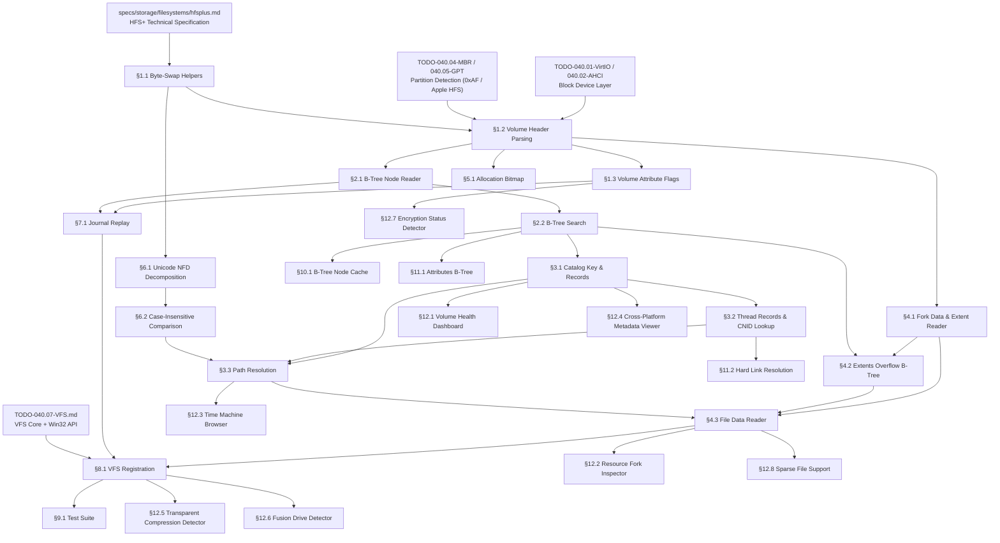

# 040.14-HFSPlus — HFS Plus (Mac OS Extended) Read-Only Driver

> **Goal:** Implement a read-only HFS+ driver for Impossible OS. The driver must
> parse the Volume Header, navigate B-tree structures (Catalog, Extents Overflow,
> Attributes), read files via fork data and extent descriptors, handle big-endian
> byte swapping on x86-64, support Unicode NFD name comparison, and replay the
> journal on dirty volumes. This enables reading macOS-formatted external drives,
> Time Machine backups, and cross-platform data exchange — essential for Apple
> hardware interoperability and data recovery.

> [!CAUTION]
> **Memory Rule:** Use `pmm_alloc_contiguous()` for B-tree node buffers, extent
> records, and journal replay buffers. `kmalloc` is ONLY for small kernel structs
> (≤ 4 KB). See `rules.md` Known Gotchas.

> [!WARNING]
> **Big-Endian Format.** ALL multi-byte on-disk fields are big-endian. Every
> `uint16_t`, `uint32_t`, and `uint64_t` must be byte-swapped after reading and
> before writing on x86-64. Failure causes garbage block addresses and corruption.

> [!IMPORTANT]
> **Spec Reference:** All offsets, field layouts, and algorithms reference the
> [HFS+ Specification](file:///home/derickpayne/impossible-os/specs/storage/filesystems/hfsplus.md).

---

## TODO Completion Roadmap

### Dependency Graph



### Phase-by-Phase Implementation Order

| Phase   | Sections                                                                   | Depends On             | Status |
| :-----: | -------------------------------------------------------------------------- | ---------------------- | :----: |
| **0**   | Prerequisites (spec, block device, partitions)                             | —                      |   ✅   |
| **1**   | §1.1 Byte-Swap, §1.2 Volume Header, §1.3 Attrs                           | Phase 0                |   ⬜   |
| **2**   | §2.1 B-Tree Node Reader, §2.2 B-Tree Search                              | Phase 1                |   ⬜   |
| **3**   | §3.1 Catalog Records, §3.2 Thread/CNID, §4.1 Forks                       | Phase 2                |   ⬜   |
| **4a**  | §3.3 Path Resolution, §4.2 Extents Overflow                              | Phase 3                |   ⬜   |
| **4b**  | §6.1 Unicode NFD, §6.2 Case-Insensitive Compare                          | Phase 1                |   ⬜   |
| **5**   | §4.3 File Data Reader, §7.1 Journal Replay                               | Phase 4a + 4b          |   ⬜   |
| **6**   | §8.1 VFS Registration                                                     | Phase 5 + VFS (040.07) |   ⬜   |
| **7a**  | §5.1 Allocation Bitmap, §10.1 Node Cache                                 | Phase 2                |   ⬜   |
| **7b**  | §11.1 Attributes B-Tree, §11.2 Hard Links                                | Phase 3                |   ⬜   |
| **8**   | §9.1 Test Suite                                                           | Phase 6                |   ⬜   |
| **8**   | §12.1–12.4 Health, Resource Fork, Time Machine, Metadata                  | Phase 3                |   ⬜   |
| **8**   | §12.5–12.8 Compression, Fusion Drive, Encryption, Sparse Files            | Phase 6                |   ⬜   |

> [!NOTE]
> **Phase 1** establishes the foundation — byte-swap helpers and volume header parsing.
> **Phase 2** builds the generic B-tree engine used by catalog, extents, and attributes.
> **Phases 3–5** deliver catalog browsing, file reading, and journal replay.
> **Phase 6** wires everything into VFS for a mountable, browsable HFS+ volume.
> **Phases 7–8** add robustness (caching, xattrs, hard links) and exclusive features (⭐).

> [!TIP]
> **Big-endian pitfall:** Every field read from disk must go through `hfs_be16/32/64`.
> Missing a single swap causes garbage addresses. Write a `hfs_read_volume_header()`
> that swaps ALL fields in one place — never read raw HFS+ structs without swapping.
>
> **QEMU testing:** Create test images with `mkfs.hfsplus` (from `hfsprogs` on Linux)
> or `hdiutil` on macOS. Attach as secondary AHCI/VirtIO drive.
>
> **Memory rule reminder:** B-tree nodes can be 4–32 KiB. Always allocate node
> buffers via `pmm_alloc_contiguous()`, never `kmalloc()`.

---

## 1. Volume Header & Foundation

### 1.1 Big-Endian Byte-Swap Helpers

**Prompt:** Implement `hfs_be16()`, `hfs_be32()`, and `hfs_be64()` byte-swap helper
functions for converting HFS+ big-endian on-disk fields to little-endian x86-64 host
order. Use `__builtin_bswap16/32/64` per spec §Byte Order. These are used by every
subsequent section. After completing all items, mark every item as `[x]`, update this
prompt to a verification prompt, run `bash scripts/build.sh clean`, and commit as
`"hfsplus: big-endian byte-swap helpers"`. After implementation, save gotchas to MCP memory.

- [ ] Implement `hfs_be16(uint16_t val)` → `__builtin_bswap16(val)`
- [ ] Implement `hfs_be32(uint32_t val)` → `__builtin_bswap32(val)`
- [ ] Implement `hfs_be64(uint64_t val)` → `__builtin_bswap64(val)`
- [ ] Place in `include/kernel/fs/hfsplus.h` as `static inline`
- [ ] Commit: `"hfsplus: big-endian byte-swap helpers"`

### 1.2 Volume Header Parsing

**Prompt:** Read the `HFSPlusVolumeHeader` from byte offset 1024 of the partition
(first 1024 bytes are reserved boot blocks). Validate signature `0x482B` (HFS+) or
`0x4858` (HFSX) at offset `0x0000`. Extract all critical fields: `blockSize`,
`totalBlocks`, `freeBlocks`, `nextCatalogID`, and the five `HFSPlusForkData` structs
for special files (allocation, extents, catalog, attributes, startup). Byte-swap
every field. Also read the Alternate Volume Header at offset 1024 bytes from the end
of the volume as a backup. Per spec §Volume Header. After completing all items, mark
every item as `[x]`, update this prompt to a verification prompt, run
`bash scripts/build.sh clean`, and commit as `"hfsplus: volume header parsing"`.
After implementation, save gotchas to MCP memory.

- [ ] Read 512 bytes from partition byte offset 1024 (skip boot blocks)
- [ ] Validate `signature` at `0x0000`: `0x482B` ('H+') or `0x4858` ('HX')
- [ ] Validate `version` at `0x0002`: `4` (HFS+) or `5` (HFSX)
  - [ ] If HFSX with unrecognized version → refuse mount (per spec CAUTION)
- [ ] Byte-swap and extract all fields:
  - [ ] `attributes` at `0x0004` (4B) — volume attribute flags
  - [ ] `lastMountedVersion` at `0x0008` (4B) — '8.10', '10.0', 'HFSJ', 'fsck'
  - [ ] `journalInfoBlock` at `0x000C` (4B) — alloc block # of JournalInfoBlock
  - [ ] `createDate` at `0x0010` (4B) — HFS+ epoch (1904-01-01)
  - [ ] `modifyDate` at `0x0014` (4B)
  - [ ] `fileCount` at `0x0020` (4B), `folderCount` at `0x0024` (4B)
  - [ ] `blockSize` at `0x0028` (4B) — allocation block size (power of 2, ≥ 512)
  - [ ] `totalBlocks` at `0x002C` (4B), `freeBlocks` at `0x0030` (4B)
  - [ ] `nextCatalogID` at `0x0040` (4B) — next CNID
  - [ ] `encodingsBitmap` at `0x0048` (8B)
  - [ ] `finderInfo` at `0x0050` (32B)
- [ ] Parse five `HFSPlusForkData` structs (80 bytes each):
  - [ ] `allocationFile` at `0x0070` — bitmap for block allocation
  - [ ] `extentsFile` at `0x00C0` — extents overflow B-tree
  - [ ] `catalogFile` at `0x0110` — catalog B-tree
  - [ ] `attributesFile` at `0x0160` — attributes B-tree
  - [ ] `startupFile` at `0x01B0` — startup file (typically ignored)
- [ ] Each `HFSPlusForkData`: `logicalSize` (8B), `clumpSize` (4B), `totalBlocks` (4B), `extents[8]` (64B)
- [ ] Read Alternate Volume Header: offset = volume_size − 1024 − 512
- [ ] Implement HFS+ epoch conversion: `unix_time = hfs_time - 2082844800`
- [ ] Log: `[hfsplus] Volume: %u blocks × %u bytes, %u free, %u files, %u folders`
- [ ] Log: `[hfsplus] Signature=%s, lastMounted=%s, CNID_next=%u`
- [ ] Commit: `"hfsplus: volume header parsing"`

### 1.3 Volume Attribute Flags

**Prompt:** Parse the volume `attributes` bit field. Check `kHFSVolumeUnmountedBit`
(bit 8) — if NOT set, the volume was not cleanly unmounted and journal replay is
needed. Check `kHFSVolumeJournaledBit` (bit 13) — if set, journal must be replayed
before any writes. Check `kHFSVolumeHardwareLockBit` (bit 7) and
`kHFSVolumeSoftwareLockBit` (bit 15) for write protection. Per spec §Volume Attributes.
After completing all items, mark every item as `[x]`, update this prompt to a
verification prompt, run `bash scripts/build.sh clean`, and commit as
`"hfsplus: volume attribute flags"`. After implementation, save gotchas to MCP memory.

- [ ] Define attribute bit constants:
  - [ ] `kHFSVolumeHardwareLockBit` (bit 7), `kHFSVolumeUnmountedBit` (bit 8)
  - [ ] `kHFSVolumeSparedBlocksBit` (bit 9), `kHFSVolumeNoCacheRequiredBit` (bit 10)
  - [ ] `kHFSBootVolumeInconsistentBit` (bit 11), `kHFSCatalogNodeIDsReusedBit` (bit 12)
  - [ ] `kHFSVolumeJournaledBit` (bit 13), `kHFSVolumeSoftwareLockBit` (bit 15)
- [ ] If `kHFSVolumeUnmountedBit` NOT set → dirty volume, log warning
- [ ] If `kHFSVolumeJournaledBit` set AND dirty → journal replay required
- [ ] If hardware or software lock → force read-only
- [ ] If `kHFSCatalogNodeIDsReusedBit` set → CNIDs have wrapped, log info
- [ ] Log: `[hfsplus] Attributes: journaled=%s, clean=%s, locked=%s`
- [ ] Commit: `"hfsplus: volume attribute flags"`

---

## 2. B-Tree Engine

### 2.1 B-Tree Node Reader

**Prompt:** Implement the generic B-tree node reader used by Catalog, Extents Overflow,
and Attributes files. Read node 0 (header node) to extract `BTHeaderRec`: `rootNode`,
`treeDepth`, `nodeSize`, `totalNodes`, `leafRecords`. Parse `BTNodeDescriptor` (14 bytes)
at the start of each node: `fLink`, `bLink`, `kind`, `height`, `numRecords`. Extract
records using the reverse offset array at the end of the node. Handle the misaligned
`clumpSize` at offset `0x20` in `BTHeaderRec`. Per spec §B-Tree Architecture.
After completing all items, mark every item as `[x]`, update this prompt to a
verification prompt, run `bash scripts/build.sh clean`, and commit as
`"hfsplus: B-tree node reader"`. After implementation, save gotchas to MCP memory.

- [ ] Implement `hfs_btree_open(vol, fork_data)`:
  - [ ] Read first extent from `HFSPlusForkData` to locate B-tree on disk
  - [ ] Read node 0 (header node, size may be unknown — read minimum 512 bytes first)
  - [ ] Parse `BTNodeDescriptor`: verify `kind == kBTHeaderNode` (1)
- [ ] Parse `BTHeaderRec` (first record in node 0, 106 bytes):
  - [ ] `treeDepth` at `0x00` (2B), `rootNode` at `0x02` (4B)
  - [ ] `leafRecords` at `0x06` (4B), `firstLeafNode` at `0x0A` (4B)
  - [ ] `lastLeafNode` at `0x0E` (4B), `nodeSize` at `0x12` (2B)
  - [ ] `maxKeyLength` at `0x14` (2B), `totalNodes` at `0x16` (4B)
  - [ ] `freeNodes` at `0x1A` (4B)
  - [ ] `clumpSize` at `0x20` (4B) — **misaligned**, use unaligned read
  - [ ] `btreeType` at `0x24` (1B), `keyCompareType` at `0x25` (1B)
  - [ ] `attributes` at `0x26` (4B)
- [ ] Implement `hfs_btree_read_node(btree, node_number)`:
  - [ ] Calculate byte offset: `node_number × nodeSize`
  - [ ] Map to allocation blocks using fork extents
  - [ ] Read `nodeSize` bytes, allocate via `pmm_alloc_contiguous()`
  - [ ] Parse `BTNodeDescriptor`, byte-swap all fields
- [ ] Implement record extraction from node:
  - [ ] Read offset array from end of node (reverse order, `numRecords + 1` entries)
  - [ ] Each offset is big-endian `uint16_t`
  - [ ] Record N starts at `offset[N]`, length = `offset[N+1] - offset[N]`
- [ ] Define node kind constants: `kBTLeafNode` (-1), `kBTIndexNode` (0), `kBTHeaderNode` (1), `kBTMapNode` (2)
- [ ] Log: `[hfsplus] B-tree: nodeSize=%u, rootNode=%u, depth=%u, leafRecords=%u`
- [ ] Commit: `"hfsplus: B-tree node reader"`

### 2.2 B-Tree Search

**Prompt:** Implement B-tree key search starting from the root node. For index nodes
(`kBTIndexNode`), binary search records to find the child pointer, read the child
node, and recurse. For leaf nodes (`kBTLeafNode`), binary search for the exact key
match. The key comparison function is injected by the caller (catalog uses CNID +
Unicode name; extents uses fileID + forkType + startBlock). Per spec §Search Algorithm.
After completing all items, mark every item as `[x]`, update this prompt to a
verification prompt, run `bash scripts/build.sh clean`, and commit as
`"hfsplus: B-tree search"`. After implementation, save gotchas to MCP memory.

- [ ] Implement `hfs_btree_search(btree, key, compare_fn, result)`:
  - [ ] Read root node from `btree->rootNode`
  - [ ] If `kind == kBTIndexNode`: binary search, extract child node #, recurse
  - [ ] If `kind == kBTLeafNode`: binary search for exact match
  - [ ] Return record data on match, or NOT_FOUND
- [ ] Index record format: key + 4-byte child node number (big-endian)
- [ ] Implement `hfs_btree_enumerate(btree, start_key, compare_fn, callback)`:
  - [ ] Find first matching leaf record
  - [ ] Walk forward via `fLink` pointers for range queries (directory listing)
- [ ] Handle empty tree: `rootNode == 0` and `treeDepth == 0`
- [ ] Commit: `"hfsplus: B-tree search"`

---

## 3. Catalog File

### 3.1 Catalog Key & Record Parsing

**Prompt:** Implement catalog B-tree key comparison and record parsing. Catalog keys
contain `parentID` (CNID, uint32) + `nodeName` (HFSUniStr255, UTF-16 BE). Compare
first by `parentID`, then by `nodeName` using case-insensitive Unicode comparison
(or binary for HFSX). Parse the four record types: folder (0x0001), file (0x0002),
folder thread (0x0003), file thread (0x0004). Extract POSIX permissions from
`HFSPlusBSDInfo`. Per spec §Catalog File. After completing all items, mark every
item as `[x]`, update this prompt to a verification prompt, run
`bash scripts/build.sh clean`, and commit as `"hfsplus: catalog records"`.
After implementation, save gotchas to MCP memory.

- [ ] Open catalog B-tree from `vol->catalogFile` fork data
- [ ] Define reserved CNIDs: root parent (1), root folder (2), extents file (3), catalog (4), bad blocks (5), allocation (6), startup (7), attributes (8), first user (16)
- [ ] Implement catalog key comparison:
  - [ ] Compare `parentID` as unsigned 32-bit first
  - [ ] If equal, compare `nodeName` via Unicode comparison (§6)
- [ ] Parse `HFSPlusCatalogFolder` (recordType 0x0001):
  - [ ] `valence`, `folderID`, dates, `HFSPlusBSDInfo`, Finder info
- [ ] Parse `HFSPlusCatalogFile` (recordType 0x0002, 248 bytes):
  - [ ] `fileID`, dates, `HFSPlusBSDInfo`, flags, `dataFork`, `resourceFork`
- [ ] Parse `HFSPlusBSDInfo` (16 bytes): `ownerID`, `groupID`, `adminFlags`, `ownerFlags`, `fileMode`, `special` union
- [ ] Parse `fileMode` for POSIX type: `0x8` = regular, `0x4` = directory, `0xA` = symlink
- [ ] Log: `[hfsplus] Catalog: CNID=%u, type=%s, name=%s`
- [ ] Commit: `"hfsplus: catalog records"`

### 3.2 Thread Records & CNID Lookup

**Prompt:** Implement thread record lookup for reverse CNID-to-name resolution.
Thread records use key `(parentID=target_CNID, nodeName="")` and return the parent
folder CNID and original name. Both file threads (0x0004) and folder threads (0x0003)
are required in HFS+. Per spec §HFSPlusCatalogThread. After completing all items,
mark every item as `[x]`, update this prompt to a verification prompt, run
`bash scripts/build.sh clean`, and commit as `"hfsplus: thread records and CNID lookup"`.
After implementation, save gotchas to MCP memory.

- [ ] Implement `hfs_catalog_get_thread(vol, cnid, thread_out)`:
  - [ ] Search catalog B-tree with key `(parentID=cnid, nodeName="")`
  - [ ] Parse `HFSPlusCatalogThread`: `parentID`, `nodeName`
- [ ] Implement `hfs_catalog_get_record(vol, cnid)`:
  - [ ] First get thread → yields `parentID` + `nodeName`
  - [ ] Then search with key `(parentID=thread.parentID, nodeName=thread.nodeName)`
  - [ ] Return folder or file record
- [ ] On mount: verify CNID 2 (root folder) exists and is a directory
- [ ] Commit: `"hfsplus: thread records and CNID lookup"`

### 3.3 Path Resolution

**Prompt:** Implement full path resolution by splitting the path, starting at root
folder CNID 2, and recursively looking up each component in the catalog B-tree.
For each component, search with key `(parentID=current_CNID, nodeName=component)`.
Handle symlinks via `HFSPlusBSDInfo.fileMode`. Per spec §Catalog Tree Usage.
After completing all items, mark every item as `[x]`, update this prompt to a
verification prompt, run `bash scripts/build.sh clean`, and commit as
`"hfsplus: path resolution"`. After implementation, save gotchas to MCP memory.

- [ ] Implement `hfs_resolve_path(vol, path)`:
  - [ ] Start at CNID 2 (root folder)
  - [ ] Split path by `/` (VFS layer normalizes `\` to `/`)
  - [ ] For each component: search catalog for `(current_CNID, component)`
  - [ ] If folder → update current_CNID, continue
  - [ ] If file → return file record (must be last component)
  - [ ] If not found → return `HFS_ERR_NOT_FOUND`
- [ ] Handle symlinks: `fileMode & 0xF000 == 0xA000`
  - [ ] Read symlink target from data fork
  - [ ] Recursion limit: max 8 follows
- [ ] Commit: `"hfsplus: path resolution"`

---

## 4. File Data Access

### 4.1 Fork Data & Extent Reader

**Prompt:** Implement reading file data through `HFSPlusForkData`. Each fork stores
`logicalSize` and up to 8 inline `HFSPlusExtentDescriptor` entries (`startBlock` +
`blockCount`). Convert logical file offset to allocation block, scan extents to find
the physical block, read from disk. Per spec §Fork Data Structure.
After completing all items, mark every item as `[x]`, update this prompt to a
verification prompt, run `bash scripts/build.sh clean`, and commit as
`"hfsplus: fork data and extent reader"`. After implementation, save gotchas to MCP memory.

- [ ] Implement `hfs_fork_read(vol, fork, offset, length, buffer)`:
  - [ ] Calculate starting allocation block: `offset / vol->blockSize`
  - [ ] Walk `fork->extents[0..7]` to find extent containing target block
  - [ ] Physical byte offset: `(extent.startBlock + offset_within_extent) × blockSize`
  - [ ] Read from disk, handle partial reads at start/end
  - [ ] Cap at `fork->logicalSize`
- [ ] Skip extents with `startBlock == 0 && blockCount == 0` (unused)
- [ ] If file needs > 8 extents → fall through to Extents Overflow (§4.2)
- [ ] Commit: `"hfsplus: fork data and extent reader"`

### 4.2 Extents Overflow B-Tree

**Prompt:** For files with more than 8 extents, additional extents are stored in the
Extents Overflow B-tree. Keys are `HFSPlusExtentKey`: `forkType` (0x00=data, 0xFF=resource),
`fileID` (CNID), `startBlock` (allocation block offset in fork). Each record is an
`HFSPlusExtentRecord` (8 more extent descriptors). Per spec §Extents Overflow File.
After completing all items, mark every item as `[x]`, update this prompt to a
verification prompt, run `bash scripts/build.sh clean`, and commit as
`"hfsplus: extents overflow B-tree"`. After implementation, save gotchas to MCP memory.

- [ ] Open extents overflow B-tree from `vol->extentsFile` fork data
- [ ] Implement extent key comparison: `fileID`, then `forkType`, then `startBlock`
- [ ] Implement `hfs_extents_lookup(vol, fileID, forkType, fork_block)`:
  - [ ] Search extents B-tree for the record covering `fork_block`
  - [ ] Return the matching `HFSPlusExtentDescriptor`
- [ ] Integrate with fork reader: if inline extents exhausted, query overflow
- [ ] Commit: `"hfsplus: extents overflow B-tree"`

### 4.3 File Data Reader

**Prompt:** Combine fork data + extents overflow into a unified file read API.
Given a file's catalog record, read arbitrary byte ranges from either the data fork
or resource fork. Handle files spanning many extents seamlessly.
After completing all items, mark every item as `[x]`, update this prompt to a
verification prompt, run `bash scripts/build.sh clean`, and commit as
`"hfsplus: file data reader"`. After implementation, save gotchas to MCP memory.

- [ ] Implement `hfs_read_file(vol, file_record, offset, length, buffer)`:
  - [ ] Build complete extent list: inline (8) + overflow entries
  - [ ] Binary search for starting extent
  - [ ] Read blocks, handle extent boundaries
  - [ ] Cap at `dataFork.logicalSize`
- [ ] Support resource fork reads: same logic with `resourceFork` data
- [ ] Commit: `"hfsplus: file data reader"`

---

## 5. Allocation Bitmap

### 5.1 Allocation Bitmap Reader

**Prompt:** Read the allocation file (a flat bitmap, not a B-tree) to determine
which blocks are free/used. Bit N corresponds to allocation block N. Bit 1 = used,
0 = free. The allocation file's location comes from `allocationFile` fork data in
the volume header. Per spec §Allocation File. After completing all items, mark every
item as `[x]`, update this prompt to a verification prompt, run
`bash scripts/build.sh clean`, and commit as `"hfsplus: allocation bitmap reader"`.
After implementation, save gotchas to MCP memory.

- [ ] Read allocation file via `vol->allocationFile` fork data
- [ ] Implement `hfs_is_block_used(vol, block_number)`:
  - [ ] Byte index: `block_number / 8`
  - [ ] Bit index: `block_number % 8` (MSB first — bit 7 is block 0 in each byte)
- [ ] Implement `hfs_count_free_blocks(vol)` — scan entire bitmap
- [ ] Verify against `vol->freeBlocks` from header
- [ ] Log: `[hfsplus] Allocation bitmap: %u/%u blocks free`
- [ ] Commit: `"hfsplus: allocation bitmap reader"`

---

## 6. Unicode & String Comparison

### 6.1 Unicode NFD Decomposition

**Prompt:** Implement the frozen Unicode 3.2 NFD decomposition required for HFS+
filename storage and comparison. Composite characters must be decomposed into base +
combining marks (e.g., ü → u + ¨). The tables are frozen to Unicode 3.2 — newer
decompositions must NOT be used. Per spec §Unicode Normalization.
After completing all items, mark every item as `[x]`, update this prompt to a
verification prompt, run `bash scripts/build.sh clean`, and commit as
`"hfsplus: unicode NFD decomposition"`. After implementation, save gotchas to MCP memory.

- [ ] Implement frozen Unicode 3.2 decomposition table (lookup table approach)
- [ ] Implement `hfs_decompose_utf16(input, input_len, output, output_max)`:
  - [ ] For each UTF-16 character, look up decomposition
  - [ ] If decomposition exists → emit base + combining marks
  - [ ] If no decomposition → emit character as-is
  - [ ] Apply canonical ordering of combining marks
- [ ] Table size: ~2000 entries covering BMP decompositions used in practice
- [ ] Commit: `"hfsplus: unicode NFD decomposition"`

### 6.2 Case-Insensitive Comparison

**Prompt:** Implement Apple's frozen case-folding comparison for HFS+ catalog key
matching. For standard HFS+ (not case-sensitive HFSX), both strings must be NFD-
decomposed, then case-folded using Apple's table, then compared. For HFSX with
`keyCompareType == kHFSBinaryCompare` (1), compare raw UTF-16 values without folding.
Per spec §Case-Insensitive Comparison. After completing all items, mark every item
as `[x]`, update this prompt to a verification prompt, run `bash scripts/build.sh clean`,
and commit as `"hfsplus: case-insensitive comparison"`. After implementation, save
gotchas to MCP memory.

- [ ] Implement Apple case-folding table (frozen Unicode 3.2)
- [ ] Implement `hfs_compare_names(a, a_len, b, b_len, case_sensitive)`:
  - [ ] If `case_sensitive` → binary compare of raw uint16 values
  - [ ] Else → decompose both, case-fold both, compare
- [ ] Wire into catalog key comparison function
- [ ] Test: 'Ä' == 'ä', 'é' == 'É', 'ß' != 'ss' (Unicode 3.2 behavior)
- [ ] Commit: `"hfsplus: case-insensitive comparison"`

---

## 7. Journaling

### 7.1 Journal Replay

**Prompt:** Implement journal replay for dirty HFS+ volumes. Read `JournalInfoBlock`
from the allocation block in `journalInfoBlock` header field. Read `journal_header`
from the byte offset in `JournalInfoBlock.offset`. Verify magic `0x4A4E4C78` ("JNLx")
and endian `0x12345678`. If `start != end`, replay transactions: walk `block_list_header`
chains, write each `block_info` entry's data to its destination block. Handle circular
buffer wrapping. Verify checksums. Per spec §Journaling. After completing all items,
mark every item as `[x]`, update this prompt to a verification prompt, run
`bash scripts/build.sh clean`, and commit as `"hfsplus: journal replay"`.
After implementation, save gotchas to MCP memory.

> [!CAUTION]
> Journal replay **writes** to the volume to restore metadata consistency. For a
> read-only driver, this is the ONE exception where writes are necessary. Without
> replay, a dirty journaled volume has inconsistent B-trees and allocation state.

- [ ] Read `JournalInfoBlock` from `vol->journalInfoBlock` allocation block
  - [ ] Verify `flags & kJIJournalInFSMask` — only in-volume journals supported
- [ ] Read `journal_header` from `JournalInfoBlock.offset`:
  - [ ] Verify `magic == 0x4A4E4C78` and `endian == 0x12345678`
  - [ ] If `start == end` → clean journal, no replay needed
- [ ] Replay transactions (if `start != end`):
  - [ ] Walk `block_list_header` at offset `start`
  - [ ] Verify checksum via `calc_checksum()` (spec algorithm)
  - [ ] For `binfo[1..num_blocks-1]`: read data from journal, write to `binfo[i].bnum`
  - [ ] Follow `binfo[0].next` to next block list header
  - [ ] Handle circular wrapping: if offset > `size`, wrap to journal start
  - [ ] After all transactions: set `start = end`, flush journal header
- [ ] Update volume header after replay
- [ ] Log: `[hfsplus] Journal: replayed %u transactions (%u blocks)`
- [ ] Commit: `"hfsplus: journal replay"`

---

## 8. VFS Integration

### 8.1 HFS+ VFS Driver Registration

**Prompt:** Register HFS+ as a VFS filesystem driver. Implement `vfs_ops` callbacks:
`open`, `close`, `read`, `readdir`, `finddir`, `stat`. Write callbacks return `-EROFS`.
Detect HFS+ partitions during scanning by checking signature `0x482B`/`0x4858` at
partition offset 1024. Support both GPT type GUID `48465300-0000-11AA-AA11-00306543ECAC`
(already in `gpt.c`) and MBR type `0xAF`. After completing all items, mark every item
as `[x]`, update this prompt to a verification prompt, run `bash scripts/build.sh clean`,
and commit as `"hfsplus: VFS driver registration"`. After implementation, save gotchas
to MCP memory.

- [ ] Create `src/kernel/fs/hfsplus.c` and `include/kernel/fs/hfsplus.h`
- [ ] Define `struct hfsplus_volume` — header data, catalog/extents/attrs B-tree handles
- [ ] Implement `hfsplus_detect(blkdev)`:
  - [ ] Read 512 bytes at partition offset 1024
  - [ ] Check signature `0x482B` or `0x4858` (after byte-swap)
- [ ] Register partition types:
  - [ ] MBR type `0xAF`
  - [ ] GPT GUID `48465300-0000-11AA-AA11-00306543ECAC` (already in `gpt.c`)
- [ ] Implement `vfs_ops` callbacks:
  - [ ] `hfsplus_open(node, flags)` — look up catalog record, cache extents
  - [ ] `hfsplus_close(node)` — free cached data
  - [ ] `hfsplus_read(node, offset, size, buf)` — fork data read
  - [ ] `hfsplus_readdir(node, index)` — enumerate catalog children via B-tree walk
  - [ ] `hfsplus_finddir(node, name)` — catalog B-tree key search
  - [ ] `hfsplus_stat(node, stat)` — populate from catalog record + BSD info
  - [ ] Write ops → return `-EROFS`
- [ ] Log: `[hfsplus] Mounted %s volume on drive %c: (%llu bytes, %u files)`
- [ ] Commit: `"hfsplus: VFS driver registration"`

---

## 9. Testing

### 9.1 HFS+ Test Suite

**Prompt:** Create HFS+ test disk images and validate all driver functionality.
After completing all items, mark every item as `[x]`, update this prompt to a
verification prompt, run `bash scripts/build.sh clean`, and commit as
`"test: HFS+ filesystem test suite"`. After implementation, save gotchas to MCP memory.

> [!TIP]
> **Creating test images on Linux:**
> ```bash
> sudo apt install hfsprogs
> dd if=/dev/zero of=test_hfsplus.raw bs=1M count=256
> mkfs.hfsplus -v TestHFS test_hfsplus.raw
> mkfs.hfsplus -v TestHFS -J test_hfsplus_journaled.raw
> ```
>
> **QEMU flags:**
> ```bash
> -drive file=test_hfsplus.raw,format=raw,if=none,id=hfs \
> -device ide-hd,drive=hfs,bus=ahci0.1
> ```

- [ ] Test image: basic HFS+ volume with files in root directory
  - [ ] Verify: volume header parsing, catalog B-tree, root folder listing
- [ ] Test image: file with known content → read and compare byte-exact
- [ ] Test image: file with > 8 extents (fragmented)
  - [ ] Verify: extents overflow B-tree lookup
- [ ] Test image: deep directory path (a/b/c/d/e/file.txt)
  - [ ] Verify: recursive path resolution
- [ ] Test image: journaled HFS+ (`mkfs.hfsplus -J`)
  - [ ] Verify: journal detection, clean journal → no replay needed
- [ ] Test image: case-insensitive name matching
  - [ ] Verify: 'README.TXT' == 'readme.txt'
- [ ] Test image: Unicode names with diacritics
  - [ ] Verify: NFD decomposition and comparison
- [ ] Test image: resource fork file
  - [ ] Verify: both data and resource fork readable
- [ ] QEMU: attach as secondary AHCI drive, verify serial output
- [ ] Commit: `"test: HFS+ filesystem test suite"`

---

## 10. Performance

### 10.1 B-Tree Node Cache

**Prompt:** Implement an LRU cache for B-tree nodes to avoid redundant disk reads.
Cache separately for catalog, extents, and attributes B-trees. Pin frequently-
accessed nodes: header node (0), root node, first leaf node.
After completing all items, mark every item as `[x]`, update this prompt to a
verification prompt, run `bash scripts/build.sh clean`, and commit as
`"hfsplus: B-tree node cache"`. After implementation, save gotchas to MCP memory.

- [ ] Implement per-B-tree LRU node cache:
  - [ ] Default 64 entries (configurable via Registry: `HKLM\SYSTEM\Storage\hfsplus\NodeCacheSize`)
  - [ ] Key: node number, Value: parsed node buffer
  - [ ] On `hfs_btree_read_node()`: check cache first, read disk on miss
- [ ] Pin header node (0) and root node — never evict
- [ ] Telemetry: log on unmount: `[hfsplus] Node cache: %u hits / %u lookups (%.1f%%)`
- [ ] Commit: `"hfsplus: B-tree node cache"`

---

## 11. Extended Features

### 11.1 Attributes B-Tree

**Prompt:** Implement the attributes B-tree for extended attributes and named forks.
The attributes file may not exist — check if `attributesFile` first extent has zero
blocks. Support three record types: inline data (0x10), fork data (0x20), and
extension extents (0x30). Per spec §Attributes File. After completing all items,
mark every item as `[x]`, update this prompt to a verification prompt, run
`bash scripts/build.sh clean`, and commit as `"hfsplus: attributes B-tree"`.
After implementation, save gotchas to MCP memory.

- [ ] Check if attributes file exists (first extent blockCount > 0)
- [ ] Open attributes B-tree from `vol->attributesFile` fork data
- [ ] Parse attribute record types:
  - [ ] `kHFSPlusAttrInlineData` (0x10) — small attributes stored inline
  - [ ] `kHFSPlusAttrForkData` (0x20) — large attributes in separate extents
  - [ ] `kHFSPlusAttrExtents` (0x30) — overflow extents for large attributes
- [ ] Implement `hfs_get_xattr(vol, cnid, name, buffer, size)`
- [ ] Implement `hfs_list_xattrs(vol, cnid, callback)`
- [ ] Commit: `"hfsplus: attributes B-tree"`

### 11.2 Hard Link Resolution

**Prompt:** Implement hard link resolution for files and directories. File hard links
have Finder type `hlnk`/creator `hfs+` and store the inode CNID in
`HFSPlusBSDInfo.special.iNodeNum`. The actual file data is in the hidden metadata
directory `\x00\x00\x00\x00HFS+ Private Data` as `iNode<CNID>`. Directory hard links
use `\x00\x00\x00\x00HFS+ Private Dir Data\x0d` with entries `dir_<CNID>`.
Per spec §Hard Links. After completing all items, mark every item as `[x]`, update
this prompt to a verification prompt, run `bash scripts/build.sh clean`, and commit
as `"hfsplus: hard link resolution"`. After implementation, save gotchas to MCP memory.

- [ ] Detect file hard links: Finder type `hlnk`, creator `hfs+`
- [ ] Read `special.iNodeNum` from `HFSPlusBSDInfo`
- [ ] Look up actual file in metadata directory by CNID
- [ ] Detect directory hard links: entries named `dir_<CNID>`
- [ ] Implement transparent resolution in `hfsplus_open()`
- [ ] Commit: `"hfsplus: hard link resolution"`

---

## 12. Exclusive Features (🚀 Impossible OS)

### 12.1 Volume Health Dashboard

**Prompt:** Surface HFS+ volume health in Disk Manager. Read: clean/dirty state from
`kHFSVolumeUnmountedBit`, journal status, error indicators from volume attributes,
free space, and B-tree consistency. Neither Windows nor Linux provides a GUI health
view for HFS+ volumes. After completing all items, mark every item as `[x]`, update
this prompt to a verification prompt, run `bash scripts/build.sh clean`, and commit
as `"hfsplus: volume health dashboard"`. After implementation, save gotchas to MCP memory.

> [!TIP]
> **Competitive Edge:** Windows can't read HFS+ at all. Linux mounts HFS+ but
> provides no health GUI. Impossible OS can show volume state, journal health,
> and B-tree integrity at a glance.

- [ ] Read volume clean state: `kHFSVolumeUnmountedBit` (bit 8)
- [ ] Read journal status: journaled + dirty = needs replay
- [ ] Read `lastMountedVersion` — detect if last unmount was by `fsck`
- [ ] Display free space: `freeBlocks / totalBlocks × 100%`
- [ ] Validate catalog B-tree header: `treeDepth`, `leafRecords` consistency
- [ ] Validate alternate volume header matches primary
- [ ] Aggregate health score: Healthy / Needs Attention / Errors Detected
- [ ] Wire to Disk Manager: HFS+ volume properties panel
- [ ] Commit: `"hfsplus: volume health dashboard"`

### 12.2 Resource Fork Inspector (🚀 Impossible OS Feature)

**Prompt:** HFS+ uniquely supports resource forks — a second data stream per file
used by classic Mac applications for icons, UI layouts, and localized strings.
No other OS surfaces resource fork contents in a GUI. Implement a viewer that shows
resource fork size, type/creator codes from Finder info, and optionally displays
structured resource data. After completing all items, mark every item as `[x]`,
update this prompt to a verification prompt, run `bash scripts/build.sh clean`,
and commit as `"hfsplus: resource fork inspector"`. After implementation, save
gotchas to MCP memory.

> [!TIP]
> **Competitive Edge:** Resource forks are unique to HFS+/HFS. Windows ignores them
> entirely. Linux mounts HFS+ but provides no way to browse resource fork contents
> in a GUI. Impossible OS can be the first non-macOS system to visually inspect
> resource forks — valuable for legacy Mac data recovery and digital preservation.

- [ ] Read resource fork via `file_record->resourceFork`
- [ ] Display resource fork size alongside data fork size in file properties
- [ ] Read Finder info: file type (4 bytes) + creator code (4 bytes)
- [ ] Display type/creator in file properties (e.g., 'TEXT'/'ttxt')
- [ ] Wire to File Manager: "Resource Fork" tab in file properties
- [ ] Commit: `"hfsplus: resource fork inspector"`

### 12.3 Time Machine Backup Browser (🚀 Impossible OS Feature)

**Prompt:** Time Machine backups are stored on HFS+ volumes using directory hard links
to create space-efficient snapshots. Each backup is a date-stamped directory containing
a full filesystem tree, with unchanged files hard-linked to previous backups.
Implement a browser that detects Time Machine volume structure, lists available
backup dates, and allows browsing/restoring individual files from any snapshot.
After completing all items, mark every item as `[x]`, update this prompt to a
verification prompt, run `bash scripts/build.sh clean`, and commit as
`"hfsplus: Time Machine backup browser"`. After implementation, save gotchas to MCP memory.

> [!TIP]
> **Competitive Edge:** Windows cannot read Time Machine backups at all. Linux can
> mount the HFS+ volume but has no Time Machine-aware browsing — users must
> manually navigate date-stamped directories. Impossible OS can provide a
> timeline-based UI for browsing and restoring Time Machine backups.

- [ ] Detect Time Machine volume: look for `Backups.backupdb` directory in root
- [ ] List backup sets: enumerate computer name directories
- [ ] List snapshots: parse date-stamped directories (YYYY-MM-DD-HHMMSS)
- [ ] Display timeline of available backups with sizes
- [ ] Browse files within any snapshot (follow directory hard links)
- [ ] Restore: copy files from snapshot to local volume
- [ ] Wire to File Manager: "Time Machine Backups" view for HFS+ volumes
- [ ] Commit: `"hfsplus: Time Machine backup browser"`

### 12.4 Cross-Platform Metadata Viewer (🚀 Impossible OS Feature)

**Prompt:** HFS+ stores rich Apple-specific metadata: Finder info, file type/creator
codes, POSIX permissions in `HFSPlusBSDInfo`, text encoding hints, and extended
attributes. Display all metadata in a unified panel. Convert HFS+ epoch dates to
human-readable format. Show encoding bitmap. After completing all items, mark every
item as `[x]`, update this prompt to a verification prompt, run
`bash scripts/build.sh clean`, and commit as `"hfsplus: cross-platform metadata viewer"`.
After implementation, save gotchas to MCP memory.

> [!TIP]
> **Competitive Edge:** Windows shows nothing for HFS+ files. Linux `stat` shows
> basic POSIX metadata but not Finder info, type/creator codes, or encoding hints.
> Impossible OS can display the full HFS+ metadata set in a single panel.

- [ ] Display all 5 timestamps in human-readable format (converted from HFS+ epoch)
- [ ] Show Finder info: file type, creator code, folder window position
- [ ] Show POSIX permissions: owner, group, mode (from `HFSPlusBSDInfo`)
- [ ] Show text encoding hint from catalog record
- [ ] Show volume encoding bitmap (which text encodings are used)
- [ ] Show catalog node ID (CNID) and hard link count
- [ ] Wire to File Properties panel for HFS+ volumes
- [ ] Commit: `"hfsplus: cross-platform metadata viewer"`

### 12.5 Transparent Compression Detector (🚀 Impossible OS Feature)

**Prompt:** macOS 10.6+ introduced transparent HFS+ compression using the
`com.apple.decmpfs` extended attribute. Compressed files have the
`UF_COMPRESSED` flag set in `HFSPlusBSDInfo.ownerFlags`. The compression
resource fork or xattr stores the actual data. Neither Windows nor Linux
surfaces compression info for HFS+ files. Detect compressed files and
display compression ratio, algorithm type, and original vs. compressed size.
After completing all items, mark every item as `[x]`, update this prompt to a
verification prompt, run `bash scripts/build.sh clean`, and commit as
`"hfsplus: transparent compression detector"`. After implementation, save
gotchas to MCP memory.

> [!TIP]
> **Competitive Edge:** macOS applies transparent compression silently.
> Linux's `hfsplus` module ignores `UF_COMPRESSED` — compressed files read
> as zero bytes. Impossible OS can detect and report compression, and
> optionally decompress for correct file reading.

- [ ] Detect `UF_COMPRESSED` flag (bit 5) in `HFSPlusBSDInfo.ownerFlags`
- [ ] Read `com.apple.decmpfs` extended attribute via Attributes B-Tree (§11.1)
- [ ] Parse compression header: magic `0x636D7066` ("cmpf"), type, uncompressed size
- [ ] Support Type 3 (zlib in xattr) and Type 4 (zlib in resource fork)
- [ ] Display in File Properties: compressed size, original size, ratio, algorithm
- [ ] Log: `[hfsplus] Compressed file CNID=%u: %u → %u bytes (%.1f%%)`
- [ ] Commit: `"hfsplus: transparent compression detector"`

### 12.6 Fusion Drive Detector (🚀 Impossible OS Feature)

**Prompt:** Apple Fusion Drives combine an SSD and HDD into a single Core
Storage logical volume. A Fusion Drive HFS+ volume has a Core Storage
Physical Volume Header at sector 0 of the partition (magic `0x4353`). The
volume is identified by `lastMountedVersion` containing `CS` and the presence
of Core Storage metadata. Detect Fusion Drive volumes and display the
tier layout (SSD + HDD) and volume UUID in Disk Manager. After completing
all items, mark every item as `[x]`, update this prompt to a verification
prompt, run `bash scripts/build.sh clean`, and commit as
`"hfsplus: Fusion Drive detector"`. After implementation, save gotchas to
MCP memory.

> [!TIP]
> **Competitive Edge:** Windows cannot read Fusion Drives at all. Linux
> mounts the HFS+ layer but has no awareness of the Core Storage tier
> structure. Impossible OS can identify and report Fusion Drive layouts.

- [ ] Check `lastMountedVersion` for Core Storage signatures
- [ ] Detect Core Storage PV header magic `0x4353` at partition start
- [ ] Read Core Storage volume group UUID if present
- [ ] Display in Disk Manager: "Fusion Drive (SSD + HDD)", volume UUID
- [ ] Log: `[hfsplus] Fusion Drive detected: group=%s`
- [ ] Commit: `"hfsplus: Fusion Drive detector"`

### 12.7 Encryption Status Detector (🚀 Impossible OS Feature)

**Prompt:** macOS 10.7+ FileVault 2 uses Core Storage encryption on HFS+
volumes. Encrypted volumes have `kHFSVolumeJournaledBit` set and the Core
Storage layer presents a locked logical volume. Detect encryption markers
and display status (encrypted/decrypted/locked) in Disk Manager. Do NOT
attempt decryption — just report status. After completing all items, mark
every item as `[x]`, update this prompt to a verification prompt, run
`bash scripts/build.sh clean`, and commit as
`"hfsplus: encryption status detector"`. After implementation, save gotchas
to MCP memory.

> [!TIP]
> **Competitive Edge:** Windows shows encrypted HFS+ volumes as "unknown".
> Linux's `hfsplus` module fails silently on encrypted volumes. Impossible OS
> can identify FileVault-encrypted drives and display their encryption status.

- [ ] Detect Core Storage encryption markers in volume metadata
- [ ] Check for `com.apple.corestorage.lv.encrypted` xattr
- [ ] Report encryption type: FileVault 2 (AES-XTS 128/256)
- [ ] Display in Disk Manager: lock icon, "Encrypted (FileVault 2)"
- [ ] Log: `[hfsplus] Encrypted volume detected: FileVault 2, status=%s`
- [ ] Commit: `"hfsplus: encryption status detector"`

### 12.8 Sparse File Reporting (🚀 Impossible OS Feature)

**Prompt:** HFS+ supports sparse files via extent descriptors — gaps in the
extent list represent zero-filled regions. Detect sparse files by checking
if the total extent block count is less than `logicalSize / blockSize`.
Report sparse file status and the actual disk space consumed vs. logical size.
After completing all items, mark every item as `[x]`, update this prompt to a
verification prompt, run `bash scripts/build.sh clean`, and commit as
`"hfsplus: sparse file reporting"`. After implementation, save gotchas to
MCP memory.

> [!TIP]
> **Competitive Edge:** Linux's `hfsplus` module reads sparse files but
> doesn't report sparseness. `du` vs `ls -l` discrepancies confuse users.
> Impossible OS can show actual vs. logical size in File Properties.

- [ ] Detect sparse files: sum of extent `blockCount` < `logicalSize / blockSize`
- [ ] Calculate actual disk usage vs. logical file size
- [ ] Display in File Properties: "Sparse file: 2.1 GB logical, 800 MB on disk"
- [ ] Report sparseness percentage in directory listings
- [ ] Commit: `"hfsplus: sparse file reporting"`

---

## Priority Order

| ⭐ | Priority | Section                             | Description                                                            |
| -- | -------- | ----------------------------------- | ---------------------------------------------------------------------- |
| 💎 | 🔴 P0   | 1.1 Byte-Swap Helpers               | Foundation — every field read depends on this                          |
| 💎 | 🔴 P0   | 1.2 Volume Header Parsing           | Foundation — locate all special files                                  |
| 💎 | 🔴 P0   | 1.3 Volume Attribute Flags          | Safety — detect dirty/locked/journaled state                           |
| 💎 | 🔴 P0   | 2.1 B-Tree Node Reader              | Foundation — generic engine for all B-trees                            |
| 💎 | 🔴 P0   | 2.2 B-Tree Search                   | Foundation — navigate catalog and extents trees                        |
| 💎 | 🔴 P0   | 3.1 Catalog Key & Records           | Foundation — parse file/folder entries                                  |
| 💎 | 🟠 P1   | 3.2 Thread Records & CNID           | Metadata — reverse lookups, root folder validation                     |
| 💎 | 🟠 P1   | 3.3 Path Resolution                 | Core — resolve full file paths                                         |
| 💎 | 🟠 P1   | 4.1 Fork Data & Extent Reader       | Core — read file data from extents                                     |
| 💎 | 🟠 P1   | 4.2 Extents Overflow B-Tree         | Core — support fragmented files (> 8 extents)                          |
| 💎 | 🟠 P1   | 4.3 File Data Reader                | Core — unified file read API                                           |
| 💎 | 🟠 P1   | 6.1 Unicode NFD Decomposition       | Correctness — required for catalog key matching                        |
| 💎 | 🟠 P1   | 6.2 Case-Insensitive Comparison     | Correctness — default HFS+ name matching                               |
| 💎 | 🟠 P1   | 7.1 Journal Replay                  | Data integrity — dirty volume recovery                                 |
| 💎 | 🟠 P1   | 8.1 VFS Registration                | Integration — make HFS+ mountable                                      |
| 💎 | 🟡 P2   | 5.1 Allocation Bitmap               | Read-only audit — verify free block counts                             |
| 💎 | 🟡 P2   | 10.1 B-Tree Node Cache              | Performance — avoid redundant disk reads                               |
| 💎 | 🟡 P2   | 11.1 Attributes B-Tree              | Interop — extended attributes and named forks                          |
| 💎 | 🟡 P2   | 11.2 Hard Link Resolution           | Correctness — transparent hard link following                          |
| 💎 | 🟢 P3   | 9.1 Test Suite                      | Quality — automated validation                                         |
| ⭐ | 🟢 P3   | 12.1 Volume Health Dashboard        | **GUI health panel** — first non-macOS to show HFS+ health            |
| ⭐ | 🟢 P3   | 12.2 Resource Fork Inspector        | **Visual resource fork browser** — unique to Impossible OS             |
| ⭐ | 🟢 P3   | 12.5 Compression Detector           | **Transparent compression reporting** — Linux reads zero bytes         |
| ⭐ | 🔵 P4   | 12.3 Time Machine Browser           | **Timeline backup browser** — no other OS provides this                |
| ⭐ | 🔵 P4   | 12.4 Metadata Viewer                | **Full Apple metadata display** — type/creator, Finder info            |
| ⭐ | 🔵 P4   | 12.6 Fusion Drive Detector          | **Core Storage tier detection** — no other non-macOS OS shows this     |
| ⭐ | 🔵 P4   | 12.7 Encryption Status Detector     | **FileVault 2 detection** — Windows/Linux show "unknown"               |
| ⭐ | 🔵 P4   | 12.8 Sparse File Reporting          | **Sparse file awareness** — actual vs. logical size display            |

> [!NOTE]
> ⭐ = Feature where Impossible OS can be **superior** to both Windows and Linux.

---

## OS Comparison

| Feature                                 | 🪟 Windows 11                     | 🐧 Linux (`hfsplus` module)         | 🚀 Impossible OS                                   |
| --------------------------------------- | --------------------------------- | ------------------------------------ | -------------------------------------------------- |
| Volume header parsing                   | ❌ No HFS+ support                | ✅ Full                              | ⬜ §1.2 P0                                         |
| Big-endian byte swapping                | ❌                                 | ✅ Built into module                 | ⬜ §1.1 P0                                         |
| B-tree node reading                     | ❌                                 | ✅ Full                              | ⬜ §2.1 P0                                         |
| Catalog B-tree traversal                | ❌                                 | ✅ Full                              | ⬜ §3.1 P0                                         |
| File data reading (forks)               | ❌                                 | ✅ Full                              | ⬜ §4.1 P1                                         |
| Extents overflow                        | ❌                                 | ✅ Full                              | ⬜ §4.2 P1                                         |
| Unicode NFD decomposition               | ❌                                 | ✅ Frozen Unicode 3.2                | ⬜ §6.1 P1                                         |
| Case-insensitive comparison             | ❌                                 | ✅ Apple case-fold tables            | ⬜ §6.2 P1                                         |
| Journal replay                          | ❌                                 | ⚠️ Read-only on journaled volumes    | ⬜ §7.1 P1                                         |
| Write support                           | ❌                                 | ⚠️ Only non-journaled, risky         | ⬜ Future                                           |
| Allocation bitmap                       | ❌                                 | ✅ Full                              | ⬜ §5.1 P2                                         |
| Extended attributes                     | ❌                                 | ✅ Full                              | ⬜ §11.1 P2                                        |
| Hard link resolution                    | ❌                                 | ✅ Files + directories               | ⬜ §11.2 P2                                        |
| HFSX case-sensitive variant             | ❌                                 | ✅ Binary comparison mode            | ⬜ §6.2 (handled in comparison)                    |
| Apple Partition Map support             | ❌                                 | ✅ Full                              | ⬜ Future (GPT/MBR only for now)                   |
| **Volume health dashboard**             | ❌ No HFS+ support                | ❌ No GUI, CLI `fsck.hfsplus` only   | ⬜ §12.1 P3 — **GUI health panel** 🚀              |
| **Resource fork inspector**             | ❌ No HFS+ support                | ❌ No GUI, CLI only via `xattr`      | ⬜ §12.2 P3 — **visual browser** 🚀                |
| **Transparent compression detection**   | ❌ No HFS+ support                | ❌ Reads zero bytes for compressed   | ⬜ §12.5 P3 — **compression reporter** 🚀          |
| **Time Machine backup browser**         | ❌ No HFS+ support                | ❌ Manual directory navigation       | ⬜ §12.3 P4 — **timeline browser** 🚀              |
| **Cross-platform metadata viewer**      | ❌ No HFS+ support                | ⚠️ `stat` CLI, no Finder info        | ⬜ §12.4 P4 — **full metadata panel** 🚀           |
| **Fusion Drive detection**              | ❌ No HFS+ support                | ❌ No Core Storage awareness         | ⬜ §12.6 P4 — **tier layout display** 🚀           |
| **Encryption status detection**         | ❌ Shows as "unknown"              | ❌ Fails silently                    | ⬜ §12.7 P4 — **FileVault 2 reporting** 🚀         |
| **Sparse file reporting**               | ❌ No HFS+ support                | ⚠️ No sparseness reporting           | ⬜ §12.8 P4 — **actual vs. logical size** 🚀       |

> **After P0+P1 items:** Impossible OS can read any HFS+ volume, matching Linux's native driver and exceeding all third-party Windows tools (Paragon HFS+ for Windows doesn't show metadata).
> **After P2–P3 exclusive features:** Exceeds both — GUI health, resource fork browsing, compression detection, and volume auditing are unique to Impossible OS.
> **After P4 items:** Full Apple ecosystem interop including Time Machine browsing, Fusion Drive detection, FileVault reporting, and sparse file awareness — features no non-macOS system provides.

---

## Key Files

| File                                    | Purpose                                                           |
| --------------------------------------- | ----------------------------------------------------------------- |
| `src/kernel/fs/hfsplus.c`              | [NEW] HFS+ driver implementation                                  |
| `include/kernel/fs/hfsplus.h`          | [NEW] HFS+ structures, constants, byte-swap helpers               |
| `src/kernel/fs/hfsplus_unicode.c`      | [NEW] Frozen Unicode 3.2 NFD tables + case-folding tables         |
| `include/kernel/fs/hfsplus_unicode.h`  | [NEW] Unicode comparison API                                      |
| `src/kernel/fs/hfsplus_journal.c`      | [NEW] Journal replay implementation                                |
| `src/kernel/fs/partition.c`            | Add MBR type `0xAF` detection                                     |
| `src/kernel/fs/gpt.c`                  | **Already has** `48465300-0000-11AA-AA11-00306543ECAC` GUID        |
| `specs/storage/filesystems/hfsplus.md` | Full on-disk specification reference (1017 lines)                  |
