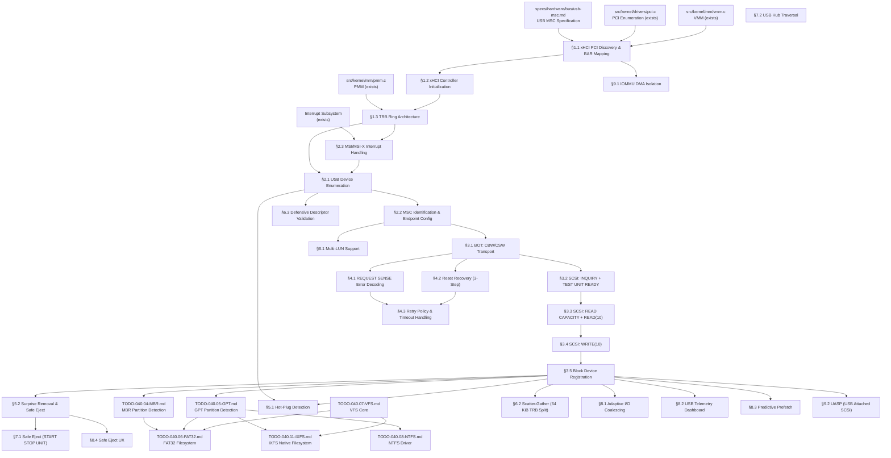

# 040.20-USB-MSC — USB Mass Storage Class Driver

> **Goal:** Implement a complete USB Mass Storage Class (MSC) driver for Impossible OS,
> enabling hot-pluggable USB flash drives and external hard disks. Currently no USB or xHCI
> code exists in the codebase. This TODO builds the entire USB storage stack from scratch:
> xHCI host controller discovery and initialization, TRB ring architecture, USB device
> enumeration, descriptor parsing, Bulk-Only Transport (BOT) protocol, SCSI transparent
> command set (INQUIRY, READ CAPACITY, READ/WRITE(10)), error recovery, hot-plug/surprise
> removal, multi-LUN support, and Impossible OS exclusive features (adaptive I/O coalescing,
> USB telemetry dashboard, predictive prefetch, safe eject UX). The driver registers USB
> storage devices as `blkdev` entries and integrates with GPT/MBR partition scanning and
> FAT32/IXFS/NTFS filesystem mounting for automatic drive letter assignment.
> All register offsets, descriptor formats, and protocol sequences reference the
> [USB MSC Specification](file:///home/derickpayne/impossible-os/specs/hardware/bus/usb-msc.md).

> [!CAUTION]
> **Memory Rule:** Use `pmm_alloc_contiguous()` for ALL DMA buffers (TRB rings, DCBAA,
> device contexts, scratchpad buffers, data I/O buffers). `kmalloc` is ONLY for small
> kernel structs (≤ 4 KB). See `rules.md` Known Gotchas.

> [!WARNING]
> **MMIO Mapping:** xHCI controller registers are memory-mapped via BAR0/BAR1. The MMIO
> region **must** be mapped as uncacheable (`PCD=1`, `PWT=1` or PAT UC type). Caching
> MMIO addresses causes stale register values and catastrophic desynchronization.

> [!IMPORTANT]
> **Spec Reference:** All section numbers, register offsets, descriptor formats, and
> protocol sequences reference the
> [USB MSC Specification](file:///home/derickpayne/impossible-os/specs/hardware/bus/usb-msc.md)
> (USB-IF BOT 1.0, xHCI 1.2, SPC-4, SBC-3).

> [!CAUTION]
> **Critical endianness trap:** USB structures (CBW, CSW, descriptors) use **little-endian**
> byte order. SCSI CDBs and their response data use **big-endian** (network byte order).
> The driver must byte-swap all multi-byte fields when crossing USB ↔ SCSI boundaries.

---

## TODO Completion Roadmap

### Dependency Graph

### Phase-by-Phase Implementation Order

| ⭐ | P    | Sections                                 | Depends On              | Status |
| -- | :--: | ---------------------------------------- | ----------------------- | :----: |
| 💎 | P0   | USB MSC spec (`usb-msc.md`)              | —                       |   ✅   |
| 💎 | P0   | PCI driver (`pci.c`)                     | —                       |   ✅   |
| 💎 | P1   | §1.1 xHCI PCI Discovery & BAR Mapping    | P0                      |   ✅   |
| 💎 | P1   | §1.2 xHCI Controller Initialization      | P1 (§1.1)               |   ✅   |
| 💎 | P1   | §1.3 TRB Ring Architecture               | P1 (§1.2)               |   ✅   |
| 💎 | P2   | §2.1 USB Device Enumeration              | P1 (§1.3)               |   ✅   |
| 💎 | P2   | §2.2 MSC Identification & Endpoint Cfg   | P2 (§2.1)               |   ✅   |
| 💎 | P2   | §2.3 MSI/MSI-X Interrupt Handling        | P1 (§1.3)               |   ⬜   |
| 💎 | P3   | §3.1 BOT: CBW/CSW Transport              | P2 (§2.2)               |   ⬜   |
| 💎 | P3   | §3.2 SCSI: INQUIRY + TEST UNIT READY     | P3 (§3.1)               |   ⬜   |
| 💎 | P3   | §3.3 SCSI: READ CAPACITY + READ(10)      | P3 (§3.2)               |   ⬜   |
| 💎 | P3   | §3.4 SCSI: WRITE(10)                     | P3 (§3.3)               |   ⬜   |
| 💎 | P3   | §3.5 Block Device Registration           | P3 (§3.4)               |   ⬜   |
| 💎 | P4   | §4.1 REQUEST SENSE Error Decoding        | P3 (§3.1)               |   ⬜   |
| 💎 | P4   | §4.2 Reset Recovery (3-Step)             | P3 (§3.1)               |   ⬜   |
| 💎 | P4   | §4.3 Retry Policy & Timeout Handling     | P4 (§4.1, §4.2)         |   ⬜   |
| 💎 | P5   | §5.1 Hot-Plug Detection                  | P2 (§2.1), P3           |   ⬜   |
| 💎 | P5   | §5.2 Surprise Removal & Safe Eject       | P3 (§3.5)               |   ⬜   |
| 💎 | P6   | §6.1 Multi-LUN Support                   | P2 (§2.2)               |   ⬜   |
| 💎 | P6   | §6.2 Scatter-Gather (64 KiB TRB Split)   | P3 (§3.5)               |   ⬜   |
| 💎 | P6   | §6.3 Defensive Descriptor Validation     | P2 (§2.1)               |   ⬜   |
| 💎 | P7   | §7.1 Safe Eject (START STOP UNIT)        | P5 (§5.2)               |   ⬜   |
| 💎 | P7   | §7.2 USB Hub Traversal                   | P2 (§2.1)               |   ⬜   |
| ⭐ | P8   | §8.1 Adaptive I/O Coalescing             | P3 (§3.5)               |   ⬜   |
| ⭐ | P8   | §8.2 USB Telemetry Dashboard             | P3 (§3.5)               |   ⬜   |
| ⭐ | P8   | §8.3 Predictive Prefetch                 | P3 (§3.5)               |   ⬜   |
| ⭐ | P8   | §8.4 Safe Eject UX                       | P5 (§5.2)               |   ⬜   |
| 💎 | P9   | §9.1 IOMMU DMA Isolation                 | P1 (§1.1)               |   ⬜   |
| 💎 | P9   | §9.2 UASP (USB Attached SCSI)            | P3 (§3.5)               |   ⬜   |

> [!NOTE]
> **Phase 0** is already complete — PCI driver can enumerate devices and the USB MSC spec
> is documented.
>
> **Phase 1** is the critical path: xHCI controller discovery (class `0C:03:30`), BAR0/BAR1
> MMIO mapping, controller halt/reset/start, DCBAA, Command Ring, Event Ring, and scratchpad
> buffer allocation. **Everything else depends on Phase 1.**
>
> **Phase 2** handles USB device enumeration (port detect, slot enable, address device,
> descriptor parsing) and MSC interface identification (`08:06:50`), plus MSI/MSI-X setup.
>
> **Phase 3** delivers core storage I/O: BOT protocol (CBW/CSW), SCSI commands (INQUIRY,
> READ CAPACITY, READ/WRITE(10)), and `blkdev` registration. After Phase 3, USB drives
> are mountable with FAT32/IXFS/NTFS.
>
> **Phase 4** adds error handling: REQUEST SENSE decoding, the 3-step Reset Recovery
> sequence, and retry/timeout policies.
>
> **Phase 5** delivers hot-plug and surprise removal — the key UX differentiator for USB.
>
> **Phase 6** adds multi-LUN, scatter-gather for large I/O, and security hardening.
>
> **Phase 7** adds safe eject via SCSI START STOP UNIT and USB hub topology traversal.
>
> **Phase 8** delivers exclusive features (⭐): adaptive I/O coalescing, USB telemetry
> dashboard, predictive prefetch, and polished safe eject UX.
>
> **Phase 9** is stretch: IOMMU DMA isolation and UASP for USB 3.0+ throughput.

> [!TIP]
> **QEMU testing flags:**
> Basic: `-device qemu-xhci,id=xhci -drive file=test-usb.img,format=raw,if=none,id=usbdisk -device usb-storage,bus=xhci.0,drive=usbdisk`
> Multi-device: add additional `-drive` + `-device usb-storage` pairs
> Hot-plug: add `-monitor telnet:127.0.0.1:4444,server,nowait` then `device_add usb-storage,...`
> Alternative controller: `-device nec-usb-xhci,id=xhci`
>
> **Create test USB image:**
> `dd if=/dev/zero of=test-usb.img bs=1M count=64 && mkfs.vfat -F 32 test-usb.img`
>
> **Memory rule reminder:**
> ALL TRB ring buffers (Command Ring, Event Ring, Transfer Rings), DCBAA, Device Contexts,
> Scratchpad Buffers, ERST, and I/O data buffers MUST use `pmm_alloc_contiguous()`. A single
> TRB's data buffer must not cross a 64 KiB physical address boundary.
>
> **Critical gotcha — cycle bit:**
> The cycle bit (bit 0 of TRB control field) is the sole ownership mechanism. Software
> toggles its producer cycle state on ring wraparound via the Link TRB.
>
> **Critical gotcha — endianness:**
> USB = little-endian. SCSI CDB/response = big-endian. Must byte-swap at layer boundary.

---

## 1. xHCI Host Controller Foundation

### 1.1 xHCI PCI Discovery & BAR Mapping

**✅ VERIFICATION —** xHCI PCI discovery and BAR mapping implemented in `src/kernel/drivers/xhci.c` and `include/kernel/drivers/xhci.h`. Verify: `bash scripts/build.sh run-usb` shows `[xHCI] Found controller at PCI 00:03.0, MMIO @ 0x800004000`. Check BAR0/BAR1 reconstructs 64-bit address, MMIO mapped with uncacheable flags (`VMM_FLAG_NOCACHE | VMM_FLAG_WRITETHROUGH`), PCI Command Register has Bus Master + Memory Space + INTx Disable. Committed as `601d671 usb: xHCI PCI discovery and BAR mapping`.

- [x] Create `src/kernel/drivers/xhci.c` and `include/kernel/drivers/xhci.h`
- [x] Detect xHCI device: class=`0x0C`, subclass=`0x03`, prog_if=`0x30`
- [x] Read BAR0 (offset `0x10`) and BAR1 (offset `0x14`) as 64-bit memory BAR
- [x] Reconstruct MMIO base: `(bar0 & 0xFFFFFFF0) | ((uint64_t)bar1 << 32)`
- [x] Verify BAR type is memory (bit 0 = 0) and 64-bit (bits 2:1 = `10b`)
- [x] Map MMIO region into kernel address space (uncacheable, minimum 64 KiB)
- [x] Enable PCI Command Register: Bus Master (bit 2), Memory Space (bit 1)
- [x] Disable legacy INTx: set PCI Command Register bit 10
- [x] Log: `[xHCI] Found controller at PCI %02x:%02x.%x, MMIO @ 0x%lx`
- [x] Commit: `"usb: xHCI PCI discovery and BAR mapping"`

### 1.2 xHCI Controller Initialization

**✅ VERIFICATION —** xHCI controller initialization implemented: halt (USBCMD.RS=0, wait HCH=1), reset (HCRST=1, wait HCRST=0 AND CNR=0), DCBAA allocation via `pmm_alloc_contiguous()`, scratchpad buffer setup if HCSPARAMS2 count > 0, MaxSlotsEn configuration, DCBAAP write (64-bit split into two 32-bit writes), controller start (USBCMD.RS=1, wait HCH=0). Verify: `bash scripts/build.sh run-usb` shows `[xHCI] Controller halted`, `Controller reset complete`, `xHCI v0.0 ready, 64 slots, 8 ports, 16 intrs, 0 scratchpads`. Committed as `17fea68 usb: xHCI controller initialization`.

- [x] Read Capability Registers (offset `0x00` from BAR base):
  - [x] CAPLENGTH (offset `0x00`, 1B) — length of capability space
  - [x] HCIVERSION (offset `0x02`, 2B) — xHCI version (e.g., `0x0110` = 1.1)
  - [x] HCSPARAMS1 (offset `0x04`, 4B) — max slots (7:0), max interrupters (18:8), max ports (31:24)
  - [x] HCSPARAMS2 (offset `0x08`, 4B) — scratchpad bufs high (31:27) + low (25:21)
  - [x] HCCPARAMS1 (offset `0x10`, 4B) — 64-bit (bit 0), context size 64B (bit 2)
  - [x] DBOFF (offset `0x14`, 4B) — doorbell array offset
  - [x] RTSOFF (offset `0x18`, 4B) — runtime register space offset
- [x] Calculate base addresses: Operational = BAR + CAPLENGTH, Runtime = BAR + RTSOFF, Doorbell = BAR + DBOFF
- [x] Halt controller: set USBCMD.RS = 0 (Operational + `0x00`), wait USBSTS.HCH = 1
- [x] Reset controller: set USBCMD.HCRST = 1, wait HCRST = 0 AND USBSTS.CNR = 0
- [x] Write CONFIG.MaxSlotsEn (Operational + `0x38`) with desired device count
- [x] Allocate DCBAA: `pmm_alloc_contiguous()`, 64-byte aligned, (MaxSlots+1) × 8 bytes, zero-fill
- [x] Allocate scratchpad buffers if HCSPARAMS2 count > 0: page-aligned, store at DCBAA[0]
- [x] Write DCBAAP (Operational + `0x30`) — 64-bit physical address of DCBAA
- [x] Start controller: set USBCMD.RS = 1, wait USBSTS.HCH = 0
- [x] Log: `[xHCI] v%x.%x ready, %u slots, %u ports, %u interrupters`
- [x] Commit: `"usb: xHCI controller initialization"`

### 1.3 TRB Ring Architecture

**✅ VERIFICATION —** TRB ring architecture implemented in `xhci_ring.h` and `xhci_ring.c`. Verify: `bash scripts/build.sh run-usb` shows `Command Ring at 0x738000, 256 TRBs`, `Event Ring at 0x739000, ERST at 0x73A000, 256 TRBs`, `TRB rings initialized, interrupts enabled`. Command Ring has Link TRB at slot 255 with toggle cycle. ERST has 1 segment. ERSTSZ/ERSTBA/ERDP written to Interrupter 0. `xhci_cmd_submit` and `xhci_event_poll` implemented. Committed as `usb: TRB ring architecture`.

- [x] Define `struct xhci_trb { uint64_t parameter; uint32_t status; uint32_t control; }`
- [x] Allocate Command Ring: `pmm_alloc_contiguous()`, 64B aligned, 256 × 16B, zero-fill
  - [x] Set Link TRB at end: type=6, pointer to ring start, toggle cycle bit
  - [x] Write CRCR (Operational + `0x18`) — physical address | cycle bit
  - [x] Initialize producer state: `cmd_ring.enqueue = 0`, `cmd_ring.cycle = 1`
- [x] Allocate Event Ring Segment: `pmm_alloc_contiguous()`, 64B aligned, 256 × 16B, zero-fill
  - [x] Allocate ERST entry: `{ ring_segment_base, ring_segment_size=256, reserved=0 }`
  - [x] Write ERSTSZ (Runtime + `0x28`) = 1 (one segment)
  - [x] Write ERSTBA (Runtime + `0x30`) — 64-bit physical address of ERST, 64B aligned
  - [x] Write ERDP (Runtime + `0x38`) — initial dequeue pointer = segment base
  - [x] Initialize consumer state: `evt_ring.dequeue = 0`, `evt_ring.cycle = 1`
- [x] Enable interrupts: USBCMD.INTE = 1, IMAN.IE = 1 (Runtime + `0x20`)
- [x] Implement `xhci_cmd_submit(trb)` — enqueue TRB, advance tail, ring doorbell 0
- [x] Implement `xhci_event_poll()` — check phase bit, process event, advance ERDP
- [x] All rings must not cross 64 KiB physical boundaries
- [x] Commit: `"usb: TRB ring architecture"`

---

## 2. USB Device Enumeration

### 2.1 USB Device Enumeration

**✅ VERIFICATION —** USB device enumeration implemented in `src/kernel/drivers/xhci_dev.c` and `include/kernel/drivers/xhci_dev.h`. Verify: `bash scripts/build.sh run-usb` shows `[USB] Port 1: device connected, speed=high`, `Slot 1 enabled`, `Device addressed (slot 1)`, `Device descriptor: USB 2.00, VID=... PID=...`, `Device ...enumerated on port 1 (slot 1)`. Full sequence: port scan → PORTSC CCS/speed read → port reset (PR=1, wait PRC) → Enable Slot Command → Output/Input Context allocation (CSZ-aware) → EP0 Transfer Ring → Address Device Command → GET_DESCRIPTOR Device 18B → GET_DESCRIPTOR Config two-stage (9B header, validate wTotalLength≤4096, full read) → SET_CONFIGURATION → Configure Endpoint Command. Committed as `usb: device enumeration`.

- [x] Detect Port Status Change Event TRB (type 34) from Event Ring
- [x] Read PORTSC (Operational + `0x400` + port × `0x10`): confirm CCS (bit 0), read speed (13:10)
- [x] Reset port: set PORTSC.PR = 1, wait for Port Reset Change (PRC bit)
- [x] Submit Enable Slot Command (TRB type 9), wait for completion — get slot_id
- [x] Allocate Device Context: `pmm_alloc_contiguous()`, 64B aligned, zero-fill
  - [x] Store physical address in DCBAA[slot_id]
- [x] Build Input Context: Slot Context (speed, port number) + EP0 Context (max packet size)
- [x] Submit Address Device Command (TRB type 11), wait for completion
- [x] Control transfer: GET_DESCRIPTOR (Device, type=0x01, 18 bytes)
  - [x] Build Setup Stage TRB (type 2) + Data Stage TRB (type 3) + Status Stage TRB (type 4)
  - [x] Ring EP0 doorbell: `Doorbell[slot_id] = 1` (DCI for EP0 IN)
  - [x] Parse `usb_device_descriptor` — bcdUSB, idVendor, idProduct, bNumConfigurations
- [x] Control transfer: GET_DESCRIPTOR (Configuration, type=0x02)
  - [x] First: request 9 bytes to read wTotalLength
  - [x] Validate wTotalLength ≤ 4096 (cap against malicious devices)
  - [x] Then: allocate buffer, request full wTotalLength bytes
- [x] Control transfer: SET_CONFIGURATION (bConfigurationValue from config descriptor)
- [x] Submit Configure Endpoint Command (TRB type 12) with discovered endpoints
- [x] Log: `[USB] Device %04x:%04x enumerated on port %u (slot %u)`
- [x] Commit: `"usb: device enumeration"`

### 2.2 MSC Identification & Endpoint Configuration

**✅ VERIFICATION —** MSC BOT identification implemented in `xhci_msc_identify()` in `src/kernel/drivers/xhci_dev.c`. Verify: `make run-usb-ci` shows `[usb-msc] BOT interface 0: Bulk-IN EP1 (pkt=1024), Bulk-OUT EP2 (pkt=1024)`, `BOT device ready`, and `Device ... enumerated ... [MSC]`. Config descriptor linear walk by bLength/bDescriptorType, MSC BOT triple match (0x08/0x06/0x50), Bulk-IN/OUT extraction, Transfer Ring allocation, Input Context rebuild with DCI indexing, Configure Endpoint command. Committed as `usb: MSC identification and endpoint config`.

- [x] Walk config descriptor buffer (linear parse by bLength/bDescriptorType)
- [x] Match Interface Descriptor (type `0x04`):
  - [x] `bInterfaceClass == 0x08` (Mass Storage)
  - [x] `bInterfaceSubClass == 0x06` (SCSI Transparent)
  - [x] `bInterfaceProtocol == 0x50` (Bulk-Only Transport)
- [x] Extract Endpoint Descriptors (type `0x05`) following the matched interface:
  - [x] Bulk-IN: `bmAttributes == 0x02` and `bEndpointAddress` bit 7 = 1
  - [x] Bulk-OUT: `bmAttributes == 0x02` and `bEndpointAddress` bit 7 = 0
  - [x] Record wMaxPacketSize for each endpoint
- [x] Ignore interrupt endpoints on BOT interfaces
- [x] Allocate Transfer Ring for Bulk-IN: `pmm_alloc_contiguous()`, 16B aligned, 256 TRBs
- [x] Allocate Transfer Ring for Bulk-OUT: `pmm_alloc_contiguous()`, 16B aligned, 256 TRBs
- [x] Update Input Context with Bulk-IN and Bulk-OUT Endpoint Contexts
- [x] Store MSC device info: slot_id, bulk_in_ep, bulk_out_ep, max_packet_size, interface_num
- [x] Log: `[USB-MSC] BOT device: Bulk-IN EP%u, Bulk-OUT EP%u, MaxPkt=%u`
- [x] Commit: `"usb: MSC identification and endpoint config"`

### 2.3 MSI/MSI-X Interrupt Handling

**Prompt:** Scan PCI Capability List for MSI-X (cap ID `0x11`) or MSI (cap ID `0x05`) per USB MSC spec §"MSI/MSI-X Configuration". If MSI-X: map MSI-X Table BAR, allocate IDT vector, program table entry (msg_addr=`0xFEE00000`, msg_data=vector), enable in Message Control. Set USBCMD.INTE=1 and IMAN.IE=1. Implement top-half ISR: read Event Ring, advance ERDP, clear IMAN.IP, queue bottom-half for BOT state machine processing. If no MSI-X, fall back to single MSI or legacy INTx polling. After completing all items, mark every item as `[x]`, update this prompt to a verification prompt, run `bash scripts/build.sh clean`, and commit as `"usb: MSI/MSI-X interrupt handling"`. After implementation, save gotchas to MCP memory.

- [ ] Walk PCI capability list for MSI-X (cap ID `0x11`) or MSI (cap ID `0x05`)
- [ ] If MSI-X:
  - [ ] Read Message Control: table size, Table BAR + offset
  - [ ] Map MSI-X Table BAR into kernel memory (uncacheable)
  - [ ] Allocate IDT vector via `irq_alloc_vector()`
  - [ ] Program MSI-X table entry: `msg_addr=0xFEE00000`, `msg_data=vector`
  - [ ] Enable MSI-X: set bit 15 in Message Control, clear Function Mask
- [ ] Set USBCMD.INTE = 1 (Operational + `0x00`, bit 2)
- [ ] Set IMAN.IE = 1 (Runtime + `0x20`, bit 1)
- [ ] Register ISR (top-half):
  - [ ] Read Event Ring TRBs (check phase bit match)
  - [ ] Advance ERDP (Runtime + `0x38`)
  - [ ] Write `1` to IMAN.IP (bit 0) to clear interrupt pending
  - [ ] Queue bottom-half handler for BOT/SCSI processing
- [ ] Fallback: if no MSI-X, use single MSI or legacy INTx with polling loop
- [ ] Log: `[xHCI] IRQ: MSI-X vector %u enabled`
- [ ] Commit: `"usb: MSI/MSI-X interrupt handling"`

---

## 3. BOT Protocol & SCSI Command Set

### 3.1 BOT: CBW/CSW Transport

**Prompt:** Implement the Bulk-Only Transport protocol per USB MSC spec §"Bulk-Only Transport (BOT) Protocol". Each transaction: (1) send 31-byte CBW on Bulk-OUT, (2) optional data phase on Bulk-IN or Bulk-OUT, (3) receive 13-byte CSW on Bulk-IN. Define CBW struct (`dCBWSignature=0x43425355`, dCBWTag, dCBWDataTransferLength, bmCBWFlags, bCBWLUN, bCBWCBLength, CBWCB[16]`). Define CSW struct (`dCSWSignature=0x53425355`, dCSWTag, dCSWDataResidue, bCSWStatus`). Validate CSW: signature match, tag match, exactly 13 bytes. Implement the 13-case host/device expectation matrix for handling short transfers and phase errors. After completing all items, mark every item as `[x]`, update this prompt to a verification prompt, run `bash scripts/build.sh clean`, and commit as `"usb: BOT CBW/CSW transport"`. After implementation, save gotchas to MCP memory.

- [ ] Define `struct usb_msc_cbw` (31 bytes):
  - [ ] `dCBWSignature` = `0x43425355` ("USBC")
  - [ ] `dCBWTag` — monotonic counter for correlation
  - [ ] `dCBWDataTransferLength`, `bmCBWFlags` (bit 7: direction)
  - [ ] `bCBWLUN`, `bCBWCBLength`, `CBWCB[16]`
- [ ] Define `struct usb_msc_csw` (13 bytes):
  - [ ] `dCSWSignature` = `0x53425355` ("USBS")
  - [ ] `dCSWTag`, `dCSWDataResidue`, `bCSWStatus`
- [ ] Implement `bot_send_cbw(dev, cbw)`:
  - [ ] Build Normal TRB (type 1), set parameter = CBW buffer phys addr, length = 31
  - [ ] Enqueue on Bulk-OUT Transfer Ring, ring doorbell
- [ ] Implement `bot_recv_data(dev, buf, len)`:
  - [ ] Build Normal TRB(s), set IOC on last TRB
  - [ ] Enqueue on Bulk-IN Transfer Ring, ring doorbell
- [ ] Implement `bot_send_data(dev, buf, len)`:
  - [ ] Build Normal TRB(s) on Bulk-OUT Transfer Ring
- [ ] Implement `bot_recv_csw(dev)`:
  - [ ] Build Normal TRB, length = 13, on Bulk-IN Transfer Ring
  - [ ] Validate: `dCSWSignature == 0x53425355`, `dCSWTag == active_tag`, exactly 13B
  - [ ] Return `bCSWStatus`: 0x00=Passed, 0x01=Failed, 0x02=Phase Error
- [ ] Handle 13 cases (short transfer / phase error matrix):
  - [ ] Cases 1, 6, 12: optimal — proceed normally
  - [ ] Cases 4, 5, 9, 11: STALL → ClearFeature(ENDPOINT_HALT) → read CSW
  - [ ] Cases 2, 3, 7, 8, 10, 13: Phase Error → Reset Recovery
- [ ] Implement `bot_transaction(dev, cdb, cdb_len, data, data_len, direction, lun)`
- [ ] Commit: `"usb: BOT CBW/CSW transport"`

### 3.2 SCSI: INQUIRY + TEST UNIT READY

**Prompt:** Implement SCSI INQUIRY (`0x12`) and TEST UNIT READY (`0x00`) commands per USB MSC spec §"Mandatory SCSI Commands". INQUIRY: 6-byte CDB, Data-In 36 bytes, parse device type (byte 0, bits 4:0 = `0x00` for block device), RMB (byte 1, bit 7 = removable), vendor (bytes 8–15), product (bytes 16–31). Note: SCSI CDBs are big-endian. TEST UNIT READY: 6-byte CDB, no data phase, check CSW status. If failed, issue REQUEST SENSE to determine reason (medium not present, device spinning up). After completing all items, mark every item as `[x]`, update this prompt to a verification prompt, run `bash scripts/build.sh clean`, and commit as `"usb: SCSI INQUIRY and TEST UNIT READY"`. After implementation, save gotchas to MCP memory.

- [ ] Build INQUIRY CDB (6 bytes): opcode=`0x12`, allocation_len=36 (big-endian)
- [ ] Send via `bot_transaction()`: direction=IN, data_len=36, lun=target
- [ ] Parse INQUIRY response (36 bytes):
  - [ ] Peripheral Device Type (byte 0, bits 4:0) — `0x00` = direct-access block
  - [ ] RMB (byte 1, bit 7) — 1 = removable media
  - [ ] Vendor Identification (bytes 8–15, ASCII, space-padded, trim)
  - [ ] Product Identification (bytes 16–31, ASCII, space-padded, trim)
  - [ ] Product Revision Level (bytes 32–35, ASCII)
- [ ] Reject non-block devices (device type ≠ `0x00`)
- [ ] Build TEST UNIT READY CDB (6 bytes): opcode=`0x00`, all zeros
- [ ] Send via `bot_transaction()`: direction=none, data_len=0
- [ ] If CSW status == 0x01: issue REQUEST SENSE (§4.1) for reason
- [ ] Retry TEST UNIT READY up to 10 times with 500ms delay (device spin-up)
- [ ] Log: `[USB-MSC] %s %s (Rev %s), removable=%s`
- [ ] Commit: `"usb: SCSI INQUIRY and TEST UNIT READY"`

### 3.3 SCSI: READ CAPACITY + READ(10)

**Prompt:** Implement READ CAPACITY(10) (`0x25`) and READ(10) (`0x28`) per USB MSC spec §"Mandatory SCSI Commands". READ CAPACITY: 10-byte CDB, Data-In 8 bytes (big-endian last LBA + block length). Total capacity = (last_LBA + 1) × block_length. Never hardcode 512. READ(10): 10-byte CDB, LBA at bytes 2–5 (big-endian), transfer length at bytes 7–8 (big-endian). Data-In = transfer_length × block_size. After completing all items, mark every item as `[x]`, update this prompt to a verification prompt, run `bash scripts/build.sh clean`, and commit as `"usb: SCSI READ CAPACITY and READ(10)"`. After implementation, save gotchas to MCP memory.

- [ ] Build READ CAPACITY(10) CDB (10 bytes): opcode=`0x25`, LBA=0, PMI=0
- [ ] Send via `bot_transaction()`: direction=IN, data_len=8
- [ ] Parse response (8 bytes, **big-endian**):
  - [ ] Last Logical Block Address (bytes 0–3, uint32 big-endian)
  - [ ] Block Length (bytes 4–7, uint32 big-endian, typically 512)
  - [ ] Total capacity = `(last_lba + 1) * block_length`
- [ ] Store in device struct: `sector_count = last_lba + 1`, `sector_size = block_length`
- [ ] Build READ(10) CDB (10 bytes):
  - [ ] Opcode=`0x28`, LBA at bytes 2–5 (big-endian), transfer_length at bytes 7–8 (big-endian)
- [ ] Send via `bot_transaction()`: direction=IN, data_len=transfer_length × sector_size
- [ ] Implement `usb_msc_read(dev, lba, count, buf)` wrapper
- [ ] Handle sector sizes: 512, 1024, 2048, 4096 bytes (read from device, never hardcode)
- [ ] Log: `[USB-MSC] Capacity: %llu MiB (%u-byte sectors)`
- [ ] Commit: `"usb: SCSI READ CAPACITY and READ(10)"`

### 3.4 SCSI: WRITE(10)

**Prompt:** Implement WRITE(10) (`0x2A`) per USB MSC spec §"Mandatory SCSI Commands". 10-byte CDB: opcode=`0x2A`, LBA at bytes 2–5 (big-endian), transfer length at bytes 7–8 (big-endian). Data-Out = transfer_length × block_size. Check for write-protect via REQUEST SENSE (sense key `0x07`, ASC `0x27`, ASCQ `0x00`). After completing all items, mark every item as `[x]`, update this prompt to a verification prompt, run `bash scripts/build.sh clean`, and commit as `"usb: SCSI WRITE(10)"`. After implementation, save gotchas to MCP memory.

- [ ] Build WRITE(10) CDB (10 bytes):
  - [ ] Opcode=`0x2A`, LBA at bytes 2–5 (big-endian), transfer_length at bytes 7–8 (big-endian)
- [ ] Send via `bot_transaction()`: direction=OUT, data_len=transfer_length × sector_size
- [ ] Implement `usb_msc_write(dev, lba, count, buf)` wrapper
- [ ] Handle write-protect: if sense key=`0x07`, ASC=`0x27`, mark device read-only
- [ ] Return -1 on write-protected or failed writes
- [ ] Commit: `"usb: SCSI WRITE(10)"`

### 3.5 Block Device Registration

**Prompt:** Register USB MSC devices as `blkdev` entries so partition scanning and filesystem mounting work automatically. Set sector_size from READ CAPACITY, sector_count from last_lba+1. Wire read/write callbacks to `usb_msc_read`/`usb_msc_write`. Device name: `usb0` (or `usb0lN` for LUN N on multi-LUN devices). After registration, `partition_scan()` will detect GPT/MBR and mount filesystems. After completing all items, mark every item as `[x]`, update this prompt to a verification prompt, run `bash scripts/build.sh clean`, and commit as `"usb: block device registration"`. After implementation, save gotchas to MCP memory.

- [ ] Create `blkdev` struct for each USB MSC LUN:
  - [ ] `name`: `"usb0"` or `"usb0lN"` for LUN N
  - [ ] `sector_size`: from READ CAPACITY block_length
  - [ ] `sector_count`: from READ CAPACITY (last_lba + 1)
  - [ ] `read_fn`: `usb_msc_blkdev_read()` adapter
  - [ ] `write_fn`: `usb_msc_blkdev_write()` adapter
  - [ ] `removable`: true (USB devices are hot-pluggable)
- [ ] Call `blkdev_register()` for each LUN
- [ ] Trigger `partition_scan()` to detect GPT/MBR and auto-mount filesystems
- [ ] Log: `[USB-MSC] Registered blkdev "%s": %llu MiB, %u-byte sectors`
- [ ] Commit: `"usb: block device registration"`

---

## 4. Error Handling

### 4.1 REQUEST SENSE Error Decoding

**Prompt:** Implement REQUEST SENSE (`0x03`) per USB MSC spec §"REQUEST SENSE". 6-byte CDB, Data-In 18 bytes (fixed format). Parse sense key (byte 2, bits 3:0), ASC (byte 12), ASCQ (byte 13). Decode common combinations: `0x02/0x3A/0x00` = medium not present, `0x06/0x28/0x00` = not ready to ready transition, `0x07/0x27/0x00` = write protected, `0x03/0x11/0x00` = unrecovered read error. After completing all items, mark every item as `[x]`, update this prompt to a verification prompt, run `bash scripts/build.sh clean`, and commit as `"usb: REQUEST SENSE error decoding"`. After implementation, save gotchas to MCP memory.

- [ ] Build REQUEST SENSE CDB (6 bytes): opcode=`0x03`, allocation_len=18
- [ ] Send via `bot_transaction()`: direction=IN, data_len=18
- [ ] Parse fixed format sense data (18 bytes):
  - [ ] Response Code (byte 0) — `0x70` (current) or `0x71` (deferred)
  - [ ] Sense Key (byte 2, bits 3:0) — error category
  - [ ] ASC (byte 12) — Additional Sense Code
  - [ ] ASCQ (byte 13) — Additional Sense Code Qualifier
- [ ] Decode common sense key / ASC / ASCQ combinations:
  - [ ] `0x02/0x3A/0x00` — Medium Not Present
  - [ ] `0x06/0x28/0x00` — Not Ready to Ready Transition (media inserted)
  - [ ] `0x07/0x27/0x00` — Write Protected
  - [ ] `0x03/0x11/0x00` — Unrecovered Read Error
  - [ ] `0x03/0x0C/0x00` — Write Error
  - [ ] `0x05/0x20/0x00` — Invalid Command Operation Code
  - [ ] `0x05/0x24/0x00` — Invalid Field in CDB
- [ ] Return structured error to caller: `{ sense_key, asc, ascq, description }`
- [ ] Log: `[USB-MSC] Sense: key=0x%02x, ASC=0x%02x, ASCQ=0x%02x — %s`
- [ ] Commit: `"usb: REQUEST SENSE error decoding"`

### 4.2 Reset Recovery (3-Step)

**Prompt:** Implement the BOT Reset Recovery sequence per USB MSC spec §"Reset Recovery Sequence". When CSW status = 0x02 (Phase Error), CSW validation fails, or endpoints are persistently stalled, execute this exact three-step sequence: (1) Bulk-Only Mass Storage Reset (control EP0, bRequest=0xFF), (2) ClearFeature(ENDPOINT_HALT) on Bulk-IN, (3) ClearFeature(ENDPOINT_HALT) on Bulk-OUT. These three steps MUST be in this exact order. After completing all items, mark every item as `[x]`, update this prompt to a verification prompt, run `bash scripts/build.sh clean`, and commit as `"usb: BOT reset recovery"`. After implementation, save gotchas to MCP memory.

- [ ] Implement `bot_reset_recovery(dev)`:
  - [ ] Step 1: Bulk-Only Mass Storage Reset
    - [ ] Control transfer: bmRequestType=`0x21`, bRequest=`0xFF`, wValue=0, wIndex=interface, wLength=0
  - [ ] Step 2: ClearFeature(ENDPOINT_HALT) on Bulk-IN
    - [ ] Control transfer: bmRequestType=`0x02`, bRequest=`0x01`, wValue=0, wIndex=bulk_in_ep
  - [ ] Step 3: ClearFeature(ENDPOINT_HALT) on Bulk-OUT
    - [ ] Control transfer: bmRequestType=`0x02`, bRequest=`0x01`, wValue=0, wIndex=bulk_out_ep
- [ ] Steps MUST execute in this exact order — reordering causes zombie devices
- [ ] Reset BOT state machine: clear pending tags, reset Data Toggle bits
- [ ] Call on: CSW Phase Error (0x02), invalid CSW signature, invalid CSW tag
- [ ] Log: `[USB-MSC] Reset Recovery: 3-step sequence completed`
- [ ] Commit: `"usb: BOT reset recovery"`

### 4.3 Retry Policy & Timeout Handling

**Prompt:** Implement retry and timeout policies per USB MSC spec §"Retry Policy". Endpoint STALL: retry up to 3× with ClearFeature(ENDPOINT_HALT) between attempts. CSW tag/signature mismatch: immediate Reset Recovery (0 retries). Phase Error: immediate Reset Recovery. Command Failed (sense): retry up to 3× then report to VFS. Transfer timeout: 5-second default, reset recovery after 2 failed attempts. After completing all items, mark every item as `[x]`, update this prompt to a verification prompt, run `bash scripts/build.sh clean`, and commit as `"usb: retry policy and timeout handling"`. After implementation, save gotchas to MCP memory.

- [ ] Retry table:
  - [ ] Endpoint STALL: max 3 retries, ClearFeature between each
  - [ ] CSW tag mismatch: 0 retries → immediate Reset Recovery
  - [ ] CSW signature invalid: 0 retries → immediate Reset Recovery
  - [ ] Phase Error: 0 retries → immediate Reset Recovery
  - [ ] Command Failed (sense): max 3 retries → report error to VFS
  - [ ] Transfer timeout: max 2 retries → Reset Recovery
- [ ] Implement configurable timeout: default 5 seconds per BOT transaction
- [ ] Implement `bot_transaction_with_retry()` wrapper
- [ ] Track error counters: `{ stalls, resets, timeouts, command_failures }`
- [ ] Expose counters via Registry: `HKLM\HARDWARE\USB\usb0\ErrorStats\*`
- [ ] Commit: `"usb: retry policy and timeout handling"`

---

## 5. Hot-Plug & Device Lifecycle

### 5.1 Hot-Plug Detection

**Prompt:** Handle USB device connection events per USB MSC spec §"Device Connection". xHCI generates Port Status Change Event TRB (type 34) when a device is plugged in. Read PORTSC to confirm CCS (Current Connect Status). Begin full enumeration sequence: reset port, enable slot, address device, parse descriptors, identify MSC, probe LUNs, read capacity. Register block device with VFS, trigger partition scanning and filesystem mounting. Show desktop notification toast: "USB drive detected — Drive E: (FAT32, 16 GB)". After completing all items, mark every item as `[x]`, update this prompt to a verification prompt, run `bash scripts/build.sh clean`, and commit as `"usb: hot-plug detection"`. After implementation, save gotchas to MCP memory.

- [ ] Monitor Event Ring for Port Status Change Event TRBs (type 34)
- [ ] Read PORTSC: confirm CCS (bit 0) = 1 (device connected)
- [ ] Determine port speed from PORTSC bits 13:10
- [ ] Run full enumeration sequence (§2.1)
- [ ] If MSC device: identify interface (§2.2), probe SCSI (§3.2–3.3)
- [ ] Register `blkdev`, trigger `partition_scan()`, auto-mount filesystem
- [ ] Assign next available drive letter (E:, F:, ...)
- [ ] Show desktop notification toast: "USB drive detected — Drive X: (FS, N GB)"
- [ ] Log: `[USB] Device connected on port %u → Drive %c:`
- [ ] Commit: `"usb: hot-plug detection"`

### 5.2 Surprise Removal & Safe Eject

**Prompt:** Handle device disconnection per USB MSC spec §"Surprise Removal Teardown Sequence". On disconnect event: (1) quarantine — mark device offline, reject all pending I/O with ENODEV, (2) abort transfers — walk Transfer Rings, abort pending TRBs, (3) halt endpoints — issue Stop Endpoint Commands, (4) free slot — issue Disable Slot Command, (5) notify VFS — trigger filesystem unmount, (6) deallocate — free all DMA buffers and device tracking structures once refcount → 0. After completing all items, mark every item as `[x]`, update this prompt to a verification prompt, run `bash scripts/build.sh clean`, and commit as `"usb: surprise removal and safe eject"`. After implementation, save gotchas to MCP memory.

- [ ] Detect disconnect: Port Status Change Event with CCS = 0
- [ ] Step 1 — Quarantine: set `dev->online = false`, reject new I/O with `ENODEV`
- [ ] Step 2 — Abort transfers: walk Bulk-IN/Bulk-OUT Transfer Rings, mark TRBs as aborted
- [ ] Step 3 — Halt endpoints: issue Stop Endpoint Command on Command Ring
- [ ] Step 4 — Free slot: issue Disable Slot Command (TRB type 10) on Command Ring
- [ ] Step 5 — Notify VFS: call `blkdev_unregister()`, trigger filesystem unmount
- [ ] Step 6 — Deallocate: free Transfer Rings, Device Context, data buffers via `pmm_free_frame()`
- [ ] Wait for refcount → 0 before final deallocation (open file handles)
- [ ] Show desktop notification: "USB drive removed — Drive X: safely ejected" or warning
- [ ] Log: `[USB] Device disconnected from port %u, slot %u freed`
- [ ] Commit: `"usb: surprise removal and safe eject"`

---

## 6. Advanced Features

### 6.1 Multi-LUN Support

**Prompt:** Implement Get Max LUN per USB MSC spec §"Get Max LUN". Control transfer: bmRequestType=`0xA1`, bRequest=`0xFE`, wValue=0, wIndex=interface, wLength=1. Response is a single byte: max LUN index (0x00–0x0F). For each LUN: issue INQUIRY, TEST UNIT READY, READ CAPACITY, and register a separate `blkdev` (e.g., `usb0l0`, `usb0l1`). If device STALLs the request, assume Max LUN = 0. After completing all items, mark every item as `[x]`, update this prompt to a verification prompt, run `bash scripts/build.sh clean`, and commit as `"usb: multi-LUN support"`. After implementation, save gotchas to MCP memory.

- [ ] Issue Get Max LUN: bmRequestType=`0xA1`, bRequest=`0xFE`, wIndex=interface, wLength=1
- [ ] Parse response: single byte = max LUN index (0x00–0x0F, value 0x03 = 4 LUNs)
- [ ] If STALL: ClearFeature(ENDPOINT_HALT) on EP0, assume Max LUN = 0
- [ ] For each LUN (0 to max_lun):
  - [ ] Issue INQUIRY (§3.2) with `bCBWLUN = lun`
  - [ ] Issue TEST UNIT READY with `bCBWLUN = lun`
  - [ ] Issue READ CAPACITY with `bCBWLUN = lun`
  - [ ] Register separate `blkdev`: `usb0l0`, `usb0l1`, etc.
- [ ] Skip LUNs that fail INQUIRY (not all LUNs may have media)
- [ ] Log: `[USB-MSC] %u LUNs detected, %u with media`
- [ ] Commit: `"usb: multi-LUN support"`

### 6.2 Scatter-Gather for Large I/O (64 KiB TRB Split)

**Prompt:** Handle large transfers per USB MSC spec §"Scatter-Gather for Large Transfers". A single TRB's data buffer MUST NOT cross a 64 KiB physical address boundary. Split large buffers into fragments ≤ 64 KiB that each stay within a single 64 KiB-aligned region. Chain TRBs with the Chain bit (control bit 4). Set IOC only on the final TRB. After completing all items, mark every item as `[x]`, update this prompt to a verification prompt, run `bash scripts/build.sh clean`, and commit as `"usb: scatter-gather 64 KiB TRB split"`. After implementation, save gotchas to MCP memory.

- [ ] Detect when transfer buffer crosses 64 KiB boundary
- [ ] Split into fragments: each ≤ 64 KiB, within single 64 KiB-aligned region
- [ ] Create one Normal TRB per fragment:
  - [ ] Set Chain bit (control bit 4) on all but last TRB
  - [ ] Set IOC (control bit 5) on final TRB only
- [ ] Ensure total fragment count does not exceed Transfer Ring capacity
- [ ] Update `bot_recv_data` and `bot_send_data` to use scatter-gather
- [ ] Commit: `"usb: scatter-gather 64 KiB TRB split"`

### 6.3 Defensive Descriptor Validation

**Prompt:** Implement security checks per USB MSC spec §"Security: Defensive Descriptor Parsing". Never trust device-reported lengths. Enforce mandatory bounds checks: Device Descriptor bLength==18, Config Descriptor bLength==9, wTotalLength ≤ 4096, Interface Descriptor bLength==9, Endpoint Descriptor bLength==7. Use two-stage Configuration Descriptor read. Cap all string descriptor fetches. After completing all items, mark every item as `[x]`, update this prompt to a verification prompt, run `bash scripts/build.sh clean`, and commit as `"usb: defensive descriptor validation"`. After implementation, save gotchas to MCP memory.

- [ ] Validate Device Descriptor: `bLength == 18`, `bDescriptorType == 0x01`
- [ ] Validate Config Descriptor header: `bLength == 9`, `wTotalLength ≤ 4096`
- [ ] Two-stage config read: 9 bytes first, validate wTotalLength, then full read
- [ ] Validate Interface Descriptor: `bLength == 9`, class values within valid range
- [ ] Validate Endpoint Descriptor: `bLength == 7`, valid direction bit
- [ ] Cap string descriptor fetches to kernel max buffer (256 bytes)
- [ ] CSW validation: signature match, tag match, exactly 13 bytes
- [ ] Data residue check: `dCSWDataResidue ≤ dCBWDataTransferLength`
- [ ] Reject devices with impossible descriptor values (disconnect + log warning)
- [ ] Commit: `"usb: defensive descriptor validation"`

---

## 7. Polish

### 7.1 Safe Eject (START STOP UNIT)

**Prompt:** Implement SCSI START STOP UNIT (`0x1B`) for safe device ejection per USB MSC spec §"START STOP UNIT". 6-byte CDB: opcode=`0x1B`, byte 4 bits 1:0 = LoEj/Start (`0x02` = eject). Before ejecting: flush all dirty buffers, unmount filesystems, unregister blkdev. After completing all items, mark every item as `[x]`, update this prompt to a verification prompt, run `bash scripts/build.sh clean`, and commit as `"usb: safe eject START STOP UNIT"`. After implementation, save gotchas to MCP memory.

- [ ] Implement `usb_msc_eject(dev)`:
  - [ ] Flush all dirty buffers (cache_flush if disk cache exists)
  - [ ] Unmount all filesystems on this device
  - [ ] Unregister `blkdev`
- [ ] Build START STOP UNIT CDB (6 bytes): opcode=`0x1B`, byte 1 Immed=1, byte 4=`0x02` (eject)
- [ ] Send via `bot_transaction()`: direction=none, data_len=0
- [ ] Wire to shell command: `eject X:` where X is the drive letter
- [ ] Notify desktop: "Drive X: safely removed — you may disconnect the USB device"
- [ ] Commit: `"usb: safe eject START STOP UNIT"`

### 7.2 USB Hub Traversal

**Prompt:** Support USB devices connected through USB hubs. Hubs appear as a separate USB device class (bDeviceClass=`0x09`). Parse hub descriptors to discover downstream ports. Handle port power-on, reset, and enumeration for each downstream port. Track route strings for xHCI Slot Context. Support up to 5 tiers of hub nesting (USB spec limit). After completing all items, mark every item as `[x]`, update this prompt to a verification prompt, run `bash scripts/build.sh clean`, and commit as `"usb: hub traversal"`. After implementation, save gotchas to MCP memory.

- [ ] Detect hub devices: `bDeviceClass == 0x09`
- [ ] Parse Hub Descriptor: number of downstream ports, power characteristics
- [ ] Issue SetPortFeature(PORT_POWER) for each downstream port
- [ ] Monitor hub status change interrupt endpoint for port connect events
- [ ] On downstream connect: reset port, enumerate device via parent hub
- [ ] Track route string for xHCI (each hub tier contributes 4 bits to Slot Context)
- [ ] Support up to 5 tiers of hub nesting (USB spec max = 7 total, root hub = tier 1)
- [ ] Log: `[USB-HUB] Port %u: device connected via %u-tier hub chain`
- [ ] Commit: `"usb: hub traversal"`

---

## 8. Impossible OS Exclusive Features

### 8.1 Adaptive I/O Coalescing (🚀 Exclusive)

**Prompt:** Neither Windows Usbstor.sys nor Linux usb-storage batch multiple small I/O requests into fewer BOT transactions. Implement adaptive I/O coalescing: queue incoming read/write requests, detect sequential LBA patterns, merge adjacent requests into single larger BOT transactions (up to device max transfer size). Track a rolling 100ms IOPS window. At low IOPS (<100), submit immediately for latency. At high IOPS (>100), batch for 1ms before sending merged request. After completing all items, mark every item as `[x]`, update this prompt to a verification prompt, run `bash scripts/build.sh clean`, and commit as `"usb: adaptive I/O coalescing"`. After implementation, save gotchas to MCP memory.

- [ ] Implement I/O request queue per USB MSC device
- [ ] Detect sequential LBA patterns (consecutive sector ranges)
- [ ] Merge adjacent requests: combine into single READ/WRITE with larger transfer length
- [ ] Adaptive threshold based on rolling IOPS:
  - [ ] < 100 IOPS: submit immediately (latency-optimized)
  - [ ] > 100 IOPS: batch for 1ms, then submit merged (throughput-optimized)
- [ ] Cap merged transfer at device max transfer size
- [ ] Configurable via Registry: `HKLM\SYSTEM\Drivers\USB\IOCoalescing\*`
- [ ] Track stats: `{ requests_merged, bytes_saved, avg_batch_size }`
- [ ] Log: `[USB-MSC] I/O coalescing: merged %u requests → %u`
- [ ] Commit: `"usb: adaptive I/O coalescing"`

### 8.2 USB Telemetry Dashboard (🚀 Exclusive)

**Prompt:** Neither Windows nor Linux expose per-device USB I/O telemetry in a built-in GUI. Track ns-resolution per-request latency using `rdtsc`, build histogram (buckets: <100µs, 100µs–1ms, 1–10ms, 10–100ms, >100ms). Track throughput (MB/s rolling average), IOPS, error rates, and BOT reset count. Expose via Registry for Disk Manager GUI integration. After completing all items, mark every item as `[x]`, update this prompt to a verification prompt, run `bash scripts/build.sh clean`, and commit as `"usb: telemetry dashboard"`. After implementation, save gotchas to MCP memory.

- [ ] Record `rdtsc` at BOT transaction submit and completion
- [ ] Compute per-request latency in nanoseconds
- [ ] Histogram buckets: <100µs, 100µs–1ms, 1–10ms, 10–100ms, >100ms
- [ ] Track rolling throughput: MB/s over 1-second window (read + write separate)
- [ ] Track IOPS: operations/second over 1-second window
- [ ] Track error rates: stalls/sec, resets/sec, sense errors/sec
- [ ] Expose via Registry: `HKLM\HARDWARE\USB\usb0\Telemetry\*`
- [ ] Wire to Disk Manager GUI: real-time latency histogram, throughput gauge
- [ ] Commit: `"usb: telemetry dashboard"`

### 8.3 Predictive Prefetch (🚀 Exclusive)

**Prompt:** Neither Windows Usbstor.sys nor Linux usb-storage implement driver-level predictive prefetch for USB storage. Track last N read LBAs per device. If sequential access pattern detected, issue background READ(10) for next M blocks. Store in small LRU cache (default 256 KiB). On cache hit, return data without BOT transaction. Invalidate on write to overlapping LBA range. After completing all items, mark every item as `[x]`, update this prompt to a verification prompt, run `bash scripts/build.sh clean`, and commit as `"usb: predictive prefetch"`. After implementation, save gotchas to MCP memory.

- [ ] Track last 8 read LBAs per device in circular buffer
- [ ] Detect sequential access pattern (consecutive LBA ranges, stride ≤ 1)
- [ ] On pattern match: issue background READ(10) for next 64 KiB (configurable)
- [ ] Store prefetched data in per-device LRU cache (default 256 KiB, max 1 MiB)
- [ ] On read hit: return data from cache (zero BOT overhead)
- [ ] Invalidate cache entries on write to overlapping LBA range
- [ ] Configurable via Registry: `HKLM\SYSTEM\Drivers\USB\Prefetch\*`
- [ ] Track cache stats: `{ hits, misses, hit_rate_pct, prefetches_issued }`
- [ ] Commit: `"usb: predictive prefetch"`

### 8.4 Safe Eject UX (🚀 Exclusive)

**Prompt:** Neither Windows nor Linux provide a polished safe eject experience. Windows shows a tiny tray icon; Linux requires `udisksctl`. Impossible OS integrates safe eject into the desktop: system tray icon shows connected USB devices, right-click for "Safely Remove", progress indicator while flushing, confirmation toast, and warning dialog if files are still open. After completing all items, mark every item as `[x]`, update this prompt to a verification prompt, run `bash scripts/build.sh clean`, and commit as `"usb: safe eject UX"`. After implementation, save gotchas to MCP memory.

- [ ] Desktop system tray: USB icon appears when USB storage is connected
- [ ] Right-click menu: list connected USB drives with name and drive letter
- [ ] "Safely Remove" action per drive:
  - [ ] Check for open file handles — if any, show warning dialog with file list
  - [ ] Progress indicator: "Flushing buffers..." with spinner
  - [ ] Issue START STOP UNIT eject (§7.1)
  - [ ] Confirmation toast: "Drive X: safely removed"
- [ ] "Eject All USB Drives" option
- [ ] Keyboard shortcut: Win+E → opens eject dialog
- [ ] Commit: `"usb: safe eject UX"`

---

## 9. Stretch Goals

### 9.1 IOMMU DMA Isolation

**Prompt:** If the platform supports an IOMMU (Intel VT-d, AMD-Vi), configure DMA remapping to restrict the xHCI controller's DMA access to only allocated TRB rings and data buffers per USB MSC spec §"IOMMU Integration". This prevents a compromised controller or malicious USB device from reading/writing arbitrary kernel memory. After completing all items, mark every item as `[x]`, update this prompt to a verification prompt, run `bash scripts/build.sh clean`, and commit as `"usb: IOMMU DMA isolation"`. After implementation, save gotchas to MCP memory.

- [ ] Detect IOMMU: scan ACPI DMAR table (Intel VT-d) or IVRS table (AMD-Vi)
- [ ] Build I/O page tables mapping only xHCI allocated pages
- [ ] Configure DMA remapping for xHCI PCI device
- [ ] Block all DMA access outside allocated regions
- [ ] Wire to xHCI init: set up IOMMU before enabling controller
- [ ] Commit: `"usb: IOMMU DMA isolation"`

### 9.2 UASP (USB Attached SCSI Protocol)

**Prompt:** UASP provides up to 70% faster read speeds and 40% faster write speeds over BOT by using USB 3.0 bulk streams and command queuing. Detect UASP support via Interface Descriptor: `bInterfaceClass=0x08`, `bInterfaceSubClass=0x06`, `bInterfaceProtocol=0x62`. UASP uses 4 pipe endpoints (Command, Status, Data-In, Data-Out) instead of BOT's 2. Implement stream-based transfers for SuperSpeed devices. Fall back to BOT for non-UASP devices. After completing all items, mark every item as `[x]`, update this prompt to a verification prompt, run `bash scripts/build.sh clean`, and commit as `"usb: UASP support"`. After implementation, save gotchas to MCP memory.

- [ ] Detect UASP interface: bInterfaceProtocol=`0x62`
- [ ] Parse 4 UASP pipe endpoints: Command, Status, Data-In, Data-Out
- [ ] Implement USB 3.0 bulk stream support on xHCI Transfer Rings
- [ ] Implement UASP command queuing (multiple outstanding SCSI commands)
- [ ] Implement UASP Information Unit (IU) framing
- [ ] Fall back to BOT (§3.1) if UASP not supported
- [ ] Benchmark: compare BOT vs UASP throughput
- [ ] Commit: `"usb: UASP support"`

---

## Priority Order

| ⭐ | Priority | Section                                  | Description                                                     |
| -- | -------- | ---------------------------------------- | --------------------------------------------------------------- |
| 💎 | 🔴 P0    | §1.1 xHCI PCI Discovery & BAR Mapping   | Controller detection — everything depends on this               |
| 💎 | 🔴 P0    | §1.2 xHCI Controller Initialization     | Controller halt/reset/start, DCBAA, scratchpad                  |
| 💎 | 🔴 P0    | §1.3 TRB Ring Architecture              | Command/Event/Transfer rings — core communication mechanism     |
| 💎 | 🔴 P0    | §2.1 USB Device Enumeration             | Port detect, slot enable, address, descriptors                  |
| 💎 | 🔴 P0    | §2.2 MSC Identification & Endpoint Cfg  | Match BOT triple, discover Bulk-IN/OUT endpoints                |
| 💎 | 🔴 P0    | §3.1 BOT: CBW/CSW Transport             | Core protocol — send commands, receive status                   |
| 💎 | 🔴 P0    | §3.2 SCSI: INQUIRY + TEST UNIT READY    | Device identification and readiness check                       |
| 💎 | 🔴 P0    | §3.3 SCSI: READ CAPACITY + READ(10)     | Read disk geometry and sectors — read-only USB storage works    |
| 💎 | 🟠 P1    | §3.4 SCSI: WRITE(10)                    | Write support for USB storage                                   |
| 💎 | 🟠 P1    | §3.5 Block Device Registration          | Expose as `blkdev`, auto-mount with drive letter                |
| 💎 | 🟠 P1    | §4.1 REQUEST SENSE Error Decoding       | Detailed error reporting for failed commands                    |
| 💎 | 🟠 P1    | §4.2 Reset Recovery (3-Step)            | Handle phase errors and stalled endpoints                       |
| 💎 | 🟠 P1    | §4.3 Retry Policy & Timeout Handling    | Robust I/O with retries and timeouts                            |
| 💎 | 🟠 P1    | §2.3 MSI/MSI-X Interrupt Handling       | Replace polling with interrupt-driven I/O                       |
| 💎 | 🟡 P2    | §5.1 Hot-Plug Detection                 | Dynamic connect + auto-mount + desktop notification             |
| 💎 | 🟡 P2    | §5.2 Surprise Removal & Safe Eject      | Graceful disconnect without data loss                           |
| 💎 | 🟡 P2    | §6.1 Multi-LUN Support                  | Multi-slot card readers, multi-partition devices                |
| 💎 | 🟡 P2    | §6.2 Scatter-Gather (64 KiB TRB Split)  | Large transfers without boundary violations                     |
| 💎 | 🟢 P3    | §6.3 Defensive Descriptor Validation    | Security hardening against malicious USB devices                |
| 💎 | 🟢 P3    | §7.1 Safe Eject (START STOP UNIT)       | User-initiated unmount + media eject                            |
| 💎 | 🟢 P3    | §7.2 USB Hub Traversal                  | Devices behind hubs — multi-tier topology                       |
| ⭐ | 🟢 P3    | §8.1 Adaptive I/O Coalescing            | 🚀 **Exclusive** — request merging for throughput               |
| ⭐ | 🟢 P3    | §8.2 USB Telemetry Dashboard            | 🚀 **Exclusive** — per-device latency/IOPS GUI                  |
| ⭐ | 🟢 P3    | §8.3 Predictive Prefetch                | 🚀 **Exclusive** — driver-level sequential read-ahead           |
| ⭐ | 🟢 P3    | §8.4 Safe Eject UX                      | 🚀 **Exclusive** — polished tray icon + progress + confirmation |
| 💎 | 🔵 P4    | §9.1 IOMMU DMA Isolation                | Restrict xHCI DMA to allocated pages                            |
| 💎 | 🔵 P4    | §9.2 UASP (USB Attached SCSI)           | USB 3.0 bulk streams for 40–70% faster throughput               |

---

## OS Comparison

| ⭐ | Feature                          | 🪟 Windows 11                        | 🐧 Linux                              | 🚀 Impossible OS                                   |
| -- | -------------------------------- | ------------------------------------ | -------------------------------------- | -------------------------------------------------- |
| 💎 | xHCI host controller             | ✅ Native (usbxhci.sys)              | ✅ Native (xhci_hcd)                  | ⚠️ §1.1–1.2 P0 — PCI + init done, rings pending    |
| 💎 | USB device enumeration           | ✅ Native (usbhub3.sys)              | ✅ Native (usb-core)                  | ⬜ §2.1 P0 — port detect + desc parsing            |
| 💎 | BOT mass storage                 | ✅ Native (Usbstor.sys)              | ✅ Native (usb-storage)               | ⬜ §3.1 P0 — CBW/CSW transport                     |
| 💎 | SCSI command set                 | ✅ Native (disk.sys)                 | ✅ Native (sd_mod)                    | ⬜ §3.2–3.4 P0/P1 — INQUIRY/READ/WRITE             |
| 💎 | Block device registration        | ✅ Auto (PnP manager)                | ✅ Auto (block layer)                 | ⬜ §3.5 P1 — blkdev → partition scan → mount       |
| 💎 | Error recovery (Reset Recovery)  | ✅ Built-in                          | ✅ Built-in                           | ⬜ §4.1–4.3 P1 — 3-step reset + retry              |
| 💎 | MSI/MSI-X interrupts             | ✅ Native                            | ✅ Native                             | ⬜ §2.3 P1 — interrupt-driven I/O                  |
| 💎 | Hot-plug detection               | ✅ PnP + tray icon                   | ✅ udevd + automount                  | ⬜ §5.1 P2 — desktop toast + auto-mount            |
| 💎 | Surprise removal                 | ✅ Safe removal wizard               | ✅ umount + udisksctl                 | ⬜ §5.2 P2 — quarantine + teardown                 |
| 💎 | Multi-LUN support                | ✅ Native                            | ✅ Native                             | ⬜ §6.1 P2 — Get Max LUN + per-LUN blkdev          |
| 💎 | Scatter-gather I/O               | ✅ URB sg lists                      | ✅ sg lists                           | ⬜ §6.2 P2 — 64 KiB TRB boundary handling          |
| 💎 | Defensive descriptor parsing     | ⚠️ Basic validation                  | ⚠️ Quirk table for bad devices        | ⬜ §6.3 P3 — strict bounds + cap + two-stage       |
| 💎 | Safe eject (media eject)         | ✅ START STOP UNIT                   | ✅ eject command                      | ⬜ §7.1 P3 — flush + unmount + SCSI eject          |
| 💎 | USB hub support                  | ✅ Full (up to 7 tiers)              | ✅ Full (up to 7 tiers)               | ⬜ §7.2 P3 — route string + hub enumeration        |
| 💎 | UASP (USB 3.0 streams)           | ✅ Uaspstor.sys                      | ✅ uas driver                         | ⬜ §9.2 P4 — bulk streams + command queuing        |
| 💎 | IOMMU DMA isolation              | ✅ Hyper-V / VBS                     | ✅ iommu=strict                       | ⬜ §9.1 P4 — VT-d/AMD-Vi page tables               |
| ⭐ | **Adaptive I/O coalescing**      | ❌ Not implemented                   | ❌ Not implemented                    | ⬜ §8.1 P3 — **request merging — first to ship**   |
| ⭐ | **USB telemetry dashboard**      | ❌ No built-in GUI                   | ❌ No built-in GUI                    | ⬜ §8.2 P3 — **latency/IOPS GUI — first**          |
| ⭐ | **Predictive prefetch**          | ❌ No driver-level prefetch          | ❌ No driver-level prefetch           | ⬜ §8.3 P3 — **sequential read-ahead**             |
| ⭐ | **Safe eject UX**                | ⚠️ Tiny tray icon (poor UX)          | ❌ CLI only (udisksctl)               | ⬜ §8.4 P3 — **tray + progress + warning**         |

> **After P0+P1 items:** Impossible OS reads and writes USB flash drives — matches Windows/Linux core functionality.
> **After P2 items:** Full hot-plug, surprise removal, multi-LUN, scatter-gather — production-quality USB storage.
> **After P3 exclusive features:** Exceeds both — adaptive I/O coalescing, telemetry dashboard, prefetch, and polished safe eject.
> **After P4 items:** IOMMU isolation and UASP for enterprise security and USB 3.0 throughput parity.
