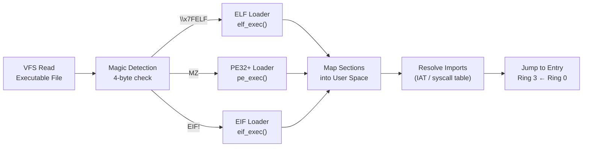
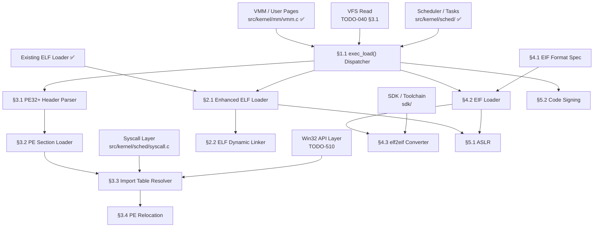

# Phase 01b — Binary Format System (ELF + PE32+ + EIF)

> **Goal:** Build a multi-format binary loader that supports three executable types:
>
> 1. **ELF** — Already implemented (✅ `src/kernel/elf.c`). Enhance for dynamic linking,
>    PIE, and Linux compatibility layer.
> 2. **PE32+ (Win32)** — Load Windows-compatible PE executables. Resolve imports against
>    Impossible OS's Win32-compatible API surface (`CreateFile`, `ReadFile`, etc.).
> 3. **EIF (Executable Impossible Format)** — Custom native format purpose-built for
>    Impossible OS. Uses Win32 API but eliminates PE legacy overhead. Fastest loading,
>    smallest binaries, native OS metadata support.
>
> All three share a common exec path: `exec_load()` auto-detects format from magic bytes
> and dispatches to the appropriate loader. This is **foundational** — every user-mode
> program (cmd.exe, diskpart.exe, explorer.exe) depends on this subsystem.

> [!IMPORTANT]
> **Priority: HIGH.** This must come early in the development chain because:
> - Every user-mode application depends on `exec_load()`
> - The Win32 API layer (`TODO-510`) depends on PE32+ import resolution
> - `diskpart.exe`, `cmd.exe`, File Manager, Terminal — all need a proper loader
> - The EIF format enables compiler toolchain work (SDK)
>
> **Current state:** Basic ELF loader exists in `src/kernel/elf.c` (143 lines).
> Loads PT_LOAD segments via identity mapping. Called from `task.c:635`.
>
> | File | Path | Status |
> |:--|:--|:--|
> | ELF loader | `src/kernel/elf.c` | ✅ Basic |
> | ELF header | `include/kernel/elf.h` | ✅ |
> | User linker script | `user/user.ld` (base 0x800000) | ✅ |
> | ELF shared libs | `TODO-026-ELF-Shared-Libraries.md` | ⬜ Planned |
> | Sub-files | See table below | — |
>
> | File                             | Scope                                                 |
> | -------------------------------- | ----------------------------------------------------- |
> | `TODO-042-Binary-System.md`      | Master file — architecture, priorities, OS comparison |
> | `TODO-042.01-ELF-Loader.md`      | Enhanced ELF loader — PIE, dynamic linking, ASLR      |
> | `TODO-042.02-PE32-Loader.md`     | PE32+ loader — imports, relocations, Win32 dispatch   |
> | `TODO-042.03-EIF-Format.md`      | EIF spec, loader, elf2eif converter, SDK integration  |

> [!CAUTION]
> **Memory Rule:** Use `pmm_alloc_contiguous()` for ALL buffers > 4 KB (executable
> file buffers, section data, import tables). `kmalloc` is ONLY for small kernel
> structs (≤ 4 KB). The current ELF loader identity-maps vaddr — future loaders
> must allocate user-space pages via VMM.

---

## Architecture Overview

### Format Auto-Detection

```c
/* src/kernel/exec.c — multi-format exec dispatcher */

int exec_load(const char *path, process_t *proc) {
    uint8_t magic[4];
    vfs_read(path, magic, 0, 4);

    if (magic[0] == 0x7F && magic[1] == 'E'
        && magic[2] == 'L'  && magic[3] == 'F')
        return elf_exec(path, proc);       /* Linux compat, dev tools */

    if (magic[0] == 'M' && magic[1] == 'Z')
        return pe_exec(path, proc);        /* Windows-compat PE32+ */

    if (magic[0] == 'E' && magic[1] == 'I'
        && magic[2] == 'F' && magic[3] == '!')
        return eif_exec(path, proc);       /* Impossible OS native */

    return -ENOEXEC;  /* Unknown format */
}
```

### Process Loading Pipeline



### Format Comparison

| Feature | ELF | PE32+ | EIF (Custom) |
|:--|:--|:--|:--|
| **Magic** | `\x7FELF` | `MZ` | `EIF!` |
| **Header size** | 64 bytes | ~256 bytes (DOS+PE+Optional) | 64 bytes |
| **Section model** | Program headers (PT_LOAD) | .text/.rdata/.data/.rsrc | Flat segments (like ELF) |
| **Import model** | PLT/GOT (dynamic linking) | Import Address Table (DLL names) | Syscall ID table (flat) |
| **Relocation** | REL/RELA entries | Base Relocation Table | Minimal (fixed base) or PIC |
| **API surface** | POSIX syscalls (Linux compat) | Win32 API (`kernel32.dll` stubs) | Win32 API (syscall IDs) |
| **Toolchain** | `clang-19 + ld.lld` (current) | `clang-19 + lld-link` | `clang-19 + ld.lld + elf2eif` |
| **Loading speed** | Fast | Medium (complex headers) | 🚀 Fastest (minimal parsing) |
| **Use case** | Dev tools, Linux compat | Windows app compat | Native OS apps |

### System Binary Format Map

> Every binary in Impossible OS has a designated format. The kernel is the **loader**,
> not the **loaded** — it stays ELF. User-mode apps use EIF (native) or PE32+ (Win32 compat).

| Binary | Format | Why |
|:--|:--|:--|
| `BOOTX64.EFI` | PE/COFF | Required by UEFI firmware |
| `kernel.exe` | ELF (keep) | Loaded by bootloader, Ring 0, no imports |
| `cmd.exe` | EIF → PE32+ | User-mode, Win32 API, loaded by kernel |
| `diskpart.exe` | EIF → PE32+ | User-mode, Win32 API, loaded by kernel |
| `explorer.exe` | EIF → PE32+ | User-mode, Win32 API, loaded by kernel |
| All user apps | EIF (native) or PE32+ (compat) | Depends on source: EIF for new apps, PE32+ for Windows ports |

> [!NOTE]
> **EIF → PE32+** means: build as EIF initially (faster loading, simpler), then add PE32+
> support when the Win32 import resolver (§3.3) is complete. Both formats use the same
> Win32 API underneath — the difference is only the container format.

---

## TODO Completion Roadmap

### Dependency Graph



### Phase-by-Phase Implementation Order

| ⭐ | P    | Sections                     | What It Delivers                           | Depends On             | Status |
| -- | :--: | ---------------------------- | ------------------------------------------ | ---------------------- | :----: |
| 💎 | P0   | Prerequisites                | VMM, VFS, scheduler, syscall layer         | —                      |   ✅   |
| 💎 | P0   | Existing ELF loader          | Basic PT_LOAD loading (identity mapped)    | —                      |   ✅   |
| 💎 | P1   | §1.1 exec_load() Dispatcher  | Multi-format auto-detection                | P0 (VFS, scheduler)    |   ⬜   |
| 💎 | P1   | §2.1 Enhanced ELF            | Proper VMM mapping, PIE, validation        | P1 (§1.1)              |   ⬜   |
| ⭐ | P1   | §4.1 EIF Format Spec         | 🚀 Design the EIF format                   | Design only            |   ⬜   |
| ⭐ | P1   | §4.2 EIF Loader              | 🚀 Load EIF binaries                       | P1 (§1.1 + §4.1)      |   ⬜   |
| ⭐ | P2   | §3.1 PE32+ Header Parser     | Parse MZ + PE + COFF + Optional headers    | P1 (§1.1)              |   ⬜   |
| ⭐ | P2   | §3.2 PE Section Loader       | Load .text/.rdata/.data/.bss into user mem | P2 (§3.1)              |   ⬜   |
| ⭐ | P2   | §3.3 Import Table Resolver   | Map DLL imports → OS syscalls              | P2 (§3.2) + Win32 API |   ⬜   |
| 💎 | P2   | §3.4 PE Relocation           | Base relocation for non-preferred base     | P2 (§3.2)              |   ⬜   |
| ⭐ | P2   | §4.3 elf2eif Converter       | 🚀 Host-side tool (dev workflow)            | P1 (§4.1)              |   ⬜   |
| 💎 | P3   | §2.2 ELF Dynamic Linker      | Shared libraries (.so loading)             | P1 (§2.1)              |   ⬜   |
| 💎 | P3   | §5.1 ASLR                    | Address Space Layout Randomization         | P2                     |   ⬜   |
| ⭐ | P4   | §5.2 Code Signing            | 🚀 Verify binary integrity before exec     | P2                     |   ⬜   |

> [!NOTE]
> **Phase 1** delivers the multi-format dispatcher, enhanced ELF, and the EIF native format.
> After P1, native Impossible OS apps can be built and loaded.
>
> **Phase 2** adds PE32+ loading — required for Win32 API compatibility. This is tied
> to the Win32 API implementation (`TODO-510`).
>
> **Phase 3** adds dynamic linking (shared libraries) and ASLR security hardening.
>
> **Phase 4** adds code signing — verify binaries before execution (anti-tamper).

> [!IMPORTANT]
> → XREF: `TODO-026-ELF-Shared-Libraries.md` — dynamic linking coverage
> → XREF: `TODO-510` — Win32 API layer (PE32+ import targets)
> → XREF: `TODO-040.99-Diskpart.md` — first real user-mode app to test all formats

---

## 1. Format Dispatcher

### 1.1 exec_load() — Multi-Format Auto-Detection

**Prompt:** Replace the current direct `elf_load()` call in `task.c:635` with a generic `exec_load(path, proc)` dispatcher. Read the first 4 bytes of the file to detect format: `\x7FELF` → ELF, `MZ` → PE32+, `EIF!` → EIF, anything else → `ENOEXEC`. Each format gets its own loader function. The dispatcher also handles process setup: allocate user-space page tables, set up user stack, prepare argc/argv, and context-switch to Ring 3. After completing all items, mark every item as `[x]`, update this prompt to a verification prompt, run `bash scripts/build.sh clean`, and commit as `"kernel: multi-format exec dispatcher"`. Add notes directly in this TODO section. After implementation, save any gotchas, solutions, and important information to MCP memory (`mcp_memory_create_entities` / `mcp_memory_add_observations`).

- [ ] Create `src/kernel/exec.c` + `include/kernel/exec.h`
- [ ] Define `exec_format_t` struct: `{ magic, magic_len, loader_fn, name }`
- [ ] Implement `exec_load(const char *path, process_t *proc)`:
  - [ ] Read first 4 bytes via VFS
  - [ ] Match against registered format handlers
  - [ ] Call format-specific loader
  - [ ] Allocate user-space pages via VMM (not identity map)
  - [ ] Set up user-mode stack (top of user address space)
  - [ ] Prepare argc/argv on user stack
  - [ ] Set up Ring 3 return context (RIP=entry, RSP=stack, CS/SS=user segments)
- [ ] Replace `elf_load()` call in `task.c:635` with `exec_load()`
- [ ] `exec_register_format(exec_format_t *)` — register new formats at boot
- [ ] Register ELF format at `kernel_main()` init
- [ ] Error handling: `ENOEXEC` for unknown formats, `ENOENT` for missing files
- [ ] Commit: `"kernel: multi-format exec dispatcher"`

---

## 2. ELF Loader (Enhanced)

### 2.1 Enhanced ELF Loader

**Prompt:** Upgrade the existing `elf_load()` in `src/kernel/elf.c` to use proper VMM page allocation instead of identity mapping. Support Position-Independent Executables (ET_DYN with PIE), proper segment permissions (RO for .text, RW for .data, NX for .data), and validate all bounds before copying. The current loader copies directly to `p_vaddr` — this must change to allocate user pages and map them. After completing all items, mark every item as `[x]`, update this prompt to a verification prompt, run `bash scripts/build.sh clean`, and commit as `"kernel: enhanced ELF loader"`. Add notes directly in this TODO section. After implementation, save any gotchas, solutions, and important information to MCP memory (`mcp_memory_create_entities` / `mcp_memory_add_observations`).

- [ ] Refactor `elf_load()` → `elf_exec(path, proc)`:
  - [ ] Read entire ELF file from VFS into kernel buffer
  - [ ] Validate ELF64 header (existing code, keep)
  - [ ] For each PT_LOAD segment:
    - [ ] Allocate user-space pages via `vmm_map_pages(proc->pml4, vaddr, ...)`
    - [ ] Copy segment data from kernel buffer to user pages
    - [ ] Set page permissions: PF_X → executable, PF_W → writable, PF_R → readable
    - [ ] Zero BSS (memsz > filesz) in allocated pages
  - [ ] Support ET_DYN (PIE): load at random base + vaddr
  - [ ] Set up auxiliary vector for dynamic linker (if PT_INTERP present)
  - [ ] Return entry point address
- [ ] Proper bounds checking: reject segments outside user address range
- [ ] Free kernel buffer after loading
- [ ] Commit: `"kernel: enhanced ELF loader"`

### 2.2 ELF Dynamic Linker

**Prompt:** Implement a minimal dynamic linker for ELF shared libraries (.so files). Parse PT_DYNAMIC, process DT_NEEDED entries, load shared libraries from `C:\Impossible\System\lib\`, resolve symbols via hash tables (DT_HASH / DT_GNU_HASH), and apply relocations (R_X86_64_JUMP_SLOT, R_X86_64_GLOB_DAT, R_X86_64_RELATIVE). This enables shared library support for the Linux compatibility layer.

> [!NOTE]
> → XREF: `TODO-026-ELF-Shared-Libraries.md` — detailed shared library plan.
> This section is a summary; the full implementation details are in that TODO.

- [ ] Parse PT_DYNAMIC segment for DT_NEEDED, DT_STRTAB, DT_SYMTAB, DT_HASH
- [ ] Load .so files from `C:\Impossible\System\lib\`
- [ ] Symbol resolution: DT_GNU_HASH lookup → DT_SYMTAB match
- [ ] Apply relocations: JUMP_SLOT (PLT), GLOB_DAT (GOT), RELATIVE (base fixup)
- [ ] Lazy binding: PLT stubs resolve on first call
- [ ] Commit: `"kernel: ELF dynamic linker"`

---

## 3. PE32+ Loader (Win32 Compatibility)

### 3.1 PE32+ Header Parser

**Prompt:** Parse the PE32+ (64-bit PE) executable format: DOS header (MZ at offset 0), PE signature at `e_lfanew`, COFF header (machine, section count, characteristics), PE Optional Header (ImageBase, SizeOfImage, AddressOfEntryPoint, SectionAlignment, FileAlignment, import/export directory RVAs). Validate all fields and reject 32-bit PE32 (only 64-bit PE32+ supported). After completing all items, mark every item as `[x]`, update this prompt to a verification prompt, run `bash scripts/build.sh clean`, and commit as `"kernel: PE32+ header parser"`. Add notes directly in this TODO section. After implementation, save any gotchas, solutions, and important information to MCP memory (`mcp_memory_create_entities` / `mcp_memory_add_observations`).

- [ ] Create `src/kernel/pe.c` + `include/kernel/pe.h`
- [ ] Define PE structures:
  - [ ] `pe_dos_header_t`: e_magic (MZ = 0x5A4D), e_lfanew
  - [ ] `pe_signature`: "PE\0\0" (0x00004550)
  - [ ] `pe_coff_header_t`: Machine (0x8664 for x86-64), NumberOfSections, Characteristics
  - [ ] `pe_optional_header64_t`: Magic (0x20B for PE32+), AddressOfEntryPoint, ImageBase,
        SectionAlignment, FileAlignment, SizeOfImage, SizeOfHeaders, NumberOfRvaAndSizes
  - [ ] `pe_data_directory_t`: VirtualAddress, Size (Import, Export, Reloc, etc.)
  - [ ] `pe_section_header_t`: Name, VirtualSize, VirtualAddress, SizeOfRawData, etc.
- [ ] Implement `pe_validate(data, size)`:
  - [ ] Check MZ magic, PE signature, Machine == 0x8664, Magic == 0x20B
  - [ ] Reject PE32 (32-bit): Magic == 0x10B → `ENOEXEC`
- [ ] Commit: `"kernel: PE32+ header parser"`

### 3.2 PE Section Loader

**Prompt:** Load PE32+ sections (.text, .rdata, .data, .rsrc, .reloc) into user-space memory. Allocate user pages starting at ImageBase (or relocated base if ASLR). Map sections with correct permissions: .text → RX, .rdata → RO, .data → RW. SectionAlignment (typically 4 KB) determines virtual alignment; FileAlignment (typically 512 bytes) determines file alignment. Handle zero-padding between VirtualSize and SizeOfRawData.

- [ ] Parse section headers (NumberOfSections entries after Optional Header)
- [ ] For each section:
  - [ ] Allocate user pages at `ImageBase + VirtualAddress`
  - [ ] Copy `SizeOfRawData` bytes from file offset `PointerToRawData`
  - [ ] Zero-fill `VirtualSize - SizeOfRawData` (BSS equivalent)
  - [ ] Set page permissions from `Characteristics`:
    - [ ] IMAGE_SCN_MEM_EXECUTE → executable
    - [ ] IMAGE_SCN_MEM_WRITE → writable
    - [ ] IMAGE_SCN_MEM_READ → readable
- [ ] Map PE headers (SizeOfHeaders) at ImageBase for PE introspection
- [ ] Commit: `"kernel: PE section loader"`

### 3.3 Import Table Resolver (Win32 Dispatch)

**Prompt:** This is the **most critical section** — it connects PE executables to Impossible OS's Win32 API. Parse the Import Directory Table (Data Directory entry 1). For each DLL import (kernel32.dll, user32.dll, ntdll.dll, etc.), resolve function names to Impossible OS kernel syscall stubs. Build the Import Address Table (IAT) with function pointers to OS-provided thunks. The DLL names don't load actual DLLs — they map to built-in OS function tables.

> [!IMPORTANT]
> **This is where PE32+ meets the Win32 API.** The import resolver is the bridge
> between Windows executables and Impossible OS. Every `CreateFile()`, `ReadFile()`,
> `WriteFile()` call in a PE binary resolves through this table.
>
> → XREF: `TODO-510` — Win32 API layer defines the actual function implementations.

- [ ] Parse Import Directory Table:
  - [ ] Walk array of `IMAGE_IMPORT_DESCRIPTOR` (one per DLL)
  - [ ] For each DLL: read Name RVA → get DLL name string (e.g., "kernel32.dll")
  - [ ] For each imported function: read Import Name Table (INT) entries
    - [ ] By name: `IMAGE_IMPORT_BY_NAME` → hint + function name string
    - [ ] By ordinal: ordinal number (less common)
- [ ] DLL → function table mapping:
  - [ ] `"kernel32.dll"` → `impossible_kernel32_exports[]`
  - [ ] `"user32.dll"` → `impossible_user32_exports[]`
  - [ ] `"ntdll.dll"` → `impossible_ntdll_exports[]`
  - [ ] `"advapi32.dll"` → `impossible_advapi32_exports[]`
  - [ ] Unknown DLL → load from disk (future: real DLL loading)
- [ ] Resolve function name → syscall thunk address:
  - [ ] Binary search or hash table lookup in export table
  - [ ] Write resolved address to IAT entry
- [ ] Commit: `"kernel: PE import table resolver"`

### 3.4 PE Base Relocation

**Prompt:** When the PE can't load at its preferred ImageBase (typically 0x140000000 for 64-bit), apply base relocations. Parse the Base Relocation Table (Data Directory entry 5). Add delta (actual_base - preferred_base) to every relocated address.

- [ ] Parse `.reloc` section (base relocation table)
- [ ] For each relocation block:
  - [ ] Base RVA + array of type/offset entries
  - [ ] Type IMAGE_REL_BASED_DIR64 (10): add delta to 64-bit address at offset
  - [ ] Type IMAGE_REL_BASED_ABSOLUTE (0): skip (padding)
- [ ] Apply delta = actual_base - ImageBase to all relocations
- [ ] Commit: `"kernel: PE base relocation"`

---

## 4. EIF — Executable Impossible Format (🚀 Native)

### 4.1 EIF Format Specification

**Prompt:** Design the Executable Impossible Format (EIF) — Impossible OS's native binary format. Design goals: (1) minimal parsing overhead — load in <10 μs, (2) no legacy cruft — no DOS stub, no PE compatibility layers, (3) native OS metadata — capabilities, digital signatures, version info, (4) Win32 API access via syscall ID table — no string-based import resolution, (5) simple toolchain — `elf2eif` converter from standard ELF output.

> [!TIP]
> **EIF advantages over PE32+ and ELF:**
> - **6× smaller header** than PE32+ (64 bytes vs ~400 bytes)
> - **Instant loading** — syscall IDs instead of string import resolution
> - **Native metadata** — capabilities, signatures, versioning built-in
> - **Simple toolchain** — compile with standard clang → convert with `elf2eif`

- [ ] Define `eif_header_t` (64 bytes):
  ```
  offset  size  field
  0x00    4     magic: "EIF!" (0x21464945)
  0x04    2     version: format version (1)
  0x06    2     arch: 1 = x86_64
  0x08    4     flags: GUI(1) | CONSOLE(2) | DRIVER(4) | SIGNED(8)
  0x0C    4     api_version: Win32 API version (1.0 = 0x0100)
  0x10    8     entry_point: virtual address of entry
  0x18    8     load_base: preferred load base address
  0x20    4     segment_count: number of segments
  0x24    4     import_count: number of syscall imports
  0x28    4     segment_offset: file offset of segment table
  0x2C    4     import_offset: file offset of import table
  0x30    8     signature_offset: file offset of digital signature (0 if unsigned)
  0x38    8     metadata_offset: file offset of metadata section (0 if none)
  ```
- [ ] Define `eif_segment_t` (32 bytes each):
  ```
  offset  size  field
  0x00    8     vaddr: virtual address to load at
  0x08    8     file_offset: offset in file
  0x10    4     file_size: bytes to copy from file
  0x14    4     mem_size: total memory size (>= file_size, diff is zeros)
  0x18    4     flags: R(1) | W(2) | X(4)
  0x1C    4     reserved
  ```
- [ ] Define `eif_import_t` (8 bytes each):
  ```
  offset  size  field
  0x00    4     syscall_id: Impossible OS syscall number
  0x04    4     flags: optional (0 = required, 1 = optional)
  ```
  - [ ] No string-based resolution — syscall IDs are assigned at build time
  - [ ] Import table is a flat array of syscall numbers
  - [ ] At load time, kernel builds a function pointer table from syscall IDs
- [ ] Write format specification document: `docs/specs/eif-format.md`
- [ ] Commit: `"docs: EIF format specification"`

### 4.2 EIF Loader

**Prompt:** Implement the EIF loader in the kernel. Parse the 64-byte header, load segments into user space, build syscall dispatch table from imports, and jump to entry point. This should be the fastest possible loading path — the format is designed to minimize parsing overhead.

- [ ] Create `src/kernel/eif.c` + `include/kernel/eif.h`
- [ ] Implement `eif_exec(path, proc)`:
  - [ ] Read 64-byte header, validate magic "EIF!" + arch + version
  - [ ] Read segment table (segment_count × 32 bytes)
  - [ ] For each segment: allocate user pages, copy data, set permissions
  - [ ] Read import table (import_count × 8 bytes)
  - [ ] Build syscall dispatch: import_table[i] → kernel syscall handler
  - [ ] Map dispatch table into user space at well-known address
  - [ ] Set entry point
- [ ] Validate digital signature if SIGNED flag is set (§5.2)
- [ ] Performance target: < 10 μs for typical 64 KB binary
- [ ] Commit: `"kernel: EIF loader"`

### 4.3 elf2eif Converter Tool

**Prompt:** Build a host-side tool (`tools/elf2eif`) that converts standard ELF64 executables to EIF format. The development workflow is: compile C code with standard `clang-19` → link with `ld.lld` → convert with `elf2eif`. This means developers use standard toolchains — no custom compiler needed. The converter reads ELF PT_LOAD segments, extracts the import table from a special `.eif_imports` section (or generates it from symbol names), and writes the EIF binary.

> [!TIP]
> **Developer workflow:**
> ```bash
> # Compile C source
> clang-19 --target=x86_64-elf -c myapp.c -o myapp.o
> # Link as ELF
> ld.lld-19 -T user/user.ld myapp.o -o myapp.elf
> # Convert to EIF
> tools/elf2eif myapp.elf myapp.eif
> ```
> Standard toolchain, standard C. Only the final conversion step is custom.

- [ ] Create `tools/elf2eif.c` (compiled with host `gcc`)
- [ ] Read input ELF64, validate headers
- [ ] Extract PT_LOAD segments → EIF segments
- [ ] Generate import table:
  - [ ] Scan ELF `.dynsym` or custom `.eif_imports` section
  - [ ] Map Win32 API function names → syscall IDs
  - [ ] Maintain `syscall_map.h` with ID assignments
- [ ] Write EIF output: header + segments + imports
- [ ] Optional: embed digital signature
- [ ] Makefile: `make elf2eif` builds the host tool
- [ ] Integrate into build system: auto-convert user programs to EIF
- [ ] Commit: `"tools: elf2eif converter"`

---

## 5. Security Hardening

### 5.1 ASLR — Address Space Layout Randomization

**Prompt:** Randomize the load base address for PIE ELF, EIF, and optionally PE32+ binaries. Use a PRNG seeded from RDRAND (or timestamp if RDRAND unavailable) to choose a random base within the user address space. This prevents ROP and code-reuse attacks.

- [ ] Random base selection for PIE ELF (ET_DYN)
- [ ] Random base for EIF (non-zero load_base → add random offset)
- [ ] Random base for PE32+ (apply relocations to random base)
- [ ] Random user stack base
- [ ] PRNG: use RDRAND instruction if available, fallback to TSC-seeded LCG
- [ ] Commit: `"kernel: ASLR for user-mode binaries"`

### 5.2 Code Signing

**Prompt:** Verify digital signatures on EIF binaries before execution. The signature covers the header + all segment data. Signed binaries can be trusted for privileged operations; unsigned binaries run with reduced capabilities. This is an Impossible OS exclusive — neither Windows nor Linux signs individual user binaries by default.

- [ ] EIF signature verification:
  - [ ] Read signature from `signature_offset` in EIF header
  - [ ] Compute SHA-256 hash of header + segments
  - [ ] Verify signature against trusted public key (embedded in kernel)
- [ ] Policy: `SIGNED` flag in EIF header → require valid signature
- [ ] Unsigned binaries: run with reduced capabilities (no raw disk I/O, etc.)
- [ ] `tools/eifsign` — host-side tool to sign EIF binaries
- [ ] Commit: `"kernel: EIF code signing"`

---

## Priority Order

| ⭐ | Priority  | Section                          | Description                                              |
| -- | --------- | -------------------------------- | -------------------------------------------------------- |
| 💎 | 🔴 P0     | §1.1 exec_load() Dispatcher     | Foundation — multi-format auto-detection                 |
| 💎 | 🔴 P0     | §2.1 Enhanced ELF Loader        | Proper VMM mapping, permissions, PIE                     |
| ⭐ | 🔴 P0     | §4.1 EIF Format Spec            | 🚀 Design the native binary format                       |
| ⭐ | 🔴 P0     | §4.2 EIF Loader                 | 🚀 Native binary loading — fastest path                   |
| ⭐ | 🟠 P1     | §3.1 PE32+ Header Parser        | Parse Windows PE executables                             |
| ⭐ | 🟠 P1     | §3.2 PE Section Loader          | Load PE sections into user memory                        |
| ⭐ | 🟠 P1     | §3.3 Import Table Resolver      | 🚀 Win32 API bridge — the critical piece                  |
| 💎 | 🟠 P1     | §3.4 PE Base Relocation         | Handle non-preferred ImageBase                           |
| ⭐ | 🟡 P2     | §4.3 elf2eif Converter          | 🚀 Developer toolchain integration                       |
| 💎 | 🟡 P2     | §2.2 ELF Dynamic Linker         | Shared library support                                   |
| 💎 | 🟢 P3     | §5.1 ASLR                       | Address space randomization                              |
| ⭐ | 🟢 P3     | §5.2 Code Signing               | 🚀 **Exclusive** — binary integrity verification          |

---

## OS Comparison

| ⭐ | Feature                          | 🪟 Windows 11                      | 🐧 Linux                           | 🚀 Impossible OS                                 |
| -- | -------------------------------- | ---------------------------------- | ----------------------------------- | ------------------------------------------------ |
| 💎 | Native binary format             | ✅ PE32+ (PE/COFF)                 | ✅ ELF                              | ⬜ §4 P0 — **EIF (custom native format)** 🚀     |
| 💎 | ELF loading                      | ⚠️ WSL only                        | ✅ Native                            | ⬜ §2.1 P0 — enhanced ELF loader                 |
| 💎 | PE32+ loading                    | ✅ Native                          | ⚠️ Wine (user-space emulation)       | ⬜ §3 P1 — kernel-level PE loader                |
| ⭐ | **Triple format support**        | ❌ PE32+ only (natively)           | ❌ ELF only (natively)              | ⬜ **§1.1 P0 — ELF + PE32+ + EIF** 🚀           |
| ⭐ | **< 10 μs binary loading**       | ❌ ~50 μs (PE parsing + imports)   | ❌ ~30 μs (ELF + dynamic linking)   | ⬜ **§4.2 P0 — EIF instant load** 🚀             |
| ⭐ | **No-string import resolution**  | ❌ String-based DLL import         | ❌ String-based symbol resolution   | ⬜ **§4.1 P0 — syscall ID table** 🚀             |
| 💎 | Win32 API from PE imports        | ✅ Native kernel32.dll             | ⚠️ Wine reimplements                | ⬜ §3.3 P1 — kernel-integrated IAT               |
| 💎 | Dynamic linking / shared libs    | ✅ DLL loading                     | ✅ ld.so / ld-linux.so              | ⬜ §2.2 P2 — ELF dynamic linker                  |
| ⭐ | **Built-in ASLR**                | ✅ Mandatory since Vista           | ✅ PIE + kernel ASLR                | ⬜ **§5.1 P3 — all three formats**               |
| ⭐ | **Binary code signing**          | ⚠️ Authenticode (optional)         | ❌ No built-in per-binary signing   | ⬜ **§5.2 P3 — mandatory for EIF** 🚀            |

> **After P0 items:** Impossible OS has a triple-format exec system with the world's fastest native binary loader (EIF).
> **After P1 items:** Full Win32 PE32+ loading — run Windows-compiled executables natively.
> **After P3 items:** Complete security hardening — ASLR + code signing across all formats.
