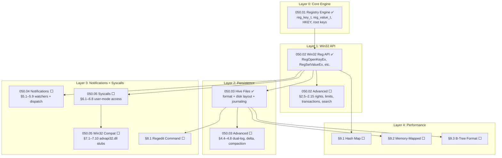

# P0102 — Registry System (Windows-Compatible)

> **Goal:** Replace the Codex registry with a full Windows-compatible **Registry** system
> using the same API surface as Win32 (`RegOpenKeyEx`, `RegSetValueEx`, etc.), the same
> root keys (`HKEY_LOCAL_MACHINE`, `HKEY_CURRENT_USER`, etc.), and the same value types
> (`REG_SZ`, `REG_DWORD`, `REG_BINARY`, etc.). Store registry data in binary hive files
> with crash-safe journaling. Provide a `regedit` shell command for inspection.

> [!CAUTION]
> **Memory Rule:** Use `pmm_alloc_contiguous()` for ALL buffers > 4 KB (hive file buffers, large binary values). `kmalloc` is ONLY for small kernel structs (≤ 4 KB). Violating this crashes the 2 MiB heap silently. See `rules.md` Known Gotchas.

> [!IMPORTANT]
> **Migration complete:** The old Codex system (`codex.c`, `codex.h`) has been deleted.
> All call sites now use the Registry API. The disk format uses `.hive` binary files
> with crash-safe journaling (WAJ).

---

## TODO Completion Roadmap (Cross-File)

> | File                             | Scope                                                                                   |
> | -------------------------------- | --------------------------------------------------------------------------------------- |
> | `TODO-050-Registry.md`           | Master file — roadmap, priorities, OS comparison, regedit, performance                  |
> | `TODO-050.01-Registry-Engine.md` | Core engine: `reg_key_t`, `reg_value_t`, `HKEY`, pools, value types, root keys          |
> | `TODO-050.02-Win32-Reg-API.md`   | Win32 API: key/value ops, enum, helpers, transactions, search, diff, GC                 |
> | `TODO-050.03-Hive.md`            | Hive persistence: format, disk layout, journaling, delta flush, compaction              |
> | `TODO-050.04-Notification.md`    | Change notifications: watchers, dispatch, coalescing, telemetry, detail payloads        |
> | `TODO-050.05-Syscalls.md`        | Syscalls, user-mode lib, advapi32.dll, HKCR, virtualization, .reg, quota, transactions  |

### Dependency Graph

### Phase-by-Phase Implementation Order

| Phase | TODO File               | Section(s)             | What It Delivers                                       | Depends On        | Status |
| :---: | ----------------------- | ---------------------- | ------------------------------------------------------ | ----------------- | :----: |
| **0** | `050.01-Engine.md`      | §1.1–1.3               | `reg_key_t`, `reg_value_t`, pools, FNV-1a, root keys   | —                 |   ✅   |
| **1** | `050.02-Win32-API.md`   | §2.1–2.4               | `RegOpenKeyEx`, `RegSetValueEx`, enum, helpers         | Phase 0 (050.01)  |   ✅   |
| **2** | `050.03-Hive.md`        | §4.1–4.3               | Hive format, disk layout, crash-safe journaling        | Phase 1 (050.02)  |   ✅   |
| **3** | `050.04-Notification`   | §5.1–5.5               | Watchers, dispatch, subtree, lifecycle                 | Phase 1 (050.02)  |   ⬜   |
| **3** | `050.05-Syscalls.md`    | §6.1–6.3               | Syscalls, pointer validation, access control           | Phase 1 (050.02)  |   ⬜   |
| **3** | `050-Registry.md`       | §8.1                   | `regedit` shell command                                | Phase 2 (050.03)  |   ⬜   |
| **4** | `050.02-Win32-API.md`   | §2.5–2.7               | Access rights, API limits, RegFlushKey                 | Phase 1 (050.02)  |   ⬜   |
| **4** | `050.05-Syscalls.md`    | §6.4, §7.1, §7.6       | User-mode lib, advapi32.dll stubs, error map           | Phase 3 (§6.1–3)  |   ⬜   |
| **5** | `050.02-Win32-API.md`   | §2.8–2.9, §2.11        | Advanced ops, hive import/export, volatile keys        | Phase 1 (050.02)  |   ⬜   |
| **5** | `050.05-Syscalls.md`    | §7.2–7.3               | UTF-16 A/W handling, HKCR merged view                  | Phase 4 (§7.1)    |   ⬜   |
| **5** | `050.05-Syscalls.md`    | §7.4–7.5               | Registry virtualization, .reg import/export            | Phase 4 (§7.1)    |   ⬜   |
| **6** | `050.02-Win32-API.md`   | §2.10, §2.12           | Delayed Close Cache, Transactions                      | Phase 4 (050.02)  |   ⬜   |
| **6** | `050.03-Hive.md`        | §4.4–4.5               | Dual-log WAJ, incremental delta flush                  | Phase 2 (050.03)  |   ⬜   |
| **6** | `050.04-Notification`   | §5.6–5.7               | Batch coalescing, telemetry                            | Phase 3 (§5.3)    |   ⬜   |
| **6** | `050.05-Syscalls.md`    | §6.5–6.7               | Sandbox, rate limit, audit                             | Phase 3 (§6.3)    |   ⬜   |
| **6** | `050.05-Syscalls.md`    | §7.7–7.8               | API tracing, app shims                                 | Phase 4 (§7.1)    |   ⬜   |
| **7** | `050.02-Win32-API.md`   | §2.13–2.15             | Search API, diff/compare, orphan GC                    | Phase 1 (050.02)  |   ⬜   |
| **7** | `050.03-Hive.md`        | §4.6–4.8               | Integrity reporter, versioning, compaction             | Phase 2 (050.03)  |   ⬜   |
| **7** | `050.04-Notification`   | §5.8–5.9               | Change-detail payloads, priority dispatch              | Phase 3 (§5.3)    |   ⬜   |
| **7** | `050.05-Syscalls.md`    | §6.8, §7.9–7.10        | Per-PID quota, snapshot/diff, transactions             | Phase 3 (§6.1)    |   ⬜   |
| **8** | `050-Registry.md`       | §9.1–9.3               | Hash map, mmap, B-tree (perf stretch goals)            | Phase 2 (050.03)  |   ⬜   |

> [!NOTE]
> **Phases 0–2 are complete.** The core engine (050.01), Win32 API (050.02), and disk
> persistence with crash-safe journaling (050.03) are all implemented and verified.
>
> **Phase 3** delivers three independent features: change notifications (050.04),
> user-mode syscalls (050.05 §6), and the regedit shell command (§8.1).
>
> **Phase 4** builds access rights enforcement (050.02 §2.5–2.7) and the Win32
> compatibility layer (050.05 §6.4, §7.1, §7.6) on top of the syscalls.
>
> **Phase 5** adds advanced Win32 API operations (050.02 §2.8–2.9, §2.11), full
> Unicode (W variants), HKCR, virtualization, and .reg import/export.
>
> **Phase 6** adds exclusive features across all sub-files: delayed close cache,
> transactions, dual-log WAJ, delta flush, notification coalescing, telemetry,
> per-process sandbox, rate limiting, audit log, API tracing, and app compat shims.
>
> **Phase 7** adds advanced exclusive features: search API, diff/compare, orphan GC,
> hive integrity reporter, format versioning, compaction, change-detail payloads,
> priority dispatch, per-PID quota, snapshot/diff, and transaction API.
>
> **Phase 8** contains stretch performance goals: hash map, mmap, B-tree.

---

## 3. Disk Persistence (Hive Files)

> **→ See [TODO-050.03-Hive.md](TODO-050-Registry/TODO-050.03-Hive.md)** ✅ / ⬜
>
> Covers: §4.1 Hive File Format ✅, §4.2 Disk Layout ✅, §4.3 Crash-Safe Journaling ✅,
> §4.4 Dual-Log Journaling 🚀, §4.5 Incremental Delta Flush 🚀, §4.6 Hive Integrity
> Reporter 🚀, §4.7 Hive Format Versioning 🚀, §4.8 Hive Compaction 🚀.
> Core sections (§4.1–4.3) complete. Exclusive features (§4.4–4.8) pending.

---

## 4. Change Notifications

> **→ See [TODO-050.04-Notification.md](TODO-050-Registry/TODO-050.04-Notification.md)** ⬜
>
> Covers: §5.1 Watcher Data Structures, §5.2 RegNotifyChangeKeyValue, §5.3 Dispatch,
> §5.4 Subtree Watching, §5.5 Lifecycle, §5.6 Batch Coalescing 🚀, §5.7 Telemetry 🚀,
> §5.8 Change-Detail Payloads 🚀, §5.9 Priority-Based Dispatch 🚀.
> Not yet started.

---

## 5. Syscalls & Win32 Compatibility

> **→ See [TODO-050.05-Syscalls.md](TODO-050-Registry/TODO-050.05-Syscalls.md)** ⬜
>
> Covers: §6.1 Syscall Numbers, §6.2 Pointer Validation, §6.3 Access Control,
> §6.4 User-Mode Library, §7.1 advapi32.dll Stubs, §7.2 UTF-16 Handling,
> §7.3 HKCR Merged View, §7.4 Registry Virtualization, §7.5 .reg Import/Export,
> §7.6 Error Mapping, §6.5 Per-Process Sandbox 🚀, §6.6 Rate Limiting 🚀,
> §6.7 Audit Log 🚀, §7.7 API Call Tracing 🚀, §7.8 App Compat Shims 🚀,
> §6.8 Per-Process Registry Quota 🚀, §7.9 Registry Snapshot & Diff 🚀,
> §7.10 Registry Transaction API 🚀.
> Not yet started.

---

## 8. Tools & Debugging

### 8.1 Regedit Shell Command

**Prompt:** Add a `regedit` shell command for inspecting and modifying the registry from the command line. Subcommands: `regedit list HKLM\SYSTEM` (list sub-keys), `regedit query HKLM\SYSTEM\Display Width` (read a value), `regedit set HKLM\SYSTEM\Display Width REG_DWORD 1920` (write a value), `regedit delete HKLM\SYSTEM\OldKey` (delete a key), `regedit export HKLM\SYSTEM output.reg` (export as text), `regedit tree HKLM` (show full tree). After completing all items, mark every item as `[x]`, update this prompt to a verification prompt that can be used for future correctness checks, run `bash scripts/build.sh clean`, and commit as `"shell: regedit command"`. Add notes, gotchas, and design decisions directly in this TODO section covering the regedit command syntax, subcommands, and .reg export format.

- [ ] `regedit list <path>` — list sub-keys and values
- [ ] `regedit query <path> <valueName>` — read and display a value
- [ ] `regedit set <path> <valueName> <type> <data>` — write a value
- [ ] `regedit delete <path>` — delete a key or value
- [ ] `regedit tree <path>` — recursive tree display
- [ ] `regedit export <path> <file>` — export sub-tree as `.reg` text file
- [ ] Commit: `"shell: regedit command"`

---

## 9. Performance Optimizations (Future)

### 9.1 Hash Map Child Lookup

- [ ] Replace linked-list children with FNV-1a hash map
- [ ] Target: O(1) key lookup instead of O(n) linear scan
- [ ] Resize hash table when load factor exceeds 0.75

### 9.2 Memory-Mapped Hive Files

- [ ] `mmap` hive files directly (requires Phase 01 §3.2 mmap)
- [ ] Zero-copy reads — keys/values point directly into mapped pages
- [ ] Dirty page tracking — only write changed pages on flush

### 9.3 B-Tree Cell Format

- [ ] Replace flat sequential format with B-tree bins and cells
- [ ] Random-access reads without loading entire hive into RAM
- [ ] Matches Windows NT hive internals for maximum compatibility

---

## Priority Order

| Priority | TODO File / Section                          | Description                                                |
| -------- | -------------------------------------------- | ---------------------------------------------------------- |
| ✅ Done  | `050.01` §1.1–1.3 Registry Engine            | Core data structures, value types, root keys               |
| ✅ Done  | `050.02` §2.1–2.4 Win32 API                  | Key/value ops, enum, helpers                               |
| ✅ Done  | `050.03` §4.1–4.3 Hive Persistence           | Format, disk layout, crash-safe journaling                 |
| 🟠 P1    | `050.02` §2.5–2.6 Access Rights + Limits     | Correctness: KEY_* bits, name/depth limits                 |
| 🟡 P2    | `050.02` §2.7 RegFlushKey                    | Persistence guarantee for critical writes                  |
| 🟡 P2    | `050.04` §5.1–5.5 Notifications              | Real-time settings updates                                 |
| 🟡 P2    | `050.05` §6.1–6.3 Syscalls + Access          | User-mode app access                                       |
| 🟡 P2    | `050-Registry` §8.1 Regedit                  | Debugging + inspection                                     |
| 🟡 P2    | `050.05` §6.4, §7.1, §7.6 Lib + Stubs        | advapi32.dll A-variant + error mapping                     |
| 🟡 P2    | `050.05` §7.2–7.3 UTF-16 + HKCR              | Full Unicode, HKCR merged view                             |
| 🟡 P2    | `050.02` §2.8–2.9, §2.11 Advanced Ops        | Copy, rename, save/restore, volatile keys                  |
| 🟢 P3    | `050.05` §7.4–7.5 Virtualization + .reg      | Vista-style redirect, .reg import/export                   |
| 🟢 P3    | `050.02` §2.10, §2.12 Cache + Transactions   | LRU close cache, atomic batch updates                      |
| 🟢 P3    | `050.03` §4.4–4.5 Dual-Log + Delta Flush     | Alternating WAJ, dirty-page partial writes                 |
| 🟢 P3    | `050.04` §5.6–5.7 Coalescing + Telemetry     | Batch dedup, watcher stats                                 |
| 🟢 P3    | `050.04` §5.8–5.9 Detail + Priority          | Old/new value payloads, priority dispatch                  |
| 🟢 P3    | `050.05` §6.5–6.7 Sandbox + Rate + Audit     | Per-PID HKCU, throttle, audit log                          |
| 🟢 P3    | `050.05` §7.7–7.8 Tracing + Shims            | API call tracing, app compat                               |
| 🔵 P4    | `050.02` §2.13–2.15 Search + Diff + GC       | Pattern search, snapshot diff, orphan GC                   |
| 🔵 P4    | `050.03` §4.6–4.8 Integrity + Ver + Compact  | chkregistry, format versioning, idle compaction            |
| 🔵 P4    | `050.05` §6.8, §7.9–7.10 Quota + Snap + Txn  | Per-PID quota, snapshot/diff, transaction API              |
| 🔵 P4    | `050-Registry` §9.1–9.3 Performance          | Hash map, mmap, B-tree (stretch goals)                     |

---

## OS Comparison

| ⭐ | Feature                            | 🪟 Windows 11                    | 🐧 Linux                         | 🚀 Impossible OS                                 |
| -- | ---------------------------------- | --------------------------------- | -------------------------------- | ------------------------------------------------- |
| 💎 | Hierarchical key/value store       | ✅ Full tree                     | ✅ dconf (GNOME), ini files       | ✅ `050.01` — HKLM/HKCU/HKCR tree               |
| 💎 | Typed values (DWORD, SZ, BINARY…)  | ✅ Full Win32 types              | ⚠️ Strings only (dconf: GVariant) | ✅ `050.01` — All REG_* types                   |
| 💎 | Win32 API (`RegOpenKeyEx`…)        | ✅ Native                        | ❌                                | ✅ `050.02` — Complete native API               |
| 💎 | Persistent binary hive files       | ✅ `.hive` format                | ✅ dconf binary db                | ✅ `050.03` — 4 KiB header, CRC32               |
| 💎 | Crash-safe journaling              | ✅ Transaction log               | ⚠️ No fsync on dconf              | ✅ `050.03` — `.hive.log` WAJ                   |
| 💎 | Change notifications               | ✅ `RegNotifyChangeKeyValue`     | ⚠️ inotify on ini files           | ⬜ `050.04` P2 — callback-based                 |
| 💎 | User-mode registry syscalls        | ✅ NtOpenKey, NtSetValueKey      | ❌ No registry (dconf via D-Bus)  | ⬜ `050.05` §6.1 P2 — `SYS_REG_*`               |
| 💎 | advapi32.dll compatibility         | ✅ Native DLL                    | ⚠️ Wine reimplements              | ⬜ `050.05` §7.1 P2 — A/W stubs                 |
| 💎 | HKCR merged view                   | ✅ HKCU + HKLM\Classes merged    | ❌ No concept                     | ⬜ `050.05` §7.3 P2 — two-level lookup          |
| 💎 | `regedit` shell inspection         | ✅ GUI regedit.exe               | ✅ `dconf-editor` (GNOME)         | ⬜ §8.1 P2 — CLI + subcommands                  |
| 💎 | Registry virtualization (Vista+)   | ✅ VirtualStore under HKCU       | ❌ No concept                     | ⬜ `050.05` §7.4 P3 — HKLM → HKCU redirect      |
| 💎 | .reg file import/export            | ✅ Registry Editor built-in      | ⚠️ Wine `regedit` tool            | ⬜ `050.05` §7.5 P3 — full v5.00 format         |
| 💎 | Dual-log WAJ failover              | ✅ `.log1`/`.log2` alternating   | ❌ No concept                     | ⬜ `050.03` §4.4 P3 — alternating WAJ           |
| ⭐ | **Incremental delta flush**        | ❌ Full hive rewrite             | ❌ Full db rewrite                | ⬜ `050.03` §4.5 P3 — **dirty-page bitmap**     |
| ⭐ | **Batch notification coalescing**  | ❌ Fires once per change         | ❌ No coalescing                  | ⬜ `050.04` §5.6 P3 — **timer-based dedup**     |
| ⭐ | **Change-detail payloads**         | ❌ Only signals "changed"        | ❌ inotify: file only             | ⬜ `050.04` §5.8 P3 — **old/new in callback**   |
| ⭐ | **Priority-based dispatch**        | ❌ All watchers equal            | ❌ All watchers equal             | ⬜ `050.04` §5.9 P3 — **system-first**          |
| ⭐ | **Per-process registry sandbox**   | ❌ HKCU shared among all procs   | ❌ No concept                     | ⬜ `050.05` §6.5 P3 — **per-PID HKCU**          |
| ⭐ | **Syscall rate limiting**          | ❌ No rate limit                 | ❌ No rate limit                  | ⬜ `050.05` §6.6 P3 — **throttle**              |
| ⭐ | **Built-in API call tracing**      | ❌ Requires ProcMon / ETW        | ❌ No registry concept            | ⬜ `050.05` §7.7 P3 — **on/off toggle**         |
| ⭐ | **Atomic registry transactions**   | ⚠️ KTM (deprecated)              | ⚠️ dconf change_set (no rollback) | ⬜ `050.02` §2.12 P3 — **lightweight**          |
| ⭐ | **Registry app compat shims**      | ⚠️ ACT + SDB (binary)            | ❌ No concept                     | ⬜ `050.05` §7.8 P3 — **via Registry**          |
| ⭐ | **Native registry search API**     | ❌ Manual enumerate+match        | ❌ No search                      | ⬜ `050.02` §2.13 P4 — **glob pattern**         |
| ⭐ | **Registry diff/compare**          | ❌ Requires third-party RegShot  | ❌ No equivalent                  | ⬜ `050.02` §2.14 P4 — **snapshot diff**        |
| ⭐ | **Pool garbage collection**        | ❌ Dynamic alloc (no pool)       | ❌ Dynamic alloc                  | ⬜ `050.02` §2.15 P4 — **self-healing GC**      |
| ⭐ | **Hive integrity reporter**        | ❌ No built-in health check      | ❌ No concept                     | ⬜ `050.03` §4.6 P4 — **chkregistry**           |
| ⭐ | **Hive format versioning**         | ⚠️ regf v1.3/1.5 (no migrate)    | ❌ No versioning                  | ⬜ `050.03` §4.7 P4 — **auto-upgrade**          |
| ⭐ | **Idle-time hive compaction**      | ❌ No defragmentation            | ❌ No concept                     | ⬜ `050.03` §4.8 P4 — **auto-compact**          |
| ⭐ | **Per-process registry quota**     | ❌ Global limit only             | ❌ No size limits                 | ⬜ `050.05` §6.8 P4 — **per-PID quota**         |
| ⭐ | **Registry snapshot & diff**       | ❌ Requires third-party RegShot  | ❌ No concept                     | ⬜ `050.05` §7.9 P4 — **built-in snap+diff**    |
| ⭐ | **Atomic user-mode transactions**  | ❌ KTM deprecated/removed        | ⚠️ dconf change_set (no rollback) | ⬜ `050.05` §7.10 P4 — **lightweight txn**      |
| ⭐ | **Static pool allocation**         | ❌ Dynamic allocation            | ❌ Dynamic allocation             | ✅ `050.01` — **zero heap pressure**            |
| ⭐ | **In-kernel WAJ**                  | ✅ Kernel-level                  | ❌ dconf in user-space            | ✅ `050.03` — **kernel WAJ, zero daemon**       |

> **After Phases 0–2 (✅):** Impossible OS matches Windows feature-for-feature on core
> registry, API, persistence, and crash safety. Exceeds Linux with native in-kernel typed store.
> **After Phase 3–5:** Full parity with Windows — change notifications, user-mode access,
> advapi32.dll A/W stubs, HKCR, virtualization, regedit, .reg import/export.
> **After Phase 6:** Exceeds both — notification coalescing, per-process sandbox, rate
> limiting, audit log, API tracing, app compat shims, dual-log WAJ, delta flush,
> transactions, delayed close cache.
> **After Phase 7:** Advanced exclusives — search API, diff/compare, orphan GC, hive
> integrity reporter, format versioning, compaction, change-detail payloads, priority
> dispatch, per-PID quota, snapshot/diff, transaction API.
> **After Phase 8:** Performance-optimized with mmap and B-tree (Windows NT hive compat).
