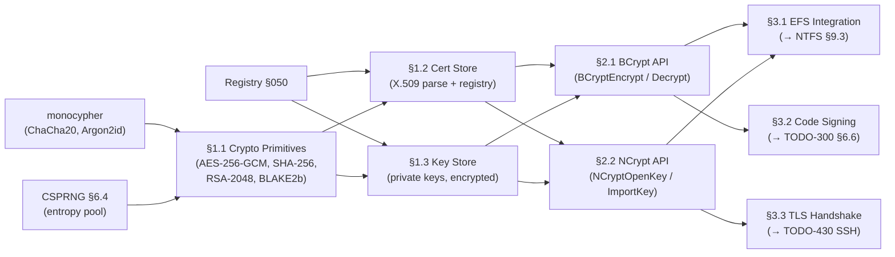

# P2305 — CNG Crypto: Certificates, Key Store & Encryption APIs

> **Goal:** Implement the cryptographic foundation for Impossible OS that all
> higher-level features depend on: certificate store, RSA/AES/SHA primitives,
> Win32-compatible CNG API surface (`BCryptEncrypt`, `NCryptOpenKey`), and the
> key management infrastructure required by NTFS EFS (§9.3 in TODO-040.08),
> TLS (TODO-430-SSH), and code signing (TODO-300 §6.6).

> [!CAUTION]
> **Memory Rule:** Use `pmm_alloc_contiguous()` for ALL buffers > 4 KB. `kmalloc`
> is ONLY for small kernel structs (≤ 4 KB). Violating this crashes the 2 MiB
> heap silently. See `rules.md` Known Gotchas.

> [!IMPORTANT]
> **Prerequisites:**
> - `TODO-300 §5.1` — monocypher library must be integrated (ChaCha20, Argon2id)
> - `TODO-300 §6.4` — CSPRNG / entropy pool (nonce generation)
> - `TODO-050` — Registry (key/cert persistence under `HKLM\SECURITY\`)

---

## Dependency Graph

---

## Implementation Order

| Priority | Section | Feature | Depends On |
|---|---|---|---|
| 🔴 P0 | §1.1 | Crypto Primitives | monocypher, CSPRNG |
| 🔴 P0 | §1.2 | Certificate Store | §1.1 + Registry |
| 🔴 P0 | §1.3 | Key Store | §1.1 + Registry |
| 🟠 P1 | §2.1 | BCrypt API | §1.1–1.3 |
| 🟠 P1 | §2.2 | NCrypt API | §1.2–1.3 |
| 🟡 P2 | §3.1 | EFS Integration | §2.1–2.2 + NTFS §9.3 |
| 🟢 P3 | §3.2 | Code Signing | §2.1–2.2 |
| 🟢 P3 | §3.3 | TLS Handshake helper | §2.1–2.2 |

---

## 1. Crypto Primitives & Store

### 1.1 Crypto Primitives

**Prompt:** Implement the core cryptographic primitives that all higher-level
CNG features build on. The existing monocypher library provides ChaCha20 and
Argon2id — extend it with AES-256-GCM (for EFS and TLS), SHA-256/BLAKE2b
(for certificate fingerprints and HMAC), and RSA-2048 key generation/use
(for EFS file key encryption). All primitives exposed through a unified
`cng_` prefix. After completing all items, mark every item as `[x]`, update
this prompt to a verification prompt, run `bash scripts/build.sh clean`, and
commit as `"cng: crypto primitives (AES-GCM, SHA-256, RSA-2048)"`. Add notes
directly in this section.

> [!IMPORTANT]
> → XREF: `TODO-300 §5.1` — monocypher must be integrated first
> → XREF: `TODO-300 §6.4` — CSPRNG needed for key generation

- [ ] Create `src/kernel/cng/cng_primitives.c` and `include/kernel/cng/cng.h`
- [ ] AES-256-GCM (authenticated encryption):
  - [ ] `cng_aes256gcm_encrypt(key, nonce, plain, plen, cipher, tag_out)`
  - [ ] `cng_aes256gcm_decrypt(key, nonce, cipher, clen, tag, plain_out)` → -1 on tag fail
  - [ ] Use 4-byte nonce counter + 8-byte random prefix (96-bit nonce total)
- [ ] SHA-256:
  - [ ] `cng_sha256(data, len, hash_out)` — 32-byte digest
  - [ ] `cng_hmac_sha256(key, klen, data, dlen, mac_out)` — 32-byte HMAC
- [ ] BLAKE2b-256:
  - [ ] `cng_blake2b(data, len, hash_out)` — reuse monocypher's `crypto_blake2b()`
- [ ] RSA-2048 (via software implementation or monocypher ed25519 + conversion):
  - [ ] `cng_rsa_generate_keypair(pub_out, priv_out)` — 2048-bit key pair
  - [ ] `cng_rsa_encrypt(pub_key, data, dlen, cipher_out)` — OAEP padding
  - [ ] `cng_rsa_decrypt(priv_key, cipher, clen, plain_out)` — OAEP unpad
- [ ] Commit: `"cng: crypto primitives (AES-GCM, SHA-256, RSA-2048)"`

### 1.2 Certificate Store

**Prompt:** Implement a minimal X.509 v3 certificate parser and a
registry-backed certificate store (equivalent to Windows certmgr). Certificates
are stored under `HKLM\SECURITY\Certificates\{thumbprint}` as binary blobs.
The store supports the system store (`MY`, `ROOT`, `CA`) and a per-user store
(`HKCU\SECURITY\Certificates\`). After completing all items, mark every item
as `[x]`, update this prompt to a verification prompt, run
`bash scripts/build.sh clean`, and commit as `"cng: X.509 certificate store"`.

> [!IMPORTANT]
> → XREF: `TODO-300 §5.1` — monocypher for cert signature verification
> → XREF: `TODO-050` — Registry persistence

- [ ] Create `src/kernel/cng/cng_cert.c` and `include/kernel/cng/cng_cert.h`
- [ ] Minimal X.509 v3 DER parser:
  - [ ] `cng_cert_parse(der, len, cert_out)` — parse subject, issuer, public key, validity
  - [ ] `cng_cert_thumbprint(cert, sha256_out)` — SHA-256 fingerprint for store key
  - [ ] `cng_cert_verify_signature(cert, ca_cert)` — verify cert signed by CA
- [ ] Certificate store (`struct cng_cert_store`):
  - [ ] `cng_cert_store_open(store_name)` — open `MY`, `ROOT`, or `CA` store
  - [ ] `cng_cert_store_add(store, cert)` — persist to Registry
  - [ ] `cng_cert_store_find(store, subject)` — lookup by subject common name
  - [ ] `cng_cert_store_find_by_thumb(store, thumbprint)` — lookup by SHA-256
  - [ ] `cng_cert_store_enum(store, callback)` — enumerate all certs
  - [ ] `cng_cert_store_remove(store, thumbprint)` — delete from store + Registry
- [ ] System store locations in Registry:
  - [ ] `HKLM\SECURITY\Certificates\MY\{thumb}` — personal certs
  - [ ] `HKLM\SECURITY\Certificates\ROOT\{thumb}` — trusted root CAs
  - [ ] `HKLM\SECURITY\Certificates\CA\{thumb}` — intermediate CAs
- [ ] Per-user store: `HKCU\SECURITY\Certificates\MY\{thumb}`
- [ ] Commit: `"cng: X.509 certificate store"`

### 1.3 Key Store

**Prompt:** Implement encrypted private key storage. Private keys are stored
wrapped (encrypted) under the user's master key so they are never persisted
in plaintext. The master key itself is derived from the user's login password
via Argon2id. After completing all items, mark every item as `[x]`, update
this prompt to a verification prompt, run `bash scripts/build.sh clean`, and
commit as `"cng: encrypted key store"`.

> [!IMPORTANT]
> → XREF: `TODO-300 §1.2` — user password hash (Argon2id key derivation)
> → XREF: `§1.1` — AES-256-GCM for key wrapping

- [ ] Create `src/kernel/cng/cng_keystore.c` and `include/kernel/cng/cng_keystore.h`
- [ ] Master key derivation:
  - [ ] `cng_keystore_derive_master(password, salt, key_out)` — Argon2id → 256-bit key
  - [ ] Stored salt in `HKCU\SECURITY\KeyStore\MasterSalt`
- [ ] Key wrapping (encrypt a private key blob):
  - [ ] `cng_keystore_wrap(master_key, priv_key, wrapped_out)` — AES-256-GCM wrap
  - [ ] `cng_keystore_unwrap(master_key, wrapped, priv_key_out)` — unwrap + verify tag
- [ ] Key store operations:
  - [ ] `cng_keystore_store(key_name, wrapped_key)` — save to `HKCU\SECURITY\Keys\{name}`
  - [ ] `cng_keystore_load(key_name, master_key, priv_key_out)` — load + unwrap
  - [ ] `cng_keystore_delete(key_name)` — remove from Registry
  - [ ] `cng_keystore_enum(callback)` — list stored key names
- [ ] Key lock on logout: zero master key from memory when user logs out
- [ ] Commit: `"cng: encrypted key store"`

---

## 2. Win32 CNG API Surface

### 2.1 BCrypt API (Symmetric & Hash)

**Prompt:** Implement the Win32-compatible `BCrypt*` API that user-mode
programs expect for symmetric encryption and hashing. This is the
`bcrypt.h` / `bcrypt.dll` equivalent for Impossible OS. After completing
all items, mark every item as `[x]`, update this prompt to a verification
prompt, run `bash scripts/build.sh clean`, and commit as
`"cng: BCrypt Win32 API (symmetric + hash)"`.

> [!IMPORTANT]
> → XREF: `§1.1` — crypto primitives
> → XREF: `TODO-510 Win32` — this API surface feeds the Win32 compatibility layer

- [ ] Create `src/kernel/cng/bcrypt.c` and `include/kernel/cng/bcrypt.h`
- [ ] Algorithm provider open/close:
  - [ ] `BCryptOpenAlgorithmProvider(phAlgorithm, pszAlgId, ...)` — e.g. `L"AES"`, `L"SHA256"`
  - [ ] `BCryptCloseAlgorithmProvider(hAlgorithm, ...)`
- [ ] Key management:
  - [ ] `BCryptGenerateSymmetricKey(hAlgorithm, phKey, ...)`
  - [ ] `BCryptImportKeyPair(hAlgorithm, ..., pInput, ...)`
  - [ ] `BCryptDestroyKey(hKey)`
- [ ] Encrypt/decrypt:
  - [ ] `BCryptEncrypt(hKey, pbInput, cbInput, ..., pbOutput, ...)` — AES-256-GCM
  - [ ] `BCryptDecrypt(hKey, pbInput, cbInput, ..., pbOutput, ...)`
- [ ] Hash:
  - [ ] `BCryptCreateHash(hAlgorithm, phHash, ...)`
  - [ ] `BCryptHashData(hHash, pbInput, cbInput, ...)`
  - [ ] `BCryptFinishHash(hHash, pbOutput, cbOutput, ...)`
  - [ ] `BCryptDestroyHash(hHash)`
- [ ] Random: `BCryptGenRandom(hAlgorithm, pbBuffer, cbBuffer, ...)` — wraps CSPRNG
- [ ] Commit: `"cng: BCrypt Win32 API (symmetric + hash)"`

### 2.2 NCrypt API (Asymmetric / Key Storage Provider)

**Prompt:** Implement the Win32-compatible `NCrypt*` API for asymmetric
key operations and the Key Storage Provider (KSP) interface. This is the
`ncrypt.h` / `ncrypt.dll` equivalent. EFS uses `NCryptOpenKey` to load
the user's RSA-2048 private key for file key decryption. After completing
all items, mark every item as `[x]`, update this prompt to a verification
prompt, run `bash scripts/build.sh clean`, and commit as
`"cng: NCrypt Win32 API (asymmetric + KSP)"`.

> [!IMPORTANT]
> → XREF: `§1.2` — cert store (keys are associated with certs)
> → XREF: `§1.3` — key store (where private keys live)

- [ ] Create `src/kernel/cng/ncrypt.c` and `include/kernel/cng/ncrypt.h`
- [ ] Storage provider:
  - [ ] `NCryptOpenStorageProvider(phProvider, pszProviderName, ...)` — `MS_KEY_STORAGE_PROVIDER`
  - [ ] `NCryptFreeObject(hObject)`
- [ ] Key operations:
  - [ ] `NCryptOpenKey(hProvider, phKey, pszKeyName, ...)` — load from key store
  - [ ] `NCryptCreatePersistedKey(hProvider, phKey, pszAlgId, pszKeyName, ...)` — generate + persist
  - [ ] `NCryptImportKey(hProvider, ..., pszBlobType, ...)` — import public/private blob
  - [ ] `NCryptExportKey(hKey, ..., pszBlobType, ...)` — export key blob
  - [ ] `NCryptDeleteKey(hKey, ...)`
  - [ ] `NCryptFreeBuffer(pvInput)`
- [ ] Encrypt/decrypt (asymmetric):
  - [ ] `NCryptEncrypt(hKey, pbInput, cbInput, ..., pbOutput, ...)` — RSA OAEP
  - [ ] `NCryptDecrypt(hKey, pbInput, cbInput, ..., pbOutput, ...)`
- [ ] Sign/verify:
  - [ ] `NCryptSignHash(hKey, ..., pbHashValue, ..., pbSignature, ...)`
  - [ ] `NCryptVerifySignature(hKey, ..., pbHashValue, ..., pbSignature, ...)`
- [ ] Commit: `"cng: NCrypt Win32 API (asymmetric + KSP)"`

---

## 3. CNG Consumer Integrations

### 3.1 EFS Integration (NTFS §9.3)

**Prompt:** Wire the CNG key store and BCrypt/NCrypt APIs into the NTFS EFS
layer (TODO-040.08 §9.3). CNG provides the key lookup and decryption; the
NTFS driver provides the `$EFS` attribute parsing. This section is the
integration glue. After completing all items, mark every item as `[x]`,
update this prompt to a verification prompt, run
`bash scripts/build.sh clean`, and commit as `"cng: EFS integration glue"`.

> [!IMPORTANT]
> → XREF: `TODO-040.08 §9.3` — NTFS EFS attribute parser/writer
> → XREF: `§2.1–2.2` — BCrypt + NCrypt must be complete first

- [ ] `cng_efs_get_fek(efs_attr, user_priv_key, fek_out)` — decrypt file encryption key using RSA
- [ ] `cng_efs_wrap_fek(fek, user_pub_cert, efs_attr_out)` — wrap FEK for a certificate thumbprint
- [ ] `cng_efs_decrypt_data(fek, buf, len)` — AES-256 decrypt file data block
- [ ] `cng_efs_encrypt_data(fek, buf, len, cipher_out)` — AES-256 encrypt file data block
- [ ] Integration with NTFS VFS read path:
  - [ ] `ntfs_read_file_data()` detects `NTFS_ATTR_FLAG_ENCRYPTED` → calls `cng_efs_get_fek()` + `cng_efs_decrypt_data()`
  - [ ] Return `ERR_ACCESS_DENIED` if user's cert is not in `$EFS` authorized certs list
- [ ] Integration with NTFS VFS write path:
  - [ ] `ntfs_write_file_data()` detects encrypted flag → calls `cng_efs_encrypt_data()`
- [ ] Commit: `"cng: EFS integration glue"`

### 3.2 Code Signing

**Prompt:** Implement code signing for Impossible OS executables (EIF/PE32+
format). Signers use `NCryptSignHash` with their private key; verifiers
compute the image hash and call `NCryptVerifySignature`. Ties into the
executable loader to warn on unsigned binaries. After completing all items,
mark every item as `[x]`, update this prompt to a verification prompt, run
`bash scripts/build.sh clean`, and commit as `"cng: executable code signing"`.

> [!IMPORTANT]
> → XREF: `§2.2` — NCrypt API
> → XREF: `TODO-042 §Binary-System` — EIF/PE32+ loader

- [ ] `cng_sign_image(image_path, priv_key_name)` — hash image + append signature table
- [ ] `cng_verify_image(image_path)` — recompute hash, verify signature, check cert chain
- [ ] Loader integration: warn (not block) on unsigned executables
- [ ] Commit: `"cng: executable code signing"`

### 3.3 TLS Handshake Helper

**Prompt:** Expose CNG primitives to the network TLS layer (TODO-430-SSH)
so the TLS handshake can use `NCryptOpenKey` for private key operations
and `BCryptEncrypt` for session key encryption. This is a thin adapter —
the actual TLS state machine lives in the SSH/TLS TODO. After completing
all items, mark every item as `[x]`, update this prompt to a verification
prompt, run `bash scripts/build.sh clean`, and commit as
`"cng: TLS handshake crypto adapter"`.

> [!IMPORTANT]
> → XREF: `§2.1–2.2` — BCrypt + NCrypt APIs
> → XREF: `TODO-430-SSH` — TLS/SSH stack

- [ ] `cng_tls_sign_handshake(hkey, data, dlen, sig_out)` — sign TLS handshake hash
- [ ] `cng_tls_verify_server_cert(cert_chain, chain_len)` — verify server certificate chain
- [ ] `cng_tls_derive_session_key(shared_secret, label, key_out)` — HKDF-SHA256
- [ ] Commit: `"cng: TLS handshake crypto adapter"`

---

## Key Files

| File | Purpose |
|---|---|
| `src/kernel/cng/cng_primitives.c` | [NEW] AES-256-GCM, SHA-256, RSA-2048, BLAKE2b |
| `include/kernel/cng/cng.h` | [NEW] Unified CNG primitive API |
| `src/kernel/cng/cng_cert.c` | [NEW] X.509 DER parser + certificate store |
| `include/kernel/cng/cng_cert.h` | [NEW] Cert store API |
| `src/kernel/cng/cng_keystore.c` | [NEW] Encrypted private key storage |
| `include/kernel/cng/cng_keystore.h` | [NEW] Key store API |
| `src/kernel/cng/bcrypt.c` | [NEW] Win32 BCrypt API (symmetric + hash) |
| `include/kernel/cng/bcrypt.h` | [NEW] BCrypt Win32 API header |
| `src/kernel/cng/ncrypt.c` | [NEW] Win32 NCrypt API (asymmetric + KSP) |
| `include/kernel/cng/ncrypt.h` | [NEW] NCrypt Win32 API header |
| `src/kernel/cng/cng_efs.c` | [NEW] EFS FEK wrap/unwrap + data crypt glue |
| `include/kernel/cng/cng_efs.h` | [NEW] EFS integration API |

---

## OS Comparison

| Feature | 🪟 Windows 11 | 🐧 Linux | 🚀 Impossible OS |
|---|---|---|---|
| AES-256-GCM | ✅ BCryptEncrypt (AES-GCM) | ✅ OpenSSL / libgcrypt | ⬜ §1.1 — `cng_aes256gcm_*` |
| SHA-256 / BLAKE2b | ✅ BCryptHash | ✅ OpenSSL | ⬜ §1.1 — monocypher-backed |
| RSA-2048 key gen | ✅ BCryptGenerateKeyPair | ✅ OpenSSL | ⬜ §1.1 |
| X.509 cert parsing | ✅ CertCreateCertificateContext | ✅ OpenSSL X509_* | ⬜ §1.2 — minimal DER parser |
| Certificate store | ✅ certmgr / certutil | ✅ /etc/ssl/certs | ⬜ §1.2 — Registry-backed |
| Encrypted key store | ✅ DPAPI / NCryptCreatePersistedKey | ✅ gnome-keyring / PKCS#11 | ⬜ §1.3 — AES-wrapped in Registry |
| BCrypt Win32 API | ✅ Full (`bcrypt.dll`) | ❌ | ⬜ §2.1 — subset for EFS + TLS |
| NCrypt Win32 API | ✅ Full (`ncrypt.dll`) | ❌ | ⬜ §2.2 — subset for EFS + signing |
| EFS file encryption | ✅ Native (Windows-only) | ❌ | ⬜ §3.1 — depends on NTFS §9.3 |
| Code signing | ✅ Authenticode | ✅ GPG / IMA | ⬜ §3.2 (stretch) |
| TLS handshake keys | ✅ Schannel / CNG | ✅ OpenSSL | ⬜ §3.3 — adapter for TODO-430 |
