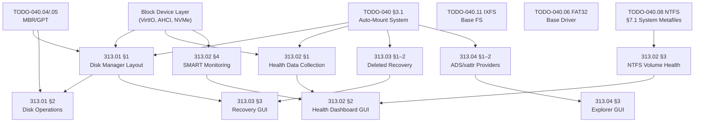

# Phase 06b (Core Apps) — Filesystem Tools & Disk Management

> **Goal:** Provide a complete suite of graphical and CLI disk management, health
> monitoring, and diagnostic tools. Impossible OS ships with an integrated disk
> tool suite that surpasses both Windows Disk Management and the fragmented Linux
> CLI landscape. Every tool has both a CLI command and a polished GUI app.

> [!IMPORTANT]
> **Dependencies:** Most tools depend on the VFS auto-mount system (TODO-040 §3.1)
> and at least one writable filesystem driver (NTFS §12 or IXFS). Read-only tools
> (e.g., health dashboard, benchmark) can work with any mounted volume.
>
> | File                             | Scope                                                 |
> | -------------------------------- | ----------------------------------------------------- |
> | `TODO-313-Filesystem-Tools.md`   | Master file — sections, priorities, OS comparison     |
> | `TODO-313.01-Disk-Manager.md`    | Disk Manager GUI app — partition layout, operations   |
> | `TODO-313.02-Disk-Health-Dashboard.md` | Volume health dashboard — per-FS health metrics |
> | `TODO-313.03-Deleted-Recovery.md` | Deleted file recovery — cross-FS scanners + GUI       |
> | `TODO-313.04-ADS-Explorer.md`    | ADS & xattr explorer — hidden metadata GUI + scanner |
> | `TODO-313.50-CMD-Diskpart.md`    | diskpart.exe — CLI partition/format tool (Win11 clone) |

---

## TODO Completion Roadmap (Cross-File)

### Dependency Graph

### Phase-by-Phase Implementation Order

| P    | TODO File                    | Sections                   | What It Delivers                                  | Depends On                  | Status |
| :--: | ---------------------------- | -------------------------- | ------------------------------------------------- | --------------------------- | :----: |
| P0   | Prerequisites                | Block device, VFS, FS      | Mounted volumes + partition info                  | —                           |   ✅   |
| P1   | `313.01-Disk-Manager.md`     | §1 Layout                  | Graphical partition viewer (MMC snap-in clone)    | P0 (blkdev, VFS)            |   ⬜   |
| P1   | `313.02-Disk-Health.md`      | §1.1–1.6 Health Providers   | Per-FS health queries (all 6 writable FS)         | P0 (VFS, blkdev)            |   ⬜   |
| P2   | `313.01-Disk-Manager.md`     | §2–3 Disk/Volume Operations | Initialize, create/extend/shrink/delete/format    | P1 (§1) + MBR/GPT write     |   ⬜   |
| P2   | `313.02-Disk-Health.md`      | §2 Dashboard GUI           | Visual health panel in Disk Manager               | P1 (§1)                     |   ⬜   |
| P2   | `313.02-Disk-Health.md`      | §3 NTFS Deep Health        | NTFS-specific health (dirty, MFT, mirror, bitmap) | P1 (§1) + NTFS §7.1         |   ⬜   |
| P3   | `313.01-Disk-Manager.md`     | §4–6 Disk Ops + UI Polish  | MBR↔GPT, online/offline, properties, context menu | P2                          |   ⬜   |
| P3   | `313.02-Disk-Health.md`      | §4 SMART Monitoring        | AHCI/NVMe SMART data + GUI                        | P1 (§1) + AHCI driver       |   ⬜   |
| P3   | `313.02-Disk-Health.md`      | §5 Historical Trends       | Track health metrics over time in Registry        | P2 (§2)                     |   ⬜   |
| P3   | `313.01-Disk-Manager.md`     | §7 Hot-Plug Events         | 🚀 Real-time disk detection + refresh              | P1                          |   ⬜   |
| P2   | `313.03-Deleted-Recovery.md` | §1–2 Recovery Scanners     | Per-FS deleted file scanners (6 FS types)         | P0 (VFS, FS drivers)        |   ⬜   |
| P3   | `313.03-Deleted-Recovery.md` | §3 Recovery GUI            | 🚀 Built-in visual recovery panel                  | P2 (scanners)               |   ⬜   |
| P3   | `313.03-Deleted-Recovery.md` | §4 Secure Erase            | 🚀 Wipe free space + secure delete                  | P2 (scanners)               |   ⬜   |
| P2   | `313.04-ADS-Explorer.md`     | §1–2 Stream/xattr Providers  | Per-FS ADS/xattr enumeration (4 FS types)         | P0 (VFS, FS drivers)        |   ⬜   |
| P3   | `313.04-ADS-Explorer.md`     | §3 Explorer GUI             | 🚀 "Streams & Attributes" tab + security scanner    | P2 (providers)              |   ⬜   |

> [!NOTE]
> **Phase 0** is complete — block device drivers, partition parsers, and VFS are all working.
>
> **Phase 1** delivers the core Disk Manager window and health data API for **all 6 writable filesystems**.
>
> **Phase 2** enables all volume operations (Windows 11 parity) and the visual health dashboard.
>
> **Phase 3** adds disk-level operations, SMART monitoring, and historical trend tracking — exclusive features.

---

## Priority Order

> **Scope:** This table tracks master-level priorities for filesystem tools.
> Each sub-file has its own internal priority table.

| Priority | Section / Sub-File                    | Reason                                                          |
| -------- | ------------------------------------- | --------------------------------------------------------------- |
| 🟡 P2     | `313.01` §1 Disk Manager Layout      | Visual partition management (MMC snap-in clone)                 |
| 🟡 P2     | `313.01` §2–3 Volume Operations      | Create/extend/shrink/delete/format (Windows 11 parity)          |
| 🟡 P2     | `313.02` §1.1–1.6 Health Providers   | Cross-FS health: FAT32, IXFS, ext4, exFAT, Btrfs, NTFS basic   |
| 🟡 P2     | `313.02` §2 Dashboard GUI            | Visual health panel                                             |
| 🟢 P3     | `313.01` §4–6 Disk Ops + UI Polish  | MBR↔GPT, online/offline, properties, context menus              |
| 🟢 P3     | `313.02` §3 NTFS Deep Health         | NTFS-specific deep health metrics 🚀                             |
| 🟢 P3     | `313.02` §4 SMART Monitoring         | 🚀 **Exclusive** — integrated SMART in Disk Manager             |
| 🟢 P3     | `313.02` §5 Historical Trends        | 🚀 **Exclusive** — health trend tracking over time              |
| 🟢 P3     | `313.01` §7 Hot-Plug Events          | 🚀 **Exclusive** — real-time disk detection + refresh            |
| 🟡 P2     | `313.03` §1–2 Recovery Scanners      | Cross-FS deleted file scanners (6 FS types)                     |
| 🟢 P3     | `313.03` §3 Recovery GUI             | 🚀 **Exclusive** — built-in visual recovery panel                |
| 🟢 P3     | `313.03` §4 Secure Erase             | 🚀 **Exclusive** — wipe free space + secure delete               |
| 🟡 P2     | `313.04` §1–2 Stream/xattr Providers  | Cross-FS ADS/xattr enumeration (NTFS, ext4, Btrfs, IXFS)       |
| 🟢 P3     | `313.04` §3 Explorer GUI             | 🚀 **Exclusive** — "Streams & Attributes" tab + security scanner |
| 🟢 P3     | `313.04` §3.2 Security Scanner       | 🚀 **Exclusive** — hidden stream malware detection                |

---

## OS Comparison

| ⭐ | Feature                            | 🪟 Windows 11                      | 🐧 Linux                           | 🚀 Impossible OS                                 |
| -- | ---------------------------------- | ---------------------------------- | ----------------------------------- | ------------------------------------------------ |
| 💎 | Graphical partition viewer         | ✅ Disk Management (diskmgmt.msc)  | ⚠️ GParted (separate install)       | ⬜ §1 P2 — diskmgmt.msc clone                    |
| 💎 | All volume operations              | ✅ Disk Management + diskpart      | ✅ GParted / parted / fdisk          | ⬜ §2–3 P2 — full Windows 11 parity              |
| 💎 | Drive letter assignment            | ✅ Disk Management                 | ❌ Mount points (no drive letters)   | ⬜ §3.6 P2 — Windows-style drive letters          |
| ⭐ | **Cross-FS health monitoring**     | ❌ Different tool per FS           | ❌ Different CLI per FS             | ⬜ **§1 P2 — one API, 6 FS types** 🚀            |
| ⭐ | **Volume health dashboard**        | ❌ Spread across multiple tools    | ❌ CLI `smartctl` / `ntfsinfo` only  | ⬜ **§2 P2 — one-panel FS+disk health** 🚀       |
| ⭐ | **NTFS health aggregation**        | ❌ Properties → Tools → chkdsk     | ❌ `ntfsinfo` CLI only              | ⬜ **§3 P3 — dirty/MFT/mirror/bitmap** 🚀        |
| ⭐ | **SMART integration in Disk Mgr**  | ❌ Requires CrystalDiskInfo        | ❌ `smartmontools` CLI only          | ⬜ **§4 P3 — built-in SMART panel** 🚀           |
| ⭐ | **Health trend history**           | ❌ Not available                   | ❌ Not available natively            | ⬜ **§5 P3 — Registry-backed trend log** 🚀      |
| ⭐ | **Real-time hot-plug updates**     | ❌ Manual Action → Rescan Disks    | ❌ GParted requires restart          | ⬜ **§7 P3 — live update** 🚀                    |
| ⭐ | **Deleted file recovery (GUI)**    | ❌ Recuva / R-Studio (3rd party)   | ❌ CLI-only (`extundelete`, etc.)    | ⬜ **313.03 P2–P3 — cross-FS GUI recovery** 🚀   |
| ⭐ | **Secure erase free space**        | ⚠️ `cipher /w:` (obscure CLI)      | ⚠️ `sfill` (separate package)        | ⬜ **313.03 §4 P3 — one-click wipe** 🚀          |
| ⭐ | **ADS/xattr GUI explorer**         | ❌ CLI only (`dir /r`)              | ❌ `getfattr` CLI only                | ⬜ **313.04 P2–P3 — cross-FS stream GUI** 🚀   |
| ⭐ | **Hidden stream security scan**    | ❌ Requires Sysinternals            | ❌ No built-in scanner                | ⬜ **313.04 §3.2 P3 — malware detection** 🚀    |
| 💎 | Disk properties                    | ✅ Device Manager                  | ✅ lsblk / blkid                    | ⬜ §5 P3 — integrated in Disk Manager            |

> **After P2 items:** Impossible OS has a Disk Manager cloning Windows 11 diskmgmt.msc with cross-FS health monitoring, deleted file recovery, and ADS/xattr enumeration for all supported filesystems.
> **After P3 exclusive features:** Exceeds both — SMART panel, NTFS deep health, recovery GUI, stream explorer, security scanner, trend tracking, secure erase, and real-time hot-plug built into one app.
