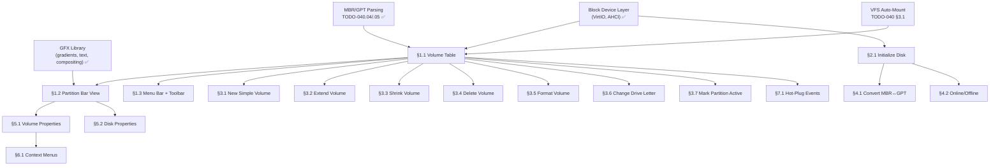

# 313.01-Disk-Manager — Windows 11 Disk Management Clone

> **Goal:** Build a pixel-perfect clone of Windows 11 **Disk Management** (`diskmgmt.msc`).
> The application (`diskmgr.exe`) uses the same two-panel MMC snap-in layout: an upper
> **Volume List** table and a lower **Graphical Partition View** with horizontal disk bars.
> Every operation available in Windows 11's diskmgmt.msc is implemented: initialize disk,
> create/extend/shrink/delete volumes, format, change drive letter/paths, mark partition
> as active, convert MBR↔GPT, disk online/offline, and properties dialog. Context menus
> are context-sensitive per element type (disk header, allocated volume, unallocated space).
> Beyond parity, Impossible OS adds exclusive features: real-time hot-plug updates,
> integrated health dashboard, and disk benchmark.

> [!CAUTION]
> **Memory Rule:** Use `pmm_alloc_contiguous()` for ALL buffers > 4 KB (framebuffer regions,
> bitmap caches). `kmalloc` is ONLY for small kernel structs (≤ 4 KB).

> [!IMPORTANT]
> **Dependencies:**
> - Block device layer (TODO-040.01/.02 — ✅ complete)
> - Partition tables (TODO-040.04/.05 — ✅ complete)
> - VFS auto-mount (TODO-040 §3.1 — pending)
> - At least one writable FS (NTFS §12 or IXFS — ✅ IXFS complete)
>
> → XREF: `TODO-313-Filesystem-Tools.md` (master)
> → XREF: `TODO-313.02-Disk-Health-Dashboard.md` (health panel integration)

---

## TODO Completion Roadmap

### Dependency Graph

### Phase-by-Phase Implementation Order

| ⭐ | P    | Sections                     | What It Delivers                           | Depends On             | Status |
| -- | :--: | ---------------------------- | ------------------------------------------ | ---------------------- | :----: |
| 💎 | P0   | Prerequisites                | Block device, partitions, VFS, GFX         | —                      |   ✅   |
| 💎 | P1   | §1.1 Volume Table            | Upper panel — mounted volume list          | P0                     |   ⬜   |
| 💎 | P1   | §1.2 Partition Bar View      | Lower panel — graphical partition layout   | P0 + §1.1              |   ⬜   |
| 💎 | P1   | §1.3 Menu Bar + Toolbar      | Action/View menus, toolbar buttons         | §1.1                   |   ⬜   |
| 💎 | P2   | §2.1 Initialize Disk         | Initialize new/raw disks as MBR or GPT     | P1                     |   ⬜   |
| 💎 | P2   | §3.1 New Simple Volume       | Create partition + format wizard            | P1 + GPT/MBR write     |   ⬜   |
| 💎 | P2   | §3.2 Extend Volume           | Grow into adjacent unallocated space       | P1                     |   ⬜   |
| 💎 | P2   | §3.3 Shrink Volume           | Reduce volume, create unallocated space    | P1                     |   ⬜   |
| 💎 | P2   | §3.4 Delete Volume           | Delete partition with confirmation         | P1                     |   ⬜   |
| 💎 | P2   | §3.5 Format Volume           | Format as NTFS/FAT32/IXFS/exFAT           | P1 + FS formatters     |   ⬜   |
| 💎 | P2   | §3.6 Change Drive Letter     | Add/change/remove drive letter             | P1                     |   ⬜   |
| 💎 | P2   | §3.7 Mark Partition Active   | Set bootable partition flag                | P1                     |   ⬜   |
| 💎 | P3   | §4.1 Convert MBR↔GPT         | Convert disk partition style               | P2 (§2.1)              |   ⬜   |
| 💎 | P3   | §4.2 Online/Offline Disk     | Take disk online or offline                | P2 (§2.1)              |   ⬜   |
| 💎 | P3   | §5.1 Volume Properties       | Properties dialog with tabs                | P1                     |   ⬜   |
| 💎 | P3   | §5.2 Disk Properties         | Physical disk properties dialog            | P1                     |   ⬜   |
| 💎 | P3   | §6.1 Context Menus           | Full context-sensitive right-click menus   | P2                     |   ⬜   |
| ⭐ | P3   | §7.1 Hot-Plug Events         | 🚀 Real-time disk detection + refresh      | P1                     |   ⬜   |

> [!NOTE]
> **Phase 1** creates the visual foundation: volume table, partition bars, and menu bar — the MMC snap-in shell.
>
> **Phase 2** adds all volume operations matching Windows 11: create, extend, shrink, delete, format, drive letter, mark active.
>
> **Phase 3** adds disk-level operations, properties dialogs, full context menus, and exclusive hot-plug support.

> [!TIP]
> The health dashboard (TODO-313.02) integrates as a tab in the Volume Properties dialog (§5.1).

---

## 1. Disk Manager Layout (MMC Snap-In Clone)

### 1.1 Volume Table (Upper Panel)

**Prompt:** Create `src/apps/diskmgr/diskmgr.c` with the classic Windows diskmgmt.msc two-panel layout. The upper panel is a sortable **Volume List** table matching the exact Windows 11 columns: Volume, Layout, Type, File System, Status, Capacity, Free Space, % Free. "Volume" shows the drive letter and label (e.g., `C: (OS)`). "Layout" shows `Simple` for basic disks. "Type" shows `Basic`. "Status" shows `Healthy (Boot, Page File, System)` or `Healthy` or `Healthy (Active)`. "Capacity" and "Free Space" are human-readable. Data comes from `vfs_stat()` + `blkdev_list()` + partition table metadata. Selecting a row highlights the corresponding partition bar segment in the lower panel. After completing all items, mark every item as `[x]`, update this prompt to a verification prompt, run `bash scripts/build.sh clean`, and commit as `"apps: Disk Manager volume table"`. Add notes directly in this TODO section. After implementation, save any gotchas, solutions, and important information to MCP memory (`mcp_memory_create_entities` / `mcp_memory_add_observations`).

- [ ] Create `src/apps/diskmgr/diskmgr.c` — Disk Manager app skeleton
- [ ] Create `include/apps/diskmgr.h` — public API / types
- [ ] Create app window with title "Disk Management" (1024×700 default, resizable)
- [ ] Horizontal splitter dividing upper and lower panels (drag to resize)
- [ ] Upper panel: table with columns matching Windows 11:
  - [ ] Volume (drive letter + label, e.g., `C: (OS)`)
  - [ ] Layout (`Simple` for basic partitions)
  - [ ] Type (`Basic`)
  - [ ] File System (NTFS, FAT32, IXFS, exFAT, ext4, RAW)
  - [ ] Status (`Healthy`, `Healthy (Boot)`, `Healthy (System, Active)`, `At Risk`)
  - [ ] Capacity (human-readable: KB/MB/GB/TB)
  - [ ] Free Space (human-readable)
  - [ ] % Free
- [ ] Populate from VFS mount list + `vfs_stat()` + partition metadata
- [ ] Sortable columns (click header to sort ascending/descending)
- [ ] Row selection highlights corresponding partition bar segment below
- [ ] System partitions shown but cannot be modified (EFI, Recovery)
- [ ] Commit: `"apps: Disk Manager volume table"`

### 1.2 Partition Bar View (Lower Panel)

**Prompt:** The lower panel shows the **Graphical View** matching Windows 11's diskmgmt.msc exactly. Each physical disk is shown as a row with a left-side disk info label (`Disk 0`, `Basic`, `size GB`, `Online`) and a horizontal bar divided into colored segments proportional to partition sizes. Partition segments are color-coded: dark blue = NTFS system, blue = NTFS data, green = FAT32, cyan = IXFS, purple = ext4, black diagonal hatch = unallocated. Each segment shows: volume label, drive letter, size, and "Healthy" or status text. EFI System Partition and Recovery partitions are labeled appropriately. Segments are selectable — clicking one selects it in both panels and shows a raised/sunken border. Resize separator at right of each partition shows exact pixel-proportional sizing. After completing all items, mark every item as `[x]`, update this prompt to a verification prompt, run `bash scripts/build.sh clean`, and commit as `"apps: Disk Manager partition bars"`. Add notes directly in this TODO section. After implementation, save any gotchas, solutions, and important information to MCP memory (`mcp_memory_create_entities` / `mcp_memory_add_observations`).

- [ ] Lower panel: scrollable list of disk rows
- [ ] Per-disk row: left-side label block + partition bar
- [ ] Left-side disk label:
  - [ ] "Disk N" (disk index)
  - [ ] "Basic" or "Dynamic" (disk type)
  - [ ] Total capacity (e.g., "476.94 GB")
  - [ ] "Online" or "Offline" status
- [ ] Partition bar: horizontal segments proportional to partition size
- [ ] Color-coded segments:
  - [ ] NTFS system = dark blue (#003399), NTFS data = blue (#3498DB)
  - [ ] FAT32 = green (#2ECC71), IXFS = cyan (#00BCD4)
  - [ ] exFAT = orange (#E67E22), ext4 = purple (#9B59B6)
  - [ ] EFI System Partition = olive (#808000)
  - [ ] Recovery = dark green (#006400)
  - [ ] Unallocated = black diagonal hatch pattern on dark gray
- [ ] Segment overlay text: label, drive letter, size, status
- [ ] Segment selection: click to select → raised border + highlight
- [ ] Selection synced with upper table (both panels track same selection)
- [ ] CD/DVD drives shown as separate row with disc icon
- [ ] Commit: `"apps: Disk Manager partition bars"`

### 1.3 Menu Bar & Toolbar

**Prompt:** Add a menu bar matching Windows 11 diskmgmt.msc: **File** (Exit), **Action** (All Tasks submenu mirrors context menu for selected item, Rescan Disks, Refresh), **View** (Top — Disk List / Volume List / Graphical View, Bottom — Disk List / Volume List / Graphical View, Settings). The Action menu dynamically shows the same items as the right-click context menu for whatever element is currently selected. "Rescan Disks" re-enumerates all block devices. After completing all items, mark every item as `[x]`, update this prompt to a verification prompt, run `bash scripts/build.sh clean`, and commit as `"apps: Disk Manager menu bar"`. Add notes directly in this TODO section. After implementation, save any gotchas, solutions, and important information to MCP memory (`mcp_memory_create_entities` / `mcp_memory_add_observations`).

- [ ] Menu bar: File, Action, View (no Help for now)
- [ ] **File** → Exit
- [ ] **Action** → All Tasks (submenu = context menu for selected element)
- [ ] **Action** → Rescan Disks (re-enumerate block devices)
- [ ] **Action** → Refresh (redraw current view)
- [ ] **View** → Top panel toggle: Disk List | Volume List | Graphical View
- [ ] **View** → Bottom panel toggle: Disk List | Volume List | Graphical View
- [ ] Status bar at bottom: shows selected element details
- [ ] Commit: `"apps: Disk Manager menu bar"`

---

## 2. Disk Initialization

### 2.1 Initialize Disk

**Prompt:** When a new/raw disk is detected (no valid partition table), show it in the lower panel as "Not Initialized" with the entire bar as unallocated. Right-clicking the disk label shows "Initialize Disk...". The dialog asks the user to choose partition style: MBR or GPT (GPT is default for disks > 2 TB). Initialization writes an empty partition table to the disk. This matches the exact Windows 11 behavior where new disks cannot be used until initialized. After completing all items, mark every item as `[x]`, update this prompt to a verification prompt, run `bash scripts/build.sh clean`, and commit as `"apps: Disk Manager initialize disk"`. Add notes directly in this TODO section. After implementation, save any gotchas, solutions, and important information to MCP memory (`mcp_memory_create_entities` / `mcp_memory_add_observations`).

- [ ] Detect raw/uninitialized disks (no MBR signature, no GPT header)
- [ ] Show as "Disk N — Not Initialized" in lower panel, full bar = unallocated
- [ ] On open: auto-show "Initialize Disk" dialog if any uninitialized disks
- [ ] Initialize Disk dialog:
  - [ ] Disk selection checkboxes (for multiple new disks)
  - [ ] Partition style radio: MBR / GPT (GPT default for > 2 TB)
- [ ] Write empty partition table (GPT protective MBR + GPT header, or MBR)
- [ ] Refresh view after initialization
- [ ] Commit: `"apps: Disk Manager initialize disk"`

---

## 3. Volume Operations (Windows 11 Parity)

### 3.1 New Simple Volume (Wizard)

**Prompt:** Right-clicking unallocated space shows "New Simple Volume...". This launches a multi-step wizard matching Windows 11: **Step 1** — Welcome page. **Step 2** — Specify volume size (MB, min 1 MB, max = unallocated size). **Step 3** — Assign drive letter (dropdown A–Z, excluding assigned) or mount in empty NTFS folder, or do not assign. **Step 4** — Format: filesystem (NTFS default, FAT32, IXFS, exFAT), allocation unit size (auto-detect from volume size), volume label, quick format checkbox (default on). **Step 5** — Summary + Finish. The wizard writes a GPT/MBR entry, assigns the drive letter, and formats. After completing all items, mark every item as `[x]`, update this prompt to a verification prompt, run `bash scripts/build.sh clean`, and commit as `"apps: Disk Manager new volume wizard"`. Add notes directly in this TODO section. After implementation, save any gotchas, solutions, and important information to MCP memory (`mcp_memory_create_entities` / `mcp_memory_add_observations`).

- [ ] "New Simple Volume..." context menu on unallocated space
- [ ] Multi-step wizard dialog:
  - [ ] Step 1: Welcome page with description
  - [ ] Step 2: Volume size spinner (MB, range 1 – max unallocated)
  - [ ] Step 3: Drive letter assignment:
    - [ ] Assign letter (A–Z dropdown, excluding assigned)
    - [ ] Mount in empty folder (path picker)
    - [ ] Do not assign letter or path
  - [ ] Step 4: Format options:
    - [ ] File system dropdown: NTFS (default), FAT32, IXFS, exFAT, ext4, Btrfs
    - [ ] Allocation unit size dropdown (auto-calculated per FS, or manual)
    - [ ] Volume label text field (default "New Volume")
    - [ ] Quick format checkbox (default: checked)
  - [ ] Step 5: Summary page showing all selections + Finish button
- [ ] Back/Next/Cancel buttons on each step
- [ ] Write GPT/MBR partition entry
- [ ] Assign drive letter in VFS + Registry
- [ ] Format with selected filesystem
- [ ] Progress bar during format
- [ ] Refresh both panels after completion
- [ ] Commit: `"apps: Disk Manager new volume wizard"`

### 3.2 Extend Volume

**Prompt:** Right-clicking a volume shows "Extend Volume..." (enabled only if adjacent unallocated space exists to the right). The dialog shows the current volume size and the maximum available extension size. A spinner lets the user choose how much space to add (MB). Extending grows the partition by moving the end boundary in the GPT/MBR entry, then calls the generic VFS resize API `vfs_resize_volume()` which dispatches to the per-filesystem resize handler (e.g., NTFS updates `$Bitmap` + boot sector, FAT32 extends FAT tables, ext4 grows block groups, IXFS extends superblock, Btrfs grows chunk tree, exFAT extends allocation bitmap). All filesystems that register a `resize` callback in `struct vfs_ops` support extend. After completing all items, mark every item as `[x]`, update this prompt to a verification prompt, run `bash scripts/build.sh clean`, and commit as `"apps: Disk Manager extend volume"`. Add notes directly in this TODO section. After implementation, save any gotchas, solutions, and important information to MCP memory (`mcp_memory_create_entities` / `mcp_memory_add_observations`).

- [ ] "Extend Volume..." context menu (grayed if no adjacent unallocated)
- [ ] Extend Volume dialog:
  - [ ] Current size display
  - [ ] Available space to extend (MB)
  - [ ] Size spinner (1 MB – max available)
- [ ] Update GPT/MBR partition end LBA
- [ ] Call `vfs_resize_volume(mount, new_size)` → dispatches to per-FS resize:
  - [ ] NTFS: update `$Bitmap`, boot sector cluster count
  - [ ] FAT32: extend FAT tables + FSInfo
  - [ ] ext4: add block groups + update superblock
  - [ ] IXFS: extend superblock + free block bitmap
  - [ ] exFAT: extend allocation bitmap + Up-case table
  - [ ] Btrfs: grow chunk tree + device extent
- [ ] Gray out for filesystems without resize support
- [ ] Refresh view after extend
- [ ] Commit: `"apps: Disk Manager extend volume"`

### 3.3 Shrink Volume

**Prompt:** Right-clicking a volume shows "Shrink Volume...". The dialog queries the filesystem via `vfs_query_shrink_space()` for available shrink space (total size minus used clusters rounded to allocation unit boundary). Shows: Total size before shrink, Size of available shrink space, Amount to shrink (spinner, max = available), Total size after shrink. Clicking "Shrink" calls the per-FS shrink handler to relocate data clusters away from the end of the partition, then updates the GPT/MBR end LBA. The freed space becomes unallocated to the right. Each filesystem determines the minimum size based on its own metadata layout (e.g., NTFS unmovable MFT Zone, ext4 fixed inode tables, Btrfs metadata chunks). After completing all items, mark every item as `[x]`, update this prompt to a verification prompt, run `bash scripts/build.sh clean`, and commit as `"apps: Disk Manager shrink volume"`. Add notes directly in this TODO section. After implementation, save any gotchas, solutions, and important information to MCP memory (`mcp_memory_create_entities` / `mcp_memory_add_observations`).

- [ ] "Shrink Volume..." context menu on allocated partitions
- [ ] Query FS via `vfs_query_shrink_space()` for available shrink space
- [ ] Per-FS shrink limits:
  - [ ] NTFS: unmovable MFT Zone + system metafiles limit shrink
  - [ ] FAT32: unmovable root dir cluster + FAT tables
  - [ ] ext4: fixed inode table positions limit shrink
  - [ ] IXFS: journal + superblock backup positions
  - [ ] exFAT: allocation bitmap + Up-case table
  - [ ] Btrfs: metadata chunks cannot be relocated past shrink boundary
- [ ] Shrink Volume dialog:
  - [ ] Total size before shrink (MB)
  - [ ] Size of available shrink space (MB)
  - [ ] Enter amount of space to shrink (spinner, max = available)
  - [ ] Total size after shrink (computed)
- [ ] Call per-FS shrink: relocate clusters → update FS metadata
- [ ] Update GPT/MBR partition end LBA
- [ ] New unallocated space appears to the right
- [ ] Gray out for filesystems without shrink support
- [ ] Refresh view after shrink
- [ ] Commit: `"apps: Disk Manager shrink volume"`

### 3.4 Delete Volume

**Prompt:** Right-clicking a volume shows "Delete Volume...". A warning dialog states: "Deleting this volume will erase all data on it. Back up any data you want to keep before deleting. Do you want to continue?" with Yes/No buttons. If the partition is mounted, flush and unmount first. Delete the GPT/MBR entry. The space becomes unallocated. System/boot/EFI partitions cannot be deleted. Matches Windows 11 exactly. After completing all items, mark every item as `[x]`, update this prompt to a verification prompt, run `bash scripts/build.sh clean`, and commit as `"apps: Disk Manager delete volume"`. Add notes directly in this TODO section. After implementation, save any gotchas, solutions, and important information to MCP memory (`mcp_memory_create_entities` / `mcp_memory_add_observations`).

- [ ] "Delete Volume..." context menu on allocated partitions
- [ ] Warning dialog: "Deleting this volume will erase all data..." + Yes/No
- [ ] Prevent deletion of: system partition, boot partition, EFI partition
- [ ] If mounted: flush dirty buffers → unmount → remove drive letter from Registry
- [ ] Delete GPT/MBR partition entry
- [ ] Merge freed space with adjacent unallocated (if any)
- [ ] Refresh view
- [ ] Commit: `"apps: Disk Manager delete volume"`

### 3.5 Format Volume

**Prompt:** Right-clicking a volume shows "Format...". The Format dialog matches Windows 11: Volume label text field, File system dropdown (NTFS, FAT32, IXFS, exFAT), Allocation unit size dropdown (auto-detect default), Quick format checkbox (default: checked). A warning states: "Formatting will erase ALL data on this volume." Shows progress bar during format. After completing all items, mark every item as `[x]`, update this prompt to a verification prompt, run `bash scripts/build.sh clean`, and commit as `"apps: Disk Manager format volume"`. Add notes directly in this TODO section. After implementation, save any gotchas, solutions, and important information to MCP memory (`mcp_memory_create_entities` / `mcp_memory_add_observations`).

- [ ] "Format..." context menu on allocated partitions
- [ ] Format dialog:
  - [ ] Volume label text field
  - [ ] File system dropdown: NTFS (default), FAT32, IXFS, exFAT, ext4, Btrfs
  - [ ] Allocation unit size dropdown (auto-detect default)
  - [ ] Quick format checkbox (default: checked)
- [ ] Warning: "Formatting will erase ALL data on this volume."
- [ ] Quick format: write FS structures only
- [ ] Full format: zero all sectors → write FS structures
- [ ] Progress bar with percentage
- [ ] Prevent formatting system/boot partitions
- [ ] Refresh view after format
- [ ] Commit: `"apps: Disk Manager format volume"`

### 3.6 Change Drive Letter and Paths

**Prompt:** Right-clicking a volume shows "Change Drive Letter and Paths...". The dialog matches Windows 11: shows current drive letter and any mount paths. Three buttons: **Add** (assign a new drive letter or mount in folder), **Change** (change existing letter — dropdown of available letters A–Z), **Remove** (remove drive letter — warning: "some programs may not run"). Changes update the VFS mount table + Registry `HKLM\SYSTEM\Storage\Drive\`. After completing all items, mark every item as `[x]`, update this prompt to a verification prompt, run `bash scripts/build.sh clean`, and commit as `"apps: Disk Manager change drive letter"`. Add notes directly in this TODO section. After implementation, save any gotchas, solutions, and important information to MCP memory (`mcp_memory_create_entities` / `mcp_memory_add_observations`).

- [ ] "Change Drive Letter and Paths..." context menu
- [ ] Dialog showing current drive letter + mount paths
- [ ] **Add** button: assign letter (dropdown) or mount in folder (path picker)
- [ ] **Change** button: change letter (dropdown of available A–Z)
- [ ] **Remove** button: remove letter + warning "some programs may not run"
- [ ] Prevent removing C: (system drive)
- [ ] Update VFS mount point + Registry: `HKLM\SYSTEM\Storage\Drive\{letter}\Device`
- [ ] Refresh view
- [ ] Commit: `"apps: Disk Manager change drive letter"`

### 3.7 Mark Partition as Active

**Prompt:** Right-clicking an MBR partition shows "Mark Partition as Active". Confirmation dialog warns: "If you mark this partition as active and there is no valid operating system on it, your computer might not start." Sets the active flag (0x80) on the selected partition's MBR entry and clears it on all others (only one can be active). This is MBR-only — grayed out on GPT disks. After completing all items, mark every item as `[x]`, update this prompt to a verification prompt, run `bash scripts/build.sh clean`, and commit as `"apps: Disk Manager mark active"`. Add notes directly in this TODO section. After implementation, save any gotchas, solutions, and important information to MCP memory (`mcp_memory_create_entities` / `mcp_memory_add_observations`).

- [ ] "Mark Partition as Active" context menu (MBR disks only)
- [ ] Warning dialog about boot risk
- [ ] Set active flag (0x80) in MBR partition entry
- [ ] Clear active flag on all other partitions on same disk
- [ ] Grayed out on GPT disks (GPT uses EFI System Partition instead)
- [ ] Refresh view
- [ ] Commit: `"apps: Disk Manager mark active"`

---

## 4. Disk Operations

### 4.1 Convert MBR↔GPT

**Prompt:** Right-clicking a disk label shows "Convert to GPT Disk" (if currently MBR) or "Convert to MBR Disk" (if currently GPT). The dialog warns that conversion requires all volumes to be deleted first (matching Windows 11 behavior — non-destructive conversion is unsupported). If the disk has partitions, the menu item is grayed out. On confirm, write the new partition table style. After completing all items, mark every item as `[x]`, update this prompt to a verification prompt, run `bash scripts/build.sh clean`, and commit as `"apps: Disk Manager convert MBR GPT"`. Add notes directly in this TODO section. After implementation, save any gotchas, solutions, and important information to MCP memory (`mcp_memory_create_entities` / `mcp_memory_add_observations`).

- [ ] "Convert to GPT Disk" / "Convert to MBR Disk" on disk context menu
- [ ] Grayed out if disk has any partitions (must delete all first)
- [ ] Warning dialog explaining data loss if partitions exist
- [ ] MBR→GPT: write GPT header + protective MBR
- [ ] GPT→MBR: write MBR signature, remove GPT header
- [ ] Refresh view
- [ ] Commit: `"apps: Disk Manager convert MBR GPT"`

### 4.2 Online/Offline Disk

**Prompt:** Right-clicking a disk label shows "Offline" (if online) or "Online" (if offline). Taking a disk offline unmounts all volumes, flushes buffers, and prevents new I/O. Bringing online re-scans and auto-mounts. This matches Windows 11 disk management where disks can be offlined for safe removal or SAN use. After completing all items, mark every item as `[x]`, update this prompt to a verification prompt, run `bash scripts/build.sh clean`, and commit as `"apps: Disk Manager online offline"`. Add notes directly in this TODO section. After implementation, save any gotchas, solutions, and important information to MCP memory (`mcp_memory_create_entities` / `mcp_memory_add_observations`).

- [ ] "Offline" / "Online" context menu on disk label
- [ ] Offline: flush all volumes on disk → unmount → block further I/O
- [ ] Disk label changes to "Offline" with grayed-out partition bars
- [ ] Online: re-scan partitions → auto-mount volumes → restore drive letters
- [ ] Refresh view
- [ ] Commit: `"apps: Disk Manager online offline"`

---

## 5. Properties Dialogs

### 5.1 Volume Properties Dialog

**Prompt:** Right-clicking a volume shows "Properties". Opens a tabbed dialog matching Windows 11 drive properties: **General** tab — pie chart (used/free), drive letter, label (editable), type, filesystem, used/free/capacity. **Tools** tab — "Check" button (runs filesystem check), "Optimize" button (runs defrag). **Hardware** tab — lists physical disk device name and properties. **Health** tab — shows data from the health dashboard API (TODO-313.02). After completing all items, mark every item as `[x]`, update this prompt to a verification prompt, run `bash scripts/build.sh clean`, and commit as `"apps: Disk Manager volume properties"`. Add notes directly in this TODO section. After implementation, save any gotchas, solutions, and important information to MCP memory (`mcp_memory_create_entities` / `mcp_memory_add_observations`).

- [ ] "Properties" context menu on allocated partitions
- [ ] Tabbed dialog window:
  - [ ] **General** tab:
    - [ ] Volume label (editable text field)
    - [ ] Type: "Local Disk" / "Removable Disk"
    - [ ] File system: NTFS / FAT32 / IXFS / etc.
    - [ ] Used space (bytes + human-readable)
    - [ ] Free space (bytes + human-readable)
    - [ ] Capacity (bytes + human-readable)
    - [ ] Pie chart: used (blue) vs free (pink/gray)
  - [ ] **Tools** tab:
    - [ ] "Check" button → run filesystem consistency check
    - [ ] "Optimize" button → run defragmentation (if supported by FS)
  - [ ] **Hardware** tab:
    - [ ] Physical disk model, vendor, serial
    - [ ] Disk type (HDD/SSD/NVMe)
    - [ ] Connection type (SATA/NVMe/USB)
  - [ ] **Health** tab (🚀 Exclusive):
    - [ ] Pull from health dashboard API (TODO-313.02)
    - [ ] Health score bar + per-metric status
- [ ] OK / Cancel buttons
- [ ] Commit: `"apps: Disk Manager volume properties"`

### 5.2 Disk Properties Dialog

**Prompt:** Right-clicking a disk label shows "Properties". Opens a dialog with: disk model, firmware revision, serial number, partition style (MBR/GPT), capacity, cylinders/heads/sectors geometry, and a list of volumes on this disk. After completing all items, mark every item as `[x]`, update this prompt to a verification prompt, run `bash scripts/build.sh clean`, and commit as `"apps: Disk Manager disk properties"`. Add notes directly in this TODO section. After implementation, save any gotchas, solutions, and important information to MCP memory (`mcp_memory_create_entities` / `mcp_memory_add_observations`).

- [ ] "Properties" context menu on disk label
- [ ] Dialog fields:
  - [ ] Disk model name + vendor
  - [ ] Firmware revision
  - [ ] Serial number
  - [ ] Partition style: MBR or GPT
  - [ ] Total capacity
  - [ ] Unallocated space
  - [ ] Volumes tab listing all partitions on this disk
- [ ] OK / Cancel buttons
- [ ] Commit: `"apps: Disk Manager disk properties"`

---

## 6. Context Menus (Windows 11 Exact Match)

### 6.1 Context-Sensitive Menus

**Prompt:** Implement the full Windows 11 diskmgmt.msc context menu system. Menus change based on what the user right-clicks. All items gray out when inapplicable (e.g., "Extend Volume" grayed if no adjacent free space, "Mark Active" grayed on GPT disks, "Delete" grayed on system partition). After completing all items, mark every item as `[x]`, update this prompt to a verification prompt, run `bash scripts/build.sh clean`, and commit as `"apps: Disk Manager context menus"`. Add notes directly in this TODO section. After implementation, save any gotchas, solutions, and important information to MCP memory (`mcp_memory_create_entities` / `mcp_memory_add_observations`).

- [ ] **Disk label** right-click menu:
  - [ ] Initialize Disk... (uninitialized disks only)
  - [ ] Online / Offline
  - [ ] Convert to GPT Disk / Convert to MBR Disk
  - [ ] Properties
- [ ] **Allocated volume** right-click menu:
  - [ ] Open (open in File Manager)
  - [ ] Explore (browse contents)
  - [ ] Change Drive Letter and Paths...
  - [ ] Format...
  - [ ] Extend Volume...
  - [ ] Shrink Volume...
  - [ ] Delete Volume...
  - [ ] Mark Partition as Active (MBR only)
  - [ ] Properties
- [ ] **Unallocated space** right-click menu:
  - [ ] New Simple Volume...
  - [ ] Properties
- [ ] **EFI/Recovery partition** right-click menu:
  - [ ] Properties (read-only, no delete/format)
- [ ] Gray-out logic:
  - [ ] "Extend Volume" — no adjacent unallocated
  - [ ] "Shrink Volume" — no free clusters
  - [ ] "Delete Volume" — system/boot/EFI partition
  - [ ] "Format" — system/boot partition
  - [ ] "Mark Active" — GPT disk
  - [ ] "Convert to GPT/MBR" — disk has partitions
- [ ] Commit: `"apps: Disk Manager context menus"`

---

## 7. Exclusive Features (🚀 Impossible OS)

### 7.1 Hot-Plug Disk Events

**Prompt:** When a disk is hot-plugged (USB, NVMe), automatically refresh both panels and show a desktop toast notification: "New disk detected: [model] ([size])". When a volume auto-mounts, update the volume table without requiring Action → Rescan Disks. When a disk is removed without safe eject, show a warning toast: "Disk removed unsafely — data may be lost". Windows Disk Management requires manual Action → Rescan Disks. GParted requires a full restart. Impossible OS updates in real-time. After completing all items, mark every item as `[x]`, update this prompt to a verification prompt, run `bash scripts/build.sh clean`, and commit as `"apps: Disk Manager hot-plug events"`. Add notes directly in this TODO section. After implementation, save any gotchas, solutions, and important information to MCP memory (`mcp_memory_create_entities` / `mcp_memory_add_observations`).

> [!TIP]
> **Competitive Edge:** Windows Disk Management requires Action → Rescan Disks.
> Linux GParted requires restart. Impossible OS updates both panels in real-time.

- [ ] Register for block device hot-plug events (USB, NVMe insertion/removal)
- [ ] On new disk: auto-refresh + toast "New disk detected: [model] ([size])"
- [ ] On new disk (uninitialized): auto-show "Initialize Disk" dialog
- [ ] On volume auto-mount: refresh volume table + partition bars
- [ ] On unsafe removal: warning toast "Disk removed unsafely — data may be lost"
- [ ] On safe eject: clean unmount → remove from view → toast "Safe to remove [model]"
- [ ] Commit: `"apps: Disk Manager hot-plug events"`

---

## Priority Order

| ⭐ | Priority  | Section                          | Description                                              |
| -- | --------- | -------------------------------- | -------------------------------------------------------- |
| 💎 | 🟡 P2     | §1.1 Volume Table                | Upper panel — Windows 11 volume list columns             |
| 💎 | 🟡 P2     | §1.2 Partition Bar View          | Lower panel — graphical partition layout                 |
| 💎 | 🟡 P2     | §1.3 Menu Bar + Toolbar          | Action/View menus matching diskmgmt.msc                  |
| 💎 | 🟡 P2     | §2.1 Initialize Disk             | Initialize new/raw disks as MBR or GPT                   |
| 💎 | 🟡 P2     | §3.1 New Simple Volume           | Multi-step wizard for creating partitions                |
| 💎 | 🟡 P2     | §3.2 Extend Volume               | Grow volume into adjacent unallocated space              |
| 💎 | 🟡 P2     | §3.3 Shrink Volume               | Reduce volume size, create unallocated space             |
| 💎 | 🟡 P2     | §3.4 Delete Volume               | Delete partition with confirmation dialog                |
| 💎 | 🟡 P2     | §3.5 Format Volume               | Format with filesystem/label/allocation unit selection   |
| 💎 | 🟡 P2     | §3.6 Change Drive Letter         | Add/change/remove drive letter and mount paths           |
| 💎 | 🟡 P2     | §3.7 Mark Partition Active       | Set MBR bootable flag                                    |
| 💎 | 🟢 P3     | §4.1 Convert MBR↔GPT             | Convert disk partition style                             |
| 💎 | 🟢 P3     | §4.2 Online/Offline Disk         | Take disk online or offline                              |
| 💎 | 🟢 P3     | §5.1 Volume Properties           | Tabbed properties dialog (General, Tools, HW, Health)    |
| 💎 | 🟢 P3     | §5.2 Disk Properties             | Physical disk info dialog                                |
| 💎 | 🟢 P3     | §6.1 Context Menus               | Full context-sensitive right-click menus                 |
| ⭐ | 🟢 P3     | §7.1 Hot-Plug Events             | 🚀 **Exclusive** — real-time disk detection + refresh    |

---

## OS Comparison

| ⭐ | Feature                          | 🪟 Windows 11                      | 🐧 Linux                           | 🚀 Impossible OS                                 |
| -- | -------------------------------- | ---------------------------------- | ----------------------------------- | ------------------------------------------------ |
| 💎 | MMC snap-in two-panel layout     | ✅ Disk Management (diskmgmt.msc)  | ❌ No equivalent                     | ⬜ §1 P2 — exact clone                          |
| 💎 | Graphical partition bars         | ✅ Color-coded bars per disk       | ⚠️ GParted (separate install)       | ⬜ §1.2 P2 — same colors + layout               |
| 💎 | Volume list table                | ✅ Volume/Layout/Type/FS/Status    | ⚠️ GParted partitions list          | ⬜ §1.1 P2 — same columns                       |
| 💎 | Initialize disk                  | ✅ MBR/GPT selection dialog       | ⚠️ CLI: `gdisk` / `fdisk`           | ⬜ §2.1 P2 — same dialog                        |
| 💎 | New Simple Volume wizard         | ✅ Multi-step wizard              | ⚠️ GParted create dialog            | ⬜ §3.1 P2 — same wizard steps                  |
| 💎 | Extend volume                    | ✅ Extend Volume dialog           | ⚠️ GParted resize                   | ⬜ §3.2 P2 — same dialog                        |
| 💎 | Shrink volume                    | ✅ Shrink Volume dialog           | ⚠️ GParted resize                   | ⬜ §3.3 P2 — same dialog                        |
| 💎 | Delete / format volume           | ✅ Disk Management                | ✅ GParted / mkfs                    | ⬜ §3.4–3.5 P2                                  |
| 💎 | Change drive letter              | ✅ Add/Change/Remove dialog       | ❌ Mount points (no drive letters)   | ⬜ §3.6 P2 — same dialog                        |
| 💎 | Mark partition active            | ✅ MBR only                       | ⚠️ CLI: `fdisk -a`                  | ⬜ §3.7 P2                                      |
| 💎 | Convert MBR↔GPT                  | ✅ Context menu on disk           | ⚠️ CLI: `gdisk`                     | ⬜ §4.1 P3                                      |
| 💎 | Online/Offline disk              | ✅ Context menu on disk           | ❌ Not available in GUI              | ⬜ §4.2 P3                                      |
| 💎 | Volume properties (pie chart)    | ✅ Properties dialog tabs         | ⚠️ GParted info panel               | ⬜ §5.1 P3 — same tabs + Health tab             |
| 💎 | Disk properties                  | ✅ Properties dialog              | ⚠️ `lsblk` / `smartctl` CLI         | ⬜ §5.2 P3                                      |
| 💎 | Context-sensitive right-click    | ✅ Full context menus             | ✅ GParted context menus             | ⬜ §6.1 P3                                      |
| ⭐ | **Real-time hot-plug updates**   | ❌ Manual Action → Rescan Disks   | ❌ GParted requires restart          | ⬜ **§7.1 P3 — live update** 🚀                 |

> **After P2 items:** Impossible OS has a Disk Manager that is a 1:1 clone of Windows 11 diskmgmt.msc.
> **After P3 items:** Exceeds Windows — integrated health tab, real-time hot-plug, and all parity features.
