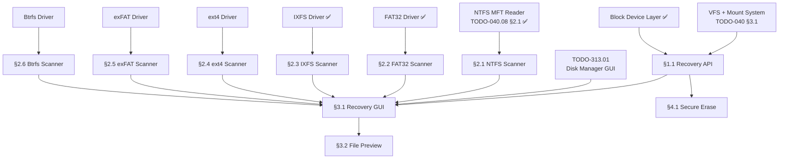

# 313.03-Deleted-Recovery — Cross-Filesystem Deleted File Recovery

> **Goal:** Build a built-in, GUI-based deleted file recovery tool that works across
> **all supported filesystems** (NTFS, FAT32, IXFS, ext4, exFAT, Btrfs). Each filesystem
> has different deletion semantics — NTFS clears an MFT in-use bit, FAT32 marks directory
> entries with 0xE5, ext4 clears inode links, Btrfs removes subvolume references — but
> all leave recoverable data on disk until clusters are reused. Impossible OS provides a
> unified recovery GUI with per-filesystem scanner backends and confidence scoring.
> Neither Windows nor Linux ships a built-in graphical deleted file recovery tool.

> [!IMPORTANT]
> **Origins:** The NTFS-specific recovery scanner (§2) was originally §11.2 in
> [`TODO-040.08-NTFS.md`](file:///home/derickpayne/impossible-os/todo/010-Kernel-Foundations/TODO-040-Filesystem/TODO-040.08-NTFS.md).
> It was moved here because deleted file recovery is a cross-filesystem, tool-level
> concern — not specific to the NTFS driver implementation.
>
> → XREF: `TODO-313-Filesystem-Tools.md` (master)
> → XREF: `TODO-313.01-Disk-Manager.md` (GUI host — "Recover Deleted Files" button)
> → XREF: `TODO-040.08-NTFS.md §12.3` (MFT allocator — preserves deleted records)

> [!WARNING]
> **Read-only operation.** Recovery copies data to a DIFFERENT volume — never write to the
> volume being scanned. This preserves forensic integrity and prevents overwriting
> recoverable data.

> [!CAUTION]
> **Memory Rule:** Use `pmm_alloc_contiguous()` for ALL buffers > 4 KB (MFT record
> buffers, FAT table scans, inode table scans). `kmalloc` is ONLY for small kernel
> structs (≤ 4 KB).

---

## TODO Completion Roadmap

### Dependency Graph

### Phase-by-Phase Implementation Order

| ⭐ | P    | Sections                     | What It Delivers                           | Depends On             | Status |
| -- | :--: | ---------------------------- | ------------------------------------------ | ---------------------- | :----: |
| 💎 | P0   | Prerequisites                | Block device, VFS, FS drivers              | —                      |   ✅   |
| 💎 | P1   | §1.1 Recovery API            | Generic `deleted_file_scan()` interface    | P0 (VFS)               |   ⬜   |
| ⭐ | P1   | §2.1 NTFS Scanner            | 🚀 MFT-based deleted file scanner          | P0 (NTFS §2.1)         |   ⬜   |
| 💎 | P1   | §2.2 FAT32 Scanner           | FAT32 0xE5 directory entry scanner         | P0 (FAT32)             |   ⬜   |
| 💎 | P1   | §2.3 IXFS Scanner            | IXFS inode table scanner                   | P0 (IXFS)              |   ⬜   |
| 💎 | P1   | §2.4 ext4 Scanner            | ext4 deleted inode scanner                 | P0 (ext4)              |   ⬜   |
| 💎 | P1   | §2.5 exFAT Scanner           | exFAT deleted directory entry scanner      | P0 (exFAT)             |   ⬜   |
| 💎 | P1   | §2.6 Btrfs Scanner           | Btrfs orphan item scanner                  | P0 (Btrfs)             |   ⬜   |
| ⭐ | P2   | §3.1 Recovery GUI            | 🚀 Visual recovery panel in Disk Manager    | P1 (§1.1 + scanners)   |   ⬜   |
| ⭐ | P2   | §3.2 File Preview            | 🚀 Preview recoverable files before restore | P2 (§3.1)              |   ⬜   |
| ⭐ | P3   | §4.1 Secure Erase            | 🚀 Permanently wipe deleted data            | P1 (§1.1)              |   ⬜   |

> [!NOTE]
> **Phase 1** creates the recovery API and per-filesystem scanner backends.
>
> **Phase 2** adds the visual recovery GUI with file preview — the core exclusive feature.
>
> **Phase 3** adds secure erase (the inverse operation) — permanently destroy deleted data.

> [!TIP]
> **Competitive Edge:** Windows requires third-party tools (Recuva, R-Studio, $50–$200).
> Linux has CLI-only tools (`ntfsundelete`, `extundelete`, `photorec`).
> Impossible OS has built-in, GUI-based recovery for ALL filesystems — free, integrated,
> and one-click.

---

## 1. Recovery Framework

### 1.1 Deleted File Scanner API

**Prompt:** Define a generic deleted file recovery interface that all filesystem drivers can implement. The API returns an array of `deleted_file_t` structs via a callback. Each entry contains: original filename, parent directory path, file size, deletion timestamp (if available), recovery confidence (HIGH/MEDIUM/LOW), and an opaque handle for actual recovery. Register per-filesystem scanners via `vfs_register_recovery_scanner()`. The Disk Manager calls `deleted_file_scan(drive_letter, callback)` to enumerate recoverable files. A separate `deleted_file_recover(handle, output_path)` copies the data to a different volume. After completing all items, mark every item as `[x]`, update this prompt to a verification prompt, run `bash scripts/build.sh clean`, and commit as `"fs: deleted file recovery API"`. Add notes directly in this TODO section. After implementation, save any gotchas, solutions, and important information to MCP memory (`mcp_memory_create_entities` / `mcp_memory_add_observations`).

- [ ] Define `deleted_file_t` struct in `include/kernel/fs/vfs.h`:
  - [ ] `filename`: original filename (if recoverable)
  - [ ] `parent_path`: parent directory path (if reconstructable)
  - [ ] `file_size`: original file size in bytes
  - [ ] `delete_time`: timestamp of deletion (0 if unknown)
  - [ ] `confidence`: `RECOVERY_HIGH`, `RECOVERY_MEDIUM`, `RECOVERY_LOW`
  - [ ] `fs_handle`: opaque per-FS handle for recovery operation
  - [ ] `fs_type`: which filesystem this came from
- [ ] Define `recovery_confidence_t` enum: HIGH (all clusters free), MEDIUM (partial), LOW (mostly overwritten)
- [ ] Add `int (*scan_deleted)(struct vfs_node *root, deleted_file_callback_t cb, void *ctx)` to `struct vfs_ops`
- [ ] Add `int (*recover_file)(struct vfs_node *root, void *fs_handle, const char *output_path)` to `struct vfs_ops`
- [ ] Implement `deleted_file_scan(char drive_letter, callback, ctx)` in VFS layer
- [ ] Implement `deleted_file_recover(char drive_letter, void *handle, const char *output_path)`
- [ ] Commit: `"fs: deleted file recovery API"`

---

## 2. Per-Filesystem Recovery Scanners

### 2.1 NTFS Deleted File Scanner (moved from TODO-040.08 §11.2)

**Prompt:** NTFS marks deleted files by clearing the in-use bit (bit 0 of flags at offset `0x16` in MFT record header) but does NOT overwrite the MFT record. The filename, timestamps, and data runs remain intact until the record is reused. Walk all MFT records (inode 0 to max), find records with in-use bit clear that still have valid `$FILE_NAME` and `$DATA` attributes. Validate data runs against `$Bitmap` — clusters still free = HIGH confidence, partially reallocated = MEDIUM, mostly reallocated = LOW. After completing all items, mark every item as `[x]`, update this prompt to a verification prompt, run `bash scripts/build.sh clean`, and commit as `"ntfs: deleted file recovery scanner"`. Add notes directly in this TODO section. After implementation, save any gotchas, solutions, and important information to MCP memory (`mcp_memory_create_entities` / `mcp_memory_add_observations`).

> [!TIP]
> **NTFS preserves more recovery metadata than any other FS.** The entire MFT record
> (filename, timestamps, data runs, security descriptor) survives deletion until
> the record slot is reallocated. This makes NTFS recovery the most reliable.

- [ ] Implement `ntfs_scan_deleted(vol, callback)`:
  - [ ] Walk all MFT records (inode 0 to max based on `$MFT` data size / frs_size)
  - [ ] For each record: check magic == `"FILE"`, in-use bit CLEAR (flags & 0x01 == 0)
  - [ ] Parse `$FILE_NAME` → extract filename, parent inode, timestamps
  - [ ] Parse `$DATA` → check if data runs are still valid
  - [ ] Cross-reference data runs against `$Bitmap`:
    - [ ] All clusters free → `RECOVERY_HIGH`
    - [ ] Some clusters reallocated → `RECOVERY_MEDIUM`
    - [ ] Most/all clusters reallocated → `RECOVERY_LOW`
  - [ ] Callback: `{ filename, size, delete_time, confidence }`
- [ ] Implement `ntfs_recover_file(vol, deleted_inode, output_path)`:
  - [ ] Read data clusters via data runs (same as §4.2 read path)
  - [ ] Write to output file on a different volume
- [ ] Register via `vfs_register_recovery_scanner()`
- [ ] Commit: `"ntfs: deleted file recovery scanner"`

### 2.2 FAT32 Deleted File Scanner

**Prompt:** FAT32 marks deleted files by replacing the first byte of the 8.3 directory entry with 0xE5. The remaining filename bytes, file size, starting cluster, and timestamps survive. Walk all directory entries (root dir + subdirectories) looking for 0xE5-prefixed entries with valid starting cluster and non-zero size. Validate the cluster chain: follow the FAT chain from the starting cluster — if entries are now 0x00000000 (free), the chain is broken but data may still exist in those clusters. Confidence: intact chain + free clusters = HIGH, broken chain = MEDIUM, clusters reallocated = LOW. After completing all items, mark every item as `[x]`, update this prompt to a verification prompt, run `bash scripts/build.sh clean`, and commit as `"fat32: deleted file recovery scanner"`. Add notes directly in this TODO section. After implementation, save any gotchas, solutions, and important information to MCP memory (`mcp_memory_create_entities` / `mcp_memory_add_observations`).

> [!NOTE]
> **FAT32 limitation:** The first character of the filename is lost (replaced by 0xE5).
> Long filename (LFN) entries preceding the 8.3 entry may still contain the full name
> if they haven't been overwritten.

- [ ] Implement `fat32_scan_deleted(vol, callback)`:
  - [ ] Walk root directory + all subdirectory clusters
  - [ ] For each entry: check first byte == 0xE5 (deleted marker)
  - [ ] Reconstruct filename: use preceding LFN entries if intact, else use 8.3 with `_` for first char
  - [ ] Read starting cluster + file size from directory entry
  - [ ] Validate FAT chain from starting cluster:
    - [ ] Free entries (0x00000000) along expected chain = HIGH
    - [ ] Broken chain (some entries reallocated) = MEDIUM
    - [ ] Starting cluster reallocated = LOW
  - [ ] Extract timestamps (creation, modification, access dates)
- [ ] Implement `fat32_recover_file(vol, dir_entry_offset, output_path)`:
  - [ ] Read clusters following expected chain (even if FAT entries are cleared)
  - [ ] For contiguous allocation: read `file_size` bytes from starting cluster
  - [ ] Write to output file on a different volume
- [ ] Register via `vfs_register_recovery_scanner()`
- [ ] Commit: `"fat32: deleted file recovery scanner"`

### 2.3 IXFS Deleted File Scanner

**Prompt:** IXFS (Impossible OS native filesystem) deletes files by clearing the inode's in-use bit in the inode bitmap and freeing clusters in the block bitmap. The inode table entry (filename reference, size, block pointers, timestamps) remains until the inode slot is reused. Walk the inode bitmap for cleared bits, read corresponding inode table entries, validate block pointers against the block bitmap. After completing all items, mark every item as `[x]`, update this prompt to a verification prompt, run `bash scripts/build.sh clean`, and commit as `"ixfs: deleted file recovery scanner"`. Add notes directly in this TODO section. After implementation, save any gotchas, solutions, and important information to MCP memory (`mcp_memory_create_entities` / `mcp_memory_add_observations`).

- [ ] Implement `ixfs_scan_deleted(vol, callback)`:
  - [ ] Walk inode bitmap for cleared bits (freed inodes)
  - [ ] For each freed inode: read inode table entry
  - [ ] Check if inode still has valid magic/signature
  - [ ] Extract filename from parent directory (if parent still exists)
  - [ ] Validate block pointers against block bitmap:
    - [ ] All blocks free → `RECOVERY_HIGH`
    - [ ] Some blocks reallocated → `RECOVERY_MEDIUM`
    - [ ] Most blocks reallocated → `RECOVERY_LOW`
- [ ] Implement `ixfs_recover_file(vol, inode_num, output_path)`:
  - [ ] Read data blocks via block pointers
  - [ ] Write to output file on a different volume
- [ ] Register via `vfs_register_recovery_scanner()`
- [ ] Commit: `"ixfs: deleted file recovery scanner"`

### 2.4 ext4 Deleted File Scanner

**Prompt:** ext4 deletes files by clearing the inode's allocation in the inode bitmap, zeroing the link count, and adding the inode to the orphan list (if open handles exist). Unlike ext2/ext3, ext4 zeros the block pointers in the inode upon deletion — making recovery harder. However, the journal (JBD2) may contain old copies of the inode with intact block pointers. Strategy: (1) scan inode bitmap for freed inodes with non-zero `i_dtime` (deletion timestamp), (2) scan journal for old inode copies with intact extent tree, (3) for inodes with zeroed block pointers, use extent tree reconstruction from journal replay. After completing all items, mark every item as `[x]`, update this prompt to a verification prompt, run `bash scripts/build.sh clean`, and commit as `"ext4: deleted file recovery scanner"`. Add notes directly in this TODO section. After implementation, save any gotchas, solutions, and important information to MCP memory (`mcp_memory_create_entities` / `mcp_memory_add_observations`).

> [!WARNING]
> **ext4 is harder to recover than NTFS/FAT32.** ext4 zeros block pointers on deletion.
> Recovery depends on journal contents — if the journal has wrapped, old block pointers
> are gone. Confidence levels reflect this inherent limitation.

- [ ] Implement `ext4_scan_deleted(vol, callback)`:
  - [ ] Walk inode bitmap for freed inodes
  - [ ] For each freed inode: read inode table entry
  - [ ] Check `i_dtime` (deletion time) — non-zero = was deleted
  - [ ] Check `i_blocks` — if zeroed, attempt journal recovery:
    - [ ] Scan JBD2 journal for old inode copies (descriptor blocks → data blocks)
    - [ ] Match by inode number → extract extent tree from journal copy
  - [ ] If block pointers found (from inode or journal):
    - [ ] Validate against block bitmap: free = HIGH, reallocated = MEDIUM/LOW
  - [ ] If no block pointers recoverable: `RECOVERY_LOW` (signature-based only)
- [ ] Implement `ext4_recover_file(vol, inode_num, output_path)`:
  - [ ] Read data blocks via extent tree (from inode or journal copy)
  - [ ] Write to output file on a different volume
- [ ] Register via `vfs_register_recovery_scanner()`
- [ ] Commit: `"ext4: deleted file recovery scanner"`

### 2.5 exFAT Deleted File Scanner

**Prompt:** exFAT deletes files by marking directory entries as "not in use" (EntryType bit 7 cleared). The filename, file size, starting cluster, and timestamps remain in the directory entry. Unlike FAT32, exFAT does NOT modify the first filename byte — the complete filename survives deletion. Walk all directories for entries with bit 7 clear in EntryType. Validate the cluster chain in the FAT or contiguous allocation flag. After completing all items, mark every item as `[x]`, update this prompt to a verification prompt, run `bash scripts/build.sh clean`, and commit as `"exfat: deleted file recovery scanner"`. Add notes directly in this TODO section. After implementation, save any gotchas, solutions, and important information to MCP memory (`mcp_memory_create_entities` / `mcp_memory_add_observations`).

> [!NOTE]
> **exFAT advantage:** Unlike FAT32, the full filename is preserved on deletion.
> The NoFatChain flag (contiguous allocation) means many files don't even need
> FAT chain validation — just read contiguous clusters from the starting cluster.

- [ ] Implement `exfat_scan_deleted(vol, callback)`:
  - [ ] Walk root directory + subdirectory clusters
  - [ ] For each entry set: check EntryType bit 7 == 0 (deleted)
  - [ ] Parse File Directory Entry + Stream Extension + File Name entries
  - [ ] Extract: full filename, file size, starting cluster, timestamps
  - [ ] Check NoFatChain flag:
    - [ ] If set: file was contiguous → validate contiguous clusters in allocation bitmap
    - [ ] If clear: follow FAT chain → validate chain entries
  - [ ] Confidence based on cluster availability in allocation bitmap
- [ ] Implement `exfat_recover_file(vol, dir_entry_offset, output_path)`:
  - [ ] Read clusters (contiguous or FAT-chained) based on original allocation
  - [ ] Write to output file on a different volume
- [ ] Register via `vfs_register_recovery_scanner()`
- [ ] Commit: `"exfat: deleted file recovery scanner"`

### 2.6 Btrfs Deleted File Scanner

**Prompt:** Btrfs deletion removes the inode item, dir items, and extent data references from the current subvolume tree. However, Btrfs is a COW (Copy-on-Write) filesystem — old tree nodes are not overwritten, they become orphaned when no snapshot references them. Recovery strategy: (1) scan orphan items in the tree root for recently deleted inodes, (2) search old tree roots (previous generations) if log tree or backup roots are accessible, (3) for each recovered inode, validate extent references against the extent tree. Btrfs snapshots are the best recovery mechanism — if a snapshot exists, deleted files are trivially recoverable. After completing all items, mark every item as `[x]`, update this prompt to a verification prompt, run `bash scripts/build.sh clean`, and commit as `"btrfs: deleted file recovery scanner"`. Add notes directly in this TODO section. After implementation, save any gotchas, solutions, and important information to MCP memory (`mcp_memory_create_entities` / `mcp_memory_add_observations`).

> [!NOTE]
> **Btrfs COW advantage:** Because Btrfs never overwrites data in place, old versions
> of data may persist longer than on other filesystems. Snapshots provide instant,
> guaranteed recovery.

- [ ] Implement `btrfs_scan_deleted(vol, callback)`:
  - [ ] Check for snapshots first — if present, diff current vs snapshot for deleted files
  - [ ] Scan orphan items in the root tree (key type BTRFS_ORPHAN_ITEM_KEY)
  - [ ] For orphaned inodes: read inode item + dir index from orphan tree
  - [ ] Search old tree roots (backup superblock roots) for previous generation inodes
  - [ ] Validate extent references:
    - [ ] Extents still referenced by COW tree → `RECOVERY_HIGH`
    - [ ] Extents orphaned but not overwritten → `RECOVERY_MEDIUM`
    - [ ] Extents overwritten by new COW allocations → `RECOVERY_LOW`
- [ ] Implement `btrfs_recover_file(vol, inode_key, output_path)`:
  - [ ] If snapshot available: copy from snapshot tree directly
  - [ ] Otherwise: read data from orphaned extents
  - [ ] Write to output file on a different volume
- [ ] Register via `vfs_register_recovery_scanner()`
- [ ] Commit: `"btrfs: deleted file recovery scanner"`

---

## 3. Recovery GUI (🚀 Exclusive)

### 3.1 Recovery Panel in Disk Manager

**Prompt:** Add a "Recover Deleted Files" button to the Disk Manager (TODO-313.01) that opens a recovery panel for the selected volume. The panel shows a sortable table of recoverable files: Filename, Size, Date Deleted, Confidence (🟢 High / 🟡 Medium / 🔴 Low), Filesystem Type. The user can select files and click "Recover" to copy them to a chosen destination volume. A progress bar shows recovery progress. Include "Select All High Confidence" quick-select button. After completing all items, mark every item as `[x]`, update this prompt to a verification prompt, run `bash scripts/build.sh clean`, and commit as `"apps: deleted file recovery panel"`. Add notes directly in this TODO section. After implementation, save any gotchas, solutions, and important information to MCP memory (`mcp_memory_create_entities` / `mcp_memory_add_observations`).

> [!TIP]
> **Competitive Edge:** Windows requires Recuva ($0–$25), R-Studio ($50), or other
> third-party tools. Linux has `photorec` (CLI, no filename recovery), `extundelete`
> (ext3/ext4 only, CLI), `ntfsundelete` (NTFS only, CLI). Impossible OS has one
> built-in GUI that recovers from ALL filesystems.

- [ ] "Recover Deleted Files" button in Disk Manager toolbar and context menu
- [ ] Recovery panel:
  - [ ] Table columns: ☑ (checkbox), Filename, Size, Date Deleted, Confidence, FS Type
  - [ ] Sortable by any column
  - [ ] Confidence icons: 🟢 High, 🟡 Medium, 🔴 Low
  - [ ] Color-coded rows by confidence
- [ ] "Select All High Confidence" button
- [ ] "Recover Selected" button → destination volume picker dialog
- [ ] Progress bar during recovery (per-file and total)
- [ ] Error handling: skip unrecoverable files, log failures
- [ ] Summary dialog: "Recovered X of Y files, Z failed"
- [ ] Commit: `"apps: deleted file recovery panel"`

### 3.2 File Preview

**Prompt:** Before recovering, allow the user to preview a selected file to verify it's the right one. For images (BMP, PNG, JPG): render a thumbnail. For text files: show first 4 KB of text content. For other files: show hex dump of first 256 bytes. Preview reads data directly from the source volume's deleted clusters without recovery. Show "Preview may be incomplete" warning if confidence is MEDIUM or LOW. After completing all items, mark every item as `[x]`, update this prompt to a verification prompt, run `bash scripts/build.sh clean`, and commit as `"apps: deleted file preview"`. Add notes directly in this TODO section. After implementation, save any gotchas, solutions, and important information to MCP memory (`mcp_memory_create_entities` / `mcp_memory_add_observations`).

- [ ] Preview panel in recovery GUI (side panel or popup)
- [ ] Image preview: decode BMP/PNG/JPG header → render thumbnail
- [ ] Text preview: show first 4 KB as text (detect encoding)
- [ ] Binary preview: hex dump of first 256 bytes
- [ ] "Preview may be incomplete" warning for MEDIUM/LOW confidence
- [ ] Preview button grayed out for LOW confidence files
- [ ] Commit: `"apps: deleted file preview"`

---

## 4. Secure Erase (🚀 Exclusive — Inverse Operation)

### 4.1 Secure Delete

**Prompt:** The inverse of recovery: permanently destroy deleted data so it cannot be recovered. Right-clicking a drive shows "Wipe Free Space" which overwrites all unallocated clusters with zeros (quick) or random data (secure, 3-pass). This is useful for privacy before selling/disposing a drive. Additionally, a "Secure Delete" option on files performs delete + immediate overwrite of freed clusters. After completing all items, mark every item as `[x]`, update this prompt to a verification prompt, run `bash scripts/build.sh clean`, and commit as `"apps: secure erase free space"`. Add notes directly in this TODO section. After implementation, save any gotchas, solutions, and important information to MCP memory (`mcp_memory_create_entities` / `mcp_memory_add_observations`).

> [!TIP]
> **Competitive Edge:** Windows requires `cipher /w:` (obscure CLI command) or Eraser
> (third-party). Linux requires `sfill` from `secure-delete` package. Impossible OS
> has it in the Disk Manager context menu — one click.

- [ ] "Wipe Free Space" context menu on formatted partitions:
  - [ ] Quick wipe: write zeros to all free clusters
  - [ ] Secure wipe: 3-pass overwrite (zeros, ones, random)
  - [ ] Progress bar with ETA
- [ ] "Secure Delete" file operation:
  - [ ] Delete file normally → overwrite freed clusters immediately
  - [ ] Works via VFS layer: `vfs_secure_delete(path)` → delete + wipe
- [ ] Integrate with Disk Manager context menu
- [ ] Commit: `"apps: secure erase free space"`

---

## Priority Order

| ⭐ | Priority  | Section                          | Description                                              |
| -- | --------- | -------------------------------- | -------------------------------------------------------- |
| 💎 | 🟡 P2     | §1.1 Recovery API                | Foundation — generic recovery interface                  |
| ⭐ | 🟡 P2     | §2.1 NTFS Scanner                | 🚀 MFT-based recovery (moved from NTFS §11.2)            |
| 💎 | 🟡 P2     | §2.2 FAT32 Scanner               | FAT32 0xE5 directory entry recovery                      |
| 💎 | 🟡 P2     | §2.3 IXFS Scanner                | IXFS inode bitmap recovery                               |
| 💎 | 🟡 P2     | §2.4 ext4 Scanner                | ext4 journal-based recovery                              |
| 💎 | 🟡 P2     | §2.5 exFAT Scanner               | exFAT deleted entry recovery                             |
| 💎 | 🟡 P2     | §2.6 Btrfs Scanner               | Btrfs COW orphan recovery                                |
| ⭐ | 🟢 P3     | §3.1 Recovery GUI                | 🚀 **Exclusive** — built-in visual recovery panel         |
| ⭐ | 🟢 P3     | §3.2 File Preview                | 🚀 **Exclusive** — preview before recovery                |
| ⭐ | 🟢 P3     | §4.1 Secure Erase                | 🚀 **Exclusive** — wipe free space + secure delete        |

---

## OS Comparison

| ⭐ | Feature                          | 🪟 Windows 11                      | 🐧 Linux                           | 🚀 Impossible OS                                 |
| -- | -------------------------------- | ---------------------------------- | ----------------------------------- | ------------------------------------------------ |
| 💎 | Any deleted file recovery        | ❌ No built-in tool               | ❌ No built-in GUI tool              | ⬜ §1–2 P2 — built-in for ALL FS types           |
| ⭐ | **NTFS recovery**                | ❌ Recuva ($0–$25, 3rd party)     | ⚠️ `ntfsundelete` CLI only          | ⬜ **§2.1 P2 — MFT scanner + GUI** 🚀            |
| 💎 | **FAT32 recovery**               | ❌ Requires 3rd party             | ⚠️ `photorec` (no filenames)        | ⬜ **§2.2 P2 — full metadata recovery**           |
| 💎 | **ext4 recovery**                | ❌ Not supported                  | ⚠️ `extundelete` CLI only           | ⬜ **§2.4 P2 — journal-based recovery**           |
| 💎 | **exFAT recovery**               | ❌ Requires 3rd party             | ❌ No tool                           | ⬜ **§2.5 P2 — full filename recovery**           |
| 💎 | **Btrfs recovery**               | ❌ Not supported                  | ⚠️ `btrfs restore` CLI only         | ⬜ **§2.6 P2 — COW + snapshot recovery**          |
| ⭐ | **Unified cross-FS recovery**    | ❌ Different 3rd-party per FS     | ❌ Different CLI per FS              | ⬜ **§1–2 P2 — one GUI, all FS types** 🚀        |
| ⭐ | **Recovery confidence scoring**  | ⚠️ Some tools show probability   | ❌ No confidence info                | ⬜ **§1.1 P2 — 🟢/🟡/🔴 per file** 🚀           |
| ⭐ | **File preview before recovery** | ⚠️ Recuva Pro only ($25)          | ❌ Not available                     | ⬜ **§3.2 P3 — image/text/hex preview** 🚀       |
| ⭐ | **Secure wipe free space**       | ⚠️ `cipher /w:` (obscure CLI)     | ⚠️ `sfill` (separate package)       | ⬜ **§4.1 P3 — one-click in Disk Manager** 🚀    |

> **After P2 items:** Impossible OS has the only built-in, cross-filesystem deleted file recovery tool.
> **After P3 items:** Exceeds all — visual preview, confidence scoring, and secure erase — all integrated.
