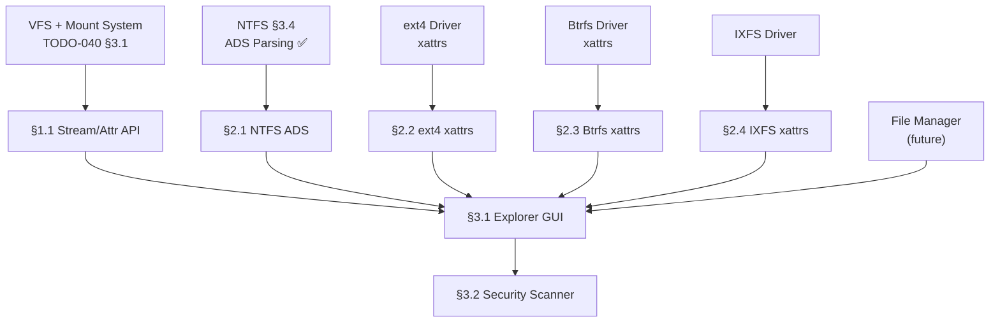

# 313.04-ADS-Explorer — Alternate Data Streams & Extended Attributes Explorer

> **Goal:** Build a GUI explorer for hidden/attached metadata on files. NTFS stores
> Alternate Data Streams (named `$DATA` attributes), ext4/Btrfs/IXFS store extended
> attributes (xattrs), and HFS+/APFS store resource forks. All of these are invisible
> to normal file browsing and can be abused to hide data (malware payloads, tracking
> metadata). Impossible OS exposes them all in a unified "Streams & Attributes" tab in
> the File Manager properties panel — one-click transparency for security-conscious users.
> No desktop OS provides a built-in GUI for this.

> [!IMPORTANT]
> **Origins:** The NTFS ADS section (§2.1) was originally §17.1 in
> [`TODO-040.08-NTFS.md`](file:///home/derickpayne/impossible-os/todo/010-Kernel-Foundations/TODO-040-Filesystem/TODO-040.08-NTFS.md).
> It was moved here because stream/attribute exploration is a tool-level concern
> that benefits from a unified GUI across all filesystems that support hidden metadata.
>
> → XREF: `TODO-313-Filesystem-Tools.md` (master)
> → XREF: `TODO-313.01-Disk-Manager.md` (context menu integration)
> → XREF: `TODO-040.08-NTFS.md §3.4` (ADS attribute parsing)

> [!CAUTION]
> **Memory Rule:** Use `pmm_alloc_contiguous()` for ALL buffers > 4 KB (stream data
> buffers, xattr list buffers). `kmalloc` is ONLY for small kernel structs (≤ 4 KB).

---

## TODO Completion Roadmap

### Dependency Graph

### Phase-by-Phase Implementation Order

| ⭐ | P    | Sections                     | What It Delivers                           | Depends On             | Status |
| -- | :--: | ---------------------------- | ------------------------------------------ | ---------------------- | :----: |
| 💎 | P0   | Prerequisites                | VFS, FS drivers, NTFS ADS parsing          | —                      |   ✅   |
| 💎 | P1   | §1.1 Stream/Attr API         | Generic `enum_streams()` interface         | P0 (VFS)               |   ⬜   |
| ⭐ | P1   | §2.1 NTFS ADS Provider       | 🚀 NTFS named `$DATA` enumeration          | P0 (NTFS §3.4)         |   ⬜   |
| 💎 | P1   | §2.2 ext4 xattr Provider     | ext4 extended attribute enumeration        | P0 (ext4)              |   ⬜   |
| 💎 | P1   | §2.3 Btrfs xattr Provider    | Btrfs extended attribute enumeration       | P0 (Btrfs)             |   ⬜   |
| 💎 | P1   | §2.4 IXFS xattr Provider     | IXFS extended attribute enumeration        | P0 (IXFS)              |   ⬜   |
| ⭐ | P2   | §3.1 Explorer GUI            | 🚀 "Streams & Attributes" tab in File Mgr  | P1 (§1.1 + providers)  |   ⬜   |
| ⭐ | P2   | §3.2 Security Scanner        | 🚀 Auto-detect suspicious hidden streams   | P2 (§3.1)              |   ⬜   |

> [!NOTE]
> **Phase 1** creates the per-FS providers — NTFS ADS is the richest, others have xattrs.
>
> **Phase 2** delivers the visual explorer and security scanner — the core exclusive features.

> [!TIP]
> **Which filesystems support what:**
> | Filesystem | Hidden Metadata Type | Typical Use |
> |:--|:--|:--|
> | NTFS | Alternate Data Streams (named `$DATA`) | Zone.Identifier, thumbnails, malware hiding |
> | ext4 | Extended Attributes (`user.*`, `security.*`) | SELinux labels, capabilities, ACLs |
> | Btrfs | Extended Attributes (same as ext4) | SELinux, subvolume properties |
> | IXFS | Extended Attributes | App metadata, tags |
> | FAT32 | — (none) | No hidden metadata support |
> | exFAT | — (none) | No hidden metadata support |

---

## 1. Stream/Attribute Framework

### 1.1 Stream & Attribute Enumeration API

**Prompt:** Define a generic API for enumerating hidden metadata (streams, extended attributes) on any file. The API abstracts the difference between NTFS ADS (named `$DATA` attributes) and POSIX-style extended attributes (xattrs). Returns an array of `file_stream_t` structs via a callback. Each entry contains: stream/attribute name, size, type (DATA_STREAM or XATTR), and whether it's readable. Register per-FS providers via `vfs_register_stream_provider()`. After completing all items, mark every item as `[x]`, update this prompt to a verification prompt, run `bash scripts/build.sh clean`, and commit as `"fs: stream/attribute enumeration API"`. Add notes directly in this TODO section. After implementation, save any gotchas, solutions, and important information to MCP memory (`mcp_memory_create_entities` / `mcp_memory_add_observations`).

- [ ] Define `file_stream_t` struct in `include/kernel/fs/vfs.h`:
  - [ ] `name`: stream/attribute name (e.g., "Zone.Identifier", "user.comment")
  - [ ] `size`: data size in bytes
  - [ ] `type`: `STREAM_TYPE_ADS` (NTFS), `STREAM_TYPE_XATTR` (ext4/Btrfs/IXFS)
  - [ ] `namespace`: for xattrs: `user`, `security`, `system`, `trusted`
  - [ ] `readable`: whether the data can be read (permissions check)
- [ ] Add `int (*enum_streams)(struct vfs_node *file, stream_callback_t cb, void *ctx)` to `struct vfs_ops`
- [ ] Add `int (*read_stream)(struct vfs_node *file, const char *name, uint64_t offset, size_t len, void *buf)` to `struct vfs_ops`
- [ ] Implement `vfs_enum_streams(const char *path, callback, ctx)` in VFS layer
- [ ] Implement `vfs_read_stream(const char *path, const char *stream_name, offset, len, buf)`
- [ ] Commit: `"fs: stream/attribute enumeration API"`

---

## 2. Per-Filesystem Providers

### 2.1 NTFS Alternate Data Streams (moved from TODO-040.08 §17.1)

**Prompt:** NTFS Alternate Data Streams (ADS) are hidden named `$DATA` attributes that can store arbitrary data alongside the primary file content. Malware commonly abuses ADS to hide payloads — Windows provides no built-in GUI to view them (only `dir /r` or PowerShell). Implement enumeration of all named `$DATA` streams and reading their contents. This is the richest hidden metadata of any filesystem. After completing all items, mark every item as `[x]`, update this prompt to a verification prompt, run `bash scripts/build.sh clean`, and commit as `"ntfs: ADS stream provider"`. Add notes directly in this TODO section. After implementation, save any gotchas, solutions, and important information to MCP memory (`mcp_memory_create_entities` / `mcp_memory_add_observations`).

> [!TIP]
> **NTFS ADS are the most dangerous hidden metadata.** Common abuse vectors:
> - `file.exe:payload.exe` — hidden executable alongside innocent file
> - `Zone.Identifier` — Windows download tracking (benign but privacy)
> - `$THUMBNAIL_CACHE` — cached thumbnails remain after file deletion

- [ ] Implement `ntfs_enum_streams(vol, inode, callback)`:
  - [ ] Walk all `$DATA` (type `0x80`) attributes in MFT record
  - [ ] For unnamed `$DATA` → primary stream (skip — this is the file itself)
  - [ ] For named `$DATA` → ADS: extract stream name (UTF-16LE), size
  - [ ] Handle `$ATTRIBUTE_LIST` extension records for files with many streams
  - [ ] Callback: `{ stream_name, size, resident_flag }`
- [ ] Implement `ntfs_read_stream(vol, inode, stream_name, offset, len, buf)`:
  - [ ] Locate named `$DATA` attribute matching `stream_name`
  - [ ] Read data (resident or non-resident) using §4.2 reader
- [ ] Register via `vfs_register_stream_provider()`
- [ ] Commit: `"ntfs: ADS stream provider"`

### 2.2 ext4 Extended Attributes

**Prompt:** ext4 stores extended attributes (xattrs) in two locations: inline in the inode body (if space permits after standard attributes) and in a separate xattr block referenced by `i_file_acl`. Namespaces: `user.*` (application-defined), `security.*` (SELinux labels, capabilities), `system.*` (ACLs), `trusted.*` (admin-only). Enumerate all xattrs from both locations and return them via the generic stream API. After completing all items, mark every item as `[x]`, update this prompt to a verification prompt, run `bash scripts/build.sh clean`, and commit as `"ext4: xattr provider"`. Add notes directly in this TODO section. After implementation, save any gotchas, solutions, and important information to MCP memory (`mcp_memory_create_entities` / `mcp_memory_add_observations`).

- [ ] Implement `ext4_enum_streams(vol, inode, callback)`:
  - [ ] Read inline xattrs from inode body (after `i_extra_isize`)
  - [ ] Read external xattr block if `i_file_acl` != 0
  - [ ] Parse xattr header + entries: `{ name_index, name, value_size, value }`
  - [ ] Map name_index to namespace: 1=user, 2=system.posix_acl, 4=trusted, 6=security
  - [ ] Callback: `{ namespace.name, size, STREAM_TYPE_XATTR }`
- [ ] Implement `ext4_read_stream(vol, inode, xattr_name, offset, len, buf)`:
  - [ ] Locate xattr by name, read value data
- [ ] Register via `vfs_register_stream_provider()`
- [ ] Commit: `"ext4: xattr provider"`

### 2.3 Btrfs Extended Attributes

**Prompt:** Btrfs stores extended attributes as `XATTR_ITEM` keys (type 24) in the filesystem B-tree, keyed by inode number + name hash. Namespaces are the same as ext4 (user, security, system, trusted). Enumerate all XATTR items for a given inode. After completing all items, mark every item as `[x]`, update this prompt to a verification prompt, run `bash scripts/build.sh clean`, and commit as `"btrfs: xattr provider"`. Add notes directly in this TODO section. After implementation, save any gotchas, solutions, and important information to MCP memory (`mcp_memory_create_entities` / `mcp_memory_add_observations`).

- [ ] Implement `btrfs_enum_streams(vol, inode, callback)`:
  - [ ] Search B-tree for keys with objectid=inode, type=BTRFS_XATTR_ITEM_KEY
  - [ ] Parse `btrfs_dir_item` structure within xattr items
  - [ ] Extract: name, data_len, name_len
  - [ ] Map namespace from name prefix (user., security., etc.)
  - [ ] Callback: `{ namespace.name, size, STREAM_TYPE_XATTR }`
- [ ] Implement `btrfs_read_stream(vol, inode, xattr_name, offset, len, buf)`:
  - [ ] Locate xattr item by name hash lookup
  - [ ] Read inline value data from dir_item
- [ ] Register via `vfs_register_stream_provider()`
- [ ] Commit: `"btrfs: xattr provider"`

### 2.4 IXFS Extended Attributes

**Prompt:** IXFS (Impossible OS native filesystem) supports extended attributes for application metadata, tags, and labels. Implement enumeration and reading of all xattrs on IXFS files/directories via the generic stream API. The storage format depends on the IXFS inode structure. After completing all items, mark every item as `[x]`, update this prompt to a verification prompt, run `bash scripts/build.sh clean`, and commit as `"ixfs: xattr provider"`. Add notes directly in this TODO section. After implementation, save any gotchas, solutions, and important information to MCP memory (`mcp_memory_create_entities` / `mcp_memory_add_observations`).

- [ ] Implement `ixfs_enum_streams(vol, inode, callback)`:
  - [ ] Read xattr list from IXFS inode metadata area
  - [ ] Extract: name, size, namespace
  - [ ] Callback: `{ name, size, STREAM_TYPE_XATTR }`
- [ ] Implement `ixfs_read_stream(vol, inode, xattr_name, offset, len, buf)`:
  - [ ] Locate xattr by name, read value data
- [ ] Register via `vfs_register_stream_provider()`
- [ ] Commit: `"ixfs: xattr provider"`

---

## 3. Explorer GUI (🚀 Exclusive)

### 3.1 Streams & Attributes Tab

**Prompt:** Add a "Streams & Attributes" tab to the File Manager's file properties panel. For NTFS files, show all Alternate Data Streams with their names and sizes. For ext4/Btrfs/IXFS files, show all extended attributes grouped by namespace. Allow viewing text content inline and exporting any stream/xattr to a separate file. Show a security indicator (⚠️) if the file has hidden ADS (NTFS) or unusual security xattrs. After completing all items, mark every item as `[x]`, update this prompt to a verification prompt, run `bash scripts/build.sh clean`, and commit as `"apps: streams & attributes explorer"`. Add notes directly in this TODO section. After implementation, save any gotchas, solutions, and important information to MCP memory (`mcp_memory_create_entities` / `mcp_memory_add_observations`).

> [!TIP]
> **Competitive Edge:** Windows hides ADS behind `dir /r` and PowerShell. Linux
> `getfattr` / `xattr` are CLI-only. macOS shows xattrs only via `xattr -l` CLI.
> Impossible OS shows everything in a GUI tab — instant transparency.

- [ ] "Streams & Attributes" tab in file properties panel:
  - [ ] Table: Name, Size, Type (ADS/xattr), Namespace
  - [ ] Grouped by namespace for xattrs (user, security, system, trusted)
  - [ ] NTFS ADS shown with stream icon, xattrs with attribute icon
- [ ] View stream/xattr content:
  - [ ] Text preview for small values (< 4 KB)
  - [ ] Hex dump for binary values
  - [ ] "Export to file" button for any stream/xattr
- [ ] Security indicators:
  - [ ] ⚠️ icon if file has NTFS ADS (potential malware vector)
  - [ ] 🔒 icon for security.* namespace xattrs (SELinux, capabilities)
  - [ ] ℹ️ icon for user.* namespace xattrs (application metadata)
- [ ] Count badge on "Streams & Attributes" tab: "(3)" if 3 hidden items
- [ ] Commit: `"apps: streams & attributes explorer"`

### 3.2 Security Scanner

**Prompt:** Add a "Scan for Hidden Streams" function that recursively scans a directory for files with hidden ADS (NTFS) or suspicious xattrs. This is a lightweight security audit tool — useful for detecting malware that hides payloads in ADS or checking for SELinux label mismatches. Show results in a table: File Path, Stream/Attr Name, Size, Risk Level (🟢 Benign / 🟡 Suspicious / 🔴 High Risk). Known-benign streams (Zone.Identifier, favicon) are auto-classified as 🟢. Unknown streams with executable content signatures are 🔴. After completing all items, mark every item as `[x]`, update this prompt to a verification prompt, run `bash scripts/build.sh clean`, and commit as `"apps: hidden stream security scanner"`. Add notes directly in this TODO section. After implementation, save any gotchas, solutions, and important information to MCP memory (`mcp_memory_create_entities` / `mcp_memory_add_observations`).

- [ ] "Scan for Hidden Streams" button in File Manager tools menu
- [ ] Recursive directory scanner:
  - [ ] Walk all files in selected directory
  - [ ] For each file: call `vfs_enum_streams()`, collect all non-primary streams
- [ ] Risk classification:
  - [ ] 🟢 Benign: Zone.Identifier, favicon, thumbs.db references
  - [ ] 🟡 Suspicious: Unknown named streams > 1 KB
  - [ ] 🔴 High Risk: Streams with MZ header (PE), ELF magic, or script headers
- [ ] Results table: File Path, Stream Name, Size, Risk Level, Actions (View/Export/Delete)
- [ ] Summary: "Scanned X files, found Y hidden streams (Z high risk)"
- [ ] Commit: `"apps: hidden stream security scanner"`

---

## Priority Order

| ⭐ | Priority  | Section                          | Description                                              |
| -- | --------- | -------------------------------- | -------------------------------------------------------- |
| 💎 | 🟡 P2     | §1.1 Stream/Attr API            | Foundation — generic enumeration interface                |
| ⭐ | 🟡 P2     | §2.1 NTFS ADS Provider          | 🚀 NTFS named `$DATA` streams (moved from NTFS §17.1)    |
| 💎 | 🟡 P2     | §2.2 ext4 xattr Provider        | ext4 extended attribute enumeration                      |
| 💎 | 🟡 P2     | §2.3 Btrfs xattr Provider       | Btrfs extended attribute enumeration                     |
| 💎 | 🟡 P2     | §2.4 IXFS xattr Provider        | IXFS extended attribute enumeration                      |
| ⭐ | 🟢 P3     | §3.1 Explorer GUI               | 🚀 **Exclusive** — "Streams & Attributes" tab in File Mgr |
| ⭐ | 🟢 P3     | §3.2 Security Scanner           | 🚀 **Exclusive** — hidden stream malware detection        |

---

## OS Comparison

| ⭐ | Feature                          | 🪟 Windows 11                      | 🐧 Linux                           | 🚀 Impossible OS                                 |
| -- | -------------------------------- | ---------------------------------- | ----------------------------------- | ------------------------------------------------ |
| 💎 | NTFS ADS visibility              | ⚠️ `dir /r` or PowerShell (CLI)    | ⚠️ `getfattr` CLI only              | ⬜ §2.1 P2 — GUI enumeration                     |
| 💎 | Extended attributes (xattrs)     | ❌ N/A (NTFS uses ADS instead)     | ⚠️ `getfattr` / `xattr` CLI only    | ⬜ §2.2–2.4 P2 — GUI for all FS                  |
| ⭐ | **GUI stream/xattr explorer**    | ❌ No built-in GUI                 | ❌ No built-in GUI                   | ⬜ **§3.1 P3 — properties tab** 🚀               |
| ⭐ | **Unified cross-FS view**        | ❌ ADS only (no xattr equivalent)  | ⚠️ Different CLI per FS             | ⬜ **§1.1 P2 — one API, all FS types** 🚀        |
| ⭐ | **Hidden stream security scan**  | ❌ Requires Sysinternals Streams   | ❌ No built-in scanner               | ⬜ **§3.2 P3 — recursive risk scanner** 🚀       |
| ⭐ | **Malware risk classification**  | ❌ Not available                   | ❌ Not available                     | ⬜ **§3.2 P3 — 🟢/🟡/🔴 auto-classify** 🚀      |

> **After P2 items:** Impossible OS can enumerate all hidden metadata across NTFS, ext4, Btrfs, and IXFS.
> **After P3 exclusive features:** GUI explorer + security scanner — no other OS provides this built-in.
