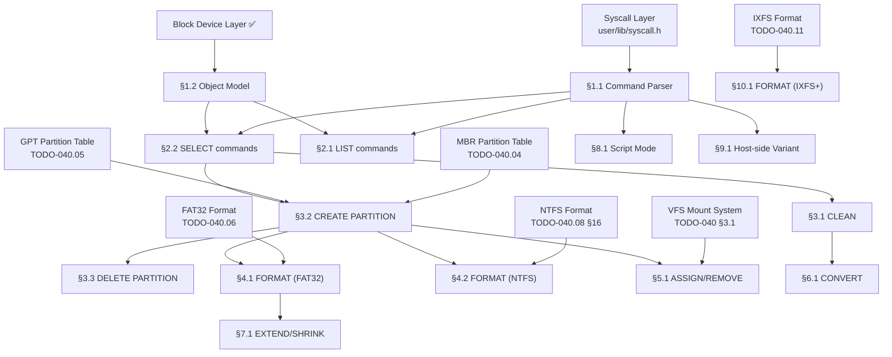

# TODO-040.99 — diskpart.exe (CLI Disk & Partition Manager)

> **Goal:** Build `diskpart.exe`, a command-line disk partitioning and formatting tool
> that is a **1:1 clone of Windows 11's `diskpart.exe`**. Uses the same interactive
> command syntax, same output format, and same scripting capability. This tool serves
> two purposes:
>
> 1. **OS-side:** Ships at `C:\Impossible\System32\diskpart.exe` — the primary CLI disk
>    management tool, complementing the GUI Disk Manager (`TODO-313.01`).
> 2. **Host-side (dev):** A Linux ELF variant (`tools/diskpart`) replaces all third-party
>    tools (`sgdisk`, `mkfs.fat`, `mformat`, `mcopy`, `parted`) used during development
>    to create and format test disk images.
>
> Starts with **FAT32** and **NTFS** formatting, then adds IXFS, ext4, exFAT, Btrfs.

> [!IMPORTANT]
> **Binary Format:** Impossible OS uses three executable formats (see `TODO-042-Binary-System.md`).
> `diskpart.exe` is a user-mode app — it uses **EIF** (native) initially, then **PE32+** for
> Windows compatibility. The kernel stays ELF; the bootloader stays PE/COFF.
>
> | Binary | Format | Loaded By |
> |:--|:--|:--|
> | `BOOTX64.EFI` | PE/COFF | UEFI firmware |
> | `kernel.exe` | ELF | Bootloader |
> | **`diskpart.exe`** | **EIF → PE32+** | **Kernel `exec_load()`** |
> | `cmd.exe` | EIF → PE32+ | Kernel `exec_load()` |
> | `explorer.exe` | EIF → PE32+ | Kernel `exec_load()` |
>
> | Variant | Format | Compiler | Location |
> |:--|:--|:--|:--|
> | Host-side (dev tool) | Linux ELF | `gcc` | `tools/diskpart` |
> | OS-side (native) | EIF | `clang-19 + elf2eif` | `C:\Impossible\System32\diskpart.exe` |
> | OS-side (Win32 compat) | PE32+ | `clang-19 + lld-link` | `C:\Impossible\System32\diskpart.exe` |
>
> → XREF: `TODO-042-Binary-System.md` (multi-format exec dispatcher)
> → XREF: `TODO-313.01-Disk-Manager.md` (GUI equivalent)
> → XREF: `TODO-040.04-MBR.md`, `TODO-040.05-GPT.md` (partition table drivers)

> [!CAUTION]
> **Memory Rule:** Use `pmm_alloc_contiguous()` for ALL buffers > 4 KB (sector buffers,
> FAT tables, partition table buffers). `kmalloc` is ONLY for small kernel structs (≤ 4 KB).
> The host-side variant uses standard `malloc()`.

---

## TODO Completion Roadmap

### Dependency Graph



### Phase-by-Phase Implementation Order

| ⭐ | P    | Sections                     | What It Delivers                           | Depends On             | Status |
| -- | :--: | ---------------------------- | ------------------------------------------ | ---------------------- | :----: |
| 💎 | P0   | Prerequisites                | Block device, MBR/GPT, FAT32, syscalls     | —                      |   ✅   |
| 💎 | P1   | §1.1 Command Parser          | Interactive REPL + tokenizer               | P0 (syscalls)          |   ⬜   |
| 💎 | P1   | §1.2 Object Model            | Disk/partition/volume selection state       | P0 (blkdev)            |   ⬜   |
| 💎 | P1   | §2.1–2.2 LIST/SELECT         | Browse disks and partitions                | P1 (§1.1–1.2)          |   ⬜   |
| 💎 | P2   | §3.1–3.3 CLEAN/CREATE/DELETE | Partition table manipulation               | P1 (§2.2) + MBR/GPT   |   ⬜   |
| ⭐ | P2   | §4.1 FORMAT (FAT32)          | 🚀 Format volumes as FAT32                 | P2 (§3.2)              |   ⬜   |
| ⭐ | P2   | §4.2 FORMAT (NTFS)           | 🚀 Format volumes as NTFS                  | P2 (§3.2) + NTFS §16  |   ⬜   |
| 💎 | P2   | §5.1 ASSIGN/REMOVE           | Drive letter management                    | P2 (§3.2) + VFS       |   ⬜   |
| ⭐ | P3   | §6.1 CONVERT MBR/GPT         | 🚀 Non-destructive conversion              | P2 (§3.1)              |   ⬜   |
| 💎 | P3   | §7.1 EXTEND/SHRINK           | Volume resizing                            | P2 (§4)                |   ⬜   |
| 💎 | P3   | §8.1 Script Mode             | Batch scripting from file                  | P1 (§1.1)              |   ⬜   |
| ⭐ | P3   | §9.1 Host-Side Variant       | 🚀 Replace 3rd-party dev tools             | P1 (§1.1)              |   ⬜   |
| 💎 | P4   | §10.1 FORMAT (IXFS+)         | Format as IXFS, ext4, exFAT, Btrfs         | P2 (§3.2)              |   ⬜   |
| 💎 | P4   | §11.1 Advanced Commands      | DETAIL, ATTRIBUTES, SAN, UNIQUEID          | P3                     |   ⬜   |

> [!NOTE]
> **Phase 1** delivers the interactive shell and object model — `DISKPART>` prompt works.
>
> **Phase 2** is the core: create partitions + format FAT32/NTFS + assign letters. This alone
> replaces `sgdisk` + `mkfs.fat` + `mkfs.ntfs` for testing.
>
> **Phase 3** adds conversion, resizing, scripting, and the host-side variant.
>
> **Phase 4** extends formatting to all other filesystems.

---

## Windows 11 diskpart Command Reference

> The following table maps every Windows 11 `diskpart.exe` command to an
> Impossible OS implementation section. Commands marked ⬜ are planned;
> commands marked ❌ are not applicable to Impossible OS.

| Command           | Windows 11 Description                    | Impossible OS Section  | Status |
|:------------------|:------------------------------------------|:-----------------------|:------:|
| `ACTIVE`          | Mark MBR partition as active (bootable)   | §3.4                   |   ⬜   |
| `ADD`             | Add mirror to simple volume               | ❌ (no dynamic disks)   |   —   |
| `ASSIGN`          | Assign drive letter or mount point        | §5.1                   |   ⬜   |
| `ATTRIBUTES`      | Manipulate volume/disk attributes         | §11.1                  |   ⬜   |
| `AUTOMOUNT`       | Enable/disable auto-mount feature         | §11.2                  |   ⬜   |
| `BREAK`           | Break mirror set                          | ❌ (no dynamic disks)   |   —   |
| `CLEAN`           | Clear partition table from disk           | §3.1                   |   ⬜   |
| `COMPACT`         | Reduce physical size of VHD               | ❌ (no VHD support yet) |   —   |
| `CONVERT`         | Convert between MBR/GPT                   | §6.1                   |   ⬜   |
| `CREATE`          | Create partition or volume                | §3.2                   |   ⬜   |
| `DELETE`          | Delete partition or volume                | §3.3                   |   ⬜   |
| `DETAIL`          | Show details of selected object           | §11.1                  |   ⬜   |
| `DETACH`          | Detach virtual disk                       | ❌ (no VHD support yet) |   —   |
| `EXIT`            | Exit diskpart                             | §1.1 (built-in)        |   ⬜   |
| `EXTEND`          | Extend volume                             | §7.1                   |   ⬜   |
| `FILESYSTEMS`     | List supported filesystems on volume      | §4 (built-in)          |   ⬜   |
| `FORMAT`          | Format volume                             | §4.1–4.2, §10.1        |   ⬜   |
| `GPT`             | Assign GPT attributes to partition        | §11.1                  |   ⬜   |
| `HELP`            | Display command help                      | §1.1 (built-in)        |   ⬜   |
| `IMPORT`          | Import disk group                         | ❌ (no dynamic disks)   |   —   |
| `INACTIVE`        | Mark partition as inactive                | §3.4                   |   ⬜   |
| `LIST`            | List disks, partitions, or volumes        | §2.1                   |   ⬜   |
| `MERGE`           | Merge child disk with parent              | ❌ (no VHD)             |   —   |
| `OFFLINE`         | Take disk offline                         | §11.3                  |   ⬜   |
| `ONLINE`          | Bring disk online                         | §11.3                  |   ⬜   |
| `RECOVER`         | Refresh disk group state                  | ❌ (no dynamic disks)   |   —   |
| `REM`             | Script comment                            | §8.1                   |   ⬜   |
| `REMOVE`          | Remove drive letter                       | §5.1                   |   ⬜   |
| `REPAIR`          | Repair RAID-5                             | ❌ (no RAID)            |   —   |
| `RESCAN`          | Rescan for new disks                      | §11.4                  |   ⬜   |
| `RETAIN`          | Place retained partition                  | ❌ (no dynamic disks)   |   —   |
| `SAN`             | Set SAN policy                            | §11.5                  |   ⬜   |
| `SELECT`          | Select disk, partition, or volume         | §2.2                   |   ⬜   |
| `SETID`           | Change partition type GUID/ID             | §11.1                  |   ⬜   |
| `SHRINK`          | Shrink volume                             | §7.1                   |   ⬜   |
| `UNIQUEID`        | Display/set disk GUID                     | §11.1                  |   ⬜   |

> Commands marked ❌ are Windows-specific features (dynamic disks, VHD, RAID) that are
> not planned for Impossible OS. These may be added in the future as needed.

---

## 1. Command Shell & Object Model

### 1.1 Interactive Command Parser

**Prompt:** Implement the diskpart interactive REPL (Read-Eval-Print Loop). On launch, print the Windows 11-style banner: `"Microsoft DiskPart version 10.0.22621.1\n\nCopyright (C) Microsoft Corporation.\nOn computer: IMPOSSIBLE-OS\n\nDISKPART> "` (adapted for Impossible OS branding). Parse commands case-insensitively. Support abbreviated commands (e.g., `sel` = `select`, `lis` = `list`, `cre` = `create`). Handle `EXIT` to quit, `HELP` to show all commands, `HELP <command>` for per-command help. Support `Ctrl+C` to cancel long operations without exiting. After completing all items, mark every item as `[x]`, update this prompt to a verification prompt, run `bash scripts/build.sh clean`, and commit as `"diskpart: interactive command shell"`. Add notes directly in this TODO section. After implementation, save any gotchas, solutions, and important information to MCP memory (`mcp_memory_create_entities` / `mcp_memory_add_observations`).

> [!TIP]
> **Windows 11 diskpart banner for reference:**
> ```
> Microsoft DiskPart version 10.0.22621.1
>
> Copyright (C) Microsoft Corporation.
> On computer: DESKTOP-ABC123
>
> DISKPART>
> ```
> Impossible OS uses the same format with updated branding.

- [ ] Implement `diskpart_main()` entry point
- [ ] Print Impossible OS-branded startup banner
- [ ] Command tokenizer: split line into command + arguments
- [ ] Case-insensitive command matching with abbreviation support:
  - [ ] Minimum unique prefix: `sel` → `select`, `lis` → `list`, `cre` → `create`
  - [ ] Ambiguous prefix → `"The command is not recognized."` error
- [ ] Command dispatch table: `{ name, min_prefix_len, handler_fn, help_text }`
- [ ] Built-in commands:
  - [ ] `EXIT` — exit diskpart
  - [ ] `HELP` — list all commands with one-line description
  - [ ] `HELP <command>` — detailed help for specific command
  - [ ] `REM` — comment (ignored, for scripts)
- [ ] `Ctrl+C` handling: cancel current operation, return to prompt
- [ ] Error messages match Windows 11 format:
  - [ ] `"The command is not recognized.\nType HELP for a list of commands."`
  - [ ] `"There is no disk selected.\nPlease select a disk and try again."`
- [ ] Commit: `"diskpart: interactive command shell"`

### 1.2 Disk/Partition/Volume Object Model

**Prompt:** Implement the diskpart selection model. diskpart works by selecting objects: `SELECT DISK 0`, then `SELECT PARTITION 1`, etc. All subsequent commands operate on the selected object. Enumerate all physical disks from the block device layer, parse their partition tables (MBR/GPT), and build an in-memory model of disks → partitions → volumes. The model refreshes on `RESCAN`. Selection state: exactly one disk, partition, and volume can be selected at a time. After completing all items, mark every item as `[x]`, update this prompt to a verification prompt, run `bash scripts/build.sh clean`, and commit as `"diskpart: object model + enumeration"`. Add notes directly in this TODO section. After implementation, save any gotchas, solutions, and important information to MCP memory (`mcp_memory_create_entities` / `mcp_memory_add_observations`).

- [ ] Define `diskpart_disk_t`:
  - [ ] `disk_id`: disk number (0-based)
  - [ ] `status`: Online/Offline/No Media
  - [ ] `size`: total capacity
  - [ ] `free`: unallocated space
  - [ ] `type`: GPT/MBR/RAW
  - [ ] `partitions[]`: array of partition structs
- [ ] Define `diskpart_partition_t`:
  - [ ] `part_id`: partition number (1-based)
  - [ ] `type`: Primary/Extended/Logical/EFI System/MSR
  - [ ] `size`, `offset_lba`
  - [ ] `fs_type`: NTFS/FAT32/IXFS/ext4/exFAT/Btrfs/RAW
  - [ ] `drive_letter`: assigned letter or `\0`
  - [ ] `label`: volume label
  - [ ] `active`: MBR active flag
- [ ] Enumerate disks from block device layer (`blkdev_get_count()`, `blkdev_get_info()`)
- [ ] Parse MBR/GPT for each disk → populate partition list
- [ ] Selection state: `selected_disk`, `selected_partition`, `selected_volume`
- [ ] Selecting a disk clears partition/volume selection
- [ ] Asterisk (`*`) marks selected object in `LIST` output
- [ ] Commit: `"diskpart: object model + enumeration"`

---

## 2. Navigation Commands

### 2.1 LIST Commands

**Prompt:** Implement `LIST DISK`, `LIST PARTITION`, `LIST VOLUME`. Output must match Windows 11 format exactly. `LIST DISK` shows all physical disks. `LIST PARTITION` shows partitions on the selected disk (requires disk selection). `LIST VOLUME` shows all mounted volumes across all disks. The selected object is marked with `*` in the first column. After completing all items, mark every item as `[x]`, update this prompt to a verification prompt, run `bash scripts/build.sh clean`, and commit as `"diskpart: LIST commands"`. Add notes directly in this TODO section. After implementation, save any gotchas, solutions, and important information to MCP memory (`mcp_memory_create_entities` / `mcp_memory_add_observations`).

> [!TIP]
> **Windows 11 `LIST DISK` output format:**
> ```
>   Disk ###  Status         Size     Free     Dyn  Gpt
>   --------  -------------  -------  -------  ---  ---
>   Disk 0    Online          256 GB      0 B         *
>   Disk 1    Online          500 GB   120 GB
> ```
> **Windows 11 `LIST PARTITION` output format:**
> ```
>   Partition ###  Type              Size     Offset
>   -------------  ----------------  -------  -------
>   Partition 1    System             100 MB  1024 KB
>   Partition 2    Primary            255 GB   101 MB
> ```
> **Windows 11 `LIST VOLUME` output format:**
> ```
>   Volume ###  Ltr  Label        Fs     Type        Size     Status     Info
>   ----------  ---  -----------  -----  ----------  -------  ---------  --------
>   Volume 0     C   System       NTFS   Partition    255 GB  Healthy    Boot
>   Volume 1     D   Data         FAT32  Partition    500 GB  Healthy
> ```

- [ ] `LIST DISK` — all physical disks:
  - [ ] Columns: Disk ###, Status, Size, Free, Dyn, Gpt
  - [ ] `*` prefix on selected disk
  - [ ] Size formatting: GB/MB/KB matching Windows rules
- [ ] `LIST PARTITION` — partitions on selected disk:
  - [ ] Error if no disk selected: `"There is no disk selected."`
  - [ ] Columns: Partition ###, Type, Size, Offset
  - [ ] Type values: Primary, Extended, Logical, System, MSR
- [ ] `LIST VOLUME` — all mounted volumes:
  - [ ] Columns: Volume ###, Ltr, Label, Fs, Type, Size, Status, Info
  - [ ] Info column: Boot, System, Active, etc.
- [ ] Column alignment: right-align numbers, left-align text
- [ ] Commit: `"diskpart: LIST commands"`

### 2.2 SELECT Commands

**Prompt:** Implement `SELECT DISK <n>`, `SELECT PARTITION <n>`, `SELECT VOLUME <n>`. Validates the index — error if out of range. Prints confirmation: `"Disk 0 is now the selected disk."`. Selecting a disk clears partition/volume selection. Selecting a partition requires a disk to be selected first. After completing all items, mark every item as `[x]`, update this prompt to a verification prompt, run `bash scripts/build.sh clean`, and commit as `"diskpart: SELECT commands"`. Add notes directly in this TODO section. After implementation, save any gotchas, solutions, and important information to MCP memory (`mcp_memory_create_entities` / `mcp_memory_add_observations`).

- [ ] `SELECT DISK <n>`:
  - [ ] Validate n is in-range
  - [ ] Set `selected_disk = n`, clear partition/volume
  - [ ] Print: `"Disk <n> is now the selected disk."`
- [ ] `SELECT PARTITION <n>`:
  - [ ] Error if no disk selected
  - [ ] Validate n is in-range for current disk
  - [ ] Print: `"Partition <n> is now the selected partition."`
- [ ] `SELECT VOLUME <n>`:
  - [ ] Validate n is in-range
  - [ ] Print: `"Volume <n> is now the selected volume."`
- [ ] Error messages match Windows 11:
  - [ ] `"The disk number is not valid."` / `"The partition number is not valid."`
- [ ] Commit: `"diskpart: SELECT commands"`

---

## 3. Partition Operations

### 3.1 CLEAN

**Prompt:** Implement `CLEAN` and `CLEAN ALL`. `CLEAN` removes all partition/volume information from the selected disk by zeroing the MBR (first sector) and GPT headers (LBA 1 + backup). `CLEAN ALL` writes zeros to every sector on the disk (full wipe — very slow for large disks, show progress). Both require a disk to be selected. Print `"DiskPart succeeded in cleaning the disk."`. After completing all items, mark every item as `[x]`, update this prompt to a verification prompt, run `bash scripts/build.sh clean`, and commit as `"diskpart: CLEAN command"`. Add notes directly in this TODO section. After implementation, save any gotchas, solutions, and important information to MCP memory (`mcp_memory_create_entities` / `mcp_memory_add_observations`).

- [ ] `CLEAN`:
  - [ ] Error if no disk selected
  - [ ] Zero LBA 0 (MBR)
  - [ ] If GPT: zero LBA 1 (primary GPT header) + last-LBA (backup GPT header)
  - [ ] Zero protective MBR if present
  - [ ] Refresh disk model → disk shows as RAW
  - [ ] Print: `"DiskPart succeeded in cleaning the disk."`
- [ ] `CLEAN ALL`:
  - [ ] Same as CLEAN + write zeros to every sector
  - [ ] Progress indicator: percentage complete with ETA
  - [ ] Cancelable with Ctrl+C
- [ ] Commit: `"diskpart: CLEAN command"`

### 3.2 CREATE PARTITION

**Prompt:** Implement `CREATE PARTITION PRIMARY [SIZE=<n>] [OFFSET=<n>] [ID=<guid>]`. For MBR: create a primary partition entry (max 4 primary, or 3 primary + 1 extended). For GPT: create a Microsoft Basic Data partition entry. If SIZE is omitted, use all available contiguous free space. SIZE is in MB. Also implement `CREATE PARTITION EXTENDED` (MBR only) and `CREATE PARTITION LOGICAL` (inside extended). The newly created partition becomes the selected partition. After completing all items, mark every item as `[x]`, update this prompt to a verification prompt, run `bash scripts/build.sh clean`, and commit as `"diskpart: CREATE PARTITION command"`. Add notes directly in this TODO section. After implementation, save any gotchas, solutions, and important information to MCP memory (`mcp_memory_create_entities` / `mcp_memory_add_observations`).

- [ ] `CREATE PARTITION PRIMARY [SIZE=<n>] [OFFSET=<n>] [ID=<guid>]`:
  - [ ] Error if no disk selected
  - [ ] If SIZE omitted: use all contiguous free space
  - [ ] MBR: add entry to partition table (max 4 primary)
  - [ ] GPT: add partition entry with Basic Data GUID
  - [ ] Align to 1 MiB boundary (2048 sectors) — Windows 11 default
  - [ ] Write updated partition table to disk
  - [ ] Auto-select the new partition
  - [ ] Print: `"DiskPart succeeded in creating the specified partition."`
- [ ] `CREATE PARTITION EXTENDED [SIZE=<n>]` (MBR only):
  - [ ] Create extended partition — container for logical partitions
  - [ ] Error if already exists or disk is GPT
- [ ] `CREATE PARTITION LOGICAL [SIZE=<n>]` (MBR only):
  - [ ] Create logical partition inside extended partition
  - [ ] Error if no extended partition exists
- [ ] `CREATE PARTITION EFI [SIZE=<n>]`:
  - [ ] GPT only: create EFI System Partition (ESP) with GUID C12A7328-...
  - [ ] Default size: 100 MB (Windows 11 default)
- [ ] `CREATE PARTITION MSR [SIZE=<n>]`:
  - [ ] GPT only: create Microsoft Reserved Partition
  - [ ] Default size: 16 MB
- [ ] Commit: `"diskpart: CREATE PARTITION command"`

### 3.3 DELETE PARTITION

**Prompt:** Implement `DELETE PARTITION` and `DELETE PARTITION OVERRIDE`. Deletes the selected partition from the partition table. Without OVERRIDE, refuses to delete system/boot/OEM partitions. With OVERRIDE, deletes any partition. Print `"DiskPart successfully deleted the selected partition."`. After completing all items, mark every item as `[x]`, update this prompt to a verification prompt, run `bash scripts/build.sh clean`, and commit as `"diskpart: DELETE PARTITION command"`. Add notes directly in this TODO section. After implementation, save any gotchas, solutions, and important information to MCP memory (`mcp_memory_create_entities` / `mcp_memory_add_observations`).

- [ ] `DELETE PARTITION`:
  - [ ] Error if no partition selected
  - [ ] Refuse if partition is System/Boot/OEM (without OVERRIDE)
  - [ ] MBR: zero the partition table entry
  - [ ] GPT: zero the partition entry, update header CRC
  - [ ] Refresh model, clear partition selection
  - [ ] Print: `"DiskPart successfully deleted the selected partition."`
- [ ] `DELETE PARTITION OVERRIDE`:
  - [ ] Same as above but delete any partition type
- [ ] Commit: `"diskpart: DELETE PARTITION command"`

### 3.4 ACTIVE / INACTIVE

**Prompt:** Implement `ACTIVE` and `INACTIVE` for MBR disks. `ACTIVE` sets the active/bootable flag (byte `0x00` of partition entry → `0x80`) on the selected partition. `INACTIVE` clears it. GPT disks don't use active flags — print error. After completing all items, mark every item as `[x]`, update this prompt to a verification prompt, run `bash scripts/build.sh clean`, and commit as `"diskpart: ACTIVE/INACTIVE commands"`. Add notes directly in this TODO section. After implementation, save any gotchas, solutions, and important information to MCP memory (`mcp_memory_create_entities` / `mcp_memory_add_observations`).

- [ ] `ACTIVE`:
  - [ ] Error if GPT disk: `"The active command can only be used on MBR disks."`
  - [ ] Set boot indicator `0x80` on selected partition entry
  - [ ] Clear active flag on all other partitions (only one can be active)
  - [ ] Print: `"DiskPart marked the current partition as active."`
- [ ] `INACTIVE`:
  - [ ] Clear boot indicator → `0x00`
  - [ ] Print: `"DiskPart marked the current partition as inactive."`
- [ ] Commit: `"diskpart: ACTIVE/INACTIVE commands"`

---

## 4. Format Operations (Core)

### 4.1 FORMAT — FAT32

**Prompt:** Implement `FORMAT FS=FAT32 [QUICK] [LABEL=<label>] [UNIT=<size>]`. Formats the selected partition as FAT32. QUICK format writes BPB, FAT tables, and root directory but does NOT zero all data clusters. Full format zeros all clusters first (slow, show progress). Allocation unit size defaults are: ≤8 GB → 4 KB, ≤16 GB → 8 KB, ≤32 GB → 16 KB, >32 GB → 32 KB. Maximum FAT32 volume size: 32 GB (Windows limit) or 2 TB (if using FAT32 spec limit — Impossible OS should use the larger limit). Write BPB, FSInfo, backup boot sector, both FAT copies, and root directory. After completing all items, mark every item as `[x]`, update this prompt to a verification prompt, run `bash scripts/build.sh clean`, and commit as `"diskpart: FORMAT FAT32"`. Add notes directly in this TODO section. After implementation, save any gotchas, solutions, and important information to MCP memory (`mcp_memory_create_entities` / `mcp_memory_add_observations`).

> [!TIP]
> **Competitive Edge:** Windows `diskpart` artificially limits FAT32 to 32 GB.
> Impossible OS `diskpart` removes this limit — format FAT32 up to 2 TB.
> This matches what third-party tools like Rufus and fat32format already do.

- [ ] `FORMAT FS=FAT32 [QUICK] [LABEL=<label>] [UNIT=<size>]`:
  - [ ] Error if no partition selected
  - [ ] Validate partition size (>= 33 MB for FAT32)
  - [ ] Calculate FAT32 parameters:
    - [ ] Sectors per cluster (based on size or UNIT= override)
    - [ ] Reserved sectors (32)
    - [ ] FAT size (sectors per FAT)
    - [ ] Total clusters
  - [ ] Write BPB (BIOS Parameter Block) at sector 0 of partition
  - [ ] Write FSInfo at sector 1
  - [ ] Write backup boot sector at sector 6
  - [ ] Zero both FAT copies (FAT #1 and FAT #2)
  - [ ] Set FAT[0] = media byte, FAT[1] = end-of-chain, FAT[2] = root dir
  - [ ] Zero root directory cluster
  - [ ] If full format (no QUICK): zero all data clusters with progress bar
  - [ ] Set volume label in root directory and BPB
- [ ] Progress output matching Windows:
  - [ ] `"  0 percent completed"` → `"100 percent completed"`
  - [ ] `"DiskPart successfully formatted the volume."`
- [ ] Support `UNIT=512`, `UNIT=1024`, `UNIT=2048`, `UNIT=4096`, ... `UNIT=65536`
- [ ] Commit: `"diskpart: FORMAT FAT32"`

### 4.2 FORMAT — NTFS

**Prompt:** Implement `FORMAT FS=NTFS [QUICK] [LABEL=<label>] [UNIT=<size>]`. Create NTFS metadata from scratch: $MFT, $MFTMirr, $LogFile, $Volume, $AttrDef, . (root dir), $Bitmap, $Boot, $BadClus, $Secure, $UpCase, $Extend. Default cluster size: ≤2 GB → 512 bytes, ≤2 TB → 4 KB, >2 TB → 8 KB. This is the most complex formatting operation — NTFS requires ~20 system metafiles to be created during format. After completing all items, mark every item as `[x]`, update this prompt to a verification prompt, run `bash scripts/build.sh clean`, and commit as `"diskpart: FORMAT NTFS"`. Add notes directly in this TODO section. After implementation, save any gotchas, solutions, and important information to MCP memory (`mcp_memory_create_entities` / `mcp_memory_add_observations`).

> [!IMPORTANT]
> → XREF: `TODO-040.08-NTFS.md §16` — NTFS Format (mkfs.ntfs equivalent)
> The NTFS formatter creates the same metafile structure that the read-only driver
> (§1–§11) expects to find. Both must agree on the on-disk layout.

- [ ] `FORMAT FS=NTFS [QUICK] [LABEL=<label>] [UNIT=<size>]`:
  - [ ] Error if no partition selected
  - [ ] Calculate NTFS parameters:
    - [ ] Cluster size (based on volume size or UNIT= override)
    - [ ] MFT record size (usually 1024 bytes)
    - [ ] Index record size (usually 4096 bytes)
    - [ ] MFT zone size (12.5% of volume)
  - [ ] Write NTFS boot sector ($Boot, inode 7):
    - [ ] OEM ID: `"NTFS    "`
    - [ ] BPB: bytes/sector, sectors/cluster, volume serial number
    - [ ] MFT start LCN, MFTMirr start LCN
  - [ ] Create system metafiles (inodes 0–26):
    - [ ] $MFT (inode 0) — the Master File Table itself
    - [ ] $MFTMirr (inode 1) — mirror of first 4 MFT records
    - [ ] $LogFile (inode 2) — NTFS journal (zeroed restart areas)
    - [ ] $Volume (inode 3) — volume name, version, flags
    - [ ] $AttrDef (inode 4) — attribute definitions table
    - [ ] . root dir (inode 5) — empty root directory with $INDEX_ROOT
    - [ ] $Bitmap (inode 6) — cluster allocation bitmap
    - [ ] $Boot (inode 7) — boot sector (first 16 sectors)
    - [ ] $BadClus (inode 8) — bad cluster list (empty)
    - [ ] $Secure (inode 9) — security descriptors
    - [ ] $UpCase (inode 10) — Unicode uppercase table (128 KB)
    - [ ] $Extend (inode 11) — extension metafiles directory
  - [ ] Initialize $Bitmap — mark system clusters as in-use
  - [ ] If full format: zero all data clusters + scan for bad sectors
  - [ ] Set volume label in $Volume `$VOLUME_NAME` attribute
- [ ] Progress output matching Windows format
- [ ] Commit: `"diskpart: FORMAT NTFS"`

---

## 5. Drive Letter Management

### 5.1 ASSIGN / REMOVE

**Prompt:** Implement `ASSIGN [LETTER=<x>]` and `REMOVE [LETTER=<x>]`. `ASSIGN` assigns a drive letter to the selected volume. If LETTER is omitted, assigns the first available letter. `REMOVE` removes the drive letter. Drive letter mappings persist in the Registry (when available) or in the VFS mount table. After completing all items, mark every item as `[x]`, update this prompt to a verification prompt, run `bash scripts/build.sh clean`, and commit as `"diskpart: ASSIGN/REMOVE commands"`. Add notes directly in this TODO section. After implementation, save any gotchas, solutions, and important information to MCP memory (`mcp_memory_create_entities` / `mcp_memory_add_observations`).

- [ ] `ASSIGN [LETTER=<x>]`:
  - [ ] Error if no volume selected
  - [ ] If LETTER omitted: find first available letter (D: through Z:)
  - [ ] Validate letter is A-Z and not already in use
  - [ ] Register mount point with VFS: `vfs_mount(partition, letter)`
  - [ ] Print: `"DiskPart successfully assigned the drive letter or mount point."`
- [ ] `REMOVE [LETTER=<x>]`:
  - [ ] Remove drive letter assignment
  - [ ] Unmount if currently mounted
  - [ ] Print: `"DiskPart successfully removed the drive letter or mount point."`
- [ ] `ASSIGN MOUNT=<path>`:
  - [ ] Mount volume at an empty NTFS folder path (Windows-style mount point)
- [ ] Commit: `"diskpart: ASSIGN/REMOVE commands"`

---

## 6. Disk Conversion

### 6.1 CONVERT MBR / GPT

**Prompt:** Implement `CONVERT MBR` and `CONVERT GPT`. Conversion requires the disk to be empty (all partitions deleted) — this matches Windows 11 behavior. `CONVERT GPT`: write protective MBR + GPT header + partition entry array. `CONVERT MBR`: write MBR boot sector with empty partition table. After completing all items, mark every item as `[x]`, update this prompt to a verification prompt, run `bash scripts/build.sh clean`, and commit as `"diskpart: CONVERT MBR/GPT"`. Add notes directly in this TODO section. After implementation, save any gotchas, solutions, and important information to MCP memory (`mcp_memory_create_entities` / `mcp_memory_add_observations`).

- [ ] `CONVERT GPT`:
  - [ ] Error if disk has partitions: `"The specified disk is not convertible."`
  - [ ] Write protective MBR (type 0xEE spanning entire disk)
  - [ ] Write primary GPT header at LBA 1
  - [ ] Write empty partition entry array (128 entries × 128 bytes)
  - [ ] Write backup GPT header + entries at end of disk
  - [ ] Print: `"DiskPart successfully converted the selected disk to GPT format."`
- [ ] `CONVERT MBR`:
  - [ ] Error if disk has partitions
  - [ ] Write standard MBR boot code + empty partition table
  - [ ] Print: `"DiskPart successfully converted the selected disk to MBR format."`
- [ ] Commit: `"diskpart: CONVERT MBR/GPT"`

---

## 7. Volume Resizing

### 7.1 EXTEND / SHRINK

**Prompt:** Implement `EXTEND [SIZE=<n>]` and `SHRINK [DESIRED=<n>] [MINIMUM=<n>]`. EXTEND grows the selected volume into adjacent unallocated space (to the right). SHRINK queries the filesystem for movable data, relocates it, then shrinks the partition. `SHRINK QUERYMAX` reports the maximum shrinkable size without actually shrinking. Uses `vfs_resize_volume()` for the filesystem resize. After completing all items, mark every item as `[x]`, update this prompt to a verification prompt, run `bash scripts/build.sh clean`, and commit as `"diskpart: EXTEND/SHRINK commands"`. Add notes directly in this TODO section. After implementation, save any gotchas, solutions, and important information to MCP memory (`mcp_memory_create_entities` / `mcp_memory_add_observations`).

- [ ] `EXTEND [SIZE=<n>]`:
  - [ ] Error if no volume selected or no adjacent unallocated space
  - [ ] If SIZE omitted: use all adjacent free space
  - [ ] Update partition table end LBA
  - [ ] Call `vfs_resize_volume(mount, new_size)` for FS metadata
  - [ ] Print: `"DiskPart successfully extended the volume."`
- [ ] `SHRINK [DESIRED=<n>] [MINIMUM=<n>]`:
  - [ ] Call `vfs_query_shrink_space()` for max available
  - [ ] DESIRED = how much to shrink (MB), MINIMUM = accept if DESIRED unavailable
  - [ ] Relocate data → update FS metadata → update partition table
  - [ ] Print: `"DiskPart successfully shrunk the volume by: <n> MB"`
- [ ] `SHRINK QUERYMAX`:
  - [ ] Print: `"The maximum number of reclaimable bytes is: <n> MB"`
- [ ] Commit: `"diskpart: EXTEND/SHRINK commands"`

---

## 8. Script Mode

### 8.1 Script Execution

**Prompt:** Implement `diskpart /s <script.txt>` — execute diskpart commands from a file, one per line. Lines starting with `REM` are comments. Used in build scripts and automated provisioning. Output each command before executing it (like `cmd /c`). Exit with non-zero status on first error. The host-side variant (§9.1) uses this heavily for test image creation. After completing all items, mark every item as `[x]`, update this prompt to a verification prompt, run `bash scripts/build.sh clean`, and commit as `"diskpart: script mode"`. Add notes directly in this TODO section. After implementation, save any gotchas, solutions, and important information to MCP memory (`mcp_memory_create_entities` / `mcp_memory_add_observations`).

> [!TIP]
> **Example script to replace `sgdisk` + `mkfs.fat` in build system:**
> ```
> REM Create Impossible OS test disk
> select disk 0
> clean
> convert gpt
> create partition efi size=64
> format fs=fat32 quick label="ESP"
> assign letter=S
> create partition primary
> format fs=ntfs quick label="Impossible OS"
> assign letter=C
> exit
> ```

- [ ] Parse command-line: `diskpart /s <filename>` or `diskpart -s <filename>`
- [ ] Read script file line-by-line
- [ ] Skip empty lines and `REM` comments
- [ ] Echo each command: `"DISKPART> <command>"`
- [ ] Execute command through normal dispatch
- [ ] On error: print error, exit with non-zero status
- [ ] On success: print `"DiskPart successfully executed the script."`
- [ ] Commit: `"diskpart: script mode"`

---

## 9. Host-Side Development Tool (🚀 Exclusive)

### 9.1 Linux Host Variant

**Prompt:** Build a Linux-native ELF variant of diskpart that operates on disk image files instead of real block devices. Compiled with `gcc` (host compiler) and placed in `tools/diskpart`. Shares the same command parser (§1.1) and formatting code (§4) but uses POSIX file I/O (`open/read/write/lseek`) instead of block device syscalls. Usage: `tools/diskpart -f build/system-disk.img` opens the image file as "Disk 0". This replaces `sgdisk`, `mkfs.fat`, `mformat`, `mcopy`, `parted`, and other third-party tools in the build process. After completing all items, mark every item as `[x]`, update this prompt to a verification prompt, run `bash scripts/build.sh clean`, and commit as `"tools: host-side diskpart"`. Add notes directly in this TODO section. After implementation, save any gotchas, solutions, and important information to MCP memory (`mcp_memory_create_entities` / `mcp_memory_add_observations`).

> [!TIP]
> **Replaces these 3rd-party tools:**
> | 3rd-party tool    | diskpart equivalent                                |
> |:------------------|:---------------------------------------------------|
> | `sgdisk` / `gdisk` | `CLEAN` + `CONVERT GPT` + `CREATE PARTITION`      |
> | `mkfs.fat`        | `FORMAT FS=FAT32`                                  |
> | `mkfs.ntfs`       | `FORMAT FS=NTFS`                                   |
> | `mformat`         | `FORMAT FS=FAT32` (with label)                     |
> | `mcopy`           | Not replaced (file copy, not formatting)           |
> | `parted` / `fdisk` | `LIST`, `SELECT`, `CREATE`, `DELETE`               |
>
> Build script changes to: `tools/diskpart -f build/system-disk.img /s scripts/disk-layout.txt`

- [ ] Shared code architecture:
  - [ ] `diskpart_common.c` — command parser, dispatch, formatting logic
  - [ ] `diskpart_os.c` — Impossible OS block device I/O backend
  - [ ] `diskpart_host.c` — Linux file I/O backend (`open/read/write/lseek/ftruncate`)
- [ ] Host-specific features:
  - [ ] `-f <image>` flag: open disk image file as Disk 0
  - [ ] `-c <size>` flag: create new disk image of specified size
  - [ ] `-s <script>` flag: execute script (same as §8.1)
  - [ ] Combine: `tools/diskpart -c 512M -f disk.img -s layout.txt`
- [ ] Compilation: `gcc -o tools/diskpart tools/diskpart_host.c diskpart_common.c`
- [ ] Makefile integration: `make diskpart-host` target
- [ ] Replace build script disk image creation with diskpart script
- [ ] Commit: `"tools: host-side diskpart"`

---

## 10. Additional Filesystem Formatting

### 10.1 FORMAT — IXFS, ext4, exFAT, Btrfs

**Prompt:** Extend the FORMAT command to support all Impossible OS filesystems: `FORMAT FS=IXFS`, `FORMAT FS=EXT4`, `FORMAT FS=EXFAT`, `FORMAT FS=BTRFS`. Each calls the corresponding filesystem's mkfs routine. After completing all items, mark every item as `[x]`, update this prompt to a verification prompt, run `bash scripts/build.sh clean`, and commit as `"diskpart: FORMAT additional filesystems"`. Add notes directly in this TODO section. After implementation, save any gotchas, solutions, and important information to MCP memory (`mcp_memory_create_entities` / `mcp_memory_add_observations`).

- [ ] `FORMAT FS=IXFS [QUICK] [LABEL=<label>]`:
  - [ ] Write IXFS superblock, inode table, block bitmap, journal
- [ ] `FORMAT FS=EXT4 [QUICK] [LABEL=<label>]`:
  - [ ] Write ext4 superblock, block groups, inode tables, journal (JBD2)
- [ ] `FORMAT FS=EXFAT [QUICK] [LABEL=<label>] [UNIT=<size>]`:
  - [ ] Write exFAT VBR, FAT, allocation bitmap, Up-case table, root dir
- [ ] `FORMAT FS=BTRFS [QUICK] [LABEL=<label>]`:
  - [ ] Write Btrfs superblock (3 copies), chunk tree, root tree, extent tree
- [ ] `FILESYSTEMS` command:
  - [ ] List supported FS for selected volume: `NTFS, FAT32, IXFS, ext4, exFAT, Btrfs`
- [ ] Commit: `"diskpart: FORMAT additional filesystems"`

---

## 11. Advanced Commands

### 11.1 DETAIL / ATTRIBUTES / SETID / UNIQUEID

**Prompt:** Implement remaining advanced commands that match Windows 11 diskpart. `DETAIL DISK` shows complete disk info (model, type, status, volumes). `DETAIL PARTITION` shows partition GUID, type, offset, size. `ATTRIBUTES` displays/modifies volume attributes. `SETID` changes partition type GUID. `UNIQUEID` shows/sets disk GUID. After completing all items, mark every item as `[x]`, update this prompt to a verification prompt, run `bash scripts/build.sh clean`, and commit as `"diskpart: DETAIL/ATTRIBUTES/SETID/UNIQUEID"`. Add notes directly in this TODO section.

- [ ] `DETAIL DISK`:
  - [ ] Disk ID, Type (GPT/MBR), Status, Size, Free, Sector Size
  - [ ] List all volumes on this disk
- [ ] `DETAIL PARTITION`:
  - [ ] Partition GUID (GPT), Type, Hidden, Active, Offset, Size
- [ ] `DETAIL VOLUME`:
  - [ ] Drive Letter, Label, FS Type, Size, Free, Status, Boot/System
- [ ] `ATTRIBUTES DISK [SET | CLEAR] READONLY`:
  - [ ] Get/set disk read-only attribute
- [ ] `ATTRIBUTES VOLUME [SET | CLEAR] HIDDEN | READONLY | NODEFAULTDRIVELETTER`:
  - [ ] Get/set volume attributes
- [ ] `SETID ID=<guid>` (GPT only):
  - [ ] Change partition type GUID
- [ ] `UNIQUEID DISK`:
  - [ ] Display disk GUID / MBR signature
- [ ] `UNIQUEID DISK ID=<guid>`:
  - [ ] Set disk GUID (GPT) or MBR signature
- [ ] Commit: `"diskpart: DETAIL/ATTRIBUTES/SETID/UNIQUEID"`

### 11.2 AUTOMOUNT

**Prompt:** Implement `AUTOMOUNT [ENABLE | DISABLE]`. Controls whether new volumes are automatically assigned drive letters when connected. Queries/sets VFS auto-mount configuration.

- [ ] `AUTOMOUNT` — show current auto-mount status
- [ ] `AUTOMOUNT ENABLE` — enable auto-mount for new volumes
- [ ] `AUTOMOUNT DISABLE` — disable auto-mount
- [ ] Commit: `"diskpart: AUTOMOUNT command"`

### 11.3 ONLINE / OFFLINE

**Prompt:** Implement `ONLINE DISK` and `OFFLINE DISK`. Take disks online/offline for maintenance or hot-swap scenarios.

- [ ] `ONLINE DISK`: bring selected disk online, mount volumes
- [ ] `OFFLINE DISK`: take selected disk offline, unmount all volumes
- [ ] Commit: `"diskpart: ONLINE/OFFLINE commands"`

### 11.4 RESCAN

**Prompt:** Implement `RESCAN` — re-enumerate all disks and refresh the object model. Detects newly connected/disconnected disks.

- [ ] `RESCAN`: re-query block device layer, rebuild disk/partition/volume model
- [ ] Print: `"DiskPart has rescanned all disks."`
- [ ] Commit: `"diskpart: RESCAN command"`

### 11.5 SAN

**Prompt:** Implement `SAN [POLICY=<policy>]` — Storage Area Network policy. Controls how disks are mounted on boot: `OnlineAll`, `OfflineShared`, `OfflineInternal`, `OfflineAll`.

- [ ] `SAN` — show current SAN policy
- [ ] `SAN POLICY=OnlineAll` — all disks online at boot (default)
- [ ] Commit: `"diskpart: SAN command"`

---

## Priority Order

| ⭐ | Priority  | Section                          | Description                                              |
| -- | --------- | -------------------------------- | -------------------------------------------------------- |
| 💎 | 🟡 P2     | §1.1 Command Parser              | Foundation — interactive REPL                            |
| 💎 | 🟡 P2     | §1.2 Object Model                | Disk/partition/volume enumeration                        |
| 💎 | 🟡 P2     | §2.1–2.2 LIST/SELECT             | Navigation — browse and select objects                   |
| 💎 | 🟡 P2     | §3.1 CLEAN                       | Wipe partition tables                                    |
| 💎 | 🟡 P2     | §3.2 CREATE PARTITION            | Core — create MBR/GPT partitions                         |
| 💎 | 🟡 P2     | §3.3 DELETE PARTITION            | Remove partitions                                        |
| ⭐ | 🟡 P2     | §4.1 FORMAT FAT32                | 🚀 Core — FAT32 formatting (no 32 GB limit)              |
| ⭐ | 🟡 P2     | §4.2 FORMAT NTFS                 | 🚀 Core — NTFS formatting (full metafile creation)        |
| 💎 | 🟡 P2     | §5.1 ASSIGN/REMOVE               | Drive letter management                                  |
| ⭐ | 🟢 P3     | §6.1 CONVERT MBR/GPT             | 🚀 Non-destructive conversion                            |
| 💎 | 🟢 P3     | §7.1 EXTEND/SHRINK               | Volume resizing                                          |
| 💎 | 🟢 P3     | §8.1 Script Mode                 | Automation — batch scripting                             |
| ⭐ | 🟢 P3     | §9.1 Host-Side Variant           | 🚀 **Exclusive** — replace 3rd-party dev tools            |
| 💎 | 🟣 P4     | §10.1 FORMAT (IXFS+)             | Additional filesystem formatting                         |
| 💎 | 🟣 P4     | §11.1–11.5 Advanced Commands     | DETAIL, ATTRIBUTES, SAN, etc.                            |

---

## OS Comparison

| ⭐ | Feature                          | 🪟 Windows 11                      | 🐧 Linux                           | 🚀 Impossible OS                                 |
| -- | -------------------------------- | ---------------------------------- | ----------------------------------- | ------------------------------------------------ |
| 💎 | CLI disk management              | ✅ `diskpart.exe`                  | ✅ `fdisk` / `gdisk` / `parted`     | ⬜ §1–3 P2 — `diskpart.exe` clone                |
| 💎 | CLI formatting                   | ✅ `format.exe` + `diskpart`       | ✅ `mkfs.fat` / `mkfs.ntfs`         | ⬜ §4 P2 — integrated into diskpart              |
| 💎 | Script-driven partitioning       | ✅ `diskpart /s`                   | ⚠️ `sfdisk --dump/--backup`         | ⬜ §8.1 P3 — same `/s` syntax as Windows         |
| 💎 | MBR/GPT creation                 | ✅ CLEAN + CONVERT                 | ✅ `gdisk` / `sgdisk`               | ⬜ §3.1 + §6.1 — same commands                   |
| ⭐ | **FAT32 > 32 GB**               | ❌ Artificial 32 GB limit          | ✅ `mkfs.fat` supports > 32 GB      | ⬜ **§4.1 P2 — no size limit** 🚀                |
| ⭐ | **Identical command syntax**     | ✅ Native                          | ❌ Different tools, different syntax | ⬜ **§1 P2 — same as Windows 11** 🚀             |
| ⭐ | **Host-side dev tool**           | ❌ N/A                             | ⚠️ Multiple 3rd-party tools          | ⬜ **§9.1 P3 — one tool replaces all** 🚀        |
| 💎 | NTFS formatting                  | ✅ Native                          | ⚠️ `mkfs.ntfs` (ntfs-3g, limited)   | ⬜ §4.2 P2 — full metafile creation              |
| 💎 | Drive letter assignment          | ✅ `ASSIGN LETTER=X`              | ❌ No drive letters (mount points)   | ⬜ §5.1 P2 — Windows-style drive letters         |

> **After P2 items:** Impossible OS has a fully functional `diskpart.exe` with FAT32/NTFS formatting, partition management, and drive letter assignment — matching Windows 11 core functionality.
> **After P3 items:** Adds MBR↔GPT conversion, scripting, and a host-side variant that replaces all 3rd-party build tools.
