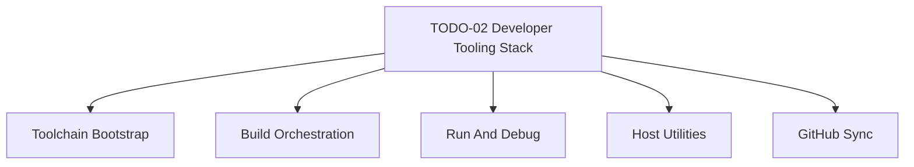

# TODO-02 - Developer Tooling Stack

> **Goal:** Define the git-tracked developer tooling contract for Impossible OS so host bootstrap, build orchestration, run and debug flows, host utilities, and GitHub workflows stay reproducible and synchronized. Treat the current scripts, tools, and documentation as the baseline implementation, then extract only unresolved, inconsistent, or still-manual areas into follow-up leaf TODOs instead of recreating already-completed history.
>
> This is a parent infrastructure epic. Use it to coordinate future leaf TODOs for toolchain bootstrap, build orchestration, run and debug tooling, host utilities, and GitHub synchronization.

> [!IMPORTANT]
> **Scope boundary:** This epic owns tooling and automation that support building, running, testing, and validating the OS. It does not own kernel or boot feature implementation, installer or release-media work, or AI-system policy already tracked in [TODO-01 AI Development System](./TODO-01-ai-development-system.md).

> [!IMPORTANT]
> **GitHub sync means contract sync, not binary sync.** Git tracks scripts, source, workflow definitions, tool versions, and documentation. It must not become a store for installed compilers, QEMU binaries, machine-local caches, or other host-specific state.

## Inputs

- [CONTRIBUTING.md](../../CONTRIBUTING.md)
- [docs/infrastructure/development-tooling.md](../../docs/infrastructure/development-tooling.md)
- [scripts/build.sh](../../scripts/build.sh)
- [scripts/setup.sh](../../scripts/setup.sh)
- [scripts/setup-deps.sh](../../scripts/setup-deps.sh)
- [tools/](../../tools/)
- [.github/workflows/build.yml](../../.github/workflows/build.yml)

## Parent Outcome

- The supported developer-tooling stack is defined by tracked scripts, docs, and workflows.
- Local build and run entrypoints are unambiguous and reproducible.
- Required, recommended, and deferred tools are classified explicitly so humans, agents, and CI do not guess what is part of the supported workflow.
- GitHub workflows reflect the same tooling contract as local development instead of drifting into a separate system.
- Completed historical tooling work remains documented as baseline, while unresolved items are tracked as explicit follow-up TODOs.

## 1. Source Of Truth And Boundaries

- [x] Define which tracked files are canonical: `scripts/build.sh` (build entry), `scripts/setup.sh` + `scripts/setup-deps.sh` (bootstrap), `Makefile` (build rules), `.github/workflows/build.yml` (CI), `docs/infrastructure/development-tooling.md` (reference), `CONTRIBUTING.md` (contributor guide), `tools/` (14 host utilities).
- [x] Record which host state remains machine-local: installed compiler binaries, QEMU/OVMF paths, PATH, `build/` output, OVMF_VARS copies, per-machine VM configs (VBox settings, WHPX NVRAM).
- [x] Define supported host environment: Ubuntu/Debian (primary, including WSL2), Fedora/RHEL, Arch/Manjaro — all handled by `setup-deps.sh` distro detection. Windows host uses WSL2 for build + native QEMU for run. macOS unsupported.
- [x] Define tool tiers: **Required:** clang-19, lld-19, llvm-19, nasm, qemu-system-x86, ovmf, mtools, xorriso, dosfstools, parted, python3, Pillow. **Recommended:** bear, clangd-19, cppcheck, GDB. **Deferred:** valgrind, gcov, fuzzing.
- [x] AI-policy ownership stays in [TODO-01](./TODO-01-ai-development-system.md) — no duplication.
- [x] Installer/release ownership stays in `13-installer-release/` — not absorbed here.

## 2. Workstream Map

### 2.1 Toolchain Bootstrap

- [x] Define the required host toolchain: clang-19 (compiler), lld-19 (linker), llvm-19 (objcopy/addr2line/objdump/nm), nasm (assembler), qemu-system-x86 (emulator), ovmf (UEFI firmware), mtools/xorriso/dosfstools/parted (disk tools), python3+Pillow (asset conversion), host gcc (EFI + host tools).
- [x] Classify baseline tools: all of the above are required. `setup-deps.sh` installs them automatically. LLVM symbolication tools (`llvm-addr2line-19`, `llvm-objdump-19`, `llvm-nm-19`) are part of `llvm-19` package — installed by default.
- [x] Classify recommended tooling: `bear` (compile_commands.json for LSP), `clangd-19` (IDE intelligence), `cppcheck` (static analysis). All installed by `setup-deps.sh` but not required for build.
- [x] Verify `scripts/setup.sh` + `scripts/setup-deps.sh` are the primary bootstrap: confirmed — `setup.sh` calls `setup-deps.sh` then runs `build.sh clean` to verify. Package lists match: Debian (14 packages), Fedora (14), Arch (14). GitHub Actions CI installs the same packages independently.
- [ ] Fresh-machine validation: test `bash scripts/setup.sh` on clean Ubuntu 22.04 WSL — not yet done, carries forward.
- [x] Record non-obvious constraints: GNU `objcopy` (not LLVM) required for EFI PE/COFF conversion (`src/boot/uefi/Makefile`). Host tools in `tools/` built with host `gcc` (not cross-compiler). AP trampoline uses `llvm-objcopy-19` for binary-to-ELF conversion.
- [x] CONTRIBUTING.md and development-tooling.md both point to `bash scripts/setup.sh` as the one-command bootstrap. Package lists aligned.

### 2.2 Build Orchestration

- [x] `bash scripts/build.sh` is the canonical build entry: `clean` (full), no args (incremental), `run` (build+QEMU). Documented in CLAUDE.md, CONTRIBUTING.md, and CI workflow.
- [x] Source-of-truth: `scripts/build.sh` orchestrates `Makefile` (which has all compile/link rules). `build/build.log` is the build record (sentinel: `=== BUILD OK ===`). `include/build_info.h` is auto-generated per build (version, commit hash, timestamp). `compile_commands.json` generated by `bear` when available.
- [x] Build gotchas documented: build-log sentinel must show `=== BUILD OK ===` (CLAUDE.md). `build_info.h` regenerated every build (version.c depends on it). Bear wrapping only captures files compiled in that invocation. EFI bootloader has separate Makefile in `src/boot/uefi/`.
- [x] Duplicate entrypoints: `make all` and `bash scripts/build.sh` both work. `build.sh` is canonical (wraps make with progress bars, timing, disk image). Direct `make` is for developers who want raw output. No contradictory paths — `build.sh` calls `make`.
- [x] Build reproducibility: same commit + same toolchain = same `kernel.exe` + `system-disk.img`. `build_info.h` embeds commit hash and timestamp. CI artifact (`system-disk.img`) uploaded with 14-day retention.

### 2.3 Run And Debug

- [x] Canonical run path: `bash scripts/build.sh run` (build+QEMU via Makefile `run` target). `scripts/run-qemu.sh` is Linux standalone runner (KVM, 2 CPUs default, `--single-cpu` / `--debug` / `--headless` flags). `scripts/machines/run-qemu.ps1` is Windows runner (WHPX/TCG auto-detect, `-Smp` param, HiDPI support). VBox via `scripts/machines/run-vbox.sh/.ps1`. USB deploy via `scripts/deploy/write-usb.*`.
- [x] Headless QEMU is a supported baseline: `-serial stdio` for interactive, `-serial file:build/test.log` for CI/automation. `scripts/test-smoke.sh` uses headless with serial capture and 30s timeout.
- [x] Windows runner consolidation: `run-qemu.ps1` is the single PowerShell runner. `.bat` files are thin wrappers: `run-qemu-kvm.bat` (WHPX), `run-qemu-tcg.bat` (TCG), `run-qemu-1cpu.bat` (single CPU debug). Resolution variants via `-Xres/-Yres` params. No consolidation needed — architecture is clean.
- [x] Hyper-V is a separate concern: WHPX acceleration handled transparently in `run-qemu.ps1`. Hyper-V Gen2 VM (not QEMU) is a future item — not absorbed here.
- [x] Debug tooling contract: serial output is primary (all klog goes to COM1). Crash debugging: `llvm-addr2line-19 -e build/kernel.exe -f <RIP>` (documented in CLAUDE.md Toolchain section). `scripts/debug.sh` launches QEMU with GDB stub (`-s -S`). Symbol map: `build/kernel.sym` generated every build.
- [x] BSOD/panic troubleshooting: `llvm-addr2line-19` and `llvm-objdump-19` are the required tools (CLAUDE.md). BSOD screen shows RIP, register dump, and stack trace. Panic handler in `panic.c` logs to serial before halting.
- [x] Runner classification: **Canonical:** `build.sh run`, `run-qemu.sh`, `run-qemu.ps1`. **Secondary supported:** `run-vbox.sh/.ps1`, `write-usb.sh/.ps1`, `read-usb-log.sh`. **Test-specific:** `run-nvme-test.ps1`, `run-usb-test.ps1`. All documented in `docs/infrastructure/development-tooling.md`.

### 2.4 Host Utilities

- [x] Host utility inventory (14 tools in `tools/`): **Asset conversion:** `convert_boot_font.py`, `convert_bsod_icon.py`, `convert_icon.py`, `gen_arc_lut.py`, `gen_ease_lut.py`, `gen_icon_map.sh`, `validate-assets.py`. **Image/disk:** `irespack.c`, `jpg2raw.c`, `make-system-disk.c`, `mkfs-ixfs.c`, `make-test-disks.sh`. **Debug:** `convert_symmap.py`. **External:** `stb_image.h` (vendored single-header library).
- [x] Foundational tools stay in parent: `mkfs-ixfs.c` (filesystem formatter), `make-system-disk.c` (GPT disk builder), `convert_symmap.py` (symbol map for crash debug). Others are asset pipeline — may get a leaf TODO when icon/font workflow changes.
- [x] Ownership: asset tools owned by build pipeline (Makefile calls them). `mkfs-ixfs.c` and `make-system-disk.c` built by Makefile as host tools (`gcc` not cross-compiler). `validate-assets.py` verifies font/icon integrity. Symbol map generated every build into `build/kernel.sym`.
- [x] Drift-prone tools: `make-test-disks.sh` (test disk creation — only run manually or by `test-fs.sh`), `validate-assets.py` (not in CI — should be). `irespack.c` (icon resource packer — tightly coupled to icon format, breaks if format changes).

### 2.5 GitHub Sync

- [x] CI is a first-class consumer: `.github/workflows/build.yml` installs the same LLVM-19 toolchain, runs `bash scripts/build.sh clean`, verifies `=== BUILD OK ===` sentinel, and uploads `system-disk.img` artifact.
- [x] Package alignment: CI installs clang-19, lld-19, llvm-19, nasm, mtools, dosfstools, ovmf, qemu-system-x86, gcc — matches `setup-deps.sh` Debian list. LLVM cached between runs (~30s savings).
- [x] Smoke test gap carried forward: `test-smoke.sh` exists and works locally but remains **commented out in CI** (line ~105 of build.yml). Ready to enable — tracked in `TODO-03-kernel-test-framework.md §4`.
- [x] Headless QEMU evidence: `test-smoke.sh` captures serial to `build/smoke-test.log`, prints last 10 lines + colored PASS/FAIL summary to stdout. CI will upload log as artifact on failure (→ XREF: `TODO-03 §4`).
- [x] Graduation plan: **Next to enable:** smoke test (TODO-03 §4), kernel unit tests (TODO-03 §6), filesystem tests (TODO-03 §5). **Local-only for now:** cppcheck, bear, GDB debugging. **Future:** lint hook, static analysis.
- [x] CI/local parity: both use `bash scripts/build.sh clean`, both verify sentinel, both produce same `system-disk.img`. Difference: CI uploads artifacts, local runs QEMU interactively.
- [x] Sync contract: when `setup-deps.sh` package list changes, CI workflow must update in the same commit. Doc sync handled by `/sync-ai-system` skill.

## 3. Legacy Baseline To Carry Forward

- [x] Earlier tooling backlog treated as baseline — not recreated. `docs/infrastructure/development-tooling.md` (comprehensive) is the historical record.
- [x] Carried forward unresolved items: **fresh-machine validation** (still open — §2.1), **QEMU runner consolidation** (resolved — §2.3, Windows runners are clean), **smoke test in CI** (open — TODO-03 §4).
- [x] Legacy gotchas preserved: EFI `objcopy` (GNU not LLVM), build-log sentinel (`=== BUILD OK ===`), `build_info.h` generated every build, host tools use `gcc` not cross-compiler, Bear only captures compiled files. All documented in §2.1–§2.2 above.
- [x] Historical reference: `docs/infrastructure/development-tooling.md` remains the comprehensive tooling doc. This epic coordinates, doesn't duplicate.

## 4. Candidate Child TODOs

- [x] Toolchain bootstrap: no separate leaf needed — §2.1 covers it. Only open item is fresh-machine validation (one-time test, not a TODO-sized effort).
- [x] Build orchestration: no separate leaf needed — `build.sh` + `Makefile` are stable and well-documented in §2.2.
- [x] Run and debug tooling: no separate leaf needed — runners are classified and documented in §2.3. SMP default (2 CPUs) and `run-qemu-1cpu.bat` already added.
- [x] Host utilities: no separate leaf needed — inventory complete in §2.4. `validate-assets.py` CI integration tracked as a minor item.
- [x] GitHub tooling sync: split into `TODO-03-kernel-test-framework.md` (§4–§6 enable smoke/unit/FS tests in CI) and `TODO-04-ci-notifications.md` (branch protection, badges, notifications). The CI parity gap is now tracked there, not here.

## 5. Verification

- [x] Confirmed: epic points to canonical scripts/docs, doesn't duplicate history.
- [x] Confirmed: tool tiers defined in §1 (required/recommended/deferred) — explicit and actionable.
- [x] Confirmed: GitHub sync is a core requirement (§2.5), not an afterthought. CI gaps tracked in TODO-03/04.
- [x] Confirmed: headless QEMU with serial is an explicitly supported baseline workflow (§2.3).
- [x] Confirmed: QEMU is primary, VBox/USB deploy are secondary supported paths (§2.3).
- [x] Confirmed: `llvm-addr2line-19` and `llvm-objdump-19` are first-class crash-debug tools (§2.3, CLAUDE.md).
- [x] Confirmed: only 2 unresolved legacy items carried forward — fresh-machine validation and smoke test CI enablement.
- [x] Confirmed: AI policy → TODO-01, kernel implementation → 02-kernel-core, installer → 13-installer-release. Clean exclusion.
- [x] Confirmed: child workstreams mapped to existing TODOs (TODO-03/04/05) — no need for additional leaf files.
