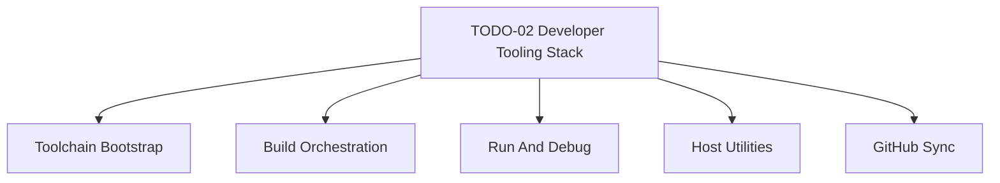

# TODO-02 - Developer Tooling Stack

> **Goal:** Define the git-tracked developer tooling contract for Impossible OS so host bootstrap, build orchestration, run and debug flows, host utilities, and GitHub workflows stay reproducible and synchronized. Treat the current scripts, tools, and documentation as the baseline implementation, then extract only unresolved, inconsistent, or still-manual areas into follow-up leaf TODOs instead of recreating already-completed history.
>
> This is a parent infrastructure epic. Use it to coordinate future leaf TODOs for toolchain bootstrap, build orchestration, run and debug tooling, host utilities, and GitHub synchronization.

> [!IMPORTANT]
> **Scope boundary:** This epic owns tooling and automation that support building, running, testing, and validating the OS. It does not own kernel or boot feature implementation, installer or release-media work, or AI-system policy already tracked in [TODO-01 AI Development System](./TODO-01-ai-development-system.md).

> [!IMPORTANT]
> **GitHub sync means contract sync, not binary sync.** Git tracks scripts, source, workflow definitions, tool versions, and documentation. It must not become a store for installed compilers, QEMU binaries, machine-local caches, or other host-specific state.

## Inputs

- [CONTRIBUTING.md](../../CONTRIBUTING.md)
- [docs/infrastructure/development-tooling.md](../../docs/infrastructure/development-tooling.md)
- [scripts/build.sh](../../scripts/build.sh)
- [scripts/setup.sh](../../scripts/setup.sh)
- [scripts/setup-deps.sh](../../scripts/setup-deps.sh)
- [tools/](../../tools/)
- [.github/workflows/build.yml](../../.github/workflows/build.yml)

## Parent Outcome

- The supported developer-tooling stack is defined by tracked scripts, docs, and workflows.
- Local build and run entrypoints are unambiguous and reproducible.
- Required, recommended, and deferred tools are classified explicitly so humans, agents, and CI do not guess what is part of the supported workflow.
- GitHub workflows reflect the same tooling contract as local development instead of drifting into a separate system.
- Completed historical tooling work remains documented as baseline, while unresolved items are tracked as explicit follow-up TODOs.

## 1. Source Of Truth And Boundaries

- [ ] Define which tracked files are canonical for the developer-tooling stack, including `scripts/build.sh`, setup scripts, relevant docs, host-tool sources, and GitHub workflows.
- [ ] Record which host state remains machine-local and must not be treated as canonical, such as installed binaries, PATH tweaks, local caches, and per-machine emulator configuration.
- [ ] Define the supported host environment contract for contributors, including expected Linux and WSL bootstrap paths and any explicitly unsupported host assumptions.
- [ ] Define tool tiers for the stack: required baseline tools, recommended tools that improve debugging or development, and deferred or optional tools that are not yet part of the supported contract.
- [ ] Keep AI-policy and agent-behavior ownership in [TODO-01 AI Development System](./TODO-01-ai-development-system.md) instead of duplicating that surface here.
- [ ] Keep installer, release-media, and deployment-distribution ownership out of this epic except where local tooling must hand off cleanly to those later workflows.

## 2. Workstream Map

### 2.1 Toolchain Bootstrap

- [ ] Define the required host toolchain and bootstrap contract for compilers, linkers, assemblers, image tools, QEMU, OVMF, and supporting packages.
- [ ] Classify the current baseline tools that must be available for the supported workflow, including `clang-19`, `lld-19`, `llvm-19`, `nasm`, `qemu-system-x86`, `ovmf`, host `gcc`, and the LLVM symbolication tools such as `llvm-addr2line-19`, `llvm-objdump-19`, and `llvm-nm-19`.
- [ ] Classify recommended-but-not-always-required tooling, such as `bear`, `clangd-19`, `cppcheck`, GDB integration, smoke testing, and other diagnostics or validation helpers that should be visible to contributors and agents even when not yet enforced everywhere.
- [ ] Verify that `scripts/setup.sh` and `scripts/setup-deps.sh` remain the primary bootstrap path and that their documented package set matches current project reality.
- [ ] Carry forward the unresolved fresh-machine validation item from the earlier tooling backlog by testing the one-command setup path on a clean Ubuntu 22.04 WSL environment or an equivalent current baseline.
- [ ] Record non-obvious toolchain constraints that must stay visible, such as GNU `objcopy` being required for EFI binaries and host tools remaining built with host `gcc`.
- [ ] Ensure `CONTRIBUTING.md` and `docs/infrastructure/development-tooling.md` describe the same bootstrap contract.

### 2.2 Build Orchestration

- [ ] Keep `bash scripts/build.sh` as the canonical local build entrypoint unless a replacement is explicitly approved.
- [ ] Define the source-of-truth relationship between `scripts/build.sh`, `Makefile`, `build/build.log`, generated metadata, and `compile_commands.json`.
- [ ] Carry forward the highest-value build gotchas from the legacy tooling baseline, including build-log sentinel verification, generated-header ordering, Bear wrapping limits, and `include/build_info.h` update behavior.
- [ ] Identify any duplicate, legacy, or contradictory build entrypoints that should be retired, absorbed, or explicitly documented as secondary paths.
- [ ] Define what build reproducibility means for this repo, including artifact expectations and what another contributor or CI run must be able to reproduce.

### 2.3 Run And Debug

- [ ] Define the canonical run path for local validation, with QEMU kept as the primary supported path, especially how `bash scripts/build.sh run`, `scripts/run-qemu.sh`, `scripts/vm/run-vbox.*`, and the real-hardware helpers in `scripts/deploy/` relate.
- [ ] Record that headless QEMU is a supported baseline workflow, with serial output treated as the primary debug channel: prefer `-serial stdio` for interactive or agent-driven debugging, and use serial-log files only when automation needs stable capture.
- [ ] Carry forward the unresolved multi-resolution QEMU launcher consolidation item from the earlier tooling backlog and decide whether the current Windows runner scripts should be consolidated or retired.
- [ ] Treat Hyper-V support as a related but separate concern and cross-reference any future dedicated Hyper-V runner work instead of absorbing it here.
- [ ] Define the debug tooling contract for terminal-visible serial output, serial-log files, debug scripts, and any runner-specific expectations that must stay in sync with the local and CI flow.
- [ ] Record that BSOD, panic, and RIP-based crash troubleshooting must use symbolication and disassembly tools when symbols are available, especially `llvm-addr2line-19 -e build/kernel.exe -f <RIP>` and `llvm-objdump-19`, rather than relying on raw-address speculation alone.
- [ ] Ensure runner and deployment scripts are clearly classified as canonical, secondary, or legacy so contributors do not guess which path is supported; `scripts/vm/run-vbox.*`, `scripts/deploy/write-usb.*`, and `scripts/deploy/read-usb-log.sh` should be documented as secondary supported paths rather than left implicit.

### 2.4 Host Utilities

- [ ] Inventory the host-side utilities in `tools/` and the supporting validation or conversion scripts that the build, asset, or test pipeline depends on.
- [ ] Define which host tools are foundational enough to stay documented in the parent epic versus which should later get dedicated leaf TODOs.
- [ ] Record ownership and verification expectations for asset validation, disk helpers, symbol-map generation, size reporting, and related host-side utilities.
- [ ] Identify any host utilities or support scripts that are drift-prone because they are used indirectly by the build but not treated as first-class tooling.

### 2.5 GitHub Sync

- [ ] Treat `.github/workflows/build.yml` as a first-class consumer of the same tooling contract as local development instead of a separate CI-only system.
- [ ] Align GitHub workflow package installation, build commands, artifact checks, and sentinel verification with the current local tooling contract.
- [ ] Carry forward the unresolved smoke-test integration gap from the current workflow, where QEMU smoke test wiring remains commented until it is ready for reliable use.
- [ ] Define how headless QEMU evidence should surface in automation: when serial is captured to a file for stability, the workflow or script must still emit enough terminal-visible summary to make failures actionable without manual digging.
- [ ] Decide which recommended tools or checks should graduate into GitHub workflows over time, such as smoke test coverage, lint, static analysis, or other supported validation steps, and which remain intentionally local-only for now.
- [ ] Define which local tooling guarantees must be mirrored in GitHub workflows and which checks remain intentionally local-only for now.
- [ ] Ensure tooling docs and GitHub workflow behavior stay in sync whenever scripts, dependencies, or validation expectations change.

## 3. Legacy Baseline To Carry Forward

- [ ] Treat the earlier developer-tooling backlog and current infrastructure docs as historical baseline, not as a checklist to recreate line by line.
- [ ] Carry forward only still-useful unresolved items, especially fresh-machine setup validation, QEMU runner consolidation, and related cleanup work that was never finished.
- [ ] Preserve the legacy gotchas that still matter operationally, such as EFI `objcopy`, build-log sentinels, generated-header races, host-tool compiler choice, and Bear limitations.
- [ ] Cross-reference historical tooling work back to [docs/infrastructure/development-tooling.md](../../docs/infrastructure/development-tooling.md) rather than duplicating completed implementation detail in this new parent epic.

## 4. Candidate Child TODOs

- [ ] Split a `build-toolchain-bootstrap` leaf TODO when the bootstrap contract, supported hosts, or package validation work becomes large enough to execute independently.
- [ ] Split a `build-orchestration` leaf TODO when `scripts/build.sh`, `Makefile`, generated metadata, or artifact reproducibility require focused changes.
- [ ] Split a `run-and-debug-tooling` leaf TODO when QEMU, VM runners, serial-log capture, or runner cleanup need dedicated implementation work.
- [ ] Split a `host-utilities-and-validation` leaf TODO when `tools/` and the supporting asset or test utilities need focused inventory or hardening.
- [ ] Split a `github-tooling-sync` leaf TODO when CI parity, smoke-test rollout, artifact policy, or workflow drift becomes the main outstanding problem.

## 5. Verification

- [ ] Confirm this parent epic points to existing canonical scripts and docs instead of duplicating already-completed tooling history.
- [ ] Confirm the parent epic makes the required, recommended, and deferred tool tiers explicit enough that contributors and agents know what is available.
- [ ] Confirm GitHub synchronization is treated as a core requirement of the tooling contract rather than a later afterthought.
- [ ] Confirm headless QEMU with serial output is explicitly recognized as a supported baseline workflow for local and automated debugging.
- [ ] Confirm QEMU remains the primary supported run and debug path while VirtualBox and real-hardware USB deploy or log-retrieval workflows are explicitly documented as secondary supported paths.
- [ ] Confirm debug-symbolication tools such as `llvm-addr2line-19` and `llvm-objdump-19` are explicitly recognized as first-class parts of the supported crash-debugging workflow.
- [ ] Confirm unresolved legacy items are carried forward only when they are still useful and actionable.
- [ ] Confirm the epic cleanly excludes AI policy, kernel implementation, and installer or release work.
- [ ] Confirm the child workstream map is clear enough to split into future leaf TODOs without renumbering the infrastructure backlog or rewriting the parent scope.
