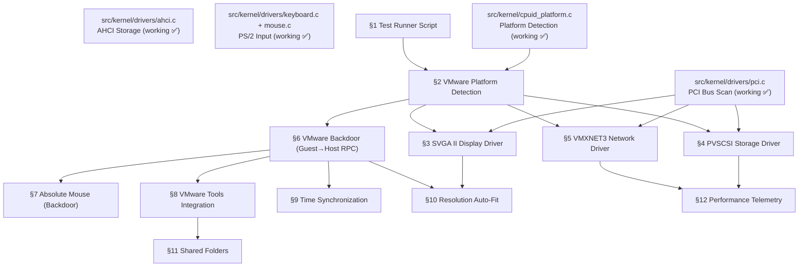

# VMware Workstation Pro Boot & Driver Support

> **Goal:** Enable Impossible OS to boot, test, and run fully optimized on VMware
> Workstation Pro — from a one-click test runner to paravirtual drivers (SVGA II,
> PVSCSI, VMXNET3) and VMware Tools integration. Unlike Hyper-V Gen 2, VMware
> preserves all legacy hardware (PIC, PIT, PS/2, IDE, VGA) so existing drivers work
> out of the box. The focus here is on the **test runner**, **paravirtual driver
> upgrades** for massive performance wins, and **VMware Tools guest additions** for
> seamless host integration (clipboard, drag & drop, time sync, resolution auto-fit).

> [!CAUTION]
> **Memory Rule:** Use `pmm_alloc_contiguous()` for ALL buffers > 4 KB (fonts, images, DMA buffers). `kmalloc` is ONLY for small kernel structs (≤ 4 KB). Violating this crashes the 2 MiB heap silently. See `rules.md` Known Gotchas and `/add-asset` workflow.

> [!IMPORTANT]
> **VMware vs Hyper-V:** VMware Workstation emulates standard PC hardware (i440FX/PIIX or
> Q35 chipset, E1000e NIC, BusLogic/LSI Logic SCSI, SVGA II GPU, PS/2 input, 8259 PIC,
> LAPIC/IOAPIC). Impossible OS already boots on VMware via the existing AHCI + PS/2 +
> VGA path. This TODO is about **optimization** — replacing emulated drivers with
> paravirtual ones for 2–10× better performance, and adding VMware Tools for host
> integration.

---

## Architecture Overview

VMware Workstation Pro provides both emulated legacy hardware and high-performance
paravirtual devices. The OS boots with legacy drivers, then optionally upgrades to
paravirtual drivers for better performance:

| Emulated (Legacy) Hardware  | Paravirtual Upgrade             | Performance Improvement                           |
| --------------------------- | ------------------------------- | ------------------------------------------------- |
| BusLogic / LSI Logic SCSI   | PVSCSI (Paravirtual SCSI)       | 30–40% lower CPU, 2× IOPS                         |
| E1000e / E1000 NIC          | VMXNET3 (Paravirtual NIC)       | 10 Gbps, TSO/LRO, multi-queue, RSS               |
| VGA / SVGA II (basic mode)  | SVGA II (FIFO + 2D accel)       | Hardware cursor, fast blits, mode switching       |
| PS/2 mouse (relative)       | VMware Backdoor (absolute)      | Absolute cursor — no mouse grab                   |
| PIT / LAPIC timer           | VMware TSC + precision timer    | No calibration drift                              |

### Boot Sequence on VMware Workstation Pro

```
VMware UEFI Firmware (OVMF-based)
  └── BOOTX64.EFI (our bootloader)
        ├── GOP framebuffer → boot splash ✅
        ├── ExitBootServices()
        └── kernel_main()
              ├── PIC + LAPIC + IOAPIC init (legacy — works as-is) ✅
              ├── PS/2 keyboard + mouse (legacy — works as-is) ✅
              ├── AHCI storage → mount IXFS/FAT32 (legacy — works as-is) ✅
              ├── VMware detection via CPUID / backdoor ← §2
              ├── SVGA II driver (PCI 0x15AD:0x0405) ← §3
              ├── PVSCSI driver (PCI 0x15AD:0x0720) ← §4
              ├── VMXNET3 driver (PCI 0x15AD:0x07B0) ← §5
              ├── VMware Tools (backdoor RPCI) ← §6–§9
              └── Desktop ready (optimized)
```

---

## TODO Completion Roadmap

> [!IMPORTANT]
> **This file covers VMware Workstation Pro boot and driver support.** Unlike Hyper-V
> Gen 2 (which requires synthetic drivers to function at all), VMware boots with
> legacy hardware. Sections here **upgrade** from legacy to paravirtual for performance,
> then add VMware Tools for host integration. External dependencies: AHCI driver
> (already working), PCI subsystem (`pci.c`), and the Guest Additions framework
> (`TODO-064-Guest-Additions.md`).

### Dependency Graph



### Phase-by-Phase Implementation Order

| ⭐ | Phase  | Sections                              | Depends On                     | Status |
| -- | :----: | ------------------------------------- | ------------------------------ | :----: |
| 💎 | **0**  | Prerequisites (AHCI, PCI, PS/2, VGA) | —                              |   ✅   |
| 💎 | **1**  | §1 Test Runner Script                 | —                              |   ⬜   |
| 💎 | **1**  | §2 VMware Platform Detection          | `cpuid_platform.c`             |   ⬜   |
| 💎 | **2**  | §3 SVGA II Display Driver             | Phase 1 (§2) + PCI             |   ⬜   |
| 💎 | **2**  | §6 VMware Backdoor (RPCI)             | Phase 1 (§2)                   |   ⬜   |
| 💎 | **3**  | §4 PVSCSI Storage Driver              | Phase 1 (§2) + PCI             |   ⬜   |
| 💎 | **3**  | §7 Absolute Mouse (Backdoor)          | Phase 2 (§6)                   |   ⬜   |
| 💎 | **4**  | §5 VMXNET3 Network Driver             | Phase 1 (§2) + PCI             |   ⬜   |
| 💎 | **4**  | §8 VMware Tools Integration           | Phase 2 (§6)                   |   ⬜   |
| 💎 | **5**  | §9 Time Synchronization               | Phase 2 (§6)                   |   ⬜   |
| 💎 | **5**  | §10 Resolution Auto-Fit               | Phase 2 (§3 + §6)              |   ⬜   |
| ⭐ | **6**  | §11 Shared Folders (HGFS)             | Phase 4 (§8)                   |   ⬜   |
| ⭐ | **7**  | §12 Performance Telemetry             | Phase 3–4 (§4 + §5)            |   ⬜   |

> [!NOTE]
> **Phase 0** is already complete — Impossible OS boots on VMware using legacy AHCI,
> PS/2, and VGA. The existing boot path works unmodified.
>
> **Phase 1** creates the test runner and VMware detection — foundation for everything.
>
> **Phase 2** delivers the two most impactful upgrades: SVGA II (proper display driver
> with hardware cursor and fast blits) and the backdoor channel (required for all
> VMware Tools features).
>
> **Phase 3** adds PVSCSI (2× disk IOPS) and absolute mouse (seamless cursor).
>
> **Phase 4** adds VMXNET3 (10 Gbps paravirtual NIC) and VMware Tools framework.
>
> **Phase 5** adds polish: time sync and resolution auto-fit.
>
> **Phases 6–7** are exclusive features: shared folders and I/O telemetry.

> [!TIP]
> **VMware .vmx settings for testing:** The test runner script should configure
> `firmware = "efi"`, `guestOS = "other-64"`, and serial port output to file.
>
> **SVGA II FIFO is memory-mapped.** The FIFO region from BAR2 must be mapped as
> write-combining (WC) for best performance. Write-back will work but is slower.
>
> **Backdoor port 0x5658 is trapped by VMware** — the `in` instruction with magic
> value `0x564D5868` in EAX triggers a hypercall, NOT a real I/O port read.
>
> **Memory rule:** PVSCSI and VMXNET3 DMA rings must use `pmm_alloc_contiguous()`.
> The SVGA II FIFO is already a PCI BAR — no allocation needed.

---

## 1. Test Runner Script

**Prompt:** Create `scripts/vm/run-vmware.ps1` (PowerShell) and `scripts/vm/run-vmware.bat` (wrapper) to automate VMware Workstation Pro VM creation and testing. The script should: create a VMware VM (`.vmx` file) if it doesn't exist, convert `build/system-disk.img` to VMDK format, configure UEFI firmware with Secure Boot disabled, 512 MB RAM, 1 vCPU, serial port output to file, and start the VM. The user already has VMware Workstation Pro installed on Windows. Follow the same pattern as `run-hyperv.ps1`. After completing all items, mark every item as `[x]`, update this prompt to a verification prompt, run `bash scripts/build.sh clean`, and commit as `"tools: VMware Workstation Pro test runner"`. Add notes directly in this TODO section. After implementation, save any gotchas, solutions, and important information to MCP memory.

- [ ] Create `scripts/vm/run-vmware.ps1`
  - [ ] Convert `build/system-disk.img` to VMDK using `qemu-img convert -O vmdk`
  - [ ] Generate `.vmx` config file with UEFI firmware (`firmware = "efi"`)
  - [ ] Set `guestOS = "other-64"` (custom 64-bit OS)
  - [ ] Configure: 512 MB RAM, 1 vCPU, SATA hard disk (VMDK)
  - [ ] Disable Secure Boot if applicable
  - [ ] Add serial port: `serial0.fileType = "file"`, output to `build/vmware-serial.log`
  - [ ] Add virtual CD/DVD (empty — for future ISO boot testing)
  - [ ] Handle existing VM: if running → stop, if exists → update VMDK + settings
  - [ ] Start VM via `vmrun start` or direct `vmware.exe` launch
- [ ] Create `scripts/vm/run-vmware.bat` — one-click batch wrapper
- [ ] Test: build OS → run script → verify boot in VMware
- [ ] Commit: `"tools: VMware Workstation Pro test runner"`

---

## 2. VMware Platform Detection

> **XREF:** [TODO-064-Guest-Additions.md](../060-Hardware-Drivers/TODO-064-Guest-Additions.md) — Guest Additions Framework

**Prompt:** Extend `cpuid_platform.c` to detect VMware Workstation/ESXi. VMware identifies itself via CPUID leaf `0x40000000` with signature `"VMwareVMware"`. Upon detection, set `PLATFORM_VMWARE` flag. Also verify the VMware backdoor port (`in` on port `0x5658` with magic `0x564D5868` in EAX) to confirm we are genuinely running on VMware (not a spoofed CPUID). Log the VMware version string from CPUID leaf `0x40000010`. After completing all items, mark every item as `[x]`, update this prompt to a verification prompt, run `bash scripts/build.sh clean`, and commit as `"kernel: VMware platform detection"`. Add notes directly in this TODO section.

- [ ] Add `PLATFORM_VMWARE` enum value to `cpuid_platform.h`
- [ ] Detect CPUID leaf `0x40000000` → signature `"VMwareVMware"`
- [ ] Read CPUID leaf `0x40000010` for TSC frequency and APIC frequency
- [ ] Verify backdoor port `0x5658`: magic `0x564D5868`, cmd `0x0A` (GET_VERSION)
  - [ ] If EBX returns `0x564D5868` ("VMXh") → confirmed VMware
- [ ] Log: `"[OK] Hypervisor: VMware (version X.Y)"`
- [ ] Expose `platform_is_vmware()` utility function
- [ ] Test: boot in QEMU (not detected) AND VMware (detected)
- [ ] Commit: `"kernel: VMware platform detection"`

---

## 3. SVGA II Display Driver

> **XREF:** [OSDev Wiki: VMWare SVGA-II](https://wiki.osdev.org/VMware_SVGA-II) — Register programming reference

**Prompt:** Implement a VMware SVGA II display driver. The SVGA II device is a PCI device (vendor `0x15AD`, device `0x0405`) that provides a high-performance framebuffer with FIFO command interface for 2D acceleration and hardware cursor support. The driver should: detect the device on the PCI bus, initialize registers (negotiate SVGA ID `0x90000002`), configure the framebuffer for the desired resolution, set up the FIFO command ring, implement `SVGA_CMD_UPDATE` for dirty-rect rendering, and support hardware cursor via `SVGA_CMD_DEFINE_ALPHA_CURSOR`. Wire into the existing `fb_init()` / `fb_swap()` compositor pipeline. After completing all items, mark every item as `[x]`, update this prompt to a verification prompt, run `bash scripts/build.sh clean`, and commit as `"drivers: VMware SVGA II display driver"`. Add notes directly in this TODO section.

- [ ] Create `src/kernel/drivers/vmware/svga.c` and `include/kernel/drivers/vmware/svga.h`
- [ ] PCI scan for vendor `0x15AD`, device `0x0405`
- [ ] Read BARs: BAR0 = I/O port base, BAR1 = framebuffer address, BAR2 = FIFO address
- [ ] Negotiate SVGA ID: write `0x90000002` to `SVGA_REG_ID`, read back to confirm
- [ ] Set resolution: write `SVGA_REG_WIDTH`, `SVGA_REG_HEIGHT`, `SVGA_REG_BPP` (32)
- [ ] Read `SVGA_REG_FB_START` and `SVGA_REG_FB_SIZE` for framebuffer mapping
- [ ] Enable SVGA mode: write `1` to `SVGA_REG_ENABLE`
- [ ] Initialize FIFO: set MIN/MAX/NEXT_CMD/STOP, write `1` to `SVGA_REG_CONFIG_DONE`
- [ ] Implement `svga_update_rect(x, y, w, h)` — FIFO `SVGA_CMD_UPDATE` (cmd 1)
- [ ] Implement `svga_rect_copy(src_x, src_y, dst_x, dst_y, w, h)` — FIFO cmd 3
- [ ] Implement hardware cursor: `SVGA_CMD_DEFINE_ALPHA_CURSOR` (cmd 22)
  - [ ] Set cursor position via `SVGA_REG_CURSOR_X`, `_Y`, `_ON`
- [ ] Wire into compositor: replace `fb_swap()` full-buffer copy with dirty-rect updates
- [ ] Fallback: if SVGA II not found, use existing VGA/GOP framebuffer
- [ ] Test: boot in VMware → verify resolution + hardware cursor
- [ ] Commit: `"drivers: VMware SVGA II display driver"`

---

## 4. PVSCSI Storage Driver

**Prompt:** Implement a VMware Paravirtual SCSI (PVSCSI) adapter driver. PVSCSI is a PCI device (vendor `0x15AD`, device `0x0720`) that provides high-performance virtual SCSI storage with DMA ring buffers, achieving 30–40% lower CPU usage and 2× IOPS compared to emulated LSI Logic. The driver should: detect the device, initialize request/completion rings (PMM-allocated), submit SCSI READ(16)/WRITE(16) commands, and register as a block device. The VM must be configured with `scsi0.virtualDev = "pvscsi"` in the `.vmx` file. After completing all items, mark every item as `[x]`, update this prompt to a verification prompt, run `bash scripts/build.sh clean`, and commit as `"drivers: VMware PVSCSI storage driver"`. Add notes directly in this TODO section.

> [!CAUTION]
> **DMA buffers:** PVSCSI request and completion rings, plus the data transfer buffers, must ALL use `pmm_alloc_contiguous()`. The device does bus-mastering DMA directly to these physical addresses.

- [ ] Create `src/kernel/drivers/vmware/pvscsi.c` and `include/kernel/drivers/vmware/pvscsi.h`
- [ ] PCI scan for vendor `0x15AD`, device `0x0720`
- [ ] Enable PCI bus mastering (command register bit 2)
- [ ] Map PVSCSI registers from BAR0 (MMIO)
- [ ] Initialize request ring: `pmm_alloc_contiguous()` for ring pages
- [ ] Initialize completion ring: `pmm_alloc_contiguous()` for ring pages
- [ ] Allocate 64 KiB DMA transfer buffer via `pmm_alloc_contiguous(16)`
- [ ] Submit SCSI INQUIRY → identify disk (vendor, product, serial)
- [ ] Submit SCSI READ_CAPACITY(16) → get disk size + sector size
- [ ] Implement `pvscsi_blk_read(lba, count, buf)` via SCSI READ(16)
- [ ] Implement `pvscsi_blk_write(lba, count, buf)` via SCSI WRITE(16)
- [ ] Register as block device (`blkdev_register` → `"vmware0"`)
- [ ] Handle completion interrupts (MSI or INTx)
- [ ] Update test runner `.vmx`: `scsi0.virtualDev = "pvscsi"`
- [ ] Test: boot in VMware with PVSCSI → verify IXFS/FAT32 mount + read/write
- [ ] Commit: `"drivers: VMware PVSCSI storage driver"`

---

## 5. VMXNET3 Network Driver

**Prompt:** Implement a VMware VMXNET3 paravirtual network driver. VMXNET3 is a PCI device (vendor `0x15AD`, device `0x07B0`) supporting 10 Gbps networking with multi-queue, RSS, TSO, LRO, and checksum offload. The driver should: detect the device, initialize TX/RX descriptor rings (PMM-allocated), configure MAC address, send/receive Ethernet frames, and register with the Ethernet layer. The VM must be configured with `ethernet0.virtualDev = "vmxnet3"`. After completing all items, mark every item as `[x]`, update this prompt to a verification prompt, run `bash scripts/build.sh clean`, and commit as `"drivers: VMware VMXNET3 network driver"`. Add notes directly in this TODO section.

> [!CAUTION]
> **DMA buffers:** VMXNET3 TX/RX descriptor rings and data buffers require physically contiguous memory via `pmm_alloc_contiguous()`.

- [ ] Create `src/kernel/drivers/vmware/vmxnet3.c` and `include/kernel/drivers/vmware/vmxnet3.h`
- [ ] PCI scan for vendor `0x15AD`, device `0x07B0`
- [ ] Enable PCI bus mastering
- [ ] Map control registers from BAR0 (PT) and BAR1 (VD)
- [ ] Activate device: write `VMXNET3_CMD_ACTIVATE_DEV` to command register
- [ ] Initialize TX descriptor ring (128 entries, PMM-allocated)
- [ ] Initialize RX descriptor ring (256 entries, PMM-allocated)
- [ ] Read MAC address from device registers
- [ ] Implement `vmxnet3_send(packet, len)` — populate TX descriptor + doorbell
- [ ] Implement RX interrupt handler → extract Ethernet frame → `ethernet_receive()`
- [ ] Register with Ethernet layer as NIC (like RTL8139 / VirtIO-net)
- [ ] Configure MSI-X interrupt for TX/RX completion
- [ ] Update test runner `.vmx`: `ethernet0.virtualDev = "vmxnet3"`
- [ ] Test: DHCP + ping over VMXNET3 in VMware
- [ ] Commit: `"drivers: VMware VMXNET3 network driver"`

---

## 6. VMware Backdoor Interface (Guest→Host RPC)

**Prompt:** Implement the VMware backdoor interface for guest→host communication. The backdoor uses I/O port `0x5658` (low-bandwidth) and `0x5659` (high-bandwidth) with magic value `0x564D5868` in EAX. The RPCI (Remote Procedure Call Interface) protocol layered on top enables string-based commands like `"tools.set.version"`, `"machine.id.get"`, and `"info-set guestinfo.ip"`. This is the foundation for all VMware Tools features (clipboard, drag & drop, time sync, resolution). After completing all items, mark every item as `[x]`, update this prompt to a verification prompt, run `bash scripts/build.sh clean`, and commit as `"drivers: VMware backdoor interface"`. Add notes directly in this TODO section.

> [!IMPORTANT]
> **The backdoor `in` instruction triggers a VM-exit, NOT a real I/O port read.** VMware
> intercepts it and processes the command inside the VMM. This works only on VMware — on
> bare metal or other hypervisors, it will read garbage or fault.

- [ ] Create `src/kernel/drivers/vmware/backdoor.c` and `include/kernel/drivers/vmware/backdoor.h`
- [ ] Implement low-bandwidth backdoor: `vmware_backdoor_cmd(cmd, param)` via port `0x5658`
  - [ ] EAX = `0x564D5868` (magic), ECX[15:0] = command number, EBX = parameter
  - [ ] Execute `in eax, dx` — result in EAX/EBX/ECX/EDX
- [ ] Implement high-bandwidth backdoor: port `0x5659` using `rep insb`/`rep outsb`
- [ ] Implement RPCI message protocol:
  - [ ] `vmware_rpci_open()` — open RPCI channel (cmd `0x1E`, subcmd OPEN)
  - [ ] `vmware_rpci_send(msg, len)` — send message data
  - [ ] `vmware_rpci_recv(buf, max_len)` — receive reply
  - [ ] `vmware_rpci_close()` — close channel
- [ ] Test: send `"machine.id.get"` via RPCI → verify response
- [ ] Expose: `vmware_rpci_command(cmd_str, reply_buf, reply_len)` convenience API
- [ ] Commit: `"drivers: VMware backdoor interface"`

---

## 7. Absolute Mouse via Backdoor

> **XREF:** [OSDev Wiki: VMware tools](https://wiki.osdev.org/VMware_tools) — Absolute mouse section

**Prompt:** Implement absolute mouse positioning via the VMware backdoor. When enabled, the guest receives absolute screen coordinates instead of PS/2 relative deltas, eliminating the need for mouse grab/release. The protocol: write `0x45414552` to backdoor cmd `0x27` (ABSPOINTER_COMMAND) with subcmd `0x41424420` (ABSPOINTER_DATA_ENABLE), then poll cmd `0x27` for absolute X, Y, buttons, and scroll data. Feed positions into `mouse_inject_state()`. After completing all items, mark every item as `[x]`, update this prompt to a verification prompt, run `bash scripts/build.sh clean`, and commit as `"drivers: VMware absolute mouse"`. Add notes directly in this TODO section.

- [ ] Add VMware absolute pointer commands to `backdoor.h`
  - [ ] `ABSPOINTER_ENABLE` (subcmd `0x45414552`)
  - [ ] `ABSPOINTER_RELATIVE` / `ABSPOINTER_ABSOLUTE`
  - [ ] `ABSPOINTER_DATA` — read absolute position + buttons
- [ ] Enable absolute positioning: backdoor cmd `0x27` with ABSPOINTER_ENABLE
- [ ] Set absolute mode: backdoor cmd `0x27` with status `0x53424152`
- [ ] Poll loop: read absolute X, Y, button state from backdoor
  - [ ] Scale coordinates: VMware reports in `0–0xFFFF` range → scale to screen pixels
  - [ ] Feed into `mouse_inject_state(x, y, buttons)`
- [ ] Integrate with compositor: call `vmware_mouse_poll()` alongside existing mouse poll
- [ ] Fallback: if not on VMware, continue using PS/2 relative mouse
- [ ] Test: boot in VMware → verify seamless mouse (no grab)
- [ ] Commit: `"drivers: VMware absolute mouse"`

---

## 8. VMware Tools Integration

> **XREF:** [TODO-064-Guest-Additions.md](../060-Hardware-Drivers/TODO-064-Guest-Additions.md) — Guest Additions Framework

**Prompt:** Implement VMware Tools integration using the RPCI backdoor. VMware Tools communicates the guest's capabilities and state to the VMware host via RPCI messages. Core features: report guest OS version (enables "VMware Tools installed" indicator in the VMware UI), heartbeat (responds to host pings), and capability negotiation. This is prerequisite for clipboard sharing, drag-and-drop, and shared folders. After completing all items, mark every item as `[x]`, update this prompt to a verification prompt, run `bash scripts/build.sh clean`, and commit as `"drivers: VMware Tools integration"`. Add notes directly in this TODO section.

- [ ] Create `src/kernel/drivers/vmware/vmtools.c` and `include/kernel/drivers/vmware/vmtools.h`
- [ ] Send `"tools.set.version <version>"` RPCI → report as VMware Tools installed
- [ ] Send `"SetGuestInfo machine.type <type>"` → identify as "Impossible OS"
- [ ] Implement guest heartbeat: respond to `TCLO` channel pings
  - [ ] Open TCLO (Tool Channel Listening/Outgoing) backdoor channel
  - [ ] Poll for host commands: `"Capabilities_Register"`, `"Set_Option"`, `"ping"`
  - [ ] Reply with capabilities list
- [ ] Report guest IP address: `"info-set guestinfo.ip <addr>"`
- [ ] Report guest OS name: `"info-set guestinfo.os Impossible OS"`
- [ ] Wire into guest additions framework: register `PLATFORM_VMWARE` backend
- [ ] Log: `"[OK] VMware Tools: version reported, heartbeat active"`
- [ ] Test: boot in VMware → verify "VMware Tools running" in VM status bar
- [ ] Commit: `"drivers: VMware Tools integration"`

---

## 9. Time Synchronization

**Prompt:** Implement VMware time synchronization. VMware provides the host's current UTC time via backdoor command `0x17` (`GETHZ`) and RPCI time-of-day queries. The guest should periodically synchronize its RTC/system clock with the host to prevent clock drift — especially after VM suspend/resume. Also read the TSC frequency from CPUID leaf `0x40000010` (VMware provides this for accurate TSC calibration without PIT). After completing all items, mark every item as `[x]`, update this prompt to a verification prompt, run `bash scripts/build.sh clean`, and commit as `"drivers: VMware time synchronization"`. Add notes directly in this TODO section.

- [ ] Read TSC frequency from CPUID leaf `0x40000010` (EAX = kHz)
- [ ] Read APIC bus frequency from CPUID leaf `0x40000010` (EBX = kHz)
- [ ] Use VMware-provided TSC frequency for LAPIC timer calibration (skip PIT)
- [ ] Implement `vmware_get_host_time()` via backdoor cmd `0x17`
- [ ] Periodic sync: every 60 seconds, read host time and adjust system clock
- [ ] Handle suspend/resume: on VM resume, immediately sync time
- [ ] Expose registry key: `HKLM\SYSTEM\Drivers\VMware\TimeSyncInterval` (default 60s)
- [ ] Test: verify clock stays in sync after VM suspend/resume in VMware
- [ ] Commit: `"drivers: VMware time synchronization"`

---

## 10. Resolution Auto-Fit

**Prompt:** Implement automatic guest resolution adjustment when the VMware window is resized. VMware sends display topology changes via the RPCI `"SetResolution"` / `"displayTopology"` messages through the TCLO channel. When received, the SVGA II driver should update `SVGA_REG_WIDTH`/`SVGA_REG_HEIGHT` and resize the framebuffer accordingly. The compositor must handle the resolution change gracefully (re-layout desktop, taskbar, wallpaper). After completing all items, mark every item as `[x]`, update this prompt to a verification prompt, run `bash scripts/build.sh clean`, and commit as `"drivers: VMware resolution auto-fit"`. Add notes directly in this TODO section.

- [ ] Listen for TCLO `"Resolution_Set"` / `"displayTopology"` messages
- [ ] Parse new width × height from the message
- [ ] Call SVGA II driver to change resolution:
  - [ ] Write new `SVGA_REG_WIDTH`, `SVGA_REG_HEIGHT`
  - [ ] Disable + re-enable SVGA mode
  - [ ] Update framebuffer base and pitch
- [ ] Notify compositor of resolution change:
  - [ ] Reallocate back buffer if needed (PMM)
  - [ ] Re-layout taskbar, desktop icons, wallpaper
- [ ] Report new resolution back to VMware via RPCI: `"tools.capability.resolution_set 1"`
- [ ] Expose registry key: `HKLM\SYSTEM\Drivers\VMware\AutoFitWindow` (default ON)
- [ ] Test: resize VMware window → guest resolution changes automatically
- [ ] Commit: `"drivers: VMware resolution auto-fit"`

---

## 11. Shared Folders (HGFS) — Exclusive Feature

**Prompt:** Implement VMware Shared Folders using the Host-Guest File System (HGFS) protocol. HGFS allows the guest to mount host directories as network drives (e.g., `Z:\` → host folder). The protocol runs over the RPCI backdoor channel. This is a powerful development feature — mount the source code directory from the host, edit in VS Code on Windows, and the OS can read it directly. No other hobby OS has this. After completing all items, mark every item as `[x]`, update this prompt to a verification prompt, run `bash scripts/build.sh clean`, and commit as `"drivers: VMware shared folders (HGFS)"`. Add notes directly in this TODO section.

> [!TIP]
> **HGFS protocol** uses the backdoor high-bandwidth channel (port `0x5659`). Common
> operations: OPEN, READ, WRITE, CLOSE, GETATTR, SEARCH_OPEN/READ (directory listing).
> This is well-documented in the open-vm-tools source code (`lib/hgfs/`).

- [ ] Create `src/kernel/drivers/vmware/hgfs.c` and `include/kernel/drivers/vmware/hgfs.h`
- [ ] Implement HGFS request/reply over backdoor high-bandwidth channel
- [ ] Implement HGFS operations:
  - [ ] `HGFS_OP_OPEN_V3` — open file on host
  - [ ] `HGFS_OP_READ_V3` — read file data
  - [ ] `HGFS_OP_WRITE_V3` — write file data
  - [ ] `HGFS_OP_CLOSE_V3` — close file
  - [ ] `HGFS_OP_GETATTR_V2` — get file attributes (size, timestamps)
  - [ ] `HGFS_OP_SEARCH_OPEN/READ` — directory listing
- [ ] Register as VFS mount point: `Z:\` → shared folder root
- [ ] Map to Windows path convention: `Z:\hostfolder\file.txt`
- [ ] Log: `"[OK] VMware Shared Folders: Z:\\ mounted (N shared folders)"`
- [ ] Test: configure shared folder in VMware → verify file listing and read from guest
- [ ] Commit: `"drivers: VMware shared folders (HGFS)"`

---

## 12. Performance Telemetry — Exclusive Feature

**Prompt:** Implement I/O performance telemetry for VMware paravirtual drivers (PVSCSI + VMXNET3). Track per-operation latency (ns-resolution via `rdtsc`), IOPS counters, throughput (MB/s), and queue depth. Expose metrics via registry keys and a future Device Manager GUI panel. Report guest performance data to VMware host via RPCI `"stat.set"` messages for vRealize integration. After completing all items, mark every item as `[x]`, update this prompt to a verification prompt, run `bash scripts/build.sh clean`, and commit as `"drivers: VMware I/O performance telemetry"`. Add notes directly in this TODO section.

- [ ] Add `rdtsc`-based latency tracking to PVSCSI submit/complete paths
- [ ] Add `rdtsc`-based latency tracking to VMXNET3 TX/RX paths
- [ ] Maintain per-driver counters:
  - [ ] `total_reads`, `total_writes`, `total_bytes_read`, `total_bytes_written`
  - [ ] `avg_latency_ns`, `max_latency_ns`, `p99_latency_ns`
  - [ ] `current_queue_depth`, `max_queue_depth`
- [ ] Expose via registry: `HKLM\SYSTEM\Drivers\VMware\PVSCSI\Stats\*`
- [ ] Report to VMware host via RPCI: `"stat.set pvscsi.iops <value>"`
- [ ] Log summary on demand: `"[STATS] PVSCSI: 12,345 IOPS, avg 85µs, p99 210µs"`
- [ ] Commit: `"drivers: VMware I/O performance telemetry"`

---

## Key Files

| File                                                 | Status  | Purpose                                           |
| ---------------------------------------------------- | ------- | ------------------------------------------------- |
| `scripts/vm/run-vmware.ps1`                          | NEW     | VMware Workstation Pro test runner                |
| `scripts/vm/run-vmware.bat`                          | NEW     | One-click batch wrapper                           |
| `src/kernel/cpuid_platform.c`                        | MODIFY  | Add `PLATFORM_VMWARE` detection                   |
| `src/kernel/drivers/vmware/svga.c`                   | NEW     | SVGA II display driver (FIFO + 2D accel)          |
| `include/kernel/drivers/vmware/svga.h`               | NEW     | SVGA II registers, FIFO commands, constants       |
| `src/kernel/drivers/vmware/pvscsi.c`                 | NEW     | PVSCSI paravirtual SCSI storage                   |
| `include/kernel/drivers/vmware/pvscsi.h`             | NEW     | PVSCSI ring structures, SCSI ops                  |
| `src/kernel/drivers/vmware/vmxnet3.c`                | NEW     | VMXNET3 paravirtual network driver                |
| `include/kernel/drivers/vmware/vmxnet3.h`            | NEW     | VMXNET3 descriptors, registers                    |
| `src/kernel/drivers/vmware/backdoor.c`               | NEW     | Backdoor port + RPCI message protocol             |
| `include/kernel/drivers/vmware/backdoor.h`           | NEW     | Backdoor commands, magic values, RPCI API         |
| `src/kernel/drivers/vmware/vmtools.c`                | NEW     | VMware Tools integration (heartbeat, caps)        |
| `include/kernel/drivers/vmware/vmtools.h`            | NEW     | VMware Tools types and API                        |
| `src/kernel/drivers/vmware/hgfs.c`                   | NEW     | Shared Folders (HGFS) filesystem driver           |
| `include/kernel/drivers/vmware/hgfs.h`               | NEW     | HGFS protocol types and operation codes           |

---

## Priority Order

| ⭐ | Priority  | Section                              | Description                                                              |
| -- | :-------: | ------------------------------------ | ------------------------------------------------------------------------ |
| 💎 | 🔴 P0     | §1 Test Runner Script                | Foundation — can't test anything without it                               |
| 💎 | 🔴 P0     | §2 VMware Platform Detection         | Foundation — all VMware drivers depend on this                            |
| 💎 | 🟠 P1     | §3 SVGA II Display Driver            | Visual — hardware cursor + dirty-rect = smooth desktop                   |
| 💎 | 🟠 P1     | §6 VMware Backdoor (RPCI)            | Foundation for all VMware Tools features                                 |
| 💎 | 🟠 P1     | §7 Absolute Mouse                    | UX — seamless cursor integration, no mouse grab                          |
| 💎 | 🟡 P2     | §4 PVSCSI Storage Driver             | Performance — 2× IOPS over emulated SCSI                                |
| 💎 | 🟡 P2     | §8 VMware Tools Integration          | Integration — "VMware Tools installed" indicator + heartbeat             |
| 💎 | 🟡 P2     | §9 Time Synchronization              | Correctness — prevent clock drift, handle suspend/resume                 |
| 💎 | 🟡 P2     | §5 VMXNET3 Network Driver            | Performance — 10 Gbps paravirtual NIC + multi-queue                      |
| 💎 | 🟢 P3     | §10 Resolution Auto-Fit              | UX — window resize → guest resolution change                             |
| ⭐ | 🟢 P3     | §11 Shared Folders (HGFS)            | 🚀 **Exclusive** — host folder mount, no hobby OS has this              |
| ⭐ | 🟢 P3     | §12 Performance Telemetry            | 🚀 **Exclusive** — ns-resolution IOPS/latency dashboards                |

---

## OS Comparison

| Feature                              | 🪟 Windows 11 (VMware)              | 🐧 Linux (open-vm-tools)              | 🚀 Impossible OS                                    |
| ------------------------------------ | ------------------------------------ | -------------------------------------- | --------------------------------------------------- |
| UEFI boot on VMware                  | ✅ Native UEFI support                | ✅ GRUB2 / systemd-boot                | ✅ Done — UEFI boot works via existing bootloader    |
| Legacy AHCI / PS/2 / VGA             | ✅ Built-in drivers                   | ✅ Built-in drivers                     | ✅ Done — existing drivers work                      |
| VMware platform detection            | ✅ `vmci.sys` auto-detect             | ✅ `dmi_first_match("VMware")`          | ⬜ §2 P0                                            |
| SVGA II display driver               | ✅ VMware SVGA 3D (WDDM)             | ✅ `vmwgfx` DRM driver                  | ⬜ §3 P1 — using GOP fallback                       |
| Hardware cursor                      | ✅ SVGA cursor commands               | ✅ `vmwgfx` cursor plane                | ⬜ §3 P1 — software cursor only                     |
| PVSCSI storage                       | ✅ `pvscsi.sys` inbox                 | ✅ `vmw_pvscsi` module                  | ⬜ §4 P2 — using AHCI                               |
| VMXNET3 networking                   | ✅ `vmxnet3.sys` inbox                | ✅ `vmxnet3` module                     | ⬜ §5 P2 — using E1000/RTL8139                      |
| Backdoor (guest→host RPC)            | ✅ `vmci.sys` + `vmtools`             | ✅ `vmware_balloon`, `vmw_vmci`         | ⬜ §6 P1 — no backdoor support                      |
| Absolute mouse                       | ✅ `vmmouse.sys`                      | ✅ `vmmouse` Xorg driver                | ⬜ §7 P1 — PS/2 relative only                       |
| VMware Tools (heartbeat + caps)      | ✅ Full VMware Tools                  | ✅ `open-vm-tools` (systemd service)    | ⬜ §8 P2                                            |
| Time synchronization                 | ✅ VMware Tools `vmtoolsd`            | ✅ `open-vm-tools` time sync            | ⬜ §9 P2 — no sync on suspend/resume                |
| Resolution auto-fit                  | ✅ VMware display driver              | ✅ `vmwgfx` + `open-vm-tools`           | ⬜ §10 P3 — fixed resolution                        |
| Clipboard sharing                    | ✅ VMware Tools                       | ✅ `open-vm-tools` + FUSE               | ⬜ Future — needs clipboard subsystem                |
| Drag & drop                          | ✅ VMware Tools (DnD guest↔host)      | ✅ `open-vm-tools` (X11 DnD)            | ⬜ Future — needs DnD subsystem                      |
| **Shared Folders (HGFS as VFS)**     | ⚠️ Network drive mapping only         | ⚠️ FUSE mount (`vmhgfs-fuse`)           | ⬜ §11 P3 — **native VFS mount to Z:\\** 🚀         |
| **I/O Performance Telemetry**        | ⬜ No driver-level ns telemetry       | ⬜ sysfs block stats only (coarse)      | ⬜ §12 P3 — **ns-resolution IOPS dashboard** 🚀    |
| **TSC frequency from CPUID**         | ✅ Used by HAL                        | ✅ `tsc: kvm-clock` / `vmware`          | ⬜ §9 P2 — **skip PIT calibration entirely** 🚀    |
| Multi-queue VMXNET3 + RSS            | ✅ Per-vCPU queues                    | ✅ `ethtool -L` multi-queue             | ⬜ §5 P2 — future multi-queue                       |

> **After P0 items (§1-§2):** Impossible OS has a one-click VMware test runner and detects the VMware platform.
> **After P1 items (§3, §6, §7):** SVGA II hardware cursor, backdoor RPC, and absolute mouse — smooth desktop experience.
> **After P2 items (§4, §5, §8, §9):** Paravirtual storage + networking + VMware Tools — fully optimized guest.
> **After P3 exclusive features:** Exceeds both Windows and Linux — native VFS-mounted shared folders, ns-resolution I/O telemetry, and PIT-free TSC calibration are **unique to Impossible OS**.
