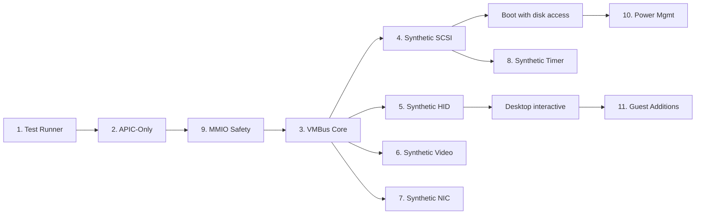

# Hyper-V Generation 2 Boot Support

> **Goal:** Enable Impossible OS to boot and run fully on Microsoft Hyper-V
> Generation 2 virtual machines — a legacy-free, paravirtualized environment that
> removes all traditional PC hardware (PIC, PIT, PS/2, IDE, AHCI) and replaces
> it with the proprietary VMBus protocol.

> [!CAUTION]
> **Memory Rule:** Use `pmm_alloc_contiguous()` for ALL buffers > 4 KB (fonts, images, file data). `kmalloc` is ONLY for small kernel structs (≤ 4 KB). Violating this crashes the 2 MiB heap silently. See `rules.md` Known Gotchas and `/add-asset` workflow.

> [!WARNING]
> **Hyper-V Gen 2 is a complete paradigm shift.** There is no fallback to legacy
> hardware. Every subsystem below must work before the OS produces any visible
> output or accepts any input on Hyper-V Gen 2.

---

## Architecture Overview

Hyper-V Generation 2 removes **ALL** legacy PC hardware and replaces it with
synthetic paravirtual devices over the VMBus protocol:

| Legacy Hardware Removed | VMBus Replacement           | Impact Without Driver                     |
|-------------------------|-----------------------------|-------------------------------------------|
| 8259 PIC                | APIC-only (no PIC present)  | PIC init writes silently dropped          |
| 8254 PIT                | LAPIC timer / Hyper-V timer | Calibration hangs (already bypassed)      |
| PS/2 i8042              | Synthetic HID over VMBus    | **No keyboard or mouse input**            |
| IDE / AHCI              | Synthetic SCSI over VMBus   | **No disk access — FS mount fails**       |
| Emulated VGA            | Synthetic Video over VMBus  | Framebuffer may freeze after boot         |
| E1000 NIC               | Synthetic NIC over VMBus    | **No networking**                         |

### Boot Sequence on Hyper-V Gen 2

```
UEFI Firmware (Hyper-V)
  └── shim.efi (Secure Boot MOK chain)
        └── bootx64.efi (our bootloader)
              ├── GOP framebuffer → boot splash ✅
              ├── ExitBootServices()
              └── kernel_main()
                    ├── APIC init (no PIC — PCAT_COMPAT=0) ← §2
                    ├── VMBus discovery (hypercall page) ← §3
                    ├── Synthetic SCSI → mount IXFS/FAT32 ← §4
                    ├── Synthetic HID → keyboard + mouse ← §5
                    ├── Synthetic Video → resolution mgmt ← §6
                    └── Desktop ready
```

---

## 1. Test Runner Script

**Prompt:** Create `scripts/run-hyperv.ps1` that creates or updates a Hyper-V Generation 2 VM with Secure Boot disabled, 512 MB RAM, and the ISO attached. Hyper-V is the primary target for production testing on Windows hosts. The script must handle: VM doesn't exist (create), VM exists but is running (stop first), and VM exists but settings changed (update). Also create `scripts/run-hyperv.bat` as a one-click wrapper. After completing all items, mark every item as `[x]`, and commit as `"tools: Hyper-V Gen 2 test runner"`. Add notes directly in this TODO section.


- [ ] Create `scripts/run-hyperv.ps1`
- [ ] Create Hyper-V Generation 2 VM: `ImpossibleOS-Dev`
- [ ] Settings: 512 MB RAM, Secure Boot OFF, 1 vCPU, DVD drive
- [ ] Attach `build/os-build.iso` to virtual DVD
- [ ] Handle existing VM: stop if running, update settings if changed
- [ ] Start VM and connect to console (`vmconnect.exe`)
- [ ] Create `scripts/run-hyperv.bat` — one-click wrapper
- [ ] Commit: `"tools: Hyper-V Gen 2 test runner"`

---

## 2. APIC-Only Interrupt Mode (No PIC)

> **XREF:** [TODO-080-Drivers.md §2.2](../060-Hardware-Drivers/TODO-080-Drivers.md) — APIC / IOAPIC (Built-in)

**Prompt:** On Hyper-V Gen 2, the MADT `PCAT_COMPAT` flag (bit 0 at offset 36) is cleared to 0, meaning **no 8259 PIC exists**. The current kernel assumes PIC presence at boot. The APIC init must: parse MADT for the `PCAT_COMPAT` flag, skip all PIC I/O port accesses (`0x20`, `0x21`, `0xA0`, `0xA1`) when the flag is 0, and operate in APIC-only mode from the start. Without this, the PIC init writes are silently dropped (no crash, but interrupts may not route correctly). After completing all items, mark every item as `[x]`, run `bash scripts/build.sh clean`, and commit as `"kernel: APIC-only mode for hardware-reduced ACPI"`. Add notes directly in this TODO section.

**Status in kernel:** The PIT calibration hang is already bypassed (xv6 hardcoded ICR).
PIC init writes are harmlessly dropped on Hyper-V but should be skipped for correctness.

- [ ] Parse MADT flags (offset 36, bit 0 = `PCAT_COMPAT`)
- [ ] If `PCAT_COMPAT=1` (legacy): remap PIC, then disable after APIC takeover
- [ ] If `PCAT_COMPAT=0` (Hyper-V Gen 2): **skip PIC init entirely**
- [ ] Log: `[MADT] PCAT_COMPAT=0 — PIC absent, APIC-only mode`
- [ ] Verify: IOAPIC redirection table entries are configured without PIC dependency
- [ ] Test: boot in QEMU (PCAT_COMPAT=1 → PIC remapped) AND Hyper-V Gen 2 (PCAT_COMPAT=0 → PIC skipped)
- [ ] Commit: `"kernel: APIC-only mode for hardware-reduced ACPI"`

---

## 3. VMBus Core Protocol

> **XREF:** [TODO-080-Drivers.md §10.1](../060-Hardware-Drivers/TODO-080-Drivers.md) — VMBus Core Protocol

**Prompt:** VMBus is Microsoft's proprietary channel-based communication framework between the guest OS (VSC — Virtualization Service Client) and the host hypervisor (VSP — Virtualization Service Provider). This is the **foundation** — without VMBus, no synthetic device (disk, keyboard, mouse, video, network) can be accessed. Implement: discover Hyper-V via CPUID leaf `0x40000001`, set up the hypercall page via MSR `HV_X64_MSR_HYPERCALL`, negotiate VMBus protocol version, initiate the VMBus connection, enumerate offered channels, and manage ring buffer pairs (send/receive) for each channel. VMBus channels are identified by GUIDs. Clean-room implement from the public Hyper-V TLFS (Top-Level Functional Specification), NOT from Linux `hv_vmbus.c` (GPL). After completing all items, mark every item as `[x]`, run `bash scripts/build.sh clean`, and commit as `"drivers: VMBus core protocol"`. Add notes directly in this TODO section.

> [!IMPORTANT]
> **Legal:** Clean-room implement from the [Hyper-V TLFS](https://learn.microsoft.com/en-us/virtualization/hyper-v-on-windows/tlfs/tlfs)
> (public spec). Do NOT reference Linux `hv_vmbus.c` (GPL contamination risk).

- [ ] Create `src/kernel/drivers/vmbus.c` and `include/kernel/drivers/vmbus.h`
- [ ] Detect Hyper-V via CPUID leaf `0x40000001` (signature `"Hv#1"`)
- [ ] Read Hyper-V feature MSRs (guest OS ID, feature identification)
- [ ] Set up hypercall page via `HV_X64_MSR_HYPERCALL`
- [ ] Negotiate VMBus protocol version with host
- [ ] Enumerate offered VMBus channels (GUID-based identification)
- [ ] Implement ring buffer pair (send ring + receive ring) for each channel
- [ ] Implement VMBus message handler (interrupt-driven)
- [ ] Clean-room from: Hyper-V TLFS (public spec), NOT Linux `hv_vmbus.c` (GPL)
- [ ] Commit: `"drivers: VMBus core protocol"`

---

## 4. Synthetic SCSI Storage Driver (storvsc)

> **XREF:** [TODO-080-Drivers.md §10.2](../060-Hardware-Drivers/TODO-080-Drivers.md) — Synthetic SCSI

**Prompt:** On Hyper-V Gen 2, virtual hard disks (VHDX) are attached to a Synthetic SCSI Controller accessible only through VMBus. The storvsc protocol sends SCSI commands (READ/WRITE/INQUIRY) over a VMBus channel identified by the Storage VSP GUID (`BA6163D9-04A1-4D29-B605-72E2FFB1DC7F`). Without this driver, the OS **cannot read any disk** — IXFS/FAT32 mount fails, no fonts, no icons, no wallpaper, no desktop. This is the **#1 blocker** for Hyper-V Gen 2 boot. After completing all items, mark every item as `[x]`, run `bash scripts/build.sh clean`, and commit as `"drivers: Hyper-V synthetic SCSI (storvsc)"`. Add notes directly in this TODO section.

- [ ] Create `src/kernel/drivers/storvsc.c` and `include/kernel/drivers/storvsc.h`
- [ ] Open VMBus channel with Storage VSP GUID `BA6163D9-04A1-4D29-B605-72E2FFB1DC7F`
- [ ] Negotiate storvsc protocol version
- [ ] Send SCSI INQUIRY command → identify disk
- [ ] Implement `storvsc_read_sectors(lba, count, buf)` via SCSI READ(16)
- [ ] Implement `storvsc_write_sectors(lba, count, buf)` via SCSI WRITE(16)
- [ ] Register as block device (`blkdev_register`)
- [ ] Test: boot in Hyper-V Gen 2 → verify IXFS/FAT32 mount
- [ ] Commit: `"drivers: Hyper-V synthetic SCSI (storvsc)"`

---

## 5. Synthetic HID Input Driver

> **XREF:** [TODO-080-Drivers.md §10.3](../060-Hardware-Drivers/TODO-080-Drivers.md) — Synthetic HID
> **XREF:** [TODO-090-Guest-Additions.md §6.2](../060-Hardware-Drivers/TODO-090-Guest-Additions.md) — Hyper-V Synthetic Mouse & Video

**Prompt:** On Hyper-V Gen 2, the PS/2 (i8042) controller is removed. Keyboard and mouse input is delivered via VMBus channels: Keyboard VSP GUID (`F912AD6D-2B17-48EA-BD65-F927A61C7684`) and Mouse VSP GUID. The synthetic HID protocol sends serialized input events (key scancodes, mouse coordinates) over the VMBus ring buffer. Without this driver, the desktop is **completely unresponsive** — no keyboard shortcuts, no mouse clicks, no window interaction. After completing all items, mark every item as `[x]`, run `bash scripts/build.sh clean`, and commit as `"drivers: Hyper-V synthetic HID input"`. Add notes directly in this TODO section.

- [ ] Create `src/kernel/drivers/hv_kbd.c` and `src/kernel/drivers/hv_mouse.c`
- [ ] Open VMBus channel for Keyboard VSP GUID `F912AD6D-2B17-48EA-BD65-F927A61C7684`
- [ ] Open VMBus channel for Mouse VSP GUID
- [ ] Parse synthetic keyboard events → feed into existing `keyboard_handler()`
- [ ] Parse synthetic mouse events → feed into existing `mouse_handler()`
- [ ] Fallback: if PS/2 is present (QEMU/VBox), use PS/2; if absent (Hyper-V), use synthetic
- [ ] Commit: `"drivers: Hyper-V synthetic HID input"`

---

## 6. Synthetic Video Driver (hvfb)

> **XREF:** [TODO-080-Drivers.md §10.4](../060-Hardware-Drivers/TODO-080-Drivers.md) — Synthetic Video

**Prompt:** After `ExitBootServices()` in Hyper-V, the firmware-managed GOP framebuffer may freeze or become invalid if the synthetic video device is not properly acknowledged. The Hyper-V Synthetic Video driver communicates over VMBus (Video VSP GUID) to negotiate resolution and receive framebuffer updates. Note: the GOP framebuffer address from the bootloader typically remains accessible for basic pixel writes (boot splash works), but proper VMBus video integration enables runtime resolution changes and avoids display freezes. After completing all items, mark every item as `[x]`, run `bash scripts/build.sh clean`, and commit as `"drivers: Hyper-V synthetic video (hvfb)"`. Add notes directly in this TODO section.

- [ ] Create `src/kernel/drivers/hvfb.c` and `include/kernel/drivers/hvfb.h`
- [ ] Open VMBus channel for Video VSP GUID
- [ ] Negotiate resolution (query supported modes)
- [ ] Set up framebuffer via synthetic video protocol
- [ ] Integrate with existing `fb_init()` / `fb_swap()` compositor
- [ ] Support runtime resolution change (via VMBus renegotiation)
- [ ] Commit: `"drivers: Hyper-V synthetic video (hvfb)"`

---

## 7. Synthetic Network Driver (netvsc)

> **XREF:** [TODO-400-Networking.md §7](../400-Networking-Internet-Apps/TODO-400-Networking.md) — Virtio-Net Driver

**Prompt:** On Hyper-V Gen 2, the emulated E1000 NIC is replaced by a Synthetic Network adapter (netvsc). The netvsc driver communicates over VMBus (Network VSP GUID) using RNDIS (Remote Network Driver Interface Specification) protocol to send/receive Ethernet frames. This is the only way to get networking on Hyper-V Gen 2. After completing all items, mark every item as `[x]`, run `bash scripts/build.sh clean`, and commit as `"drivers: Hyper-V synthetic NIC (netvsc)"`. Add notes directly in this TODO section.

- [ ] Create `src/kernel/drivers/netvsc.c` and `include/kernel/drivers/netvsc.h`
- [ ] Open VMBus channel for Network VSP GUID
- [ ] Negotiate RNDIS protocol version
- [ ] Implement `netvsc_send(packet, len)` — encapsulate in RNDIS message
- [ ] Implement netvsc receive handler → extract Ethernet frame → `ethernet_receive()`
- [ ] Read MAC address via RNDIS query
- [ ] Register with Ethernet layer as NIC (like RTL8139 / virtio-net)
- [ ] Test: DHCP + ping over netvsc in Hyper-V Gen 2
- [ ] Commit: `"drivers: Hyper-V synthetic NIC (netvsc)"`

---

## 8. Hyper-V Synthetic Timer

> **XREF:** [TODO-020-Threading.md §Enhancement](../010-Kernel-Foundations/TODO-020-Threading-Synchronization.md) — Hyper-V Synthetic Timer

**Prompt:** On Hyper-V, the LAPIC timer frequency varies by platform and virtualization. The Hyper-V synthetic timer (`HV_X64_MSR_STIMER0_*`) is a per-vCPU microsecond-granularity timer that fires an interrupt at a configurable interval. It is the recommended clock source on Hyper-V because it bypasses LAPIC calibration issues and provides consistent timing regardless of host CPU model. After completing all items, mark every item as `[x]`, run `bash scripts/build.sh clean`, and commit as `"smp: Hyper-V synthetic timer as optional clock source"`. Add notes directly in this TODO section.

- [ ] Detect Hyper-V via CPUID leaf `0x40000001` (signature `"Hv#1"`)
- [ ] If Hyper-V detected: read `HV_X64_MSR_STIMER0_CONFIG` and `HV_X64_MSR_STIMER0_COUNT`
- [ ] Configure synthetic timer for 10ms interval (100 Hz scheduler tick)
- [ ] Route synthetic timer interrupt to scheduler `timer_handler()`
- [ ] Fallback: if not on Hyper-V, continue using LAPIC timer (xv6 hardcoded ICR)
- [ ] Commit: `"smp: Hyper-V synthetic timer as optional clock source"`

---

## 9. Page Table MMIO Safety

> **XREF:** [TODO-010-Bootloader.md §1.5](../010-Kernel-Foundations/TODO-010-Bootloader.md) — Page Tables Enhancement

**Prompt:** The current `setup_page_tables()` maps all 4 GiB with write-back caching (PTE flags `0x87`). On Hyper-V Gen 2, this maps VMBus MMIO regions with write-back caching, which can cause Machine Check Exceptions (MCE) or silent data corruption. MMIO regions must be mapped with uncacheable (UC) or write-combining (WC) attributes. Parse the UEFI memory map (passed from bootloader) and set PTE cache flags based on `EfiMemoryMappedIO` entries. After completing all items, mark every item as `[x]`, run `bash scripts/build.sh clean`, and commit as `"boot: MMIO-safe page table caching"`. Add notes directly in this TODO section.

- [ ] Bootloader: pass full UEFI memory map to kernel via boot params
- [ ] Kernel: parse memory map entries for `EfiMemoryMappedIO` type
- [ ] Set MMIO regions to PCD+PWT (uncacheable) in page table entries
- [ ] Keep RAM regions as write-back (current behavior)
- [ ] Log: `[MM] MMIO region 0xFEC00000-0xFEC01000 mapped UC`
- [ ] Test: boot in QEMU (no change) AND Hyper-V Gen 2 (no MCE)
- [ ] Commit: `"boot: MMIO-safe page table caching"`

---

## 10. Hyper-V Power Management

> **XREF:** [TODO-100-Power-Management.md §9](../060-Hardware-Drivers/TODO-100-Power-Management.md) — Hyper-V Power Validation

**Prompt:** Validate power management operations (shutdown, reboot, sleep) on Hyper-V Gen 2. The standard ACPI shutdown (port `0xCF9`, `PM1a_CNT` SLP_TYP) may behave differently under the hypervisor. Hyper-V provides a hypercall-based shutdown mechanism. After completing all items, mark every item as `[x]`, run `bash scripts/build.sh clean`, and commit as `"power: Hyper-V power management validation"`. Add notes directly in this TODO section.

- [ ] Test ACPI shutdown via `PM1a_CNT` on Hyper-V Gen 2
- [ ] Test reboot via port `0xCF9` on Hyper-V Gen 2
- [ ] If ACPI shutdown fails: implement Hyper-V shutdown hypercall fallback
- [ ] Test S3 suspend/resume on Hyper-V Gen 2 (may not be supported)
- [ ] Document any Hyper-V-specific ACPI issues
- [ ] Commit: `"power: Hyper-V power management validation"`

---

## 11. Hyper-V Guest Additions Integration

> **XREF:** [TODO-090-Guest-Additions.md §6](../060-Hardware-Drivers/TODO-090-Guest-Additions.md) — VMBus Integration

**Prompt:** Once the core VMBus stack (§3) and synthetic drivers (§4-7) are functional, integrate them into the guest additions framework so the hypervisor detector (`detect.c`) automatically activates the Hyper-V backend when running on Hyper-V. The detection chain: CPUID `0x40000000` returns `"Microsoft Hv"` → activate VMBus backend → register synthetic drivers. After completing all items, mark every item as `[x]`, run `bash scripts/build.sh clean`, and commit as `"hyperv: guest additions integration"`. Add notes directly in this TODO section.

- [ ] Hypervisor detector: CPUID `0x40000000` = `"Microsoft Hv"` → Hyper-V detected
- [ ] Auto-activate VMBus backend in guest additions framework
- [ ] Register synthetic drivers: storvsc, hv_kbd, hv_mouse, hvfb, netvsc
- [ ] Log: `"[OK] Hypervisor: Hyper-V"` at boot
- [ ] Ensure fallback: if not on Hyper-V, use legacy/VirtIO drivers as before
- [ ] Commit: `"hyperv: guest additions integration"`

---

## Current Status (What Already Works)

| Component | Status | Notes |
|---|---|---|
| UEFI boot (shim + MOK) | ✅ Done | Secure Boot chain works on Gen 2 |
| GOP framebuffer | ✅ Done | 1280×720 fallback mode works |
| PIT calibration bypass | ✅ Done | xv6 hardcoded LAPIC ICR — no PIT dependency |
| PMM back buffer | ✅ Done | Framebuffer uses PMM, not kmalloc |

---

## Priority Order

| Priority | Section                          | Reason                                                        |
|----------|----------------------------------|---------------------------------------------------------------|
| 🔴 P0     | 1. Test Runner Script            | Need to test before anything else works                       |
| 🔴 P0     | 3. VMBus Core Protocol           | **Foundation** — all synthetic drivers depend on this         |
| 🔴 P0     | 4. Synthetic SCSI (storvsc)      | **#1 blocker** — no disk = no filesystem = no desktop         |
| 🔴 P0     | 2. APIC-Only Mode                | PIC init must not interfere — correctness requirement         |
| 🔴 P0     | 9. Page Table MMIO Safety        | Without UC mapping, VMBus MMIO may trigger MCE                |
| 🟠 P1     | 5. Synthetic HID Input           | No input = unusable OS                                        |
| 🟠 P1     | 6. Synthetic Video (hvfb)        | GOP fallback works but may freeze — proper driver needed      |
| 🟡 P2     | 8. Hyper-V Synthetic Timer       | Performance — consistent timing across host CPUs              |
| 🟡 P2     | 7. Synthetic NIC (netvsc)        | Networking on Hyper-V                                         |
| 🟢 P3     | 10. Power Management             | Shutdown/reboot validation                                    |
| 🟢 P3     | 11. Guest Additions Integration  | Framework integration after drivers work                      |

---

## Implementation Order (Critical Path)



---

## OS Comparison

| Feature                            | Windows 11 (Native Hyper-V)       | Linux (hv_* drivers)              | Impossible OS                              |
|------------------------------------|-----------------------------------|-----------------------------------|--------------------------------------------|
| VMBus discovery + protocol         | ✅ Native (built-in)              | ✅ `hv_vmbus.ko`                 | ⬜ §3 P0 — **cannot boot on Hyper-V**     |
| Synthetic SCSI (storvsc)           | ✅ Native                         | ✅ `hv_storvsc.ko`               | ⬜ §4 P0 — no disk access                 |
| Synthetic HID (keyboard + mouse)  | ✅ Native                         | ✅ `hv_utils.ko` + `hid-hyperv`  | ⬜ §5 P1 — no input                       |
| Synthetic Video (hvfb)            | ✅ Native                         | ✅ `hyperv_fb.ko`                | ⬜ §6 P1 — GOP fallback only              |
| Synthetic NIC (netvsc)            | ✅ Native                         | ✅ `hv_netvsc.ko`                | ⬜ §7 P2 — no networking                  |
| Hyper-V synthetic timer           | ✅ Native                         | ✅ `hyperv_timer.c`              | ⬜ §8 P2 — uses LAPIC fallback            |
| APIC-only mode (no legacy PIC)    | ✅ Automatic                      | ✅ MADT PCAT_COMPAT check        | ⬜ §2 P0 — PIC init always runs           |
| MMIO-safe page tables             | ✅ Automatic (UEFI memory map)    | ✅ Uses EFI memory map            | ⬜ §9 P0 — maps all as write-back         |
| Gen 2 Hyper-V boot (full)         | ✅ Native                         | ✅ With hv_* drivers              | ⬜ **Full stack required (§1-§11)**        |

> **After §1-§9:** Impossible OS boots and runs interactively on Hyper-V Gen 2.
> **After §10-§11:** Matches Linux's Hyper-V support and integrates with guest additions framework.
