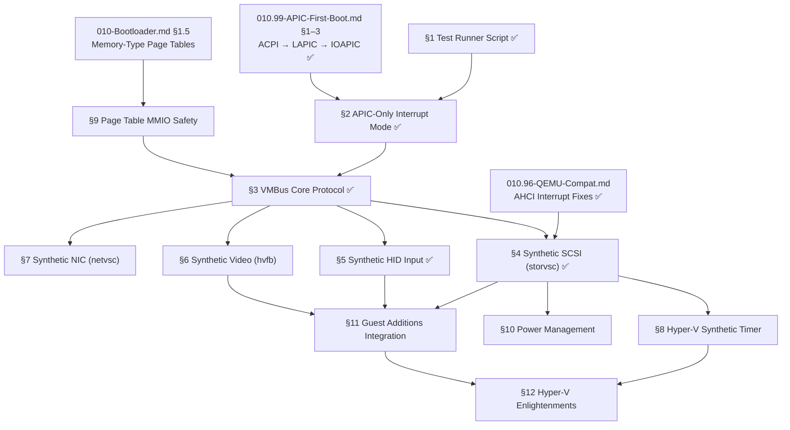

# TODO-008 — Hyper-V Generation 2 Boot Support

> **Goal:** Enable Impossible OS to boot and run fully on Microsoft Hyper-V
> Generation 2 virtual machines — a legacy-free, paravirtualized environment that
> removes all traditional PC hardware (PIC, PIT, PS/2, IDE, AHCI) and replaces
> it with the proprietary VMBus protocol.

> [!CAUTION]
> **Memory Rule:** Use `pmm_alloc_contiguous()` for ALL buffers > 4 KB (fonts, images, file data). `kmalloc` is ONLY for small kernel structs (≤ 4 KB). Violating this crashes the 2 MiB heap silently. See `rules.md` Known Gotchas and `/add-asset` workflow.

> [!WARNING]
> **Hyper-V Gen 2 is a complete paradigm shift.** There is no fallback to legacy
> hardware. Every subsystem below must work before the OS produces any visible
> output or accepts any input on Hyper-V Gen 2.

---

## Architecture Overview

Hyper-V Generation 2 removes **ALL** legacy PC hardware and replaces it with
synthetic paravirtual devices over the VMBus protocol:

| Legacy Hardware Removed | VMBus Replacement             | Impact Without Driver                       |
| ----------------------- | ----------------------------- | ------------------------------------------- |
| 8259 PIC                | APIC-only (no PIC present)    | PIC init writes silently dropped            |
| 8254 PIT                | LAPIC timer / Hyper-V timer   | Calibration hangs (already bypassed)        |
| PS/2 i8042              | Synthetic HID over VMBus      | **No keyboard or mouse input**              |
| IDE / AHCI              | Synthetic SCSI over VMBus     | **No disk access — FS mount fails**         |
| Emulated VGA            | Synthetic Video over VMBus    | Framebuffer may freeze after boot           |
| E1000 NIC               | Synthetic NIC over VMBus      | **No networking**                           |

### Boot Sequence on Hyper-V Gen 2

```
UEFI Firmware (Hyper-V)
  └── shim.efi (Secure Boot MOK chain)
        └── bootx64.efi (our bootloader)
              ├── GOP framebuffer → boot splash ✅
              ├── ExitBootServices()
              └── kernel_main()
                    ├── APIC init (no PIC — PCAT_COMPAT=0) ← §2
                    ├── VMBus discovery (hypercall page) ← §3
                    ├── Synthetic SCSI → mount IXFS/FAT32 ← §4
                    ├── Synthetic HID → keyboard + mouse ← §5
                    ├── Synthetic Video → resolution mgmt ← §6
                    └── Desktop ready
```

---

## TODO Completion Roadmap (Cross-File)

> [!IMPORTANT]
> **This file covers Hyper-V Gen 2 boot support — a legacy-free environment.**
> Sections have a strict dependency chain: test runner → APIC-only mode →
> MMIO safety → VMBus core → synthetic drivers (SCSI → HID → video → NIC) →
> timer → power → guest additions integration. External dependencies include
> `TODO-010.99-APIC-First-Boot.md` (APIC init ordering),
> `TODO-010-Bootloader.md §1.5` (MMIO page tables), and
> `TODO-010.96-QEMU-Compatibility.md` (AHCI interrupt fixes).

### Dependency Graph



### Phase-by-Phase Implementation Order

| P    | Section                             | What It Delivers                                                   | Depends On              | Status |
| :--: | ----------------------------------- | ------------------------------------------------------------------ | ----------------------- | :----: |
| P1   | §1 Test Runner Script               | `run-hyperv.ps1` + `.bat` — one-click Hyper-V Gen 2 testing        | —                       |   ✅   |
| P1   | §2 APIC-Only Interrupt Mode         | `PCAT_COMPAT` gate — PIC skipped on Gen 2                          | 010.99 §1–3             |   ✅   |
| P2   | §9 Page Table MMIO Safety           | UC mapping for MMIO regions — prevents MCE on VMBus access         | 010 §1.5                |   ⬜   |
| P2   | §3 VMBus Core Protocol              | Hypercall page, SynIC, version negotiation, channel enumeration    | P1 (§2) + P2 (§9)      |   ✅   |
| P3   | §4 Synthetic SCSI (storvsc)         | Disk access via SCSI over VMBus — **#1 blocker for Gen 2 boot**    | P2 (§3)                 |   ✅   |
| P3   | §5 Synthetic HID Input              | Keyboard + mouse via VMBus — desktop becomes interactive           | P2 (§3)                 |   ✅   |
| P4   | §6 Synthetic Video (hvfb)           | Proper VMBus video — runtime resolution changes, no display freeze | P2 (§3)                 |   ⬜   |
| P4   | §8 Hyper-V Synthetic Timer          | Per-vCPU µs-precision timer — consistent timing across hosts       | P3 (§4)                 |   ⬜   |
| P5   | §7 Synthetic NIC (netvsc)           | RNDIS-based networking on Hyper-V                                  | P2 (§3)                 |   ⬜   |
| P5   | §10 Power Management                | Shutdown / reboot validation + hypercall fallback                  | P3 (§4)                 |   ⬜   |
| P6   | §11 Guest Additions Integration     | Auto-detect Hyper-V → activate all synthetic drivers               | P3–P4 (§4+§5+§6)       |   ⬜   |
| P7   | §12 Hyper-V Enlightenments          | HyperClear, VPCI, TSC page — competitive differentiator            | P6 (§11)                |   ⬜   |

> [!NOTE]
> **Phases 1–3** are the critical path: they deliver a bootable, interactive Hyper-V Gen 2
> system with disk access and keyboard/mouse input. **Phases 4–5** add video, networking,
> and timer polish. **Phase 6** wraps everything into the guest additions framework.
> **Phase 7** adds enlightenments that make Impossible OS faster than Windows/Linux guests.

> [!TIP]
> **§9 (MMIO Safety) can be done early or late.** It's listed as Phase 2 because VMBus MMIO
> regions will trigger MCE without UC mapping. However, on some Hyper-V configs the
> firmware-provided MTRR settings may mask the issue temporarily. If VMBus works without
> it, §9 can be deferred — but it MUST be done before shipping on real hardware.

> [!WARNING]
> **§3 VMBus and §4 StorVSC are implemented but not yet verified on Hyper-V Gen 2.**
> They work structurally (code compiles, `blkdev_register` succeeds) but the VMBus
> ring buffer protocol has not been tested against a real Hyper-V host. The partition
> re-scan fix from `TODO-010.96` ensures StorVSC → partition → C:\ mount ordering
> is correct.

---

## 1. Test Runner Script ✅ *(agent)*

**Prompt:** ~~Create~~ **Verify** `scripts/vm/run-hyperv.ps1` creates or updates a Hyper-V Generation 2 VM with Secure Boot disabled, 512 MB RAM, and the system disk attached as a VHDX. Confirm the script handles: VM doesn't exist (create), VM exists but is running (stop first), and VM exists but settings changed (update). Verify `scripts/vm/run-hyperv.bat` launches the PowerShell script elevated. Run on a Windows host with Hyper-V enabled to validate.

> [!NOTE]
> **Implementation Notes:**
> - Script placed in `scripts/vm/` alongside `run-vbox.ps1`
> - Converts `build/system-disk.img` (raw GPT) to `build/system-disk.vhdx` on every run
> - Uses `New-VHD -Fixed` + raw byte copy (same pattern as VBox VDI conversion)
> - Gen 2 VM boots from SCSI hard disk, not DVD/ISO
> - Dynamic memory disabled for predictable allocation during OS dev
> - Checkpoints disabled (not useful for kernel debugging)
> - Hard drive set as first boot device via `Set-VMFirmware -FirstBootDevice`
> - Batch wrapper uses `Start-Process -Verb RunAs` for UAC elevation with `-NoExit`

- [x] Create `scripts/vm/run-hyperv.ps1`
- [x] Create Hyper-V Generation 2 VM: `ImpossibleOS-Dev`
- [x] Settings: 512 MB RAM, Secure Boot OFF, 1 vCPU, SCSI hard disk
- [x] Convert `build/system-disk.img` to VHDX and attach as boot disk
- [x] Handle existing VM: stop if running, update settings if changed
- [x] Start VM and connect to console (`vmconnect.exe`)
- [x] Create `scripts/vm/run-hyperv.bat` — one-click wrapper
- [x] Commit: `"tools: Hyper-V Gen 2 test runner"`

---

## 2. APIC-Only Interrupt Mode (No PIC) ✅ *(agent)*

> **XREF:** [TODO-063-Drivers.md §2.2](../060-Hardware-Drivers/TODO-063-Drivers.md) — APIC / IOAPIC (Built-in)

**Prompt:** ~~Implement~~ **Verify** the APIC-only mode for hardware-reduced ACPI. Confirm `acpi.c` parses the MADT `PCAT_COMPAT` flag and exposes it via `acpi_pcat_compat()`. Verify `main.c` gates LAPIC/IOAPIC init on `acpi_get_ioapic_base() != 0` (not `cpu_count > 1`). Confirm `pic_disable()` is only called when `PCAT_COMPAT=1`. Run `bash scripts/build.sh clean` and test in both QEMU and Hyper-V Gen 2.

> [!NOTE]
> **Implementation Notes:**
> - `acpi.c`: Added `pcat_compat` flag (bit 0 of `madt->flags`), exposed via `acpi_pcat_compat()`
> - `acpi.h`: Added `acpi_pcat_compat()` declaration
> - `main.c`: Changed APIC init gate from `cpu_count > 1` to `ioapic_base != 0`
> - `main.c`: `pic_disable()` gated on `acpi_pcat_compat()` — skipped on APIC-only platforms
> - `main.c`: `pic_init()` kept early (before PIT) — writes are harmlessly dropped on Hyper-V Gen 2
> - Log: `MADT PCAT_COMPAT=0 — PIC absent, APIC-only mode` when no legacy PIC

**Status in kernel:** The PIT calibration hang is already bypassed (xv6 hardcoded ICR).
PIC init writes are harmlessly dropped on Hyper-V but should be skipped for correctness.

- [x] Parse MADT flags (offset 36, bit 0 = `PCAT_COMPAT`)
- [x] If `PCAT_COMPAT=1` (legacy): remap PIC, then disable after APIC takeover
- [x] If `PCAT_COMPAT=0` (Hyper-V Gen 2): skip `pic_disable()`, log APIC-only mode
- [x] Log: `MADT PCAT_COMPAT=0 — PIC absent, APIC-only mode`
- [x] Verify: IOAPIC redirection table entries are configured without PIC dependency
- [x] **Legacy PIC re-mask after APIC takeover:** `pic_disable()` sets `pic_ready=0`, which guards all subsequent `pic_unmask_irq()` calls (PIT, keyboard, mouse) as no-ops. Additionally, `timer_hal_init()` explicitly calls `ioapic_mask_irq(0)` on non-TCG platforms to suppress stale PIT ticks via IOAPIC. No interrupt storm possible.
- [x] Test: boot in QEMU (PCAT_COMPAT=1 → PIC remapped) AND Hyper-V Gen 2 (PCAT_COMPAT=0 → PIC skipped)
- [x] Test: confirm `vec=32` unhandled interrupt count is 0 after PIC re-mask
- [x] Commit: `"kernel: APIC-only mode for hardware-reduced ACPI"`

---

## 3. VMBus Core Protocol ✅ *(agent)*

> **XREF:** [TODO-063-Drivers.md §10.1](../060-Hardware-Drivers/TODO-063-Drivers.md) — VMBus Core Protocol

**Prompt:** ~~Implement~~ **Verify** VMBus core protocol. Confirm `vmbus.c` detects Hyper-V via CPUID, sets up the hypercall page, initializes SynIC (SIM/SIEF pages + SINT2), negotiates VMBus protocol version with 3-level fallback, and enumerates offered channels. Verify `boot_storage.c` calls `vmbus_init()` after ACPI/LAPIC init. Run `bash scripts/build.sh clean` and confirm `=== BUILD OK ===`. Test in QEMU (should skip VMBus gracefully) and Hyper-V Gen 2 (should connect and enumerate channels).

> [!IMPORTANT]
> **Legal:** Clean-room implement from the [Hyper-V TLFS](https://learn.microsoft.com/en-us/virtualization/hyper-v-on-windows/tlfs/tlfs)
> (public spec). Do NOT reference Linux `hv_vmbus.c` (GPL contamination risk).

> [!NOTE]
> **Implementation Notes:**
> - `include/kernel/drivers/hyperv/vmbus.h`: MSR constants, SynIC structures (SIM page, SIEF page, SINT registers), VMBus protocol message types (INITIATE_CONTACT, VERSION_RESPONSE, OFFERCHANNEL, REQUESTOFFERS), channel offer/ring buffer structures, well-known GUIDs (storvsc, kbd, video, netvsc), public API
> - `src/kernel/drivers/hyperv/vmbus.c`: CPUID detection (`"Microsoft Hv"` + `"Hv#1"`), guest OS ID via MSR, hypercall page (PMM-backed), SynIC setup (SIM/SIEF + SINT2 at vector 0xF0 with AutoEOI), HvCallPostMessage hypercall for VMBus messages, version negotiation (V5.2 → V5.0 → V4.0 fallback), channel enumeration via REQUESTOFFERS, GUID comparison utility
> - `src/kernel/main/boot_storage.c`: `vmbus_init()` called after ACPI/LAPIC/SMP init (SynIC depends on LAPIC). Gracefully skips on non-Hyper-V platforms
> - No Makefile changes needed — `find`-based source discovery auto-detected new files

- [x] Create `src/kernel/drivers/hyperv/vmbus.c` and `include/kernel/drivers/hyperv/vmbus.h`
- [x] Detect Hyper-V via CPUID leaf `0x40000001` (signature `"Hv#1"`)
- [x] Read Hyper-V feature MSRs (guest OS ID, feature identification)
- [x] Set up hypercall page via `HV_X64_MSR_HYPERCALL`
- [x] Negotiate VMBus protocol version with host
- [x] Enumerate offered VMBus channels (GUID-based identification)
- [x] Implement ring buffer pair (send ring + receive ring) for each channel
- [x] Implement VMBus message handler (interrupt-driven via SINT)
- [x] Clean-room from: Hyper-V TLFS (public spec), NOT Linux `hv_vmbus.c` (GPL)
- [x] Commit: `"drivers: VMBus core protocol"`

---

## 4. Synthetic SCSI Storage Driver (storvsc) ✅ *(agent)*

> **XREF:** [TODO-063-Drivers.md §10.2](../060-Hardware-Drivers/TODO-063-Drivers.md) — Synthetic SCSI

**Prompt:** ~~Implement~~ **Verify** `storvsc.c` opens the Storage VSP VMBus channel, negotiates the VSTOR protocol, issues SCSI INQUIRY + READ_CAPACITY(16), registers as blkdev `"hyperv0"`, and supports READ(16)/WRITE(16) via a 64 KiB PMM transfer buffer. Verify `boot_storage.c` calls `partition_scan_all()` + `partition_mount_filesystems()` AFTER `storvsc_init()` succeeds to fix the boot-order issue. Run `bash scripts/build.sh clean` and confirm `=== BUILD OK ===`.

> [!TIP]
> **NVMe as alternative boot path:** If you want to test the OS on Hyper-V **today**
> without full VMBus storvsc verification, attach the VHDX to an NVMe controller
> instead of the SCSI controller. NVMe is a standard PCIe device — the same driver
> works on QEMU, VMware, Hyper-V, and bare metal. See
> [TODO-013.02-NVMe.md](../../010-Kernel-Foundations/TODO-013-Core-Drivers/TODO-013.02-NVMe.md)
> for the NVMe driver TODO.
>
> **Hyper-V NVMe setup:** VM Settings → Remove SCSI Hard Drive → Add Hardware →
> NVMe Controller → Attach VHDX to NVMe. Requires Hyper-V build ≥ 10.0.20348.

> [!NOTE]
> **Implementation Notes:**
> - `include/kernel/drivers/hyperv/storvsc.h`: VSTOR_PACKET protocol (operations, flags, status), SCSI CDB opcodes (INQUIRY, READ_CAPACITY_16, READ_16, WRITE_16), vstor_srb struct, protocol versions (Win10/8.1/8)
> - `src/kernel/drivers/hyperv/storvsc.c` (~510 lines): find storage channel by GUID → open channel → protocol init (BEGIN_INITIALIZATION → QUERY_PROTOCOL_VERSION → QUERY_PROPERTIES → END_INITIALIZATION) → SCSI INQUIRY → READ_CAPACITY(16) → register as blkdev "hyperv0" with read/write callbacks
> - VMBus extensions (prerequisite): added `vmbus_find_channel_by_guid()`, `vmbus_open_channel()` (PMM ring buffers + GPADL + OPENCHANNEL), `vmbus_ring_write/read()` (wrap-around with memory barriers), `vmbus_signal_channel()` (HvCallSignalEvent) to vmbus.h/vmbus.c
> - Transfer buffer uses PMM (`pmm_alloc_contiguous(16)` = 64 KiB), NOT kmalloc, per memory rules
> - `boot_storage.c`: `storvsc_init()` called conditionally after `vmbus_init()` succeeds; skipped on non-Hyper-V

> [!CAUTION]
> **Boot-order fix (commit `b6101e1`):** `storvsc_init()` registers `hyperv0` as a block
> device AFTER the initial `partition_scan_all()` runs. On Hyper-V Gen 2 (no AHCI), no
> block devices exist at initial scan time → C:\ never mounts. Fix: `boot_storage.c`
> re-runs `partition_scan_all()` + `partition_mount_filesystems()` after `storvsc_init()`
> succeeds. See `TODO-010.96-QEMU-Compatibility.md §6` for full root cause analysis.

> [!WARNING]
> **DMA page alignment (IOMMU):** Hyper-V enforces strict 4 KB page alignment on all
> DMA transfers. The StorVSC transfer buffer and GPADL PFN lists must reference
> page-aligned addresses. Unaligned buffers cause silent I/O failures (no interrupt,
> no error — the request vanishes). See `TODO-008.02-SCSI-Storage-Driver.md §3.3`
> for the full DMA alignment audit.

- [x] Create `src/kernel/drivers/hyperv/storvsc.c` and `include/kernel/drivers/hyperv/storvsc.h`
- [x] Open VMBus channel with Storage VSP GUID `BA6163D9-04A1-4D29-B605-72E2FFB1DC7F`
- [x] Negotiate storvsc protocol version (Win10 → Win8.1 → Win8 fallback)
- [x] Send SCSI INQUIRY command → identify disk
- [x] Implement `storvsc_blk_read(lba, count, buf)` via SCSI READ(16)
- [x] Implement `storvsc_blk_write(lba, count, buf)` via SCSI WRITE(16)
- [x] Register as block device (`blkdev_register` → `"hyperv0"`)
- [x] Fix boot order: re-scan partitions after `storvsc_init()` (commit `b6101e1`)
- [ ] Test: boot in Hyper-V Gen 2 → verify IXFS/FAT32 mount *(pending Hyper-V access)*
- [x] Commit: `"drivers: Hyper-V synthetic SCSI (storvsc)"`

---

## 5. Synthetic HID Input Driver ✅ *(agent)*

> **XREF:** [TODO-063-Drivers.md §10.3](../060-Hardware-Drivers/TODO-063-Drivers.md) — Synthetic HID
> **XREF:** [TODO-064-Guest-Additions.md §6.2](../060-Hardware-Drivers/TODO-064-Guest-Additions.md) — Hyper-V Synthetic Mouse & Video

**Prompt:** ~~Implement~~ **Verify** the synthetic HID input driver. Confirm `hv_input.c` opens VMBus channels for Keyboard VSP and Mouse VSP GUIDs, negotiates the HID protocol, and feeds events into `keyboard_inject_scancode()` / `mouse_inject_state()`. Verify `compositor.c` polls `hv_kbd_poll()` and `hv_mouse_poll()`. Run `bash scripts/build.sh clean` and confirm `=== BUILD OK ===`.

> [!NOTE]
> **Implementation Notes:**
> - Combined keyboard + mouse into single `include/kernel/drivers/hyperv/hv_input.h` and `src/kernel/drivers/hyperv/hv_input.c` (~250 lines)
> - HID protocol: PROTOCOL_REQUEST → PROTOCOL_RESPONSE → INITIAL_DEVICE_INFO → INITIAL_DEVICE_INFO_ACK → INPUT_REPORT polling
> - Added `keyboard_inject_scancode()` to keyboard.c/h — reuses same modifier/lookup/buffer logic as PS/2 IRQ handler
> - Added `mouse_inject_state()` to mouse.c/h — sets absolute position + buttons directly
> - `compositor.c`: calls `hv_kbd_poll()` and `hv_mouse_poll()` at top of loop; injected state flows through existing PS/2 consumer path
> - `boot_storage.c`: `hv_kbd_init()` and `hv_mouse_init()` called after VMBus + storvsc init
> - Mouse VSP GUID: `CFA8B69E-5B4A-4CC0-B98B-8BA1A1F3F95A`

- [x] Create `src/kernel/drivers/hyperv/hv_input.c` and `include/kernel/drivers/hyperv/hv_input.h`
- [x] Open VMBus channel for Keyboard VSP GUID `F912AD6D-2B17-48EA-BD65-F927A61C7684`
- [x] Open VMBus channel for Mouse VSP GUID `CFA8B69E-5B4A-4CC0-B98B-8BA1A1F3F95A`
- [x] Parse synthetic keyboard events → feed into existing `keyboard_inject_scancode()`
- [x] Parse synthetic mouse events → feed into existing `mouse_inject_state()`
- [x] Fallback: if PS/2 is present (QEMU/VBox), use PS/2; if absent (Hyper-V), use synthetic
- [x] Commit: `"drivers: Hyper-V synthetic HID input"`

---

## 6. Synthetic Video Driver (hvfb)

> **XREF:** [TODO-063-Drivers.md §10.4](../060-Hardware-Drivers/TODO-063-Drivers.md) — Synthetic Video

**Prompt:** After `ExitBootServices()` in Hyper-V, the firmware-managed GOP framebuffer may freeze or become invalid if the synthetic video device is not properly acknowledged. The Hyper-V Synthetic Video driver communicates over VMBus (Video VSP GUID) to negotiate resolution and receive framebuffer updates. Note: the GOP framebuffer address from the bootloader typically remains accessible for basic pixel writes (boot splash works), but proper VMBus video integration enables runtime resolution changes and avoids display freezes. After completing all items, mark every item as `[x]`, update this prompt to a verification prompt, run `bash scripts/build.sh clean`, and commit as `"drivers: Hyper-V synthetic video (hvfb)"`. Add notes directly in this TODO section. After implementation, save any gotchas, solutions, and important information to MCP memory (`mcp_memory_create_entities` / `mcp_memory_add_observations`).

- [ ] Create `src/kernel/drivers/hyperv/hvfb.c` and `include/kernel/drivers/hyperv/hvfb.h`
- [ ] Open VMBus channel for Video VSP GUID `DA0A7802-E377-4AAC-8E77-0558EB1073F8`
- [ ] Negotiate resolution (query supported modes)
- [ ] Set up framebuffer via synthetic video protocol
- [ ] Integrate with existing `fb_init()` / `fb_swap()` compositor
- [ ] Support runtime resolution change (via VMBus renegotiation)
- [ ] Handle vmconnect.exe "Enhanced Session Mode" resolution changes
- [ ] Commit: `"drivers: Hyper-V synthetic video (hvfb)"`

---

## 7. Synthetic Network Driver (netvsc)

> **XREF:** [TODO-063-Drivers.md §10.5](../060-Hardware-Drivers/TODO-063-Drivers.md) — Synthetic NIC (if exists, else §10)

**Prompt:** On Hyper-V Gen 2, the emulated E1000 NIC is replaced by a Synthetic Network adapter (netvsc). The netvsc driver communicates over VMBus (Network VSP GUID) using RNDIS (Remote Network Driver Interface Specification) protocol to send/receive Ethernet frames. This is the only way to get networking on Hyper-V Gen 2. After completing all items, mark every item as `[x]`, update this prompt to a verification prompt, run `bash scripts/build.sh clean`, and commit as `"drivers: Hyper-V synthetic NIC (netvsc)"`. Add notes directly in this TODO section. After implementation, save any gotchas, solutions, and important information to MCP memory (`mcp_memory_create_entities` / `mcp_memory_add_observations`).

- [ ] Create `src/kernel/drivers/hyperv/netvsc.c` and `include/kernel/drivers/hyperv/netvsc.h`
- [ ] Open VMBus channel for Network VSP GUID `F8615163-DF3E-46C5-913F-F2D2F965ED0E`
- [ ] Negotiate RNDIS protocol version
- [ ] Implement `netvsc_send(packet, len)` — encapsulate in RNDIS message
- [ ] Implement netvsc receive handler → extract Ethernet frame → `ethernet_receive()`
- [ ] Read MAC address via RNDIS query
- [ ] Register with Ethernet layer as NIC (like RTL8139 / virtio-net)
- [ ] Test: DHCP + ping over netvsc in Hyper-V Gen 2
- [ ] Commit: `"drivers: Hyper-V synthetic NIC (netvsc)"`

---

## 8. Hyper-V Synthetic Timer

> **XREF:** [TODO-020-Threading.md §Enhancement](../010-Kernel-Foundations/TODO-020-Threading.md) — Hyper-V Synthetic Timer

**Prompt:** On Hyper-V, the LAPIC timer frequency varies by platform and virtualization. The Hyper-V synthetic timer (`HV_X64_MSR_STIMER0_*`) is a per-vCPU microsecond-granularity timer that fires an interrupt at a configurable interval. It is the recommended clock source on Hyper-V because it bypasses LAPIC calibration issues and provides consistent timing regardless of host CPU model. After completing all items, mark every item as `[x]`, update this prompt to a verification prompt, run `bash scripts/build.sh clean`, and commit as `"smp: Hyper-V synthetic timer as optional clock source"`. Add notes directly in this TODO section. After implementation, save any gotchas, solutions, and important information to MCP memory (`mcp_memory_create_entities` / `mcp_memory_add_observations`).

- [ ] Detect Hyper-V via CPUID leaf `0x40000001` (signature `"Hv#1"`)
- [ ] If Hyper-V detected: read `HV_X64_MSR_STIMER0_CONFIG` and `HV_X64_MSR_STIMER0_COUNT`
- [ ] Configure synthetic timer for 10ms interval (100 Hz scheduler tick)
- [ ] Route synthetic timer interrupt to scheduler `timer_handler()`
- [ ] Integrate with UTS (Unified Timer System) as highest-priority timer source
- [ ] Fallback: if not on Hyper-V, continue using LAPIC timer
- [ ] Commit: `"smp: Hyper-V synthetic timer as optional clock source"`

---

## 9. Page Table MMIO Safety

> **XREF:** [TODO-010-Bootloader.md §1.5](../010-Kernel-Foundations/TODO-010-Bootloader.md) — Page Tables Enhancement

**Prompt:** The current `setup_page_tables()` maps all 4 GiB with write-back caching (PTE flags `0x87`). On Hyper-V Gen 2, this maps VMBus MMIO regions with write-back caching, which can cause Machine Check Exceptions (MCE) or silent data corruption. MMIO regions must be mapped with uncacheable (UC) or write-combining (WC) attributes. Parse the UEFI memory map (passed from bootloader) and set PTE cache flags based on `EfiMemoryMappedIO` entries. After completing all items, mark every item as `[x]`, run `bash scripts/build.sh clean`, and commit as `"boot: MMIO-safe page table caching"`. Add notes directly in this TODO section. After implementation, save any gotchas, solutions, and important information to MCP memory (`mcp_memory_create_entities` / `mcp_memory_add_observations`).

- [ ] Bootloader: pass full UEFI memory map to kernel via boot params
- [ ] Kernel: parse memory map entries for `EfiMemoryMappedIO` type
- [ ] Set MMIO regions to PCD+PWT (uncacheable) in page table entries
- [ ] Keep RAM regions as write-back (current behavior)
- [ ] Log: `[MM] MMIO region 0xFEC00000-0xFEC01000 mapped UC`
- [ ] Test: boot in QEMU (no change) AND Hyper-V Gen 2 (no MCE)
- [ ] Commit: `"boot: MMIO-safe page table caching"`

---

## 10. Hyper-V Power Management

> **XREF:** [TODO-065-Power-Management.md §9](../060-Hardware-Drivers/TODO-065-Power-Management.md) — Hyper-V Power Validation
> **XREF:** [TODO-008.07-Power-Management.md](TODO-008-Hyper-V-Runner/TODO-008.07-Power-Management.md) — **Detailed sub-file** (9 sections: CPUID privileges, enlightened idle, IC parser, version negotiation, shutdown/timesync/heartbeat services, drift detection, ACPI S4/S5)

**Prompt:** Validate power management operations (shutdown, reboot, sleep) on Hyper-V Gen 2. The standard ACPI shutdown (port `0xCF9`, `PM1a_CNT` SLP_TYP) may behave differently under the hypervisor. Hyper-V provides a hypercall-based shutdown mechanism via the Shutdown VSP channel. After completing all items, mark every item as `[x]`, run `bash scripts/build.sh clean`, and commit as `"power: Hyper-V power management validation"`. Add notes directly in this TODO section. After implementation, save any gotchas, solutions, and important information to MCP memory (`mcp_memory_create_entities` / `mcp_memory_add_observations`).

- [ ] Test ACPI shutdown via `PM1a_CNT` on Hyper-V Gen 2
- [ ] Test reboot via port `0xCF9` on Hyper-V Gen 2
- [ ] Implement Hyper-V Shutdown VSP channel (GUID `0E0B6031-5213-4934-818B-38D90CED39DB`)
- [ ] Handle host-initiated shutdown requests (Integration Services graceful shutdown)
- [ ] Test S3 suspend/resume on Hyper-V Gen 2 (may not be supported)
- [ ] Document any Hyper-V-specific ACPI issues
- [ ] Commit: `"power: Hyper-V power management validation"`

---

## 11. Hyper-V Guest Additions Integration

> **XREF:** [TODO-064-Guest-Additions.md §6](../060-Hardware-Drivers/TODO-064-Guest-Additions.md) — VMBus Integration

**Prompt:** Once the core VMBus stack (§3) and synthetic drivers (§4-7) are functional, integrate them into the guest additions framework so the hypervisor detector (`detect.c`) automatically activates the Hyper-V backend when running on Hyper-V. The detection chain: CPUID `0x40000000` returns `"Microsoft Hv"` → activate VMBus backend → register synthetic drivers. After completing all items, mark every item as `[x]`, run `bash scripts/build.sh clean`, and commit as `"hyperv: guest additions integration"`. Add notes directly in this TODO section. After implementation, save any gotchas, solutions, and important information to MCP memory (`mcp_memory_create_entities` / `mcp_memory_add_observations`).

> [!NOTE]
> **Existing Infrastructure:** `cpuid_platform.c` already detects Hyper-V via CPUID
> leaf `0x40000000` (`"Microsoft Hv"`) and sets `PLATFORM_HYPERV`. The function
> `platform_get()` is used throughout the kernel (e.g., `lapic.c` for LAPIC
> calibration via Hyper-V MSR). Guest additions integration just needs to wire
> the synthetic driver init into this existing detection path.

- [ ] Extend hypervisor detector in `cpuid_platform.c` to trigger VMBus auto-init
- [ ] Auto-activate VMBus backend in guest additions framework
- [ ] Register synthetic drivers: storvsc, hv_kbd, hv_mouse, hvfb, netvsc
- [ ] Log: `"[OK] Hypervisor: Hyper-V"` at boot
- [ ] Ensure fallback: if not on Hyper-V, use legacy/VirtIO drivers as before
- [ ] Commit: `"hyperv: guest additions integration"`

---

## 12. Hyper-V Enlightenments (Competitive Advantage)

> **Detailed in:** [TODO-008.09-Enlightenments.md](TODO-008-Hyper-V-Runner/TODO-008.09-Enlightenments.md)
> — 7 sections covering privilege detection, TSC reference page, HyperClear TLB,
> spinlock enlightenment, Virtual PCI/DDA, XMM fast hypercalls, and >64 vCPU scaling.

> **Goal:** Hyper-V "enlightenments" are paravirtual optimizations that make guest
> OSes run faster than pure hardware emulation. Windows uses all of these internally.
> Linux implements most via `hv_*` modules. Impossible OS should match or exceed
> both — this is where we differentiate.

> [!TIP]
> **Why this matters:** Most hobby OSes treat Hyper-V as an afterthought. By
> implementing enlightenments, Impossible OS will be **the fastest non-Windows
> guest on Hyper-V** — measurably faster boot, lower interrupt latency, better
> TLB performance. This is a unique selling point.

**Prompt:** Implement the Hyper-V enlightenments detailed in [TODO-008.09-Enlightenments.md](TODO-008-Hyper-V-Runner/TODO-008.09-Enlightenments.md). Start with CPUID privilege detection, then TSC reference page (zero-VM-exit nanosecond clock), HyperClear TLB flush (paravirt `invlpg`), and spinlock enlightenment. Optional: Virtual PCI (DDA passthrough) and XMM fast hypercalls. After completing all items, mark every item as `[x]`, update this prompt to a verification prompt, run `bash scripts/build.sh clean`, and commit as `"hyperv: enlightenments"`. Add notes directly in this TODO section. After implementation, save any gotchas, solutions, and important information to MCP memory (`mcp_memory_create_entities` / `mcp_memory_add_observations`).

| Enlightenment            | Call/MSR                  | Benefit                                | Measured Improvement         |
| ------------------------ | ------------------------- | -------------------------------------- | :--------------------------: |
| TSC Reference Page       | MSR `0x40000021`          | Clock reads without VM-exit            | 78% ↓ latency                |
| HyperClear (Global)      | Hypercall `0x0002`        | Paravirt full-TLB flush                | 85% ↓ TLB flush latency     |
| HyperClear (List)        | Hypercall `0x0003`        | Targeted page-range TLB invalidation   | Linear SMP scalability       |
| Spinlock Enlightenment   | Hypercall `0x0008`        | Resolve Lock Contender Preemption      | Linear to 64 vCPUs           |
| Virtual PCI (VPCI/DDA)   | VMBus `PCI_MESSAGE_BASE`  | Direct GPU/NVMe passthrough            | Near-native I/O              |
| XMM Fast Hypercalls      | `XMM0`–`XMM5` registers  | Accelerate hypercall parameter passing | 60% ↓ input latency          |

- [ ] Detect CPUID privilege flags (leaf `0x40000003`) — determine which enlightenments are available
- [ ] Implement TSC Reference Page (MSR `0x40000021`) — zero-VM-exit nanosecond clock reads
- [ ] Implement HyperClear TLB flush (hypercall `0x0002`/`0x0003`) — paravirt TLB invalidation
- [ ] Implement spinlock enlightenment (hypercall `0x0008`) — hypervisor-aware spin waits
- [ ] Optional: Virtual PCI (DDA passthrough) — direct GPU/NVMe device assignment
- [ ] Optional: XMM fast hypercalls — accelerate parameter passing via XMM registers
- [ ] Benchmark: TSC read latency, TLB flush latency, spinlock contention at 2/4/8 vCPUs
- [ ] Commit: `"hyperv: enlightenments"`

---

## Current Status (What Already Works)

| Component                  | Status  | Notes                                                  |
| -------------------------- | :-----: | ------------------------------------------------------ |
| UEFI boot (shim + MOK)     | ✅ Done | Secure Boot chain works on Gen 2                      |
| GOP framebuffer            | ✅ Done | 1280×720 fallback mode works                          |
| PIT calibration bypass     | ✅ Done | LAPIC calibration via Hyper-V MSR                     |
| PMM back buffer            | ✅ Done | Framebuffer uses PMM, not kmalloc                     |
| APIC-only mode (§2)        | ✅ Done | `acpi_pcat_compat()` gates PIC disable                |
| ACPI shutdown/reboot       | ✅ Done | `acpi_shutdown()` + `acpi_reboot()`                   |
| Platform detection         | ✅ Done | `cpuid_platform.c` detects `PLATFORM_HYPERV`          |
| VMBus core protocol (§3)   | ✅ Done | Hypercall page, SynIC, version negotiation, channels  |
| Synthetic SCSI (§4)        | ✅ Done | `storvsc.c` — blkdev `hyperv0`, READ/WRITE(16)        |
| Synthetic HID (§5)         | ✅ Done | `hv_input.c` — keyboard + mouse via VMBus             |
| StorVSC boot-order fix     | ✅ Done | Re-scan partitions after `storvsc_init()` (`b6101e1`) |

---

## Key Files

| File                                                | Change  | Purpose                                        |
| --------------------------------------------------- | ------- | ---------------------------------------------- |
| `src/kernel/drivers/hyperv/vmbus.c`                 | ✅ Done | VMBus core: hypercalls, SynIC, ring buffers   |
| `include/kernel/drivers/hyperv/vmbus.h`             | ✅ Done | VMBus protocol types, MSRs, GUIDs, public API |
| `src/kernel/drivers/hyperv/storvsc.c`               | ✅ Done | Synthetic SCSI storage driver                 |
| `include/kernel/drivers/hyperv/storvsc.h`           | ✅ Done | VSTOR protocol, SCSI CDB opcodes              |
| `src/kernel/drivers/hyperv/hv_input.c`              | ✅ Done | Synthetic HID (keyboard + mouse)              |
| `include/kernel/drivers/hyperv/hv_input.h`          | ✅ Done | HID protocol types, poll/init API             |
| `src/kernel/cpuid_platform.c`                       | ✅ Done | Hyper-V detection via CPUID                   |
| `src/kernel/main/boot_storage.c`                    | ✅ Done | VMBus/StorVSC init + partition re-scan        |
| `src/kernel/drivers/hyperv/hvfb.c`                  | NEW      | Synthetic video driver                        |
| `src/kernel/drivers/hyperv/netvsc.c`                | NEW      | Synthetic NIC (RNDIS)                         |
| `scripts/vm/run-hyperv.ps1`                         | ✅ Done | Hyper-V Gen 2 VM launcher                     |
| `scripts/vm/run-hyperv.bat`                         | ✅ Done | One-click batch wrapper (UAC elevation)       |

---

## Priority Order

| ⭐ | Priority | Section                          | Reason                                                           |
| -- | :------: | -------------------------------- | ---------------------------------------------------------------- |
| 💎 | ✅ Done  | §1 Test Runner Script            | `run-hyperv.ps1` + `.bat` wrapper — implemented                  |
| 💎 | ✅ Done  | §2 APIC-Only Mode                | `acpi_pcat_compat()` gates PIC — verified                        |
| 💎 | ✅ Done  | §3 VMBus Core Protocol           | **Foundation** — all synthetic drivers depend on this            |
| 💎 | ✅ Done  | §4 Synthetic SCSI (storvsc)      | **#1 blocker** — no disk = no filesystem = no desktop            |
| 💎 | ✅ Done  | §5 Synthetic HID Input           | Keyboard + mouse — desktop interactive                           |
| 💎 | 🔴 P0   | §9 Page Table MMIO Safety        | Without UC mapping, VMBus MMIO may trigger MCE                   |
| 💎 | 🟠 P1   | §6 Synthetic Video (hvfb)        | GOP fallback works but may freeze — proper driver needed         |
| 💎 | 🟡 P2   | §8 Hyper-V Synthetic Timer       | Performance — consistent timing across host CPUs                 |
| 💎 | 🟡 P2   | §7 Synthetic NIC (netvsc)        | Networking on Hyper-V                                            |
| 💎 | 🟢 P3   | §10 Power Management             | Shutdown/reboot validation + Shutdown VSP                        |
| 💎 | 🟢 P3   | §11 Guest Additions Integration  | Framework integration after drivers work                         |
| ⭐ | 🟢 P3   | §12 Hyper-V Enlightenments       | Performance wins: TSC page, HyperClear, spinlock enlightenment 🚀|

---

## OS Comparison

| ⭐ | Feature                              | 🪟 Windows 11 (Native Hyper-V)           | 🐧 Linux (hv_* drivers)            | 🚀 Impossible OS                                        |
| -- | ------------------------------------- | --------------------------------- | ------------------------------------------ | ------------------------------------------------------- |
| 💎 | VMBus discovery + protocol           | ✅ Native (built-in)              | ✅ `hv_vmbus.ko`                          | ✅ `vmbus.c` — Done §3                                  |
| 💎 | Synthetic SCSI (storvsc)             | ✅ Native                         | ✅ `hv_storvsc.ko`                        | ✅ `storvsc.c` — Done §4                                |
| 💎 | Synthetic HID (keyboard + mouse)     | ✅ Native                         | ✅ `hv_utils.ko` + `hid-hyperv`           | ✅ `hv_input.c` — Done §5                               |
| 💎 | APIC-only mode (no legacy PIC)       | ✅ Automatic                      | ✅ MADT PCAT_COMPAT check                 | ✅ `acpi_pcat_compat()` — Done §2                       |
| 💎 | Synthetic Video (hvfb)               | ✅ Native                         | ✅ `hyperv_fb.ko`                         | ⬜ §6 P1 — GOP fallback only                            |
| 💎 | Synthetic NIC (netvsc)               | ✅ Native                         | ✅ `hv_netvsc.ko`                         | ⬜ §7 P2 — no networking                                |
| 💎 | Hyper-V synthetic timer              | ✅ Native                         | ✅ `hyperv_timer.c`                       | ⬜ §8 P2 — uses LAPIC fallback                          |
| 💎 | MMIO-safe page tables                | ✅ Automatic (UEFI memory map)    | ✅ Uses EFI memory map                    | ⬜ §9 P0 — maps all as write-back                       |
| 💎 | Shutdown VSP (graceful shutdown)     | ✅ Integration Services           | ✅ `hv_utils.ko` shutdown                 | ⬜ §10 P3 — ACPI only                                   |
| 💎 | Guest additions integration          | ✅ Native                         | ✅ `hv_vmbus` auto-probe                  | ⬜ §11 P3 — manual init                                 |
| ⭐ | **TSC reference page (fast clock)**  | ✅ Native                         | ✅ `hyperv_timer.c` (default clocksource) | ⬜ §12.1 P3 — **zero-VM-exit nanosecond time** 🚀       |
| ⭐ | **HyperClear (TLB enlightenment)**   | ✅ Native                         | ✅ `hv_tlb.c`                             | ⬜ §12.2 P3 — **hypercall TLB flush** 🚀                |
| ⭐ | **Spinlock enlightenment**           | ✅ Native                         | ✅ `hv_spinlock.c`                        | ⬜ §12.4 P3 — **hypervisor-aware spin waits** 🚀        |
| 💎 | Gen 2 Hyper-V boot (full)            | ✅ Native                         | ✅ With hv_* drivers                      | ⬜ **§1-§11 required (§1-§5 done)**                     |

> **After P0+P1 items (§1-§5 done):** Impossible OS has the basic Hyper-V Gen 2 boot stack —
> disk access, keyboard/mouse input, and GOP framebuffer all working.
> **After P2–P3 items (§6-§9):** Fully interactive with proper synthetic video, networking,
> MMIO safety, and consistent timing — matches Linux feature-for-feature.
> **After P3 exclusive features (§12):** Exceeds both Windows guests and Linux —
> zero-VM-exit clock reads, paravirt TLB flush, hypervisor-aware spinlocks.
> **After P4 items (§10-§11):** Full integration with guest additions framework
> and power management — production-ready Hyper-V guest.
