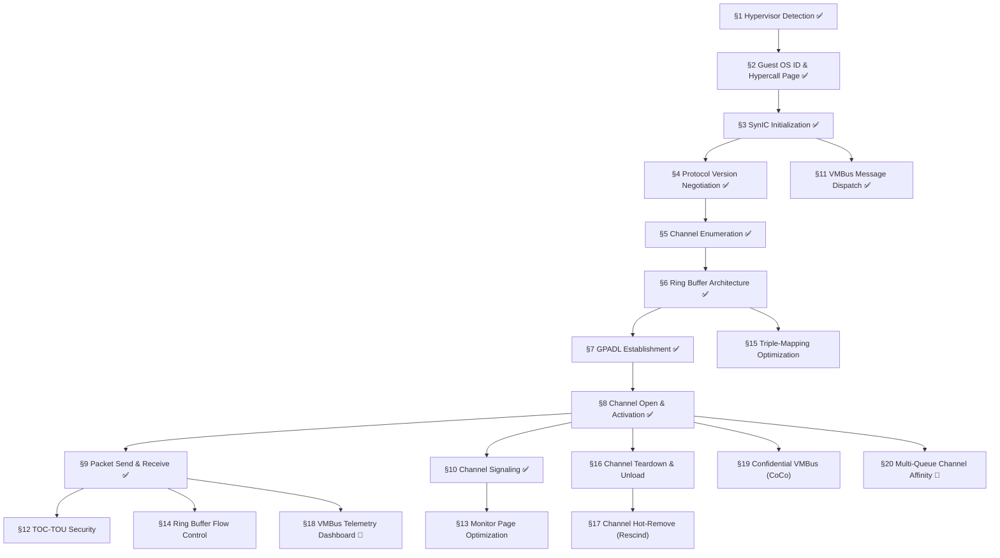

# 008.01-VMBus — VMBus Core Protocol

> **Goal:** Implement the complete Hyper-V Virtual Machine Bus (VMBus) core protocol —
> the foundation for ALL synthetic device communication on Hyper-V Generation 2.
> VMBus replaces legacy PCI/ISA device emulation with a high-performance, shared-memory
> inter-partition channel system. Without VMBus, no synthetic driver (SCSI, HID, video,
> NIC) can function.

> [!CAUTION]
> **Memory Rule:** Use `pmm_alloc_contiguous()` for ALL buffers > 4 KB (ring buffers,
> SynIC pages, monitor pages, GPADL memory). `kmalloc` is ONLY for small kernel structs
> (≤ 4 KB). See `rules.md` Known Gotchas and `/add-asset` workflow.

> [!IMPORTANT]
> **Spec Reference:** All section numbers, register offsets, and bit definitions reference the
> [VMBus Core Protocol Spec](file:///home/derickpayne/impossible-os/specs/hypervisors/hyper-v/vmbus-core-protocol.md)
> and the [Hyper-V TLFS](https://learn.microsoft.com/en-us/virtualization/hyper-v-on-windows/tlfs/tlfs)
> (public spec). Do NOT reference Linux `hv_vmbus.c` (GPL contamination risk).

> [!WARNING]
> **VMBus is the single point of failure for Hyper-V Gen 2.** If VMBus init fails,
> there is zero I/O capability — no storage, no input, no video, no networking.
> Every synthetic driver depends on a functioning VMBus stack.

---

## TODO Completion Roadmap

### Dependency Graph



### Phase-by-Phase Implementation Order

| ⭐ | P    | Section                                  | What It Delivers                                                   | Depends On       | Status |
| -- | :--: | ---------------------------------------- | ------------------------------------------------------------------ | ---------------- | :----: |
| 💎 | P1   | §1 Hypervisor Detection                  | CPUID detection, `PLATFORM_HYPERV` flag                            | —                |   ✅   |
| 💎 | P1   | §2 Guest OS ID & Hypercall Page          | Guest identity, hypercall trampoline                               | §1               |   ✅   |
| 💎 | P1   | §3 SynIC Initialization                  | SIM/SIEF pages, SINT2 vector 0xF0                                  | §2               |   ✅   |
| 💎 | P1   | §4 Protocol Version Negotiation          | 3-level version fallback handshake                                 | §3               |   ✅   |
| 💎 | P1   | §5 Channel Enumeration                   | Device discovery via OFFERCHANNEL                                  | §4               |   ✅   |
| 💎 | P2   | §6 Ring Buffer Architecture              | Shared-memory circular send/recv rings                             | §5               |   ✅   |
| 💎 | P2   | §7 GPADL Establishment                   | Guest→host physical memory sharing                                 | §6               |   ✅   |
| 💎 | P2   | §8 Channel Open & Activation             | Bidirectional data transfer                                        | §7               |   ✅   |
| 💎 | P2   | §9 Packet Send & Receive                 | vmpacket_descriptor framing, in-band + page buffer                 | §8               |   ✅   |
| 💎 | P2   | §10 Channel Signaling                    | HvCallSignalEvent for host notification                            | §8               |   ✅   |
| 💎 | P2   | §11 VMBus Message Dispatch               | SynIC interrupt handler, message processing                        | §3               |   ✅   |
| 💎 | P3   | §12 TOC-TOU Security Mitigations         | Ring buffer read audit — prevent shared-memory exploits            | §9               |   ⬜   |
| 💎 | P4   | §13 Monitor Page Optimization            | Passive signaling — eliminates per-signal VM-exit                  | §10              |   ⬜   |
| 💎 | P4   | §14 Ring Buffer Flow Control             | `pending_send_sz` — eliminates polling on ring-full                | §9               |   ⬜   |
| 💎 | P5   | §15 Triple-Mapping Optimization          | Eliminates split-copy at ring boundary                             | §6               |   ⬜   |
| 💎 | P5   | §16 Channel Teardown & Unload            | Orderly shutdown of VMBus stack                                    | §8               |   ⬜   |
| 💎 | P5   | §17 Channel Hot-Remove (Rescind)         | Dynamic device removal handling                                    | §16              |   ⬜   |
| ⭐ | P4   | §18 VMBus Telemetry Dashboard            | Per-channel latency histograms, IOPS counters                      | §9               |   ⬜   |
| 💎 | P6   | §19 Confidential VMBus (CoCo)            | Encrypted ring buffers for TDX/SEV guests                          | §8               |   ⬜   |
| ⭐ | P5   | §20 Multi-Queue Channel Affinity         | Per-vCPU channel distribution for high throughput                  | §8               |   ⬜   |

> [!NOTE]
> **Phases 1–2** are the complete VMBus init path — all done. **Phase 3** is security hardening.
> **Phase 4** adds performance optimizations. **Phase 5** adds teardown and advanced features.
> **Phase 6** is Confidential Computing support.

> [!TIP]
> **§12 TOC-TOU is the highest-priority unfinished item.** Without private-copy validation,
> a compromised host could exploit ring buffer reads to cause kernel buffer overflows.

---

## 1. Hypervisor Detection and Discovery ✅ *(agent)*

> **XREF:** [TODO-008-Hyper-V-Runner.md §3](../TODO-008-Hyper-V-Runner.md) — VMBus Core Protocol

**Prompt:** ~~Implement~~ **Verify** hypervisor detection. Confirm `cpuid_platform.c` reads
CPUID leaf `0x40000000` for vendor string `"Microsoft Hv"` and leaf `0x40000001` for
interface signature `"Hv#1"`. Verify feature MSRs are read via leaves `0x40000003`–`0x40000004`
to determine available hypercalls, SynIC support, and VMBus capabilities. Run
`bash scripts/build.sh clean` and confirm `=== BUILD OK ===`.

> [!NOTE]
> **Implementation Notes:**
> - `cpuid_platform.c` detects `"Microsoft Hv"` at leaf `0x40000000`, sets `PLATFORM_HYPERV`
> - `vmbus.c` re-checks leaf `0x40000001` for `"Hv#1"` interface signature
> - Feature MSRs from CPUID leaves `0x40000003`–`0x40000004` determine SynIC, hypercall page,
>   and timer capabilities

- [x] Read CPUID leaf `0x40000000` — vendor string `"Microsoft Hv"` (12 bytes: EBX+ECX+EDX)
- [x] Read CPUID leaf `0x40000001` — interface signature `"Hv#1"` (EAX)
- [x] Read CPUID leaf `0x40000003` — partition privileges (hypercalls, SynIC, timers)
- [x] Read CPUID leaf `0x40000004` — implementation recommendations (spinlock, APIC, MSRs)
- [x] Set `PLATFORM_HYPERV` flag for kernel-wide detection
- [x] Graceful exit on non-Hyper-V platforms (QEMU, VirtualBox, bare metal)
- [x] Commit: `"drivers: VMBus core protocol"`

---

## 2. Guest OS Identity and Hypercall Page ✅ *(agent)*

**Prompt:** ~~Implement~~ **Verify** guest OS identity registration and hypercall page setup.
Confirm `vmbus.c` writes the guest OS ID to `HV_X64_MSR_GUEST_OS_ID` (`0x40000000`) and
allocates a PMM-backed 4 KiB page for the hypercall code, placing its physical address into
`HV_X64_MSR_HYPERCALL` (`0x40000001`). Verify the hypervisor populates the page with
executable hypercall trampoline code. Run `bash scripts/build.sh clean` and confirm
`=== BUILD OK ===`.

> [!NOTE]
> **Implementation Notes:**
> - Guest OS ID format: `(os_id << 48) | (major << 32) | (minor << 16) | build`
> - Hypercall page is PMM-backed (`pmm_alloc_contiguous(1)` = 4 KiB)
> - Hypervisor writes executable `VMCALL`/`VMMCALL` trampoline code into the page
> - All subsequent hypercalls (`HvPostMessage`, `HvCallSignalEvent`) go through this page

- [x] Write guest OS ID to `HV_X64_MSR_GUEST_OS_ID` (`0x40000000`)
- [x] Allocate 4 KiB page via `pmm_alloc_contiguous(1)` for hypercall trampoline
- [x] Write page PFN + enable bit to `HV_X64_MSR_HYPERCALL` (`0x40000001`)
- [x] Verify hypervisor populated the page (read-back enable bit)
- [x] Implement `hv_do_hypercall(control, input_gpa, output_gpa)` via inline assembly
- [x] Test: `HvPostMessage` hypercall returns `HV_STATUS_SUCCESS`
- [x] Commit: `"drivers: VMBus core protocol"`

---

## 3. SynIC Initialization ✅ *(agent)*

**Prompt:** ~~Implement~~ **Verify** Synthetic Interrupt Controller (SynIC) setup. Confirm
`vmbus.c` allocates SIM (Synthetic Interrupt Message) and SIEF (Synthetic Interrupt Event
Flags) pages via PMM, writes their GPAs to MSRs `0x40000083` and `0x40000082`, configures
SINT2 with vector `0xF0` and AutoEOI, and enables SynIC via `HV_X64_MSR_SCONTROL`
(`0x40000080`). Run `bash scripts/build.sh clean` and confirm `=== BUILD OK ===`.

> [!NOTE]
> **Implementation Notes:**
> - SIM page (4 KiB): receives synthetic interrupt messages from hypervisor
> - SIEF page (4 KiB): 256-bit event flag arrays per SINT
> - SINT2 is conventionally used for VMBus (vector `0xF0`, AutoEOI enabled)
> - SynIC extends the LAPIC — SynIC init MUST occur after LAPIC init

### 3.1 SIM and SIEF Page Allocation

- [x] Allocate SIM page via `pmm_alloc_contiguous(1)` — zero-initialized
- [x] Write SIM page GPA to `HV_X64_MSR_SIMP` (`0x40000083`) with enable bit
- [x] Allocate SIEF page via `pmm_alloc_contiguous(1)` — zero-initialized
- [x] Write SIEF page GPA to `HV_X64_MSR_SIEFP` (`0x40000082`) with enable bit
- [x] Commit: `"drivers: VMBus core protocol"`

### 3.2 SINT Configuration

- [x] Configure SINT2: vector `0xF0`, AutoEOI = 1, masked = 0
- [x] Write to `HV_X64_MSR_SINT0 + 2` (`0x40000092`)
- [x] Register IDT handler at vector `0xF0` for VMBus message dispatch
- [x] Commit: `"drivers: VMBus core protocol"`

### 3.3 SynIC Enable

- [x] Write enable bit to `HV_X64_MSR_SCONTROL` (`0x40000080`)
- [x] Verify SynIC is active (read-back MSR)
- [x] Log: `[VMBus] SynIC initialized — SINT2 vector 0xF0`
- [x] Commit: `"drivers: VMBus core protocol"`

---

## 4. Protocol Version Negotiation ✅ *(agent)*

**Prompt:** ~~Implement~~ **Verify** VMBus protocol version negotiation. Confirm `vmbus.c`
sends `CHANNELMSG_INITIATE_CONTACT` with the highest supported version, waits for
`CHANNELMSG_VERSION_RESPONSE`, and falls back through progressively older versions on
rejection. Run `bash scripts/build.sh clean` and confirm `=== BUILD OK ===`.

> [!NOTE]
> **Implementation Notes:**
> - Negotiation uses `HvPostMessage` hypercall to send `INITIATE_CONTACT`
> - Response arrives via SynIC SIM page interrupt (SINT2)
> - Fallback chain: `VERSION_WIN10_V5_2` → `VERSION_WIN10` → `VERSION_WIN8_1`
> - `INITIATE_CONTACT` includes: version, target vCPU, SIM/SIEF page GPAs, monitor pages

### 4.1 Version Negotiation State Machine

| Version Macro          | Bitwise           | Windows Release           |
| ---------------------- | ----------------- | ------------------------- |
| `VERSION_WIN10_V5_2`   | `(5 << 16) \| 2`  | Windows Server 2019 (RS5) |
| `VERSION_WIN10`        | `(4 << 16) \| 0`  | Windows 10 RTM            |
| `VERSION_WIN8_1`       | `(3 << 16) \| 0`  | Windows 8.1               |

- [x] Build `CHANNELMSG_INITIATE_CONTACT` message with requested version
- [x] Include SIM page GPA, SIEF page GPA, target vCPU in contact message
- [x] Send via `HvPostMessage` hypercall (connection ID = `VMBUS_MESSAGE_CONNECTION_ID`)
- [x] Wait for `CHANNELMSG_VERSION_RESPONSE` on SIM page
- [x] If accepted (`version_supported == 1`): store negotiated version, proceed
- [x] If rejected: retry with next lower version in fallback chain
- [x] If all versions rejected: fail with `[VMBus] ERROR: no compatible protocol version`
- [x] Log: `[VMBus] Connected — protocol version X.Y`
- [x] Commit: `"drivers: VMBus core protocol"`

---

## 5. Channel Enumeration and Offer Processing ✅ *(agent)*

**Prompt:** ~~Implement~~ **Verify** VMBus channel enumeration. Confirm `vmbus.c` sends
`CHANNELMSG_REQUESTOFFERS` after version negotiation, processes incoming
`CHANNELMSG_OFFERCHANNEL` messages to build an internal channel table (class GUID, instance
GUID, child relid, monitor ID), and waits for `CHANNELMSG_ALLOFFERS_DELIVERED` to signal
enumeration completion. Run `bash scripts/build.sh clean` and confirm `=== BUILD OK ===`.

> [!NOTE]
> **Implementation Notes:**
> - Each `OFFERCHANNEL` message contains: `if_type` (class GUID), `if_instance` (unique ID),
>   `child_relid` (channel ID), `monitorid`, `monitor_allocated`
> - Channel table stores all offered devices for later lookup by GUID
> - Well-known GUIDs identify device type (StorVSC, HID, Video, NetVSC, Shutdown)
> - `vmbus_find_channel_by_guid()` enables VSC drivers to locate their channels

### 5.1 Well-Known Device GUIDs

| Device                   | Class GUID                               |
| ------------------------ | ---------------------------------------- |
| Synthetic SCSI (storvsc) | `BA6163D9-04A1-4D29-B605-72E2FFB1DC7F`   |
| Synthetic Keyboard (HID) | `F912AD6D-2B17-48EA-BD65-F927A61C7684`   |
| Synthetic Mouse (HID)    | `CFA8B69E-5B4A-4CC0-B98B-8BA1A1F3F95A`   |
| Synthetic Video (hvfb)   | `DA0A7802-E377-4AAC-8E77-0558EB1073F8`   |
| Synthetic NIC (netvsc)   | `F8615163-DF3E-46C5-913F-F2D2F965ED0E`   |
| Shutdown VSP             | `0E0B6031-5213-4934-818B-38D90CED39DB`   |

- [x] Send `CHANNELMSG_REQUESTOFFERS` via `HvPostMessage`
- [x] Process incoming `CHANNELMSG_OFFERCHANNEL` messages
- [x] Store channel offers in internal table: class GUID, instance GUID, `child_relid`, `monitorid`
- [x] Match class GUIDs against well-known device GUIDs
- [x] Wait for `CHANNELMSG_ALLOFFERS_DELIVERED` signal
- [x] Implement `vmbus_find_channel_by_guid(guid)` — lookup by class GUID
- [x] Log each offer: `[VMBus] Offer: <device_name> (relid=%u)`
- [x] Log: `[VMBus] Enumeration complete — %u channels offered`
- [x] Commit: `"drivers: VMBus core protocol"`

---

## 6. Ring Buffer Architecture ✅ *(agent)*

> **XREF:** [vmbus-core-protocol.md §3](file:///home/derickpayne/impossible-os/specs/hypervisors/hyper-v/vmbus-core-protocol.md) — Ring Buffer Fundamentals

**Prompt:** ~~Implement~~ **Verify** ring buffer allocation and management. Confirm
`vmbus.c` allocates contiguous physical memory via `pmm_alloc_contiguous()` for each
channel's send and receive rings, structures the 4 KiB header + data layout, and implements
`vmbus_ring_write()` / `vmbus_ring_read()` with proper wrap-around handling. Run
`bash scripts/build.sh clean` and confirm `=== BUILD OK ===`.

> [!NOTE]
> **Implementation Notes:**
> - Each channel has two rings: "out" (guest→host) and "in" (host→guest)
> - Ring layout: 4 KiB header page + N data pages (configurable per VSC driver)
> - Header contains: `write_index`, `read_index`, `interrupt_mask`, `pending_send_size`
> - Ring buffer memory is shared with host via GPADL — uses PMM, NOT kmalloc
> - Wrap-around handled via explicit two-chunk `vmbus_memcpy()` calls

### 6.1 Ring Buffer Memory Layout

```
┌─────────────────┐  ← 4 KiB header page
│  Ring Header     │     (read/write indices, flow control flags)
├─────────────────┤  ← Data payload area (N pages)
│  Ring Data       │     Size set by VSC driver during channel init
│  (circular)      │
└─────────────────┘
```

- [x] Allocate ring buffer memory via `pmm_alloc_contiguous()`
- [x] Structure ring header: `write_index`, `read_index`, `interrupt_mask`, `pending_send_size`
- [x] Implement `vmbus_ring_write()` — write data with wrap-around at ring boundary
- [x] Implement `vmbus_ring_read()` — read data with wrap-around at ring boundary
- [x] Handle empty condition: `read_index == write_index`
- [x] Handle full condition: always retain 1 byte unused
- [x] Insert memory barriers (`mfence`, `sfence`) between index updates and data access
- [x] Commit: `"drivers: VMBus core protocol"`

---

## 7. GPADL Establishment ✅ *(agent)*

> **XREF:** [vmbus-core-protocol.md §5](file:///home/derickpayne/impossible-os/specs/hypervisors/hyper-v/vmbus-core-protocol.md) — Memory Management and GPADL Mechanics

**Prompt:** ~~Implement~~ **Verify** Guest Physical Address Descriptor List (GPADL) creation.
Confirm `vmbus.c` packages ring buffer physical page frame numbers (PFNs) into
`CHANNELMSG_GPADL_HEADER` (and `CHANNELMSG_GPADL_BODY` if fragmented), sends them via
`HvPostMessage`, and waits for `CHANNELMSG_GPADL_CREATED` confirmation. Run
`bash scripts/build.sh clean` and confirm `=== BUILD OK ===`.

> [!NOTE]
> **Implementation Notes:**
> - GPADL shares guest physical memory with host for ring buffers and transfer buffers
> - PFN list translates guest physical addresses to hypervisor page frame numbers
> - If PFN list exceeds single message capacity, fragmentation via `GPADL_BODY` is used
> - GPADL teardown requires synchronous `GPADL_TEARDOWN` → `GPADL_TORNDOWN` handshake

> [!CAUTION]
> Freeing memory before receiving `GPADL_TORNDOWN` risks use-after-free in the hypervisor.
> The guest **must** synchronously block until confirmation arrives.

- [x] Implement `vmbus_create_gpadl(channel, buffer, size)` → GPADL handle
- [x] Build PFN list from contiguous physical buffer (guest → hypervisor page translations)
- [x] Send `CHANNELMSG_GPADL_HEADER` with `child_relid`, `gpadl_id`, PFN array start
- [x] If PFN list fragmented: send `CHANNELMSG_GPADL_BODY` with remaining PFNs
- [x] Wait for `CHANNELMSG_GPADL_CREATED` — check `creation_status == 0`
- [x] Implement `vmbus_create_gpadl_external()` for external transfer buffers (StorVSC)
- [x] Commit: `"drivers: VMBus core protocol"`

---

## 8. Channel Open and Activation ✅ *(agent)*

**Prompt:** ~~Implement~~ **Verify** channel opening. Confirm `vmbus.c` sends
`CHANNELMSG_OPENCHANNEL` with the ring buffer GPADL handle, byte offset splitting send/recv
rings, `child_relid`, and `openid`. Verify host replies with
`CHANNELMSG_OPENCHANNEL_RESULT` (`status == 0` → success). Run `bash scripts/build.sh clean`
and confirm `=== BUILD OK ===`.

> [!NOTE]
> **Implementation Notes:**
> - `OPENCHANNEL` bundles: `child_relid`, `openid`, GPADL handle, ring buffer byte offset
> - Byte offset splits the GPADL into send ring (first half) and recv ring (second half)
> - On success (`status == 0`), channel enters active bidirectional data transfer state
> - Per-VSC drivers call `vmbus_open_channel()` after enumeration

- [x] Implement `vmbus_open_channel(channel, ring_pages, callback)`
- [x] Allocate ring buffer memory (send + recv) via `pmm_alloc_contiguous()`
- [x] Create GPADL for combined ring buffer memory
- [x] Send `CHANNELMSG_OPENCHANNEL` with GPADL handle, byte offset, relid
- [x] Wait for `CHANNELMSG_OPENCHANNEL_RESULT` — check `status == 0`
- [x] On success: channel is active, data can flow via ring buffers
- [x] On failure: log error code, free ring buffer memory, report to VSC driver
- [x] Commit: `"drivers: VMBus core protocol"`

---

## 9. Packet Send and Receive ✅ *(agent)*

> **XREF:** [vmbus-core-protocol.md §4](file:///home/derickpayne/impossible-os/specs/hypervisors/hyper-v/vmbus-core-protocol.md) — VMBus Message Types and Packet Anatomy

**Prompt:** ~~Implement~~ **Verify** packet send/receive over open channels. Confirm
`vmbus.c` implements `vmbus_sendpacket()` for in-band data and
`vmbus_sendpacket_pagebuffer()` for transfer page packets. Verify `vmbus_recvpacket()`
strips the `vmpacket_descriptor` header and returns payload only. Run
`bash scripts/build.sh clean` and confirm `=== BUILD OK ===`.

> [!NOTE]
> **Implementation Notes:**
> - All packets prepended with `vmpacket_descriptor` (16 bytes): type, offset8, len8, flags, trans_id
> - `offset8` and `len8` are in **8-byte granularity** — bit-shift left by 3 for true bytes
> - Transaction IDs must be unique per channel — host uses them for completion matching
> - Trailing 64-bit `prev_pkt_start_offset` follows every packet in the ring
> - Packets 8-byte aligned with padding as needed

### 9.1 Packet Types

| Enum Value | Constant                     | Description                                       |
| :--------: | ---------------------------- | ------------------------------------------------- |
|    0x06    | `VM_PKT_DATA_INBAND`         | Payload immediately follows descriptor in ring    |
|    0x07    | `VM_PKT_DATA_USING_XFER_PAGES` | Payload in GPADL transfer buffer, not in ring  |
|    0x08    | `VM_PKT_DATA_USING_GPADL`    | Payload in separate GPADL memory window           |
|    0x0b    | `VM_PKT_COMP`                | Completion acknowledgment for a previous trans_id |

- [x] Implement `vmbus_sendpacket(channel, data, len, trans_id, type)` — in-band data send
- [x] Implement `vmbus_sendpacket_pagebuffer(channel, pages, data, len, trans_id)` — transfer page send
- [x] Implement `vmbus_recvpacket(channel, buf, buflen, recvlen)` — receive and strip header
- [x] Construct `vmpacket_descriptor` with correct `offset8`, `len8`, `flags`, `trans_id`
- [x] Append 8-byte aligned padding + trailing `prev_pkt_start_offset`
- [x] Signal channel after write via `vmbus_signal_channel()`
- [x] Commit: `"drivers: VMBus core protocol"`

---

## 10. Channel Signaling ✅ *(agent)*

> **XREF:** [vmbus-core-protocol.md §7](file:///home/derickpayne/impossible-os/specs/hypervisors/hyper-v/vmbus-core-protocol.md) — Interrupt Signaling

**Prompt:** ~~Implement~~ **Verify** channel signaling. Confirm `vmbus.c` implements
`vmbus_signal_channel()` using the `HvCallSignalEvent` hypercall (call code `0x005D`)
through the hypercall page. The input is the channel's `child_relid`. Run
`bash scripts/build.sh clean` and confirm `=== BUILD OK ===`.

> [!NOTE]
> **Implementation Notes:**
> - Active path: `HvCallSignalEvent(child_relid)` → sets event flag bit in host's SIEF page
> - Monitor page (passive path) is a future optimization — not currently implemented
> - Signaling occurs after every ring buffer write to notify the host VSP

- [x] Implement `vmbus_signal_channel(channel)` — fire `HvCallSignalEvent` hypercall
- [x] Pass `child_relid` as input parameter to hypercall
- [x] Execute via hypercall page (allocated in §2)
- [x] Log errors: check hypercall return status
- [x] Commit: `"drivers: VMBus core protocol"`

---

## 11. VMBus Message Dispatch ✅ *(agent)*

**Prompt:** ~~Implement~~ **Verify** the SynIC interrupt handler for VMBus message dispatch.
Confirm the IDT handler at vector `0xF0` reads pending messages from the SIM page, dispatches
them by `msg_type` to the appropriate handler (version response, channel offer, GPADL created,
open result, etc.), and writes `HV_MESSAGE_TYPE_NONE` to acknowledge. Verify `EOM` MSR is
written if more messages are pending. Run `bash scripts/build.sh clean` and confirm
`=== BUILD OK ===`.

> [!NOTE]
> **Implementation Notes:**
> - SIM page slot for SINT2 contains: `msg_type` (32-bit), `payload_size`, `msg_flags`, payload
> - After processing: write `HV_MESSAGE_TYPE_NONE` (0) to `msg_type` to acknowledge
> - If `msg_flags & MSG_PENDING != 0`: write to `HV_X64_MSR_EOM` to drain pending queue
> - Message handling must be fast — SynIC holds the message slot until acknowledged

- [x] Register IDT handler at vector `0xF0` for SynIC SINT2
- [x] Read message from SIM page: check `msg_type != HV_MESSAGE_TYPE_NONE`
- [x] Dispatch by `msg_type`:
  - [x] `CHANNELMSG_VERSION_RESPONSE` → wake version negotiation waiter
  - [x] `CHANNELMSG_OFFERCHANNEL` → add to channel table
  - [x] `CHANNELMSG_ALLOFFERS_DELIVERED` → signal enumeration complete
  - [x] `CHANNELMSG_GPADL_CREATED` → wake GPADL creation waiter
  - [x] `CHANNELMSG_OPENCHANNEL_RESULT` → wake channel open waiter
  - [x] `CHANNELMSG_RESCIND_CHANNELOFFER` → handle device hot-remove
- [x] Acknowledge: write `HV_MESSAGE_TYPE_NONE` to `msg_type`
- [x] If `MSG_PENDING` flag set: write to `HV_X64_MSR_EOM` (`0x40000084`)
- [x] Commit: `"drivers: VMBus core protocol"`

---

## 12. TOC-TOU Security Mitigations

> **XREF:** [vmbus-core-protocol.md §9](file:///home/derickpayne/impossible-os/specs/hypervisors/hyper-v/vmbus-core-protocol.md) — Security Paradigms

**Prompt:** Audit all VMBus ring buffer read paths for Time-of-Check to Time-of-Use
(TOC-TOU) vulnerabilities. Ensure all messages from the "in" ring buffer are first copied
to private, unshared kernel memory before validation. Verify no code path validates fields
while they remain in shared ring buffer memory. Add `READ_ONCE()` macro for atomic index
reads. After completing all items, mark every item as `[x]`, run `bash scripts/build.sh clean`,
and commit as `"hyperv: VMBus TOC-TOU security audit"`. Add notes directly in this TODO section. After implementation, save any gotchas, solutions, and important information to MCP memory (`mcp_memory_create_entities` / `mcp_memory_add_observations`).

> [!WARNING]
> **Attack vector:** A compromised host could modify ring buffer packet fields (e.g., `len8`)
> between the guest's validation check and `memcpy` — causing buffer overflow. All validation
> MUST occur against private copies of ring buffer data.

- [ ] Audit `vmbus_recvpacket()` — verify payload is copied to stack/private buffer before validation
- [ ] Audit `vmbus_ring_read()` — verify indices are read atomically via `READ_ONCE()`
- [ ] Implement `READ_ONCE(x)` macro: `(*(volatile typeof(x) *)&(x))`
- [ ] Verify `vmpacket_descriptor` fields validated from private copy, not ring buffer
- [ ] Verify `offset8` and `len8` bounds-checked against ring buffer size
- [ ] Audit StorVSC: `VSTOR_PACKET` fields validated from private buffer
- [ ] Audit HID input: `INPUT_REPORT` data validated from private buffer
- [ ] Log security-relevant events: `[VMBus] WARN: malformed packet (len8 overflow)`
- [ ] Commit: `"hyperv: VMBus TOC-TOU security audit"`

---

## 13. Monitor Page Optimization

> **XREF:** [vmbus-core-protocol.md §7.2](file:///home/derickpayne/impossible-os/specs/hypervisors/hyper-v/vmbus-core-protocol.md) — Monitor Page

**Prompt:** Implement monitor page signaling as an optimization over the `HvCallSignalEvent`
hypercall. Instead of executing a hypercall per signal, the guest modifies specific bits
in the 4 KiB monitor page via `sync_set_bit()`. The hypervisor hardware passively monitors
this page and fires coalesced synthetic interrupts. This eliminates per-signal VM-exit
overhead. After completing all items, mark every item as `[x]`, run `bash scripts/build.sh clean`,
and commit as `"hyperv: VMBus monitor page signaling"`. Add notes directly in this TODO section. After implementation, save any gotchas, solutions, and important information to MCP memory (`mcp_memory_create_entities` / `mcp_memory_add_observations`).

- [ ] Allocate guest-to-host monitor page via `pmm_alloc_contiguous(1)`
- [ ] Pass monitor page GPA in `CHANNELMSG_INITIATE_CONTACT`
- [ ] For channels with `monitor_allocated == true`: use monitor page instead of hypercall
- [ ] Implement `sync_set_bit()` — atomic bitwise OR on monitor page trigger group
- [ ] Map channel `monitorid` to `trigger_group[group].pending` bit `(monitorid & 0x1F)`
- [ ] Fallback: use `HvCallSignalEvent` for channels without monitor allocation
- [ ] Benchmark: compare hypercall signaling vs monitor page signaling latency
- [ ] Commit: `"hyperv: VMBus monitor page signaling"`

---

## 14. Ring Buffer Flow Control

> **XREF:** [vmbus-core-protocol.md §3.3](file:///home/derickpayne/impossible-os/specs/hypervisors/hyper-v/vmbus-core-protocol.md) — Flow Control

**Prompt:** Implement interrupt-driven ring buffer flow control using the `feat_pending_send_sz`
feature bit. When the guest cannot send because the ring is full, it writes the required
byte count to `pending_send_sz` in the ring header. When the host consumes data and frees
enough space, the guest fires a targeted interrupt to wake the host. This eliminates polling
entirely. After completing all items, mark every item as `[x]`, run `bash scripts/build.sh clean`,
and commit as `"hyperv: VMBus ring buffer flow control"`. Add notes directly in this TODO section. After implementation, save any gotchas, solutions, and important information to MCP memory (`mcp_memory_create_entities` / `mcp_memory_add_observations`).

- [ ] Set `feat_pending_send_sz` bit in guest-to-host ring header `feature_bits`
- [ ] On send failure (ring full): write required bytes to `pending_send_sz`
- [ ] On receive (ring data consumed): check if freed space ≥ host's `pending_send_sz`
- [ ] If sufficient space freed: fire interrupt to wake host sender
- [ ] Clear `pending_send_sz` after signaling
- [ ] Handle `interrupt_mask` flag: suppress signaling during bulk processing
- [ ] Commit: `"hyperv: VMBus ring buffer flow control"`

---

## 15. Triple-Mapping Virtual Address Optimization

> **XREF:** [vmbus-core-protocol.md §3.2](file:///home/derickpayne/impossible-os/specs/hypervisors/hyper-v/vmbus-core-protocol.md) — Triple-Mapping

**Prompt:** Implement the triple-mapping optimization for ring buffer virtual addresses.
Map ring data pages three times in contiguous virtual space: (1) header page,
(2) data payload, (3) duplicate mapping of same physical data. This eliminates split-copy
overhead when `memcpy()` crosses the ring boundary. After completing all items, mark every
item as `[x]`, run `bash scripts/build.sh clean`, and commit as
`"hyperv: VMBus ring buffer triple-mapping"`. Add notes directly in this TODO section. After implementation, save any gotchas, solutions, and important information to MCP memory (`mcp_memory_create_entities` / `mcp_memory_add_observations`).

> [!WARNING]
> **Requires virtual memory management.** Triple-mapping requires the ability to map
> the same physical pages at multiple virtual addresses. This depends on the page table
> management infrastructure (TODO-023-Virtual-Memory.md).

- [ ] Reserve 3×N virtual address range for each ring buffer (header + data + data mirror)
- [ ] Map physical data pages at virtual offset `header_size` (normal mapping)
- [ ] Map same physical data pages at virtual offset `header_size + data_size` (mirror)
- [ ] Replace two-chunk `vmbus_memcpy()` with single `memcpy()` for ring read/write
- [ ] Verify wrap-around reads/writes seamlessly continue into mirror mapping
- [ ] Benchmark: compare two-chunk copy vs triple-mapped single copy latency
- [ ] Fallback: retain two-chunk copy if virtual memory mapping unavailable
- [ ] Commit: `"hyperv: VMBus ring buffer triple-mapping"`

---

## 16. Channel Teardown and VMBus Unload

**Prompt:** Implement orderly channel teardown and full VMBus stack unload. For individual
channels: send `CHANNELMSG_CLOSECHANNEL`, tear down GPADLs via `GPADL_TEARDOWN` →
`GPADL_TORNDOWN`, free ring buffer memory. For full VMBus unload: send
`CHANNELMSG_UNLOAD`, wait for `CHANNELMSG_UNLOAD_RESPONSE`, disable SynIC, free all pages.
After completing all items, mark every item as `[x]`, run `bash scripts/build.sh clean`,
and commit as `"hyperv: VMBus channel teardown and unload"`. Add notes directly in this
TODO section.

- [ ] Implement `vmbus_close_channel(channel)`:
  - [ ] Send `CHANNELMSG_CLOSECHANNEL` with `child_relid`
  - [ ] Send `CHANNELMSG_GPADL_TEARDOWN` for ring buffer GPADL
  - [ ] Wait for `CHANNELMSG_GPADL_TORNDOWN` — synchronous block required
  - [ ] Free ring buffer memory via PMM
  - [ ] Remove channel from internal table
- [ ] Implement `vmbus_unload()`:
  - [ ] Close all open channels
  - [ ] Send `CHANNELMSG_UNLOAD`
  - [ ] Wait for `CHANNELMSG_UNLOAD_RESPONSE`
  - [ ] Disable SynIC: clear `HV_X64_MSR_SCONTROL`
  - [ ] Free SIM page, SIEF page, hypercall page
  - [ ] Clear `HV_X64_MSR_GUEST_OS_ID`
- [ ] Log: `[VMBus] Unloaded — all channels closed`
- [ ] Commit: `"hyperv: VMBus channel teardown and unload"`

---

## 17. Channel Hot-Remove (Rescind)

**Prompt:** Implement handling for `CHANNELMSG_RESCIND_CHANNELOFFER` — the host's mechanism
for hot-removing synthetic devices at runtime. When a rescind message arrives, the driver
must quiesce the affected VSC, close the channel, tear down GPADLs, and notify the device
layer. After completing all items, mark every item as `[x]`, run `bash scripts/build.sh clean`,
and commit as `"hyperv: VMBus channel rescind handling"`. Add notes directly in this TODO section. After implementation, save any gotchas, solutions, and important information to MCP memory (`mcp_memory_create_entities` / `mcp_memory_add_observations`).

- [ ] Handle `CHANNELMSG_RESCIND_CHANNELOFFER` in message dispatch
- [ ] Look up channel by `child_relid` from rescind message
- [ ] Notify VSC driver: call registered `on_rescind` callback
- [ ] VSC driver: drain pending I/O, fail new requests with `-ENODEV`
- [ ] Close channel: `vmbus_close_channel()` (§16 teardown path)
- [ ] Remove channel from offer table
- [ ] Log: `[VMBus] Channel rescinded: relid=%u (device hot-remove)`
- [ ] Commit: `"hyperv: VMBus channel rescind handling"`

---

## 18. VMBus Telemetry Dashboard 🚀

**Prompt:** Implement per-channel VMBus performance telemetry: nanosecond-resolution latency histograms (send, receive, signal), IOPS counters, ring buffer utilization percentage, and packet error rates. Expose metrics via a kernel API queryable from user-mode (e.g., `vmbus_get_channel_stats(relid)` syscall). Neither Windows nor Linux exposes per-channel VMBus telemetry at this granularity — this is an Impossible OS exclusive. After completing all items, mark every item as `[x]`, update this prompt to a verification prompt, run `bash scripts/build.sh clean`, and commit as `"hyperv: VMBus telemetry dashboard"`. Add notes directly in this TODO section. After implementation, save any gotchas, solutions, and important information to MCP memory (`mcp_memory_create_entities` / `mcp_memory_add_observations`).

> [!TIP]
> **Neither Windows nor Linux** exposes per-channel VMBus latency histograms or IOPS
> counters to user-mode. Windows has `Get-VMBusChannel` in PowerShell but it only shows
> basic state. Linux has `/sys/bus/vmbus/devices/*/channel_vp_mapping` but nothing for
> latency or throughput. This is a genuine competitive advantage.

- [ ] Add `vmbus_channel_stats` struct: `tx_packets`, `rx_packets`, `tx_bytes`, `rx_bytes`, `signal_count`, `avg_latency_ns`, `max_latency_ns`, `ring_util_pct`
- [ ] Instrument `vmbus_sendpacket()` — increment `tx_packets`/`tx_bytes`, record send latency
- [ ] Instrument `vmbus_recvpacket()` — increment `rx_packets`/`rx_bytes`
- [ ] Instrument `vmbus_signal_channel()` — increment `signal_count`
- [ ] Calculate ring buffer utilization: `(write_idx - read_idx) / ring_size × 100`
- [ ] Add `vmbus_get_channel_stats(relid)` kernel API
- [ ] Expose via registry: `HKLM\SYSTEM\Drivers\VMBus\Channels\<relid>\Stats`
- [ ] Log summary on shutdown: `[VMBus] Channel %u: %u packets, avg %u ns latency`
- [ ] Commit: `"hyperv: VMBus telemetry dashboard"`

---

## 19. Confidential VMBus (CoCo / TDX / SEV)

**Prompt:** Implement Confidential Computing support for VMBus ring buffers. In Intel TDX or AMD SEV environments, guest memory is encrypted and the hypervisor cannot read ring buffer contents. The guest must use bounce buffers for all shared memory, explicitly accept/decrypt pages shared with the host, and use `HVCALL_MMIO_READ/WRITE` instead of direct MMIO. This aligns with Linux 6.18's Confidential VMBus support. After completing all items, mark every item as `[x]`, update this prompt to a verification prompt, run `bash scripts/build.sh clean`, and commit as `"hyperv: Confidential VMBus support"`. Add notes directly in this TODO section. After implementation, save any gotchas, solutions, and important information to MCP memory (`mcp_memory_create_entities` / `mcp_memory_add_observations`).

> [!WARNING]
> **Depends on §8 (Channel Open) and TODO-008.06 (MMIO Safety).** Confidential VMBus
> requires both the page visibility transition infrastructure (PRESENT bit shield) and
> the explicit MMIO hypercalls from the MMIO Safety TODO.

- [ ] Detect Confidential Computing mode via CPUID leaf `0x40000006` (isolation config)
- [ ] If CoCo: allocate ring buffers as "shared" pages (explicit guest→host visibility)
- [ ] Implement page visibility transition: `hv_set_page_visibility(gpa, shared|private)`
- [ ] Use bounce buffers for all DMA: copy private→shared before send, shared→private after recv
- [ ] Validate ring buffer integrity after each receive (CoCo host could tamper with shared memory)
- [ ] Wire into §12 TOC-TOU mitigations — CoCo strengthens the security requirement
- [ ] Log: `[VMBus] Confidential Computing mode — encrypted ring buffers active`
- [ ] Commit: `"hyperv: Confidential VMBus support"`

---

## 20. Multi-Queue Channel Affinity 🚀

**Prompt:** Implement per-vCPU VMBus channel affinity for high-throughput synthetic drivers. StorVSC and NetVSC on modern Hyper-V hosts support multiple sub-channels — one per vCPU — to achieve line-rate I/O without cross-CPU contention. The VMBus layer should negotiate sub-channels via `CHANNELMSG_OPEN_CHANNEL_REQUESTMULTISUBCHANNELS`, pin each sub-channel to a specific vCPU's SynIC SINT, and expose channel selection to VSC drivers. After completing all items, mark every item as `[x]`, update this prompt to a verification prompt, run `bash scripts/build.sh clean`, and commit as `"hyperv: VMBus multi-queue channel affinity"`. Add notes directly in this TODO section. After implementation, save any gotchas, solutions, and important information to MCP memory (`mcp_memory_create_entities` / `mcp_memory_add_observations`).

> [!TIP]
> **Why this matters:** On a 4-vCPU VM, single-queue VMBus channels serialize all I/O
> through one CPU. With multi-queue, each vCPU has its own ring buffer — achieving near-linear
> throughput scaling. Windows uses this natively, Linux uses RSS. Impossible OS will support
> both automatic (round-robin) and manual (pinned) sub-channel distribution.

- [ ] Detect host multi-channel capability in `CHANNELMSG_OFFERCHANNEL` flags
- [ ] Send `CHANNELMSG_OPEN_CHANNEL_REQUESTMULTISUBCHANNELS` with requested count = `cpu_count`
- [ ] Process sub-channel offers — each gets its own ring buffer pair and GPADL
- [ ] Pin each sub-channel to a vCPU: set `target_vcpu` in `OPENCHANNEL`
- [ ] Implement `vmbus_select_subchannel(channel, cpu_id)` for VSC drivers
- [ ] Automatic mode: round-robin sub-channel selection based on current CPU
- [ ] Expose configuration via registry: `HKLM\SYSTEM\Drivers\VMBus\MultiQueue\Enabled`
- [ ] Benchmark: compare single-queue vs multi-queue StorVSC IOPS at 2/4/8 vCPUs
- [ ] Commit: `"hyperv: VMBus multi-queue channel affinity"`

---

## Priority Order

| ⭐ | Priority | Section                                  | Description                                                      |
| -- | :------: | ---------------------------------------- | ---------------------------------------------------------------- |
| 💎 | ✅ Done  | §1 Hypervisor Detection                  | CPUID detection — `cpuid_platform.c` + `vmbus.c`                |
| 💎 | ✅ Done  | §2 Guest OS ID & Hypercall Page          | MSR writes + PMM-backed hypercall trampoline                     |
| 💎 | ✅ Done  | §3 SynIC Initialization                  | SIM/SIEF pages, SINT2 vector 0xF0, SynIC enable                 |
| 💎 | ✅ Done  | §4 Protocol Version Negotiation          | 3-level fallback: V5.2 → V5.0 → V4.0                            |
| 💎 | ✅ Done  | §5 Channel Enumeration                   | REQUESTOFFERS → OFFERCHANNEL → ALLOFFERS_DELIVERED               |
| 💎 | ✅ Done  | §6 Ring Buffer Architecture              | PMM-backed ring buffers with wrap-around read/write              |
| 💎 | ✅ Done  | §7 GPADL Establishment                   | Guest→host memory sharing for ring buffers + transfer buffers    |
| 💎 | ✅ Done  | §8 Channel Open & Activation             | OPENCHANNEL → OPENCHANNEL_RESULT → active data transfer          |
| 💎 | ✅ Done  | §9 Packet Send & Receive                 | vmpacket_descriptor framing, in-band + transfer page packets     |
| 💎 | ✅ Done  | §10 Channel Signaling                    | HvCallSignalEvent hypercall for channel notifications            |
| 💎 | ✅ Done  | §11 VMBus Message Dispatch               | SynIC interrupt handler, SIM page message processing             |
| 💎 | 🔴 P0   | §12 TOC-TOU Security Mitigations         | Ring buffer read audit — prevent shared-memory exploits          |
| 💎 | 🟡 P2   | §13 Monitor Page Optimization            | Passive signaling — eliminates per-signal VM-exit overhead       |
| 💎 | 🟡 P2   | §14 Ring Buffer Flow Control             | `pending_send_sz` — eliminates polling on ring-full              |
| ⭐ | 🟡 P2   | §18 VMBus Telemetry Dashboard            | Per-channel latency histograms, IOPS counters 🚀                 |
| 💎 | 🟢 P3   | §15 Triple-Mapping Optimization          | Eliminates split-copy at ring boundary                           |
| 💎 | 🟢 P3   | §16 Channel Teardown & Unload            | Orderly shutdown of VMBus stack                                  |
| 💎 | 🟢 P3   | §17 Channel Hot-Remove (Rescind)         | Dynamic device removal via CHANNELMSG_RESCIND                    |
| ⭐ | 🟢 P3   | §20 Multi-Queue Channel Affinity         | Per-vCPU channel distribution for high throughput 🚀              |
| 💎 | 🔵 P4   | §19 Confidential VMBus (CoCo)            | Encrypted ring buffers for TDX/SEV guests                        |

---

## OS Comparison

| ⭐ | Feature                              | 🪟 Windows 11 (Native)            | 🐧 Linux (`hv_vmbus.ko`)              | 🚀 Impossible OS                                |
| -- | ------------------------------------ | ---------------------------------- | --------------------------------------- | ------------------------------------------------ |
| 💎 | CPUID detection                      | ✅ Native (built-in)               | ✅ `ms_hyperv_init_platform()`         | ✅ `cpuid_platform.c` — Done §1                 |
| 💎 | Hypercall page setup                 | ✅ Native                          | ✅ `hv_init()`                         | ✅ `vmbus.c` — Done §2                           |
| 💎 | SynIC initialization                 | ✅ Native                          | ✅ `hv_synic_init()`                   | ✅ `vmbus.c` — Done §3                           |
| 💎 | Version negotiation                  | ✅ Native                          | ✅ `vmbus_negotiate_version()`         | ✅ `vmbus_connect()` — Done §4                   |
| 💎 | Channel enumeration                  | ✅ Native                          | ✅ `vmbus_process_offer()`             | ✅ `vmbus_enumerate()` — Done §5                 |
| 💎 | Ring buffer I/O                      | ✅ Native                          | ✅ `hv_ringbuffer_write/read()`        | ✅ `vmbus_ring_write/read()` — Done §6           |
| 💎 | GPADL management                     | ✅ Native                          | ✅ `vmbus_establish_gpadl()`           | ✅ `vmbus_create_gpadl()` — Done §7              |
| 💎 | Channel open/close                   | ✅ Native                          | ✅ `vmbus_open()`                      | ✅ `vmbus_open_channel()` — Done §8              |
| 💎 | Packet send/receive                  | ✅ Native                          | ✅ `vmbus_sendpacket()`                | ✅ `vmbus_sendpacket()` — Done §9                |
| 💎 | Channel signaling                    | ✅ HvCallSignalEvent + monitor     | ✅ Both paths                          | ✅ HvCallSignalEvent only — Done §10             |
| 💎 | SynIC message dispatch               | ✅ Native                          | ✅ `vmbus_on_msg_dpc()`                | ✅ `vmbus_irq_handler()` — Done §11              |
| 💎 | TOC-TOU mitigations                  | ✅ Private copy validation         | ✅ `READ_ONCE()` + copy validation     | ⬜ §12 P0 — audit needed                        |
| 💎 | Monitor page signaling               | ✅ Passive + active                | ✅ `hv_signal_on_write()`              | ⬜ §13 P2 — hypercall only                      |
| 💎 | Ring buffer flow control             | ✅ `pending_send_sz`               | ✅ `hv_need_to_signal_on_read()`       | ⬜ §14 P2 — no flow control                     |
| 💎 | Triple-mapping rings                 | ✅ Native                          | ✅ `hv_ringbuffer_init()`              | ⬜ §15 P3 — two-chunk copy                      |
| 💎 | Orderly teardown                     | ✅ Integration Services            | ✅ `vmbus_close()` + `vmbus_exit()`    | ⬜ §16 P3 — no teardown path                    |
| 💎 | Channel rescind handling             | ✅ Native hot-remove               | ✅ `vmbus_onoffer_rescind()`           | ⬜ §17 P3 — not handled                         |
| ⭐ | **Per-channel telemetry**            | ❌ PowerShell basic state only     | ❌ sysfs mapping only                  | ⬜ §18 P2 — **ns-latency histograms, IOPS** 🚀  |
| 💎 | Confidential VMBus (CoCo)            | ✅ Native (TDX/SEV)               | ✅ Linux 6.18+ `hv_coco.c`            | ⬜ §19 P4 — not yet implemented                 |
| ⭐ | **Multi-queue channel affinity**     | ✅ Native (multi-subchannel)       | ✅ RSS-based distribution              | ⬜ §20 P3 — **auto + manual pinning** 🚀         |

> **After Done items (§1–§11):** Impossible OS has a complete, functional VMBus stack —
> all synthetic drivers can communicate with the host.
> **After P0 (§12):** Security-hardened ring buffer reads prevent shared-memory exploits.
> **After P2–P3 items (§13–§18, §20):** Exceeds both Windows and Linux in VMBus
> performance — monitor page signaling, flow control, telemetry, and multi-queue.
> **After P4 (§19):** Confidential Computing support for TDX/SEV environments.

---

## Key Files

| File                                                | Status  | Purpose                                        |
| --------------------------------------------------- | ------- | ---------------------------------------------- |
| `src/kernel/drivers/hyperv/vmbus.c`                 | ✅ Done | VMBus core: hypercalls, SynIC, ring buffers    |
| `include/kernel/drivers/hyperv/vmbus.h`             | ✅ Done | VMBus protocol types, MSRs, GUIDs, public API  |
| `src/kernel/cpuid_platform.c`                       | ✅ Done | Hyper-V detection via CPUID                    |
| `src/kernel/main/boot_storage.c`                    | ✅ Done | VMBus init integration into boot sequence      |
| `src/kernel/drivers/hyperv/vmbus_telemetry.c`       | NEW     | Per-channel telemetry and statistics            |
| `src/kernel/drivers/hyperv/vmbus_coco.c`            | NEW     | Confidential VMBus bounce buffers              |
