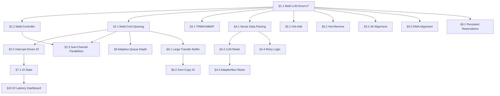

# 008.02-SCSI-Storage-Driver — Hyper-V Synthetic SCSI (StorVSC)

> **Goal:** Bring the existing StorVSC driver from basic single-command
> polling read/write up to production-grade quality. Implement multi-LUN
> enumeration, NCQ-style multi-command queuing, sub-channel parallelism,
> TRIM/UNMAP passthrough, error recovery (LUN/adapter/bus reset), hot-add/remove,
> 4K sector alignment, I/O statistics, and adaptive queue-depth optimization —
> all per the VSCSI protocol over VMBus as documented in the
> [StorVSC spec](file:///home/derickpayne/impossible-os/specs/hypervisors/hyper-v/storvsc-synthetic-scsi.md)
> and the [VMBus Core Protocol spec](file:///home/derickpayne/impossible-os/specs/hypervisors/hyper-v/vmbus-core-protocol.md).
> The current driver (`src/kernel/drivers/hyperv/storvsc.c`, ~665 lines)
> handles multi-LUN enumeration, channel opening, VSTOR protocol negotiation, SCSI INQUIRY,
> READ_CAPACITY(16), and single-threaded READ/WRITE(16) via a 64 KiB
> transfer buffer — all via polling.

> [!CAUTION]
> **Memory Rule:** Use `pmm_alloc_contiguous()` for ALL buffers > 4 KB (ring buffers, transfer buffers, sense data buffers). `kmalloc` is ONLY for small kernel structs (≤ 4 KB). See `rules.md` Known Gotchas.

> [!IMPORTANT]
> **Spec References:**
> - [StorVSC Synthetic SCSI spec](file:///home/derickpayne/impossible-os/specs/hypervisors/hyper-v/storvsc-synthetic-scsi.md) — VSCSI protocol, packet structures, initialization sequence, scalability limits
> - [VMBus Core Protocol spec](file:///home/derickpayne/impossible-os/specs/hypervisors/hyper-v/vmbus-core-protocol.md) — Ring buffer architecture, GPADL mechanics, packet framing, signaling
> - [Hyper-V TLFS](https://learn.microsoft.com/en-us/virtualization/hyper-v-on-windows/tlfs/tlfs) — Public hypervisor specification
>
> **Legal:** Clean-room implement from public specs. Do NOT reference Linux `hv_storvsc.ko` (GPL contamination risk).

---

## Dependency Graph

---

## Phase-by-Phase Implementation Order

| ⭐  | P  | Sections                                          | Depends On        | Status |
| --- | -- | ------------------------------------------------- | ----------------- | :----: |
| 💎  | P0 | §1.1 Multi-LUN Enumeration                        | —                 |   ✅   |
| 💎  | P0 | §4.1 Sense Data Parsing, §4.4 Retry Logic         | §1.1              |   ⬜   |
| 💎  | P1 | §2.1 Multi-Command Queuing                        | §1.1              |   ⬜   |
| 💎  | P1 | §2.2 Interrupt-Driven Completion                  | §2.1              |   ⬜   |
| 💎  | P1 | §4.2 LUN Reset, §4.3 Adapter/Bus Reset            | §4.1              |   ⬜   |
| 💎  | P1 | §3.1 SCSI UNMAP (TRIM)                            | §1.1              |   ⬜   |
| 💎  | P1 | §3.4 Protocol Correctness Hardening               | §1.1              |   ⬜   |
| 💎  | P2 | §1.2 Multi-Controller Support                     | §1.1              |   ⬜   |
| 💎  | P2 | §3.2 4K Sector Alignment, §3.3 DMA Alignment      | §1.1              |   ⬜   |
| 💎  | P2 | §5.1 Hot-Add, §5.2 Hot-Remove                     | §4.1              |   ⬜   |
| 💎  | P2 | §7.1 Per-Device I/O Counters                      | §2.2              |   ⬜   |
| 💎  | P3 | §6.1 Large Transfer Buffer                        | §1.1              |   ⬜   |
| ⭐  | P3 | §2.3 Sub-Channel Parallelism                      | §2.1              |   ⬜   |
| ⭐  | P3 | §6.2 Zero-Copy I/O                                | §6.1              |   ⬜   |
| ⭐  | P3 | §9.1 Adaptive Queue Depth                         | §2.1, §7.1        |   ⬜   |
| ⭐  | P3 | §10.1 I/O Latency Histogram                       | §7.1, §2.2        |   ⬜   |
| 💎  | P4 | §8.1 Persistent Reservations                      | §2.1              |   ⬜   |

> [!NOTE]
> **P0** completes basic production quality. **P1** achieves near-native performance.
> **P2** matches Windows Server features. **P3** ⭐ exclusive features put Impossible OS ahead.

---

## 1. Multi-LUN and Multi-Target Enumeration

### 1.1 SCSI Target/LUN Discovery

**Prompt:** **Verify** full target/LUN enumeration. Confirm `storvsc.h` defines `SCSI_PQ_CONNECTED/DISCONNECTED/NOT_SUPPORTED` and adds `max_targets`/`max_luns` to `vstor_packet.properties`. Confirm `storvsc_negotiate()` saves these into `prop_max_targets`/`prop_max_luns`. Confirm `storvsc_enumerate()` iterates all (target, lun) pairs, calls `storvsc_inquiry_lun()` to check peripheral qualifier, calls `storvsc_capacity_lun()` on connected LUNs, and registers each as `hypervN` with `driver_data=(void*)idx`. Confirm `storvsc_blk_read/write` use `driver_data` to index into `disk_info[]`. Run `bash scripts/build.sh clean` and confirm `=== BUILD OK ===`.

> [!IMPORTANT]
> → XREF: `TODO-008-Hyper-V-Runner.md §4` — Existing StorVSC basic implementation (done)
> → XREF: `TODO-040-Filesystem.md §7` — VFS mount integration for multiple block devices

> [!NOTE]
> **Implementation Notes:**
> - `prop_max_targets`/`prop_max_luns` default to 1 if host returns 0 (Hyper-V Gen2 typical)
> - `storvsc_inquiry_lun()` returns peripheral qualifier (-1 = timeout/no device)
> - PQ timeout on a target breaks the inner LUN loop for that target (avoids long timeouts)
> - Per-device `driver_data = (void*)(uintptr_t)idx` indexes into `disk_info[64]` array
> - Forward declarations for `storvsc_blk_read/write` required (defined after `storvsc_enumerate`)

- [x] Read `max_targets` and `max_luns` from `QUERY_PROPERTIES` response during init
- [x] Iterate all (target_id, lun) combinations: send SCSI INQUIRY for each
- [x] Parse INQUIRY response: check `peripheral_qualifier` (bits 7:5) and `device_type` (bits 4:0)
- [x] For `peripheral_qualifier == 0` (connected): issue READ_CAPACITY(16) → get sector count/size
- [x] Register each discovered LUN as a separate block device (`hyperv0`, `hyperv1`, ...)
- [x] Track discovered devices in a `storvsc_device[]` array (max 64 per controller)
- [x] Log: `[StorVSC] Target %u LUN %u: %s (%llu sectors, %u bytes/sector)`
- [x] Handle `peripheral_qualifier == 1` (not connected but supported) — log and skip
- [x] Commit: `"storvsc: multi-LUN enumeration"`

### 1.2 Multi-Controller Support ⏳

**Prompt:** Hyper-V can present up to 4 synthetic SCSI controllers per VM. Each controller appears as a separate VMBus channel offer with the same class GUID (`BA6163D9-04A1-4D29-B605-72E2FFB1DC7F`) but different instance GUIDs. The current code only handles the first matching channel. Extend `storvsc_init()` to iterate ALL offered channels matching the SCSI GUID, opening each as an independent controller with its own ring buffer pair and transfer buffer. After completing all items, mark every item as `[x]`, update this prompt to a verification prompt, run `bash scripts/build.sh clean`, and commit as `"storvsc: multi-controller support"`. Add notes directly in this TODO section. After implementation, save any gotchas, solutions, and important information to MCP memory (`mcp_memory_create_entities` / `mcp_memory_add_observations`).

- [ ] Extend `vmbus_find_channel_by_guid()` to return ALL matching channels (not just the first)
- [ ] For each SCSI controller channel: allocate independent ring buffers + transfer buffer (PMM)
- [ ] Open each channel independently: separate GPADL handles per controller
- [ ] Run full initialization sequence per controller: BEGIN_INIT → QUERY_VERSION → QUERY_PROPERTIES → END_INIT
- [ ] Enumerate LUNs per controller independently
- [ ] Track controllers in a `storvsc_controller[]` array (max 4)
- [ ] Block device naming: `hyperv0`–`hyperv63` (controller 0), `hyperv64`–`hyperv127` (controller 1), etc.
- [ ] Log: `[StorVSC] Controller %u: %u devices found`
- [ ] Commit: `"storvsc: multi-controller support"`

---

## 2. Concurrent I/O and Sub-Channel Parallelism

### 2.1 Multi-Command Queuing ⏳

**Prompt:** The current driver issues one SCSI command at a time and busy-waits for completion — this serializes all disk I/O. The StorVSP supports up to 255 concurrent outstanding requests per LUN (Storport queue depth limit). Implement a multi-command queue: assign unique `trans_id` values to each request, submit multiple requests before waiting for completions, and match completions to outstanding requests via `trans_id`. Use a per-controller pending request table indexed by `trans_id`. After completing all items, mark every item as `[x]`, update this prompt to a verification prompt, run `bash scripts/build.sh clean`, and commit as `"storvsc: multi-command queuing"`. Add notes directly in this TODO section. After implementation, save any gotchas, solutions, and important information to MCP memory (`mcp_memory_create_entities` / `mcp_memory_add_observations`).

> [!IMPORTANT]
> → XREF: `TODO-008.01-VMBus.md §14` — VMBus ring buffer flow control (§14 done)
> → XREF: `TODO-008.01-VMBus.md §11` — VMBus message dispatch (SynIC interrupt handler)

- [ ] Replace single `trans_id` counter with per-controller atomic ID generator
- [ ] Create pending request table: `storvsc_request pending[MAX_OUTSTANDING]` per controller
- [ ] `storvsc_submit(ctrl, target, lun, cdb, buf, len, callback)` — non-blocking submit
- [ ] Allocate `trans_id`, populate VSTOR_PACKET, write to ring buffer, signal host
- [ ] `storvsc_poll_completions(ctrl)` — read completions from recv ring, match `trans_id`
- [ ] Invoke completion callback with status and sense data
- [ ] Implement `storvsc_wait(ctrl, trans_id)` — synchronous wrapper for boot-time use
- [ ] Guard: reject submission if pending count >= `MAX_OUTSTANDING` (255)
- [ ] Compiler barrier in poll loop (NO `PAUSE` — avoids Hyper-V PLE 1000× slowdown)
- [ ] Commit: `"storvsc: multi-command queuing"`

### 2.2 Interrupt-Driven Completion ⏳

**Prompt:** Replace polling-based completion with SynIC interrupt-driven completion. The VMBus recv ring triggers a SINT2 interrupt when the host enqueues a completion packet. The ISR should drain the recv ring, match `trans_id` to pending requests, and wake blocked threads. This eliminates CPU-wasting polling and enables true asynchronous I/O. After completing all items, mark every item as `[x]`, update this prompt to a verification prompt, run `bash scripts/build.sh clean`, and commit as `"storvsc: interrupt-driven I/O completion"`. Add notes directly in this TODO section. After implementation, save any gotchas, solutions, and important information to MCP memory (`mcp_memory_create_entities` / `mcp_memory_add_observations`).

> [!IMPORTANT]
> → XREF: `TODO-008.01-VMBus.md §11` — VMBus SynIC interrupt handler (SINT2)

- [ ] Register per-channel completion callback with VMBus SINT2 dispatcher
- [ ] ISR: read recv ring → parse `vmpacket_descriptor` → extract `trans_id`
- [ ] Match `trans_id` to pending request table → invoke callback
- [ ] Parse `VSTOR_OPERATION_COMPLETE_IO` → extract `srb_status`, `scsi_status`, sense data
- [ ] Add per-controller `event_t completion` — `event_wait()` in sync path, `event_set()` in ISR
- [ ] Retain polling fallback for pre-scheduler boot (before interrupts are available)
- [ ] Commit: `"storvsc: interrupt-driven I/O completion"`

### 2.3 VMBus Sub-Channel Parallelism ⏳

**Prompt:** For high-throughput workloads, StorVSP supports VMBus **sub-channels** — additional ring buffer pairs bound to different vCPUs for parallel I/O processing. The host offers sub-channels when the VM has multiple vCPUs (typically 1 sub-channel per 4 vCPUs, up to `max_sub_channels` from `QUERY_PROPERTIES`). The guest opens each sub-channel with its own ring buffer GPADL. I/O requests are distributed across channels using a CPU affinity heuristic: the sending vCPU's ID selects the corresponding channel. This is the VMBus Multi-Queue (VMMQ) model. After completing all items, mark every item as `[x]`, update this prompt to a verification prompt, run `bash scripts/build.sh clean`, and commit as `"storvsc: VMBus sub-channel parallelism"`. Add notes directly in this TODO section. After implementation, save any gotchas, solutions, and important information to MCP memory (`mcp_memory_create_entities` / `mcp_memory_add_observations`).

> [!TIP]
> **Competitive Edge:** Linux's `storvsc_drv.c` uses `storvsc_vcpus_per_sub_channel` (default 4)
> and `storvsc_max_hw_queues` tunables. Windows uses automatic VMMQ alignment. Implementing
> sub-channels efficiently gives Impossible OS linear I/O scaling with vCPU count.

- [ ] Detect sub-channel offers from host (same class GUID, `sub_channel_index > 0`)
- [ ] Read `max_sub_channels` from `QUERY_PROPERTIES` response
- [ ] Open each sub-channel: allocate PMM ring buffers, create GPADL, send OPENCHANNEL
- [ ] I/O distribution: select channel based on current vCPU ID (`channel = cpu_id % num_channels`)
- [ ] Each sub-channel gets its own pending request table
- [ ] Affinity: pin sub-channel interrupt to corresponding vCPU via SynIC SINT target
- [ ] Log: `[StorVSC] Controller %u: %u sub-channels active (1 primary + %u sub)`
- [ ] Fallback: if only 1 vCPU, use primary channel only (current behavior)
- [ ] Commit: `"storvsc: VMBus sub-channel parallelism"`

---

## 3. TRIM/UNMAP and Sector Alignment

### 3.1 SCSI UNMAP (TRIM Passthrough) ⏳

**Prompt:** When the guest filesystem deletes files, it should notify the host that the underlying blocks are no longer in use. On Hyper-V Gen 2 with VHDX backing, this shrinks the VHDX file and frees physical storage on the SAN. StorVSC passes SCSI UNMAP (opcode `0x42`) commands through VMBus to the host StorVSP, which applies them to the VHDX layer. Requires VSTOR protocol version ≥ WIN8 (5.1). After completing all items, mark every item as `[x]`, update this prompt to a verification prompt, run `bash scripts/build.sh clean`, and commit as `"storvsc: SCSI UNMAP / TRIM passthrough"`. Add notes directly in this TODO section. After implementation, save any gotchas, solutions, and important information to MCP memory (`mcp_memory_create_entities` / `mcp_memory_add_observations`).

> [!IMPORTANT]
> → XREF: `TODO-008.02-SCSI-Storage-Driver.md §3.2` — 4K sector alignment prerequisite

- [ ] Check negotiated protocol version ≥ `VMSTOR_PROTO_VERSION_WIN8` (5.1)
- [ ] Implement `storvsc_unmap(ctrl, target, lun, lba, count)` — sends SCSI UNMAP command
- [ ] Build UNMAP parameter list: 8-byte header + 16-byte block descriptor (LBA + count)
- [ ] Encapsulate in VSTOR_PACKET with `EXECUTE_SRB`, CDB opcode `0x42`
- [ ] Wire to block device layer: `blkdev_discard()` → `storvsc_unmap()`
- [ ] Wire to VFS: `fat32_unlink()`, `ixfs_delete()` call `blkdev_discard()`
- [ ] Handle host rejection (older hosts or VHD format): log warning, continue without TRIM
- [ ] Log: `[StorVSC] UNMAP: LBA %llu, count %u → %s`
- [ ] Commit: `"storvsc: SCSI UNMAP / TRIM passthrough"`

### 3.2 4K Sector Alignment ⏳

**Prompt:** VHDX uses 4 KiB logical and physical sectors. Misaligned I/O (512-byte boundaries on 4K-native disks) causes severe read-modify-write penalties on the physical array (2–4× IOPS inflation). Detect the logical and physical sector sizes via SCSI READ_CAPACITY(16) response (which includes logical block length) and SCSI VPD page `0xB0` (Block Limits — optimal transfer granularity). Ensure all I/O requests are aligned to the physical sector size. After completing all items, mark every item as `[x]`, update this prompt to a verification prompt, run `bash scripts/build.sh clean`, and commit as `"storvsc: 4K sector alignment"`. Add notes directly in this TODO section. After implementation, save any gotchas, solutions, and important information to MCP memory (`mcp_memory_create_entities` / `mcp_memory_add_observations`).

- [ ] Parse READ_CAPACITY(16) response: extract `logical_block_length` (bytes 8–11)
- [ ] Issue VPD page `0xB1` (Block Device Characteristics) — detect rotation rate (SSD vs HDD)
- [ ] Store per-LUN `logical_sector_size` and `physical_sector_size` in device struct
- [ ] Block device registration: set `blkdev.sector_size` from discovered values
- [ ] Validate all I/O requests are aligned to `physical_sector_size`
- [ ] If misaligned: round down LBA, round up count, log warning
- [ ] Expose via Registry: `HKLM\HARDWARE\StorVSC\DeviceX\SectorSize`, `PhysicalSectorSize`
- [ ] Log: `[StorVSC] Device %u: %u-byte logical, %u-byte physical sectors`
- [ ] Commit: `"storvsc: 4K sector alignment"`

### 3.3 DMA Buffer Page Alignment (IOMMU Enforcement) ⏳

**Prompt:** Hyper-V enforces strict IOMMU page boundary rules on DMA transfers. QEMU is forgiving about unaligned memory, but on a real Hyper-V host, if a Physical Region Descriptor Table (PRDT) entry or VMBus GPADL transfer buffer has addresses crossing 4 KB page boundaries incorrectly, or if unaligned memory is passed to the virtual SCSI controller, Hyper-V silently drops the I/O — the guest hangs forever waiting for a disk interrupt that never arrives, or reads a buffer of zeroes. Audit all DMA-critical paths: GPADL PFN lists, StorVSC transfer buffers, storvsc read/write target buffers. Add alignment assertions and ensure PMM-backed buffers are always page-aligned. After completing all items, mark every item as `[x]`, update this prompt to a verification prompt, run `bash scripts/build.sh clean`, and commit as `"storvsc: DMA buffer page alignment"`. Add notes directly in this TODO section. After implementation, save any gotchas, solutions, and important information to MCP memory (`mcp_memory_create_entities` / `mcp_memory_add_observations`).

> [!CAUTION]
> **Silent failure.** Unlike most hardware errors, IOMMU page boundary violations
> produce NO error status, NO interrupt, and NO log entry. The I/O request simply
> vanishes. The OS hangs waiting for a completion that never arrives.

> [!IMPORTANT]
> → XREF: `TODO-008.06-Page-Table-MMIO.md §2` — PRESENT bit shield (CoCo MMIO safety)

- [x] Audit all `pmm_alloc_contiguous()` callers in StorVSC: verify returned addresses are page-aligned
- [x] Audit GPADL PFN list construction in `vmbus_create_gpadl()`: verify all PFNs reference full page boundaries
- [x] Audit StorVSC 64 KiB transfer buffer: verify it starts on a 4 KiB page boundary
- [x] Add `kassert(!(addr & 0xFFF))` guards on all DMA-critical buffer addresses
- [x] Validate that `storvsc_blk_read()` / `storvsc_blk_write()` target buffers are page-aligned
- [ ] If caller provides unaligned buffer: bounce through page-aligned intermediate buffer
- [ ] Audit UEFI bootloader for page-alignment warnings (`addr is not page aligned` in serial log)
- [ ] Test: intentionally pass unaligned buffer on QEMU (should work) vs Hyper-V (should hang without fix)
- [ ] Log: `[StorVSC] WARN: DMA buffer at 0x%lx is not page-aligned — using bounce buffer`
- [ ] Commit: `"storvsc: DMA buffer page alignment"`

---

### 3.4 Protocol Correctness Hardening ⏳

**Prompt:** Several silent-failure risks exist in the current implementation that could cause zero-error hangs or garbage data on real Hyper-V (not caught on QEMU, which is more forgiving). Fix all five: validate `QUERY_PROPERTIES` field layout at runtime, verify `vmbus_sendpacket_pagebuffer` transfer-page header framing, increase enumeration poll timeout for high-latency VMs, add a per-outstanding-command response guard to prevent concurrent `blk_read` calls from consuming each other's responses, and expand the SRB status success check to cover `0x11` (success-with-sense). After completing all items, mark every item as `[x]`, update this prompt to a verification prompt, run `bash scripts/build.sh clean`, and commit as `"storvsc: protocol correctness hardening"`. Add notes directly in this TODO section. After implementation, save any gotchas, solutions, and important information to MCP memory.

> [!CAUTION]
> **All five risks cause silent failures** — no error code, no log, just a hang or wrong data.
> QEMU's Hyper-V emulation is forgiving; a real Gen2 Hyper-V host exposes all of them.

> [!IMPORTANT]
> → XREF: `TODO-008.02-SCSI-Storage-Driver.md §3.3` — DMA page alignment (related class of silent failure)
> → XREF: `TODO-008.02-SCSI-Storage-Driver.md §2.1` — Multi-command queuing (permanent fix for concurrent collision)

- [ ] **`QUERY_PROPERTIES` layout check:** after receiving the response, log raw bytes 4–7 of the properties union; verify `max_channel_count` reads a sane value (>0, ≤256) as a layout sanity check before reading `max_targets`/`max_luns`
- [ ] **`vmbus_sendpacket_pagebuffer` audit:** read `vmbus_transfer_page_header` in `vmbus.c`; verify `pageset_id` matches `xfer_gpadl_handle`, byte offsets and `range_count` are set before descriptor fields; add a `kassert` that the on-wire size matches `sizeof(vmbus_transfer_page_header) + ranges_size`
- [ ] **Enumeration timeout:** replace the hardcoded `5000000` poll limit in `storvsc_scsi_cmd()` with a calibrated threshold based on TSC frequency (`tsc_khz * 500` = 500 ms); add per-attempt logging at 100 ms intervals so a slow Hyper-V host is diagnosable rather than silent
- [ ] **Concurrent response collision guard:** add a `uint64_t expected_tid` field on the stack in `storvsc_scsi_cmd()`; in the poll loop, discard and re-queue any packet whose `transaction_id` ≠ `tid` (requires a small pending-packet stash), or return `-EAGAIN` until `§2.1` (multi-command queuing) is in place
- [ ] **SRB status 0x11 (success-with-sense):** expand success check to accept `0x00`, `0x01`, and `0x11` (`SRB_STATUS_SUCCESS_WITH_SENSE`); when `srb_status == 0x11`, log the raw sense bytes at DEBUG level (full decode deferred to §4.1)
- [ ] Commit: `"storvsc: protocol correctness hardening"`

---

## 4. Error Recovery and Reset Handling

### 4.1 SCSI Sense Data Parsing ⏳

**Prompt:** When a SCSI command fails, the host populates `sense_data[]` (20 bytes) in the `vstor_srb` response. Parse the sense data to extract Sense Key, Additional Sense Code (ASC), and Additional Sense Code Qualifier (ASCQ). Map common error codes to human-readable strings for kernel logging and diagnostic output. This enables surgical error recovery instead of blanket retries. After completing all items, mark every item as `[x]`, update this prompt to a verification prompt, run `bash scripts/build.sh clean`, and commit as `"storvsc: SCSI sense data parsing"`. Add notes directly in this TODO section. After implementation, save any gotchas, solutions, and important information to MCP memory (`mcp_memory_create_entities` / `mcp_memory_add_observations`).

- [ ] Parse sense data format: byte 0 (response code), byte 2 (sense key), byte 12 (ASC), byte 13 (ASCQ)
- [ ] Handle fixed format (response code `0x70`/`0x71`) and descriptor format (`0x72`/`0x73`)
- [ ] Map common sense keys: `0x01` (Recovered Error), `0x02` (Not Ready), `0x03` (Medium Error), `0x04` (Hardware Error), `0x05` (Illegal Request), `0x06` (Unit Attention), `0x0B` (Aborted Command)
- [ ] Map common ASC/ASCQ pairs:
  - [ ] `0x04/0x01` = "Logical unit is in process of becoming ready"
  - [ ] `0x11/0x00` = "Unrecovered read error"
  - [ ] `0x20/0x00` = "Invalid command operation code"
  - [ ] `0x28/0x00` = "Not ready to ready change, medium may have changed"
  - [ ] `0x3A/0x00` = "Medium not present"
- [ ] Implement `storvsc_sense_to_string(sense_key, asc, ascq)` → human-readable error
- [ ] Log on error: `[StorVSC] SCSI error: Sense=%02Xh ASC=%02Xh ASCQ=%02Xh (%s)`
- [ ] Commit: `"storvsc: SCSI sense data parsing"`

### 4.2 LUN Reset ⏳

**Prompt:** When a specific LUN becomes unresponsive (stuck command, timeout), issue a targeted LUN reset via `VSTOR_OPERATION_RESET_LUN`. This aborts all outstanding commands for that LUN only, without affecting other LUNs on the same controller. After reset, re-probe the LUN with TEST UNIT READY before resubmitting queued commands. After completing all items, mark every item as `[x]`, update this prompt to a verification prompt, run `bash scripts/build.sh clean`, and commit as `"storvsc: LUN reset recovery"`. Add notes directly in this TODO section. After implementation, save any gotchas, solutions, and important information to MCP memory (`mcp_memory_create_entities` / `mcp_memory_add_observations`).

- [ ] Detect stuck LUN: command pending > timeout threshold (20 seconds, configurable)
- [ ] Send `VSTOR_OPERATION_RESET_LUN` with `target_id` and `lun` specified
- [ ] Wait for completion from host (synchronous — must block)
- [ ] Abort all pending requests for the reset LUN: invoke error callbacks
- [ ] Issue TEST UNIT READY (opcode `0x00`) to verify LUN is responsive post-reset
- [ ] If TEST UNIT READY fails: escalate to adapter reset (§4.3)
- [ ] Track per-LUN reset count: `HKLM\HARDWARE\StorVSC\DeviceX\ResetCount`
- [ ] Log: `[StorVSC] LUN reset: target=%u lun=%u — %u commands aborted`
- [ ] Commit: `"storvsc: LUN reset recovery"`

### 4.3 Adapter and Bus Reset ⏳

**Prompt:** When a LUN reset fails or the entire synthetic SCSI controller becomes unresponsive, escalate to adapter-level or bus-level reset. `VSTOR_OPERATION_RESET_ADAPTER` resets the entire synthetic SCSI controller, aborting ALL outstanding commands across all LUNs. `VSTOR_OPERATION_RESET_BUS` resets the SCSI bus. These are last-resort recovery operations. After reset, re-enumerate all LUNs. After completing all items, mark every item as `[x]`, update this prompt to a verification prompt, run `bash scripts/build.sh clean`, and commit as `"storvsc: adapter and bus reset recovery"`. Add notes directly in this TODO section. After implementation, save any gotchas, solutions, and important information to MCP memory (`mcp_memory_create_entities` / `mcp_memory_add_observations`).

> [!CAUTION]
> Adapter reset aborts ALL outstanding I/O for ALL LUNs on the controller.
> This can cause filesystem corruption if write operations are in-flight.
> Always attempt LUN reset (§4.2) first.

- [ ] Implement `storvsc_reset_adapter(ctrl)` — sends `VSTOR_OPERATION_RESET_ADAPTER`
- [ ] Implement `storvsc_reset_bus(ctrl)` — sends `VSTOR_OPERATION_RESET_BUS`
- [ ] Abort ALL pending requests for the controller: invoke error callbacks with `ABORTED` status
- [ ] After reset: re-run LUN enumeration (§1.1) to detect any topology changes
- [ ] Issue TEST UNIT READY for each previously-discovered LUN
- [ ] If adapter reset also fails: mark controller as DEAD, log critical error
- [ ] Escalation chain: command timeout → LUN reset → adapter reset → bus reset → DEAD
- [ ] Track per-controller reset count: `HKLM\HARDWARE\StorVSC\Controller%u\AdapterResets`
- [ ] Log: `[StorVSC] Adapter reset: controller=%u — ALL commands aborted`
- [ ] Commit: `"storvsc: adapter and bus reset recovery"`

### 4.4 Command Retry Logic ⏳

**Prompt:** Not all SCSI errors require reset — many are recoverable via retry. Implement a retry policy: commands that fail with Unit Attention (sense key `0x06`, e.g., media changed) or transient errors (Aborted Command, sense key `0x0B`) should be retried up to 3 times with exponential backoff. Medium Errors (sense key `0x03`) should NOT be retried (the media is bad). Illegal Request (sense key `0x05`) should NEVER be retried (the command is wrong). After completing all items, mark every item as `[x]`, update this prompt to a verification prompt, run `bash scripts/build.sh clean`, and commit as `"storvsc: command retry logic"`. Add notes directly in this TODO section. After implementation, save any gotchas, solutions, and important information to MCP memory (`mcp_memory_create_entities` / `mcp_memory_add_observations`).

- [ ] Add `retry_count` field to pending request struct (default max = 3)
- [ ] On completion with error: check sense key from sense data (§4.1)
- [ ] Retry policy by sense key:
  - [ ] `0x06` (Unit Attention): retry immediately (medium may have changed)
  - [ ] `0x0B` (Aborted Command): retry with backoff (10ms, 100ms, 1000ms)
  - [ ] `0x02` (Not Ready): retry with backoff (wait for device to become ready)
  - [ ] `0x03` (Medium Error): do NOT retry — report to caller
  - [ ] `0x04` (Hardware Error): do NOT retry — report to caller
  - [ ] `0x05` (Illegal Request): do NOT retry — report to caller
- [ ] If all retries exhausted: report error to block device layer
- [ ] Track retry statistics per LUN: `total_retries`, `retries_succeeded`, `retries_failed`
- [ ] Commit: `"storvsc: command retry logic"`

---

## 5. Hot-Add and Hot-Remove

### 5.1 Hot-Add Device Detection ⏳

**Prompt:** Hyper-V supports hot-adding virtual disks to a running VM. The host sends a SynIC interrupt signaling a topology change. The guest should detect the new device by re-running SCSI INQUIRY across all target/LUN combinations. Alternatively, the host may send a `VSTOR_OPERATION_REMOVE_DEVICE` with a flag indicating addition (counterintuitive naming). Register the new device as a block device and probe for partitions. After completing all items, mark every item as `[x]`, update this prompt to a verification prompt, run `bash scripts/build.sh clean`, and commit as `"storvsc: hot-add virtual disk"`. Add notes directly in this TODO section. After implementation, save any gotchas, solutions, and important information to MCP memory (`mcp_memory_create_entities` / `mcp_memory_add_observations`).

- [ ] Handle Unit Attention (sense key `0x06`, ASC `0x3F`, ASCQ `0x0E` — "reported LUNs data changed")
- [ ] On Unit Attention: re-run LUN enumeration (§1.1) to discover new devices
- [ ] For newly discovered LUNs: issue INQUIRY → READ_CAPACITY → register block device
- [ ] Probe partitions on new device: `partition_scan()` → `partition_mount_filesystems()`
- [ ] Notify desktop: toast notification `"Drive detected — E:\ (100 GB, Virtual SCSI)"`
- [ ] Log: `[StorVSC] Hot-add: target=%u lun=%u — %s (%llu sectors)`
- [ ] Commit: `"storvsc: hot-add virtual disk"`

### 5.2 Hot-Remove Device Handling ⏳

**Prompt:** The host can hot-remove virtual disks from a running VM. The host sends `VSTOR_OPERATION_REMOVE_DEVICE` over the VMBus channel. The guest must flush dirty buffers, unmount filesystems on the removed device, abort outstanding I/O, and unregister the block device. After completing all items, mark every item as `[x]`, update this prompt to a verification prompt, run `bash scripts/build.sh clean`, and commit as `"storvsc: hot-remove virtual disk"`. Add notes directly in this TODO section. After implementation, save any gotchas, solutions, and important information to MCP memory (`mcp_memory_create_entities` / `mcp_memory_add_observations`).

> [!WARNING]
> If filesystems are mounted on the removed disk and have dirty data, data loss
> may occur. Always attempt to flush before unregistering.

- [ ] Handle `VSTOR_OPERATION_REMOVE_DEVICE` message from host
- [ ] Identify which (target, lun) is being removed from the message payload
- [ ] Flush dirty filesystem buffers for the device (best-effort)
- [ ] Unmount all filesystems on the removed device
- [ ] Abort all pending I/O for the removed LUN: invoke error callbacks
- [ ] Unregister block device from `blkdev` subsystem
- [ ] Notify desktop: toast notification `"Drive removed — E:\"`
- [ ] Log: `[StorVSC] Hot-remove: target=%u lun=%u`
- [ ] Commit: `"storvsc: hot-remove virtual disk"`

---

## 6. Transfer Buffer Optimization

### 6.1 Large Transfer Buffer ⏳

**Prompt:** The current transfer buffer is 64 KiB (16 pages). Linux's `storvsc_drv.c` uses 128 KiB by default (`storvsc_ringbuffer_size`). Larger transfer buffers enable larger I/O requests without splitting, improving sequential throughput. Make the transfer buffer size configurable and increase the default. Each I/O request uses a transfer page range within the buffer. After completing all items, mark every item as `[x]`, update this prompt to a verification prompt, run `bash scripts/build.sh clean`, and commit as `"storvsc: configurable transfer buffer size"`. Add notes directly in this TODO section. After implementation, save any gotchas, solutions, and important information to MCP memory (`mcp_memory_create_entities` / `mcp_memory_add_observations`).

- [ ] Increase default transfer buffer from 64 KiB to 128 KiB (32 pages)
- [ ] Make transfer buffer size configurable: `STORVSC_XFER_BUF_PAGES` compile-time constant
- [ ] Allocate via `pmm_alloc_contiguous()` — NEVER kmalloc (>4 KiB rule)
- [ ] Create GPADL for the enlarged buffer via `vmbus_create_gpadl_external()`
- [ ] Support large I/O: split requests > transfer buffer size into multiple ring operations
- [ ] Track concurrent transfer buffer usage: simple bitmap of in-use page ranges
- [ ] Log: `[StorVSC] Transfer buffer: %u KiB (%u pages), GPADL=%u`
- [ ] Commit: `"storvsc: configurable transfer buffer size"`

### 6.2 Per-Request Bounce Buffer Elimination ⏳

**Prompt:** Currently, data is copied into/from the transfer buffer for every I/O request. For read operations, the host writes directly into the GPADL-shared transfer buffer, which the guest then copies into the caller's buffer. This double-copy can be eliminated by using per-request GPADL handles that share the caller's buffer directly with the host. This is the true zero-copy model that production drivers use. After completing all items, mark every item as `[x]`, update this prompt to a verification prompt, run `bash scripts/build.sh clean`, and commit as `"storvsc: zero-copy I/O via per-request GPADL"`. Add notes directly in this TODO section. After implementation, save any gotchas, solutions, and important information to MCP memory (`mcp_memory_create_entities` / `mcp_memory_add_observations`).

> [!TIP]
> **Competitive Edge:** True zero-copy I/O eliminates the `memcpy()` between transfer buffer
> and caller buffer. For 128 KiB sequential reads, this saves ~10µs per I/O — significant
> at high queue depths.

- [ ] Implement `vmbus_create_gpadl_transient(vaddr, pages)` — create GPADL for arbitrary guest memory
- [ ] For read/write: create transient GPADL for caller's buffer, use as `transfer_pageset_id`
- [ ] Teardown transient GPADL after I/O completion (GPADL_TEARDOWN → GPADL_TORNDOWN)
- [ ] Handle non-contiguous caller buffers: scatter-gather via multi-range transfer page header
- [ ] Fallback: continue using shared transfer buffer if transient GPADL creation fails
- [ ] Guard: caller buffer must be PMM-allocated (identity-mapped, physically contiguous)
- [ ] Benchmark: compare throughput with and without zero-copy path
- [ ] Commit: `"storvsc: zero-copy I/O via per-request GPADL"`

---

## 7. I/O Statistics and Telemetry

### 7.1 Per-Device I/O Counters ⏳

**Prompt:** Implement comprehensive per-device I/O statistics for performance monitoring. Track: read/write IOPS, throughput (bytes/sec), average latency, queue depth, and error counts. Expose via Registry. The System Monitor app (Task Manager equivalent) can display real-time disk activity graphs for Hyper-V virtual disks. After completing all items, mark every item as `[x]`, update this prompt to a verification prompt, run `bash scripts/build.sh clean`, and commit as `"storvsc: I/O statistics and telemetry"`. Add notes directly in this TODO section. After implementation, save any gotchas, solutions, and important information to MCP memory (`mcp_memory_create_entities` / `mcp_memory_add_observations`).

> [!IMPORTANT]
> → XREF: `TODO-008.02-SCSI-Storage-Driver.md §2.2` — Interrupt-driven completion (latency timestamps)

- [ ] Track per-device counters (atomic increments, no locks):
  - [ ] `reads_completed`, `writes_completed` (cumulative IOPS)
  - [ ] `bytes_read`, `bytes_written` (cumulative throughput)
  - [ ] `read_latency_sum_us`, `write_latency_sum_us` (for average calculation)
  - [ ] `read_latency_max_us`, `write_latency_max_us` (worst-case)
  - [ ] `errors_total`, `errors_sense`, `errors_timeout`, `errors_reset`
  - [ ] `current_queue_depth` (live pending command count)
- [ ] Latency measurement: record `rdtsc` at command submit, compute delta at completion
- [ ] Expose via Registry:
  - [ ] `HKLM\HARDWARE\StorVSC\Device0\Stats\ReadsCompleted`
  - [ ] `HKLM\HARDWARE\StorVSC\Device0\Stats\AvgReadLatencyUs`
  - [ ] `HKLM\HARDWARE\StorVSC\Device0\Stats\CurrentQueueDepth`
- [ ] Reset counters on demand: `HKLM\HARDWARE\StorVSC\DeviceX\Stats\Reset = 1`
- [ ] Log periodic summary: `[StorVSC] Device %u: %u reads, %u writes, avg_lat=%uµs, depth=%u`
- [ ] Commit: `"storvsc: I/O statistics and telemetry"`

---

## 8. SCSI Persistent Reservations (Shared VHDX)

### 8.1 SCSI-3 PR Command Passthrough ⏳

**Prompt:** For guest clustering (Windows Failover Cluster in child VMs), Hyper-V supports Shared VHDX mapped to multiple VMs simultaneously. Shared VHDX requires SCSI-3 Persistent Reservations (PR) to prevent split-brain corruption. StorVSC must pass through PR commands transparently: PERSISTENT RESERVE IN (`0x5E`), PERSISTENT RESERVE OUT (`0x5F`). These establish quorum and exclusive/shared access policies across VMs. After completing all items, mark every item as `[x]`, update this prompt to a verification prompt, run `bash scripts/build.sh clean`, and commit as `"storvsc: SCSI-3 persistent reservations"`. Add notes directly in this TODO section. After implementation, save any gotchas, solutions, and important information to MCP memory (`mcp_memory_create_entities` / `mcp_memory_add_observations`).

- [ ] Implement SCSI PERSISTENT RESERVE IN (opcode `0x5E`) — read current reservations
- [ ] Implement SCSI PERSISTENT RESERVE OUT (opcode `0x5F`) — register/reserve/release
- [ ] PR service actions: REGISTER (`0x00`), RESERVE (`0x01`), RELEASE (`0x02`), CLEAR (`0x03`)
- [ ] PR types: Write Exclusive, Exclusive Access, Write Exclusive Registrants Only
- [ ] Handle reservation conflicts: `SCSI_STATUS_RESERVATION_CONFLICT` (`0x18`)
- [ ] Wire to filesystem layer: `blkdev_pr_register()`, `blkdev_pr_reserve()`
- [ ] Log: `[StorVSC] PR: action=%s type=%s key=0x%016llX → %s`
- [ ] Commit: `"storvsc: SCSI-3 persistent reservations"`

## Priority Order

| ⭐ | Priority | Section                                    | Description                                                       |
| -- | -------- | ------------------------------------------ | ----------------------------------------------------------------- |
| 💎 | 🔴 P0    | §1.1 Multi-LUN Enumeration                 | Multiple disks per controller — basic gen 2 need ✅               |
| 💎 | 🔴 P0    | §4.1 Sense Data Parsing                    | Required for any error diagnosis                                  |
| 💎 | 🔴 P0    | §4.4 Command Retry Logic                   | Transient errors must be retried, not hard-failed                 |
| 💎 | 🟠 P1    | §2.1 Multi-Command Queuing                 | Major throughput gain — parallelizes I/O                          |
| 💎 | 🟠 P1    | §2.2 Interrupt-Driven Completion           | Eliminates CPU-wasting polling                                    |
| 💎 | 🟠 P1    | §4.2 LUN Reset                             | Required for production error recovery                            |
| 💎 | 🟠 P1    | §4.3 Adapter/Bus Reset                     | Escalation when LUN reset fails                                   |
| 💎 | 🟠 P1    | §3.1 SCSI UNMAP (TRIM)                     | VHDX space reclamation — critical for SSDs                        |
| 💎 | 🟡 P2    | §1.2 Multi-Controller Support              | Up to 4 controllers × 64 devices                                  |
| 💎 | 🟡 P2    | §3.2 4K Sector Alignment                   | Avoids 2–4× IOPS penalty on 4K-native disks                      |
| 💎 | 🟡 P2    | §3.3 DMA Page Alignment                    | IOMMU-safe buffers — silent I/O failure without it                |
| 💎 | 🟠 P1    | §3.4 Protocol Correctness Hardening        | 5 silent-failure risks — must fix before real Hyper-V testing     |
| 💎 | 🟡 P2    | §5.1 Hot-Add Detection                     | Dynamic disk management                                           |
| 💎 | 🟡 P2    | §5.2 Hot-Remove Handling                   | Graceful removal without data loss                                |
| ⭐ | 🟡 P2    | §7.1 Per-Device I/O Statistics             | **Per-device latency tracking** — beyond Windows                  |
| 💎 | 🟢 P3    | §6.1 Large Transfer Buffer                 | Throughput optimization for sequential I/O                        |
| ⭐ | 🟢 P3    | §2.3 Sub-Channel Parallelism               | **Linear I/O scaling with vCPUs** — advanced                      |
| ⭐ | 🟢 P3    | §6.2 Zero-Copy I/O                         | **Eliminate memcpy** — true zero-copy data path                   |
| ⭐ | 🟢 P3    | §9.1 Adaptive Queue Depth                  | **Self-tuning queue depth** — neither Windows nor Linux does this  |
| ⭐ | 🟢 P3    | §10.1 I/O Latency Histogram                | **Per-LUN P99 tail latency** — always-on, no tracing required     |
| 💎 | 🔵 P4    | §8.1 Persistent Reservations               | Guest clustering — enterprise feature                             |

> [!NOTE]
> ⭐ = Feature where Impossible OS can be **superior** to both Windows and Linux.

---

## OS Comparison

| ⭐ | Feature                              | 🪟 Windows 11 (storvsc.sys)               | 🐧 Linux (storvsc_drv.c)                | 🚀 Impossible OS                                          |
| -- | ------------------------------------ | ------------------------------------------ | ---------------------------------------- | ---------------------------------------------------------- |
| 💎 | Basic storvsc (read/write)           | ✅ Native                                  | ✅ Native                                | ✅ Done (polling, 64 KiB xfer)                             |
| 💎 | Multi-LUN enumeration                | ✅ Full (64 LUNs × 4 ctrl)                | ✅ Full SCSI host scan                   | ✅ Done §1.1 — 64 LUNs per controller                      |
| 💎 | Multi-controller                     | ✅ 4 controllers                           | ✅ 4 controllers                         | ⬜ §1.2 P2 — first controller only                         |
| 💎 | Multi-command queuing                | ✅ 255 per LUN                             | ✅ blk-mq integration                    | ⬜ §2.1 P1 — sequential only                               |
| 💎 | Interrupt-driven completion          | ✅ SynIC ISR                               | ✅ SynIC ISR + tasklet                   | ⬜ §2.2 P1 — polling                                       |
| ⭐ | **Sub-channel parallelism**          | ✅ VMMQ automatic                          | ✅ `storvsc_max_hw_queues`               | ⬜ §2.3 P3 — single channel                                |
| 💎 | TRIM/UNMAP passthrough               | ✅ Automatic via NTFS                      | ✅ `fstrim` / auto-discard               | ⬜ §3.1 P1                                                 |
| 💎 | 4K sector alignment                  | ✅ VHDX-aware                              | ✅ Auto-detect                           | ⬜ §3.2 P2 — assumes 512-byte                              |
| 💎 | DMA page alignment (IOMMU)           | ✅ Automatic                               | ✅ IOMMU/SWIOTLB                         | ⬜ §3.3 P2 — audit needed                                  |
| 💎 | Sense data parsing                   | ✅ Full SCSI sense                         | ✅ Full (libata-scsi)                    | ⬜ §4.1 P0 — no sense parsing                              |
| 💎 | LUN reset recovery                   | ✅ Storport EH                             | ✅ SCSI EH                               | ⬜ §4.2 P1                                                 |
| 💎 | Adapter/bus reset                    | ✅ Storport escalation                     | ✅ SCSI host reset                       | ⬜ §4.3 P1                                                 |
| 💎 | Command retry logic                  | ✅ Automatic (Storport)                    | ✅ SCSI mid-layer retries                | ⬜ §4.4 P0 — no retries                                    |
| 💎 | Hot-add virtual disk                 | ✅ Automatic                               | ✅ Automatic                             | ⬜ §5.1 P2                                                 |
| 💎 | Hot-remove virtual disk              | ✅ Automatic                               | ✅ Automatic                             | ⬜ §5.2 P2                                                 |
| 💎 | Configurable transfer buffer         | ✅ Tunable                                 | ✅ `storvsc_ringbuffer_size`             | ⬜ §6.1 P3 — 64 KiB fixed                                  |
| ⭐ | **Zero-copy I/O**                    | ⚠️ Limited to Storport DMA                 | ⚠️ Bounce buffer for high pages          | ⬜ §6.2 P3 — double-copy today                             |
| ⭐ | **Per-device I/O stats**             | ⚠️ PerfMon (aggregate)                     | ⚠️ `/proc/diskstats` (aggregate)         | ⬜ §7.1 P2 — per-device latency tracking 🚀               |
| 💎 | SCSI-3 persistent reservations       | ✅ Shared VHDX clustering                  | ✅ PR passthrough                        | ⬜ §8.1 P4                                                 |
| ⭐ | **Adaptive queue depth**             | ❌ Fixed Storport queue depth              | ❌ Static `nr_requests`                  | ⬜ §9.1 P3 — **self-tuning runtime** 🚀                    |
| ⭐ | **Per-LUN latency histograms**       | ❌ Aggregate PerfMon only                  | ❌ Requires `blktrace` tracing tool      | ⬜ §10.1 P3 — **always-on P99** 🚀                         |

> **After P0 items (§4.1, §4.4):** Impossible OS handles multi-disk Hyper-V VMs with proper error handling.
> **After P1 items (§2.1, §2.2, §3.1, §4.2–4.3):** Near-native throughput with parallel I/O, TRIM, and interrupt-driven completions.
> **After P2 items:** Full production-grade StorVSC matching Linux's `storvsc_drv.c` feature set.
> **After P3 ⭐ items (§9.1, §10.1):** Exceeds both Windows and Linux — adaptive queue depth + always-on P99 latency histograms.
> **After P4 items:** Enterprise clustering support — matches Windows Server.
