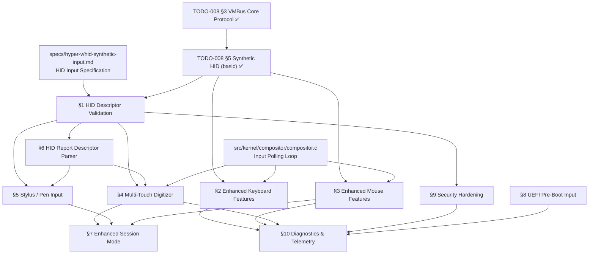

# 008.03-Synthetic-HID — Hyper-V Synthetic HID Input Driver

> **Goal:** Implement a production-grade Hyper-V Synthetic HID Input Driver for
> Impossible OS. The driver replaces legacy PS/2 emulation with direct VMBus
> shared-memory channels for keyboard and mouse input, delivering near bare-metal
> latency via absolute pointer positioning and scan code passthrough. Extend
> beyond basic keyboard/mouse to cover multi-touch digitizer protocols, stylus/pen
> state management, HID Report Descriptor validation, and UEFI pre-boot input —
> making Impossible OS the most complete Hyper-V HID implementation outside
> Windows and Linux.

> [!CAUTION]
> **Memory Rule:** Use `pmm_alloc_contiguous()` for ALL buffers > 4 KB (ring
> buffers, HID descriptor buffers, multi-touch contact arrays). `kmalloc` is ONLY
> for small kernel structs (≤ 4 KB). See `rules.md` Known Gotchas.

> [!WARNING]
> **Security Critical.** VMBus HID endpoints process complex, variable-length
> HID Report Descriptors from the host. The VSC must **never** trust host-supplied
> data — all parsing must occur on private copies with strict bounds checking.
> TOCTOU attacks via shared memory ring buffers are a real threat vector.

> [!IMPORTANT]
> **Spec Reference:** All architectural decisions, protocol sequences, and data
> structures reference the [Hyper-V Synthetic HID Input Driver Specification](file:///home/derickpayne/impossible-os/specs/hyper-v/hid-synthetic-input.md)
> in the repo at `specs/hyper-v/hid-synthetic-input.md`.

---

## TODO Completion Roadmap (Cross-File)

> [!IMPORTANT]
> **This file covers the Synthetic HID Input Driver — keyboard, mouse, multi-touch,
> stylus, and pre-boot input over VMBus.** The driver depends on VMBus core
> protocol (§3 of parent TODO) being functional. Basic keyboard + mouse are
> already implemented (✅). This TODO tracks the remaining advanced features:
> multi-touch, stylus, HID descriptor validation, Enhanced Session Mode, UEFI
> pre-boot input, and security hardening.

### Dependency Graph

### Phase-by-Phase Implementation Order

| ⭐ | Phase  | Section                                | What It Delivers                                                         | Depends On                    | Status |
| -- | :----: | -------------------------------------- | ------------------------------------------------------------------------ | ----------------------------- | :----: |
| 💎 | **0**  | `specs/hyper-v/hid-synthetic-input.md` | Full spec — architecture, protocols, GUIDs, security analysis            | —                             |   ✅   |
| 💎 | **0**  | `TODO-008 §3` VMBus Core Protocol     | Hypercall page, SynIC, ring buffers, channel enumeration                 | —                             |   ✅   |
| 💎 | **0**  | `TODO-008 §5` Synthetic HID (basic)   | Keyboard + mouse over VMBus — `hv_input.c`                              | Phase 0 (VMBus)               |   ✅   |
| 💎 | **1**  | §1 HID Descriptor Validation          | Secure parsing of host-provided HID Report Descriptors                   | Phase 0 (basic HID)           |   ⬜   |
| 💎 | **1**  | §9 Security Hardening                 | TOCTOU mitigation, bounds checking, fuzzing defense                      | Phase 1 (§1)                  |   ⬜   |
| 💎 | **2**  | §2 Enhanced Keyboard Features         | Modifier state sync, LED indicators, SysRq, localized keymaps           | Phase 0 (basic HID)           |   ⬜   |
| 💎 | **2**  | §3 Enhanced Mouse Features            | Scroll wheel, 5-button support, resolution-independent coordinates       | Phase 0 (basic HID)           |   ⬜   |
| 💎 | **3**  | §6 HID Report Descriptor Parser       | Generic HID usage/collection parser for touch and stylus                 | Phase 1 (§1)                  |   ⬜   |
| 💎 | **4**  | §4 Multi-Touch Digitizer              | 10-point touch, pinch-to-zoom, contact tracking                         | Phase 1 (§1) + Phase 3 (§6)  |   ⬜   |
| 💎 | **4**  | §5 Stylus / Pen Input                 | Pressure sensitivity, hover, barrel button, palm rejection               | Phase 1 (§1) + Phase 3 (§6)  |   ⬜   |
| 💎 | **5**  | §7 Enhanced Session Mode              | RDP-over-VMBus, relative mouse, USB passthrough                         | Phase 2 (§3) + Phase 4 (§4)  |   ⬜   |
| 💎 | **5**  | §8 UEFI Pre-Boot Input                | Mouse/keyboard in UEFI menus before kernel loads                         | Bootloader integration        |   ⬜   |
| 💎 | **6**  | §10 Diagnostics & Telemetry           | Input event counters, latency tracking, error logging                    | Phase 2 (§2, §3)             |   ⬜   |

> [!NOTE]
> **Phase 0 is complete** — basic keyboard and mouse over VMBus work via
> `hv_input.c`. **Phase 1** hardens the existing implementation with proper HID
> descriptor validation and security. **Phases 2–3** add enhanced input features.
> **Phase 4** delivers multi-touch and stylus — the competitive differentiators.
> **Phase 5** adds Enhanced Session Mode and pre-boot input. **Phase 6** wraps
> up with diagnostics.

> [!TIP]
> **Quick wins after Phase 1:**
> - §2 Enhanced Keyboard and §3 Enhanced Mouse are independent of each other
>   and can be implemented in parallel.
> - §9 Security Hardening should be done alongside §1 HID Descriptor Validation
>   since they share the same code paths.
>
> **Critical gotcha:** The host-provided HID Report Descriptor may contain
> architectural anomalies (see SA-167 workaround in the Linux driver). Our
> parser must validate AND sanitize descriptors before use. Never pass raw
> host data to the input subsystem.

---

## 1. HID Descriptor Validation & Sanitization

**Prompt:** The host VSP sends an HID Report Descriptor during channel initialization that defines the capabilities of the synthetic input device. Currently, `hv_input.c` assumes a fixed descriptor layout. Implement a robust validation layer that: copies the descriptor to private memory (TOCTOU-safe), validates the descriptor length against the ring buffer packet size, checks for mandatory HID usages (Digitizer page 0x0D, Generic Desktop page 0x01), and applies the SA-167 workaround (patch byte `0x25` → `0x29` for the logical maximum field). Reject descriptors that exceed maximum expected size or contain zero-length collections. After completing all items, mark every item as `[x]`, update this prompt to a verification prompt, run `bash scripts/build.sh clean`, and commit as `"hid: HID Report Descriptor validation"`. Add notes directly in this TODO section. After implementation, save any gotchas, solutions, and important information to MCP memory (`mcp_memory_create_entities` / `mcp_memory_add_observations`).

- [ ] Copy host-provided HID Report Descriptor to private kernel buffer (stack or PMM)
- [ ] Validate descriptor length: must be > 0 and ≤ `HID_MAX_DESCRIPTOR_SIZE` (4096 bytes)
- [ ] Validate descriptor magic / structure: walk items, verify item sizes match declared lengths
- [ ] Apply SA-167 workaround: scan for byte sequence and patch `0x25` → `0x29` if found
- [ ] Check for mandatory usages:
  - [ ] Usage Page `0x01` (Generic Desktop) with Usage `0x02` (Mouse) — for pointer device
  - [ ] Usage Page `0x0D` (Digitizer) with Usage `0x04` (Touch Screen) — for multi-touch
- [ ] Reject descriptors with:
  - [ ] Zero-length top-level collections
  - [ ] Nested collections exceeding depth 8 (stack overflow protection)
  - [ ] Unknown or invalid item types in critical paths
- [ ] Log: `[HV_HID] Descriptor validated: %u bytes, %u collections, usages: [mouse|touch|pen]`
- [ ] Log on rejection: `[HV_HID] REJECTED: invalid descriptor (%s)`
- [ ] Commit: `"hid: HID Report Descriptor validation"`

---

## 2. Enhanced Keyboard Features

**Prompt:** Extend the synthetic keyboard driver beyond basic scan code passthrough. Implement modifier state synchronization (Caps Lock, Num Lock, Scroll Lock LED indicators sent back to the host), extended key mapping for multimedia keys (volume up/down, play/pause, brightness), and localized keymap support via a configurable keyboard layout table. Ensure SysRq / Magic Key sequences work for kernel debugging. After completing all items, mark every item as `[x]`, update this prompt to a verification prompt, run `bash scripts/build.sh clean`, and commit as `"hid: enhanced keyboard features"`. Add notes directly in this TODO section. After implementation, save any gotchas, solutions, and important information to MCP memory (`mcp_memory_create_entities` / `mcp_memory_add_observations`).

> [!NOTE]
> **Current state:** `hv_input.c` receives raw scan codes from the Keyboard VSP
> and passes them to `keyboard_inject_scancode()`. The existing PS/2 keyboard
> handler already manages modifier state and lookup tables — the synthetic path
> reuses this logic. Enhancements needed: LED sync (host needs to know Caps Lock
> state), multimedia keys, and localized keymaps.

- [ ] Implement LED indicator sync:
  - [ ] Track Caps Lock, Num Lock, Scroll Lock state in kernel
  - [ ] Send LED state back to Keyboard VSP via VMBus send ring buffer
  - [ ] LED update message format: type + LED bitmap (3 bits)
- [ ] Extend scan code mapping for multimedia / Windows keys:
  - [ ] Volume Up (E0 30), Volume Down (E0 2E), Mute (E0 20)
  - [ ] Play/Pause (E0 22), Next Track (E0 19), Prev Track (E0 10)
  - [ ] Windows key (E0 5B / E0 5C) → map to OS shortcut modifier
  - [ ] Print Screen (E0 2A E0 37), Pause/Break (E1 1D 45)
- [ ] Implement configurable keyboard layout:
  - [ ] US QWERTY (default), UK, DE (QWERTZ), FR (AZERTY)
  - [ ] Layout stored in Registry: `HKLM\SYSTEM\Input\KeyboardLayout`
  - [ ] Layout switching hotkey: Alt+Shift (Windows convention)
- [ ] Ensure SysRq / Magic Key support:
  - [ ] SysRq scan code (E0 37) routed to kernel debug handler
  - [ ] Ctrl+Alt+Del → system reboot sequence
- [ ] Test: boot in Hyper-V Gen 2 → verify all extended keys produce correct events
- [ ] Commit: `"hid: enhanced keyboard features"`

---

## 3. Enhanced Mouse Features

**Prompt:** Extend the synthetic mouse driver beyond basic absolute X/Y positioning. Implement scroll wheel support (vertical and horizontal), 5-button mouse support (back/forward navigation buttons), resolution-independent coordinate mapping (scale absolute coordinates to current framebuffer resolution), and cursor confinement (clip cursor to a region for windowed applications). The coordinate mapping must handle VMConnect window resize events seamlessly. After completing all items, mark every item as `[x]`, update this prompt to a verification prompt, run `bash scripts/build.sh clean`, and commit as `"hid: enhanced mouse features"`. Add notes directly in this TODO section. After implementation, save any gotchas, solutions, and important information to MCP memory (`mcp_memory_create_entities` / `mcp_memory_add_observations`).

> [!NOTE]
> **Current state:** `hv_input.c` receives absolute coordinates and button state
> from the Mouse VSP and calls `mouse_inject_state()`. The compositor uses these
> directly. Enhancements needed: scroll wheel, extra buttons, coordinate scaling.

- [ ] Parse scroll wheel data from HID input reports:
  - [ ] Vertical scroll: Usage `0x38` (Wheel) on Generic Desktop page
  - [ ] Horizontal scroll: Usage `0x38` (AC Pan) on Consumer page `0x0C`
  - [ ] Forward scroll events to compositor as `SCROLL_UP` / `SCROLL_DOWN`
- [ ] Parse 5-button mouse data:
  - [ ] Button 1 (left), 2 (right), 3 (middle) — already implemented
  - [ ] Button 4 (back / X1) and Button 5 (forward / X2)
  - [ ] Map to navigator buttons: Back/Forward in File Manager
- [ ] Implement resolution-independent coordinate mapping:
  - [ ] Host sends absolute coords in range [0, 65535] (HID logical range)
  - [ ] Map to framebuffer resolution: `screen_x = (abs_x * fb_width) / 65536`
  - [ ] Handle resolution changes: recalculate mapping on `fb_set_resolution()`
  - [ ] Handle non-square aspect ratios correctly
- [ ] Implement cursor confinement (ClipCursor equivalent):
  - [ ] `mouse_set_clip_rect(x, y, w, h)` — confine cursor to region
  - [ ] `mouse_release_clip()` — release confinement
  - [ ] Clamp absolute coordinates to clip rectangle before injecting
- [ ] Handle VMConnect window resize:
  - [ ] Host sends updated coordinate range on window resize
  - [ ] Recalculate scaling factors automatically
- [ ] Test: boot in Hyper-V Gen 2 → verify scroll, extra buttons, cursor accuracy
- [ ] Commit: `"hid: enhanced mouse features"`

---

## 4. Multi-Touch Digitizer Support

**Prompt:** Implement multi-touch digitizer input for Hyper-V touch-enabled virtual machines. The synthetic HID driver must parse multi-touch HID Report Descriptors declaring Contact Identifier, Contact Count, Contact Count Max, Tip Switch, and absolute X/Y coordinates on the Digitizer usage page (0x0D). Support both serial (one contact per packet) and hybrid (multiple contacts per packet) reporting protocols. Maintain contact state tracking with persistent IDs per physical touch point. Forward touch events to the compositor for gesture recognition (pinch-to-zoom, swipe, rotate). After completing all items, mark every item as `[x]`, update this prompt to a verification prompt, run `bash scripts/build.sh clean`, and commit as `"hid: multi-touch digitizer support"`. Add notes directly in this TODO section. After implementation, save any gotchas, solutions, and important information to MCP memory (`mcp_memory_create_entities` / `mcp_memory_add_observations`).

> [!TIP]
> **Competitive Edge:** Most hobby OSes have zero touch support. Even basic
> multi-touch on Hyper-V puts Impossible OS ahead of virtually every other
> hobby OS project, and on par with Linux's `hid-hyperv` touch handling.

- [ ] Detect multi-touch capability from HID Report Descriptor:
  - [ ] Usage Page `0x0D` (Digitizer), Usage `0x04` (Touch Screen)
  - [ ] Contact Count Maximum (Usage `0x55`) → max simultaneous touch points
  - [ ] Log: `[HV_HID] Multi-touch: %u contact points supported`
- [ ] Parse multi-touch HID input reports:
  - [ ] Contact Identifier (Usage `0x51`) — unique ID per finger, persistent during contact
  - [ ] Contact Count (Usage `0x54`) — number of active contacts in this report
  - [ ] Tip Switch (Usage `0x42`) — physical contact detected (1 = touching, 0 = lifted)
  - [ ] Absolute X/Y coordinates — scale to screen resolution
- [ ] Handle serial reporting protocol:
  - [ ] One HID packet per contact (5 fingers = 5 sequential packets)
  - [ ] Accumulate contacts until Contact Count is satisfied before dispatching
- [ ] Handle hybrid reporting protocol:
  - [ ] Multiple contacts packed into a single packet
  - [ ] Empty slots padded with NULL values — skip these
  - [ ] Verify actual contact count matches Contact Count field
- [ ] Implement contact state tracking:
  - [ ] Maintain per-contact state: `{ id, x, y, active, timestamp }`
  - [ ] Track contact lifecycle: TOUCH_DOWN → TOUCH_MOVE → TOUCH_UP
  - [ ] Recycle contact IDs only after contact breaks from surface
  - [ ] Maximum tracking: 10 simultaneous contacts
- [ ] Forward touch events to compositor:
  - [ ] `touch_event_t`: `{ type, contact_id, x, y, pressure }`
  - [ ] Types: `TOUCH_DOWN`, `TOUCH_MOVE`, `TOUCH_UP`, `TOUCH_CANCEL`
  - [ ] Compositor dispatches to focused window's touch handler
- [ ] Gesture recognition (basic):
  - [ ] Single-tap → left click equivalent
  - [ ] Two-finger tap → right click equivalent
  - [ ] Two-finger scroll → scroll event (vertical/horizontal)
  - [ ] Pinch → zoom in/out event
- [ ] Commit: `"hid: multi-touch digitizer support"`

---

## 5. Stylus / Pen Input

**Prompt:** Implement active stylus and pen input for Hyper-V synthetic HID devices. The stylus uses additional HID usages beyond basic pointing: In Range (hover detection, Usage `0x32`), Tip Switch (physical contact, Usage `0x42`), Barrel Button (side button, `BTN_STYLUS`), and pressure sensitivity. Implement the three-state model: out-of-range → hovering (cursor preview) → contact (drawing). Handle palm rejection by classifying input topology: pen events have a `"Pen"` suffix in the topology string and must be distinguished from palm touches via targeted `BTN_STYLUS` synchronization. After completing all items, mark every item as `[x]`, update this prompt to a verification prompt, run `bash scripts/build.sh clean`, and commit as `"hid: stylus and pen input"`. Add notes directly in this TODO section. After implementation, save any gotchas, solutions, and important information to MCP memory (`mcp_memory_create_entities` / `mcp_memory_add_observations`).

- [ ] Detect stylus/pen capability from HID Report Descriptor:
  - [ ] Usage Page `0x0D` (Digitizer), Usage `0x02` (Pen)
  - [ ] In Range (Usage `0x32`) — hover detection supported
  - [ ] Pressure (Usage `0x30` on Digitizer page) — pressure sensitivity
  - [ ] Log: `[HV_HID] Stylus input: pressure=%s, hover=%s`
- [ ] Implement pen state machine (3 states):
  - [ ] **Out of Range** — pen not detected, no events dispatched
  - [ ] **Hovering** (In Range = 1, Tip Switch = 0) — cursor preview, no drawing
  - [ ] **Contact** (In Range = 1, Tip Switch = 1) — active drawing/interaction
  - [ ] State transitions fire: `PEN_ENTER`, `PEN_HOVER`, `PEN_DOWN`, `PEN_MOVE`, `PEN_UP`, `PEN_LEAVE`
- [ ] Parse pen-specific HID usages:
  - [ ] Tip Switch (Usage `0x42`) — contact/release
  - [ ] Barrel Button (Usage `0x44`) — side button → right-click equivalent
  - [ ] Eraser (Usage `0x45`) — flip-to-erase mode
  - [ ] Tip Pressure (Usage `0x30`) — 0 to max (typically 1024 or 4096 levels)
  - [ ] X Tilt, Y Tilt (Usage `0x3D`, `0x3E`) — stylus angle (if supported)
- [ ] Implement palm rejection:
  - [ ] Pen events tagged with `"Pen"` topology — distinguish from touch
  - [ ] When pen In Range: suppress touch events within pen proximity
  - [ ] Resume touch processing after pen leaves range
- [ ] Forward pen events to compositor:
  - [ ] `pen_event_t`: `{ type, x, y, pressure, tilt_x, tilt_y, buttons }`
  - [ ] Window receives pen events if it registers a pen handler
  - [ ] Fallback: map pen events to mouse events for non-pen-aware windows
- [ ] Commit: `"hid: stylus and pen input"`

---

## 6. HID Report Descriptor Parser

**Prompt:** Implement a generic HID Report Descriptor parser that walks the binary descriptor stream and extracts usage pages, usages, logical min/max, physical min/max, report sizes, and report counts. This parser is shared by multi-touch (§4), stylus (§5), and any future HID device support. The parser must support: short items (1–5 bytes), main items (Input/Output/Feature/Collection/End Collection), global items (Usage Page, Logical Minimum/Maximum, Report Size, Report Count, Report ID), and local items (Usage, Usage Minimum/Maximum). Build a parsed representation that maps report IDs to field layouts for efficient report parsing at runtime. After completing all items, mark every item as `[x]`, update this prompt to a verification prompt, run `bash scripts/build.sh clean`, and commit as `"hid: generic HID Report Descriptor parser"`. Add notes directly in this TODO section. After implementation, save any gotchas, solutions, and important information to MCP memory (`mcp_memory_create_entities` / `mcp_memory_add_observations`).

- [ ] Implement HID item parser:
  - [ ] Short items: `bSize` (bits 0–1), `bType` (bits 2–3), `bTag` (bits 4–7)
  - [ ] Main items: Input (`0x80`), Output (`0x90`), Feature (`0xB0`), Collection (`0xA0`), End Collection (`0xC0`)
  - [ ] Global items: Usage Page (`0x04`), Logical Min (`0x14`), Logical Max (`0x24`), Physical Min (`0x34`), Physical Max (`0x44`), Report Size (`0x74`), Report Count (`0x94`), Report ID (`0x84`)
  - [ ] Local items: Usage (`0x08`), Usage Min (`0x18`), Usage Max (`0x28`)
- [ ] Build parsed descriptor structure:
  - [ ] `struct hid_report_desc`: array of `hid_field` entries
  - [ ] `struct hid_field`: `{ usage_page, usage, logical_min, logical_max, report_size, report_count, offset_bits }`
  - [ ] Group fields by Report ID
  - [ ] Calculate total report size in bits for each report ID
- [ ] Implement `hid_parse_descriptor(raw_bytes, length, parsed_out)`:
  - [ ] Walk items sequentially, maintain global/local state stacks
  - [ ] On `Input` item: flush accumulated usages/ranges into fields
  - [ ] Reset local state after each Main item (per HID spec)
- [ ] Implement `hid_extract_field(report, parsed, usage_page, usage, value_out)`:
  - [ ] Given a raw HID report and parsed descriptor, extract a specific usage value
  - [ ] Handle arbitrary bit offsets and sizes (cross-byte extraction)
- [ ] Limit: max 64 fields per descriptor (prevent memory exhaustion)
- [ ] Commit: `"hid: generic HID Report Descriptor parser"`

---

## 7. Enhanced Session Mode (Relative Mouse)

**Prompt:** Absolute pointer positioning breaks applications requiring "infinite desktop" semantics — 3D rendering, CAD tools, FPS games — where the cursor is locked to screen center and only raw deltas drive movement. Hyper-V Enhanced Session Mode establishes an RDP session over VMBus, enabling direct USB passthrough to the guest. When Enhanced Session Mode is active, the physical mouse is virtually disconnected from the host and fully delegated to the guest, restoring raw relative input. Implement detection of Enhanced Session Mode activation, switch from absolute to relative mouse mode, and handle the transition back when Enhanced Session exits. After completing all items, mark every item as `[x]`, update this prompt to a verification prompt, run `bash scripts/build.sh clean`, and commit as `"hid: Enhanced Session Mode relative input"`. Add notes directly in this TODO section. After implementation, save any gotchas, solutions, and important information to MCP memory (`mcp_memory_create_entities` / `mcp_memory_add_observations`).

> [!NOTE]
> **Enhanced Session Mode uses RDP over VMBus.** This is architecturally distinct
> from the basic synthetic HID path. When ESM is active, synthetic HID channels
> may be suspended — input comes through the RDP channel instead. The driver
> must detect which mode is active and route input accordingly.

- [ ] Detect Enhanced Session Mode activation:
  - [ ] Monitor VMBus for RDP Video channel activation (GUID-based)
  - [ ] Track session state: `BASIC_SESSION` vs `ENHANCED_SESSION`
  - [ ] Log: `[HV_HID] Enhanced Session Mode %s`
- [ ] Switch input mode on ESM activation:
  - [ ] Pause synthetic HID polling (mouse channel only — keyboard stays synthetic)
  - [ ] Enable RDP-based mouse input processing
  - [ ] Mouse mode: absolute → relative (raw deltas, no acceleration mapping)
- [ ] Switch back on ESM deactivation:
  - [ ] Resume synthetic HID polling
  - [ ] Restore absolute pointer mode
  - [ ] Re-synchronize cursor position with host
- [ ] Handle USB passthrough devices (if present):
  - [ ] External USB devices passed through via RDP channel
  - [ ] Route HID reports from passthrough devices to input subsystem
- [ ] Test: boot in Hyper-V Gen 2 → enable Enhanced Session Mode via VMConnect settings
- [ ] Commit: `"hid: Enhanced Session Mode relative input"`

---

## 8. UEFI Pre-Boot Input

**Prompt:** Input routing must function before the OS kernel loads, during UEFI firmware interaction. The `HIDMouseAbsolutePointerDxe` UEFI module produces an `EFI_ABSOLUTE_POINTER_PROTOCOL` instance that parses basic absolute X/Y coordinates over a preliminary VMBus connection. Currently, our UEFI bootloader (`bootx64.c`) does not implement `EFI_ABSOLUTE_POINTER_PROTOCOL` — pre-boot input relies on UEFI's built-in simple pointer protocol. Implement consumption of `EFI_ABSOLUTE_POINTER_PROTOCOL` in the bootloader for graphical mouse support in any pre-boot UEFI menus, and ensure seamless handoff to the kernel's `hv_input.c` on boot. After completing all items, mark every item as `[x]`, update this prompt to a verification prompt, run `bash scripts/build.sh clean`, and commit as `"boot: UEFI pre-boot HID input on Hyper-V"`. Add notes directly in this TODO section. After implementation, save any gotchas, solutions, and important information to MCP memory (`mcp_memory_create_entities` / `mcp_memory_add_observations`).

> [!NOTE]
> **Scope:** This section only covers consuming the UEFI protocol — the firmware
> itself (Hyper-V's `HIDMouseAbsolutePointerDxe`) already provides the protocol.
> We just need to use it in our bootloader.

- [ ] Query `EFI_ABSOLUTE_POINTER_PROTOCOL` via `LocateProtocol()` in `bootx64.c`:
  - [ ] GUID: `{8D59D32B-C655-4AE9-9B15-F25904992A43}` (`gEfiAbsolutePointerProtocolGuid`)
  - [ ] Fall back to `EFI_SIMPLE_POINTER_PROTOCOL` if absolute not available
- [ ] Read absolute pointer state in boot menu loop:
  - [ ] `GetState()` → returns `{ CurrentX, CurrentY, CurrentZ, ActiveButtons }`
  - [ ] Map coordinates to boot menu UI elements (if graphical boot menu exists)
- [ ] Handle keyboard input via `EFI_SIMPLE_TEXT_INPUT_EX_PROTOCOL`:
  - [ ] Already works on Hyper-V — synthetic keyboard provides PS/2 scancodes via UEFI firmware
  - [ ] Verify: arrow keys, Enter, F-keys work in boot menu
- [ ] Seamless boot handoff:
  - [ ] Before `ExitBootServices()`: log last pointer position
  - [ ] After kernel loads: `hv_input.c` takes over — no gap in input handling
  - [ ] Cursor position continuity: pass last pre-boot coordinate to kernel (optional)
- [ ] Test: boot in Hyper-V Gen 2 → verify mouse works in UEFI firmware menus
- [ ] Commit: `"boot: UEFI pre-boot HID input on Hyper-V"`

---

## 9. Security Hardening

**Prompt:** The VMBus HID architecture processes complex, variable-length HID Report Descriptors and input reports from the host, making it a potential attack surface. Implement comprehensive security hardening: private buffer copy for all shared memory reads (TOCTOU mitigation), strict bounds checking on Contact Count against Contact Count Maximum, packet length validation against ring buffer size limits, and input rate limiting to prevent interrupt flooding. All these mitigations must be applied to `hv_input.c` and the HID descriptor parser. After completing all items, mark every item as `[x]`, update this prompt to a verification prompt, run `bash scripts/build.sh clean`, and commit as `"hid: security hardening for VMBus HID"`. Add notes directly in this TODO section. After implementation, save any gotchas, solutions, and important information to MCP memory (`mcp_memory_create_entities` / `mcp_memory_add_observations`).

> [!WARNING]
> Security researchers actively fuzz VMBus HID endpoints. A compromised root
> partition could inject malformed HID descriptors, inflated contact counts,
> or oversized packets. Every byte from the host must be treated as untrusted.

- [ ] TOCTOU mitigation (verify existing):
  - [ ] Confirm `vmbus_recvpacket()` reads into stack-local `pkt_buf[512]` (private memory)
  - [ ] Ensure NO parsing occurs directly on ring buffer memory
  - [ ] Add assertion: `pkt_buf` address must not fall within ring buffer address range
- [ ] Bounds checking on multi-touch Contact Count:
  - [ ] Read Contact Count Maximum from parsed HID descriptor
  - [ ] On each input report: `if (contact_count > contact_count_max) → reject`
  - [ ] Log: `[HV_HID] SECURITY: contact count %u exceeds max %u — report dropped`
- [ ] Packet length validation:
  - [ ] Validate VMBus packet `payload_length` ≤ ring buffer size
  - [ ] Validate HID report length matches expected report size (from parsed descriptor)
  - [ ] Reject undersized packets that could cause out-of-bounds reads
- [ ] Input rate limiting:
  - [ ] Track events per second per channel (keyboard, mouse, touch)
  - [ ] If rate exceeds threshold (e.g., 10,000 events/sec): drop excess, log warning
  - [ ] Prevent interrupt storm from consuming all CPU time
- [ ] HID descriptor defense:
  - [ ] Maximum descriptor size: 4096 bytes (reject larger)
  - [ ] Maximum collection nesting depth: 8 levels
  - [ ] Maximum number of fields per report: 64
  - [ ] Maximum report size: 512 bytes
- [ ] Commit: `"hid: security hardening for VMBus HID"`

---

## 10. Diagnostics & Telemetry

**Prompt:** Implement input diagnostics and telemetry for debugging and performance monitoring. Track per-channel event counters (keystrokes, mouse events, touch events), input latency (time from VMBus interrupt to compositor dispatch), error counters (dropped packets, validation failures, descriptor rejects), and device status (connection state, protocol version, descriptor capabilities). Expose via Registry at `HKLM\HARDWARE\HyperV\Input\*` for the System Monitor / diagnostics tools. After completing all items, mark every item as `[x]`, update this prompt to a verification prompt, run `bash scripts/build.sh clean`, and commit as `"hid: input diagnostics and telemetry"`. Add notes directly in this TODO section. After implementation, save any gotchas, solutions, and important information to MCP memory (`mcp_memory_create_entities` / `mcp_memory_add_observations`).

- [ ] Track per-channel event counters (atomic, no locks):
  - [ ] `kbd_events_total` — total keyboard events received
  - [ ] `mouse_events_total` — total mouse events received
  - [ ] `touch_events_total` — total touch events received
  - [ ] `events_dropped` — events rejected (validation fail, rate limit)
  - [ ] `descriptor_rejects` — HID descriptors that failed validation
- [ ] Track input latency:
  - [ ] Record `rdtsc` at VMBus interrupt entry
  - [ ] Record `rdtsc` at compositor dispatch
  - [ ] Compute delta → `avg_latency_us`, `max_latency_us`
  - [ ] Log periodic summary: `[HV_HID] Input latency: avg=%uµs, max=%uµs`
- [ ] Track device status:
  - [ ] Connection state: `DISCONNECTED`, `NEGOTIATING`, `CONNECTED`, `ERROR`
  - [ ] Protocol version negotiated with VSP
  - [ ] Descriptor capabilities: `[keyboard, mouse, touch, pen]`
  - [ ] VMBus channel ID and ring buffer sizes
- [ ] Expose via Registry:
  - [ ] `HKLM\HARDWARE\HyperV\Input\Keyboard\EventsTotal`
  - [ ] `HKLM\HARDWARE\HyperV\Input\Mouse\EventsTotal`
  - [ ] `HKLM\HARDWARE\HyperV\Input\Mouse\AvgLatencyUs`
  - [ ] `HKLM\HARDWARE\HyperV\Input\Touch\ContactCountMax`
  - [ ] `HKLM\HARDWARE\HyperV\Input\Status`
- [ ] Log on init: `[HV_HID] Diagnostics: kbd=%s, mouse=%s, touch=%s, pen=%s`
- [ ] Commit: `"hid: input diagnostics and telemetry"`

---

## Current Status (What Already Works)

| Component                      | Status  | Notes                                                        |
| ------------------------------ | :-----: | ------------------------------------------------------------ |
| VMBus core protocol            | ✅ Done | Hypercall page, SynIC, ring buffers, channel enumeration     |
| Keyboard VSP channel           | ✅ Done | `hv_kbd_init()` — opens VMBus channel by GUID                |
| Mouse VSP channel              | ✅ Done | `hv_mouse_init()` — opens VMBus channel by GUID              |
| Keyboard scan code passthrough | ✅ Done | `keyboard_inject_scancode()` — same path as PS/2             |
| Mouse absolute positioning     | ✅ Done | `mouse_inject_state()` — bypasses acceleration curves        |
| Compositor polling             | ✅ Done | `hv_kbd_poll()` + `hv_mouse_poll()` at top of loop           |
| TOCTOU mitigation (basic)      | ✅ Done | `vmbus_recvpacket()` → stack-local `pkt_buf[512]`            |
| HID descriptor validation      | 🔲 TODO | Currently assumes fixed layout                               |
| Multi-touch digitizer          | 🔲 TODO | Not implemented (§4)                                         |
| Stylus / pen input             | 🔲 TODO | Not implemented (§5)                                         |
| Enhanced Session Mode          | 🔲 TODO | Not implemented (§7)                                         |
| UEFI pre-boot input            | 🔲 TODO | Relies on `EFI_SIMPLE_POINTER_PROTOCOL` only                 |

---

## Key Files

| File                                                     | Change  | Purpose                                           |
| -------------------------------------------------------- | ------- | ------------------------------------------------- |
| `src/kernel/drivers/hyperv/hv_input.c`                   | ✅ Done | Synthetic HID driver (keyboard + mouse VSC)       |
| `include/kernel/drivers/hyperv/hv_input.h`               | ✅ Done | HID protocol types, poll/init API                 |
| `src/kernel/drivers/hyperv/vmbus.c`                      | ✅ Done | VMBus core: ring buffers, channel operations      |
| `include/kernel/drivers/hyperv/vmbus.h`                  | ✅ Done | VMBus protocol types, GUIDs                       |
| `src/kernel/input/keyboard.c`                            | ✅ Done | `keyboard_inject_scancode()` — shared path        |
| `src/kernel/input/mouse.c`                               | ✅ Done | `mouse_inject_state()` — absolute coords          |
| `src/kernel/compositor/compositor.c`                     | ✅ Done | Polls `hv_kbd_poll()` + `hv_mouse_poll()`         |
| `src/kernel/main/boot_storage.c`                         | ✅ Done | `hv_kbd_init()` / `hv_mouse_init()` called        |
| `src/kernel/drivers/hyperv/hid_parser.c`                 | NEW     | Generic HID Report Descriptor parser (§6)         |
| `include/kernel/drivers/hyperv/hid_parser.h`             | NEW     | HID parser types and API                          |
| `src/boot/uefi/bootx64.c`                               | MODIFY  | Pre-boot `EFI_ABSOLUTE_POINTER_PROTOCOL` (§8)     |

---

## Priority Order

| ⭐ | Priority | Section                           | Description                                                         |
| -- | -------- | --------------------------------- | ------------------------------------------------------------------- |
| 💎 | ✅ Done  | Basic keyboard + mouse            | `hv_input.c` — scan codes + absolute coords via VMBus               |
| 💎 | 🔴 P0   | §1 HID Descriptor Validation     | Security — validate/sanitize host-provided descriptors              |
| 💎 | 🔴 P0   | §9 Security Hardening            | Security — TOCTOU, bounds checking, rate limiting                   |
| 💎 | 🟠 P1   | §2 Enhanced Keyboard Features    | Multimedia keys, LED sync, localized keymaps                        |
| 💎 | 🟠 P1   | §3 Enhanced Mouse Features       | Scroll wheel, 5-button, coordinate scaling                          |
| 💎 | 🟡 P2   | §6 HID Report Descriptor Parser  | Generic parser — prerequisite for touch and stylus                  |
| ⭐ | 🟡 P2   | §4 Multi-Touch Digitizer         | **10-point touch, gestures** — ahead of all hobby OSes              |
| ⭐ | 🟡 P2   | §5 Stylus / Pen Input            | **Pressure, hover, palm rejection** — unique for hobby OSes         |
| 💎 | 🟢 P3   | §7 Enhanced Session Mode         | Relative mouse for games / CAD, RDP-over-VMBus                     |
| 💎 | 🟢 P3   | §8 UEFI Pre-Boot Input           | Mouse in firmware menus before kernel loads                         |
| 💎 | 🟢 P3   | §10 Diagnostics & Telemetry      | Event counters, latency tracking, error logging                     |

> [!NOTE]
> ⭐ = Feature where Impossible OS can be **superior** to both Windows and Linux.

---

## OS Comparison

| ⭐ | Feature                                | 🪟 Windows 11 (Native VMBusHID)       | 🐧 Linux (hid-hyperv / hyperv-kbd)    | 🚀 Impossible OS                                        |
| -- | -------------------------------------- | -------------------------------------- | -------------------------------------- | -------------------------------------------------------- |
| 💎 | VMBus keyboard channel                 | ✅ Native (VMBusHID.sys)               | ✅ `hyperv-keyboard.c` (serio)         | ✅ `hv_input.c` — Done                                  |
| 💎 | VMBus mouse channel                    | ✅ Native (VMBusHID.sys)               | ✅ `hid-hyperv.c` (mousevsc)           | ✅ `hv_input.c` — Done                                  |
| 💎 | Absolute pointer positioning           | ✅ Synthetic digitizer                 | ✅ Absolute via HID                    | ✅ `mouse_inject_state()` — Done                        |
| 💎 | Scan code passthrough                  | ✅ Full keymap support                 | ✅ Serio → AT/PS2 multiplexer          | ✅ `keyboard_inject_scancode()` — Done                  |
| 💎 | TOCTOU mitigation                      | ✅ Private buffer copy                 | ✅ `kmemdup()` before parse             | ✅ Stack-local `pkt_buf[512]` — Done                    |
| 💎 | HID descriptor validation              | ✅ Full HID parser (hidparse.sys)      | ✅ `hid_parse()` + SA-167 workaround   | ⬜ §1 P0 — assumes fixed layout                        |
| 💎 | Scroll wheel support                   | ✅ Full (V + H scroll)                 | ✅ Via HID wheel usage                  | ⬜ §3 P1 — buttons + absolute only                     |
| 💎 | 5-button mouse                         | ✅ X1/X2 navigation buttons            | ✅ Via HID button usages                | ⬜ §3 P1 — 3-button only                               |
| 💎 | Multimedia keys (volume, media)        | ✅ Consumer usage page                 | ✅ Consumer input events                | ⬜ §2 P1 — basic scan codes only                       |
| 💎 | LED indicator sync (Caps/Num Lock)     | ✅ Bidirectional sync                  | ✅ Serio LED output                     | ⬜ §2 P1 — LEDs not synced                             |
| 💎 | Localized keyboard layouts             | ✅ Registry-based layouts              | ✅ xkb / console keymaps                | ⬜ §2 P1 — US QWERTY only                              |
| ⭐ | **Multi-touch digitizer**              | ✅ Full 10-point touch                 | ✅ `hid-hyperv.c` multi-touch           | ⬜ §4 P2 — **unique for hobby OSes**                   |
| ⭐ | **Stylus / pen input**                 | ✅ Full WPen Protocol                  | ✅ HID pen usages                       | ⬜ §5 P2 — **unique for hobby OSes**                   |
| 💎 | HID Report Descriptor parser           | ✅ hidparse.sys (full standard)        | ✅ `hid-core.c` (full standard)         | ⬜ §6 P2 — no parser yet                               |
| 💎 | Enhanced Session Mode                  | ✅ RDP + USB passthrough               | ✅ xrdp / Hyper-V RDP                   | ⬜ §7 P3 — basic session only                          |
| 💎 | UEFI pre-boot HID                      | ✅ `EFI_ABSOLUTE_POINTER_PROTOCOL`     | ✅ GRUB uses EFI pointer               | ⬜ §8 P3 — `EFI_SIMPLE_POINTER` only                   |
| 💎 | Input security hardening               | ✅ Kernel-level validation             | ✅ Bounds + sanitize                    | ⬜ §9 P0 — basic only                                  |
| 💎 | Input diagnostics                      | ✅ ETW tracing                         | ✅ `/sys/bus/vmbus/` stats              | ⬜ §10 P3 — no telemetry                               |
| 💎 | **Full synthetic HID stack**           | ✅ Native                              | ✅ With hv_* drivers                    | ⬜ **§1–§10 required (basic done)**                     |

> **After basic HID (done):** Impossible OS has keyboard + mouse on Hyper-V Gen 2.
> **After §1–§3:** Complete keyboard and mouse with full feature parity.
> **After §4–§6:** Multi-touch and stylus support — surpasses all hobby OSes.
> **After §7–§10:** Full parity with Linux's hid-hyperv implementation.
