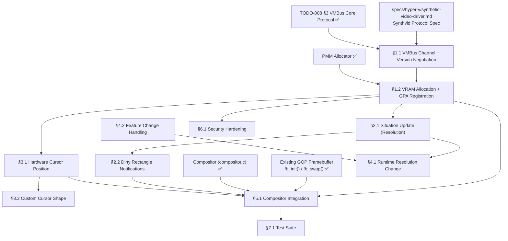

# 008.04 — Hyper-V Synthetic Video Driver (hvfb)

> **Goal:** Implement the Hyper-V Synthetic Video Driver for Impossible OS,
> enabling proper VMBus-based framebuffer management on Hyper-V Gen 2 VMs.
> The driver must negotiate the synthvid protocol over VMBus, register the
> VRAM location with the host via GPA mapping, support hardware cursor
> compositing (eliminating double-cursor), handle dirty rectangle
> notifications, and enable runtime resolution changes — replacing the
> basic UEFI GOP fallback with a fully-functional synthetic video stack.

> [!CAUTION]
> **Memory Rule:** Use `pmm_alloc_contiguous()` for framebuffer VRAM
> (up to 8 MiB) and back buffers. `kmalloc` is ONLY for small kernel
> structs (≤ 4 KB). The kernel heap is only 2 MiB — framebuffer
> allocations via `kmalloc()` cause silent heap exhaustion.
> See `rules.md` Known Gotchas. *(Fixed in commit `9722a74`)*

> [!WARNING]
> **8 MiB VRAM ceiling.** The synthetic video driver hardcodes a maximum
> VRAM allocation of exactly 8,388,608 bytes. At 32bpp, 1920×1080 uses
> 8,294,400 bytes — only 94,208 bytes to spare. Resolutions above
> 1920×1080 (e.g., 2560×1440 at 14.7 MiB) are **impossible** via
> synthetic video. Higher resolutions require Enhanced Session Mode (RDP)
> or GPU passthrough (DDA/GPU-P).

> [!IMPORTANT]
> **Spec Reference:** All protocol details, message formats, VRAM constraints,
> and security considerations reference the
> [Synthetic Video Driver Specification](file:///home/derickpayne/impossible-os/specs/hyper-v/synthetic-video-driver.md)
> in the repo at `specs/hyper-v/synthetic-video-driver.md`.

---

## TODO Completion Roadmap (Cross-File)

> [!IMPORTANT]
> **This file covers the Hyper-V Synthetic Video Driver (§6 of TODO-008).**
> It depends on VMBus core protocol (§3, ✅ Done) and integrates with the
> existing GOP framebuffer compositor. The driver replaces basic GOP fallback
> with proper VMBus video — enabling runtime resolution changes, hardware
> cursor, and dirty rectangle notifications.

### Dependency Graph

### Phase-by-Phase Implementation Order

| ⭐ | Phase  | Section                                  | What It Delivers                                                        | Depends On                   | Status |
| -- | :----: | ---------------------------------------- | ----------------------------------------------------------------------- | ---------------------------- | :----: |
| 💎 | **0**  | `specs/hyper-v/synthetic-video-driver.md` | Protocol wire formats, VRAM constraints, security — **read before coding** | —                           |   ✅   |
| 💎 | **0**  | `TODO-008 §3` VMBus Core Protocol       | VMBus channel open, ring buffers, GPADL — foundation for all synthvid    | —                            |   ✅   |
| 💎 | **1**  | §1.1 VMBus Channel + Version Negotiation | Connect to Video VSP, agree on protocol version                          | Phase 0 (VMBus)              |   ⬜   |
| 💎 | **1**  | §1.2 VRAM Allocation + GPA Registration  | PMM-backed VRAM, host knows where framebuffer lives                      | Phase 1 (§1.1)               |   ⬜   |
| 💎 | **2**  | §2.1 Situation Update (Resolution)       | Tell host current resolution and pixel format                            | Phase 1 (§1.2)               |   ⬜   |
| 💎 | **2**  | §2.2 Dirty Rectangle Notifications       | Only repaint changed regions — no full-screen scan                       | Phase 2 (§2.1)               |   ⬜   |
| 💎 | **3**  | §3.1 Hardware Cursor Position            | Eliminate double-cursor effect — host composites cursor                   | Phase 1 (§1.2)               |   ⬜   |
| 💎 | **3**  | §3.2 Custom Cursor Shape                 | Send custom cursor images to host for compositing                        | Phase 3 (§3.1)               |   ⬜   |
| 💎 | **4**  | §4.1 Runtime Resolution Change           | Handle `vmconnect.exe` window resize / Enhanced Session Mode             | Phase 2 (§2.1)               |   ⬜   |
| 💎 | **4**  | §4.2 Feature Change Handling             | Respond to host dynamic capability updates                               | Phase 4 (§4.1)               |   ⬜   |
| 💎 | **5**  | §5.1 Compositor Integration              | Replace GOP fallback with synthvid-backed framebuffer                    | Phase 1–3 (§1.2, §2.2, §3.1) |   ⬜   |
| 💎 | **6**  | §6.1 Security Hardening                  | TOCTOU-safe message parsing, bounds checking                             | Phase 1 (§1.2)               |   ⬜   |
| 💎 | **7**  | §7.1 Test Suite                          | Verify on Hyper-V Gen 2 — resolution, cursor, dirty rects               | Phase 5 (§5.1)               |   ⬜   |

> [!NOTE]
> **Phase 1** is the critical path: VMBus channel open + VRAM registration gives
> you a working synthetic framebuffer. **Phase 2** adds resolution reporting and
> dirty rectangle optimization. **Phase 3** adds hardware cursor — major UX win.
> **Phases 4–5** handle dynamic resolution and full compositor integration.
> **Phase 6** hardens security. **Phase 7** validates on real Hyper-V.

> [!TIP]
> **The GOP framebuffer at 1280×720×32bpp already works on Hyper-V Gen 2.**
> The synthetic video driver is an enhancement, not a blocker. Even without it,
> the boot splash and desktop render correctly. But the GOP fallback cannot
> do runtime resolution changes or hardware cursor — that's what this driver adds.

---

## 1. VMBus Channel Setup & Protocol Negotiation

### 1.1 VMBus Channel Open + Version Negotiation

**Prompt:** Open the VMBus channel for the Video VSP using GUID `{DA0A7802-E377-4AAC-8E77-0558EB1073F8}`. Allocate send/receive ring buffers via PMM. Negotiate the synthvid protocol version using a 3-level fallback: try `SYNTHVID_VERSION_WIN10` (3.5) first, then `SYNTHVID_VERSION_WIN8` (3.2), then `SYNTHVID_VERSION_WIN7` (3.0). The version determines available features — v3.5 enables hardware cursor and dynamic resolution. After completing all items, mark every item as `[x]`, run `bash scripts/build.sh clean`, and commit as `"drivers: hvfb VMBus channel and version negotiation"`. Add notes directly in this TODO section. After implementation, save any gotchas, solutions, and important information to MCP memory (`mcp_memory_create_entities` / `mcp_memory_add_observations`).

- [ ] Create `src/kernel/drivers/hyperv/hvfb.c` and `include/kernel/drivers/hyperv/hvfb.h`
- [ ] Find Video VSP channel via `vmbus_find_channel_by_guid()`:
  - [ ] GUID: `DA0A7802-E377-4AAC-8E77-0558EB1073F8`
- [ ] Open channel via `vmbus_open_channel()` with PMM-backed ring buffers
- [ ] Define synthvid message header (`synthvid_msg_hdr`):
  - [ ] `uint32_t type` — `SYNTHVID_*` command enumeration
  - [ ] `uint32_t size` — total message size
- [ ] Define version encoding: `SYNTHVID_VERSION(major, minor) = ((minor) << 16 | (major))`
- [ ] Implement `synthvid_negotiate_version()`:
  - [ ] Send `SYNTHVID_VERSION_REQUEST` with version 3.5 (Win10)
  - [ ] Read `SYNTHVID_VERSION_RESPONSE` — check status
  - [ ] If rejected: retry with 3.2 (Win8)
  - [ ] If rejected: retry with 3.0 (Win7)
  - [ ] If all rejected: fall back to GOP, log error
- [ ] Store negotiated version for feature gating (cursor, resolution)
- [ ] Log: `[OK] hvfb: synthvid protocol v%u.%u negotiated`
- [ ] Commit: `"drivers: hvfb VMBus channel and version negotiation"`

### 1.2 VRAM Allocation & GPA Registration

**Prompt:** Allocate contiguous physical memory for the synthetic VRAM region and register it with the host via `SYNTHVID_VRAM_LOCATION`. The VRAM must be PMM-allocated (up to 8 MiB for 1920×1080×32bpp), identity-mapped, and pinned (never ballooned). Send the Guest Physical Address to the host and wait for `SYNTHVID_VRAM_LOCATION_ACK`. Only after acknowledgment may the guest begin writing pixel data. After completing all items, mark every item as `[x]`, run `bash scripts/build.sh clean`, and commit as `"drivers: hvfb VRAM allocation and GPA registration"`. Add notes directly in this TODO section. After implementation, save any gotchas, solutions, and important information to MCP memory (`mcp_memory_create_entities` / `mcp_memory_add_observations`).

- [ ] Calculate VRAM size: `width × height × (bpp / 8)`
  - [ ] Default: 1920 × 1080 × 4 = 8,294,400 bytes ≈ 8 MiB
  - [ ] Fallback: 1280 × 720 × 4 = 3,686,400 bytes ≈ 3.6 MiB
  - [ ] Cap at 8 MiB (8,388,608 bytes) — hard synthvid limit
- [ ] Allocate VRAM via `pmm_alloc_contiguous()` — **NEVER `kmalloc()`**
  - [ ] Must be contiguous physical pages for GPA mapping
  - [ ] Identity-mapped (GPA == virtual address in kernel)
- [ ] Build `SYNTHVID_VRAM_LOCATION` message:
  - [ ] `user_ctx` — transaction tracking ID
  - [ ] `is_vram_gpa_specified = 1`
  - [ ] `vram_gpa` — physical address of allocated VRAM
- [ ] Send via VMBus ring buffer → `vmbus_ring_write()`
- [ ] Wait for `SYNTHVID_VRAM_LOCATION_ACK` from host
  - [ ] Poll ring buffer or use interrupt-driven receive
- [ ] On ACK: mark VRAM as active, clear to white/black
- [ ] Log: `[OK] hvfb: VRAM at GPA 0x%llX (%u bytes), ACK received`
- [ ] Log on failure: `[FAIL] hvfb: VRAM registration failed — falling back to GOP`
- [ ] Commit: `"drivers: hvfb VRAM allocation and GPA registration"`

> [!CAUTION]
> **VRAM memory is pinned.** Once registered via `SYNTHVID_VRAM_LOCATION`,
> the host continuously reads this GPA region. The memory cannot be freed,
> moved, ballooned, or swapped. This is a permanent 1:1 physical RAM footprint
> on the host. Always use PMM — the heap is only 2 MiB.

---

## 2. Display State Management

### 2.1 Situation Update (Resolution Reporting)

**Prompt:** After VRAM registration, inform the host of the current display resolution and pixel format via `SYNTHVID_SITUATION_UPDATE`. This tells the host VSP how to interpret the VRAM contents — width, height, stride, and pixel format. Wait for `SYNTHVID_SITUATION_UPDATE_ACK` before proceeding. If the resolution changes later (§4.1), send a new situation update. After completing all items, mark every item as `[x]`, run `bash scripts/build.sh clean`, and commit as `"drivers: hvfb situation update (resolution reporting)"`. Add notes directly in this TODO section. After implementation, save any gotchas, solutions, and important information to MCP memory (`mcp_memory_create_entities` / `mcp_memory_add_observations`).

- [ ] Build `SYNTHVID_SITUATION_UPDATE` message:
  - [ ] `user_ctx` — tracking ID
  - [ ] Video output count (typically 1)
  - [ ] For each output:
    - [ ] `active = 1`
    - [ ] `vram_offset = 0` (start of VRAM for this output)
    - [ ] `depth_bits = 32` (XRGB8888)
    - [ ] `width_pixels` — horizontal resolution
    - [ ] `height_pixels` — vertical resolution
    - [ ] `pitch_bytes = width × 4` — stride per scanline
- [ ] Send via VMBus ring buffer
- [ ] Wait for `SYNTHVID_SITUATION_UPDATE_ACK`
- [ ] On ACK: display is now live — host reads VRAM at this resolution
- [ ] Log: `[OK] hvfb: display %ux%u@%ubpp active`
- [ ] Commit: `"drivers: hvfb situation update (resolution reporting)"`

### 2.2 Dirty Rectangle Notifications

**Prompt:** Instead of having the host scan the entire 8 MiB VRAM every refresh cycle, send `SYNTHVID_DIRT` messages to notify the host which rectangular regions of the framebuffer have changed. This significantly reduces host-side overhead. Track dirty regions from the compositor's `fb_swap()` and consolidate into dirty rectangle messages. The message contains a count and an array of `{x, y, width, height}` rectangles. After completing all items, mark every item as `[x]`, run `bash scripts/build.sh clean`, and commit as `"drivers: hvfb dirty rectangle notifications"`. Add notes directly in this TODO section. After implementation, save any gotchas, solutions, and important information to MCP memory (`mcp_memory_create_entities` / `mcp_memory_add_observations`).

- [ ] Define dirty rectangle structure: `{ int32_t x, y, w, h }`
- [ ] Build `SYNTHVID_DIRT` message:
  - [ ] Video output index (typically 0)
  - [ ] Rectangle count
  - [ ] Array of dirty rectangles
- [ ] Track dirty regions:
  - [ ] Option A: full-screen dirty (single rect = entire display) — simple start
  - [ ] Option B: per-window dirty rects from compositor — optimal
- [ ] Send `SYNTHVID_DIRT` after each `fb_swap()` call
- [ ] Consolidate overlapping rectangles to reduce message count
- [ ] Cap: maximum 16 KiB message → limit rectangles per message
- [ ] Log: `[hvfb] dirt: %u rects, total %u pixels`
- [ ] Commit: `"drivers: hvfb dirty rectangle notifications"`

> [!TIP]
> **Start with full-screen dirty rectangles** (a single rect covering the
> entire display). This is functionally correct and easy to implement.
> Optimize to per-window dirty rects later once the compositor tracks
> invalidated regions — this is a performance optimization, not a
> correctness requirement.

---

## 3. Hardware Cursor

### 3.1 Hardware Cursor Position

**Prompt:** The synthetic video driver's hardware cursor eliminates the "double cursor" effect of emulated VGA. Instead of rendering the cursor into the framebuffer (causing latency and desync), send cursor coordinates to the host via `SYNTHVID_POINTER_POSITION`. The host composites the cursor over the VM window at native refresh rate. This requires synthvid protocol version ≥ 3.5 (Win10). After completing all items, mark every item as `[x]`, run `bash scripts/build.sh clean`, and commit as `"drivers: hvfb hardware cursor position"`. Add notes directly in this TODO section. After implementation, save any gotchas, solutions, and important information to MCP memory (`mcp_memory_create_entities` / `mcp_memory_add_observations`).

- [ ] Gate on protocol version ≥ 3.5 (Win10) — fallback to software cursor otherwise
- [ ] Build `SYNTHVID_POINTER_POSITION` message:
  - [ ] `is_visible` (u8) — cursor visibility flag (1 = shown, 0 = hidden)
  - [ ] `video_output` (u8) — target display index (typically 0)
  - [ ] `image_x` (i32) — horizontal pixel coordinate
  - [ ] `image_y` (i32) — vertical pixel coordinate
- [ ] Hook into compositor's mouse move handler:
  - [ ] When running on Hyper-V: send position via synthvid, skip drawing cursor in back buffer
  - [ ] When NOT on Hyper-V: draw cursor in back buffer as before
- [ ] Send position update on every mouse move event
- [ ] Handle cursor hide/show (window focus changes, menu overlays)
- [ ] Log: `[OK] hvfb: hardware cursor enabled (synthvid v3.5+)`
- [ ] Commit: `"drivers: hvfb hardware cursor position"`

### 3.2 Custom Cursor Shape

**Prompt:** For custom cursor images (resize arrows, hand pointers, text beams), send the cursor bitmap to the host via `SYNTHVID_POINTER_SHAPE`. The host renders the custom cursor over the VM window. This avoids the guest drawing the cursor into the framebuffer entirely. The message includes cursor dimensions, hotspot coordinates, and pixel data (ARGB32). After completing all items, mark every item as `[x]`, run `bash scripts/build.sh clean`, and commit as `"drivers: hvfb custom cursor shape"`. Add notes directly in this TODO section. After implementation, save any gotchas, solutions, and important information to MCP memory (`mcp_memory_create_entities` / `mcp_memory_add_observations`).

- [ ] Gate on protocol version ≥ 3.5 (Win10)
- [ ] Build `SYNTHVID_POINTER_SHAPE` message:
  - [ ] Cursor width and height (pixels)
  - [ ] Hotspot X and Y (offset within cursor for click point)
  - [ ] Cursor type: monochrome, color, or masked color
  - [ ] Pixel data: ARGB32 bitmap of cursor image
- [ ] Integrate with cursor manager:
  - [ ] When cursor shape changes: send new `SYNTHVID_POINTER_SHAPE`
  - [ ] Cache sent shapes — only resend on actual change
- [ ] Standard cursors to support:
  - [ ] Arrow (default), Hand (link), I-beam (text), Crosshair
  - [ ] Resize arrows (N-S, E-W, NE-SW, NW-SE)
  - [ ] Wait spinner, move icon
- [ ] Log: `[hvfb] cursor shape: %ux%u, hotspot (%d,%d)`
- [ ] Commit: `"drivers: hvfb custom cursor shape"`

---

## 4. Dynamic Resolution

### 4.1 Runtime Resolution Change

**Prompt:** Handle runtime resolution changes initiated by the host (e.g., vmconnect.exe window resize, Enhanced Session Mode). The host sends `SYNTHVID_RESOLUTION_REQUEST` (protocol v3.5+) with the desired new resolution. The guest must: validate the resolution fits within the 8 MiB VRAM ceiling, reallocate or reuse the VRAM buffer, send `SYNTHVID_RESOLUTION_RESPONSE` accepting or rejecting the change, then send a new `SYNTHVID_SITUATION_UPDATE` with the updated resolution. After completing all items, mark every item as `[x]`, run `bash scripts/build.sh clean`, and commit as `"drivers: hvfb runtime resolution change"`. Add notes directly in this TODO section. After implementation, save any gotchas, solutions, and important information to MCP memory (`mcp_memory_create_entities` / `mcp_memory_add_observations`).

- [ ] Register handler for `SYNTHVID_RESOLUTION_REQUEST` messages
- [ ] On resolution request from host:
  - [ ] Extract requested width, height, depth
  - [ ] Validate: `width × height × (depth/8) ≤ 8,388,608` (8 MiB)
  - [ ] If valid and VRAM fits: accept
  - [ ] If exceeds 8 MiB: reject with error
- [ ] Send `SYNTHVID_RESOLUTION_RESPONSE`:
  - [ ] Status: accepted or rejected
  - [ ] If accepted: update internal resolution state
- [ ] If accepted:
  - [ ] Update framebuffer dimensions (width, height, pitch)
  - [ ] Send `SYNTHVID_SITUATION_UPDATE` with new resolution (§2.1)
  - [ ] Notify compositor of resolution change → relayout desktop
  - [ ] Reallocate back buffer if needed (via `pmm_alloc_contiguous()`)
- [ ] Supported resolutions within 8 MiB at 32bpp:
  - [ ] 1152 × 864 (3.9 MiB) — default
  - [ ] 1280 × 720 (3.6 MiB) — current GOP default
  - [ ] 1280 × 1024 (5.2 MiB)
  - [ ] 1600 × 1200 (7.7 MiB)
  - [ ] 1920 × 1080 (7.9 MiB) — maximum
- [ ] Log: `[hvfb] resolution change: %ux%u → %ux%u (%s)`
- [ ] Commit: `"drivers: hvfb runtime resolution change"`

### 4.2 Feature Change Handling

**Prompt:** Handle `SYNTHVID_FEATURE_CHANGE` messages from the host. These indicate dynamic capability updates — features being enabled or disabled at runtime (e.g., hardware cursor support toggled during Enhanced Session transitions). Update the driver's feature flags accordingly and adjust behavior. After completing all items, mark every item as `[x]`, run `bash scripts/build.sh clean`, and commit as `"drivers: hvfb feature change handling"`. Add notes directly in this TODO section. After implementation, save any gotchas, solutions, and important information to MCP memory (`mcp_memory_create_entities` / `mcp_memory_add_observations`).

- [ ] Register handler for `SYNTHVID_FEATURE_CHANGE` messages
- [ ] Parse feature change payload:
  - [ ] Hardware cursor enabled/disabled
  - [ ] Dirty rectangle support enabled/disabled
  - [ ] Resolution change support enabled/disabled
- [ ] Update driver feature flags on change
- [ ] If hardware cursor disabled: fall back to software cursor rendering
- [ ] If dirty rect disabled: revert to full-screen updates
- [ ] Log: `[hvfb] feature change: cursor=%s, dirty=%s, resize=%s`
- [ ] Commit: `"drivers: hvfb feature change handling"`

---

## 5. Compositor Integration

### 5.1 Framebuffer Subsystem Integration

**Prompt:** Integrate the synthetic video driver with the existing framebuffer subsystem (`fb_init()` / `fb_swap()` / `compositor.c`). When running on Hyper-V with a successful synthvid negotiation, the compositor should use the synthvid VRAM as the primary framebuffer instead of the UEFI GOP address. The back buffer remains PMM-allocated (existing pattern). On `fb_swap()`, copy back buffer → synthvid VRAM, then send dirty rectangles. If synthvid init fails, fall back transparently to the existing GOP framebuffer. After completing all items, mark every item as `[x]`, run `bash scripts/build.sh clean`, and commit as `"drivers: hvfb compositor integration"`. Add notes directly in this TODO section. After implementation, save any gotchas, solutions, and important information to MCP memory (`mcp_memory_create_entities` / `mcp_memory_add_observations`).

- [ ] Implement `hvfb_init()` — called from `boot_storage.c` after VMBus init:
  - [ ] Open channel (§1.1), negotiate version, allocate VRAM (§1.2)
  - [ ] Send situation update (§2.1)
  - [ ] If successful: register as primary framebuffer
  - [ ] If failed: return error, caller continues with GOP
- [ ] Integrate with `fb_init()` / `fb_get_info()`:
  - [ ] If hvfb active: report synthvid VRAM dimensions
  - [ ] If hvfb inactive: report GOP framebuffer (existing behavior)
- [ ] Integrate with `fb_swap()`:
  - [ ] Copy back buffer → synthvid VRAM
  - [ ] Send `SYNTHVID_DIRT` for changed regions (§2.2)
- [ ] Integrate with compositor mouse handling:
  - [ ] If hvfb + cursor support: use `SYNTHVID_POINTER_POSITION` (§3.1)
  - [ ] Else: software cursor (existing behavior)
- [ ] Handle mode transitions:
  - [ ] Resolution change (§4.1) → resize back buffer + relayout
  - [ ] Feature change (§4.2) → toggle cursor/dirty behavior
- [ ] Boot sequence: `vmbus_init()` → `hvfb_init()` → `fb_init()` uses hvfb
- [ ] Log: `[OK] Framebuffer: hvfb (synthetic video) %ux%u@%ubpp`
- [ ] Fallback log: `[WARN] hvfb init failed — using GOP framebuffer`
- [ ] Commit: `"drivers: hvfb compositor integration"`

> [!NOTE]
> **Existing double-buffering pattern:** The compositor already uses a
> PMM-allocated back buffer + `fb_swap()` to copy to the front buffer.
> The synthvid VRAM simply replaces the GOP front buffer address. The
> back buffer remains unchanged — same pattern, different destination.

---

## 6. Security Hardening

### 6.1 TOCTOU-Safe Message Parsing

**Prompt:** VMBus ring buffer memory is directly accessible to the host. Messages received over the ring buffer must be copied into private, unshared kernel memory BEFORE validation and processing. This prevents Time-of-Check-to-Time-of-Use (TOCTOU) attacks where the host modifies message contents between validation and use. Validate all message sizes, types, and field ranges against the protocol spec. This is especially critical for `SYNTHVID_RESOLUTION_REQUEST` (attacker-controlled dimensions) and `SYNTHVID_FEATURE_CHANGE`. After completing all items, mark every item as `[x]`, run `bash scripts/build.sh clean`, and commit as `"drivers: hvfb security hardening"`. Add notes directly in this TODO section. After implementation, save any gotchas, solutions, and important information to MCP memory (`mcp_memory_create_entities` / `mcp_memory_add_observations`).

> [!WARNING]
> **CVE-2025-21977 context:** The Linux `hyperv_fb` driver had a critical
> flaw where VRAM address mismatch during kexec caused page fault storms.
> `hyperv_drm` fixed this by removing conflicting framebuffers before
> allocation. Impossible OS avoids this class of bug by using the UEFI
> GOP address as the initial framebuffer and only switching to synthvid
> VRAM after explicit registration — there is no address to become stale.

- [ ] Copy-then-validate for ALL received messages:
  - [ ] Read from ring buffer → copy into stack-local or PMM buffer
  - [ ] Validate copied data — never reference ring buffer directly
  - [ ] Prevents TOCTOU attacks from malicious/buggy host
- [ ] Validate `synthvid_msg_hdr`:
  - [ ] `type` must be a known `SYNTHVID_*` value
  - [ ] `size` must not exceed `MAX_VMBUS_PKT_SIZE` (0x4000 = 16 KiB)
  - [ ] `size` must be ≥ `sizeof(synthvid_msg_hdr)` (8 bytes)
- [ ] Validate `SYNTHVID_RESOLUTION_REQUEST`:
  - [ ] Width: 1 ≤ width ≤ 1920 (reject 0 and absurd values)
  - [ ] Height: 1 ≤ height ≤ 1080 (reject 0 and absurd values)
  - [ ] `width × height × 4 ≤ 8,388,608` (8 MiB VRAM ceiling)
- [ ] Validate all enum fields against known valid values
- [ ] Bounds-check array indices and offsets before use
- [ ] Log on rejected messages: `[hvfb] SECURITY: rejected invalid message type=%u size=%u`
- [ ] Commit: `"drivers: hvfb security hardening"`

---

## 7. Testing & Validation

### 7.1 Test Suite

**Prompt:** Validate the synthetic video driver on a real Hyper-V Gen 2 VM. Verify: VMBus channel opens, protocol version negotiates, VRAM registers with host ACK, display renders correctly, hardware cursor works (no double cursor), dirty rectangles reduce host CPU, and runtime resolution change responds to vmconnect window resize. Test fallback: verify GOP framebuffer still works when synthvid init fails (e.g., on QEMU). After completing all items, mark every item as `[x]`, run `bash scripts/build.sh clean`, and commit as `"test: hvfb synthetic video validation"`. Add notes directly in this TODO section. After implementation, save any gotchas, solutions, and important information to MCP memory (`mcp_memory_create_entities` / `mcp_memory_add_observations`).

- [ ] Test on Hyper-V Gen 2 VM (via `scripts/vm/run-hyperv.ps1`):
  - [ ] Verify VMBus channel opens for Video VSP GUID
  - [ ] Verify protocol version negotiation (expect v3.5 on modern hosts)
  - [ ] Verify VRAM_LOCATION + ACK handshake
  - [ ] Verify display renders correctly (boot splash, desktop)
  - [ ] Verify no display freeze after `ExitBootServices()`
- [ ] Test hardware cursor:
  - [ ] Move mouse — no "double cursor" effect
  - [ ] Cursor matches host-rendered cursor
  - [ ] Cursor hides/shows correctly
- [ ] Test resolution change:
  - [ ] Resize vmconnect window → verify resolution change flow
  - [ ] Verify desktop relayout after resolution change
- [ ] Test fallback on QEMU:
  - [ ] Verify GOP framebuffer works (no synthvid on QEMU)
  - [ ] No crashes or hangs — graceful fallback
- [ ] Test edge cases:
  - [ ] Request resolution exceeding 8 MiB → verify rejection
  - [ ] Rapid resolution changes → verify no corruption
  - [ ] Cursor at screen edges → verify no overflow
- [ ] Boot log must show:
  - [ ] `[OK] hvfb: synthvid protocol vX.Y negotiated`
  - [ ] `[OK] hvfb: VRAM at GPA 0x... (N bytes), ACK received`
  - [ ] `[OK] Framebuffer: hvfb (synthetic video) WxH@32bpp`
- [ ] Commit: `"test: hvfb synthetic video validation"`

---

## Key Files

| File                                              | Change  | Purpose                                          |
| ------------------------------------------------- | ------- | ------------------------------------------------ |
| `src/kernel/drivers/hyperv/hvfb.c`                | NEW     | Synthetic video driver — all synthvid protocol   |
| `include/kernel/drivers/hyperv/hvfb.h`            | NEW     | Synthvid message types, VRAM structs, public API |
| `src/kernel/drivers/hyperv/vmbus.c`               | ✅ Done | VMBus core: ring buffers, channel open (§3)     |
| `include/kernel/drivers/hyperv/vmbus.h`           | ✅ Done | VMBus protocol types, Video VSP GUID            |
| `src/kernel/main/boot_storage.c`                  | MODIFY  | Call `hvfb_init()` after VMBus init              |
| `src/kernel/video/fb.c`                           | MODIFY  | Route to synthvid VRAM when hvfb active          |
| `src/kernel/compositor/compositor.c`              | MODIFY  | Hardware cursor + dirty rect integration         |
| `specs/hyper-v/synthetic-video-driver.md`         | REF     | Protocol specification                           |

---

## Priority Order

| ⭐ | Priority  | Section                              | Description                                                          |
| -- | :-------: | ------------------------------------ | -------------------------------------------------------------------- |
| 💎 | 🔴 P0    | §1.1 VMBus Channel + Version Neg.    | Foundation — connect to Video VSP                                    |
| 💎 | 🔴 P0    | §1.2 VRAM Allocation + GPA Reg.      | Foundation — host must know where framebuffer lives                   |
| 💎 | 🟠 P1    | §2.1 Situation Update (Resolution)   | Display — tell host current resolution + pixel format                |
| 💎 | 🟠 P1    | §5.1 Compositor Integration          | Integration — wire hvfb into existing framebuffer stack              |
| 💎 | 🟡 P2    | §2.2 Dirty Rectangle Notifications   | Performance — avoid full-screen scans                                |
| 💎 | 🟡 P2    | §3.1 Hardware Cursor Position        | UX — eliminate double-cursor effect                                  |
| 💎 | 🟡 P2    | §4.1 Runtime Resolution Change       | Feature — respond to vmconnect window resize                         |
| 💎 | 🟢 P3    | §3.2 Custom Cursor Shape             | Polish — resize arrows, hand pointers, etc.                         |
| 💎 | 🟢 P3    | §4.2 Feature Change Handling         | Robustness — handle dynamic capability toggling                      |
| 💎 | 🟢 P3    | §6.1 Security Hardening              | Security — TOCTOU-safe message parsing                               |
| 💎 | 🟢 P3    | §7.1 Test Suite                      | Validation — verify on real Hyper-V Gen 2                            |

> [!NOTE]
> ⭐ = Feature where Impossible OS can be **superior** to both Windows and Linux.

---

## OS Comparison

| ⭐ | Feature                              | 🪟 Windows 11 (`hypervideo.sys`)  | 🐧 Linux (`hyperv_drm`)            | 🚀 Impossible OS (`hvfb.c`)              |
| -- | ------------------------------------ | --------------------------------- | ----------------------------------- | ----------------------------------------- |
| 💎 | VMBus video channel open             | ✅ Native                         | ✅ DRM subsystem                    | ⬜ §1.1 P0                               |
| 💎 | VRAM GPA registration                | ✅ Native                         | ✅ `SYNTHVID_VRAM_LOCATION`         | ⬜ §1.2 P0                               |
| 💎 | Protocol version negotiation         | ✅ v3.5 (Win10+)                  | ✅ v3.5 fallback chain              | ⬜ §1.1 P0                               |
| 💎 | Situation update (resolution)        | ✅ Native                         | ✅ DRM mode setting                 | ⬜ §2.1 P1                               |
| 💎 | Dirty rectangle notifications        | ✅ Native                         | ✅ Per-region DRM updates            | ⬜ §2.2 P2                               |
| 💎 | Hardware cursor (position)           | ✅ Native                         | ✅ DRM cursor plane                 | ⬜ §3.1 P2                               |
| 💎 | Custom cursor shapes                 | ✅ Full                           | ✅ DRM cursor buffer                | ⬜ §3.2 P3                               |
| 💎 | Runtime resolution change            | ✅ Dynamic                         | ✅ `xrandr` via DRM                 | ⬜ §4.1 P2                               |
| 💎 | Feature change handling              | ✅ Dynamic                         | ✅ Handled                          | ⬜ §4.2 P3                               |
| 💎 | TOCTOU-safe message parsing          | ✅ Native WDDM                    | ✅ Copy-then-validate               | ⬜ §6.1 P3                               |
| 💎 | CVE-2025-21977 (MMIO trap storms)    | ✅ N/A (native driver)            | ✅ Fixed in `hyperv_drm`             | ✅ N/A (no efifb conflict by design)      |
| 💎 | Enhanced Session Mode (RDP)          | ✅ Native                         | ✅ `xrdp` integration               | ⬜ Future — beyond synthvid               |
| 💎 | DDA / GPU-P passthrough              | ✅ Full WDDM                      | ✅ Vendor drivers                    | ⬜ Future — requires VPCI (§12.3)         |
| 💎 | Max resolution (basic session)       | 1920×1080                         | 1920×1080                           | 1920×1080 (8 MiB VRAM cap)               |
| 💎 | Max resolution (enhanced session)    | 4K+                               | 4K+ (via RDP)                       | ⬜ Future — Enhanced Session              |
| 💎 | GOP framebuffer fallback             | N/A                               | ✅ `efifb` / `simplefb`             | ✅ 1280×720 GOP — already works           |

> **After §1:** Working synthetic framebuffer — host reads VRAM directly.
> **After §2–§3:** Display state management + hardware cursor — polished UX.
> **After §4–§5:** Dynamic resolution + full compositor integration — feature-complete.
> **After §6–§7:** Security hardened and validated on real Hyper-V hardware.
