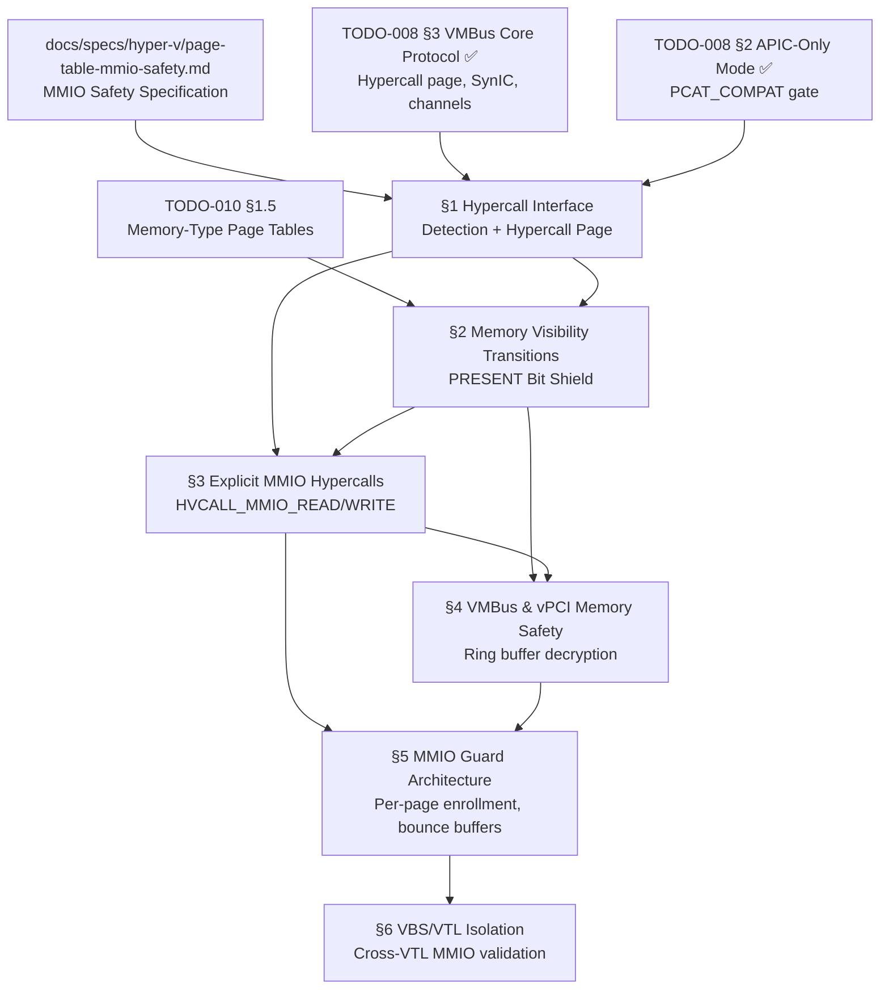

# 008.06-Page-Table-MMIO — Hyper-V Page Table MMIO Safety

> **Goal:** Implement MMIO Safety protocols for Impossible OS running under
> Microsoft Hyper-V Confidential Computing (CoCo) and Virtualization-Based
> Security (VBS) environments. The OS must transition from implicit
> trap-and-emulate MMIO to explicit hypercalls (`HVCALL_MMIO_READ` /
> `HVCALL_MMIO_WRITE`), manage page table visibility transitions safely
> (PRESENT bit shield), secure VMBus shared memory, implement bounce
> buffers for virtio, and enforce MMIO Guard per-page enrollment.

> [!CAUTION]
> **Memory Rule:** Use `pmm_alloc_contiguous()` for ALL buffers > 4 KB (bounce
> buffers, ring buffers, MMIO guard enrollment arrays). `kmalloc` is ONLY for
> small kernel structs (≤ 4 KB). See `rules.md` Known Gotchas.

> [!WARNING]
> **Confidential Computing is a paradigm shift.** In CoCo / VBS environments,
> the hypervisor is deliberately excluded from the guest's trust boundary.
> Guest memory is cryptographically protected, CPU registers are scrubbed on
> VM-exits, and the hypervisor **cannot** decode the guest instruction stream.
> Traditional trap-and-emulate MMIO is **impossible** — explicit hypercalls are
> the only path.

> [!IMPORTANT]
> **Spec Reference:** All data structures, hypercall IDs, register conventions,
> and security protocols reference the
> [Page Table MMIO Safety Specification](file:///home/derickpayne/impossible-os/docs/specs/hyper-v/page-table-mmio-safety.md)
> in the repo at `docs/specs/hyper-v/page-table-mmio-safety.md`.

---

## TODO Completion Roadmap (Cross-File)

> [!IMPORTANT]
> **Six TODO sections and one spec** feed into MMIO Safety. They have strict
> dependencies: hypercall interface → page visibility transitions → explicit
> MMIO hypercalls → VMBus memory marking → MMIO Guard → VBS/VTL isolation.
> The hypercall page must exist before ANY MMIO safety protocol can be used.

### Dependency Graph

### Phase-by-Phase Implementation Order

| Phase  | Section                                    | What It Delivers                                                        | Depends On                    | Status |
| :----: | ------------------------------------------ | ----------------------------------------------------------------------- | ----------------------------- | :----: |
| **0**  | `docs/specs/hyper-v/page-table-mmio-safety.md`  | Wire formats, hypercall ABI, security protocols — **read before coding** | —                             |   ✅   |
| **0**  | `TODO-008 §3 VMBus Core`                   | Hypercall page, SynIC, version negotiation — prerequisite                | —                             |   ✅   |
| **1**  | §1 Hypercall Interface                     | Hypervisor detection, hypercall page provisioning, calling convention    | Phase 0 (VMBus core)          |   ⬜   |
| **2**  | §2 Memory Visibility Transitions           | PRESENT bit shield, safe encrypted↔decrypted page flipping              | Phase 1 (§1)                  |   ⬜   |
| **2**  | §3 Explicit MMIO Hypercalls                | `hv_mmio_read()` / `hv_mmio_write()` via `HVCALL_MMIO_READ/WRITE`      | Phase 1 (§1) + Phase 2 (§2)  |   ⬜   |
| **3**  | §4 VMBus & vPCI Memory Safety              | Ring buffer decryption marking, vPCI frontend config routing            | Phase 2 (§2, §3)             |   ⬜   |
| **4**  | §5 MMIO Guard Architecture                 | Per-page enrollment, bounce buffers, stage-2 enforcement                | Phase 2 (§3) + Phase 3 (§4)  |   ⬜   |
| **5**  | §6 VBS/VTL Isolation                       | Cross-VTL MMIO validation, payload size enforcement                     | Phase 4 (§5)                  |   ⬜   |

> [!NOTE]
> **Phase 1** establishes the hypercall interface — this is the foundation for ALL MMIO
> safety protocols. **Phase 2** implements the two core mechanisms: safe page transitions
> and explicit MMIO routing. **Phase 3** secures VMBus shared memory. **Phase 4** adds
> defense-in-depth with the MMIO Guard. **Phase 5** extends isolation to VBS/VTL
> boundaries for Credential Guard and HVCI.

> [!TIP]
> **§1 may overlap with existing VMBus code.** The VMBus core protocol (TODO-008 §3)
> already sets up the hypercall page and detects Hyper-V. This section focuses on
> CoCo-specific extensions: _extended_ capability detection, confidential VM awareness,
> and ensuring the hypercall ABI is correct for MMIO-specific hypercalls.

---

## 1. Hypercall Interface for CoCo MMIO

> **XREF:** [TODO-008-Hyper-V-Runner.md §3](../TODO-008-Hyper-V-Runner.md) — VMBus Core Protocol
> **XREF:** [TODO-008-Hyper-V-Runner.md §9](../TODO-008-Hyper-V-Runner.md) — Page Table MMIO Safety

**Prompt:** Extend the existing Hyper-V hypercall interface for Confidential Computing MMIO safety. Confirm the hypervisor is detected via CPUID (leaf `0x40000000` = `"Microsoft Hv"`, leaf `0x40000001` = `"Hv#1"`), the hypercall page is provisioned via `HV_X64_MSR_HYPERCALL`, and the Guest OS ID is set via `HV_X64_MSR_GUEST_OS_ID`. Add CoCo-specific capability detection: query CPUID leaf `0x40000003` for extended hypercall support (MMIO read/write availability). Implement the hypercall calling convention wrapper with proper register encoding (call code in RCX bits 0–15, fast flag in bit 16, rep count/start in upper bits). After completing all items, mark every item as `[x]`, run `bash scripts/build.sh clean`, and commit as `"hyperv: CoCo MMIO hypercall interface"`. Add notes directly in this TODO section. After implementation, save any gotchas, solutions, and important information to MCP memory (`mcp_memory_create_entities` / `mcp_memory_add_observations`).

- [ ] Verify Hyper-V detection via CPUID leaf `0x40000001` (signature `"Hv#1"`)
- [ ] Verify hypercall page is provisioned at a free GPA via `HV_X64_MSR_HYPERCALL`
- [ ] Verify Guest OS ID is written via `HV_X64_MSR_GUEST_OS_ID` (required before any hypercalls)
- [ ] Query CPUID leaf `0x40000003` for extended feature flags:
  - [ ] Check for `HVCALL_MMIO_READ` / `HVCALL_MMIO_WRITE` support
  - [ ] Check for isolation type (CoCo vs standard VM)
- [ ] Define `hv_hypercall_input_t` union:
  - [ ] `call_code` : 16 bits — hypercall ID
  - [ ] `fast` : 1 bit — register-based calling
  - [ ] `var_hdr_sz` : 9 bits — variable header size / 8
  - [ ] `rep_count` : 12 bits — rep call element count
  - [ ] `rep_start` : 12 bits — rep call start index
- [ ] Implement `hv_do_hypercall(call_code, input_gpa, output_gpa)`:
  - [ ] Encode call code + flags into RCX
  - [ ] Input GPA in RDX, output GPA in R8
  - [ ] `CALL` the hypercall page
  - [ ] Return result from RAX
- [ ] Implement `hv_do_fast_hypercall(call_code, input1, input2)`:
  - [ ] Parameters in registers (no memory buffers)
  - [ ] Set `fast` bit in RCX
- [ ] Verify hypercall page is mapped as executable in kernel page tables
- [ ] Verify writes to hypercall page trigger `#GP` (interface integrity)
- [ ] Log: `[HV-MMIO] CoCo MMIO hypercalls available: read=0x0106, write=0x0107`
- [ ] Commit: `"hyperv: CoCo MMIO hypercall interface"`

---

## 2. Memory Visibility Transitions (PRESENT Bit Shield)

> **XREF:** [TODO-010-Bootloader.md §1.5](../../010-Kernel-Foundations/TODO-010-Bootloader.md) — Page Tables Enhancement

**Prompt:** Implement safe memory visibility transitions for Confidential Computing environments. When transitioning a page from encrypted (private) to decrypted (shared) or vice versa, the page is in an undefined state during the transition window. Speculative CPU prefetch can touch the page mid-transition, causing a fatal `#VC` (AMD SEV-SNP) or `#VE` (Intel TDX) exception. The solution: clear the PRESENT bit in the PTE BEFORE the transition, so speculative access triggers a recoverable `#PF` instead of an unrecoverable `#VC`/`#VE`. Restore PRESENT after the transition completes. The error path MUST restore PRESENT even on failure. After completing all items, mark every item as `[x]`, run `bash scripts/build.sh clean`, and commit as `"mm: PRESENT bit shield for CoCo visibility transitions"`. Add notes directly in this TODO section. After implementation, save any gotchas, solutions, and important information to MCP memory (`mcp_memory_create_entities` / `mcp_memory_add_observations`).

> [!CAUTION]
> **This pattern is non-negotiable.** Failure to clear the PRESENT bit during
> visibility transitions causes intermittent, non-deterministic kernel panics
> driven by unpredictable CPU prefetchers. Functions like
> `load_unaligned_zeropad()` routinely make stray memory references that will
> trigger fatal `#VC`/`#VE` on mid-transition pages.

- [ ] Implement `set_memory_np(gpa, npages)`:
  - [ ] Clear the PRESENT bit in every PTE covering the GPA range
  - [ ] Issue `INVLPG` for each page to flush TLB entries
  - [ ] After this, any access generates `#PF` (safe, fixable)
- [ ] Implement `set_memory_p(gpa, npages)`:
  - [ ] Restore the PRESENT bit in every PTE
  - [ ] Issue `INVLPG` for each page
- [ ] Implement `set_memory_decrypted_present(gpa, npages)`:
  - [ ] Set PRESENT + clear encryption/C-bit (AMD) or set S-bit (Intel TDX)
  - [ ] Mark page as shared/decrypted in guest page tables
- [ ] Implement `set_memory_encrypted_present(gpa, npages)`:
  - [ ] Set PRESENT + set encryption/C-bit (AMD) or clear S-bit (Intel TDX)
  - [ ] Mark page as private/encrypted in guest page tables
- [ ] Implement `hv_safe_visibility_transition(gpa, npages, make_shared)`:
  - [ ] Step 1: `set_memory_np()` — clear PRESENT (shield)
  - [ ] Step 2: `hv_set_host_visibility()` — issue hypercall while page is Not Present
  - [ ] Step 3: On success → `set_memory_decrypted_present()` or `set_memory_encrypted_present()`
  - [ ] Step 4 (error path): `set_memory_p()` — MUST restore PRESENT on failure
- [ ] Handle AMD SEV-SNP `#VC` exception (vector 29):
  - [ ] Register `#VC` handler in IDT
  - [ ] Decode faulting instruction from GHCB (Guest Hypervisor Communication Block)
  - [ ] Route MMIO accesses to explicit hypercalls
- [ ] Handle Intel TDX `#VE` exception (vector 20):
  - [ ] Register `#VE` handler in IDT
  - [ ] MMIO via `TDCALL` formatted as `TDG.VP.VMCALL <#VE.RequestMMIO>`
  - [ ] Toggle S-bit in GPA for shared memory
- [ ] Test: safe transition → verify `#PF` during transition window (NOT `#VC`/`#VE`)
- [ ] Log: `[HV-MMIO] Visibility transition: GPA 0x%lx, %zu pages → %s`
- [ ] Commit: `"mm: PRESENT bit shield for CoCo visibility transitions"`

---

## 3. Explicit MMIO Hypercalls (Read/Write)

**Prompt:** Implement `HVCALL_MMIO_READ` (0x0106) and `HVCALL_MMIO_WRITE` (0x0107) as the explicit MMIO routing mechanism for Confidential Computing. In CoCo environments, the hypervisor cannot decode the guest instruction stream (memory is encrypted), so the guest must explicitly communicate the MMIO operation. Disable interrupts during hypercalls to reserve the per-CPU hypercall page. Copy the result from the shared output page to private (stack/register) memory IMMEDIATELY — never use values directly from shared pages (double-fetch vulnerability). After completing all items, mark every item as `[x]`, run `bash scripts/build.sh clean`, and commit as `"hyperv: explicit MMIO read/write hypercalls"`. Add notes directly in this TODO section. After implementation, save any gotchas, solutions, and important information to MCP memory (`mcp_memory_create_entities` / `mcp_memory_add_observations`).

> [!IMPORTANT]
> **Double-fetch prevention is mandatory.** The output data from
> `HVCALL_MMIO_READ` resides in a shared, host-visible page. If the guest uses
> the value directly (e.g., as a loop counter or array index), a malicious
> hypervisor can modify it between validation and use (TOCTOU). **Always copy to
> private memory first.**

### 3.1 MMIO Read (`HVCALL_MMIO_READ` — 0x0106)

- [ ] Define `hv_mmio_read_input_t`:
  - [ ] `gpa` : `uint64_t` — Guest Physical Address of the MMIO register
  - [ ] `size` : `uint32_t` — Size of read (1, 2, 4, or 8 bytes)
  - [ ] `reserved` : `uint32_t` — Padding for 64-bit alignment
- [ ] Define `hv_mmio_read_output_t`:
  - [ ] `data[32]` : `uint8_t` — Array holding the read value (up to `HV_HYPERCALL_MMIO_MAX_DATA_LENGTH`)
- [ ] Implement `hv_mmio_read(gpa, size)`:
  - [ ] `irq_disable()` — reserve per-CPU hypercall page
  - [ ] Populate input struct on per-CPU hypercall input page
  - [ ] Call `hv_do_hypercall(HVCALL_MMIO_READ, input, output)`
  - [ ] On success: copy result from shared page to local (stack) variable IMMEDIATELY
  - [ ] `switch(size)`: 1B → `data[0]`, 2B → `*(uint16_t *)data`, 4B → `*(uint32_t *)data`, 8B → `*(uint64_t *)data`
  - [ ] `irq_enable()`
  - [ ] Return the locally copied value
- [ ] Validate: reject `size` values other than 1, 2, 4, 8
- [ ] Log errors: `[MMIO] Read failed: gpa=0x%lx size=%u status=0x%lx`

### 3.2 MMIO Write (`HVCALL_MMIO_WRITE` — 0x0107)

- [ ] Define `hv_mmio_write_input_t`:
  - [ ] `gpa` : `uint64_t` — Guest Physical Address
  - [ ] `size` : `uint32_t` — Size of write payload (1, 2, 4, or 8 bytes)
  - [ ] `reserved` : `uint32_t` — Padding
  - [ ] `data[32]` : `uint8_t` — Raw data payload
- [ ] Implement `hv_mmio_write(gpa, size, value)`:
  - [ ] `irq_disable()` — reserve per-CPU hypercall page
  - [ ] Populate input struct (GPA, size, value aligned into data array)
  - [ ] `switch(size)`: correctly align value into data array
  - [ ] Call `hv_do_hypercall(HVCALL_MMIO_WRITE, input, NULL)`
  - [ ] On failure: log `[MMIO] Write failed: gpa=0x%lx size=%u status=0x%lx`
  - [ ] `irq_enable()`
- [ ] Validate: reject `size` values other than 1, 2, 4, 8

### 3.3 Integration with Kernel I/O Accessors

- [ ] Create CoCo-aware `readl()` / `writel()` / `readb()` / `writeb()` wrappers:
  - [ ] If `is_coco_environment()` → route through `hv_mmio_read()` / `hv_mmio_write()`
  - [ ] Else → direct memory-mapped I/O (legacy behavior)
- [ ] Wire into existing kernel drivers (AHCI, PCI, etc.) via accessor macros
- [ ] Commit: `"hyperv: explicit MMIO read/write hypercalls"`

---

## 4. VMBus & vPCI Memory Safety

> **XREF:** [TODO-008-Hyper-V-Runner.md §3](../TODO-008-Hyper-V-Runner.md) — VMBus Core Protocol

**Prompt:** Secure VMBus shared memory regions for Confidential Computing. In a CoCo VM, the hypervisor encounters encrypted ciphertext when reading ring buffers unless they are explicitly decrypted. Transition VMBus monitor pages, ring buffer mappings, and SynIC pages to host-visible using the PRESENT bit shield (§2). For vPCI, implement a frontend driver that routes PCI configuration reads/writes through `HVCALL_MMIO_READ` / `HVCALL_MMIO_WRITE` when running in a CoCo environment. After completing all items, mark every item as `[x]`, run `bash scripts/build.sh clean`, and commit as `"hyperv: VMBus & vPCI CoCo memory safety"`. Add notes directly in this TODO section. After implementation, save any gotchas, solutions, and important information to MCP memory (`mcp_memory_create_entities` / `mcp_memory_add_observations`).

> [!WARNING]
> **Failure to manage encryption states breaks VMBus Integration Services.**
> Heartbeat IC, Shutdown IC, VSS IC will show **"No Contact"** in Hyper-V
> Manager and the VM cannot be gracefully shut down.

### 4.1 VMBus Shared Memory Transitions

- [ ] Identify all VMBus resources requiring host visibility:
  - [ ] Monitor pages — transition to host-visible via PRESENT shield
  - [ ] Primary ring buffer mappings — mark as decrypted in guest page tables
  - [ ] Secondary memory mappings — propagate "decrypted" attribute
  - [ ] SynIC message page (`HV_X64_MSR_SIPP`) — share with hypervisor
  - [ ] SynIC event flag page (`HV_X64_MSR_SIEFP`) — share with hypervisor
- [ ] For each resource: call `hv_safe_visibility_transition(gpa, npages, true)` (§2)
- [ ] Verify VMBus ring buffer read/write works after decryption transition
- [ ] Verify SynIC interrupt delivery after page sharing
- [ ] Handle affected data structures:
  - [ ] `hv_kvp_msg` — KVP Exchange IC messages
  - [ ] `hv_vss_msg` — Volume Shadow Copy Service messages
  - [ ] Ring buffers — bidirectional data transfer for all VMBus channels
- [ ] Log: `[VMBus] Ring buffer GPA 0x%lx transitioned to host-visible`

### 4.2 vPCI Configuration Space Routing

- [ ] Implement `hv_pcifront_read_config(cfg_gpa, offset, size)`:
  - [ ] If `is_coco_environment()` → `hv_mmio_read(cfg_gpa + offset, size)`
  - [ ] Else → `mmio_read_direct(cfg_gpa + offset, size)` (legacy direct access)
- [ ] Implement `hv_pcifront_write_config(cfg_gpa, offset, size, value)`:
  - [ ] If `is_coco_environment()` → `hv_mmio_write(cfg_gpa + offset, size, value)`
  - [ ] Else → `mmio_write_direct(cfg_gpa + offset, size, value)`
- [ ] Maintain `use_calls` flag in device tree for CoCo detection
- [ ] Wire into existing PCI enumeration (`pci_scan()`) for transparent operation
- [ ] Standard device drivers operate unchanged — routing is transparent
- [ ] Log: `[vPCI] CoCo mode: PCI config routed via hypercall for device %04x:%04x`
- [ ] Commit: `"hyperv: VMBus & vPCI CoCo memory safety"`

---

## 5. MMIO Guard Architecture

**Prompt:** Implement the MMIO Guard to enforce stage-2 page table boundaries. Exposing MMIO through explicit hypercalls solves the emulation problem but opens a secondary attack vector: malicious peripheral injection and unauthorized DMA. The Guard ensures that only explicitly enrolled pages can be used for MMIO operations. All pages default to private — MMIO is only permitted on enrolled pages. Implement bounce buffers for virtio devices: data must be copied from encrypted kernel structures to a shared bounce buffer, the MMIO operation executed, results copied back, and the bounce buffer zeroed. After completing all items, mark every item as `[x]`, run `bash scripts/build.sh clean`, and commit as `"hyperv: MMIO Guard with bounce buffers"`. Add notes directly in this TODO section. After implementation, save any gotchas, solutions, and important information to MCP memory (`mcp_memory_create_entities` / `mcp_memory_add_observations`).

> [!IMPORTANT]
> **The OS must NEVER directly map internal kernel data structures to virtio
> devices.** An out-of-bounds read/write by a malicious VSP could leak
> kernel secrets or overwrite execution stacks.

### 5.1 MMIO Guard Page Enrollment

- [ ] Implement `mmio_guard_enroll(gpa, npages)`:
  - [ ] Mark pages as ENROLLED in the MMIO Guard tracking structure
  - [ ] Update stage-2 page tables to allow mediated MMIO on enrolled pages
  - [ ] Default: all pages are PRIVATE (no host/device access)
- [ ] Implement `mmio_guard_revoke(gpa, npages)`:
  - [ ] Remove enrollment — pages revert to PRIVATE
  - [ ] Flush any pending MMIO operations on those pages
- [ ] Enforcement:
  - [ ] If a virtual device accesses a non-enrolled GPA → hardware MMU/IOMMU blocks
  - [ ] Log: `[MMIO-Guard] BLOCKED: device access to non-enrolled GPA 0x%lx`
- [ ] Per-page granularity — enrollment is at individual page level
- [ ] Track enrolled pages in a kernel-internal bitmap (PMM-allocated)
- [ ] Log: `[MMIO-Guard] Enrolled %zu pages at GPA 0x%lx for MMIO`

### 5.2 Bounce Buffers for Virtio Devices

- [ ] Allocate bounce buffer region via `pmm_alloc_contiguous()`:
  - [ ] Isolated, dedicated memory region explicitly shared with host
  - [ ] Size: configurable per device (e.g., 64 KiB for virtio-net)
- [ ] Implement bounce buffer protocol:
  - [ ] **Step 1:** Allocate shared bounce buffer → `hv_safe_visibility_transition(shared=true)`
  - [ ] **Step 2:** Copy data from encrypted kernel structures to bounce buffer (`memcpy`)
  - [ ] **Step 3:** Execute explicit MMIO hypercall to trigger device
  - [ ] **Step 4:** Copy resulting data from bounce buffer back to private memory
  - [ ] **Step 5:** Zero the bounce buffer after use (`memset(buf, 0, size)`)
- [ ] Implement `hv_bounce_alloc(size)` → returns shared bounce buffer address
- [ ] Implement `hv_bounce_free(addr)` → revoke sharing, return to private pool
- [ ] Wire into virtio-net, vsock, and other virtio device drivers
- [ ] Test: DMA from non-enrolled page → blocked by IOMMU
- [ ] Commit: `"hyperv: MMIO Guard with bounce buffers"`

---

## 6. VBS/VTL Isolation and Cross-VTL MMIO Validation

> **Goal:** Virtualization-Based Security (VBS) isolates components WITHIN the
> guest using Virtual Trust Levels (VTLs). MMIO payloads crossing the VTL
> boundary must be strictly validated to prevent a compromised VTL0 from
> exploiting the secure kernel in VTL1.

**Prompt:** Implement VBS Virtual Trust Level isolation for MMIO operations. VTL0 (Normal OS) and VTL1 (Secure Kernel — Credential Guard, HVCI, secure enclave) communicate via hypercalls `HvVtlCall` (0x0011) and `HvVtlReturn` (0x0012). All MMIO payloads crossing the VTL threshold must be validated: size bounds, memory boundaries, GPA range checks. `HvCallModifyVtlProtectionMask` prevents lower VTLs from tampering with MMIO mappings. After completing all items, mark every item as `[x]`, run `bash scripts/build.sh clean`, and commit as `"hyperv: VBS/VTL MMIO isolation"`. Add notes directly in this TODO section. After implementation, save any gotchas, solutions, and important information to MCP memory (`mcp_memory_create_entities` / `mcp_memory_add_observations`).

- [ ] Define Virtual Trust Levels:
  - [ ] VTL0: Normal OS — standard operating system execution
  - [ ] VTL1: Secure Kernel — Credential Guard, HVCI, secure enclave
- [ ] Implement cross-VTL hypercalls:
  - [ ] `HvVtlCall` (0x0011) — switch execution context VTL0 → VTL1
  - [ ] `HvVtlReturn` (0x0012) — return execution context VTL1 → VTL0
- [ ] Implement `HvCallModifyVtlProtectionMask`:
  - [ ] Prevent lower VTLs from modifying MMIO mappings owned by higher VTLs
  - [ ] Enforce read-only from VTL0 perspective on VTL1 MMIO regions
- [ ] Validate ALL MMIO payloads crossing VTL boundaries:
  - [ ] Check `hv_mmio_read_input.size` — must be 1, 2, 4, or 8
  - [ ] Check `hv_mmio_write_input.size` — must be 1, 2, 4, or 8
  - [ ] Validate GPA range — must be within expected device MMIO regions
  - [ ] Reject payloads exceeding `HV_HYPERCALL_MMIO_MAX_DATA_LENGTH` (32 bytes)
  - [ ] Zero all output buffers before use (prevents CVE-2018-0888 style leaks)
- [ ] Security hardening:
  - [ ] Hardcode MMIO Safety configurations — user-space must NEVER override
  - [ ] Validate VpciBus channel messages to prevent device assignment exploitation
  - [ ] Apply double-fetch mitigation: single-copy to private memory before any use
- [ ] Log: `[VBS] VTL%d → VTL%d MMIO transition validated: gpa=0x%lx size=%u`
- [ ] Commit: `"hyperv: VBS/VTL MMIO isolation"`

---

## Key Files

| File                                                     | Change   | Purpose                                              |
| -------------------------------------------------------- | -------- | ---------------------------------------------------- |
| `src/kernel/drivers/hyperv/vmbus.c`                      | MODIFY   | CoCo memory transitions for VMBus ring buffers       |
| `include/kernel/drivers/hyperv/vmbus.h`                  | MODIFY   | MMIO hypercall constants, CoCo capability flags      |
| `src/kernel/drivers/hyperv/hv_mmio.c`                    | NEW      | Explicit MMIO read/write hypercall implementation    |
| `include/kernel/drivers/hyperv/hv_mmio.h`                | NEW      | MMIO hypercall types, bounce buffer API              |
| `src/kernel/drivers/hyperv/hv_guard.c`                   | NEW      | MMIO Guard enrollment and enforcement                |
| `include/kernel/drivers/hyperv/hv_guard.h`               | NEW      | Guard page tracking, enrollment API                  |
| `src/kernel/drivers/hyperv/hv_vtl.c`                     | NEW      | VBS/VTL cross-trust-level isolation                  |
| `include/kernel/drivers/hyperv/hv_vtl.h`                 | NEW      | VTL hypercall IDs, payload validation API            |
| `src/kernel/mm/visibility.c`                             | NEW      | PRESENT bit shield, visibility transition helpers    |
| `include/kernel/mm/visibility.h`                         | NEW      | set_memory_np/p/encrypted/decrypted prototypes       |
| `src/kernel/drivers/hyperv/hv_pci.c`                     | NEW      | vPCI frontend driver (CoCo config routing)           |
| `include/kernel/drivers/hyperv/hv_pci.h`                 | NEW      | vPCI frontend API                                    |

---

## Priority Order

| ⭐ | Priority  | Section                            | Description                                                               |
| -- | :-------: | ---------------------------------- | ------------------------------------------------------------------------- |
| 💎 | 🔴 P0    | §1 Hypercall Interface             | Foundation — CoCo capability detection and hypercall ABI                  |
| 💎 | 🔴 P0    | §2 Memory Visibility Transitions   | Safety — PRESENT bit shield prevents speculative crash                    |
| 💎 | 🔴 P0    | §3 Explicit MMIO Hypercalls        | Core feature — `HVCALL_MMIO_READ` / `HVCALL_MMIO_WRITE`                  |
| 💎 | 🟠 P1    | §4 VMBus & vPCI Memory Safety      | VMBus ring buffers + vPCI config need decrypted memory marking            |
| 💎 | 🟡 P2    | §5 MMIO Guard Architecture         | Defense-in-depth — per-page enrollment, bounce buffers                    |
| ⭐ | 🟢 P3    | §6 VBS/VTL Isolation               | Advanced — cross-VTL MMIO validation for Credential Guard/HVCI            |

> [!NOTE]
> ⭐ = Feature where Impossible OS can be **superior** to both Windows and Linux.
> VBS/VTL MMIO isolation is a unique differentiator — most hobby/alternative OSes
> do not implement Virtual Trust Levels at all.

---

## OS Comparison

| ⭐ | Feature                              | 🪟 Windows 11 (Native CoCo)                  | 🐧 Linux (CoCo patches)                     | 🚀 Impossible OS                                         |
| -- | ------------------------------------ | --------------------------------------------- | -------------------------------------------- | --------------------------------------------------------- |
| 💎 | Hypervisor CoCo detection            | ✅ Native                                     | ✅ `hv_is_isolation_supported()`             | ⬜ §1 P0                                                  |
| 💎 | PRESENT bit shield                   | ✅ Automatic (`hv_vtom_clear_present`)        | ✅ `hv_vtom_set_host_visibility()`           | ⬜ §2 P0 — **critical for stability**                     |
| 💎 | Explicit MMIO hypercalls             | ✅ Native (built-in drivers)                  | ✅ `hv_mmio_read/write()` via paravisor      | ⬜ §3 P0                                                  |
| 💎 | VMBus memory decryption              | ✅ Automatic for all ring buffers             | ✅ `hv_mark_gpa_visibility()`                | ⬜ §4 P1 — VMBus + SynIC pages                            |
| 💎 | vPCI CoCo routing                    | ✅ Native (`use_calls` flag)                  | ✅ `hv_pcifront_read/write_config()`         | ⬜ §4 P1 — config routing via hypercall                    |
| 💎 | MMIO Guard enrollment                | ✅ Stage-2 enforcement                        | ✅ via IOMMU                                 | ⬜ §5 P2 — per-page with bounce buffers                    |
| 💎 | Bounce buffers for virtio            | ✅ swiotlb integration                        | ✅ `swiotlb-xen` / CoCo bounce               | ⬜ §5 P2 — isolated shared regions                         |
| 💎 | Double-fetch mitigation              | ✅ Copy-then-use                              | ✅ Enforced in `hv_mmio_read()`              | ⬜ §3 P0 — single-copy to stack                            |
| ⭐ | **VBS/VTL MMIO isolation**           | ✅ Native (Credential Guard, HVCI)            | ⚠️ Partial (`hv_vtl_*` experimental)         | ⬜ §6 P3 — **full VTL0/VTL1 MMIO validation**              |
| ⭐ | **Hardcoded MMIO safety configs**    | ✅ Built-in, no user override                 | ⚠️ Can be overridden via sysfs               | ⬜ §6 P3 — **user-space cannot override**                  |
| 💎 | CVE-2018-0888 mitigation            | ✅ Patched                                    | ✅ Zero output buffers                       | ⬜ §6 P3 — zero all output buffers before use               |
| 💎 | **Full CoCo MMIO safety**            | ✅ Native                                     | ✅ With CoCo patches                         | ⬜ Requires §1–§5 at minimum                                |
