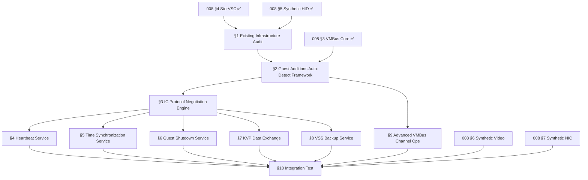

# TODO-008.08 — Hyper-V Guest Additions Integration

> **Goal:** Integrate all Hyper-V synthetic drivers (VMBus, StorVSC, HID, hvfb,
> netvsc) into a unified Guest Additions framework that auto-activates when the
> hypervisor detector identifies Hyper-V. Implement the full set of Integration
> Services (Heartbeat, Time Sync, Shutdown, KVP, VSS) for host-guest
> manageability, and wire the advanced VMBus channel operations required for
> production-grade I/O.

> [!IMPORTANT]
> **Motivation:** Individual synthetic drivers exist (§3–§7 of TODO-008) but are
> manually initialized in `boot_storage.c`. The guest additions framework should
> auto-detect Hyper-V via CPUID `0x40000000` (`"Microsoft Hv"`), bring up VMBus,
> and probe all offered channels — matching the Linux `hv_vmbus` auto-probe and
> the Windows native integration. Without this, Hyper-V Manager reports "No
> Contact" and management operations (graceful shutdown, time sync, backup)
> are unavailable.

> [!WARNING]
> → XREF: `TODO-008-Hyper-V-Runner.md §11` — Parent section
> → XREF: `TODO-064-Guest-Additions.md §6` — VMBus Integration
> → XREF: `TODO-008-Hyper-V-Runner.md §3` — VMBus Core Protocol (prerequisite)
> → XREF: Spec: `specs/hyper-v/guest-additions-integration.md` — Full TLFS-based specification

> [!CAUTION]
> **Memory Rule:** Use `pmm_alloc_contiguous()` for ALL buffers > 4 KB (ring buffers,
> GPADL pages, SynIC pages, transfer buffers). `kmalloc` is ONLY for small kernel
> structs (≤ 4 KB). Violating this crashes the 2 MiB heap silently. See `rules.md`
> Known Gotchas and `/add-asset` workflow.

---

## TODO Completion Roadmap

> [!IMPORTANT]
> **This file covers the Guest Additions framework and Integration Services.**
> Sections have a strict dependency chain: existing infrastructure audit →
> auto-detect framework → IC protocol negotiation → individual ICs (Heartbeat →
> Time Sync → Shutdown → KVP → VSS) → advanced VMBus ops → final integration test.
> External dependencies: VMBus core (§3 ✅), StorVSC (§4 ✅), Synthetic HID (§5 ✅).

### Dependency Graph



### Phase-by-Phase Implementation Order

| ⭐ | Phase  | Section                                | What It Delivers                                                     | Depends On                  | Status |
| -- | :----: | -------------------------------------- | -------------------------------------------------------------------- | --------------------------- | :----: |
| 💎 | **1**  | §1 Existing Infrastructure Audit       | Confirm VMBus, SynIC, hypercall page are operational                 | 008 §3–§5                   |   ⬜   |
| 💎 | **2**  | §2 Auto-Detect Framework               | `hyperv_guest_additions_init()` — single entry point for all ICs     | Phase 1 (§1)                |   ⬜   |
| 💎 | **3**  | §3 IC Protocol Negotiation Engine      | Generic `icmsg_negotiate()` — reusable by all ICs                    | Phase 2 (§2)                |   ⬜   |
| 💎 | **4**  | §4 Heartbeat Service                   | Host reports "OK" status — mandatory for Hyper-V management          | Phase 3 (§3)                |   ⬜   |
| 💎 | **4**  | §5 Time Synchronization Service        | Clock drift correction after boot/resume — critical for accuracy     | Phase 3 (§3)                |   ⬜   |
| 💎 | **4**  | §6 Guest Shutdown Service              | Graceful shutdown from Hyper-V Manager — prevents data loss          | Phase 3 (§3)                |   ⬜   |
| 💎 | **5**  | §7 KVP Data Exchange                   | Host→guest metadata transport (IP config, provisioning)              | Phase 3 (§3)                |   ⬜   |
| 💎 | **5**  | §8 VSS Backup Service                  | Application-consistent VM backups via filesystem freeze               | Phase 3 (§3)                |   ⬜   |
| ⭐ | **6**  | §9 Advanced VMBus Channel Operations   | Multi-page buffers, scatter-gather, polling suppression              | Phase 2 (§2)                |   ⬜   |
| 💎 | **7**  | §10 Integration Test                   | End-to-end: boot → all ICs active → Hyper-V Manager shows "OK"      | Phases 4–6                  |   ⬜   |

> [!NOTE]
> **Phases 1–3** build the framework and negotiation engine. **Phase 4** delivers
> the three mandatory ICs (Heartbeat, TimeSync, Shutdown) — after these, Hyper-V
> Manager reports the guest as healthy. **Phase 5** adds optional management ICs.
> **Phase 6** adds performance-critical VMBus operations. **Phase 7** validates
> the full integration on a real Hyper-V host.

---

## 1. Existing Infrastructure Audit

**Prompt:** Verify the existing VMBus infrastructure is ready for Integration Services. Confirm: (1) `vmbus_init()` detects Hyper-V via CPUID, sets up hypercall page, initializes SynIC, negotiates VMBus protocol, and enumerates channels. (2) `cpuid_platform.c` detects `PLATFORM_HYPERV` via `platform_get()`. (3) VMBus channel open/close and ring buffer read/write work (proven by StorVSC and HID). (4) SINT2 at vector 0xF0 is configured with AutoEOI. (5) `vmbus_find_channel_by_guid()` can locate IC channels. After auditing, document any gaps as sub-items below. Run `bash scripts/build.sh clean` and confirm `=== BUILD OK ===`.

> [!NOTE]
> **What already works (from §3–§5):**
> - `vmbus.c`: CPUID detection, guest OS ID MSR, hypercall page (PMM), SynIC
>   (SIM/SIEF + SINT2 at vector 0xF0 with AutoEOI), version negotiation
>   (V5.2 → V5.0 → V4.0 fallback), channel enumeration via REQUESTOFFERS
> - `vmbus.h`: MSR constants, SynIC structures, protocol message types,
>   well-known GUIDs, ring buffer APIs
> - `storvsc.c`: Proves channel open, GPADL, ring buffer write/read work
> - `hv_input.c`: Proves multi-channel usage and callback dispatch work

- [ ] Verify `vmbus_init()` runs and completes on Hyper-V Gen 2
- [ ] Verify `vmbus_find_channel_by_guid()` can find Heartbeat, TimeSync, Shutdown GUIDs
- [ ] Verify `vmbus_open_channel()` / ring buffer read/write is reliable
- [ ] Verify `vmbus_signal_channel()` (HvCallSignalEvent) functions correctly
- [ ] Verify SynIC SINT2 interrupt delivery and EOM acknowledgment
- [ ] Document any missing VMBus APIs needed for IC implementation
- [ ] Confirm `=== BUILD OK ===`

---

## 2. Guest Additions Auto-Detect Framework

> **XREF:** [TODO-008-Hyper-V-Runner.md §11](../TODO-008-Hyper-V-Runner.md) — Guest Additions Integration

**Prompt:** Create a unified guest additions entry point that auto-detects Hyper-V and initializes all Integration Services. The function `hyperv_guest_additions_init()` should: (1) check `platform_get() == PLATFORM_HYPERV`, (2) verify VMBus is connected, (3) enumerate offered channels and match against known IC GUIDs, (4) initialize each IC in dependency order. Wire this into `boot_storage.c` as a single call after `vmbus_init()`. After completing all items, mark every item as `[x]`, run `bash scripts/build.sh clean`, and commit as `"hyperv: guest additions auto-detect framework"`. Add notes directly in this TODO section. After implementation, save any gotchas, solutions, and important information to MCP memory (`mcp_memory_create_entities` / `mcp_memory_add_observations`).

> [!NOTE]
> **Existing Detection:** `cpuid_platform.c` already detects Hyper-V via CPUID
> leaf `0x40000000` (`"Microsoft Hv"`) and sets `PLATFORM_HYPERV`. The function
> `platform_get()` is used throughout the kernel (e.g., `lapic.c` for LAPIC
> calibration via Hyper-V MSR). The framework just needs to wire IC init into
> this existing detection path.

- [ ] Create `src/kernel/drivers/hyperv/hv_ic.c` and `include/kernel/drivers/hyperv/hv_ic.h`
- [ ] Implement `hyperv_guest_additions_init()`:
  - [ ] Guard: `if (platform_get() != PLATFORM_HYPERV) return;`
  - [ ] Guard: `if (!vmbus_is_connected()) return;`
  - [ ] Enumerate VMBus channel offers
  - [ ] Match against IC GUIDs (Heartbeat, TimeSync, Shutdown, KVP, VSS)
  - [ ] Initialize each IC driver in order
- [ ] Define well-known Integration Service GUIDs:
  - [ ] `HV_HEARTBEAT_GUID` — `{57164F39-9115-4E78-AB55-382F3BD5422D}`
  - [ ] `HV_TIME_SYNC_GUID` — `{9527E630-D0AE-497B-ADCE-E80AB0175CAF}`
  - [ ] `HV_SHUTDOWN_GUID` — `{0E0B6031-5213-4934-818B-38D90CED39DB}`
  - [ ] `HV_KVP_GUID` — `{A9A0F4E7-5A45-4D96-B827-8A841E8C03E6}`
  - [ ] `HV_VSS_GUID` — `{35FA2E29-EA23-4236-96AE-3A6EBACBA440}`
- [ ] Wire into `boot_storage.c`: call `hyperv_guest_additions_init()` after `vmbus_init()` + synthetic driver init
- [ ] Log: `"[OK] Hyper-V Guest Additions: N integration services active"`
- [ ] Ensure fallback: if not on Hyper-V, skip entirely (zero overhead)
- [ ] Build and test: `=== BUILD OK ===`
- [ ] Commit: `"hyperv: guest additions auto-detect framework"`

---

## 3. IC Protocol Negotiation Engine

**Prompt:** Implement the generic Integration Services protocol negotiation shared by all ICs. Each IC channel uses a standardized `icmsg_hdr` and `icmsg_negotiate` exchange to agree on framework and message versions before operational payloads. Create a reusable `icmsg_negotiate()` function that: (1) parses the host's proposed versions from the ring buffer, (2) selects the highest mutually supported version, (3) writes the acceptance response back to the ring buffer. After completing all items, mark every item as `[x]`, run `bash scripts/build.sh clean`, and commit as `"hyperv: IC protocol negotiation engine"`. Add notes directly in this TODO section. After implementation, save any gotchas, solutions, and important information to MCP memory (`mcp_memory_create_entities` / `mcp_memory_add_observations`).

### 3.1 IC Message Header (`struct icmsg_hdr`)

- [ ] Define `struct icmsg_hdr` in `hv_ic.h`:
  ```c
  struct icmsg_hdr {
      struct ic_version icverframe;    /* negotiated framework version */
      uint16_t icmsgtype;             /* message type identifier */
      struct ic_version icvermsg;     /* negotiated message version */
      uint16_t icmsgsize;             /* payload size in bytes */
      uint32_t status;                /* HV_S_OK (0x00000000) or error */
      uint8_t  ictransaction_id;      /* request/response correlation */
      uint8_t  icflags;               /* direction/response bitflags */
      uint8_t  reserved;              /* alignment padding */
  };
  ```
- [ ] Define `struct ic_version`:
  ```c
  struct ic_version {
      uint16_t major;
      uint16_t minor;
  };
  ```
- [ ] Define `HV_S_OK` (`0x00000000`)

### 3.2 Negotiation Payload (`struct icmsg_negotiate`)

- [ ] Define `struct icmsg_negotiate`:
  ```c
  struct icmsg_negotiate {
      uint16_t icframe_vercnt;        /* count of framework versions */
      uint16_t icmsg_vercnt;          /* count of message versions */
      uint32_t reserved;
      struct ic_version icversion_data[];  /* variable-length array */
  };
  ```

### 3.3 Negotiation Function

- [ ] Implement `int icmsg_negotiate(void *buf, size_t len, struct ic_version *fw_ver, struct ic_version *msg_ver)`:
  - [ ] Parse host-proposed framework versions from `icversion_data[0..icframe_vercnt-1]`
  - [ ] Parse host-proposed message versions from `icversion_data[icframe_vercnt..]`
  - [ ] Select highest mutually supported framework version (guest supports 3.0)
  - [ ] Select highest mutually supported message version (per IC)
  - [ ] Mutate buffer: inject guest's accepted versions + set `status = HV_S_OK`
  - [ ] Return 0 on success, -1 on no compatible version
- [ ] Log: `"[ic] Negotiated framework v%u.%u, message v%u.%u"`
- [ ] Build and test: `=== BUILD OK ===`
- [ ] Commit: `"hyperv: IC protocol negotiation engine"`

---

## 4. Heartbeat Service (`HV_HEARTBEAT_GUID`)

**Prompt:** Implement the Hyper-V Heartbeat Integration Service. The host sends periodic heartbeat messages with an incrementing `seq_num`. The guest must increment `seq_num` by one, set `status = HV_S_OK`, and write the response back to the ring buffer. Without heartbeat responses, Hyper-V Manager reports "No Contact" or "Lost Communication." After completing all items, mark every item as `[x]`, run `bash scripts/build.sh clean`, and commit as `"hyperv: heartbeat integration service"`. Add notes directly in this TODO section. After implementation, save any gotchas, solutions, and important information to MCP memory (`mcp_memory_create_entities` / `mcp_memory_add_observations`).

> [!IMPORTANT]
> **This is the most critical IC.** Without heartbeat, Hyper-V assumes the guest
> is unresponsive and may trigger recovery actions (restart, failover). It must
> be the first IC implemented and should work reliably under all conditions.

### 4.1 Heartbeat Payload

- [ ] Define heartbeat payload structure:
  ```c
  struct hv_heartbeat_msg {
      uint64_t seq_num;   /* monotonically incrementing sequence number */
      uint32_t reserved;
  };
  ```

### 4.2 Heartbeat Channel Handler

- [ ] Open VMBus channel for `HV_HEARTBEAT_GUID` (`{57164F39-9115-4E78-AB55-382F3BD5422D}`)
- [ ] Register channel callback via `vmbus_set_channel_callback()`
- [ ] On negotiation message: call `icmsg_negotiate()` (§3)
- [ ] On heartbeat message:
  - [ ] Read `seq_num` from ring buffer payload
  - [ ] Increment `seq_num` by one
  - [ ] Set `icmsg_hdr.status = HV_S_OK`
  - [ ] Write modified packet back to outbound ring buffer
  - [ ] Signal channel via `vmbus_signal_channel()`
- [ ] Log: `"[heartbeat] Responding to seq_num=%llu"`
- [ ] Build and test: `=== BUILD OK ===`
- [ ] Test on Hyper-V: confirm Hyper-V Manager shows "Operating normally"
- [ ] Commit: `"hyperv: heartbeat integration service"`

---

## 5. Time Synchronization Service (`HV_TIME_SYNC_GUID`)

**Prompt:** Implement the Hyper-V Time Synchronization Integration Service. The host periodically sends authoritative timestamps to correct VM clock drift caused by virtual processor preemption. The service must handle three flag types: PROBE (latency test only), SYNC (force hard update), and SAMPLE (gradual slew). Convert from Windows NT epoch (100ns intervals since 1601-01-01) to Unix epoch. After completing all items, mark every item as `[x]`, run `bash scripts/build.sh clean`, and commit as `"hyperv: time synchronization integration service"`. Add notes directly in this TODO section. After implementation, save any gotchas, solutions, and important information to MCP memory (`mcp_memory_create_entities` / `mcp_memory_add_observations`).

> [!TIP]
> **Critical after boot/resume.** VM clock can drift by seconds or minutes after
> a save/restore cycle. The SYNC flag forces an immediate hard update to
> correct this. SAMPLE provides ongoing gentle slew for sustained accuracy.

### 5.1 Time Sync Payload

- [ ] Define time sync payload structure:
  ```c
  struct hv_timesync_msg {
      uint64_t parenttime;      /* host authoritative time (100ns units, NT epoch) */
      uint64_t childtime;       /* guest perceived time */
      uint64_t roundtriptime;   /* message latency */
      uint8_t  flags;           /* PROBE=0, SYNC=1, SAMPLE=2 */
  };
  ```
- [ ] Define epoch conversion constant:
  ```c
  #define WLTIMEDELTA 116444736000000000ULL  /* 100ns between 1601 and 1970 */
  ```
- [ ] Define flag values:
  ```c
  #define ICTIMESYNCFLAG_PROBE   0
  #define ICTIMESYNCFLAG_SYNC    1
  #define ICTIMESYNCFLAG_SAMPLE  2
  ```

### 5.2 Time Sync Channel Handler

- [ ] Open VMBus channel for `HV_TIME_SYNC_GUID` (`{9527E630-D0AE-497B-ADCE-E80AB0175CAF}`)
- [ ] Register channel callback
- [ ] On negotiation message: call `icmsg_negotiate()`
- [ ] On time sync message:
  - [ ] If `flags == ICTIMESYNCFLAG_PROBE`: log latency, respond with `HV_S_OK`, do NOT update clock
  - [ ] If `flags == ICTIMESYNCFLAG_SYNC`: force hard clock update
    - [ ] Convert `parenttime` from NT epoch: `unix_time = (parenttime - WLTIMEDELTA) / 10000000`
    - [ ] Set kernel RTC / system time immediately
  - [ ] If `flags == ICTIMESYNCFLAG_SAMPLE`: calculate drift, apply gradual correction
    - [ ] Delta = `parenttime - childtime - roundtriptime/2`
    - [ ] Adjust system clock frequency/offset for gentle slew
- [ ] Log: `"[timesync] flags=%u parenttime=%llu delta=%lld ms"`
- [ ] Build and test: `=== BUILD OK ===`
- [ ] Test on Hyper-V: verify clock tracks host time after boot and resume
- [ ] Commit: `"hyperv: time synchronization integration service"`

---

## 6. Guest Shutdown Service (`HV_SHUTDOWN_GUID`)

**Prompt:** Implement the Hyper-V Guest Shutdown Integration Service. This enables graceful shutdown/restart from Hyper-V Manager — without it, a stop command forces a hard power-off that risks filesystem corruption. The guest must handle the shutdown request, trigger its native soft-shutdown sequence (unmount filesystems, ACPI S5), and respond to the host. After completing all items, mark every item as `[x]`, run `bash scripts/build.sh clean`, and commit as `"hyperv: guest shutdown integration service"`. Add notes directly in this TODO section. After implementation, save any gotchas, solutions, and important information to MCP memory (`mcp_memory_create_entities` / `mcp_memory_add_observations`).

> [!WARNING]
> **Without this service, Hyper-V Manager can only hard-kill the VM.** All pending
> filesystem writes are lost, and NTFS/IXFS journals are corrupted. This IC is
> mandatory for any production deployment.

### 6.1 Shutdown Payload

- [ ] Define shutdown payload structure:
  ```c
  struct hv_shutdown_msg {
      uint32_t reason_code;       /* numeric shutdown reason */
      uint32_t timeout_seconds;   /* duration before forced power-off */
      uint32_t flags;             /* restart vs power off */
      uint8_t  display_message[2048];  /* UTF-8 text for logging */
  };
  ```

### 6.2 Shutdown Channel Handler

- [ ] Open VMBus channel for `HV_SHUTDOWN_GUID` (`{0E0B6031-5213-4934-818B-38D90CED39DB}`)
- [ ] Register channel callback
- [ ] On negotiation message: call `icmsg_negotiate()`
- [ ] On shutdown message:
  - [ ] Log `display_message` to kernel log
  - [ ] Check `flags` for restart vs power off
  - [ ] If power off: trigger `acpi_shutdown()` → ACPI S5 state
  - [ ] If restart: trigger `acpi_reboot()`
  - [ ] Before shutdown: safely unmount all mounted filesystems
  - [ ] Set `icmsg_hdr.status = HV_S_OK` and respond to host
- [ ] Log: `"[shutdown] Host requested: reason=%u timeout=%u flags=0x%x"`
- [ ] Build and test: `=== BUILD OK ===`
- [ ] Test on Hyper-V: "Shut Down" from Hyper-V Manager triggers graceful shutdown
- [ ] Test on Hyper-V: "Restart" from Hyper-V Manager triggers clean reboot
- [ ] Commit: `"hyperv: guest shutdown integration service"`

---

## 7. Key-Value Pair (KVP) Data Exchange (`HV_KVP_GUID`)

**Prompt:** Implement the Hyper-V KVP Data Exchange Integration Service. This provides out-of-band metadata transport between host and guest over VMBus — no network required. Used in cloud/enterprise environments to inject provisioning configs (IP, hostname) and report guest status to the management console. After completing all items, mark every item as `[x]`, run `bash scripts/build.sh clean`, and commit as `"hyperv: KVP data exchange integration service"`. Add notes directly in this TODO section. After implementation, save any gotchas, solutions, and important information to MCP memory (`mcp_memory_create_entities` / `mcp_memory_add_observations`).

> [!NOTE]
> **KVP is the metadata backbone.** Azure, SCVMM, and Hyper-V PowerShell cmdlets
> use KVP to read guest IP addresses, OS version, FQDN, and custom data.
> Without KVP, `Get-VM | Select -ExpandProperty NetworkAdapters` returns blank
> IP addresses in the Hyper-V console.

### 7.1 KVP Payload

- [ ] Define KVP message structures:
  ```c
  #define HV_KVP_EXCHANGE_MAX_KEY_SIZE    512
  #define HV_KVP_EXCHANGE_MAX_VALUE_SIZE  2048

  struct hv_kvp_msg {
      uint8_t key[HV_KVP_EXCHANGE_MAX_KEY_SIZE];
      uint8_t value[HV_KVP_EXCHANGE_MAX_VALUE_SIZE];
  };
  ```

### 7.2 KVP Operations

- [ ] Open VMBus channel for `HV_KVP_GUID` (`{A9A0F4E7-5A45-4D96-B827-8A841E8C03E6}`)
- [ ] Register channel callback
- [ ] On negotiation message: call `icmsg_negotiate()`
- [ ] Handle KVP GET operation:
  - [ ] Read key from host request
  - [ ] Look up key in guest KVP store (registry or in-memory table)
  - [ ] Return value in response
- [ ] Handle KVP SET operation:
  - [ ] Read key-value pair from host request
  - [ ] Store in guest KVP store
- [ ] Implement KVP pool lookup (5 pools):
  - [ ] Pool 0: `External` — Host → Guest
  - [ ] Pool 1: `Guest` — Guest → Host
  - [ ] Pool 2: `Auto` — Automatic (IP, FQDN, OS version)
  - [ ] Pool 3: `Guest\Parameter` — Guest parameters
  - [ ] Pool 4: Reserved
- [ ] Auto-populate Pool 2 with system info:
  - [ ] `FullyQualifiedDomainName` — guest hostname
  - [ ] `IntegrationServicesVersion` — guest IC version string
  - [ ] `NetworkAddressIPv4` — guest IP address (if network is up)
  - [ ] `OSName` — `"Impossible OS"`
  - [ ] `OSVersion` — kernel version string
- [ ] Log: `"[kvp] GET key='%s' → value='%s'"`
- [ ] Build and test: `=== BUILD OK ===`
- [ ] Test on Hyper-V: `Get-VMIntegrationService` shows KVP active
- [ ] Commit: `"hyperv: KVP data exchange integration service"`

---

## 8. Volume Shadow Copy (VSS) Backup Service (`HV_VSS_GUID`)

**Prompt:** Implement the Hyper-V VSS Backup Integration Service. This enables application-consistent live VM backups by freezing guest filesystems before the hypervisor takes a checkpoint. Without this, snapshots are crash-consistent only — databases and transactional filesystems may be corrupted on restore. After completing all items, mark every item as `[x]`, run `bash scripts/build.sh clean`, and commit as `"hyperv: VSS backup integration service"`. Add notes directly in this TODO section. After implementation, save any gotchas, solutions, and important information to MCP memory (`mcp_memory_create_entities` / `mcp_memory_add_observations`).

> [!CAUTION]
> **The VSS freeze message can reach 6,260 bytes.** Ring buffer handlers must
> accommodate large multi-page reads. If the guest fails to freeze and return
> success within the strict timeout, the hypervisor unilaterally fails the backup.

### 8.1 VSS Operations

- [ ] Define VSS operation constants:
  ```c
  #define VSS_OP_REGISTER       128
  #define VSS_OP_REGISTER1      129
  #define VSS_OP_FREEZE         5
  #define VSS_OP_THAW           6
  #define VSS_OP_AUTO_RECOVER   7
  ```
- [ ] Define VSS payload structure:
  ```c
  struct hv_vss_msg {
      uint8_t operation;    /* VSS command */
      uint8_t reserved;
  };
  ```

### 8.2 VSS Channel Handler

- [ ] Open VMBus channel for `HV_VSS_GUID` (`{35FA2E29-EA23-4236-96AE-3A6EBACBA440}`)
- [ ] Register channel callback
- [ ] On negotiation message: call `icmsg_negotiate()`
- [ ] On `VSS_OP_REGISTER` / `VSS_OP_REGISTER1`:
  - [ ] Complete registration handshake
  - [ ] Report capabilities to host
- [ ] On `VSS_OP_FREEZE`:
  - [ ] Flush all filesystem caches (VFS sync)
  - [ ] Block new writes to all mounted filesystems
  - [ ] Respond with `HV_S_OK` to host
  - [ ] Log: `"[vss] Filesystems frozen for backup"`
- [ ] On `VSS_OP_THAW`:
  - [ ] Unblock I/O on all mounted filesystems
  - [ ] Respond with `HV_S_OK` to host
  - [ ] Log: `"[vss] Filesystems thawed — backup complete"`
- [ ] On `VSS_OP_AUTO_RECOVER`:
  - [ ] If unsupported: respond with non-support flag
- [ ] Build and test: `=== BUILD OK ===`
- [ ] Test on Hyper-V: VM checkpoint creates application-consistent snapshot
- [ ] Commit: `"hyperv: VSS backup integration service"`

---

## 9. Advanced VMBus Channel Operations

> **XREF:** Spec §7 — Advanced VMBus Channel Operations and Memory Optimizations

**Prompt:** Implement advanced VMBus channel operations required for high-performance synthetic drivers. This includes multi-page buffer packets for scatter-gather I/O, asynchronous event signaling with monitor pages, and polling suppression for zero-overhead notification. These are the building blocks for production-grade StorVSC and NetVSC performance. After completing all items, mark every item as `[x]`, run `bash scripts/build.sh clean`, and commit as `"hyperv: advanced VMBus channel operations"`. Add notes directly in this TODO section. After implementation, save any gotchas, solutions, and important information to MCP memory (`mcp_memory_create_entities` / `mcp_memory_add_observations`).

### 9.1 Multi-Page Buffer Packets (Scatter-Gather I/O)

- [ ] Implement `vmbus_sendpacket_pagebuffer()`:
  - [ ] Accept array of (GPA, offset, length) tuples
  - [ ] Pack into VMBus pagebuffer descriptor
  - [ ] Send via ring buffer with VMBUS_DATA_PACKET_FLAG_COMPLETION_REQUESTED
  - [ ] Used by StorVSC for large disk reads, NetVSC for jumbo frames
- [ ] Implement `vmbus_sendpacket_mpb_desc()`:
  - [ ] Accept single (GPA array, offset, length) for contiguous logical buffers
  - [ ] Pack into Multi-Page Buffer descriptor
- [ ] Log: `"[vmbus] Pagebuffer sent: %u pages, %u bytes"`

### 9.2 Asynchronous Event Signaling (Monitor Pages)

- [ ] Implement monitor-page based event signaling:
  - [ ] From channel offer: extract `monitor_grp` and `monitor_bit`
  - [ ] On outbound data: atomic test-and-set on SIEFP bit
  - [ ] Only issue `HvCallSignalEvent` if bit transitions 0 → 1
  - [ ] Reduces unnecessary hypercalls (host already knows)
- [ ] Implement polling suppression:
  - [ ] Check `ring_buffer->interrupt_mask` before signaling
  - [ ] If `interrupt_mask == 1`: suppress `HvCallSignalEvent` entirely
  - [ ] Host is actively polling — zero signaling overhead
- [ ] Log: `"[vmbus] Channel %u: monitor_grp=%u, monitor_bit=%u"`

### 9.3 TLB Flush Enlightenment

> [!TIP]
> **This eliminates VM exit storms.** On SMP systems, TLB invalidation normally
> requires IPIs to all CPUs — each IPI causes a VM exit. The hypercall offloads
> this to the hypervisor, which performs global invalidation without guest
> software IPIs.

- [ ] Implement `HvFlushVirtualAddressSpace` hypercall wrapper
- [ ] Implement `HvFlushVirtualAddressSpaceEx` hypercall wrapper (extended processor set)
- [ ] Wire into kernel `invlpg()` / `flush_tlb()` functions
- [ ] Guard: only use when `CPUID.40000003H` reports TLB flush available
- [ ] Benchmark: compare against IPI-based TLB flush

- [ ] Build and test: `=== BUILD OK ===`
- [ ] Commit: `"hyperv: advanced VMBus channel operations"`

---

## 10. End-to-End Integration Test

**Prompt:** Validate the complete guest additions stack on a real Hyper-V Gen 2 VM. All ICs should be active, Hyper-V Manager should show healthy status, and all management operations should work. After completing all items, mark every item as `[x]`, run `bash scripts/build.sh clean`, and commit as `"hyperv: guest additions integration validated"`. Add notes directly in this TODO section. After implementation, save any gotchas, solutions, and important information to MCP memory (`mcp_memory_create_entities` / `mcp_memory_add_observations`).

- [ ] Boot Impossible OS on Hyper-V Gen 2 via `run-hyperv.ps1`
- [ ] Verify boot log shows all ICs initialized:
  - [ ] `[OK] Hyper-V Guest Additions: 5 integration services active`
  - [ ] `[heartbeat] Responding to seq_num=1`
  - [ ] `[timesync] flags=1 parenttime=... → hard clock update`
  - [ ] `[kvp] Auto-populated: OSName=Impossible OS`
- [ ] Verify Hyper-V Manager status:
  - [ ] Heartbeat: "OK"
  - [ ] Integration Services version: displayed
  - [ ] Guest IP address: displayed (if network active)
- [ ] Test management operations:
  - [ ] "Shut Down" → graceful shutdown with filesystem unmount
  - [ ] "Restart" (if supported) → clean reboot
  - [ ] Checkpoint → VSS freeze/thaw cycle
- [ ] Verify no regressions on QEMU:
  - [ ] All ICs gracefully skip when not on Hyper-V
  - [ ] Zero overhead — no CPUID checks in hot paths
- [ ] Commit: `"hyperv: guest additions integration validated"`

---

## Key Files

| File                                                | Change  | Purpose                                               |
| --------------------------------------------------- | ------- | ----------------------------------------------------- |
| `src/kernel/drivers/hyperv/hv_ic.c`                 | NEW     | Guest additions framework + IC negotiation engine     |
| `include/kernel/drivers/hyperv/hv_ic.h`             | NEW     | IC message headers, negotiate structs, IC GUIDs       |
| `src/kernel/drivers/hyperv/hv_heartbeat.c`          | NEW     | Heartbeat integration service                         |
| `src/kernel/drivers/hyperv/hv_timesync.c`           | NEW     | Time synchronization integration service              |
| `src/kernel/drivers/hyperv/hv_shutdown.c`           | NEW     | Guest shutdown integration service                    |
| `src/kernel/drivers/hyperv/hv_kvp.c`                | NEW     | KVP data exchange service                             |
| `src/kernel/drivers/hyperv/hv_vss.c`                | NEW     | VSS backup service                                    |
| `src/kernel/drivers/hyperv/vmbus.c`                 | MODIFY  | Advanced channel ops, monitor pages, polling suppress  |
| `include/kernel/drivers/hyperv/vmbus.h`             | MODIFY  | New APIs for pagebuffer, monitor, TLB flush           |
| `src/kernel/main/boot_storage.c`                    | MODIFY  | Wire `hyperv_guest_additions_init()` call             |
| `src/kernel/cpuid_platform.c`                       | EXISTS  | `PLATFORM_HYPERV` detection (no changes needed)       |

---

## Priority Order

| ⭐ | Priority  | Section                               | Reason                                                              |
| -- | :-------: | ------------------------------------- | ------------------------------------------------------------------- |
| 💎 | 🔴 P0    | §1 Infrastructure Audit              | Verify prerequisites before building on them                        |
| 💎 | 🔴 P0    | §2 Auto-Detect Framework             | Single entry point — all ICs depend on this                         |
| 💎 | 🔴 P0    | §3 IC Negotiation Engine             | Shared protocol — all ICs use `icmsg_negotiate()`                   |
| 💎 | 🟠 P1    | §4 Heartbeat                         | **Mandatory** — without it, Hyper-V reports "No Contact"            |
| 💎 | 🟠 P1    | §5 Time Sync                         | **Critical** — clock drift causes cascading failures                |
| 💎 | 🟠 P1    | §6 Shutdown                          | **Mandatory** — prevents hard power-off data loss                   |
| 💎 | 🟡 P2    | §7 KVP                               | Host-guest metadata — needed for management and cloud deployments   |
| 💎 | 🟡 P2    | §8 VSS                               | App-consistent backups — enterprise requirement                     |
| ⭐ | 🟢 P3    | §9 Advanced VMBus Ops                | Performance optimization — scatter-gather, polling suppression      |
| 💎 | 🟢 P3    | §10 Integration Test                 | End-to-end validation on real Hyper-V                               |

---

## OS Comparison

| ⭐ | Feature                                 | 🪟 Windows 11 (Native)                 | 🐧 Linux (hv_utils)                     | 🚀 Impossible OS                                  |
| -- | ---------------------------------------- | ---------------------------------------- | ---------------------------------------- | -------------------------------------------------- |
| 💎 | Guest Additions auto-detect             | ✅ Native (built-in)                    | ✅ `hv_vmbus` auto-probe                | ⬜ §2 — manual init only                           |
| 💎 | IC protocol negotiation                 | ✅ Native                               | ✅ `hv_utils.ko` negotiate              | ⬜ §3 — not yet implemented                        |
| 💎 | Heartbeat                               | ✅ `vmicheartbeat`                      | ✅ In-kernel `hv_utils`                 | ⬜ §4 — Hyper-V shows "No Contact"                 |
| 💎 | Time Synchronization                    | ✅ `vmictimesync`                       | ✅ In-kernel `hv_utils`                 | ⬜ §5 — no clock correction                        |
| 💎 | Guest Shutdown                          | ✅ `vmicshutdown`                       | ✅ In-kernel `hv_utils`                 | ⬜ §6 — hard power-off only                        |
| 💎 | KVP Data Exchange                       | ✅ `vmickvpexchange`                    | ✅ `hv_kvp_daemon` (user-space)         | ⬜ §7 — no host-guest metadata                     |
| 💎 | VSS Backup Support                      | ✅ `vmicvss`                            | ✅ `hv_vss_daemon` (user-space)         | ⬜ §8 — crash-consistent snapshots only            |
| ⭐ | Scatter-Gather I/O                      | ✅ Native                               | ✅ `vmbus_sendpacket_pagebuffer`        | ⬜ §9.1 — single-buffer only                       |
| ⭐ | Monitor page signaling                  | ✅ Native                               | ✅ `vmbus_setevent()`                   | ⬜ §9.2 — always issues hypercall                  |
| ⭐ | TLB flush enlightenment                 | ✅ Native                               | ✅ `hv_tlb.c`                           | ⬜ §9.3 — IPI-based TLB flush                      |
| 💎 | Full guest additions (all ICs active)   | ✅ Native                               | ✅ With hv_* drivers + daemons          | ⬜ **§1-§10 required**                              |

> **After §1-§3:** Framework operational — ICs can be added incrementally.
> **After §4-§6:** Hyper-V Manager shows "OK", graceful shutdown works.
> **After §7-§8:** Full management parity with Linux `hv_utils` + daemons.
> **After §9-§10:** Performance optimizations and end-to-end validation —
> Impossible OS matches Linux's Hyper-V integration quality.
