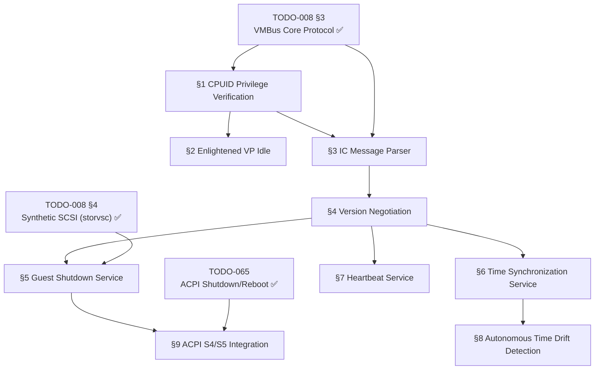

# 008.08-Power-Management — Hyper-V Power Management & Integration Services

> **Goal:** Implement cooperative power management for Impossible OS running
> on Hyper-V. This includes enlightened virtual processor idle via
> `HV_X64_MSR_GUEST_IDLE`, VMBus Integration Services (Guest Shutdown,
> Time Synchronization, Heartbeat), and ACPI sleep-state awareness.
> These services enable graceful host-initiated shutdowns, accurate
> timekeeping across VM suspend/resume, and vitality monitoring — all
> required for production-grade Hyper-V guest compliance.

> [!CAUTION]
> **Memory Rule:** Use `pmm_alloc_contiguous()` for ALL buffers > 4 KB (ring buffers, transfer pages). `kmalloc` is ONLY for small kernel structs (≤ 4 KB). Violating this crashes the 2 MiB heap silently. See `rules.md` Known Gotchas.

> [!WARNING]
> **VMBus Core Required.** All Integration Services in this file communicate
> over VMBus channels. `vmbus_init()` (TODO-008 §3) and the ring buffer
> protocol must be operational before any of these services can negotiate
> or exchange messages.

> [!IMPORTANT]
> **Spec Reference:** All protocol details, MSR addresses, CPUID bits,
> message structures, and flag semantics reference the
> [Hyper-V Power Management Specification](file:///home/derickpayne/impossible-os/docs/specs/hyper-v/power-management.md)
> in the repo at `docs/specs/hyper-v/power-management.md`.

---

## TODO Completion Roadmap (Cross-File)

> [!IMPORTANT]
> **This file covers Hyper-V power management — cooperative guest services.**
> Sections have a strict dependency chain: CPUID privilege verification →
> enlightened idle → IC message parsing → version negotiation → individual
> services (shutdown → time sync → heartbeat). External dependencies include
> `TODO-008-Hyper-V-Runner.md §3` (VMBus core), `TODO-008-Hyper-V-Runner.md §4`
> (StorVSC — proves VMBus ring buffer I/O works), and
> `TODO-065-Power-Management.md` (ACPI shutdown/reboot baseline).

### Dependency Graph

### Phase-by-Phase Implementation Order

| Phase  | Section                              | What It Delivers                                                          | Depends On                   | Status |
| :----: | ------------------------------------ | ------------------------------------------------------------------------- | ---------------------------- | :----: |
| **1**  | §1 CPUID Privilege Verification      | Detect `AccessGuestIdleMsr` privilege — gates all idle optimizations      | VMBus core (§3 ✅)            |   ⬜   |
| **1**  | §2 Enlightened VP Idle               | Replace `HLT` with `RDMSR 0x400000F0` — zero-overhead CPU yielding       | Phase 1 (§1)                 |   ⬜   |
| **2**  | §3 IC Message Parser                 | Parse `vmbuspipe_hdr` + `icmsg_hdr` from VMBus ring buffer                | VMBus core (§3 ✅)            |   ⬜   |
| **2**  | §4 Version Negotiation               | Respond to `ICMSGTYPE_NEGOTIATE` — required before any IC service works   | Phase 2 (§3)                 |   ⬜   |
| **3**  | §5 Guest Shutdown Service            | Handle host-initiated shutdown/reboot/hibernate via VMBus                 | Phase 2 (§4)                 |   ⬜   |
| **3**  | §6 Time Synchronization Service      | Hard sync + gradual slew for clock correction after VM resume             | Phase 2 (§4)                 |   ⬜   |
| **3**  | §7 Heartbeat Service                 | Prove kernel vitality to host — prevents false "unresponsive" status      | Phase 2 (§4)                 |   ⬜   |
| **4**  | §8 Autonomous Time Drift Detection   | Self-healing clock via `HV_X64_MSR_TIME_REF_COUNT` — no VMBus needed      | Phase 3 (§6)                 |   ⬜   |
| **4**  | §9 ACPI S4/S5 Integration            | Wire shutdown flags to ACPI `_PTS`/`_WAK` for S4 hibernation / S5 off     | Phase 3 (§5) + ACPI (065 ✅)  |   ⬜   |

> [!NOTE]
> **Phases 1–2** establish the infrastructure: CPUID checks, enlightened idle,
> and the IC message parsing framework. **Phase 3** implements the three core
> Integration Services. **Phase 4** adds polish: autonomous drift detection
> and ACPI sleep-state integration.

> [!TIP]
> **§2 (Enlightened Idle) is a quick win.** It's a single `RDMSR` instruction
> in the idle loop, guarded by a CPUID check. Delivers immediate power
> efficiency and host CPU density improvement. Can be done independently
> once §1 confirms the privilege bit.

> [!CAUTION]
> **Version negotiation (§4) is mandatory.** If the OS fails to respond to
> `ICMSGTYPE_NEGOTIATE` correctly, the Hyper-V host will **permanently
> terminate the VMBus channel** for that Integration Service. There is no
> retry — the service is dead for the entire VM session.

---

## 1. CPUID Privilege Verification

**Prompt:** During early kernel init, execute `CPUID` with leaf `0x40000003` to enumerate the Hyper-V feature identification mask. Verify that **EAX bit 10** (`AccessGuestIdleMsr`) is set, granting permission to use the synthetic guest idle MSR. Also check the implementation recommendations leaf (`0x40000004`) for XMM-based fast hypercall support. Store results in the platform detection context for use by subsequent power management subsystems. After completing all items, mark every item as `[x]`, run `bash scripts/build.sh clean`, and commit as `"hyperv: CPUID power management privilege enumeration"`. Add notes directly in this TODO section. After implementation, save any gotchas, solutions, and important information to MCP memory (`mcp_memory_create_entities` / `mcp_memory_add_observations`).

- [ ] Execute `CPUID` with `EAX = 0x40000003` in `cpuid_platform.c` init path
- [ ] Parse returned EAX register for feature identification bits:
  - [ ] Bit 10: `AccessGuestIdleMsr` — permission to read `HV_X64_MSR_GUEST_IDLE`
  - [ ] Bit 1: `AccessHypercallMsrs` — permission for hypercall page (already used by VMBus)
  - [ ] Bit 0: `AccessVpRunTimeReg` — virtual processor runtime register
- [ ] Store `access_guest_idle_msr` flag in platform context struct
- [ ] Expose via `int platform_hyperv_has_guest_idle(void)` in `cpuid_platform.h`
- [ ] Execute `CPUID` with `EAX = 0x40000004` for implementation recommendations:
  - [ ] Bit 4: XMM fast hypercall support — store for future use
- [ ] Log: `[hyperv] CPUID 0x40000003: AccessGuestIdleMsr=%d, features=0x%08X`
- [ ] Log: `[hyperv] CPUID 0x40000004: recommendations=0x%08X`
- [ ] Guard: only execute on `PLATFORM_HYPERV` (skip on QEMU/VBox/bare metal)
- [ ] Commit: `"hyperv: CPUID power management privilege enumeration"`

---

## 2. Enlightened Virtual Processor Idle

> **XREF:** [Spec §3](file:///home/derickpayne/impossible-os/docs/specs/hyper-v/power-management.md) — Virtual Processor State Machine and Enlightened Idle

**Prompt:** Replace the `HLT` instruction in the kernel's idle loop with an enlightened `RDMSR 0x400000F0` read of `HV_X64_MSR_GUEST_IDLE` when running on Hyper-V. This transitions the virtual processor from Running → Waiting state, releasing the physical core to the host with zero VM-Exit overhead. The VP wakes on any interrupt regardless of `RFLAGS.IF` state. Guard with the `AccessGuestIdleMsr` privilege check from §1. After completing all items, mark every item as `[x]`, run `bash scripts/build.sh clean`, and commit as `"hyperv: enlightened VP idle via HV_X64_MSR_GUEST_IDLE"`. Add notes directly in this TODO section. After implementation, save any gotchas, solutions, and important information to MCP memory (`mcp_memory_create_entities` / `mcp_memory_add_observations`).

> [!TIP]
> The idle MSR is a **read-triggered state transition** — the return value
> is irrelevant. The `RDMSR` itself is the action. This is architecturally
> unusual: most MSRs are read for data; this one is read for side-effect.

> [!WARNING]
> **x64 only.** `HV_X64_MSR_GUEST_IDLE` (address `0x400000F0`) is strictly
> limited to x64 platforms per the TLFS. ARM64 guests must use `WFI`.
> Since Impossible OS targets x86-64, this is not a practical concern.

- [ ] Define `HV_X64_MSR_GUEST_IDLE  0x400000F0` in `vmbus.h` or a new `hv_power.h`
- [ ] Implement `hv_idle(void)` — the enlightened idle function:
  - [ ] `CLI` — disable interrupts
  - [ ] Perform final scheduling bookkeeping (check for pending work)
  - [ ] If no work: execute `RDMSR 0x400000F0` (VP → Waiting state)
  - [ ] VP wakes on any interrupt (hypervisor guarantees wake regardless of IF)
  - [ ] Execution resumes at instruction after `RDMSR`
  - [ ] `STI` — re-enable interrupts
- [ ] Integrate into the kernel idle loop:
  - [ ] If `platform_hyperv_has_guest_idle()`: call `hv_idle()` instead of `HLT`
  - [ ] If not on Hyper-V or privilege denied: keep `HLT` / `MWAIT` fallback
- [ ] Log at boot: `[hyperv] Enlightened idle enabled (RDMSR 0x400000F0)`
- [ ] Log at boot if denied: `[hyperv] Guest idle MSR not available — using HLT fallback`
- [ ] Test: boot in Hyper-V Gen 2 → confirm VP properly enters Waiting state
- [ ] Test: boot in QEMU → confirm fallback to HLT (no regression)
- [ ] Commit: `"hyperv: enlightened VP idle via HV_X64_MSR_GUEST_IDLE"`

---

## 3. Integration Component (IC) Message Parser

> **XREF:** [Spec §6](file:///home/derickpayne/impossible-os/docs/specs/hyper-v/power-management.md) — VMBus Architecture and Memory Management

**Prompt:** Implement a universal packet parser that decodes raw VMBus ring buffer bytes into `vmbuspipe_hdr` + `icmsg_hdr` structures. This parser is shared by all three Integration Services (Shutdown, TimeSync, Heartbeat). Parse the pipe header for total message size, then the IC header for message type, framework version, transaction ID, and flags. After completing all items, mark every item as `[x]`, run `bash scripts/build.sh clean`, and commit as `"hyperv: IC message parser for Integration Services"`. Add notes directly in this TODO section. After implementation, save any gotchas, solutions, and important information to MCP memory (`mcp_memory_create_entities` / `mcp_memory_add_observations`).

- [ ] Define `struct vmbuspipe_hdr` (8 bytes):
  - [ ] `uint32_t flags` — pipe control flags
  - [ ] `uint32_t msgsize` — total packet length in bytes
- [ ] Define `struct ic_version` (4 bytes):
  - [ ] `uint16_t major`
  - [ ] `uint16_t minor`
- [ ] Define `struct icmsg_hdr` (16 bytes):
  - [ ] `struct ic_version icverframe` — framework version (major.minor)
  - [ ] `uint16_t icmsgtype` — message type dispatch key
  - [ ] `struct ic_version icvermsg` — service-specific version
  - [ ] `uint16_t icmsgsize` — payload size after this header
  - [ ] `uint32_t status` — return status (for guest responses)
  - [ ] `uint8_t ictransaction_id` — host-generated request/response ID
  - [ ] `uint8_t icflags` — transaction routing flags
  - [ ] `uint8_t reserved[2]` — zero-padded alignment
- [ ] Define IC message type constants:
  - [ ] `ICMSGTYPE_NEGOTIATE   0` — version negotiation
  - [ ] `ICMSGTYPE_HEARTBEAT   1` — heartbeat polling
  - [ ] `ICMSGTYPE_SHUTDOWN    3` — shutdown/reboot/hibernate request
  - [ ] `ICMSGTYPE_TIMESYNC    4` — time synchronization
- [ ] Define IC flags constants:
  - [ ] `ICMSGHDRFLAG_TRANSACTION  1` — part of a transaction
  - [ ] `ICMSGHDRFLAG_REQUEST      2` — request from host
  - [ ] `ICMSGHDRFLAG_RESPONSE     4` — response from guest
- [ ] Implement `ic_parse_message(ring_data, len, pipe_hdr_out, ic_hdr_out)`:
  - [ ] Validate `len >= sizeof(vmbuspipe_hdr) + sizeof(icmsg_hdr)` (24 bytes minimum)
  - [ ] Copy and parse pipe header from offset 0
  - [ ] Copy and parse IC header from offset 8
  - [ ] Return pointer to payload at offset 24
- [ ] Place structures in `include/kernel/drivers/hyperv/hv_ic.h`
- [ ] Place parser in `src/kernel/drivers/hyperv/hv_ic.c`
- [ ] Commit: `"hyperv: IC message parser for Integration Services"`

---

## 4. IC Version Negotiation Handler

> **XREF:** [Spec §7](file:///home/derickpayne/impossible-os/docs/specs/hyper-v/power-management.md) — Integration Services Protocol and Version Negotiation

**Prompt:** The very first message on any newly opened IC VMBus channel is `ICMSGTYPE_NEGOTIATE` (value `0`). The host sends its supported framework and service-specific version arrays. The guest must parse these arrays, select the highest mutually supported version, write the selection back, set `icflags = ICMSGHDRFLAG_TRANSACTION | ICMSGHDRFLAG_RESPONSE`, set `status = HV_S_OK`, echo `ictransaction_id`, and transmit the response. Failure to respond correctly permanently terminates the channel. After completing all items, mark every item as `[x]`, run `bash scripts/build.sh clean`, and commit as `"hyperv: IC version negotiation handler"`. Add notes directly in this TODO section. After implementation, save any gotchas, solutions, and important information to MCP memory (`mcp_memory_create_entities` / `mcp_memory_add_observations`).

> [!CAUTION]
> **Channel termination is permanent.** If the OS returns an unsupported
> version, formats the response incorrectly, or fails to respond at all,
> Hyper-V will **abruptly terminate the VMBus channel** — permanently
> disabling that Integration Service for the entire VM session. No retry.

- [ ] Define `struct icmsg_negotiate`:
  - [ ] `uint16_t icframe_vercnt` — number of framework versions offered
  - [ ] `uint16_t icservice_vercnt` — number of service versions offered
  - [ ] `uint32_t reserved` — zero
  - [ ] `struct ic_version icversion_data[]` — variable-length version array
    - [ ] First `icframe_vercnt` entries: framework versions
    - [ ] Next `icservice_vercnt` entries: service-specific versions
- [ ] Define supported versions (guest-side):
  - [ ] Framework: `{3, 0}` (Win8+), fallback `{1, 0}` (legacy)
  - [ ] Shutdown service: `{3, 0}` preferred
  - [ ] TimeSync service: `{4, 0}` preferred (supports reference time delta)
  - [ ] Heartbeat service: `{3, 0}` preferred
- [ ] Implement `ic_negotiate(channel, recv_buf, recv_len)`:
  - [ ] Parse `icmsg_negotiate` payload from received buffer
  - [ ] Scan framework versions: find highest supported by both host and guest
  - [ ] Scan service versions: find highest supported by both host and guest
  - [ ] Write selected versions back into payload
  - [ ] Set `icmsg_hdr.icflags = ICMSGHDRFLAG_TRANSACTION | ICMSGHDRFLAG_RESPONSE`
  - [ ] Set `icmsg_hdr.status = HV_S_OK` (0)
  - [ ] Echo `icmsg_hdr.ictransaction_id` from original request
  - [ ] Transmit modified buffer back via VMBus ring buffer
- [ ] Log: `[hyperv] IC negotiate: framework v%u.%u, service v%u.%u`
- [ ] Error: if no compatible version found → log error, do NOT send response (channel dies)
- [ ] Commit: `"hyperv: IC version negotiation handler"`

---

## 5. Guest Shutdown Service

> **XREF:** [Spec §8](file:///home/derickpayne/impossible-os/docs/specs/hyper-v/power-management.md) — The Guest Shutdown Service Specification
> **XREF:** [TODO-065-Power-Management.md §9](file:///home/derickpayne/impossible-os/todo/060-Hardware-Drivers/TODO-065-Power-Management.md) — Hyper-V Power Validation

**Prompt:** Implement the Guest Shutdown Service (`vmicshutdown`) on VMBus. Open the Shutdown VSP channel (GUID `0E0B6031-5213-4934-818B-38D90CED39DB`), complete version negotiation (§4), then listen for `ICMSGTYPE_SHUTDOWN` messages. Parse `shutdown_msg_data` for `flags` (0=shutdown, 1=forced shutdown, 2=reboot, 3=forced reboot, 4=hibernate, 5=forced hibernate). Send `HV_S_OK` acknowledgment BEFORE executing the power transition. Dispatch to existing `acpi_shutdown()`, `acpi_reboot()`, or future S4 handler. After completing all items, mark every item as `[x]`, run `bash scripts/build.sh clean`, and commit as `"hyperv: Guest Shutdown Service (vmicshutdown)"`. Add notes directly in this TODO section. After implementation, save any gotchas, solutions, and important information to MCP memory (`mcp_memory_create_entities` / `mcp_memory_add_observations`).

> [!IMPORTANT]
> **Acknowledge BEFORE shutting down.** The OS must send the `HV_S_OK`
> response packet back to the host via VMBus before beginning the actual
> power transition. If the OS shuts down before acknowledging, the host
> won't know the command was received and may escalate to a hard power-off.

- [ ] Define Shutdown VSP GUID: `0E0B6031-5213-4934-818B-38D90CED39DB`
- [ ] Define `struct shutdown_msg_data` (2060 bytes):
  - [ ] `uint32_t reason_code` — diagnostic context
  - [ ] `uint32_t timeout_seconds` — max wait before hard power-off
  - [ ] `uint32_t flags` — requested action bitmask
  - [ ] `char display_message[2048]` — administrative warning string
- [ ] Create `src/kernel/drivers/hyperv/hv_shutdown.c` and header
- [ ] Implement `hv_shutdown_init()`:
  - [ ] Find Shutdown VSP channel by GUID via `vmbus_find_channel_by_guid()`
  - [ ] Open channel with ring buffer (send + receive)
  - [ ] Set channel callback for incoming messages
- [ ] Implement shutdown channel callback:
  - [ ] Parse received data with `ic_parse_message()`
  - [ ] If `icmsgtype == ICMSGTYPE_NEGOTIATE`: call `ic_negotiate()`
  - [ ] If `icmsgtype == ICMSGTYPE_SHUTDOWN`: parse `shutdown_msg_data`
- [ ] Implement shutdown flags dispatch:
  - [ ] Flags `0` (graceful shutdown): flush caches → unmount FS → `acpi_shutdown()`
  - [ ] Flags `1` (forced shutdown): skip user prompts → `acpi_shutdown()`
  - [ ] Flags `2` (graceful reboot): flush caches → `acpi_reboot()`
  - [ ] Flags `3` (forced reboot): skip user prompts → `acpi_reboot()`
  - [ ] Flags `4` (graceful hibernate): future S4 handler (log unsupported for now)
  - [ ] Flags `5` (forced hibernate): future S4 handler (log unsupported for now)
- [ ] Response protocol (MUST happen before power transition):
  - [ ] Set `icflags = ICMSGHDRFLAG_TRANSACTION | ICMSGHDRFLAG_RESPONSE`
  - [ ] Set `status = HV_S_OK`
  - [ ] Echo `ictransaction_id`
  - [ ] Transmit response via VMBus
  - [ ] **Then** begin shutdown/reboot/hibernate
- [ ] Log: `[hyperv] Shutdown request: flags=%u, reason=%u, timeout=%us`
- [ ] Log: `[hyperv] Display message: "%s"` (if non-empty)
- [ ] Test: Hyper-V Manager → "Shut Down" on VM → verify graceful shutdown
- [ ] Test: Hyper-V Manager → "Turn Off" → verify behavior (may bypass VMBus)
- [ ] Commit: `"hyperv: Guest Shutdown Service (vmicshutdown)"`

---

## 6. Time Synchronization Service

> **XREF:** [Spec §9](file:///home/derickpayne/impossible-os/docs/specs/hyper-v/power-management.md) — The Time Synchronization Service Specification

**Prompt:** Implement the Time Synchronization Service (`vmictimesync`) on VMBus. Opens the TimeSync VSP channel, negotiates IC version, then processes `ICMSGTYPE_TIMESYNC` messages. The `ictimesync_data` structure provides host time in 100ns intervals since Windows epoch (1601-01-01). Two correction modes: `ICTIMESYNCFLAG_SYNC` (value `1`) requires **immediate** hard clock overwrite (post-resume/boot), while `ICTIMESYNCFLAG_SAMPLE` (value `2`) allows gradual NTP-like clock slewing. After completing all items, mark every item as `[x]`, run `bash scripts/build.sh clean`, and commit as `"hyperv: Time Synchronization Service (vmictimesync)"`. Add notes directly in this TODO section. After implementation, save any gotchas, solutions, and important information to MCP memory (`mcp_memory_create_entities` / `mcp_memory_add_observations`).

> [!WARNING]
> **Hard sync is mandatory.** When `ICTIMESYNCFLAG_SYNC` is set, the guest
> OS **must immediately overwrite** its system clock with the host-provided
> `parenttime`. Ignoring this breaks: security tokens, certificate validation,
> distributed transaction logs, and database replication after VM resume.

- [ ] Define TimeSync VSP GUID (use well-known GUID from Linux `hv_util.c`)
- [ ] Define `struct ictimesync_data` (25 bytes):
  - [ ] `uint64_t parenttime` — host time in 100ns intervals since 1601-01-01
  - [ ] `uint64_t childtime` — guest time snapshot at sample
  - [ ] `uint64_t roundtriptime` — round-trip latency measurement
  - [ ] `uint8_t flags` — correction type
- [ ] Define time sync flag constants:
  - [ ] `ICTIMESYNCFLAG_SYNC    1` — hard sync (post-resume/boot)
  - [ ] `ICTIMESYNCFLAG_SAMPLE  2` — periodic sample (gradual slew)
- [ ] Create `src/kernel/drivers/hyperv/hv_timesync.c` and header
- [ ] Implement `hv_timesync_init()`:
  - [ ] Find TimeSync channel by GUID
  - [ ] Open channel, set callback
- [ ] Implement timesync channel callback:
  - [ ] If `ICMSGTYPE_NEGOTIATE`: call `ic_negotiate()`
  - [ ] If `ICMSGTYPE_TIMESYNC`: parse `ictimesync_data`
- [ ] Implement clock correction based on flags:
  - [ ] `ICTIMESYNCFLAG_SYNC`: immediately overwrite system clock with `parenttime`
    - [ ] Convert Windows FILETIME (100ns since 1601-01-01) to Unix epoch:
      - [ ] Subtract `116444736000000000` (100ns intervals between 1601 and 1970)
      - [ ] Divide by `10000000` for seconds
    - [ ] Call kernel RTC/clock update function
  - [ ] `ICTIMESYNCFLAG_SAMPLE`: compute delta, apply gradual slew adjustment
    - [ ] `delta = (parenttime - childtime) - roundtriptime/2`
    - [ ] If delta > threshold (e.g., 5s): hard sync anyway
    - [ ] Else: accumulate slew offset for gradual correction
- [ ] Send acknowledgment response:
  - [ ] Set `icflags = ICMSGHDRFLAG_TRANSACTION | ICMSGHDRFLAG_RESPONSE`
  - [ ] Set `status = HV_S_OK`
  - [ ] Echo `ictransaction_id`
  - [ ] Transmit via VMBus
- [ ] Log: `[hyperv] TimeSync: host=%llu, guest=%llu, rtt=%llu, flags=%u`
- [ ] Log on hard sync: `[hyperv] TimeSync: HARD SYNC — clock set to host time`
- [ ] Log on sample: `[hyperv] TimeSync: sample delta=%lld ns, slew applied`
- [ ] Test: suspend/resume VM → verify clock jumps to correct time
- [ ] Commit: `"hyperv: Time Synchronization Service (vmictimesync)"`

---

## 7. Heartbeat Service

> **XREF:** [Spec §10](file:///home/derickpayne/impossible-os/docs/specs/hyper-v/power-management.md) — The Heartbeat Service Specification

**Prompt:** Implement the Heartbeat Service (`vmicheartbeat`) on VMBus. This is the simplest Integration Service — the host sends periodic `ICMSGTYPE_HEARTBEAT` polling messages and the guest must echo the sequence number back to prove kernel vitality. Failure to respond causes Hyper-V Manager to report the VM as "unresponsive", which may trigger automated failover or recovery restarts in datacenter environments. After completing all items, mark every item as `[x]`, run `bash scripts/build.sh clean`, and commit as `"hyperv: Heartbeat Service (vmicheartbeat)"`. Add notes directly in this TODO section. After implementation, save any gotchas, solutions, and important information to MCP memory (`mcp_memory_create_entities` / `mcp_memory_add_observations`).

- [ ] Define Heartbeat VSP GUID (use well-known GUID from Linux `hv_util.c`)
- [ ] Define `struct heartbeat_msg_data`:
  - [ ] `uint64_t seq_num` — sequence number from host
  - [ ] `uint32_t reserved[8]` — reserved (zero-padded)
- [ ] Create `src/kernel/drivers/hyperv/hv_heartbeat.c` and header
- [ ] Implement `hv_heartbeat_init()`:
  - [ ] Find Heartbeat channel by GUID
  - [ ] Open channel, set callback
- [ ] Implement heartbeat channel callback:
  - [ ] If `ICMSGTYPE_NEGOTIATE`: call `ic_negotiate()`
  - [ ] If `ICMSGTYPE_HEARTBEAT`: parse `heartbeat_msg_data`
- [ ] Implement heartbeat response:
  - [ ] Read `seq_num` from incoming message
  - [ ] Increment `seq_num` (or mirror — both are acceptable per TLFS)
  - [ ] Set `icflags = ICMSGHDRFLAG_TRANSACTION | ICMSGHDRFLAG_RESPONSE`
  - [ ] Set `status = HV_S_OK`
  - [ ] Echo `ictransaction_id`
  - [ ] Transmit response via VMBus
- [ ] Telemetry: track heartbeat count since boot
- [ ] Log: `[hyperv] Heartbeat: seq=%llu (total=%llu since boot)`
- [ ] Log at boot: `[hyperv] Heartbeat Service started`
- [ ] Test: Hyper-V Manager → verify VM status shows "Operating normally"
- [ ] Test: kill heartbeat service → verify VM status changes to "unresponsive"
- [ ] Commit: `"hyperv: Heartbeat Service (vmicheartbeat)"`

---

## 8. Autonomous Time Drift Detection (🚀 Impossible OS Feature)

> **XREF:** [Spec §9.3](file:///home/derickpayne/impossible-os/docs/specs/hyper-v/power-management.md) — Implicit Synchronization Safeguards

**Prompt:** The initial `ICTIMESYNCFLAG_SYNC` packet after VM resume may be delayed or missed entirely. Implement autonomous clock drift detection using the Hyper-V partition reference time counter (`HV_X64_MSR_TIME_REF_COUNT`, MSR `0x40000020`). This counter ticks at a constant rate (100ns intervals) and is unaffected by VM suspension. If the divergence between the kernel's internal clock and the reference counter exceeds 5 seconds, force a hard clock update without waiting for a VMBus sync pulse. After completing all items, mark every item as `[x]`, run `bash scripts/build.sh clean`, and commit as `"hyperv: autonomous time drift detection via partition reference counter"`. Add notes directly in this TODO section. After implementation, save any gotchas, solutions, and important information to MCP memory (`mcp_memory_create_entities` / `mcp_memory_add_observations`).

> [!TIP]
> **Competitive Edge:** Neither Windows nor Linux exposes this safeguard
> to the user. Impossible OS can show a "Time Drift Corrected" notification
> when autonomous correction triggers, building trust with the user that
> the OS is self-healing.

- [ ] Define `HV_X64_MSR_TIME_REF_COUNT  0x40000020`
- [ ] Implement `hv_read_reference_time()`:
  - [ ] Execute `RDMSR 0x40000020`
  - [ ] Returns 64-bit value in 100ns intervals since partition boot
- [ ] Implement `hv_check_time_drift()`:
  - [ ] Read partition reference time via `hv_read_reference_time()`
  - [ ] Compare against kernel's internal clock (RTC or UTS uptime)
  - [ ] Calculate absolute divergence in seconds
  - [ ] If divergence > 5 seconds: force hard clock update
  - [ ] Log: `[hyperv] Time drift detected: %lld seconds — autonomous correction applied`
- [ ] Call `hv_check_time_drift()` periodically:
  - [ ] Option A: timer callback every 60 seconds
  - [ ] Option B: check on every timesync sample message (piggyback on §6)
- [ ] Guard: only active on `PLATFORM_HYPERV`
- [ ] Commit: `"hyperv: autonomous time drift detection via partition reference counter"`

---

## 9. ACPI S4/S5 Integration

> **XREF:** [Spec §5.3](file:///home/derickpayne/impossible-os/docs/specs/hyper-v/power-management.md) — System Sleep States (Sx) and Transition Methods
> **XREF:** [TODO-065-Power-Management.md](file:///home/derickpayne/impossible-os/todo/060-Hardware-Drivers/TODO-065-Power-Management.md) — General ACPI Power Management

**Prompt:** Wire the Guest Shutdown Service flags (§5) to ACPI sleep-state transitions. Hyper-V heavily deprecates S3 (Suspend-to-RAM) within guest partitions — map all deep sleep requests to S4 (Hibernate) or S5 (Soft Off). For S4: execute `_PTS(4)`, save memory state to disk, then enter hibernate. For S5: execute `_PTS(5)`, transition to soft-off. On resume from S4: execute `_WAK(4)`, restore context, request hard time sync from §6. After completing all items, mark every item as `[x]`, run `bash scripts/build.sh clean`, and commit as `"hyperv: ACPI S4/S5 sleep state integration"`. Add notes directly in this TODO section. After implementation, save any gotchas, solutions, and important information to MCP memory (`mcp_memory_create_entities` / `mcp_memory_add_observations`).

> [!IMPORTANT]
> **S3 is not supported.** Hyper-V does not support Connected Standby or
> Modern Standby within guest partitions. Attempting S3 may result in
> the hypervisor refusing the state transition. All deep sleep must go
> through S4 (hibernate to disk).

- [ ] Map shutdown flags to ACPI states:
  - [ ] Flags 0/1 (shutdown): `_PTS(5)` → S5 (Soft Off)
  - [ ] Flags 2/3 (reboot): `acpi_reboot()` (existing implementation)
  - [ ] Flags 4/5 (hibernate): `_PTS(4)` → S4 (Suspend-to-Disk)
- [ ] Implement S5 transition path:
  - [ ] Flush filesystem caches
  - [ ] Unmount all VFS mounts
  - [ ] Execute ACPI `_PTS(5)` control method (if ACPI AML evaluator available)
  - [ ] Write `PM1a_CNT` with `SLP_TYP` for S5 (from FADT)
  - [ ] Fallback: `acpi_shutdown()` (existing implementation)
- [ ] Implement S4 transition path (stub for now):
  - [ ] Log: `[hyperv] S4 (Hibernate) requested — not yet implemented`
  - [ ] Future: suspend processes, write memory state to swap file/partition
  - [ ] Future: execute ACPI `_PTS(4)` + `PM1a_CNT` with S4 `SLP_TYP`
  - [ ] Future: on resume, execute `_WAK(4)` and trigger hard time sync
- [ ] Implement S3 rejection:
  - [ ] If S3 requested: log warning and refuse
  - [ ] `[hyperv] WARNING: S3 (Suspend-to-RAM) not supported on Hyper-V — request denied`
- [ ] Implement `_WAK` resume handler (for future S4 support):
  - [ ] Execute ACPI `_WAK(4)` on resume from hibernation
  - [ ] Request hard time sync via `ICTIMESYNCFLAG_SYNC` path (§6)
  - [ ] Re-initialize VMBus channels if needed
- [ ] Test: Hyper-V → "Shut Down" → verify S5 path executes
- [ ] Test: Hyper-V → "Save" (hibernate) → verify S4 stub logs correctly
- [ ] Commit: `"hyperv: ACPI S4/S5 sleep state integration"`

---

## Key Files

| File                                                 | Change | Purpose                                       |
| ---------------------------------------------------- | ------ | --------------------------------------------- |
| `src/kernel/cpuid_platform.c`                        | MODIFY | Add CPUID 0x40000003 privilege enumeration     |
| `include/kernel/cpuid_platform.h`                    | MODIFY | Expose `platform_hyperv_has_guest_idle()` API  |
| `include/kernel/drivers/hyperv/hv_ic.h`              | NEW    | IC message structures and parser API           |
| `src/kernel/drivers/hyperv/hv_ic.c`                  | NEW    | IC message parser and version negotiation      |
| `src/kernel/drivers/hyperv/hv_shutdown.c`            | NEW    | Guest Shutdown Service dispatcher              |
| `include/kernel/drivers/hyperv/hv_shutdown.h`        | NEW    | Shutdown service types and init API            |
| `src/kernel/drivers/hyperv/hv_timesync.c`            | NEW    | Time Synchronization Service                   |
| `include/kernel/drivers/hyperv/hv_timesync.h`        | NEW    | TimeSync types and init API                    |
| `src/kernel/drivers/hyperv/hv_heartbeat.c`           | NEW    | Heartbeat Service responder                    |
| `include/kernel/drivers/hyperv/hv_heartbeat.h`       | NEW    | Heartbeat types and init API                   |
| `src/kernel/main/boot_storage.c`                     | MODIFY | Call IC service init after VMBus core          |
| `include/kernel/drivers/hyperv/vmbus.h`              | MODIFY | Add MSR constants and IC-related definitions   |

---

## Priority Order

| ⭐ | Priority | Section                         | Reason                                                           |
| -- | :------: | ------------------------------- | ---------------------------------------------------------------- |
| 💎 | 🔴 P0   | §1 CPUID Privilege Verification | Foundation — gates all enlightened power features                |
| 💎 | 🔴 P0   | §3 IC Message Parser            | Foundation — all three IC services depend on this                |
| 💎 | 🔴 P0   | §4 Version Negotiation          | Foundation — channels die permanently without this               |
| 💎 | 🟠 P1   | §2 Enlightened VP Idle          | Performance — immediate host density / power savings             |
| 💎 | 🟠 P1   | §5 Guest Shutdown Service       | **Critical** — without this, host "Shut Down" = hard power-off  |
| 💎 | 🟠 P1   | §7 Heartbeat Service            | **Critical** — without this, host reports VM "unresponsive"      |
| 💎 | 🟡 P2   | §6 Time Synchronization         | Correctness — clock breaks after VM suspend/resume               |
| ⭐ | 🟡 P2   | §8 Autonomous Drift Detection   | Self-healing — catches missed sync pulses                        |
| 💎 | 🟢 P3   | §9 ACPI S4/S5 Integration       | Completeness — proper sleep-state transitions                    |

> [!NOTE]
> §1 + §3 + §4 are the foundation — complete them first. §5 (Shutdown)
> and §7 (Heartbeat) are the highest-impact services. §6 (TimeSync) is
> important for correctness but less visible. §8 (Drift Detection) is a
> competitive differentiator. §9 (ACPI S4/S5) is future-facing.

---

## OS Comparison

| ⭐ | Feature                              | 🪟 Windows 11 (Native)              | 🐧 Linux (hv_utils.ko)              | 🚀 Impossible OS                                   |
| -- | ------------------------------------ | ------------------------------------ | ------------------------------------ | --------------------------------------------------- |
| 💎 | Enlightened VP idle                  | ✅ Native (RDMSR 0x400000F0)        | ✅ `arch_cpu_idle()` on Hyper-V      | ⬜ §2 P1 — uses HLT fallback                       |
| 💎 | Guest Shutdown Service               | ✅ Integration Services built-in    | ✅ `hv_utils.ko` shutdown handler    | ⬜ §5 P1 — ACPI only                               |
| 💎 | Time Synchronization                 | ✅ w32time + IC                      | ✅ `hv_utils.ko` + chrony/systemd    | ⬜ §6 P2 — no clock correction                     |
| 💎 | Heartbeat monitoring                 | ✅ Integration Services built-in    | ✅ `hv_utils.ko` heartbeat           | ⬜ §7 P1 — host sees "no heartbeat"                |
| 💎 | IC version negotiation               | ✅ Native                            | ✅ `vmbus_negotiate_version()`       | ⬜ §4 P0 — no IC support                           |
| 💎 | ACPI S4 (hibernate)                  | ✅ Full (hiberfil.sys)               | ✅ swsusp / systemd hibernate        | ⬜ §9 P3 — stub only                               |
| 💎 | ACPI S5 (soft off)                   | ✅ Full                              | ✅ Full                              | ✅ `acpi_shutdown()` — done                         |
| ⭐ | **Autonomous drift detection**       | ⚠️ Relies on w32time passive         | ⚠️ Relies on chrony passive           | ⬜ §8 P2 — **self-healing via MSR reference time** |
| 💎 | CPUID power privilege enumeration    | ✅ Internal                          | ✅ `ms_hyperv.features`              | ⬜ §1 P0 — not yet checked                         |
| 💎 | **Full Hyper-V power management**    | ✅ Native                            | ✅ hv_utils + clocksource_hyperv     | ⬜ **Requires §1–§7 at minimum**                    |

> **After §1–§4:** Infrastructure ready — IC channels can negotiate and exchange messages.
> **After §5–§7:** Full Integration Services — graceful shutdown, time sync, heartbeat.
> **After §8–§9:** Matches Linux's Hyper-V power management and adds autonomous drift
> correction that neither Windows nor Linux surfaces to the user.
