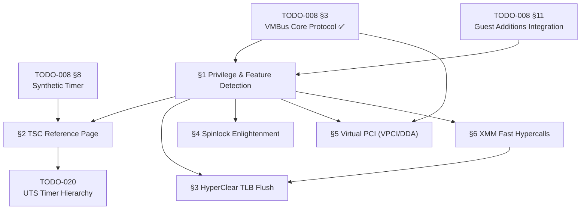

# TODO-008.09 — Hyper-V Enlightenments (Competitive Advantage)

> **Goal:** Implement advanced Hyper-V enlightenments that go beyond basic VMBus
> support to deliver competitive VM performance. These paravirtual optimizations
> eliminate costly VM-exits for timekeeping, TLB flushes, PCI device access, and
> spinlock contention — making Impossible OS the **fastest non-Windows guest on
> Hyper-V**.

> [!CAUTION]
> **Memory Rule:** Use `pmm_alloc_contiguous()` for TSC reference pages (4 KB),
> hypercall input/output pages, and any DMA-accessible buffers. `kmalloc` is ONLY
> for small kernel structs (≤ 4 KB). See `rules.md` Known Gotchas.

> [!IMPORTANT]
> **Spec Reference:** All data structures, CPUID leaves, MSR layouts, hypercall
> codes, and algorithms reference the
> [Advanced Enlightenments Specification](file:///home/derickpayne/impossible-os/specs/hyper-v/advanced-enlightenments.md)
> in the repo at `specs/hyper-v/advanced-enlightenments.md`.
>
> **Legal:** Clean-room implement from the
> [Hyper-V TLFS](https://learn.microsoft.com/en-us/virtualization/hyper-v-on-windows/tlfs/tlfs)
> (public spec). Do NOT reference Linux `arch/x86/hyperv/` source (GPL contamination risk).

> [!WARNING]
> **Prerequisites:** The VMBus core protocol (§3), SynIC, and hypercall page must
> be fully functional before any enlightenments can be activated. Attempting to
> use paravirtualized interfaces without explicit hypervisor authorization will
> result in `#UD` (Invalid Opcode) or `#GP` (General Protection) faults.

---

## TODO Completion Roadmap (Cross-File)

> [!IMPORTANT]
> **This file covers Hyper-V performance enlightenments — the competitive
> differentiator.** All sections depend on the VMBus core (TODO-008 §3) and
> Guest Additions framework (TODO-008 §11). Within this file, the dependency
> chain is: privilege detection → TSC reference page → HyperClear TLB →
> spinlock enlightenment → VPCI/DDA. Each enlightenment is independently
> gated by CPUID feature bits and gracefully skips if not available.

### Dependency Graph



### Phase-by-Phase Implementation Order

| ⭐ | Phase  | Section                              | What It Delivers                                                     | Depends On                     | Status |
| -- | :----: | ------------------------------------ | -------------------------------------------------------------------- | ------------------------------ | :----: |
| 💎 | **0**  | `specs/hyper-v/advanced-enlightenments.md` | Wire formats, CPUID leaves, MSR layouts — **read before coding** | —                              |   ✅   |
| 💎 | **0**  | `TODO-008 §3` VMBus Core Protocol   | Hypercall page, SynIC, version negotiation                           | —                              |   ✅   |
| 💎 | **1**  | §1 Privilege & Feature Detection     | CPUID gating for all enlightenments, feature flags struct            | Phase 0 (VMBus)                |   ⬜   |
| 💎 | **2**  | §2 TSC Reference Page               | Zero-VM-exit nanosecond clock reads — **78% latency reduction**      | Phase 1 (§1)                   |   ⬜   |
| 💎 | **2**  | §4 Spinlock Enlightenment            | Resolve LCP pathology — linear SMP scalability to 64 vCPUs           | Phase 1 (§1)                   |   ⬜   |
| 💎 | **3**  | §3 HyperClear TLB Flush             | Paravirt TLB invalidation — **85% TLB flush latency reduction**      | Phase 1 (§1)                   |   ⬜   |
| 💎 | **3**  | §6 XMM Fast Hypercalls              | SSE register packing — accelerates HyperClear pipeline               | Phase 1 (§1)                   |   ⬜   |
| 💎 | **4**  | §5 Virtual PCI (VPCI/DDA)           | Direct GPU/NVMe passthrough via VMBus — near-native I/O              | Phase 0 (VMBus) + Phase 1 (§1) |   ⬜   |

> [!NOTE]
> **Phase 1** is the foundation — CPUID privilege detection gates everything else.
> **Phase 2** delivers the highest-impact enlightenments: TSC reference page (78% clock
> latency reduction) and spinlock enlightenment (linear SMP scalability).
> **Phase 3** adds TLB flush optimization and XMM fast hypercall acceleration.
> **Phase 4** enables direct device assignment for GPU/NVMe passthrough.

> [!TIP]
> **Quick wins after Phase 1:**
> - §4 Spinlock Enlightenment is the simplest — just a single hypercall (`0x0008`) on
>   excessive spin. Can be implemented in under 50 lines.
> - §2 TSC Reference Page gives the most dramatic improvement — clock reads drop from
>   ~800 ns (trapped RDTSC) to ~15 ns (pure user-space computation).
>
> **Critical gotcha:** All enlightenments MUST check their corresponding CPUID privilege
> bits before activation. Using an unprivileged enlightenment causes `#UD` or `#GP` faults.
> §1 (Feature Detection) must be implemented first.

---

## 1. Privilege & Feature Detection

**Prompt:** Extend the existing Hyper-V detection in `cpuid_platform.c` and `vmbus.c` to query the full privilege mask (CPUID `0x40000003`) and implementation recommendations (CPUID `0x40000004`). Store results in a `struct hv_enlightenment_features` that gates each enlightenment subsystem. Verify the interface signature `"Hv#1"` at leaf `0x40000001`. Parse the privilege mask for `AccessPartitionReferenceTsc` (EAX bit 9), `AccessSynicRegs` (EAX bit 2), and XMM Fast Hypercall support (EDX bits 4 and 15). Parse recommendations for TLB flush (EAX bits 1–2), extended processor masks (EAX bit 11), relaxed timing (EAX bit 5), and spinlock retry threshold (EBX). If relaxed timing is recommended, disable aggressive DPC and clock watchdog timers. After completing all items, mark every item as `[x]`, update this prompt to a verification prompt, run `bash scripts/build.sh clean`, and commit as `"hyperv: enlightenment privilege and feature detection"`. Add notes directly in this TODO section. After implementation, save any gotchas, solutions, and important information to MCP memory (`mcp_memory_create_entities` / `mcp_memory_add_observations`).

- [ ] Define `struct hv_enlightenment_features` in `include/kernel/drivers/hyperv/hv_enlighten.h`:
  - [ ] `bool tsc_ref_page` — gated by `0x40000003` EAX bit 9
  - [ ] `bool flush_virtual_address_space` — gated by `0x40000004` EAX bit 1
  - [ ] `bool flush_virtual_address_list` — gated by `0x40000004` EAX bit 2
  - [ ] `bool extended_processor_masks` — gated by `0x40000004` EAX bit 11
  - [ ] `bool relaxed_timing` — gated by `0x40000004` EAX bit 5
  - [ ] `bool xmm_fast_hypercall_input` — gated by `0x40000003` EDX bit 4
  - [ ] `bool xmm_fast_hypercall_output` — gated by `0x40000003` EDX bit 15
  - [ ] `uint32_t spinlock_retry_threshold` — from `0x40000004` EBX
- [ ] Create `src/kernel/drivers/hyperv/hv_enlighten.c`:
  - [ ] Implement `hv_enlighten_detect()` — reads CPUID leaves, populates feature struct
  - [ ] Verify interface signature `0x40000001` EAX == `0x31237648` (`"Hv#1"`)
  - [ ] Verify maximum leaf `0x40000000` EAX ≥ `0x40000005`
  - [ ] Parse `HV_PARTITION_PRIVILEGE_MASK` from `0x40000003` EAX:EBX
  - [ ] Parse implementation recommendations from `0x40000004` EAX:EBX
- [ ] Implement `hv_enlighten_get_features()` — returns pointer to feature struct (read-only)
- [ ] If `relaxed_timing` is set: disable aggressive DPC and clock watchdog timers
  - [ ] Log: `[HV] Relaxed timing enabled — DPC watchdog disabled`
- [ ] Log all detected features:
  - [ ] `[HV] Enlightenments: TSC=%s TLB_FULL=%s TLB_LIST=%s SPIN=%u XMM=%s`
- [ ] Call `hv_enlighten_detect()` from `vmbus_init()` after hypercall page setup
- [ ] Gracefully skip on non-Hyper-V platforms (zero-init features struct)
- [ ] Commit: `"hyperv: enlightenment privilege and feature detection"`

---

## 2. TSC Reference Page (Fast Clocksource)

> **XREF:** [TODO-008-Hyper-V-Runner.md §8](../TODO-008-Hyper-V-Runner.md) — Hyper-V Synthetic Timer
> **XREF:** [TODO-020-Threading-Synchronization.md](../../010-Kernel-Foundations/TODO-020-Threading-Synchronization.md) — UTS Timer Hierarchy

**Prompt:** Implement the TSC Reference Page enlightenment for zero-VM-exit nanosecond-granularity clock reads. Allocate a zeroed 4 KB page via `pmm_alloc_contiguous(1)`, register it via `WRMSR` to MSR `0x40000021` with Enable bit 0 set. The hypervisor overlays `HV_REFERENCE_TSC_PAGE` onto this page — containing `tsc_sequence` (seqlock counter), `tsc_scale` (64-bit scale factor), and `tsc_offset` (signed 64-bit offset). Implement the reference time computation: `ReferenceTime = ((VirtualTsc × TscScale) >> 64) + TscOffset` using a 128-bit multiplication via `mulq`. Use the seqlock protocol: read `tsc_sequence`, memory barrier, read scale/offset, RDTSC, memory barrier, verify `tsc_sequence` unchanged and even — retry if torn. Handle `tsc_sequence == 0` (live migration) by falling back to `HV_X64_MSR_TIME_REF_COUNT` (MSR `0x40000020`). Integrate as highest-priority clocksource (rating 400) in the UTS timer hierarchy. After completing all items, mark every item as `[x]`, update this prompt to a verification prompt, run `bash scripts/build.sh clean`, and commit as `"hyperv: TSC reference page clocksource"`. Add notes directly in this TODO section. After implementation, save any gotchas, solutions, and important information to MCP memory (`mcp_memory_create_entities` / `mcp_memory_add_observations`).

### 2.1 TSC Reference Page Initialization

- [ ] Gate on `hv_enlighten_get_features()->tsc_ref_page` (CPUID `0x40000003` EAX bit 9)
- [ ] Allocate 4 KB page-aligned physical memory via `pmm_alloc_contiguous(1)`
- [ ] Zero the page contents to prevent state confusion
- [ ] Register via `WRMSR` to MSR `0x40000021`:
  - [ ] Bit 0 = Enable (set to 1)
  - [ ] Bits 1–11 = Reserved (must be zero)
  - [ ] Bits 12–63 = GPFN (Guest Physical Page Number: `phys_addr >> 12`)
- [ ] Map the physical page into kernel virtual space with read-only access
- [ ] Define `struct hv_reference_tsc_page` (packed, volatile fields):
  - [ ] `volatile uint32_t tsc_sequence` — seqlock counter
  - [ ] `uint32_t reserved1`
  - [ ] `volatile uint64_t tsc_scale` — 64-bit scale factor
  - [ ] `volatile int64_t tsc_offset` — signed 64-bit offset
  - [ ] `uint64_t reserved2[509]` — pad to 4 KB
- [ ] Log: `[HV] TSC reference page enabled at GPFN 0x%llx`

### 2.2 Reference Time Computation

- [ ] Implement `mul64_high(a, b)` — returns upper 64 bits of 128-bit product:
  - [ ] Use inline `mulq` assembly: `"mulq %2" : "=d"(hi) : "a"(a), "r"(b)`
- [ ] Implement `hv_read_reference_time()` — returns time in 100-nanosecond units:
  - [ ] Seqlock protocol:
    1. Read `tsc_sequence` → `local_seq`
    2. `smp_rmb()` (read memory barrier)
    3. Read `tsc_scale` and `tsc_offset`
    4. Execute native `RDTSC` → `virtual_tsc`
    5. `smp_rmb()` (read memory barrier)
    6. Read `tsc_sequence` again → `check_seq`
    7. If `local_seq != check_seq` OR `local_seq & 1` → discard and restart
    8. Compute: `ref_time = mul64_high(virtual_tsc, tsc_scale) + tsc_offset`
  - [ ] Return `ref_time` (100-nanosecond units)
- [ ] Handle `tsc_sequence == 0` (live migration / temporarily invalid):
  - [ ] Fall back to `RDMSR(0x40000020)` — `HV_X64_MSR_TIME_REF_COUNT`
  - [ ] Log: `[HV] TSC reference page temporarily invalid — fallback to MSR`

### 2.3 UTS Clocksource Integration

- [ ] Register as highest-priority clocksource in UTS timer hierarchy:
  - [ ] Rating: **400** (strictly overrides LAPIC timer at 200 and HPET at 100)
  - [ ] Name: `"hv_tsc_ref"`
  - [ ] No VM-exit, ~15 ns latency
- [ ] Provide nanosecond conversion: `ref_time × 100` → nanoseconds
- [ ] Benchmark: compare against LAPIC timer (`~120 ns`) and raw RDTSC (`~800 ns` trapped)
- [ ] Log: `[HV] Clocksource: hv_tsc_ref (rating 400, ~15ns latency)`
- [ ] Commit (with §2): `"hyperv: TSC reference page clocksource"`

---

## 3. HyperClear: Paravirtual TLB Flush

> **XREF:** [TODO-063.09-APIC-Architecture.md §6](../../060-Hardware-Drivers/TODO-063-Drivers/TODO-063.09-APIC-Architecture.md) — IPI Handlers and TLB Shootdown

**Prompt:** Implement the HyperClear TLB flush enlightenments to replace expensive IPI-based TLB shootdowns with efficient hypercalls. In a virtualized SMP environment, native TLB shootdown triggers cascading VM-exits: IPI send (exit) → target vCPU preemption → `INVLPG` (exit) → ACK wait. Hyper-V's HyperClear delegates the entire shootdown to the hypervisor, which directly invalidates TLBs for running vCPUs and flags unscheduled ones. Implement `HvFlushVirtualAddressSpace` (call code `0x0002`) for full-CR3 flushes and `HvFlushVirtualAddressList` (call code `0x0003`) for targeted page-range invalidation. Wire into kernel `flush_tlb_range()` and `flush_tlb_all()` as platform-specific overrides when on Hyper-V. Gate on CPUID `0x40000004` EAX bits 1–2. After completing all items, mark every item as `[x]`, update this prompt to a verification prompt, run `bash scripts/build.sh clean`, and commit as `"hyperv: HyperClear paravirtual TLB flush"`. Add notes directly in this TODO section. After implementation, save any gotchas, solutions, and important information to MCP memory (`mcp_memory_create_entities` / `mcp_memory_add_observations`).

### 3.1 HvFlushVirtualAddressSpace (Call Code 0x0002)

- [ ] Gate on `hv_enlighten_get_features()->flush_virtual_address_space`
- [ ] Implement hypercall input structure (24 bytes):
  - [ ] `AddressSpace` (8 bytes) — CR3 value (page directory physical base)
  - [ ] `Flags` (8 bytes) — flush behavior bitmask:
    - [ ] Bit 0: `HV_FLUSH_ALL_PROCESSORS` — ignore ProcessorMask, flush all vCPUs
    - [ ] Bit 1: `HV_FLUSH_ALL_VIRTUAL_ADDRESS_SPACES` — ignore AddressSpace, global
    - [ ] Bit 2: `HV_FLUSH_NON_GLOBAL_MAPPINGS_ONLY` — preserve global "G" PTE entries
  - [ ] `ProcessorMask` (8 bytes) — 64-bit bitmap, one bit per vCPU
- [ ] Implement `hv_flush_tlb_all(uint64_t cr3)`:
  - [ ] Set flags: `HV_FLUSH_ALL_PROCESSORS | HV_FLUSH_NON_GLOBAL_MAPPINGS_ONLY`
  - [ ] Issue hypercall `0x0002` via hypercall page
  - [ ] Check return status (`HV_STATUS_SUCCESS` = 0)
- [ ] Implement `hv_flush_tlb_current(uint64_t cr3)`:
  - [ ] Set `ProcessorMask` to current vCPU only
  - [ ] Issue hypercall `0x0002`

### 3.2 HvFlushVirtualAddressList (Call Code 0x0003)

- [ ] Gate on `hv_enlighten_get_features()->flush_virtual_address_list`
- [ ] Implement HV_GVA encoding format:
  - [ ] Bits 63–12: Base GVA (page-aligned virtual address)
  - [ ] Bits 11–0: Additional page count (0–4095 → flush 1–4096 pages per entry)
- [ ] Implement Rep hypercall RCX format:
  - [ ] Bits 15:0 — Call Code (`0x0003`)
  - [ ] Bits 43:32 — RepCount (total HV_GVA entries)
  - [ ] Bits 59:48 — RepStartIndex (for resumable processing)
- [ ] Implement `hv_flush_tlb_range(uint64_t cr3, uintptr_t start, size_t pages)`:
  - [ ] Build HV_GVA array with range encoding
  - [ ] Set flags: `HV_FLUSH_ALL_PROCESSORS | HV_FLUSH_NON_GLOBAL_MAPPINGS_ONLY`
  - [ ] Issue rep hypercall `0x0003`
  - [ ] Handle partial completion: re-issue with updated RepStartIndex

### 3.3 Kernel Integration

- [ ] Override `flush_tlb_range()` when Hyper-V HyperClear is available:
  - [ ] If enlightened: call `hv_flush_tlb_range()` or `hv_flush_tlb_all()`
  - [ ] If not enlightened: fall back to native IPI + `INVLPG` path
- [ ] Wire into `vmm_unmap_page()`, `vmm_map_page()` (SMP TLB coherency)
- [ ] Log: `[HV] HyperClear TLB flush: full=%s list=%s`
- [ ] Commit (with §3): `"hyperv: HyperClear paravirtual TLB flush"`

---

## 4. Spinlock Enlightenment (HvCallNotifyLongSpinWait)

**Prompt:** Implement the paravirtualized spinlock enlightenment to resolve the Lock Contender Preemption (LCP) pathology in overcommitted Hyper-V environments. When a vCPU spins on a contended lock for longer than the hypervisor-recommended threshold, issue `HvCallNotifyLongSpinWait` (call code `0x0008`) to yield the time slice. The hypervisor then locates the unscheduled vCPU holding the lock and context-switches it onto a physical core. Read the spin threshold from CPUID `0x40000004` EBX: `0x00000000` = unsupported (use hardware PAUSE only), `0xFFFFFFFF` = never notify (not overcommitted), any other N = spin N times then issue hypercall. Integrate into kernel `spin_lock()`. After completing all items, mark every item as `[x]`, update this prompt to a verification prompt, run `bash scripts/build.sh clean`, and commit as `"hyperv: paravirtualized spinlock enlightenment"`. Add notes directly in this TODO section. After implementation, save any gotchas, solutions, and important information to MCP memory (`mcp_memory_create_entities` / `mcp_memory_add_observations`).

### 4.1 Spin Threshold Detection

- [ ] Read threshold from `hv_enlighten_get_features()->spinlock_retry_threshold`
- [ ] Interpret threshold value:
  - [ ] `0x00000000` — enlightenment unsupported/disabled → use hardware `PAUSE` only
  - [ ] `0xFFFFFFFF` — hypervisor requests no notifications (not overcommitted) → infinite spin
  - [ ] Any other `N` — spin N iterations, then issue `HvCallNotifyLongSpinWait`
- [ ] Store `hv_spinlock_threshold` as global for spinlock fast path
- [ ] Log: `[HV] Spinlock threshold: %u iterations`

### 4.2 HvCallNotifyLongSpinWait (Call Code 0x0008)

- [ ] Implement `hv_notify_long_spin_wait(uint32_t spin_count)`:
  - [ ] Simple hypercall (not rep) — call code `0x0008`
  - [ ] Input (8 bytes via RDX — Fast Hypercall ABI):
    - [ ] Offset 0: `SpinCount` (32 bits) — accumulated spin iterations
    - [ ] Offset 4: `RsvdZ` (32 bits) — reserved, must be zero
  - [ ] Hypervisor response: yields spinning vCPU, reschedules lock holder

### 4.3 Kernel Spinlock Integration

- [ ] Modify `spin_lock()` to use enlightened path when available:
  ```
  spin_count = 0
  while atomic_exchange(&lock->locked, 1) != 0:
      spin_count++
      if threshold != 0 AND threshold != 0xFFFFFFFF
         AND (spin_count % threshold) == 0:
          hv_notify_long_spin_wait(spin_count)
      else:
          PAUSE
  ```
- [ ] Ensure `PAUSE` is still issued between spins (avoid memory bus flooding)
- [ ] No-op when: not on Hyper-V, threshold == 0, threshold == 0xFFFFFFFF
- [ ] Log: `[HV] Spinlock enlightenment active (threshold=%u)`
- [ ] Commit (with §4): `"hyperv: paravirtualized spinlock enlightenment"`

---

## 5. Virtual PCI (VPCI) and Direct Device Assignment

> **XREF:** [TODO-063-Drivers.md §10](../../060-Hardware-Drivers/TODO-063-Drivers.md) — PCI Enumeration

**Prompt:** Implement the Virtual PCI (vPCI) protocol for Discrete Device Assignment (DDA) and SR-IOV device passthrough. Physical devices (GPU, NVMe) are presented as VMBus channel offers with a vPCI Class GUID. The guest opens the channel, negotiates the PCI protocol version (`PCI_PROTOCOL_VERSION_1_4`), queries bus relations to discover attached PCI functions, and establishes a dual identity: VMBus ID for control and PCI hierarchy ID for standard driver attachment. Configuration space reads/writes are brokered over VMBus messages (`PCI_READ_BLOCK`, `PCI_WRITE_BLOCK`). MSI/MSI-X interrupt vectors are registered via `PCI_CREATE_INTERRUPT`. After completing all items, mark every item as `[x]`, update this prompt to a verification prompt, run `bash scripts/build.sh clean`, and commit as `"hyperv: Virtual PCI and Direct Device Assignment"`. Add notes directly in this TODO section. After implementation, save any gotchas, solutions, and important information to MCP memory (`mcp_memory_create_entities` / `mcp_memory_add_observations`).

### 5.1 VMBus vPCI Channel Setup

- [ ] Define vPCI message types (base constant `PCI_MESSAGE_BASE = 0x42490000`):
  - [ ] `PCI_QUERY_BUS_RELATIONS` (`+1`) — enumerate attached PCI functions
  - [ ] `PCI_READ_BLOCK` (`+9`) — configuration space read
  - [ ] `PCI_WRITE_BLOCK` (`+0xA`) — configuration space write
  - [ ] `PCI_CREATE_INTERRUPT` (`+0x14`) — MSI/MSI-X vector registration
- [ ] Detect vPCI VMBus channel offer by Class GUID
- [ ] Open channel: allocate ring buffers via `pmm_alloc_contiguous()`
- [ ] Negotiate protocol version: send `pci_version_request (PCI_PROTOCOL_VERSION_1_4)`
  - [ ] Fallback: `1_3` → `1_2` → `1_1` if host rejects

### 5.2 Bus Relations and Device Enumeration

- [ ] Issue `PCI_QUERY_BUS_RELATIONS` to the VSP
- [ ] Parse response: map VMBus instance to `win_slot_encoding` (ARI format):
  - [ ] Bits 4:0 — Device ID (5-bit PCI device identifier)
  - [ ] Bits 7:5 — Function ID (3-bit PCI function identifier)
- [ ] Establish dual identity for each discovered device:
  - [ ] VMBus identity — for asynchronous control operations (config reads, interrupt setup)
  - [ ] PCI hierarchy identity — for standard kernel driver attachment
- [ ] Synthesize PCI Domain ID from VMBus Instance GUID (bytes 4–5)
- [ ] Create virtual host bridge for the synthesized domain
- [ ] Integrate with kernel `pci_scan_bus()` — traverse synthetic domain as bare-metal PCI

### 5.3 Configuration Space and MMIO

- [ ] Implement `vpci_cfg_read(dev, offset, size)`:
  - [ ] Send `PCI_READ_BLOCK` VMBus message with offset and size
  - [ ] Receive response with configuration data
- [ ] Implement `vpci_cfg_write(dev, offset, size, value)`:
  - [ ] Send `PCI_WRITE_BLOCK` VMBus message
- [ ] Map BAR MMIO windows allocated by hypervisor for DDA/SR-IOV devices
- [ ] Wire `vpci_cfg_read`/`vpci_cfg_write` into PCI configuration space ops for VMBus-backed devices

### 5.4 Interrupt Targeting and Rebalancing

- [ ] Implement MSI/MSI-X vector registration via `PCI_CREATE_INTERRUPT`:
  - [ ] Build `tran_int_desc` (Translating Interrupt Descriptor):
    - [ ] `vector` (8 bits) — target interrupt vector in guest IDT
    - [ ] `delivery_mode` (3 bits) — Fixed, Lowest Priority, etc.
    - [ ] `cpu_mask` (64 bits) — target vCPU bitmap
- [ ] Handle interrupt retargeting (rebalance across cores):
  - [ ] Send retargeting message via VMBus channel to update IOMMU mapping
  - [ ] No device pause required — hypervisor handles live remapping
- [ ] Integrate with kernel interrupt affinity infrastructure
- [ ] Commit (with §5): `"hyperv: Virtual PCI and Direct Device Assignment"`

---

## 6. XMM Fast Hypercall Optimization

**Prompt:** Implement XMM Fast Hypercall input/output to accelerate hypercall parameter passing. When CPUID `0x40000003` EDX bit 4 is set, the OS can pack up to **112 bytes** of hypercall input directly into `XMM0`–`XMM5` SSE registers, bypassing guest memory structure decoding latency. When EDX bit 15 is set, output can similarly be received via XMM registers. This primarily accelerates the HyperClear TLB flush pipeline where input structures are small and frequent. After completing all items, mark every item as `[x]`, update this prompt to a verification prompt, run `bash scripts/build.sh clean`, and commit as `"hyperv: XMM fast hypercall optimization"`. Add notes directly in this TODO section. After implementation, save any gotchas, solutions, and important information to MCP memory (`mcp_memory_create_entities` / `mcp_memory_add_observations`).

- [ ] Gate on `hv_enlighten_get_features()->xmm_fast_hypercall_input` (CPUID `0x40000003` EDX bit 4)
- [ ] Gate output on `hv_enlighten_get_features()->xmm_fast_hypercall_output` (EDX bit 15)
- [ ] Implement `hv_hypercall_fast_xmm(call_code, input_buf, input_len)`:
  - [ ] Pack up to 112 bytes into `XMM0`–`XMM5` using `movdqu` instructions
  - [ ] Set Fast Hypercall flag in hypercall input value (RCX bit 16)
  - [ ] Execute hypercall via hypercall page
  - [ ] Extract output from `XMM0`–`XMM5` if output is enabled
- [ ] Save/restore XMM state around hypercall if necessary:
  - [ ] If caller is kernel code, XMM registers may be in use (unlikely in freestanding kernel)
  - [ ] Use `fxsave` / `fxrstor` or `xsave` / `xrstor` if SSE is live
- [ ] Integrate with HyperClear (§3): use XMM path for TLB flush input when available
- [ ] Log: `[HV] XMM fast hypercall: input=%s output=%s`
- [ ] Commit (with §6): `"hyperv: XMM fast hypercall optimization"`

---

## 7. Scaling Beyond 64 vCPUs (Extended Hypercalls)

**Prompt:** Implement extended variants of HyperClear hypercalls for systems with more than 64 vCPUs. The standard `ProcessorMask` is a single 64-bit integer, capping operations at 64 vCPUs. Extended calls replace this with a variably-sized `HV_VP_SET` structure — a sparse bitmap matrix of 64-bit memory banks. Gate on CPUID `0x40000004` EAX bit 11 (`HV_X64_EX_PROCESSOR_MASKS_RECOMMENDED`). After completing all items, mark every item as `[x]`, update this prompt to a verification prompt, run `bash scripts/build.sh clean`, and commit as `"hyperv: extended hypercalls for >64 vCPU scaling"`. Add notes directly in this TODO section. After implementation, save any gotchas, solutions, and important information to MCP memory (`mcp_memory_create_entities` / `mcp_memory_add_observations`).

- [ ] Gate on `hv_enlighten_get_features()->extended_processor_masks`
- [ ] Implement extended call variants:
  - [ ] `HvFlushVirtualAddressSpaceEx` (call code `0x0013`) — replaces `0x0002`
  - [ ] `HvFlushVirtualAddressListEx` (call code `0x0014`) — replaces `0x0003`
- [ ] Implement `HV_VP_SET` structure:
  - [ ] Sparse bitmap: array of 64-bit banks, each covering 64 vCPUs
  - [ ] Bank header specifies which bank indices are present (sparse encoding)
- [ ] Auto-select: use standard calls for ≤64 vCPUs, extended for >64
- [ ] Log: `[HV] Extended processor masks: enabled (>64 vCPU support)`
- [ ] Commit (with §7): `"hyperv: extended hypercalls for >64 vCPU scaling"`

---

## Key Files

| File                                                   | Change   | Purpose                                              |
| ------------------------------------------------------ | -------- | ---------------------------------------------------- |
| `src/kernel/drivers/hyperv/hv_enlighten.c`             | NEW      | Enlightenment detection, feature flags, init         |
| `include/kernel/drivers/hyperv/hv_enlighten.h`         | NEW      | Feature struct, public API, CPUID constants          |
| `src/kernel/drivers/hyperv/hv_tsc.c`                   | NEW      | TSC reference page clocksource                       |
| `include/kernel/drivers/hyperv/hv_tsc.h`               | NEW      | TSC page structure, read_reference_time() API        |
| `src/kernel/drivers/hyperv/hv_tlb.c`                   | NEW      | HyperClear TLB flush hypercalls                      |
| `include/kernel/drivers/hyperv/hv_tlb.h`               | NEW      | Flush input structures, public API                   |
| `src/kernel/drivers/hyperv/hv_spinlock.c`              | NEW      | Spinlock enlightenment (HvCallNotifyLongSpinWait)    |
| `include/kernel/drivers/hyperv/hv_spinlock.h`          | NEW      | Spinlock threshold, notify API                       |
| `src/kernel/drivers/hyperv/vpci.c`                     | NEW      | Virtual PCI protocol, DDA/SR-IOV support             |
| `include/kernel/drivers/hyperv/vpci.h`                 | NEW      | vPCI message types, bus relation structures          |
| `src/kernel/drivers/hyperv/vmbus.c`                    | MODIFY   | Add hv_enlighten_detect() call after hypercall setup |
| `src/kernel/sync/spinlock.c`                           | MODIFY   | Integrate enlightened spin_lock() path               |
| `src/kernel/cpuid_platform.c`                          | MODIFY   | Extended CPUID leaf parsing for privileges           |

---

## Priority Order

| ⭐ | Priority | Section                                | Description                                                        |
| -- | :------: | -------------------------------------- | ------------------------------------------------------------------ |
| 💎 | 🔴 P0    | §1 Privilege & Feature Detection       | Foundation — gates ALL other enlightenments                        |
| ⭐ | 🟠 P1    | §2 TSC Reference Page                  | **78% clock latency reduction** — zero-VM-exit nanosecond time    |
| ⭐ | 🟠 P1    | §4 Spinlock Enlightenment              | **Linear SMP scalability** — resolves LCP pathology on Hyper-V    |
| ⭐ | 🟡 P2    | §3 HyperClear TLB Flush               | **85% TLB flush latency reduction** — paravirt TLB invalidation   |
| 💎 | 🟡 P2    | §6 XMM Fast Hypercalls                 | Accelerates HyperClear pipeline — SSE register packing            |
| 💎 | 🟢 P3    | §5 Virtual PCI (VPCI/DDA)             | GPU/NVMe passthrough — near-native I/O throughput                 |
| 💎 | 🟢 P3    | §7 Extended Hypercalls (>64 vCPU)      | Server scaling — sparse bitmap processor sets                     |

> [!NOTE]
> ⭐ = Feature where Impossible OS can be **superior** to both Windows and Linux.

---

## Benchmark Targets

| Metric                          | Before Enlightenments | After Enlightenments | Target Improvement |
| ------------------------------- | --------------------- | -------------------- | :----------------: |
| Clock-read latency              | ~800 ns (trapped)     | ~15 ns (no VM-exit)  |    **78% ↓**       |
| TLB flush (4-vCPU, 100 pages)   | ~12 µs (IPI storm)    | ~1.8 µs (hypercall)  |    **85% ↓**       |
| Spinlock contention (64 vCPU)   | Non-linear thrashing  | Linear scalability   |    **∞**           |
| Hypercall input (112 bytes)     | ~200 ns (memory)      | ~80 ns (XMM)         |    **60% ↓**       |

---

## OS Comparison

| ⭐ | Feature                                  | 🪟 Windows 11 (Native)                   | 🐧 Linux 6.x (`arch/x86/hyperv/`)     | 🚀 Impossible OS                                         |
| -- | ---------------------------------------- | ----------------------------------------- | ---------------------------------------- | --------------------------------------------------------- |
| 💎 | CPUID privilege enumeration              | ✅ HAL detects all enlightenments          | ✅ `ms_hyperv_init_platform()`           | ⬜ §1 P0 — basic detection in cpuid_platform.c            |
| ⭐ | **TSC reference page (fast clock)**      | ✅ Native (default clocksource)            | ✅ `hyperv_timer.c` (rating 250)         | ⬜ §2 P1 — **zero-VM-exit nanosecond time (rating 400)** |
| ⭐ | **HyperClear global TLB flush**          | ✅ Native (`KeFlushTb`)                    | ✅ `hv_flush_remote_tlbs()`              | ⬜ §3.1 P2 — **hypercall 0x0002**                        |
| ⭐ | **HyperClear targeted TLB flush**        | ✅ Native                                  | ✅ `hv_flush_remote_tlbs_range()`        | ⬜ §3.2 P2 — **rep hypercall 0x0003 with GVA encoding**  |
| ⭐ | **Spinlock enlightenment**               | ✅ Native (HvCallNotifyLongSpinWait)       | ✅ `hv_vcpu_is_preempted()` + notify     | ⬜ §4 P1 — **hypervisor-aware spin waits**                |
| 💎 | Virtual PCI (VPCI) passthrough           | ✅ Native (DDA + SR-IOV)                   | ✅ `pci-hyperv.c`                        | ⬜ §5 P3 — VMBus-brokered PCI config + MSI               |
| 💎 | XMM fast hypercall input                 | ✅ Native                                  | ✅ `hv_do_fast_hypercall16()`            | ⬜ §6 P2 — SSE register packing (112 bytes)              |
| 💎 | Extended processor masks (>64 vCPU)      | ✅ Native                                  | ✅ `HV_VP_SET` in `hv_tlb.c`            | ⬜ §7 P3 — sparse bitmap matrix                          |
| 💎 | Relaxed timing                           | ✅ Auto-detected                           | ✅ `ms_hyperv.hints` check               | ⬜ §1 P0 — DPC watchdog disable                          |
| ⭐ | **All enlightenments in a hobby OS**     | ✅ Native (it IS the host)                 | ✅ Full `hv_*` module suite              | ⬜ **No hobby OS does this — unique differentiator**      |
