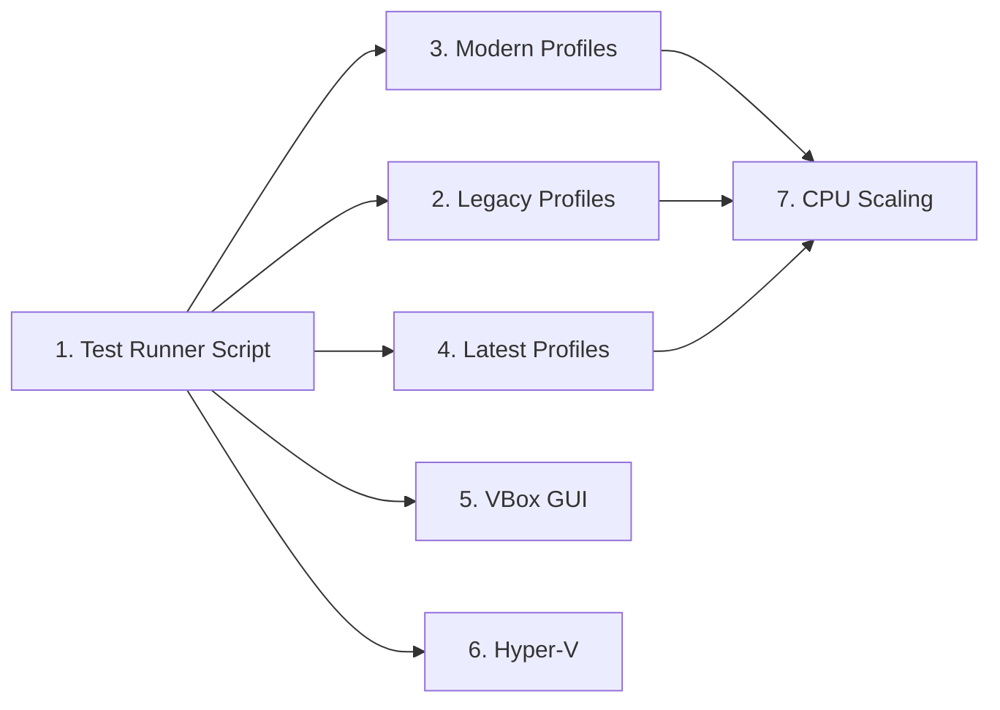

# Hardware Compatibility Testing Matrix

> **Goal:** Provide a comprehensive, automated testing framework that validates
> Impossible OS across three hardware eras — legacy (2005–2010), modern (2011–2023),
> and latest (2024+) — using a single unified test script with switches. Tests cover
> CPU model, core count, storage controller, disk size, RAM, NIC, display, and
> interrupt routing to ensure the OS runs correctly on the full spectrum of x86-64 hardware.

> [!CAUTION]
> **Memory Rule:** Use `pmm_alloc_contiguous()` for ALL buffers > 4 KB (fonts, images, file data). `kmalloc` is ONLY for small kernel structs (≤ 4 KB). Violating this crashes the 2 MiB heap silently. See `rules.md` Known Gotchas and `/add-asset` workflow.

> [!IMPORTANT]
> **Single Script Policy:** All tests are driven by a single shell script
> `scripts/test-matrix.sh` with profile switches and a batch wrapper
> `scripts/test-matrix.bat` for Windows. No per-test scripts in `scripts/`.

---

## Architecture Overview

### Virtual Testing Platforms

| Platform      | Host OS          | Best For                                          | CPU Models Available        |
| ------------- | ---------------- | ------------------------------------------------- | --------------------------- |
| **QEMU**      | Linux (WSL 2)    | CPU model emulation, legacy hardware, SMP testing | Core2duo → SapphireRapids   |
| **VirtualBox** | Windows          | GUI validation, USB passthrough, multi-monitor     | Host-dependent, 1–32 vCPUs  |
| **Hyper-V**   | Windows (native) | Paravirtualized testing, APIC-only, VMBus stack   | Host-dependent, Gen 1 + 2   |

### Hardware Era Definitions

| Era       | Years     | Typical CPU       | Storage    | NIC           | Display        | Interrupt |
| --------- | --------- | ----------------- | ---------- | ------------- | -------------- | --------- |
| Legacy    | 2005–2010 | Core2duo / Penryn | IDE / AHCI | RTL8139       | VGA 1024×768   | PIC + PIT |
| Modern    | 2011–2023 | Haswell / Skylake | AHCI       | VirtIO-net    | GOP 1280×720   | APIC      |
| Latest    | 2024+     | SapphireRapids    | VirtIO-blk | VirtIO-net    | GOP 1920×1080  | APIC + x2 |

---

## 1. Unified Test Runner Script

**Prompt:** Create `scripts/test-matrix.sh` — a single Bash script that runs all hardware compatibility tests via QEMU profile switches. The script accepts `--profile=<name>` to select a hardware era and `--cpus=<N>` to set vCPU count. It boots the OS in QEMU with the appropriate flags, captures serial output to a log file, and checks for `PANIC`, `FAULT`, or hang (timeout). A companion `scripts/test-matrix.bat` wrapper calls it from Windows via WSL. After completing all items, mark every item as `[x]`, run `bash scripts/build.sh clean`, and commit as `"tools: unified hardware test matrix script"`.

### Script Interface

```bash
# Run a single profile:
bash scripts/test-matrix.sh --profile=legacy-1cpu
bash scripts/test-matrix.sh --profile=modern-2cpu
bash scripts/test-matrix.sh --profile=latest-4cpu

# Run all profiles sequentially:
bash scripts/test-matrix.sh --all

# Run all legacy profiles:
bash scripts/test-matrix.sh --era=legacy

# Run all multi-CPU profiles:
bash scripts/test-matrix.sh --cpus=all

# Custom timeout (default: 30s):
bash scripts/test-matrix.sh --profile=modern-2cpu --timeout=60
```

### Script Requirements

- [ ] Create `scripts/test-matrix.sh` with profile-based QEMU invocation
- [ ] Create `scripts/test-matrix.bat` — Windows wrapper (calls WSL)
- [ ] Accept `--profile=<name>` switch for individual test profiles
- [ ] Accept `--era=<legacy|modern|latest>` to run all profiles in an era
- [ ] Accept `--cpus=<1|2|4|all>` to filter by CPU count
- [ ] Accept `--all` to run the complete matrix
- [ ] Accept `--timeout=<seconds>` (default: 30s per test)
- [ ] Capture serial output to `build/test-<profile>.log`
- [ ] Detect failures: `PANIC`, `FAULT`, `ASSERT`, triple fault (QEMU exit code)
- [ ] Detect hangs: kill QEMU process after `--timeout` seconds
- [ ] Print summary table at end: profile name, result (PASS/FAIL/HANG), duration
- [ ] Exit with non-zero if any test failed
- [ ] Commit: `"tools: unified hardware test matrix script"`

---

## 2. Legacy Hardware Profiles (2005–2010) — QEMU

> **Platform: QEMU** — only QEMU can emulate legacy CPU models (Core2duo, Penryn)
> and legacy storage controllers (IDE PIIX4). VirtualBox and Hyper-V always use
> modern hardware abstractions.

**Prompt:** Define QEMU profiles that emulate legacy desktop PCs from 2005–2010. These systems used Intel Core 2 Duo or Penryn CPUs, IDE or early AHCI storage, RTL8139 NICs, and standard VGA. The PIC + PIT interrupt path must be exercised (no APIC). Test with 1 CPU (single-core) and 2 CPUs (early dual-core). After completing all items, mark every item as `[x]`, run `bash scripts/build.sh clean`, and commit as `"tools: legacy hardware test profiles (2005-2010)"`.

### Profile Definitions

| Profile Name          | `-cpu`     | `-smp` | Storage          | NIC       | Display              | RAM   | Notes                          |
| --------------------- | ---------- | :----: | ---------------- | --------- | -------------------- | ----- | ------------------------------ |
| `legacy-1cpu`         | `core2duo` |   1    | `ide-hd` (PIIX4) | `rtl8139` | `-vga std` 1024×768  | 512M  | Single-core, PIC + PIT         |
| `legacy-2cpu`         | `core2duo` |   2    | `ide-hd` (PIIX4) | `rtl8139` | `-vga std` 1024×768  | 512M  | Dual-core, PIC→APIC transition |
| `legacy-ahci-1cpu`    | `Penryn`   |   1    | `ich9-ahci`      | `rtl8139` | `-vga std` 1024×768  | 1G    | Early AHCI (2008+)             |
| `legacy-ahci-2cpu`    | `Penryn`   |   2    | `ich9-ahci`      | `rtl8139` | `-vga std` 1024×768  | 1G    | Early AHCI + dual-core         |

### Test Checklist

- [ ] Define `legacy-1cpu`: Core2duo, 1 vCPU, IDE PIIX4, RTL8139, VGA 1024×768, 512 MB
- [ ] Define `legacy-2cpu`: Core2duo, 2 vCPU, IDE PIIX4, RTL8139, VGA 1024×768, 512 MB
- [ ] Define `legacy-ahci-1cpu`: Penryn, 1 vCPU, ich9-ahci, RTL8139, VGA 1024×768, 1 GB
- [ ] Define `legacy-ahci-2cpu`: Penryn, 2 vCPU, ich9-ahci, RTL8139, VGA 1024×768, 1 GB
- [ ] Verify: PIC + PIT interrupt path works (1 CPU profiles)
- [ ] Verify: PIC→APIC transition works (2 CPU profiles)
- [ ] Verify: IDE controller detected and disk mounted
- [ ] Verify: AHCI controller detected via PCI scan
- [ ] Verify: RTL8139 NIC initialized
- [ ] Verify: VGA framebuffer at 1024×768 (non-UEFI GOP)
- [ ] Verify: no `PANIC`, `FAULT`, or hang in serial output
- [ ] Commit: `"tools: legacy hardware test profiles (2005-2010)"`

---

## 3. Modern Hardware Profiles (2011–2023) — QEMU

> **Platform: QEMU** — emulates Haswell/Skylake with AHCI, VirtIO, and
> APIC-driven interrupts. This is the primary development configuration.

**Prompt:** Define QEMU profiles that emulate modern desktop/laptop PCs from 2011–2023. These systems use Intel Haswell or Skylake CPUs, AHCI storage, VirtIO networking, GOP framebuffers, and LAPIC/IOAPIC interrupt routing. Test with 1 CPU (reference), 2 CPUs (standard SMP), and 4 CPUs (multi-core stress). After completing all items, mark every item as `[x]`, run `bash scripts/build.sh clean`, and commit as `"tools: modern hardware test profiles (2011-2023)"`.

### Profile Definitions

| Profile Name          | `-cpu`    | `-smp` | Storage     | NIC         | Display              | RAM  | Notes                      |
| --------------------- | --------- | :----: | ----------- | ----------- | -------------------- | ---- | -------------------------- |
| `modern-1cpu`         | `Haswell` |   1    | `ich9-ahci` | `rtl8139`   | GOP 1280×720         | 2G   | Single-core APIC reference |
| `modern-2cpu`         | `Haswell` |   2    | `ich9-ahci` | `rtl8139`   | GOP 1280×720         | 2G   | Standard SMP (default dev) |
| `modern-4cpu`         | `Haswell` |   4    | `ich9-ahci` | `rtl8139`   | GOP 1280×720         | 2G   | Multi-core stress test     |
| `modern-skylake-2cpu` | `Skylake-Client` | 2 | `ich9-ahci` | `virtio-net` | GOP 1920×1080       | 4G   | Skylake + VirtIO NIC       |
| `modern-skylake-4cpu` | `Skylake-Client` | 4 | `ich9-ahci` | `virtio-net` | GOP 1920×1080       | 4G   | Skylake 4-core + HiDPI     |

### Test Checklist

- [ ] Define `modern-1cpu`: Haswell, 1 vCPU, AHCI, RTL8139, GOP 1280×720, 2 GB
- [ ] Define `modern-2cpu`: Haswell, 2 vCPU, AHCI, RTL8139, GOP 1280×720, 2 GB
- [ ] Define `modern-4cpu`: Haswell, 4 vCPU, AHCI, RTL8139, GOP 1280×720, 2 GB
- [ ] Define `modern-skylake-2cpu`: Skylake, 2 vCPU, AHCI, VirtIO-net, GOP 1920×1080, 4 GB
- [ ] Define `modern-skylake-4cpu`: Skylake, 4 vCPU, AHCI, VirtIO-net, GOP 1920×1080, 4 GB
- [ ] Verify: LAPIC/IOAPIC initialization (all profiles)
- [ ] Verify: AHCI disk detected via PCI and sectors readable
- [ ] Verify: SMP AP boot (INIT-SIPI-SIPI) succeeds on 2-CPU and 4-CPU profiles
- [ ] Verify: scheduler round-robin distributes across all available CPUs
- [ ] Verify: GOP framebuffer at configured resolution
- [ ] Verify: VirtIO-net initialization on Skylake profiles
- [ ] Verify: no `PANIC`, `FAULT`, or hang in serial output
- [ ] Commit: `"tools: modern hardware test profiles (2011-2023)"`

---

## 4. Latest Hardware Profiles (2024+) — QEMU

> **Platform: QEMU** — emulates Intel SapphireRapids (latest available in QEMU)
> with VirtIO storage, VirtIO networking, and x2APIC mode. Tests the bleeding-edge
> hardware path.

**Prompt:** Define QEMU profiles that emulate latest-generation server/workstation hardware (2024+). These systems use Intel SapphireRapids CPUs with x2APIC, VirtIO block storage (instead of AHCI), VirtIO NICs, high-resolution GOP displays, and large RAM. Test with 1 CPU (reference), 2 CPUs, and 4 CPUs. After completing all items, mark every item as `[x]`, run `bash scripts/build.sh clean`, and commit as `"tools: latest hardware test profiles (2024+)"`.

### Profile Definitions

| Profile Name           | `-cpu`           | `-smp` | Storage      | NIC          | Display             | RAM  | Notes                        |
| ---------------------- | ---------------- | :----: | ------------ | ------------ | ------------------- | ---- | ---------------------------- |
| `latest-1cpu`          | `SapphireRapids` |   1    | `virtio-blk` | `virtio-net` | GOP 1920×1080       | 4G   | Single-core x2APIC reference |
| `latest-2cpu`          | `SapphireRapids` |   2    | `virtio-blk` | `virtio-net` | GOP 1920×1080       | 4G   | Dual-core x2APIC             |
| `latest-4cpu`          | `SapphireRapids` |   4    | `virtio-blk` | `virtio-net` | GOP 2560×1440       | 8G   | Quad-core + HiDPI 1440p      |

### Test Checklist

- [ ] Define `latest-1cpu`: SapphireRapids, 1 vCPU, VirtIO-blk, VirtIO-net, GOP 1080p, 4 GB
- [ ] Define `latest-2cpu`: SapphireRapids, 2 vCPU, VirtIO-blk, VirtIO-net, GOP 1080p, 4 GB
- [ ] Define `latest-4cpu`: SapphireRapids, 4 vCPU, VirtIO-blk, VirtIO-net, GOP 1440p, 8 GB
- [ ] Verify: x2APIC MSR-based mode detected and used (if supported by kernel)
- [ ] Verify: VirtIO block device detected and disk mounted (IXFS partition)
- [ ] Verify: VirtIO NIC detected and DHCP response received
- [ ] Verify: SMP AP boot succeeds on 2-CPU and 4-CPU profiles
- [ ] Verify: GOP framebuffer at 1440p resolution (4-CPU profile)
- [ ] Verify: no `PANIC`, `FAULT`, or hang in serial output
- [ ] Commit: `"tools: latest hardware test profiles (2024+)"`

---

## 5. VirtualBox GUI Validation

> **Platform: VirtualBox** — used for GUI-specific validation that requires
> visual inspection: window rendering, mouse tracking, boot splash animation,
> desktop compositing. NOT used for hardware model testing (VBox doesn't emulate
> specific CPU models like QEMU does).

**Prompt:** Add VirtualBox-specific test profiles to the test matrix script for GUI validation. These tests use the existing `scripts/emulators/run-vbox.sh` infrastructure but are invoked via the unified `test-matrix.sh --profile=vbox-*` interface. Focus on display resolution testing and mouse integration. After completing all items, mark every item as `[x]`, run `bash scripts/build.sh clean`, and commit as `"tools: VirtualBox GUI validation profiles"`.

### Profile Definitions

| Profile Name          | vCPU | Storage     | Display        | RAM   | Notes                             |
| --------------------- | :--: | ----------- | -------------- | ----- | --------------------------------- |
| `vbox-720p-1cpu`      |  1   | AHCI (SATA) | 1280×720 32bpp | 2G    | Reference desktop (single-core)   |
| `vbox-1080p-2cpu`     |  2   | AHCI (SATA) | 1920×1080      | 2G    | Full HD + SMP                     |
| `vbox-4k-2cpu`        |  2   | AHCI (SATA) | 3840×2160      | 4G    | 4K HiDPI scaling validation       |

### Test Checklist

- [ ] Define `vbox-720p-1cpu`: 1 vCPU, AHCI, 1280×720, 2 GB
- [ ] Define `vbox-1080p-2cpu`: 2 vCPU, AHCI, 1920×1080, 2 GB
- [ ] Define `vbox-4k-2cpu`: 2 vCPU, AHCI, 3840×2160, 4 GB
- [ ] Integrate VBox profiles into `test-matrix.sh` (invoke `VBoxManage` + console)
- [ ] Verify: boot splash renders correctly at each resolution
- [ ] Verify: desktop wallpaper, taskbar, and window borders render without artifacts
- [ ] Verify: mouse cursor tracks smoothly with VBox mouse integration
- [ ] Verify: no `PANIC`, `FAULT`, or hang
- [ ] Commit: `"tools: VirtualBox GUI validation profiles"`

---

## 6. Hyper-V Paravirtualized Testing

> **Platform: Hyper-V** — the ONLY platform that exercises the VMBus stack,
> synthetic devices, and APIC-only mode. NOT used for legacy or display testing.

> **XREF:** [TODO-008-Hyper-V-Runner.md](TODO-008-Hyper-V-Runner.md) — Full Hyper-V Gen 2 support plan

**Prompt:** Add Hyper-V test profiles to the test matrix for paravirtualized testing. These test the VMBus stack, synthetic SCSI, synthetic HID, and APIC-only mode that cannot be tested on QEMU or VirtualBox. Invoked via `test-matrix.sh --profile=hyperv-*` which calls the existing `scripts/emulators/run-hyperv.ps1` infrastructure. After completing all items, mark every item as `[x]`, run `bash scripts/build.sh clean`, and commit as `"tools: Hyper-V paravirtual test profiles"`.

### Profile Definitions

| Profile Name          | Gen | vCPU | Storage        | NIC         | Display  | RAM  | Notes                    |
| --------------------- | :-: | :--: | -------------- | ----------- | -------- | ---- | ------------------------ |
| `hyperv-gen2-1cpu`    |  2  |  1   | Synthetic SCSI | Synthetic   | GOP      | 1G   | APIC-only, VMBus stack   |
| `hyperv-gen2-2cpu`    |  2  |  2   | Synthetic SCSI | Synthetic   | GOP      | 2G   | VMBus + SMP              |
| `hyperv-gen2-4cpu`    |  2  |  4   | Synthetic SCSI | Synthetic   | GOP      | 4G   | VMBus + multi-core       |

### Test Checklist

- [ ] Define `hyperv-gen2-1cpu`: Gen 2, 1 vCPU, Synthetic SCSI, 1 GB
- [ ] Define `hyperv-gen2-2cpu`: Gen 2, 2 vCPU, Synthetic SCSI, 2 GB
- [ ] Define `hyperv-gen2-4cpu`: Gen 2, 4 vCPU, Synthetic SCSI, 4 GB
- [ ] Integrate Hyper-V profiles into `test-matrix.sh` (invoke PowerShell via `run-hyperv.ps1`)
- [ ] Verify: `MADT PCAT_COMPAT=0` — APIC-only mode active (no PIC)
- [ ] Verify: VMBus detected and channels enumerated
- [ ] Verify: Synthetic SCSI disk mounted (when storvsc implemented)
- [ ] Verify: SMP AP boot succeeds on 2-CPU and 4-CPU profiles
- [ ] Verify: no `PANIC`, `FAULT`, or hang
- [ ] Commit: `"tools: Hyper-V paravirtual test profiles"`

---

## 7. CPU Scaling Stress Tests

> **Platform: QEMU** — fastest iteration for CPU count sweeps (1, 2, 4 vCPUs).

**Prompt:** Add CPU-scaling-specific test profiles that run the same hardware configuration with increasing vCPU counts to catch SMP race conditions, scheduler bugs, and APIC routing errors. Uses the `--cpus=all` switch to run all CPU count variants for a given era. After completing all items, mark every item as `[x]`, run `bash scripts/build.sh clean`, and commit as `"tools: CPU scaling stress test profiles"`.

### Validation Matrix

| vCPU | Interrupt Mode       | Expected Behavior                                  |
| :--: | -------------------- | -------------------------------------------------- |
|  1   | PIC + PIT (legacy)   | Single-core, no APIC, PIC-routed interrupts        |
|  1   | APIC (modern/latest) | Single-core APIC, no IPI needed                    |
|  2   | APIC                 | BSP + 1 AP, INIT-SIPI-SIPI, scheduler distributes  |
|  4   | APIC                 | BSP + 3 APs, full SMP, contention testing           |

### Test Checklist

- [ ] Define `smp-sweep-legacy`: Core2duo at 1 and 2 vCPUs
- [ ] Define `smp-sweep-modern`: Haswell at 1, 2, and 4 vCPUs
- [ ] Define `smp-sweep-latest`: SapphireRapids at 1, 2, and 4 vCPUs
- [ ] Verify: AP count matches `smp_get_cpu_count()` in serial output
- [ ] Verify: no deadlocks or lock contention panics at 4 vCPUs
- [ ] Verify: timer interrupts fire on all cores (LAPIC timer)
- [ ] Verify: IPI delivery succeeds (BSP→AP and AP→BSP)
- [ ] Commit: `"tools: CPU scaling stress test profiles"`

---

## Source Tree

```
scripts/
├── test-matrix.sh             # Unified test runner (all profiles)
├── test-matrix.bat            # Windows wrapper (calls WSL)
├── build.sh                   # Existing build script (unchanged)
└── emulators/
    ├── run-vbox.sh            # Existing VBox runner (unchanged)
    ├── run-vbox.bat           # Existing VBox wrapper (unchanged)
    ├── run-hyperv.ps1         # Existing Hyper-V runner (unchanged)
    └── run-hyperv.bat         # Existing Hyper-V wrapper (unchanged)
```

> [!TIP]
> **No new scripts in `scripts/`.** All 15+ test profiles are switches inside
> `test-matrix.sh`. The profile definitions are associative arrays in the script,
> not separate files.

---

## Priority Order

| Priority | Section                          | Reason                                                     |
| :------: | -------------------------------- | ---------------------------------------------------------- |
| 🔴 P0    | 1. Unified Test Runner Script    | **Foundation** — all profiles depend on this script        |
| 🔴 P0    | 3. Modern Hardware (2011–2023)   | Primary dev config — catches most regressions              |
| 🟠 P1    | 2. Legacy Hardware (2005–2010)   | Validates backward compat — IDE, PIC, low RAM              |
| 🟠 P1    | 7. CPU Scaling Stress Tests      | Catches SMP race conditions early                          |
| 🟡 P2    | 4. Latest Hardware (2024+)       | Forward compat — VirtIO-blk, x2APIC                       |
| 🟡 P2    | 5. VirtualBox GUI Validation     | Visual quality — manual inspection needed                  |
| 🟢 P3    | 6. Hyper-V Paravirtual Testing   | Blocked on VMBus synthetic drivers (§3–§7 in TODO-008)     |

---

## Implementation Order (Critical Path)



---

## OS Comparison

| Feature                             | 🪟 Windows 11             | 🐧 Linux                 | 🚀 Impossible OS                     |
| ----------------------------------- | ------------------------- | ------------------------- | ------------------------------------ |
| Automated hardware compat testing   | ✅ HLK (Hardware Lab Kit) | ✅ KernelCI + LAVA         | ⬜ §1 — test-matrix.sh              |
| Legacy hardware support (2005-era)  | ✅ Down to Vista-era HW   | ✅ Extensive legacy support | ⬜ §2 — Core2duo/IDE profiles       |
| Multi-CPU stress testing            | ✅ WinPE boot tests       | ✅ kselftest + LTP         | ⬜ §7 — SMP sweep profiles          |
| VirtIO driver testing               | ⬜ Windows guest only     | ✅ Native VirtIO drivers   | ⬜ §4 — VirtIO-blk + VirtIO-net     |
| Paravirtual testing (Hyper-V)       | ✅ Native                 | ✅ hv_* driver tests       | ⬜ §6 — blocked on VMBus drivers    |
| CI/CD automated test matrix         | ✅ Azure DevOps           | ✅ GitHub Actions + QEMU   | ⬜ Future — `test-matrix.sh` in CI  |
